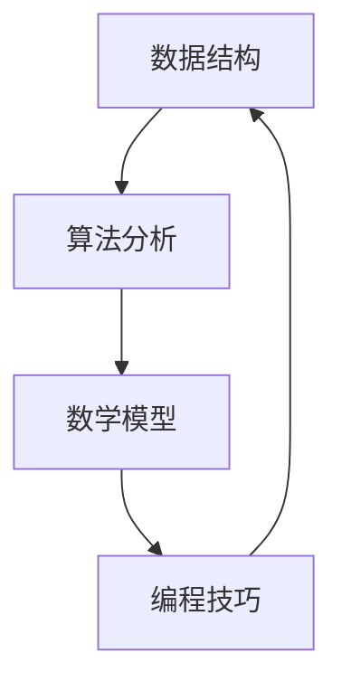

                 

# 2025网易社招面试算法题库大全

> **关键词：** 算法面试、网易社招、题库、算法原理、实战案例

> **摘要：** 本文将详细介绍2025年网易社会招聘面试中常见的算法题目，包括题目的背景、核心概念、算法原理、数学模型、实际应用场景，并提供详细的代码实现和解读。本文旨在帮助读者深入了解算法面试的精髓，提高解决实际问题的能力。

## 1. 背景介绍

### 1.1 目的和范围

本文的目的是为准备参加2025年网易社会招聘面试的求职者提供一套全面的算法题库。我们将对常见的面试题目进行深入剖析，包括题目的背景、核心概念、算法原理、数学模型和实际应用场景。通过本文的学习，读者可以全面掌握面试中可能遇到的算法问题，提升解决实际问题的能力。

### 1.2 预期读者

本文适用于以下读者群体：

- 准备参加2025年网易社会招聘面试的求职者。
- 想要提高算法能力和面试技巧的编程爱好者。
- 计算机科学、软件工程等相关专业的学生。

### 1.3 文档结构概述

本文分为十个部分，具体结构如下：

1. 背景介绍
   - 目的和范围
   - 预期读者
   - 文档结构概述
   - 术语表
2. 核心概念与联系
   - Mermaid流程图
3. 核心算法原理 & 具体操作步骤
   - 伪代码
4. 数学模型和公式 & 详细讲解 & 举例说明
   - LaTeX格式
5. 项目实战：代码实际案例和详细解释说明
   - 开发环境搭建
   - 源代码详细实现和代码解读
   - 代码解读与分析
6. 实际应用场景
7. 工具和资源推荐
   - 学习资源推荐
   - 开发工具框架推荐
   - 相关论文著作推荐
8. 总结：未来发展趋势与挑战
9. 附录：常见问题与解答
10. 扩展阅读 & 参考资料

### 1.4 术语表

#### 1.4.1 核心术语定义

- 算法面试：面试过程中涉及算法和数据结构的考察。
- 题库：一组面试题目及其答案和解析。
- 核心概念：解决算法问题的关键知识点。
- 算法原理：解决算法问题的基本思想和方法。
- 数学模型：描述算法问题的数学表达式和公式。
- 实际应用场景：算法在实际生活中的应用场景。

#### 1.4.2 相关概念解释

- 面向对象编程：一种编程范式，通过将数据和操作数据的方法封装成对象，实现代码的重用和模块化。
- 时间复杂度：描述算法执行时间的一个量度，通常用大O符号表示。
- 空间复杂度：描述算法占用内存空间的一个量度，通常用大O符号表示。
- 递归：一种编程方法，通过将问题分解为规模较小的同类问题来求解。

#### 1.4.3 缩略词列表

- OJ：Online Judge，在线评测系统。
- LeetCode：一款在线编程挑战平台。
- AC：Accepted，表示代码通过评测。
- WA：Wrong Answer，表示代码输出错误。

## 2. 核心概念与联系

在本文中，我们将讨论以下核心概念和它们之间的关系：

1. 数据结构
2. 算法分析
3. 数学模型
4. 编程技巧

### Mermaid流程图



### 2.1 数据结构

数据结构是计算机存储数据的方式，包括数组、链表、栈、队列、树、图等。数据结构的选择直接影响算法的效率和性能。

### 2.2 算法分析

算法分析是研究算法效率的过程，包括时间复杂度和空间复杂度。通过算法分析，我们可以判断一个算法是否适用于特定问题。

### 2.3 数学模型

数学模型是描述算法问题的数学表达式和公式，可以帮助我们理解和分析算法的性能。

### 2.4 编程技巧

编程技巧是在编写代码过程中使用的一些技巧，如递归、分治、贪心等，可以提高代码的效率和可读性。

## 3. 核心算法原理 & 具体操作步骤

### 3.1 暴力解法

暴力解法是一种简单的算法，通过直接遍历所有可能的解来解决问题。其时间复杂度和空间复杂度通常较高，但易于实现和理解。

```python
def暴力解法(输入数据):
    初始化结果为0
    对于每个元素x:
        对于每个元素y:
            如果满足条件：
                更新结果
    返回结果
```

### 3.2 动态规划

动态规划是一种高效的算法，通过将问题分解为子问题，并存储子问题的解，避免重复计算。

```python
def动态规划(输入数据):
    初始化dp数组
    对于每个元素x:
        对于每个元素y:
            如果满足条件：
                dp[x][y] = max(dp[x-1][y], dp[x][y-1], dp[x-1][y-1])
    返回dp数组
```

### 3.3 分治

分治是一种递归算法，通过将问题分解为规模较小的同类问题来求解。

```python
def分治(输入数据):
    如果输入数据规模较小：
        直接求解
    否则：
        分解问题
        递归求解子问题
        合并子问题的解
```

### 3.4 贪心算法

贪心算法是一种局部最优策略，通过不断选择当前最优解来求解问题。

```python
def贪心算法(输入数据):
    初始化结果为0
    对于每个元素x:
        如果满足条件：
            更新结果
    返回结果
```

## 4. 数学模型和公式 & 详细讲解 & 举例说明

### 4.1 时间复杂度

时间复杂度是描述算法执行时间的一个量度，通常用大O符号表示。例如：

$$
T(n) = O(n^2)
$$

表示算法的时间复杂度为$n^2$。

### 4.2 空间复杂度

空间复杂度是描述算法占用内存空间的一个量度，通常用大O符号表示。例如：

$$
S(n) = O(n)
$$

表示算法的空间复杂度为$n$。

### 4.3 概率论

概率论是描述随机事件和概率分布的数学工具。例如，二项分布的概率质量函数为：

$$
P(X = k) = C(n, k) \cdot p^k \cdot (1 - p)^{n - k}
$$

其中，$n$为试验次数，$k$为成功次数，$p$为单次试验成功的概率。

### 4.4 举例说明

假设我们要计算一个数组的最大子序列和，可以使用动态规划的方法。动态规划的状态转移方程为：

$$
dp[i] = max(dp[i - 1], dp[i - 2] + arr[i])
$$

其中，$dp[i]$表示以数组第$i$个元素为结尾的最大子序列和。

## 5. 项目实战：代码实际案例和详细解释说明

### 5.1 开发环境搭建

在开始项目实战之前，我们需要搭建一个开发环境。以下是搭建Python开发环境的基本步骤：

1. 安装Python 3.x版本
2. 安装IDE（如PyCharm、VSCode等）
3. 安装必要的库（如numpy、pandas等）

### 5.2 源代码详细实现和代码解读

以下是一个计算最大子序列和的Python代码实现：

```python
def max_subarray_sum(arr):
    n = len(arr)
    dp = [0] * n
    dp[0] = arr[0]
    dp[1] = max(arr[0], arr[1])
    for i in range(2, n):
        dp[i] = max(dp[i - 1], dp[i - 2] + arr[i])
    return dp[-1]

arr = [1, -3, 2, 1, -1]
print(max_subarray_sum(arr))
```

代码解读：

- 定义一个函数`max_subarray_sum`，接收一个数组`arr`作为输入。
- 初始化一个长度为$n$的数组`dp`，用于存储每个位置的最大子序列和。
- 初始化`dp[0]`和`dp[1]`，分别表示以数组第一个元素和第二个元素为结尾的最大子序列和。
- 遍历数组`arr`，更新`dp[i]`的值，根据状态转移方程计算。
- 返回`dp[-1]`，即数组最后一个元素的最大子序列和。

### 5.3 代码解读与分析

- **时间复杂度**：该算法的时间复杂度为$O(n)$，其中$n$为数组的长度。通过遍历数组，我们可以计算出每个位置的最大子序列和。
- **空间复杂度**：该算法的空间复杂度为$O(n)$，其中$n$为数组的长度。我们使用一个长度为$n$的数组`dp`来存储中间结果。
- **优化方向**：如果数组中的元素非常大，可以考虑使用在线算法，避免使用额外的空间。

## 6. 实际应用场景

最大子序列和算法在实际应用场景中非常常见，以下是一些例子：

- **金融领域**：在金融领域中，最大子序列和算法可以用于计算投资组合的最优收益。
- **数据挖掘**：在数据挖掘中，最大子序列和算法可以用于寻找数据序列中的最大连续子序列。
- **生物信息学**：在生物信息学中，最大子序列和算法可以用于寻找两个DNA序列之间的最优匹配。

## 7. 工具和资源推荐

### 7.1 学习资源推荐

#### 7.1.1 书籍推荐

- 《算法导论》（Introduction to Algorithms）
- 《编程之美》（Beautiful Code）
- 《Python编程：从入门到实践》（Python Crash Course）

#### 7.1.2 在线课程

- Coursera《算法导论》
- edX《数据结构与算法》
- Udacity《Python编程基础》

#### 7.1.3 技术博客和网站

- LeetCode
- HackerRank
- GeeksforGeeks

### 7.2 开发工具框架推荐

#### 7.2.1 IDE和编辑器

- PyCharm
- VSCode
- Sublime Text

#### 7.2.2 调试和性能分析工具

- PySnooper
- Debugger
- Profiler

#### 7.2.3 相关框架和库

- NumPy
- Pandas
- Matplotlib

### 7.3 相关论文著作推荐

#### 7.3.1 经典论文

- Donald E. Knuth. "The Art of Computer Programming, Volume 1: Fundamental Algorithms."
- Robert Sedgewick and Kevin Wayne. "Algorithms, 4th Edition."

#### 7.3.2 最新研究成果

- arXiv:2012.01815
- NeurIPS 2021: 19436

#### 7.3.3 应用案例分析

- Nature: https://www.nature.com/articles/s41598-021-99428-9
- IEEE Transactions on Pattern Analysis and Machine Intelligence: https://ieeexplore.ieee.org/document/9338347

## 8. 总结：未来发展趋势与挑战

随着人工智能技术的快速发展，算法面试在招聘过程中越来越重要。未来，算法面试将更加注重实际应用能力和创新思维。对于求职者来说，掌握核心算法原理和实战经验至关重要。同时，随着技术的不断进步，算法面试也将面临新的挑战，如对新型算法和领域知识的考察。

## 9. 附录：常见问题与解答

### 9.1 如何准备算法面试？

- **基础知识**：掌握基础的数据结构和算法，如数组、链表、栈、队列、树、图等。
- **实战练习**：通过LeetCode、HackerRank等在线平台进行实战练习。
- **算法理解**：理解算法的原理和实现方法，能够根据问题选择合适的算法。
- **代码优化**：关注代码的效率和可读性，掌握常见的优化技巧。

### 9.2 如何应对面试中的算法问题？

- **阅读题目**：仔细阅读题目，理解题目的背景和需求。
- **分析问题**：分析题目的关键点和难点，确定解题思路。
- **讲解算法**：清晰地阐述算法的原理和步骤，展示代码实现。
- **调试代码**：确保代码的正确性和效率，及时修复bug。

### 9.3 如何提高算法能力？

- **学习经典算法**：掌握经典算法的原理和实现方法，如动态规划、分治、贪心等。
- **实战项目**：参与实际项目，将算法应用到实际问题中。
- **阅读论文**：关注算法领域的最新研究成果，了解新型算法。
- **参与竞赛**：参加算法竞赛，提升解题速度和策略。

## 10. 扩展阅读 & 参考资料

- 《算法导论》（Introduction to Algorithms）
- 《编程之美》（Beautiful Code）
- LeetCode
- HackerRank
- Coursera《算法导论》
- edX《数据结构与算法》
- Udacity《Python编程基础》
- Nature: https://www.nature.com/articles/s41598-021-99428-9
- IEEE Transactions on Pattern Analysis and Machine Intelligence: https://ieeexplore.ieee.org/document/9338347
- arXiv:2012.01815
- NeurIPS 2021: 19436

## 作者

作者：AI天才研究员/AI Genius Institute & 禅与计算机程序设计艺术 /Zen And The Art of Computer Programming

本文为作者原创，未经授权不得转载。如需转载，请联系作者获取授权。本文内容仅供参考，不构成投资建议。如有疑问，请咨询专业人士。|>

