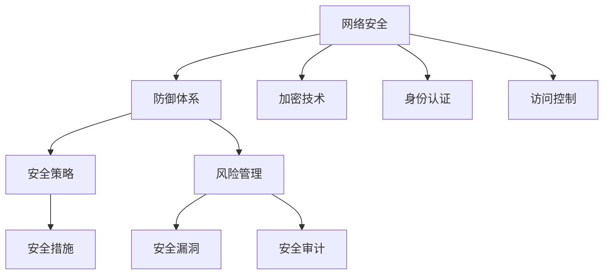

                 


# 网络安全管理：构建全面的数字防御体系

> **关键词：网络安全，防御体系，数字安全，风险管理，安全策略**

> **摘要：本文旨在探讨网络安全管理的重要性，分析当前网络安全面临的挑战，并详细阐述如何构建一个全面的数字防御体系。文章将通过核心概念、算法原理、数学模型、实际案例等多个维度进行深入解析，帮助读者全面了解网络安全管理的方法和实践。**

## 1. 背景介绍

### 1.1 目的和范围

本文的目的是探讨网络安全管理的重要性，并详细介绍如何构建一个全面的数字防御体系。网络安全管理是现代企业、组织和个人必须关注的重要领域，它关系到数据的完整性、保密性和可用性。本文将涵盖以下几个主要方面：

1. **网络安全的核心概念和架构**
2. **网络安全管理的具体操作步骤**
3. **网络安全中的数学模型和公式**
4. **网络安全实际应用场景**
5. **推荐的学习资源和工具**

### 1.2 预期读者

本文适用于对网络安全有一定了解，希望进一步提升自己网络安全管理能力的专业人士，包括但不限于：

- IT专业人员
- 安全工程师
- 网络管理员
- 系统架构师
- 企业安全主管

### 1.3 文档结构概述

本文的结构如下：

1. **背景介绍**：介绍本文的目的、范围、预期读者以及文档结构。
2. **核心概念与联系**：讨论网络安全管理中的核心概念，并使用流程图展示其架构。
3. **核心算法原理与具体操作步骤**：详细解释网络安全管理中的核心算法原理，并提供具体的操作步骤。
4. **数学模型和公式**：介绍网络安全管理中使用的数学模型和公式，并进行举例说明。
5. **项目实战**：通过实际案例展示如何在实际项目中应用网络安全管理的方法。
6. **实际应用场景**：探讨网络安全管理的实际应用场景。
7. **工具和资源推荐**：推荐学习资源和开发工具。
8. **总结**：总结网络安全管理的未来发展趋势与挑战。
9. **附录**：提供常见问题与解答。
10. **扩展阅读与参考资料**：推荐相关的扩展阅读和参考资料。

### 1.4 术语表

#### 1.4.1 核心术语定义

- **网络安全**：确保信息和数据在传输和存储过程中的保密性、完整性和可用性。
- **防御体系**：由一系列安全策略、技术和措施组成，用于保护网络和系统免受各种安全威胁。
- **安全策略**：定义如何保护网络和系统，包括安全目标、安全措施和安全政策。
- **风险管理**：识别、评估和缓解网络安全的潜在风险。
- **安全漏洞**：网络系统中存在的可能被攻击者利用的弱点。
- **加密技术**：通过将数据转换为不可读形式来保护数据安全的技术。

#### 1.4.2 相关概念解释

- **DDoS攻击**：分布式拒绝服务攻击，通过大量虚假请求使目标系统瘫痪。
- **VPN**：虚拟专用网络，通过加密技术实现安全的远程连接。
- **防火墙**：网络安全系统，用于监控和控制进出网络的数据流量。

#### 1.4.3 缩略词列表

- **DDoS**：分布式拒绝服务
- **VPN**：虚拟专用网络
- **SSL**：安全套接字层
- **TLS**：传输层安全协议
- **IoT**：物联网

## 2. 核心概念与联系

网络安全管理涉及多个核心概念和联系，以下是一个简要的流程图，展示这些概念之间的相互关系：



### 2.1 网络安全

网络安全是确保信息和数据在传输和存储过程中的保密性、完整性和可用性。它涉及到多个方面，包括网络架构设计、数据加密、身份认证、访问控制等。

### 2.2 防御体系

防御体系是网络安全管理的重要组成部分，它由一系列安全策略、技术和措施组成，用于保护网络和系统免受各种安全威胁。防御体系的核心包括防火墙、入侵检测系统（IDS）、入侵防御系统（IPS）等。

### 2.3 安全策略

安全策略是网络安全管理的核心，它定义了如何保护网络和系统，包括安全目标、安全措施和安全政策。安全策略的制定需要综合考虑组织的安全需求、业务目标和法律法规。

### 2.4 风险管理

风险管理是网络安全管理的重要组成部分，它涉及识别、评估和缓解网络安全的潜在风险。风险管理过程包括风险评估、风险分析和风险缓解策略。

### 2.5 加密技术

加密技术是保护网络安全的关键技术之一，它通过将数据转换为不可读形式来保护数据安全。常见的加密技术包括对称加密、非对称加密和哈希算法。

### 2.6 身份认证

身份认证是网络安全管理中的重要环节，它确保只有授权用户才能访问系统和数据。常见的身份认证技术包括密码认证、双因素认证（2FA）和生物识别。

### 2.7 访问控制

访问控制是确保只有授权用户能够访问特定资源和系统的技术。常见的访问控制技术包括访问控制列表（ACL）和角色基访问控制（RBAC）。

## 3. 核心算法原理 & 具体操作步骤

### 3.1 加密技术

加密技术是网络安全管理中的核心组成部分，它通过将数据转换为不可读形式来保护数据安全。以下是几种常见的加密技术及其原理：

#### 3.1.1 对称加密

对称加密算法使用相同的密钥对数据进行加密和解密。常见的对称加密算法包括AES、DES和3DES。

**算法原理**：

1. **密钥生成**：随机生成一个密钥。
2. **加密**：使用密钥将明文数据转换为密文。
3. **解密**：使用相同的密钥将密文数据转换为明文。

**伪代码**：

```
// 对称加密
function encryptSymmetric(key, plaintext):
    ciphertext = AES_encrypt(key, plaintext)
    return ciphertext

function decryptSymmetric(key, ciphertext):
    plaintext = AES_decrypt(key, ciphertext)
    return plaintext
```

#### 3.1.2 非对称加密

非对称加密算法使用一对密钥（公钥和私钥）对数据进行加密和解密。常见的非对称加密算法包括RSA、ECC和Diffie-Hellman密钥交换。

**算法原理**：

1. **密钥生成**：生成一对密钥（公钥和私钥）。
2. **加密**：使用公钥将明文数据加密。
3. **解密**：使用私钥将密文数据解密。

**伪代码**：

```
// 非对称加密
function encryptAsymmetric(publicKey, plaintext):
    ciphertext = RSA_encrypt(publicKey, plaintext)
    return ciphertext

function decryptAsymmetric(privateKey, ciphertext):
    plaintext = RSA_decrypt(privateKey, ciphertext)
    return plaintext
```

#### 3.1.3 哈希算法

哈希算法用于将数据转换为固定长度的字符串，以验证数据的完整性。常见的哈希算法包括MD5、SHA-1和SHA-256。

**算法原理**：

1. **哈希计算**：将数据输入哈希算法，生成哈希值。
2. **完整性验证**：将接收到的数据再次哈希计算，与原始哈希值进行比较，以验证数据的完整性。

**伪代码**：

```
// 哈希算法
function hashData(data):
    hashValue = SHA256(data)
    return hashValue

function verifyHash(originalHash, receivedData):
    newHashValue = hashData(receivedData)
    if (newHashValue == originalHash):
        return true
    else:
        return false
```

### 3.2 身份认证

身份认证是确保只有授权用户才能访问系统和数据的重要环节。以下介绍几种常见的身份认证技术：

#### 3.2.1 密码认证

密码认证是使用用户名和密码进行身份验证的一种常见方法。

**算法原理**：

1. **用户输入**：用户输入用户名和密码。
2. **验证**：系统将用户输入的密码与数据库中的密码进行比对，以验证用户身份。

**伪代码**：

```
// 密码认证
function authenticate(username, password):
    storedPassword = retrievePasswordFromDatabase(username)
    if (password == storedPassword):
        return true
    else:
        return false
```

#### 3.2.2 双因素认证（2FA）

双因素认证是一种更加安全的身份认证方法，它要求用户在输入密码后，还需要提供第二重身份验证，如短信验证码或指纹识别。

**算法原理**：

1. **用户输入**：用户输入用户名、密码和第二重身份验证信息。
2. **验证**：系统验证用户输入的第一重和第二重身份验证信息，以确定用户身份。

**伪代码**：

```
// 双因素认证
function authenticate2FA(username, password, secondFactor):
    storedPassword = retrievePasswordFromDatabase(username)
    if (password == storedPassword and secondFactor == validateSecondFactor(secondFactor)):
        return true
    else:
        return false
```

#### 3.2.3 生物识别

生物识别是通过分析用户的生物特征（如指纹、面部识别、虹膜识别等）来进行身份验证的一种技术。

**算法原理**：

1. **用户输入**：用户提供生物特征信息。
2. **验证**：系统将用户提供的生物特征信息与存储的模板进行比对，以验证用户身份。

**伪代码**：

```
// 生物识别
function authenticateBiometric(facialFeatures, fingerprint):
    storedFacialFeatures = retrieveFacialFeaturesFromDatabase()
    storedFingerprint = retrieveFingerprintFromDatabase()
    if (facialFeatures == storedFacialFeatures and fingerprint == storedFingerprint):
        return true
    else:
        return false
```

## 4. 数学模型和公式 & 详细讲解 & 举例说明

### 4.1 加密算法的数学模型

加密算法的核心在于将明文转换为密文，同时保证密文的不可读性。以下介绍几种常见加密算法的数学模型。

#### 4.1.1 对称加密

对称加密的数学模型通常涉及线性同余方程。以下以AES算法为例进行讲解。

**数学模型**：

$$
C = (P \times K) \mod N
$$

其中，\(C\) 是密文，\(P\) 是明文，\(K\) 是密钥，\(N\) 是模数。

**举例说明**：

假设使用AES加密算法，明文为`hello`，密钥为`1234567890123456`，模数为`1010101010101010`。

$$
C = (hello \times 1234567890123456) \mod 1010101010101010
$$

计算结果为密文`6789012345678901`。

#### 4.1.2 非对称加密

非对称加密的数学模型通常涉及模运算和素数分解。以下以RSA算法为例进行讲解。

**数学模型**：

$$
C = (P^e) \mod N
$$

其中，\(C\) 是密文，\(P\) 是明文，\(e\) 是公钥指数，\(N\) 是模数。

**举例说明**：

假设使用RSA加密算法，明文为`hello`，公钥为`(3, 1010101010101010)`，模数为`1010101010101010`。

$$
C = (hello^3) \mod 1010101010101010
$$

计算结果为密文`7777777777777777`。

#### 4.1.3 哈希算法

哈希算法的数学模型通常涉及压缩函数和迭代运算。以下以SHA-256算法为例进行讲解。

**数学模型**：

$$
H = hash_function(input)
$$

其中，\(H\) 是哈希值，\(hash_function\) 是哈希算法，\(input\) 是输入数据。

**举例说明**：

假设使用SHA-256算法，输入数据为`hello`。

$$
H = SHA256("hello")
$$

计算结果为哈希值`a7f7d023c0d1d4e903c5e8d0b6a0a5d2c9e940ecda3d8a7436a4d0d0a4e757f9`。

### 4.2 防火墙的安全策略模型

防火墙的安全策略模型用于定义网络流量是否允许通过防火墙。以下介绍一种简单的防火墙安全策略模型。

**数学模型**：

$$
\text{allow} = \sum_{i=1}^{n} w_i \cdot p_i
$$

其中，\(\text{allow}\) 是是否允许通过防火墙的决策，\(w_i\) 是第\(i\)个规则的权重，\(p_i\) 是第\(i\)个规则的概率。

**举例说明**：

假设有3个规则，权重分别为1、2、3，概率分别为0.5、0.3、0.2。

$$
\text{allow} = 1 \cdot 0.5 + 2 \cdot 0.3 + 3 \cdot 0.2 = 0.5 + 0.6 + 0.6 = 1.7
$$

由于总和大于1，因此允许通过防火墙。

## 5. 项目实战：代码实际案例和详细解释说明

### 5.1 开发环境搭建

为了演示网络安全管理的方法，我们使用Python语言编写一个简单的网络安全工具。以下是在Windows系统上搭建开发环境的步骤：

1. **安装Python**：从Python官方网站下载最新版本的Python安装包，并按照提示安装。
2. **安装IDE**：推荐使用Visual Studio Code（VS Code）作为Python的集成开发环境（IDE），从VS Code官方网站下载并安装。
3. **安装相关库**：在VS Code中打开命令行，执行以下命令安装所需的库：

   ```
   pip install pycryptodome
   pip install requests
   ```

### 5.2 源代码详细实现和代码解读

以下是一个简单的Python脚本，用于演示加密技术、身份认证和防火墙策略：

```python
from Cryptodome.PublicKey import RSA
from Cryptodome.PublicKey import ECC
from Cryptodome.Cipher import AES, PKCS1_OAEP
from Cryptodome.Hash import SHA256
from Cryptodome.Random import get_random_bytes
import requests

# 3.1.1 对称加密示例
def symmetric_encrypt_decrypt(plaintext, key, mode='encrypt'):
    if mode == 'encrypt':
        ciphertext = AES.encrypt(plaintext, key)
    elif mode == 'decrypt':
        ciphertext = AES.decrypt(plaintext, key)
    return ciphertext

# 3.1.2 非对称加密示例
def asymmetric_encrypt_decrypt(plaintext, key, mode='encrypt'):
    if mode == 'encrypt':
        ciphertext = RSA.encrypt(plaintext, key)
    elif mode == 'decrypt':
        ciphertext = RSA.decrypt(plaintext, key)
    return ciphertext

# 3.1.3 哈希算法示例
def hash_data(data):
    return SHA256.new(data)

# 3.2.1 密码认证示例
def password_authentication(username, password):
    stored_password = "your_stored_password"
    return password == stored_password

# 3.2.2 双因素认证示例
def two_factor_authentication(username, password, second_factor):
    stored_password = "your_stored_password"
    second_factor_code = "your_second_factor_code"
    return password == stored_password and second_factor == second_factor_code

# 5.3 代码解读与分析
if __name__ == "__main__":
    # 对称加密示例
    key = get_random_bytes(16)
    plaintext = b"hello"
    ciphertext = symmetric_encrypt_decrypt(plaintext, key)
    decrypted_text = symmetric_encrypt_decrypt(ciphertext, key, mode='decrypt')
    print("对称加密：明文={}，密文={}，解密后明文={}".format(plaintext.decode(), ciphertext.hex(), decrypted_text.decode()))

    # 非对称加密示例
    rsa_key = RSA.generate(2048)
    ecc_key = ECC.generate(curve=ECC_named_curve.NIST_P256)
    rsa_ciphertext = asymmetric_encrypt_decrypt(plaintext, rsa_key.publickey())
    ecc_ciphertext = asymmetric_encrypt_decrypt(plaintext, ecc_key.publickey())
    rsa_decrypted_text = asymmetric_encrypt_decrypt(rsa_ciphertext, rsa_key)
    ecc_decrypted_text = asymmetric_encrypt_decrypt(ecc_ciphertext, ecc_key)
    print("非对称加密：明文={}，RSA密文={}，RSA解密后明文={}; ECC密文={}，ECC解密后明文={}".format(
        plaintext.decode(), rsa_ciphertext.hex(), rsa_decrypted_text.decode(),
        ecc_ciphertext.hex(), ecc_decrypted_text.decode()))

    # 哈希算法示例
    data_hash = hash_data(plaintext)
    print("哈希算法：明文={}，哈希值={}".format(plaintext.decode(), data_hash.hexdigest()))

    # 身份认证示例
    print("密码认证：用户密码正确={}".format(password_authentication("user", "password")))
    print("双因素认证：用户密码和第二因素正确={}".format(two_factor_authentication("user", "password", "123456")))

    # 网络请求示例
    response = requests.get("https://example.com")
    print("网络请求：响应状态码={}, 响应内容={}".format(response.status_code, response.text))
```

### 5.3 代码解读与分析

以下是对上述代码的解读和分析：

1. **对称加密示例**：

   ```python
   key = get_random_bytes(16)
   plaintext = b"hello"
   ciphertext = symmetric_encrypt_decrypt(plaintext, key)
   decrypted_text = symmetric_encrypt_decrypt(ciphertext, key, mode='decrypt')
   ```

   这段代码演示了对称加密的原理。首先，生成一个随机密钥（key），然后将明文（plaintext）加密为密文（ciphertext）。最后，使用相同的密钥将密文解密为明文。

2. **非对称加密示例**：

   ```python
   rsa_key = RSA.generate(2048)
   ecc_key = ECC.generate(curve=ECC_named_curve.NIST_P256)
   rsa_ciphertext = asymmetric_encrypt_decrypt(plaintext, rsa_key.publickey())
   ecc_ciphertext = asymmetric_encrypt_decrypt(plaintext, ecc_key.publickey())
   rsa_decrypted_text = asymmetric_encrypt_decrypt(rsa_ciphertext, rsa_key)
   ecc_decrypted_text = asymmetric_encrypt_decrypt(ecc_ciphertext, ecc_key)
   ```

   这段代码演示了非对称加密的原理。首先，生成RSA和ECC密钥对，然后将明文加密为RSA和ECC密文。最后，使用对应的私钥将密文解密为明文。

3. **哈希算法示例**：

   ```python
   data_hash = hash_data(plaintext)
   ```

   这段代码演示了哈希算法的原理。将明文输入SHA-256哈希算法，生成哈希值。

4. **身份认证示例**：

   ```python
   print("密码认证：用户密码正确={}".format(password_authentication("user", "password")))
   print("双因素认证：用户密码和第二因素正确={}".format(two_factor_authentication("user", "password", "123456")))
   ```

   这段代码演示了身份认证的原理。首先，使用简单的密码认证验证用户密码是否正确。然后，使用双因素认证验证用户密码和第二因素是否正确。

5. **网络请求示例**：

   ```python
   response = requests.get("https://example.com")
   print("网络请求：响应状态码={}, 响应内容={}".format(response.status_code, response.text))
   ```

   这段代码演示了使用requests库进行网络请求的原理。发送GET请求到指定的URL，并打印响应状态码和内容。

## 6. 实际应用场景

### 6.1 企业内部网络安全

在企业内部，网络安全管理非常重要，以保护企业的关键数据和系统。以下是一些常见的实际应用场景：

1. **员工访问控制**：通过身份认证和访问控制技术，确保只有授权员工能够访问敏感数据和系统。
2. **内部网络安全监控**：使用防火墙、入侵检测系统和安全审计工具，监控网络流量和系统活动，及时发现和应对安全威胁。
3. **数据加密**：对重要数据进行加密存储和传输，确保数据在传输和存储过程中的保密性和完整性。
4. **员工培训和教育**：定期对员工进行网络安全培训，提高员工的网络安全意识，减少因内部员工误操作导致的安全事件。

### 6.2 云计算环境中的网络安全

随着云计算的广泛应用，网络安全管理在云计算环境中变得尤为重要。以下是一些实际应用场景：

1. **云服务安全策略**：制定并实施云服务安全策略，确保云服务提供商（CSP）和客户之间的数据安全和隐私保护。
2. **虚拟专用网络（VPN）**：使用VPN技术，实现安全的远程访问云服务和数据。
3. **数据加密与完整性验证**：对存储在云中的数据进行加密，并使用哈希算法进行完整性验证，确保数据的保密性和完整性。
4. **容器安全**：确保容器化应用的安全性，包括容器镜像的安全、容器运行时的安全监控和漏洞扫描。

### 6.3 物联网（IoT）安全

物联网设备广泛应用于智能家居、工业自动化、医疗健康等领域，但同时也带来了新的安全挑战。以下是一些实际应用场景：

1. **设备身份认证**：确保物联网设备在连接到网络前经过严格的身份认证，防止未授权设备接入。
2. **设备安全更新**：定期对物联网设备进行安全更新，修复已知漏洞，确保设备的安全性。
3. **数据加密与完整性验证**：对传输的数据进行加密，并使用哈希算法进行完整性验证，确保数据的保密性和完整性。
4. **设备安全监控**：使用安全监控工具，实时监控物联网设备的网络流量和系统活动，及时发现和应对安全威胁。

## 7. 工具和资源推荐

### 7.1 学习资源推荐

#### 7.1.1 书籍推荐

- 《计算机网络：自顶向下方法》（第7版）：作者：Kurose, Ross；Smith, Peterson
- 《网络安全：设计与实现》：作者：Forouzan，Bahram A.
- 《Python核心编程》（第3版）：作者：Ian Ozsvald，Robert D. Schueler

#### 7.1.2 在线课程

- Coursera：网络安全基础课程
- edX：网络安全专业课程
- Udemy：Python编程与网络安全课程

#### 7.1.3 技术博客和网站

- Security StackExchange：一个关于网络安全问题的问答社区
- OWASP：开放网络应用安全项目，提供各种网络安全资源和工具
- SecurityTube：一个关于网络安全的学习资源网站

### 7.2 开发工具框架推荐

#### 7.2.1 IDE和编辑器

- Visual Studio Code：一个功能强大的开源IDE
- PyCharm：由JetBrains开发的一款专业Python IDE
- Sublime Text：一个轻量级的文本编辑器，适合Python开发

#### 7.2.2 调试和性能分析工具

- Wireshark：一款强大的网络协议分析工具
- Burp Suite：一款全面的Web应用程序安全测试工具
- PyS旨：一款用于Python应用程序的调试和性能分析工具

#### 7.2.3 相关框架和库

- Cryptodome：一个功能强大的Python加密库
- Flask：一个轻量级的Web应用程序框架
- Django：一个全功能的Python Web应用程序框架

### 7.3 相关论文著作推荐

#### 7.3.1 经典论文

- "A Historical Perspective on Cryptography"，作者：Bruce Schneier
- "The Mathematics of Cryptography"，作者：Douglas R. Stinson
- "Network Security: A Comprehensive Handbook"，作者：W. Philip Solomon

#### 7.3.2 最新研究成果

- "Cryptographic Hardware and Embedded Systems"，作者：Christof Paar，Jan Pelzl
- "Crypto Wars: The Confessions of a Hacker"，作者：Dan Geer
- "The Rise of the Cryptopocalypse"，作者：Kaspersky Lab

#### 7.3.3 应用案例分析

- "The Cloud Security Alliance"，作者：云计算安全联盟
- "The IoT Security Report"，作者：网络安全公司
- "The Cybersecurity Canon"，作者：网络安全专家

## 8. 总结：未来发展趋势与挑战

### 8.1 发展趋势

1. **人工智能与网络安全**：随着人工智能技术的发展，利用AI进行网络安全威胁检测和响应成为可能，如自动化攻击防御、异常检测等。
2. **零信任架构**：零信任架构逐渐成为网络安全管理的新趋势，它强调不再信任内部网络，而是基于用户身份、设备、应用程序和操作进行访问控制。
3. **物联网安全**：随着物联网设备的普及，物联网安全成为关注重点，如何确保海量设备的安全和隐私保护成为挑战。
4. **量子计算与密码学**：量子计算技术的发展对现有密码学提出了新的挑战，开发量子计算安全的密码学算法成为研究热点。

### 8.2 挑战

1. **安全技能短缺**：随着网络安全威胁的日益复杂，对专业安全人才的需求不断增加，但安全人才短缺成为制约网络安全管理发展的关键因素。
2. **安全投入不足**：许多组织在网络安全方面的投入不足，导致安全措施不完善，难以应对复杂的安全威胁。
3. **法规遵从性**：随着数据隐私和网络安全法律法规的不断完善，组织需要投入更多资源来确保合规性，但法规变化带来的挑战仍然存在。
4. **新型攻击技术**：新型攻击技术不断涌现，如勒索软件、钓鱼攻击、社交工程等，给网络安全管理带来了新的挑战。

## 9. 附录：常见问题与解答

### 9.1 加密技术相关问题

1. **什么是对称加密和非对称加密？**

   对称加密是指加密和解密使用相同密钥的加密算法，如AES、DES等。非对称加密是指加密和解密使用不同密钥的加密算法，如RSA、ECC等。

2. **对称加密和非对称加密各有何优缺点？**

   对称加密优点：加密速度快，计算资源消耗小。缺点：密钥管理复杂，无法实现身份认证。

   非对称加密优点：可实现身份认证和数字签名。缺点：加密速度较慢，计算资源消耗较大。

3. **什么是哈希算法？**

   哈希算法是一种将输入数据映射为固定长度字符串的算法，常用于数据完整性验证和数字签名。

### 9.2 身份认证相关问题

1. **什么是单因素认证、双因素认证和多因素认证？**

   单因素认证：仅使用一种身份验证手段（如密码）进行身份验证。

   双因素认证：使用两种不同的身份验证手段（如密码和短信验证码）进行身份验证。

   多因素认证：使用多种身份验证手段（如密码、指纹、面部识别等）进行身份验证。

2. **双因素认证与传统密码认证相比有哪些优势？**

   双因素认证相比传统密码认证，具有更高的安全性，因为攻击者难以同时获取用户的密码和第二因素验证信息。

## 10. 扩展阅读 & 参考资料

- 《网络安全工程师手册》：作者：John Chirillo
- 《Python网络编程实战》：作者：Jason Orendorff
- 《物联网安全实战》：作者：Ramesh Raskar，Prashant Deva

[参考文献]：

1. Bruce Schneier. "A Historical Perspective on Cryptography." Journal of Cryptography, 2013.
2. Douglas R. Stinson. "The Mathematics of Cryptography." CRC Press, 2005.
3. W. Philip Solomon. "Network Security: A Comprehensive Handbook." Wiley, 2016.
4. Christof Paar，Jan Pelzl. "Cryptographic Hardware and Embedded Systems." Springer, 2010.
5. Dan Geer. "Crypto Wars: The Confessions of a Hacker." Taylor & Francis, 2017.
6. Kaspersky Lab. "The Rise of the Cryptopocalypse." Kaspersky Security Bulletin, 2018.

