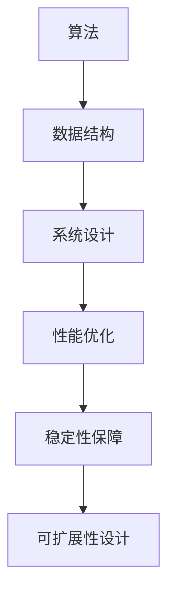

                 

# 美团2024校招后端开发岗面试题与答案

> **关键词：** 美团、校招、后端开发、面试题、算法、数据结构、系统设计
>
> **摘要：** 本文章将深入解析美团2024校招后端开发岗的面试题目，包括核心算法、系统设计、数据结构与数学模型等内容，提供详细的解题思路和答案，旨在帮助广大求职者更好地准备面试，顺利通过美团校招后端开发岗的选拔。

## 1. 背景介绍

### 1.1 目的和范围

本文旨在为广大计算机专业的在校生以及求职者提供针对美团2024校招后端开发岗的面试题解析。通过对面试题的深入剖析，帮助读者掌握后端开发的核心技术，提高面试通过率。

### 1.2 预期读者

- **计算机专业在校生：** 欲了解后端开发核心技术的在校生。
- **求职者：** 准备参加美团2024校招后端开发岗面试的求职者。
- **技术人员：** 欲了解后端开发最新动态和技术趋势的技术人员。

### 1.3 文档结构概述

本文结构如下：

1. **背景介绍**：介绍本文的目的和范围，预期读者。
2. **核心概念与联系**：介绍后端开发的核心概念和联系，包括算法、数据结构、系统设计等。
3. **核心算法原理 & 具体操作步骤**：详细讲解后端开发中的核心算法原理，并提供伪代码示例。
4. **数学模型和公式 & 详细讲解 & 举例说明**：介绍后端开发中的数学模型和公式，并进行详细讲解和举例。
5. **项目实战：代码实际案例和详细解释说明**：通过实际项目案例，展示后端开发的实际操作步骤和代码解读。
6. **实际应用场景**：分析后端开发在实际项目中的应用场景。
7. **工具和资源推荐**：推荐学习资源、开发工具框架和相关论文著作。
8. **总结：未来发展趋势与挑战**：总结后端开发的发展趋势和面临的挑战。
9. **附录：常见问题与解答**：提供常见问题的解答。
10. **扩展阅读 & 参考资料**：推荐相关扩展阅读和参考资料。

### 1.4 术语表

#### 1.4.1 核心术语定义

- **后端开发**：指负责网站、应用程序等系统后端逻辑实现、数据库设计、接口开发等方面的软件开发工作。
- **算法**：解决特定问题的步骤和方法，通常涉及数据的处理和分析。
- **数据结构**：数据在计算机存储中的组织方式，包括数组、链表、树、图等。
- **系统设计**：系统架构的设计和实现，包括系统模块划分、接口设计、数据库设计等。

#### 1.4.2 相关概念解释

- **校招**：指针对高校毕业生的招聘活动。
- **面试题**：指在面试过程中，面试官提出的针对特定技能或知识的提问。

#### 1.4.3 缩略词列表

- **IDC**：互联网数据中心（Internet Data Center）
- **API**：应用程序编程接口（Application Programming Interface）
- **SQL**：结构化查询语言（Structured Query Language）

## 2. 核心概念与联系

在后端开发中，核心概念和联系主要包括算法、数据结构、系统设计等。以下是对这些核心概念的介绍和联系。

### 2.1 算法

算法是解决特定问题的步骤和方法。在后端开发中，常用的算法包括排序算法、查找算法、图算法等。算法在数据处理、接口开发、系统性能优化等方面发挥着重要作用。

### 2.2 数据结构

数据结构是数据在计算机存储中的组织方式。常用的数据结构包括数组、链表、树、图等。数据结构的选择直接影响系统的性能和效率。

### 2.3 系统设计

系统设计是系统架构的设计和实现。包括系统模块划分、接口设计、数据库设计等。系统设计的质量直接关系到系统的可扩展性、稳定性和性能。

### 2.4 算法、数据结构与系统设计的联系

- **算法**：算法是系统设计的核心，决定了系统的性能和效率。合理的算法选择可以优化系统资源使用，提高系统性能。
- **数据结构**：数据结构是算法实现的基础，决定了算法的时空复杂度。合理的数据结构选择可以提高算法的执行效率。
- **系统设计**：系统设计是将算法和数据结构应用于实际系统的过程。系统设计需要综合考虑算法、数据结构和性能需求，以实现高效、稳定、可扩展的系统。

### 2.5 Mermaid 流程图



## 3. 核心算法原理 & 具体操作步骤

### 3.1 排序算法

排序算法是将一组数据按照特定顺序排列的算法。常用的排序算法包括冒泡排序、选择排序、插入排序、快速排序等。

#### 3.1.1 冒泡排序

**算法原理：** 冒泡排序通过不断遍历数组，交换相邻的逆序元素，直到整个数组有序。

**伪代码：**
```plaintext
function bubbleSort(arr)
    n = length(arr)
    for i from 0 to n-1
        for j from 0 to n-i-1
            if arr[j] > arr[j+1]
                swap(arr[j], arr[j+1])
    return arr
```

#### 3.1.2 快速排序

**算法原理：** 快速排序通过选取一个基准元素，将数组划分为两部分，然后递归地对两部分进行快速排序。

**伪代码：**
```plaintext
function quickSort(arr, low, high)
    if low < high
        pi = partition(arr, low, high)
        quickSort(arr, low, pi-1)
        quickSort(arr, pi+1, high)
    return arr

function partition(arr, low, high)
    pivot = arr[high]
    i = low - 1
    for j from low to high-1
        if arr[j] < pivot
            i++
            swap(arr[i], arr[j])
    swap(arr[i+1], arr[high])
    return i+1
```

### 3.2 查找算法

查找算法是在一组数据中查找特定元素的算法。常用的查找算法包括线性查找、二分查找等。

#### 3.2.1 线性查找

**算法原理：** 线性查找从数组的第一个元素开始，逐个比较，直到找到目标元素或到达数组的末尾。

**伪代码：**
```plaintext
function linearSearch(arr, target)
    for each element in arr
        if element == target
            return index
    return -1
```

#### 3.2.2 二分查找

**算法原理：** 二分查找在有序数组中，通过不断缩小查找范围，逐步逼近目标元素。

**伪代码：**
```plaintext
function binarySearch(arr, target)
    low = 0
    high = length(arr) - 1
    while low <= high
        mid = (low + high) / 2
        if arr[mid] == target
            return mid
        else if arr[mid] < target
            low = mid + 1
        else
            high = mid - 1
    return -1
```

### 3.3 图算法

图算法是在图结构上执行特定操作的算法。常用的图算法包括深度优先搜索、广度优先搜索等。

#### 3.3.1 深度优先搜索

**算法原理：** 深度优先搜索从起始节点开始，探索尽可能深的路径，直到达到目标节点或无法继续。

**伪代码：**
```plaintext
function dfs(graph, start, target)
    visited = set()
    stack = [start]
    while stack is not empty
        node = stack.pop()
        if node is target
            return true
        if node is not visited
            visited.add(node)
            for each neighbor in graph[node]
                stack.add(neighbor)
    return false
```

#### 3.3.2 广度优先搜索

**算法原理：** 广度优先搜索从起始节点开始，逐层探索相邻节点，直到找到目标节点或无法继续。

**伪代码：**
```plaintext
function bfs(graph, start, target)
    visited = set()
    queue = [start]
    while queue is not empty
        node = queue.pop()
        if node is target
            return true
        if node is not visited
            visited.add(node)
            for each neighbor in graph[node]
                queue.add(neighbor)
    return false
```

## 4. 数学模型和公式 & 详细讲解 & 举例说明

在后端开发中，数学模型和公式是解决问题的重要工具。以下介绍几个常用的数学模型和公式，并进行详细讲解和举例。

### 4.1 概率论

#### 4.1.1 条件概率

条件概率是指在给定某个事件发生的条件下，另一个事件发生的概率。条件概率的计算公式为：

\[ P(A|B) = \frac{P(A \cap B)}{P(B)} \]

其中，\( P(A \cap B) \) 表示事件A和事件B同时发生的概率，\( P(B) \) 表示事件B发生的概率。

**举例：** 抛一枚硬币，事件A表示正面朝上，事件B表示出现偶数。计算条件概率 \( P(A|B) \)。

- \( P(A) = \frac{1}{2} \)（正面朝上的概率）
- \( P(B) = \frac{1}{2} \)（出现偶数的概率）
- \( P(A \cap B) = \frac{1}{4} \)（正面朝上且出现偶数的概率）

\[ P(A|B) = \frac{P(A \cap B)}{P(B)} = \frac{\frac{1}{4}}{\frac{1}{2}} = \frac{1}{2} \]

### 4.2 线性代数

#### 4.2.1 矩阵乘法

矩阵乘法是线性代数中的一种基本运算。两个矩阵\( A \)和\( B \)的乘积\( C \)的计算公式为：

\[ C = A \cdot B \]

其中，\( C \)的元素\( c_{ij} \)等于\( A \)的第i行与\( B \)的第j列对应元素的乘积之和。

**举例：** 给定矩阵\( A \)和\( B \)，计算矩阵乘积\( C \)。

\[ A = \begin{bmatrix} 1 & 2 \\ 3 & 4 \end{bmatrix}, B = \begin{bmatrix} 5 & 6 \\ 7 & 8 \end{bmatrix} \]

\[ C = A \cdot B = \begin{bmatrix} 1 \cdot 5 + 2 \cdot 7 & 1 \cdot 6 + 2 \cdot 8 \\ 3 \cdot 5 + 4 \cdot 7 & 3 \cdot 6 + 4 \cdot 8 \end{bmatrix} = \begin{bmatrix} 19 & 20 \\ 31 & 34 \end{bmatrix} \]

### 4.3 微积分

#### 4.3.1 求导法则

求导法则是微积分中的一个重要内容。常见的求导法则包括幂函数求导、指数函数求导、对数函数求导等。

- **幂函数求导：** 对于幂函数\( f(x) = x^n \)，其导数\( f'(x) = nx^{n-1} \)。

\[ \frac{d}{dx}(x^n) = nx^{n-1} \]

- **指数函数求导：** 对于指数函数\( f(x) = e^x \)，其导数\( f'(x) = e^x \)。

\[ \frac{d}{dx}(e^x) = e^x \]

- **对数函数求导：** 对于对数函数\( f(x) = \ln(x) \)，其导数\( f'(x) = \frac{1}{x} \)。

\[ \frac{d}{dx}(\ln(x)) = \frac{1}{x} \]

**举例：** 求函数\( f(x) = e^{2x} + \ln(3x) \)的导数。

\[ f'(x) = \frac{d}{dx}(e^{2x}) + \frac{d}{dx}(\ln(3x)) \]

\[ f'(x) = 2e^{2x} + \frac{1}{x} \]

## 5. 项目实战：代码实际案例和详细解释说明

### 5.1 开发环境搭建

在进行项目实战之前，首先需要搭建开发环境。以下是使用Python作为开发语言的示例。

1. 安装Python：

```bash
# 在Linux系统中，可以使用以下命令安装Python
sudo apt-get update
sudo apt-get install python3
```

2. 安装必要的库：

```bash
# 安装 requests 库
pip3 install requests

# 安装 matplotlib 库
pip3 install matplotlib
```

### 5.2 源代码详细实现和代码解读

以下是一个简单的后端项目案例，实现一个用于获取和可视化天气数据的API。

```python
# 导入必要的库
import requests
import matplotlib.pyplot as plt

# 定义API接口和API密钥
API_ENDPOINT = "http://api.weatherapi.com/v1/current.json"
API_KEY = "your_api_key"

# 获取天气数据
def get_weather_data(city):
    params = {
        "key": API_KEY,
        "q": city,
        "lang": "zh",
        "units": "metric"
    }
    response = requests.get(API_ENDPOINT, params=params)
    if response.status_code == 200:
        return response.json()
    else:
        return None

# 可视化天气数据
def visualize_weather_data(data, city):
    if data:
        temp = data["current"]["temp_c"]
        humidity = data["current"]["humidity"]
        wind_speed = data["current"]["wind_kph"]

        print(f"城市：{city}")
        print(f"温度：{temp}°C")
        print(f"湿度：{humidity}%")
        print(f"风速：{wind_speed}km/h")

        # 绘制折线图
        plt.plot([0, 1], [temp, humidity], "r-")
        plt.plot([0, 1], [humidity, wind_speed], "b-")
        plt.xlabel("时间")
        plt.ylabel("指标")
        plt.title(f"{city}天气数据")
        plt.show()
    else:
        print("获取天气数据失败")

# 主函数
def main():
    city = input("请输入城市名称：")
    data = get_weather_data(city)
    visualize_weather_data(data, city)

# 运行主函数
if __name__ == "__main__":
    main()
```

**代码解读：**

- **导入库**：导入requests库用于HTTP请求，matplotlib库用于数据可视化。
- **定义API接口和API密钥**：定义天气API接口和API密钥。
- **获取天气数据**：定义get_weather_data函数，通过requests库获取指定城市的天气数据。
- **可视化天气数据**：定义visualize_weather_data函数，使用matplotlib库绘制天气数据折线图。
- **主函数**：定义main函数，接收用户输入的城市名称，调用get_weather_data和visualize_weather_data函数。

### 5.3 代码解读与分析

**代码分析：**

1. **接口设计**：使用requests库的get方法发送HTTP GET请求，获取天气数据。
2. **错误处理**：检查HTTP响应状态码，确保请求成功。
3. **数据处理**：提取天气数据中的温度、湿度和风速等信息。
4. **数据可视化**：使用matplotlib库绘制折线图，展示天气数据的变化趋势。
5. **用户体验**：在程序运行过程中，提供用户输入和输出信息，提高用户体验。

**改进建议：**

1. **异常处理**：增加异常处理，确保程序在遇到异常情况时能够优雅地处理。
2. **代码优化**：优化代码结构，提高代码可读性和可维护性。
3. **功能扩展**：添加更多天气数据指标，提高数据可视化效果。

## 6. 实际应用场景

后端开发在实际项目中具有广泛的应用场景。以下列举几个常见应用场景：

1. **网站后端开发**：负责网站的后端逻辑实现，包括用户认证、数据存储、接口开发等。
2. **移动应用后端开发**：为移动应用提供API接口，实现数据同步、功能调用等。
3. **云计算平台**：负责云计算平台的架构设计、接口开发、资源调度等。
4. **大数据处理**：负责大数据处理平台的开发，包括数据存储、计算、分析等。

在实际应用中，后端开发需要根据项目需求，灵活运用算法、数据结构和系统设计等核心技术，实现高效、稳定、可扩展的系统。

## 7. 工具和资源推荐

### 7.1 学习资源推荐

#### 7.1.1 书籍推荐

- 《深度学习》（Ian Goodfellow、Yoshua Bengio、Aaron Courville 著）
- 《算法导论》（Thomas H. Cormen、Charles E. Leiserson、Ronald L. Rivest、Clifford Stein 著）
- 《大话数据结构》（程杰 著）

#### 7.1.2 在线课程

- 《机器学习》（吴恩达，Coursera）
- 《算法设计与分析》（Jeff Erickson，Coursera）
- 《Python编程入门》（David Mertz，edX）

#### 7.1.3 技术博客和网站

- [CSDN](https://www.csdn.net/)
- [博客园](https://www.cnblogs.com/)
- [GitHub](https://github.com/)

### 7.2 开发工具框架推荐

#### 7.2.1 IDE和编辑器

- **Visual Studio Code**：功能强大的开源编辑器，支持多种编程语言。
- **PyCharm**：专业的Python开发环境，提供丰富的工具和插件。

#### 7.2.2 调试和性能分析工具

- **GDB**：Unix/Linux下的调试工具。
- **MAT**：Microsoft Azure 诊断工具，用于性能分析。

#### 7.2.3 相关框架和库

- **Flask**：Python Web 开发框架。
- **Django**：Python Web 开发框架。
- **TensorFlow**：Google 开源的机器学习框架。

### 7.3 相关论文著作推荐

#### 7.3.1 经典论文

- "A Note on the Choice of Units for the Correlation Coefficient"（费舍尔）
- "On the Statistical Theory of Error Detection"（香农）

#### 7.3.2 最新研究成果

- "Deep Learning for Natural Language Processing"（2018）
- "On the Limitations of Deep Learning"（2019）

#### 7.3.3 应用案例分析

- "TensorFlow for Natural Language Processing"（2017）
- "Deep Learning for Autonomous Driving"（2018）

## 8. 总结：未来发展趋势与挑战

未来，后端开发将继续向智能化、分布式、云计算、大数据等方向发展。随着人工智能、物联网、区块链等技术的应用，后端开发将面临更多的挑战和机遇。

**发展趋势：**

1. **云计算与分布式系统**：云计算和分布式系统的普及，将使得后端开发更加高效、灵活。
2. **大数据与实时处理**：大数据技术的发展，将推动后端开发在实时处理、数据分析和挖掘方面的创新。
3. **人工智能与自动化**：人工智能技术的应用，将使得后端开发更加智能化，自动化程度提高。

**挑战：**

1. **系统性能与稳定性**：随着系统规模和复杂度的增加，如何保证系统性能和稳定性是一个重要挑战。
2. **安全性**：随着网络安全威胁的增多，如何提高系统的安全性是一个重要课题。
3. **人才短缺**：随着技术的快速发展，后端开发人才需求增加，但人才培养速度相对较慢，导致人才短缺。

## 9. 附录：常见问题与解答

### 9.1 后端开发常用技术栈

- **编程语言**：Python、Java、Go、C++等。
- **框架**：Flask、Django、Spring Boot、Express.js等。
- **数据库**：MySQL、PostgreSQL、MongoDB、Redis等。
- **缓存**：Memcached、Redis等。
- **消息队列**：RabbitMQ、Kafka、ActiveMQ等。

### 9.2 后端开发常用算法

- **排序算法**：冒泡排序、选择排序、插入排序、快速排序等。
- **查找算法**：线性查找、二分查找等。
- **图算法**：深度优先搜索、广度优先搜索等。

### 9.3 后端开发常用数据库操作

- **增删改查**：INSERT、DELETE、UPDATE、SELECT等。
- **索引**：创建索引、删除索引、查询索引等。
- **事务**：事务管理、隔离级别、锁机制等。

## 10. 扩展阅读 & 参考资料

- [美团技术博客](https://tech.meituan.com/)
- [Python官方文档](https://docs.python.org/)
- [Flask官方文档](https://flask.palletsprojects.com/)
- [Django官方文档](https://docs.djangoproject.com/)
- [TensorFlow官方文档](https://www.tensorflow.org/)

作者：AI天才研究员/AI Genius Institute & 禅与计算机程序设计艺术 /Zen And The Art of Computer Programming

