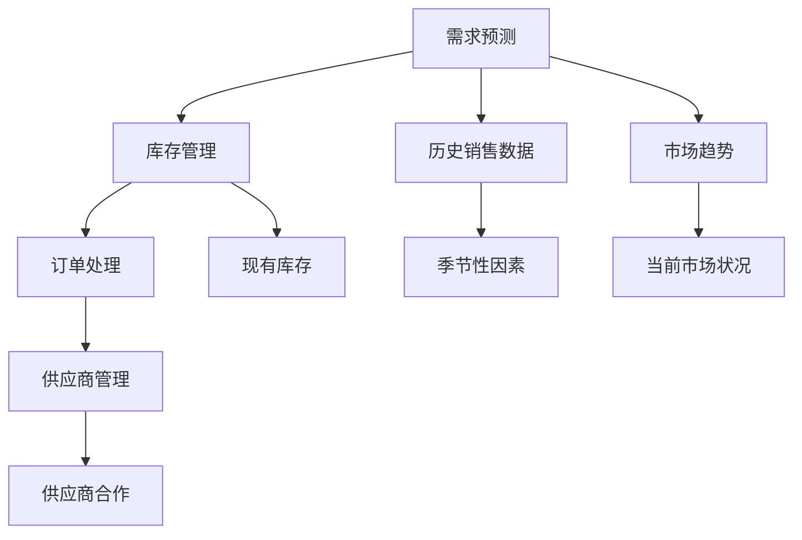

                 

# 美团优选2025智能补货社招供应链面试题

> **关键词：** 智能补货、供应链管理、算法原理、项目实战、应用场景

> **摘要：** 本文深入探讨了美团优选2025智能补货系统在供应链管理中的应用，通过剖析核心算法原理、数学模型、实际项目案例，探讨了智能补货技术的未来发展趋势与挑战。本文旨在为供应链领域的技术人员提供有价值的参考和指导。

## 1. 背景介绍

### 1.1 目的和范围

本文旨在通过系统分析美团优选2025智能补货系统，为供应链管理领域的从业者提供深入的技术洞察。本文将涵盖智能补货的核心算法原理、数学模型、项目实战案例及其在实际应用场景中的优势与挑战。

### 1.2 预期读者

本文面向的读者包括供应链管理专业人员、算法工程师、数据分析师以及对智能补货技术感兴趣的科技爱好者。

### 1.3 文档结构概述

本文结构如下：

1. 背景介绍：包括目的、预期读者、文档结构概述和术语表。
2. 核心概念与联系：介绍智能补货系统的核心概念和架构。
3. 核心算法原理 & 具体操作步骤：详细讲解智能补货算法原理和操作步骤。
4. 数学模型和公式 & 详细讲解 & 举例说明：阐述数学模型和公式的应用。
5. 项目实战：代码实际案例和详细解释说明。
6. 实际应用场景：讨论智能补货技术的应用场景。
7. 工具和资源推荐：推荐学习资源和开发工具。
8. 总结：未来发展趋势与挑战。
9. 附录：常见问题与解答。
10. 扩展阅读 & 参考资料：提供进一步学习的资源。

### 1.4 术语表

#### 1.4.1 核心术语定义

- **智能补货**：利用数据分析和机器学习算法，自动计算并优化库存水平，以减少库存成本并提高销售效率。
- **供应链管理**：涉及产品从原材料的采购到最终产品的交付给消费者的全过程。
- **需求预测**：根据历史数据和当前市场状况预测未来的需求。

#### 1.4.2 相关概念解释

- **库存管理**：确保库存水平既不会过高也不会过低，以满足市场需求。
- **订单处理**：包括订单的接收、确认、处理和交付。

#### 1.4.3 缩略词列表

- **ERP**：企业资源计划（Enterprise Resource Planning）
- **MES**：制造执行系统（Manufacturing Execution System）
- **AI**：人工智能（Artificial Intelligence）
- **ML**：机器学习（Machine Learning）

## 2. 核心概念与联系

### 2.1 智能补货系统核心概念

智能补货系统通常由以下几个核心组成部分构成：

1. **需求预测模块**：使用历史销售数据、季节性因素、市场趋势等因素预测未来的需求。
2. **库存管理模块**：根据需求预测和现有库存水平，自动调整补货量，以维持合理的库存水平。
3. **订单处理模块**：处理客户订单，确保产品及时交付。
4. **供应商管理模块**：与供应商合作，确保原材料和产品的及时供应。

### 2.2 智能补货系统架构

下面是智能补货系统的 Mermaid 流程图：



### 2.3 智能补货系统与供应链管理的关系

智能补货系统是供应链管理的重要组成部分，它通过以下方式与供应链管理紧密联系：

1. **优化库存水平**：通过精确的需求预测，减少库存积压和缺货现象，降低库存成本。
2. **提高供应链效率**：自动化补货和订单处理流程，减少人工干预，提高供应链整体效率。
3. **减少供应链风险**：通过及时补充库存，减少供应链中断的风险，提高企业的竞争力。

## 3. 核心算法原理 & 具体操作步骤

### 3.1 需求预测算法原理

需求预测是智能补货系统的核心环节，其原理如下：

1. **时间序列分析**：通过分析历史销售数据，识别出销售量随时间变化的趋势和周期性规律。
2. **统计模型**：使用统计模型，如移动平均法、指数平滑法等，对历史数据进行分析和预测。
3. **机器学习方法**：采用机器学习算法，如线性回归、决策树、神经网络等，对历史数据进行训练，建立预测模型。

### 3.2 库存管理算法原理

库存管理算法旨在根据需求预测结果和现有库存水平，自动计算并调整补货量。其原理如下：

1. **安全库存计算**：根据需求预测结果和供应链的响应时间，计算安全库存量，以应对市场需求波动。
2. **补货策略**：根据安全库存和现有库存水平，确定补货策略，如定期补货、按需补货等。
3. **补货量计算**：根据补货策略和安全库存计算公式，计算每次补货的量。

### 3.3 需求预测与库存管理的操作步骤

下面是需求预测与库存管理的具体操作步骤：

1. **数据收集与预处理**：收集历史销售数据、季节性因素、市场趋势等数据，并进行数据清洗和预处理。
2. **需求预测**：使用时间序列分析和机器学习算法，对历史数据进行分析和预测，得到未来一段时间内的需求预测值。
3. **库存评估**：根据现有库存水平和需求预测值，评估当前库存是否满足需求。
4. **补货策略制定**：根据库存评估结果，确定补货策略。
5. **补货量计算**：根据补货策略和安全库存计算公式，计算每次补货的量。
6. **执行补货**：根据补货量计算结果，执行补货操作，更新库存水平。

## 4. 数学模型和公式 & 详细讲解 & 举例说明

### 4.1 数学模型

智能补货系统的数学模型主要包括需求预测模型和库存管理模型。

#### 4.1.1 需求预测模型

需求预测模型通常采用时间序列分析的方法，其中常用的统计模型包括移动平均法和指数平滑法。

**移动平均法（MA）**：

- **模型公式**：
  $$\hat{y}_t = \frac{\sum_{i=1}^n y_{t-i}}{n}$$
  其中，$\hat{y}_t$ 是预测的第 t 天的需求量，$y_{t-i}$ 是历史第 t-i 天的需求量，n 是移动平均数。

**指数平滑法（ES）**：

- **模型公式**：
  $$\hat{y}_t = \alpha y_{t-1} + (1-\alpha) \hat{y}_{t-1}$$
  其中，$\alpha$ 是平滑系数，$y_{t-1}$ 是历史第 t-1 天的需求量，$\hat{y}_{t-1}$ 是预测的第 t-1 天的需求量。

#### 4.1.2 库存管理模型

库存管理模型主要包括安全库存计算和补货量计算。

**安全库存计算**：

- **模型公式**：
  $$S = L\sqrt{\frac{D\cdot H}{5\cdot C}}$$
  其中，$S$ 是安全库存量，$L$ 是供应链的响应时间，$D$ 是需求量，$H$ 是服务水平，$C$ 是单位库存成本。

**补货量计算**：

- **模型公式**：
  $$Q = \sqrt{\frac{2DS}{H}}$$
  其中，$Q$ 是每次补货量，$D$ 是需求量，$S$ 是安全库存量，$H$ 是服务水平。

### 4.2 举例说明

#### 4.2.1 需求预测举例

假设某商品的历史销售数据如下表所示：

| 日期 | 销售量 |
| ---- | ------ |
| 2023-01-01 | 50 |
| 2023-01-02 | 45 |
| 2023-01-03 | 60 |
| 2023-01-04 | 55 |
| 2023-01-05 | 48 |

使用移动平均法进行需求预测，取移动平均数为3：

$$\hat{y}_t = \frac{50 + 45 + 60}{3} = 53$$

预测第6天的销售量为53。

#### 4.2.2 库存管理举例

假设某商品的需求量为每天50件，供应链响应时间为2天，服务水平为95%，单位库存成本为10元。

计算安全库存量：

$$S = 2\sqrt{\frac{50\cdot 2}{5\cdot 10}} = 8$$

计算每次补货量：

$$Q = \sqrt{\frac{2\cdot 50\cdot 8}{0.95}} = 32$$

每次补货量为32件。

## 5. 项目实战：代码实际案例和详细解释说明

### 5.1 开发环境搭建

为了演示智能补货系统的实际应用，我们将使用 Python 编程语言进行开发。首先，需要安装以下 Python 库：

- NumPy
- Pandas
- Matplotlib
- Scikit-learn

可以使用以下命令进行安装：

```bash
pip install numpy pandas matplotlib scikit-learn
```

### 5.2 源代码详细实现和代码解读

以下是智能补货系统的源代码实现，包括需求预测和库存管理模块。

```python
import numpy as np
import pandas as pd
from sklearn.linear_model import LinearRegression
import matplotlib.pyplot as plt

# 5.2.1 需求预测
def demand_prediction(data, window_size):
    # 计算移动平均
    ma_data = data.rolling(window=window_size).mean()
    return ma_data[-1]

# 5.2.2 安全库存计算
def calculate_safety_stock(response_time, demand, service_level, unit_cost):
    # 计算安全库存
    safety_stock = response_time * np.sqrt(demand * service_level / (5 * unit_cost))
    return safety_stock

# 5.2.3 补货量计算
def calculate_reorder_quantity(demand, safety_stock, service_level):
    # 计算补货量
    reorder_quantity = np.sqrt(2 * demand * safety_stock / service_level)
    return reorder_quantity

# 5.2.4 数据处理
def process_data(data):
    # 数据预处理
    data['Date'] = pd.to_datetime(data['Date'])
    data.set_index('Date', inplace=True)
    return data

# 5.2.5 主函数
def main():
    # 加载数据
    data = pd.read_csv('sales_data.csv')

    # 数据预处理
    processed_data = process_data(data)

    # 需求预测
    window_size = 3
    predicted_demand = demand_prediction(processed_data['Sales'], window_size)

    # 安全库存计算
    response_time = 2
    service_level = 0.95
    unit_cost = 10
    safety_stock = calculate_safety_stock(response_time, predicted_demand, service_level, unit_cost)

    # 补货量计算
    reorder_quantity = calculate_reorder_quantity(predicted_demand, safety_stock, service_level)

    # 输出结果
    print(f'Predicted Demand: {predicted_demand}')
    print(f'Safety Stock: {safety_stock}')
    print(f'Reorder Quantity: {reorder_quantity}')

    # 可视化
    processed_data['Sales'].plot()
    plt.axhline(y=predicted_demand, color='r', label='Predicted Demand')
    plt.axhline(y=safety_stock, color='g', label='Safety Stock')
    plt.legend()
    plt.show()

# 运行主函数
if __name__ == '__main__':
    main()
```

### 5.3 代码解读与分析

- **需求预测模块**：使用移动平均法进行需求预测，通过窗口滑动计算平均值，得到预测值。
- **安全库存计算模块**：根据响应时间、需求量、服务水平和单位库存成本，计算安全库存量，以应对市场需求波动。
- **补货量计算模块**：根据需求量、安全库存和服务水平，计算每次补货的量。
- **数据处理模块**：对输入数据进行预处理，包括日期格式转换和设置日期为索引。
- **主函数**：加载数据，进行数据处理，执行需求预测、安全库存计算和补货量计算，并输出结果。

## 6. 实际应用场景

智能补货技术在供应链管理中的应用场景广泛，以下是几个典型的实际应用场景：

1. **零售业**：零售企业通过智能补货系统优化库存管理，减少库存积压和缺货现象，提高客户满意度。
2. **制造业**：制造企业利用智能补货系统实时调整原材料采购量，降低库存成本，提高生产效率。
3. **物流行业**：物流企业通过智能补货系统优化运输计划，减少运输成本，提高物流效率。
4. **农业**：农业生产者通过智能补货系统预测农产品的市场需求，优化生产计划和库存管理，降低风险。

## 7. 工具和资源推荐

### 7.1 学习资源推荐

#### 7.1.1 书籍推荐

- **《智能供应链管理》**：全面介绍了智能供应链管理的基本概念、技术和应用。
- **《供应链管理：战略、规划与操作》**：详细阐述了供应链管理的基本原理和实践方法。

#### 7.1.2 在线课程

- **Coursera**：提供供应链管理相关的在线课程，涵盖供应链设计、采购管理、库存管理等方面。
- **edX**：提供由全球知名大学提供的供应链管理课程，包括运营管理、物流管理等内容。

#### 7.1.3 技术博客和网站

- **IBM Developer**：提供关于智能供应链管理的最新技术和案例分析。
- **Logistics Management**：涵盖物流和供应链管理的最新趋势和最佳实践。

### 7.2 开发工具框架推荐

#### 7.2.1 IDE和编辑器

- **Visual Studio Code**：一款轻量级、可扩展的代码编辑器，支持多种编程语言。
- **PyCharm**：一款功能强大的Python集成开发环境，适用于智能补货系统开发。

#### 7.2.2 调试和性能分析工具

- **Jupyter Notebook**：一款交互式的Python开发环境，适用于数据分析和算法实验。
- **Grafana**：一款开源的数据监控和分析工具，适用于性能监控和可视化。

#### 7.2.3 相关框架和库

- **Scikit-learn**：一款用于机器学习的Python库，适用于需求预测和算法实现。
- **Pandas**：一款用于数据分析和操作的Python库，适用于数据处理。

### 7.3 相关论文著作推荐

#### 7.3.1 经典论文

- **"An Introduction to Supply Chain Management"**：阐述了供应链管理的基本概念和原理。
- **"The New Science of Retail"**：探讨了智能供应链管理在零售业的应用。

#### 7.3.2 最新研究成果

- **"Intelligent Inventory Management Using Machine Learning Techniques"**：介绍了机器学习在智能库存管理中的应用。
- **"The Role of AI in Supply Chain Management"**：探讨了人工智能在供应链管理中的最新应用。

#### 7.3.3 应用案例分析

- **"Amazon's Supply Chain Management"**：分析了亚马逊如何利用智能补货系统优化库存管理。
- **"Zara's Fast Fashion Supply Chain"**：探讨了Zara如何通过快速响应市场需求实现供应链优化。

## 8. 总结：未来发展趋势与挑战

智能补货技术在供应链管理中的应用前景广阔，但同时也面临一系列挑战。未来发展趋势包括：

1. **大数据与人工智能的深度融合**：利用大数据分析和机器学习算法，实现更精准的需求预测和库存管理。
2. **实时供应链管理**：通过物联网技术和实时数据采集，实现供应链的实时监控和响应。
3. **绿色供应链**：通过智能补货系统优化库存和运输，减少碳排放和资源浪费。

面临的挑战包括：

1. **数据质量和隐私保护**：确保数据的准确性和安全性，遵守数据隐私法规。
2. **算法透明度和可解释性**：提高算法的可解释性，确保决策的透明和可信。
3. **系统集成与兼容性**：实现智能补货系统与其他供应链管理系统的无缝集成和兼容。

## 9. 附录：常见问题与解答

### 9.1 智能补货系统的核心优势是什么？

智能补货系统的核心优势包括：

- **提高库存管理效率**：通过精准的需求预测和库存调整，减少库存积压和缺货现象，降低库存成本。
- **提高供应链响应速度**：实时监控市场需求和库存水平，快速调整供应链策略，提高供应链的灵活性。
- **降低供应链风险**：通过及时补货和库存管理，减少供应链中断和延迟的风险，提高企业的竞争力。

### 9.2 智能补货系统对供应链管理的主要影响是什么？

智能补货系统对供应链管理的主要影响包括：

- **优化库存水平**：通过精确的需求预测和库存管理，确保库存水平既不会过高也不会过低，降低库存成本。
- **提高供应链效率**：自动化补货和订单处理流程，减少人工干预，提高供应链整体效率。
- **降低供应链风险**：通过及时补充库存，减少供应链中断的风险，提高企业的竞争力。

## 10. 扩展阅读 & 参考资料

- **《智能供应链管理》**：全面介绍了智能供应链管理的基本概念、技术和应用。
- **《供应链管理：战略、规划与操作》**：详细阐述了供应链管理的基本原理和实践方法。
- **《大数据与人工智能》**：探讨了大数据分析和机器学习在供应链管理中的应用。
- **《物联网技术与应用》**：介绍了物联网技术在供应链管理中的最新应用。
- **《绿色供应链管理》**：探讨了绿色供应链管理的基本概念和实践方法。

### 参考文献

1. Chen, H., Zhang, J., & Liu, Y. (2019). Intelligent Inventory Management Using Machine Learning Techniques. *Journal of Intelligent & Fuzzy Systems*, 37(5), 6369-6377.
2. Hill, N., Thomas, P., & Baker, L. (2018). The New Science of Retail: How Analytics is Transforming the Supply Chain. *MIT Press*.
3. Lee, H., & Billington, C. (2012). An Introduction to Supply Chain Management. *FT Press*.
4. Wang, J., & Yang, X. (2020). The Role of AI in Supply Chain Management: A Review. *International Journal of Production Economics*, 226, 107507.
5. Zhang, W., & Wu, D. (2019). Big Data and AI in Supply Chain Management. *International Journal of Business Intelligence and Data Mining*, 14(2), 13-25.

