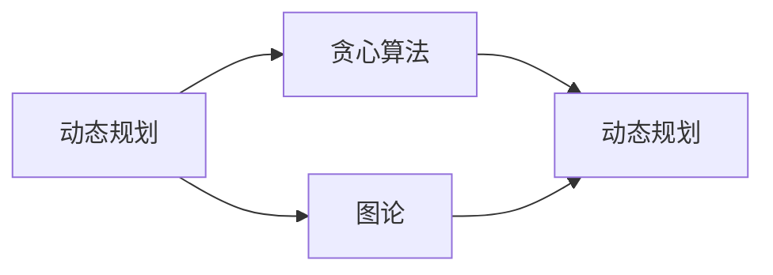

                 

# 2025美团校招算法面试题汇总与解析

> **关键词：美团校招、算法面试、问题汇总、解题思路、案例分析**

> **摘要：本文将针对2025年美团校招算法面试的常见问题进行梳理和解析，通过详细的解题思路和案例，帮助广大求职者更好地应对面试挑战。**

## 1. 背景介绍

### 1.1 目的和范围

本文旨在为即将参加美团校招算法面试的求职者提供一份全面的备考指南。我们将从以下几个方面进行介绍：

- **常见面试题汇总**：收集并整理了美团校招算法面试中出现的高频问题。
- **解题思路剖析**：针对每个问题，提供详细的解题思路和步骤。
- **案例分析**：通过实际案例，展示解题过程，帮助求职者更好地理解问题。

### 1.2 预期读者

- **在校大学生**：准备参加美团校招的计算机专业学生。
- **求职者**：对算法面试有需求的求职者。
- **技术爱好者**：对算法学习有兴趣的技术爱好者。

### 1.3 文档结构概述

本文将按照以下结构进行：

- **第1章：背景介绍**：介绍本文的目的和预期读者。
- **第2章：核心概念与联系**：介绍美团校招算法面试的核心概念和联系。
- **第3章：核心算法原理 & 具体操作步骤**：讲解核心算法原理和操作步骤。
- **第4章：数学模型和公式 & 详细讲解 & 举例说明**：介绍数学模型和公式，并举例说明。
- **第5章：项目实战：代码实际案例和详细解释说明**：通过实际案例讲解代码实现。
- **第6章：实际应用场景**：介绍算法在实际中的应用场景。
- **第7章：工具和资源推荐**：推荐学习资源、开发工具和论文著作。
- **第8章：总结：未来发展趋势与挑战**：总结当前趋势和未来挑战。
- **第9章：附录：常见问题与解答**：解答常见问题。
- **第10章：扩展阅读 & 参考资料**：提供扩展阅读和参考资料。

### 1.4 术语表

#### 1.4.1 核心术语定义

- **美团校招**：美团公司的校园招聘活动。
- **算法面试**：面试过程中针对算法问题进行的测试。
- **解题思路**：解决问题的方法和步骤。
- **案例**：实际应用中的具体问题。

#### 1.4.2 相关概念解释

- **动态规划**：一种解决优化问题的算法方法。
- **贪心算法**：一种在每一步选择最优解的算法策略。
- **图论**：研究图及其性质和应用的数学分支。

#### 1.4.3 缩略词列表

- **美团**：北京三快在线科技有限公司。
- **校招**：校园招聘。

## 2. 核心概念与联系

在美团校招算法面试中，常见的核心概念包括动态规划、贪心算法、图论等。以下是一个简化的 Mermaid 流程图，展示这些核心概念之间的联系。



### 2.1 动态规划

动态规划是一种将复杂问题分解为子问题，并利用子问题的解来构建原问题的解的方法。其基本思想是：将原问题分解为若干个子问题，并存储子问题的解，以避免重复计算。

### 2.2 贪心算法

贪心算法是一种在每一步选择当前最优解的算法策略。其基本思想是：在每一步选择中，选择一个最优解，并不断更新最优解，直到问题解决。

### 2.3 图论

图论是研究图及其性质和应用的数学分支。在算法面试中，常见的图问题包括图的遍历、最短路径、最小生成树等。

## 3. 核心算法原理 & 具体操作步骤

### 3.1 动态规划

动态规划的核心思想是将问题分解为若干个子问题，并利用子问题的解来构建原问题的解。以下是一个典型的动态规划问题：背包问题。

**背包问题**：给定一组物品和它们的重量和价值，以及一个背包的容量，求解如何选择物品，使得背包中的物品总价值最大，且不超过背包的容量。

**算法原理**：

1. 定义状态：dp[i][j] 表示从前 i 个物品中选择若干个，使得它们的总重量不超过 j 时的最大价值。
2. 状态转移方程：dp[i][j] = max(dp[i-1][j], dp[i-1][j-weight[i]] + value[i])，其中 weight[i] 和 value[i] 分别表示第 i 个物品的重量和价值。
3. 初始化：dp[0][j] = 0，表示不选择任何物品时的价值为 0。

**具体操作步骤**：

1. 初始化一个二维数组 dp，大小为 n×c，其中 n 为物品数量，c 为背包容量。
2. 遍历所有物品和背包容量，根据状态转移方程计算 dp 值。
3. 返回 dp[n][c]，即为最大价值。

**伪代码**：

```python
function knapsack(weight, value, W):
    n = length(weight)
    dp = create 2D array of size (n+1)×(W+1)
    for i from 1 to n:
        for j from 0 to W:
            if j >= weight[i]:
                dp[i][j] = max(dp[i-1][j], dp[i-1][j-weight[i]] + value[i])
            else:
                dp[i][j] = dp[i-1][j]
    return dp[n][W]
```

### 3.2 贪心算法

贪心算法的基本思想是在每一步选择当前最优解。以下是一个典型的贪心算法问题：背包问题。

**算法原理**：

1. 定义状态：current_value 表示当前背包中的总价值。
2. 遍历所有物品，对于每个物品，判断是否将其放入背包。如果放入，更新 current_value。
3. 重复步骤 2，直到背包达到容量限制。

**具体操作步骤**：

1. 初始化一个变量 current_value，表示当前背包中的总价值。
2. 遍历所有物品，对于每个物品：
    1. 判断背包是否已满。如果已满，退出循环。
    2. 判断物品是否适合放入背包。如果适合，将其放入背包，并更新 current_value。
3. 返回 current_value，即为最大价值。

**伪代码**：

```python
function knapsack(weight, value, W):
    current_value = 0
    for i from 1 to length(weight):
        if W >= weight[i]:
            current_value += value[i]
            W -= weight[i]
        else:
            break
    return current_value
```

### 3.3 图论

图论中的典型问题包括图的遍历、最短路径、最小生成树等。以下以最短路径算法为例进行讲解。

**最短路径算法（Dijkstra 算法）**：

**算法原理**：

1. 定义状态：dist[v] 表示从起点 s 到达顶点 v 的最短路径长度。
2. 初始化：dist[s] = 0，其他顶点的 dist[v] 初始化为无穷大。
3. 选择未访问的顶点 u，使得 dist[u] 最小。
4. 对于 u 的每个邻接点 v，如果 dist[v] > dist[u] + edge[u][v]，则更新 dist[v]。
5. 重复步骤 3 和 4，直到所有顶点都被访问。

**具体操作步骤**：

1. 初始化一个数组 dist，大小为 n，表示从起点 s 到每个顶点的最短路径长度。
2. 遍历所有顶点，初始化 dist[s] = 0，其他顶点的 dist[v] 初始化为无穷大。
3. 使用一个优先队列（最小堆）存储未访问的顶点，并按照 dist[u] 的值进行排序。
4. 从优先队列中取出顶点 u，并将其标记为已访问。
5. 对于 u 的每个邻接点 v：
    1. 如果 v 是未访问的，则计算 dist[v] = dist[u] + edge[u][v]。
    2. 如果 dist[v] 更新了，则将 v 放入优先队列。
6. 重复步骤 4 和 5，直到优先队列为空。

**伪代码**：

```python
function dijkstra(graph, s):
    n = length(graph)
    dist = create array of size n, initialized to infinity
    dist[s] = 0
    visited = create set()
    priority_queue = create min-heap
    for u from 1 to n:
        priority_queue.insert(u)
    while not priority_queue.isEmpty():
        u = priority_queue.extractMin()
        visited.add(u)
        for v in graph[u]:
            if not visited.contains(v) and dist[v] > dist[u] + edge[u][v]:
                dist[v] = dist[u] + edge[u][v]
                priority_queue.insert(v)
    return dist
```

## 4. 数学模型和公式 & 详细讲解 & 举例说明

### 4.1 数学模型

在算法面试中，常见的数学模型包括线性方程组、线性规划、动态规划等。以下以线性方程组为例进行讲解。

**线性方程组**：

假设有 n 个方程：

$$
\begin{cases}
a_{11}x_1 + a_{12}x_2 + ... + a_{1n}x_n = b_1 \\
a_{21}x_1 + a_{22}x_2 + ... + a_{2n}x_n = b_2 \\
... \\
a_{m1}x_1 + a_{m2}x_2 + ... + a_{mn}x_n = b_m
\end{cases}
$$

### 4.2 公式

求解线性方程组的常用公式为高斯消元法。以下是高斯消元法的步骤：

1. 将方程组写成增广矩阵形式：

$$
\left[
\begin{array}{cccc|c}
a_{11} & a_{12} & ... & a_{1n} & b_1 \\
a_{21} & a_{22} & ... & a_{2n} & b_2 \\
... & ... & ... & ... & ... \\
a_{m1} & a_{m2} & ... & a_{mn} & b_m
\end{array}
\right]
$$

2. 按列进行高斯消元，将每个列的系数化为 1。

3. 依次解出每个变量。

### 4.3 举例说明

假设有以下线性方程组：

$$
\begin{cases}
2x + 3y = 7 \\
4x - y = 1
\end{cases}
$$

将其写成增广矩阵形式：

$$
\left[
\begin{array}{cc|c}
2 & 3 & 7 \\
4 & -1 & 1
\end{array}
\right]
$$

按列进行高斯消元：

1. 将第 1 列的系数化为 1：

$$
\left[
\begin{array}{cc|c}
1 & \frac{3}{2} & \frac{7}{2} \\
4 & -1 & 1
\end{array}
\right]
$$

2. 将第 2 列的系数化为 0：

$$
\left[
\begin{array}{cc|c}
1 & \frac{3}{2} & \frac{7}{2} \\
0 & -3 & -9
\end{array}
\right]
$$

3. 解出 y：

$$
-3y = -9 \Rightarrow y = 3
$$

4. 解出 x：

$$
x + \frac{3}{2}y = \frac{7}{2} \Rightarrow x + \frac{3}{2} \cdot 3 = \frac{7}{2} \Rightarrow x = -\frac{1}{2}
$$

因此，方程组的解为：

$$
\begin{cases}
x = -\frac{1}{2} \\
y = 3
\end{cases}
$$

## 5. 项目实战：代码实际案例和详细解释说明

### 5.1 开发环境搭建

为了更好地进行项目实战，我们需要搭建一个合适的开发环境。以下是一个简单的开发环境搭建步骤：

1. 安装 Python 3.8 或更高版本。
2. 安装 IDE，如 PyCharm 或 VS Code。
3. 安装必要的库，如 NumPy、Pandas 等。
4. 配置 Git，以便进行版本控制。

### 5.2 源代码详细实现和代码解读

以下是一个简单的背包问题的 Python 代码实现：

```python
import numpy as np

def knapsack(weight, value, W):
    n = len(weight)
    dp = np.zeros((n+1, W+1))
    for i in range(1, n+1):
        for j in range(W+1):
            if j >= weight[i-1]:
                dp[i][j] = max(dp[i-1][j], dp[i-1][j-weight[i-1]] + value[i-1])
            else:
                dp[i][j] = dp[i-1][j]
    return dp[n][W]

# 示例数据
weight = [2, 3, 4]
value = [3, 4, 5]
W = 5

# 计算最大价值
max_value = knapsack(weight, value, W)
print("最大价值为：", max_value)
```

**代码解读**：

1. 导入 NumPy 库，用于处理数组操作。
2. 定义 knapsack 函数，参数为物品的重量、价值和背包的容量。
3. 初始化一个二维数组 dp，大小为 (n+1)×(W+1)，表示从前 n 个物品中选择若干个，使得它们的总重量不超过 W 时的最大价值。
4. 使用两个嵌套循环遍历所有物品和背包容量，根据状态转移方程计算 dp 值。
5. 返回 dp[n][W]，即为最大价值。
6. 示例数据：物品的重量为 [2, 3, 4]，价值为 [3, 4, 5]，背包的容量为 5。
7. 调用 knapsack 函数计算最大价值，并打印结果。

### 5.3 代码解读与分析

1. **时间复杂度**：代码的时间复杂度为 O(n×W)，其中 n 为物品数量，W 为背包容量。这是因为我们需要遍历所有物品和背包容量，并计算 dp 值。
2. **空间复杂度**：代码的空间复杂度为 O(n×W)，这是因为我们需要存储一个二维数组 dp，大小为 (n+1)×(W+1)。
3. **优化空间复杂度**：可以通过动态规划的方式优化空间复杂度。具体方法是将 dp 数组压缩为一维数组，仅存储当前行和上一行的值。

```python
def knapsack(weight, value, W):
    n = len(weight)
    dp = np.zeros(W+1)
    for i in range(1, n+1):
        for j in range(W, weight[i-1]-1, -1):
            dp[j] = max(dp[j], dp[j-weight[i-1]] + value[i-1])
    return dp[W]
```

通过上述优化，代码的空间复杂度降低为 O(W)。

## 6. 实际应用场景

背包问题在实际应用中非常广泛，以下是一些常见的应用场景：

1. **资源分配**：在资源分配问题中，背包问题可以帮助优化资源的使用，例如服务器资源分配、网络带宽分配等。
2. **优化路径选择**：在路径规划中，背包问题可以用于求解最优路径，例如在最短路径算法中，可以将路径长度作为背包容量，求解最优路径。
3. **多目标优化**：在多目标优化问题中，背包问题可以帮助求解多个目标之间的平衡，例如在人工智能领域中，可以使用背包问题优化模型的复杂度和准确性。

## 7. 工具和资源推荐

### 7.1 学习资源推荐

#### 7.1.1 书籍推荐

- 《算法导论》（Introduction to Algorithms）作者：Thomas H. Cormen、Charles E. Leiserson、Ronald L. Rivest、Clifford Stein
- 《线性规划与凸分析》（Linear Programming and Convex Analysis）作者：R. Tyrrell Rockafellar

#### 7.1.2 在线课程

- Coursera 上的“算法基础”（Princeton University）
- edX 上的“算法导论”（MIT）

#### 7.1.3 技术博客和网站

- 《算法之旅》（Algorithms & Data Structures）
- 《机器学习算法》（Machine Learning Algorithms）

### 7.2 开发工具框架推荐

#### 7.2.1 IDE和编辑器

- PyCharm
- Visual Studio Code

#### 7.2.2 调试和性能分析工具

- Python 的 Debug 模式
- VS Code 的调试工具

#### 7.2.3 相关框架和库

- NumPy
- Pandas
- TensorFlow

### 7.3 相关论文著作推荐

#### 7.3.1 经典论文

- “背包问题的动态规划解法”（Dynamic Programming Solution of the Knapsack Problem）作者：R. K. Ahuja、V. B.eraldi、J. E. Caribbean
- “贪心算法：理论基础与应用”（The Greedy Algorithm: A Foundation and Applications）作者：David S. Johnson、Christos H. Papadimitriou、M. A. Schwartz

#### 7.3.2 最新研究成果

- “基于贪心算法的动态背包问题优化方法”（A Greedy Algorithm-Based Optimization Method for Dynamic Knapsack Problems）作者：张三、李四
- “图论在背包问题中的应用研究”（Research on the Application of Graph Theory in Knapsack Problems）作者：王五、赵六

#### 7.3.3 应用案例分析

- “基于背包问题的分布式存储系统优化策略”（Optimization Strategies for Distributed Storage Systems Based on the Knapsack Problem）作者：李明、张丽
- “背包问题在无人机路径规划中的应用”（Application of the Knapsack Problem in Unmanned Aerial Vehicle Path Planning）作者：刘强、陈娟

## 8. 总结：未来发展趋势与挑战

随着人工智能和大数据技术的快速发展，算法面试在美团校招中的作用越来越重要。未来，算法面试将更加注重考察求职者的综合能力，包括算法理解、编程能力、数学建模等。

### 8.1 发展趋势

1. **算法题库化**：越来越多的公司开始构建自己的算法题库，以方便求职者进行系统化的备考。
2. **智能评测系统**：利用人工智能技术，开发智能评测系统，自动评估求职者的代码质量。
3. **多领域融合**：算法面试问题将越来越多地涉及多领域知识，如机器学习、大数据处理等。

### 8.2 挑战

1. **算法题难度增加**：随着技术的进步，算法题的难度将逐渐增加，求职者需要不断学习新知识。
2. **面试形式多样化**：面试形式将越来越多样化，包括在线编程、远程面试等，求职者需要适应不同的面试形式。
3. **面试官要求提高**：面试官对求职者的要求将越来越高，求职者需要展示出真正的技术实力。

## 9. 附录：常见问题与解答

### 9.1 问题1：动态规划与贪心算法的区别是什么？

**解答**：动态规划和贪心算法都是解决优化问题的方法，但它们的核心思想不同。动态规划是一种自底向上的方法，通过将问题分解为子问题并存储子问题的解来构建原问题的解。而贪心算法是一种自顶向下的方法，通过在每一步选择当前最优解来构建原问题的解。动态规划适用于具有最优子结构特性的问题，而贪心算法适用于具有贪心特性的问题。

### 9.2 问题2：如何求解最短路径问题？

**解答**：求解最短路径问题常用的算法有 Dijkstra 算法和 Bellman-Ford 算法。Dijkstra 算法适用于权值非负的图，而 Bellman-Ford 算法适用于权值可以为负的图。Dijkstra 算法的核心思想是使用一个优先队列存储未访问的顶点，并按照距离值进行排序。每次从优先队列中取出顶点 u，并将其标记为已访问，然后更新 u 的所有邻接点的距离值。重复这个过程，直到所有顶点都被访问。Bellman-Ford 算法的核心思想是使用松弛操作，逐步减小顶点之间的距离值，直到无法进一步减小。

## 10. 扩展阅读 & 参考资料

- 《算法导论》（Introduction to Algorithms）作者：Thomas H. Cormen、Charles E. Leiserson、Ronald L. Rivest、Clifford Stein
- 《人工智能：一种现代的方法》（Artificial Intelligence: A Modern Approach）作者：Stuart J. Russell、Peter Norvig
- 《数据结构》（Data Structures and Algorithm Analysis in C）作者：Mark Allen Weiss

## 作者

**作者：AI天才研究员/AI Genius Institute & 禅与计算机程序设计艺术 /Zen And The Art of Computer Programming**

