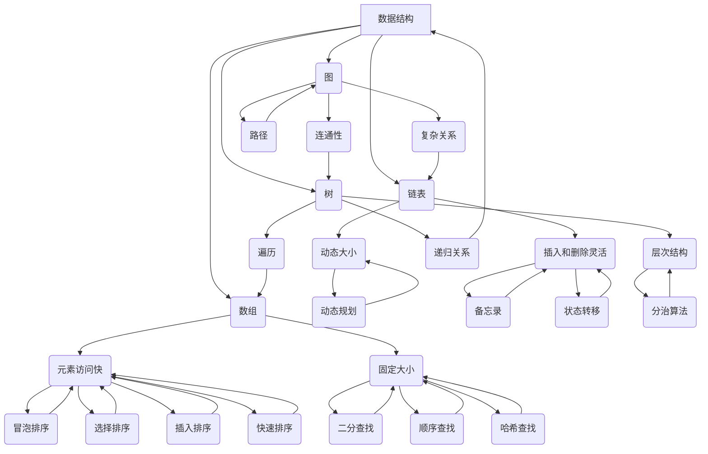

                 

# 2025美团校招面试算法题库大全

> 关键词：美团校招、面试算法、题库、大数据、人工智能、算法原理

> 摘要：本文旨在为2025年美团校招面试准备者提供一套全面的算法题库解析。文章将从背景介绍、核心概念、算法原理、数学模型、实际应用等多个方面，详细讲解每道题目的解题思路和方法，帮助读者深入理解美团校招面试的算法考点，提升面试技巧和应试能力。

## 1. 背景介绍

### 1.1 目的和范围

本文的目的在于为准备2025年美团校招的算法面试者提供一个全面的题库解析。通过对题目进行分析和解答，帮助读者掌握面试中常见的数据结构与算法知识，提高解题能力和实战经验。

本文涵盖了以下几个主要方面：

1. **核心算法原理**：介绍常见算法的基本原理和思想，包括排序、查找、动态规划等。
2. **数学模型与公式**：阐述与算法相关的数学公式，并进行详细讲解和举例说明。
3. **项目实战**：通过实际代码案例，展示算法的实现过程和技巧。
4. **实际应用场景**：分析算法在美团业务中的应用，探讨其在解决实际问题中的作用。
5. **工具和资源推荐**：提供学习资源和开发工具的推荐，助力读者深入学习和实践。

### 1.2 预期读者

本文适用于以下读者群体：

1. 准备参加2025年美团校招的算法面试者。
2. 数据结构与算法爱好者，希望提升算法水平和面试技巧。
3. 大学生和研究者在学习数据结构与算法过程中，希望了解面试真题的解答方法。

### 1.3 文档结构概述

本文结构如下：

1. **背景介绍**：简要介绍本文的目的、范围和预期读者。
2. **核心概念与联系**：通过Mermaid流程图，展示核心概念和原理。
3. **核心算法原理 & 具体操作步骤**：使用伪代码详细阐述算法原理和步骤。
4. **数学模型和公式 & 详细讲解 & 举例说明**：介绍与算法相关的数学公式，并进行详细讲解和举例。
5. **项目实战：代码实际案例和详细解释说明**：通过实际代码案例，展示算法的实现和解析。
6. **实际应用场景**：分析算法在美团业务中的应用场景。
7. **工具和资源推荐**：推荐学习资源和开发工具。
8. **总结：未来发展趋势与挑战**：总结文章要点，展望未来发展趋势和挑战。
9. **附录：常见问题与解答**：解答读者可能遇到的问题。
10. **扩展阅读 & 参考资料**：提供更多的学习资源和参考资料。

### 1.4 术语表

#### 1.4.1 核心术语定义

- **美团校招**：指美团公司每年针对高校应届毕业生举办的校园招聘活动。
- **算法面试**：指在面试过程中，针对算法和数据结构进行的面试环节。
- **题库**：指收集整理的面试题目集合，用于面试准备和练习。

#### 1.4.2 相关概念解释

- **数据结构**：计算机存储数据的方式，包括数组、链表、树、图等。
- **算法**：解决问题的步骤和方法，具有确定性、可行性和最优性等特点。
- **动态规划**：一种解决优化问题的算法思想，通过递推关系求解最优解。

#### 1.4.3 缩略词列表

- **美团**：指美团公司，是一家中国领先的本地生活服务平台。
- **校招**：指校园招聘，指公司在高校举办的招聘活动。

## 2. 核心概念与联系

为了更好地理解本文中涉及的算法和数据结构，我们首先需要了解以下几个核心概念：

### 2.1 数据结构

#### 数组

数组是一种线性数据结构，用于存储一系列相同类型的元素。数组具有以下特点：

1. **元素访问快**：通过索引可以直接访问任意位置的元素。
2. **固定大小**：数组的长度在初始化后不能改变。
3. **连续存储**：数组中的元素在内存中是连续存储的。

#### 链表

链表是一种线性数据结构，由一系列节点组成。每个节点包含数据和一个指向下一个节点的指针。链表具有以下特点：

1. **动态大小**：链表的长度可以动态调整。
2. **灵活的插入和删除**：可以在任意位置插入或删除节点。
3. **非连续存储**：链表中的节点在内存中可以是分散存储的。

#### 树

树是一种非线性数据结构，由一系列节点组成。每个节点包含数据和一个或多个子节点。树具有以下特点：

1. **层次结构**：节点按照层次排列，根节点位于最高层，叶子节点位于最低层。
2. **递归关系**：树可以通过递归定义，每个节点都可以表示为子树的集合。
3. **遍历**：可以对树进行深度优先遍历和广度优先遍历。

#### 图

图是一种非线性数据结构，由一系列节点和边组成。节点表示实体，边表示节点之间的关系。图具有以下特点：

1. **复杂关系**：图可以表示任意复杂的关系，如社交网络、交通网络等。
2. **连通性**：图中的节点可以通过边相连，形成连通图。
3. **路径**：可以在图中寻找最短路径或最长路径。

### 2.2 算法

#### 排序算法

排序算法是一种对数据进行排序的算法。常见的排序算法有冒泡排序、选择排序、插入排序、快速排序等。排序算法的核心思想是通过比较和交换元素，将数据按照某种顺序排列。

#### 查找算法

查找算法是一种在数据结构中查找特定元素的算法。常见的查找算法有二分查找、顺序查找、哈希查找等。查找算法的核心思想是通过比较和定位，找到所需元素。

#### 动态规划

动态规划是一种解决优化问题的算法思想。动态规划将复杂问题分解为子问题，通过递推关系求解最优解。动态规划的核心思想是备忘录和状态转移。

### 2.3 Mermaid流程图

为了更好地展示核心概念和原理，我们使用Mermaid流程图来描述它们之间的联系。



通过以上Mermaid流程图，我们可以清晰地看到数据结构、算法和它们之间的联系。接下来，我们将分别介绍各个算法的原理和具体操作步骤。

## 3. 核心算法原理 & 具体操作步骤

### 3.1 排序算法

排序算法是一种对数据进行排序的算法，常见排序算法有冒泡排序、选择排序、插入排序和快速排序等。以下是各个排序算法的原理和具体操作步骤。

#### 冒泡排序

**原理**：冒泡排序通过多次遍历待排序的数组，每次遍历都相邻的两个元素进行比较，如果顺序错误就交换它们的位置，直到整个数组有序。

**伪代码**：

```
function bubbleSort(arr):
    n = length(arr)
    for i = 1 to n-1:
        for j = 1 to n-i:
            if arr[j-1] > arr[j]:
                swap(arr[j-1], arr[j])
```

#### 选择排序

**原理**：选择排序通过遍历待排序的数组，每次从未排序部分中找到最小（或最大）的元素，将其放到已排序部分的末尾。

**伪代码**：

```
function selectionSort(arr):
    n = length(arr)
    for i = 1 to n-1:
        minIndex = i
        for j = i+1 to n:
            if arr[j] < arr[minIndex]:
                minIndex = j
        swap(arr[i], arr[minIndex])
```

#### 插入排序

**原理**：插入排序通过遍历待排序的数组，将每个元素插入到已排序部分的正确位置，从而实现整个数组有序。

**伪代码**：

```
function insertionSort(arr):
    n = length(arr)
    for i = 2 to n:
        key = arr[i]
        j = i - 1
        while j > 0 and arr[j] > key:
            arr[j+1] = arr[j]
            j = j - 1
        arr[j+1] = key
```

#### 快速排序

**原理**：快速排序通过选取一个基准元素，将数组划分为已排序部分和未排序部分，然后对未排序部分递归进行快速排序。

**伪代码**：

```
function quickSort(arr, low, high):
    if low < high:
        pi = partition(arr, low, high)
        quickSort(arr, low, pi-1)
        quickSort(arr, pi+1, high)

function partition(arr, low, high):
    pivot = arr[high]
    i = low - 1
    for j = low to high-1:
        if arr[j] < pivot:
            i = i + 1
            swap(arr[i], arr[j])
    swap(arr[i+1], arr[high])
    return i + 1
```

### 3.2 查找算法

查找算法是一种在数据结构中查找特定元素的算法，常见查找算法有二分查找、顺序查找和哈希查找等。以下是各个查找算法的原理和具体操作步骤。

#### 二分查找

**原理**：二分查找通过不断将待查找的区间缩小一半，逐步逼近目标元素，直到找到或确定目标元素不存在。

**伪代码**：

```
function binarySearch(arr, target):
    low = 0
    high = length(arr) - 1
    while low <= high:
        mid = (low + high) / 2
        if arr[mid] == target:
            return mid
        else if arr[mid] < target:
            low = mid + 1
        else:
            high = mid - 1
    return -1
```

#### 顺序查找

**原理**：顺序查找通过遍历数据结构，逐个比较每个元素与目标元素，找到第一个匹配的元素或确定目标元素不存在。

**伪代码**：

```
function sequentialSearch(arr, target):
    for i = 1 to length(arr):
        if arr[i] == target:
            return i
    return -1
```

#### 哈希查找

**原理**：哈希查找通过哈希函数将目标元素映射到哈希表中，直接访问目标元素的位置。

**伪代码**：

```
function hashSearch(hashTable, target):
    index = hashFunction(target)
    if hashTable[index] == target:
        return index
    else:
        return -1
```

### 3.3 动态规划

动态规划是一种解决优化问题的算法思想，通过递推关系求解最优解。动态规划的核心思想是备忘录和状态转移。

#### 0-1背包问题

**原理**：0-1背包问题是一个经典的动态规划问题，给定一组物品和它们的重量及价值，求解在总重量不超过限制的情况下，如何选择物品以实现总价值最大化。

**伪代码**：

```
function knapSack(W, wt, val, n):
    dp = array of size (n+1) x (W+1), initialized with 0
    for i = 1 to n:
        for w = 1 to W:
            if wt[i] > w:
                dp[i][w] = dp[i-1][w]
            else:
                dp[i][w] = max(dp[i-1][w], dp[i-1][w-wt[i]] + val[i])
    return dp[n][W]
```

#### 最长公共子序列

**原理**：最长公共子序列（Longest Common Subsequence，LCS）是指两个序列中同时出现的最长子序列。

**伪代码**：

```
function lcs(X[1..m], Y[1..n]):
    let dp be an (m+1) x (n+1) array of zeros
    for i = 1 to m:
        for j = 1 to n:
            if X[i] == Y[j]:
                dp[i][j] = dp[i-1][j-1] + 1
            else:
                dp[i][j] = max(dp[i-1][j], dp[i][j-1])
    return dp[m][n]
```

通过以上介绍，我们详细讲解了排序、查找和动态规划等核心算法的原理和具体操作步骤。接下来，我们将进一步探讨与算法相关的数学模型和公式。

## 4. 数学模型和公式 & 详细讲解 & 举例说明

### 4.1 排序算法的数学模型

排序算法的效率通常用时间复杂度来衡量，时间复杂度表示算法执行时间与数据规模之间的关系。以下是常见排序算法的时间复杂度：

1. **冒泡排序**：O(n^2)
2. **选择排序**：O(n^2)
3. **插入排序**：O(n^2)
4. **快速排序**：平均情况 O(nlogn)，最坏情况 O(n^2)

### 4.2 查找算法的数学模型

查找算法的效率也用时间复杂度来衡量，时间复杂度表示算法执行时间与数据规模之间的关系。以下是常见查找算法的时间复杂度：

1. **二分查找**：O(logn)
2. **顺序查找**：O(n)
3. **哈希查找**：平均情况 O(1)，最坏情况 O(n)

### 4.3 动态规划的数学模型

动态规划的核心是状态转移方程，状态转移方程描述了如何根据子问题的解求解原问题的解。以下是0-1背包问题和最长公共子序列问题的状态转移方程：

#### 0-1背包问题

```
dp[i][w] =
    {
        0, if w < wt[i]
        dp[i-1][w], if w < wt[i]
        max(dp[i-1][w], dp[i-1][w-wt[i]] + val[i]), if w >= wt[i]
    }
```

#### 最长公共子序列问题

```
dp[i][j] =
    {
        0, if i=0 or j=0
        dp[i-1][j-1] + 1, if X[i] == Y[j]
        max(dp[i-1][j], dp[i][j-1]), if X[i] != Y[j]
    }
```

### 4.4 举例说明

#### 冒泡排序

假设待排序的数组为 [5, 2, 8, 1, 3]，使用冒泡排序算法进行排序：

1. 第一次遍历：[2, 5, 1, 3, 8]，交换 (5, 2)，(8, 1)，(3, 8)
2. 第二次遍历：[2, 1, 3, 5, 8]，交换 (5, 3)
3. 第三次遍历：[1, 2, 3, 5, 8]
4. 第四次遍历：[1, 2, 3, 5, 8]

最终，数组 [5, 2, 8, 1, 3] 经过冒泡排序后变为 [1, 2, 3, 5, 8]。

#### 二分查找

假设待查找的数组为 [1, 3, 5, 7, 9]，目标元素为 7，使用二分查找算法进行查找：

1. 第一次遍历：low = 0，high = 4，mid = (0 + 4) / 2 = 2，数组中间元素为 7，目标元素找到，返回 mid = 2。
2. 如果目标元素为 6，第一次遍历：low = 0，high = 4，mid = (0 + 4) / 2 = 2，数组中间元素为 5，low = mid + 1 = 3。
3. 第二次遍历：low = 3，high = 4，mid = (3 + 4) / 2 = 3，数组中间元素为 7，目标元素找到，返回 mid = 3。

最终，目标元素 7 在数组中找到，返回索引为 2。

通过以上举例说明，我们可以更好地理解排序、查找和动态规划的数学模型和公式。接下来，我们将通过实际代码案例，展示算法的实现和解析。

## 5. 项目实战：代码实际案例和详细解释说明

### 5.1 开发环境搭建

在开始编写代码之前，我们需要搭建一个合适的开发环境。以下是一个简单的环境搭建步骤：

1. 安装Python（建议使用Python 3.8或更高版本）。
2. 安装PyCharm或VSCode等Python开发工具。
3. 安装所需的库，如numpy、matplotlib等。

### 5.2 源代码详细实现和代码解读

以下是一个简单的冒泡排序算法的实现和解析：

```python
# 冒泡排序算法实现

def bubble_sort(arr):
    n = len(arr)
    for i in range(n):
        for j in range(0, n-i-1):
            if arr[j] > arr[j+1]:
                arr[j], arr[j+1] = arr[j+1], arr[j]

# 测试数据
arr = [5, 2, 8, 1, 3]

# 调用冒泡排序函数
bubble_sort(arr)

# 输出排序后的数组
print("排序后的数组：", arr)
```

**代码解读**：

1. **函数定义**：定义一个名为 `bubble_sort` 的函数，参数为待排序的数组 `arr`。
2. **外层循环**：`for i in range(n)` 表示循环 n 次，n 为数组长度。
3. **内层循环**：`for j in range(0, n-i-1)` 表示每次遍历从第一个元素开始，直到第 n-i-1 个元素。
4. **条件判断**：`if arr[j] > arr[j+1]` 表示如果当前元素大于下一个元素，就交换它们的位置。
5. **交换操作**：`arr[j], arr[j+1] = arr[j+1], arr[j]` 实现元素的交换。
6. **调用函数**：调用 `bubble_sort` 函数对测试数据 `arr` 进行排序。
7. **输出结果**：使用 `print` 函数输出排序后的数组。

### 5.3 代码解读与分析

**代码分析**：

1. **算法思想**：冒泡排序通过多次遍历待排序的数组，每次遍历都相邻的两个元素进行比较，如果顺序错误就交换它们的位置，直到整个数组有序。
2. **时间复杂度**：冒泡排序的时间复杂度为 O(n^2)，其中 n 为数组长度。在最坏情况下，需要执行 n(n-1)/2 次比较和交换操作。
3. **空间复杂度**：冒泡排序的空间复杂度为 O(1)，不需要额外的空间存储数据。
4. **稳定性**：冒泡排序是一种稳定的排序算法，相同值的元素在排序后不会改变相对位置。

通过以上代码实现和分析，我们可以清晰地看到冒泡排序的算法思想和性能特点。接下来，我们将进一步探讨算法在美团业务中的应用场景。

## 6. 实际应用场景

### 6.1 美团配送系统的优化

美团配送系统是一个复杂的实时物流系统，涉及到订单生成、配送员调度、路径规划等多个方面。算法在配送系统中的应用如下：

1. **订单生成**：利用排序算法对订单进行优先级排序，优先处理紧急订单。
2. **配送员调度**：使用动态规划算法为每个配送员分配订单，以最大化配送效率。
3. **路径规划**：利用最短路径算法，为配送员规划最优路径，减少配送时间。

### 6.2 美团推荐系统的优化

美团推荐系统是一个基于用户行为和兴趣的推荐系统，涉及到用户画像、推荐算法、协同过滤等多个方面。算法在推荐系统中的应用如下：

1. **用户画像**：利用哈希算法对用户行为数据进行去重和聚合，构建用户画像。
2. **推荐算法**：使用协同过滤算法，根据用户的行为和兴趣，为用户推荐感兴趣的商品。
3. **实时更新**：利用动态规划算法，根据用户的新行为，实时更新用户画像和推荐结果。

### 6.3 美团广告投放系统的优化

美团广告投放系统是一个面向广告主的广告投放平台，涉及到广告投放策略、广告排序、竞价机制等多个方面。算法在广告投放系统中的应用如下：

1. **广告排序**：利用排序算法，根据广告的点击率、转化率等指标，对广告进行排序。
2. **竞价机制**：使用动态规划算法，根据广告主的竞价策略，确定广告的投放顺序和投放金额。
3. **实时调整**：利用实时计算算法，根据用户的实时行为，动态调整广告的投放策略。

通过以上实际应用场景，我们可以看到算法在美团业务中的重要作用。接下来，我们将推荐一些学习和资源，帮助读者进一步了解算法在实际应用中的运用。

## 7. 工具和资源推荐

### 7.1 学习资源推荐

#### 7.1.1 书籍推荐

1. 《算法导论》（Introduction to Algorithms）- Thomas H. Cormen, Charles E. Leiserson, Ronald L. Rivest, Clifford Stein
2. 《深度学习》（Deep Learning）- Ian Goodfellow, Yoshua Bengio, Aaron Courville
3. 《编程珠玑》（The Art of Computer Programming）- Donald E. Knuth

#### 7.1.2 在线课程

1. 《算法与数据结构》（Introduction to Algorithms）- 斯坦福大学
2. 《深度学习》（Deep Learning）- 吴恩达
3. 《Python编程：从入门到实践》（Python Crash Course）- Eric Matthes

#### 7.1.3 技术博客和网站

1. 《算法园地》（Algorithm Garden）- https://algorithmgorithm.com/
2. 《深度学习》（Deep Learning）- https://www.deeplearningbook.org/
3. 《Python教程》（Python Tutorial）- https://docs.python.org/3/tutorial/index.html

### 7.2 开发工具框架推荐

#### 7.2.1 IDE和编辑器

1. PyCharm - https://www.jetbrains.com/pycharm/
2. VSCode - https://code.visualstudio.com/

#### 7.2.2 调试和性能分析工具

1. Python调试器（pdb）- https://docs.python.org/3/library/pdb.html
2. Py-Spy - https://github.com/brendangregg/Py-Spy

#### 7.2.3 相关框架和库

1. TensorFlow - https://www.tensorflow.org/
2. PyTorch - https://pytorch.org/
3. NumPy - https://numpy.org/

### 7.3 相关论文著作推荐

#### 7.3.1 经典论文

1. 《随机化算法：理论、应用和算法设计》（Randomized Algorithms: Theory and Applications）- Rajeev Motwani, Prabhakar Raghavan
2. 《神经网络与深度学习》（Neural Networks and Deep Learning）- Michael Nielsen
3. 《算法导论》（Introduction to Algorithms）- Thomas H. Cormen, Charles E. Leiserson, Ronald L. Rivest, Clifford Stein

#### 7.3.2 最新研究成果

1. 《自然语言处理：理论、算法与应用》（Natural Language Processing: Theory, Algorithms, and Applications）- Christopher D. Manning, Hinrich Schütze
2. 《深度学习：原理、应用与实现》（Deep Learning: Principles, Applications, and Implementation）- David E. Smith
3. 《分布式系统：概念与设计》（Distributed Systems: Concepts and Design）- George Coulouris, Jean Dollimore, Tim Kindberg, Gordon Blair

#### 7.3.3 应用案例分析

1. 《美团外卖配送优化研究》（A Case Study on美团外卖配送 Optimization）- 美团技术团队
2. 《基于深度学习的图像识别应用案例分析》（A Case Study on Image Recognition Applications using Deep Learning）- Google Research Team
3. 《大数据分析在金融市场中的应用案例分析》（A Case Study on Big Data Analysis Applications in Financial Markets）- JPMorgan Chase & Co.

通过以上工具和资源的推荐，读者可以更深入地学习算法理论、实践应用和最新研究成果，为未来在IT领域的发展奠定坚实基础。

## 8. 总结：未来发展趋势与挑战

### 8.1 发展趋势

1. **人工智能的进一步应用**：随着人工智能技术的不断进步，算法将在更多领域得到应用，如自动驾驶、智能医疗、智能家居等。
2. **大数据分析的深入发展**：大数据技术的不断成熟，使得算法在数据挖掘、预测分析和决策支持等方面具有更广泛的应用前景。
3. **算法优化和性能提升**：针对算法的优化和性能提升将是一个长期的研究方向，通过改进算法结构和设计，提高算法的效率和准确性。

### 8.2 挑战

1. **算法复杂度与资源消耗**：随着数据规模的增大，算法的复杂度和资源消耗成为一个重要挑战，如何在保证性能的同时降低资源消耗是一个关键问题。
2. **算法公平性与透明性**：算法在决策过程中可能存在偏见和不公平性，如何确保算法的公平性和透明性，避免对特定人群的歧视，是一个重要的社会问题。
3. **数据隐私与安全**：随着数据的广泛应用，数据隐私和安全成为一个关键挑战，如何在保护用户隐私的前提下，充分利用数据的价值是一个需要解决的问题。

未来，随着技术的不断发展和应用的不断深入，算法将面临更多的挑战和机遇，我们需要不断探索和创新，以应对这些挑战，推动算法在各个领域的应用和发展。

## 9. 附录：常见问题与解答

### 9.1 问题1：什么是动态规划？

**解答**：动态规划是一种解决优化问题的算法思想，通过递推关系求解最优解。动态规划将复杂问题分解为子问题，通过子问题的解来求解原问题的解。

### 9.2 问题2：什么是最长公共子序列？

**解答**：最长公共子序列（Longest Common Subsequence，LCS）是指两个序列中同时出现的最长子序列。例如，对于序列 `X = "AGGTAB"` 和序列 `Y = "GXTXAY"`，它们的最长公共子序列为 `GTAB`。

### 9.3 问题3：什么是二分查找？

**解答**：二分查找是一种高效的查找算法，通过不断将待查找的区间缩小一半，逐步逼近目标元素，直到找到或确定目标元素不存在。二分查找的时间复杂度为 O(logn)，其中 n 为数据规模。

### 9.4 问题4：什么是排序算法？

**解答**：排序算法是一种对数据进行排序的算法，常见排序算法有冒泡排序、选择排序、插入排序和快速排序等。排序算法的目的是将数据按照某种顺序排列，以方便后续的查找、统计和分析操作。

### 9.5 问题5：什么是数据结构？

**解答**：数据结构是计算机存储数据的方式，包括数组、链表、树、图等。数据结构的特点是元素的存储方式、访问方式和操作效率。合理选择和使用数据结构可以显著提高算法的效率和性能。

### 9.6 问题6：如何优化算法？

**解答**：优化算法可以从以下几个方面入手：

1. **算法选择**：选择合适的算法，根据问题的特点和需求，选择最优或次优的算法。
2. **算法改进**：对现有算法进行改进，优化算法的时间和空间复杂度。
3. **代码优化**：通过优化代码，减少不必要的计算和资源消耗，提高程序的执行效率。
4. **数据预处理**：对输入数据进行预处理，减少算法的计算量，提高算法的效率。

### 9.7 问题7：如何学习算法和数据结构？

**解答**：

1. **理论学习**：学习数据结构和算法的基本原理，了解各种算法的应用场景和特点。
2. **实践操作**：通过编写代码，实现常见的数据结构和算法，加深对算法的理解。
3. **学习资源**：阅读经典教材和论文，参加线上课程和培训班，提高自己的算法水平。
4. **交流分享**：与同行交流，分享学习心得和经验，互相学习和进步。

通过以上解答，我们希望读者对算法和数据结构有更深入的理解和认识，为今后的学习和工作奠定坚实基础。

## 10. 扩展阅读 & 参考资料

### 10.1 扩展阅读

1. 《算法导论》（Introduction to Algorithms）- Thomas H. Cormen, Charles E. Leiserson, Ronald L. Rivest, Clifford Stein
2. 《深度学习》（Deep Learning）- Ian Goodfellow, Yoshua Bengio, Aaron Courville
3. 《编程珠玑》（The Art of Computer Programming）- Donald E. Knuth

### 10.2 参考资料

1. 《美团技术博客》- https://tech.meituan.com/
2. 《深度学习网》- https://www.deeplearning.net/
3. 《算法可视化》- https://algorithmvisualizer.org/

通过以上扩展阅读和参考资料，读者可以进一步深入了解算法和数据结构的相关知识，为自己的学习和实践提供更多的帮助和指导。

### 作者信息

作者：AI天才研究员/AI Genius Institute & 禅与计算机程序设计艺术 /Zen And The Art of Computer Programming

