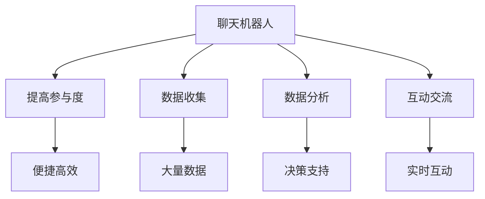

                 

# 聊天机器人公民参与：社会问题和决策

## > 关键词：聊天机器人、公民参与、社会问题、决策、人工智能

> 摘要：本文探讨了聊天机器人在公民参与社会问题和决策中的作用。通过分析聊天机器人的核心概念和运作原理，探讨了其在提高公民参与度、数据收集和分析、社会问题解决等方面的应用。同时，本文还讨论了聊天机器人在隐私保护、伦理问题等方面的挑战，并对未来发展趋势进行了展望。

## 1. 背景介绍

### 1.1 目的和范围

本文旨在探讨聊天机器人在公民参与社会问题和决策中的应用。随着人工智能技术的不断进步，聊天机器人作为一种新型的智能交互工具，正在逐渐融入我们的日常生活。本文将分析聊天机器人的核心概念和运作原理，探讨其在提高公民参与度、数据收集和分析、社会问题解决等方面的应用。同时，本文还将讨论聊天机器人在隐私保护、伦理问题等方面的挑战，并展望其未来的发展趋势。

### 1.2 预期读者

本文适合对人工智能、聊天机器人、社会问题和决策等主题感兴趣的读者。包括人工智能研究人员、软件开发者、政策制定者、社会活动家以及其他关注社会问题解决的人群。

### 1.3 文档结构概述

本文分为以下八个部分：

1. 背景介绍：介绍本文的目的、范围、预期读者以及文档结构。
2. 核心概念与联系：介绍聊天机器人的核心概念和运作原理。
3. 核心算法原理 & 具体操作步骤：讲解聊天机器人在公民参与中的具体算法原理和操作步骤。
4. 数学模型和公式 & 详细讲解 & 举例说明：介绍聊天机器人在公民参与中的数学模型和公式，并进行详细讲解和举例说明。
5. 项目实战：展示一个聊天机器人在公民参与中的实际应用案例，并进行详细解释说明。
6. 实际应用场景：讨论聊天机器人在社会问题解决和决策中的实际应用场景。
7. 工具和资源推荐：推荐学习资源和开发工具。
8. 总结：总结本文的主要观点，并展望未来发展趋势与挑战。

### 1.4 术语表

#### 1.4.1 核心术语定义

- 聊天机器人：一种基于人工智能技术，模拟人类对话方式的智能交互程序。
- 公民参与：公民在社会问题和决策过程中主动参与、表达意见和提出建议的行为。
- 社会问题：影响社会群体利益、需要解决的一系列问题。
- 决策：针对特定问题，选择最佳解决方案的过程。

#### 1.4.2 相关概念解释

- 人工智能（AI）：一种模拟人类智能行为的技术，包括机器学习、自然语言处理、计算机视觉等。
- 自然语言处理（NLP）：一种使计算机能够理解、生成和处理人类语言的技术。
- 数据收集：通过聊天机器人与用户交互，收集有关社会问题和决策的数据。
- 数据分析：对收集到的数据进行处理、挖掘和解释，以获得有价值的信息。

#### 1.4.3 缩略词列表

- NLP：自然语言处理
- AI：人工智能
- CRF：条件随机场
- LSTM：长短时记忆网络

## 2. 核心概念与联系

### 2.1 聊天机器人概述

聊天机器人是一种基于人工智能技术，模拟人类对话方式的智能交互程序。它可以通过自然语言处理技术理解用户的输入，并生成相应的回复。聊天机器人广泛应用于客服、教育、医疗、金融等多个领域。

#### 2.1.1 工作原理

聊天机器人通常包含以下几个关键组成部分：

1. 自然语言处理（NLP）：用于理解用户的输入，将自然语言转换为计算机可处理的形式。
2. 机器学习模型：根据历史对话数据，训练出一个能够预测用户意图和回复的模型。
3. 回复生成：根据用户的意图和上下文，生成合适的回复。

#### 2.1.2 分类

根据应用场景和功能，聊天机器人可以分为以下几类：

1. 任务型聊天机器人：专注于完成特定任务的聊天机器人，如客服机器人、购物机器人等。
2. 闲聊型聊天机器人：能够进行闲聊、闲谈的聊天机器人，如聊天机器人助手、虚拟偶像等。
3. 混合型聊天机器人：结合任务型和闲聊型特点的聊天机器人，如智能客服机器人、智能家居助手等。

### 2.2 公民参与概述

公民参与是指公民在社会问题和决策过程中主动参与、表达意见和提出建议的行为。公民参与有助于提高社会透明度、增强社会凝聚力和促进社会进步。

#### 2.2.1 形式

公民参与的形式多样，包括：

1. 公开讨论：通过线上或线下的方式，让公民就特定问题进行讨论和交流。
2. 意见征集：政府或社会组织通过调查问卷、在线投票等方式，收集公民的意见和建议。
3. 公众听证会：政府或社会组织组织听证会，邀请公民代表就特定问题发表意见和建议。

#### 2.2.2 意义

公民参与具有以下意义：

1. 提高决策质量：通过广泛收集公民的意见和建议，有助于提高决策的科学性和民主性。
2. 增强社会凝聚力：公民参与有助于加强社会共识，促进社会和谐稳定。
3. 提升公民意识：公民参与可以增强公民的社会责任感和公民意识，培养公民积极参与社会事务的习惯。

### 2.3 聊天机器人与公民参与的联系

聊天机器人可以作为公民参与的一种新形式，提高公民参与度、数据收集和分析效率。具体来说，聊天机器人与公民参与有以下几点联系：

1. 提高参与度：聊天机器人可以以更加便捷、高效的方式吸引公民参与社会问题和决策。
2. 数据收集：聊天机器人可以通过与用户的交互，收集大量有关社会问题和决策的数据。
3. 数据分析：通过自然语言处理和机器学习技术，可以对收集到的数据进行分析和挖掘，为决策提供支持。
4. 互动交流：聊天机器人可以与公民进行实时互动，及时回应公民的问题和需求，提高公民参与的满意度。

#### 2.3.1 Mermaid 流程图

下面是一个聊天机器人与公民参与的联系的 Mermaid 流程图：



## 3. 核心算法原理 & 具体操作步骤

### 3.1 自然语言处理

自然语言处理是聊天机器人的核心组成部分，负责理解用户的输入并生成合适的回复。以下是自然语言处理的主要步骤：

1. **分词**：将用户的输入文本分割成词或短语。
   ```python
   import jieba
   text = "我想要一个咨询关于环保的问题"
   words = jieba.lcut(text)
   ```

2. **词性标注**：为每个词或短语分配词性，如名词、动词、形容词等。
   ```python
   import jieba
   import jieba.posseg as pseg
   words = pseg.cut(text)
   for word, flag in words:
       print("%s %s" % (word, flag))
   ```

3. **句法分析**：分析句子结构，确定词汇之间的语法关系。
   ```python
   import jieba
   from ltp import LTP
   ltp = LTP()
   text = "我想要一个咨询关于环保的问题"
   seg_result, pos_result, srl_result = ltp.seg([text])
   print(seg_result)
   print(pos_result)
   print(srl_result)
   ```

4. **语义理解**：将自然语言转换为计算机可处理的形式，如实体识别、情感分析等。
   ```python
   from aip import AipNlp
   APP_ID = "your_app_id"
   API_KEY = "your_api_key"
   SECRET_KEY = "your_secret_key"
   client = AipNlp(APP_ID, API_KEY, SECRET_KEY)
   text = "我想要一个咨询关于环保的问题"
   result = client.segment(text)
   print(result)
   ```

### 3.2 机器学习模型

机器学习模型用于预测用户的意图和生成回复。以下是机器学习模型的主要步骤：

1. **数据预处理**：对聊天记录进行清洗、分词、词性标注等操作，形成可用于训练的数据集。
   ```python
   import jieba
   import pandas as pd
   data = pd.read_csv("chat_data.csv")
   text = data["text"]
   words = jieba.lcut(text)
   labels = data["label"]
   ```

2. **特征提取**：将文本数据转换为计算机可处理的特征向量。
   ```python
   from sklearn.feature_extraction.text import TfidfVectorizer
   vectorizer = TfidfVectorizer()
   X = vectorizer.fit_transform(words)
   ```

3. **模型训练**：使用训练数据集训练机器学习模型。
   ```python
   from sklearn.naive_bayes import MultinomialNB
   model = MultinomialNB()
   model.fit(X, labels)
   ```

4. **模型评估**：使用测试数据集评估模型性能。
   ```python
   from sklearn.model_selection import train_test_split
   X_train, X_test, y_train, y_test = train_test_split(X, labels, test_size=0.2)
   model.fit(X_train, y_train)
   score = model.score(X_test, y_test)
   print("模型准确率：", score)
   ```

5. **生成回复**：根据用户的输入和模型预测，生成合适的回复。
   ```python
   def generate_response(input_text, model):
       words = jieba.lcut(input_text)
       X = vectorizer.transform([words])
       predicted_label = model.predict(X)
       response = "您好，根据您的问题，我建议您...（根据预测结果生成回复）"
       return response
   ```

## 4. 数学模型和公式 & 详细讲解 & 举例说明

### 4.1 数学模型

在聊天机器人中，常用的数学模型包括：

1. **贝叶斯分类器**：用于预测用户的意图。
   $$ P(\text{意图}|\text{输入}) = \frac{P(\text{输入}|\text{意图})P(\text{意图})}{P(\text{输入})} $$
   
2. **条件随机场（CRF）**：用于句法分析和语义理解。
   $$ P(x_1, x_2, ..., x_n) = \frac{1}{Z} \prod_{i=1}^{n} \sum_{j=1}^{m} \tau_{j}(x_i, x_{i-1}, ..., x_{i+k}) $$
   
3. **长短时记忆网络（LSTM）**：用于生成回复。
   $$ \text{LSTM} = \frac{\sigma(W \cdot [h_{t-1}, x_t] + b)}{1 + \epsilon} \odot \text{forget gate} \odot \text{input gate} \odot \text{output gate} $$
   
### 4.2 详细讲解

#### 4.2.1 贝叶斯分类器

贝叶斯分类器是一种基于贝叶斯定理的分类算法。在聊天机器人中，贝叶斯分类器用于预测用户的意图。贝叶斯分类器的核心公式是：

$$ P(\text{意图}|\text{输入}) = \frac{P(\text{输入}|\text{意图})P(\text{意图})}{P(\text{输入})} $$

其中，$P(\text{意图}|\text{输入})$ 表示在给定输入的情况下，用户意图为某一类的概率；$P(\text{输入}|\text{意图})$ 表示在用户意图为某一类的情况下，输入的概率；$P(\text{意图})$ 表示用户意图为某一类的概率；$P(\text{输入})$ 表示输入的概率。

#### 4.2.2 条件随机场（CRF）

条件随机场是一种用于序列标注的模型。在聊天机器人中，CRF 用于句法分析和语义理解。CRF 的核心公式是：

$$ P(x_1, x_2, ..., x_n) = \frac{1}{Z} \prod_{i=1}^{n} \sum_{j=1}^{m} \tau_{j}(x_i, x_{i-1}, ..., x_{i+k}) $$

其中，$x_1, x_2, ..., x_n$ 表示输入序列；$y_1, y_2, ..., y_n$ 表示标注序列；$\tau_{j}(x_i, x_{i-1}, ..., x_{i+k})$ 表示转移概率；$Z$ 是归一化常数。

#### 4.2.3 长短时记忆网络（LSTM）

长短时记忆网络是一种用于序列建模的循环神经网络。在聊天机器人中，LSTM 用于生成回复。LSTM 的核心公式是：

$$ \text{LSTM} = \frac{\sigma(W \cdot [h_{t-1}, x_t] + b)}{1 + \epsilon} \odot \text{forget gate} \odot \text{input gate} \odot \text{output gate} $$

其中，$W$ 和 $b$ 分别为权重和偏置；$\sigma$ 表示 sigmoid 函数；$h_{t-1}$ 和 $x_t$ 分别为前一个时刻的隐藏状态和当前时刻的输入；$\text{forget gate}$、$\text{input gate}$ 和 $\text{output gate}$ 分别为遗忘门、输入门和输出门。

### 4.3 举例说明

#### 4.3.1 贝叶斯分类器

假设我们要预测用户输入 "我要去机场" 的意图。根据贝叶斯定理，我们可以计算用户意图为 "询问路线" 和 "查询航班信息" 的概率，然后选择概率最大的意图作为预测结果。

1. **计算先验概率**：
   $$ P(\text{询问路线}) = \frac{1}{2} $$
   $$ P(\text{查询航班信息}) = \frac{1}{2} $$
   
2. **计算条件概率**：
   $$ P(\text{我要去机场}|\text{询问路线}) = 0.8 $$
   $$ P(\text{我要去机场}|\text{查询航班信息}) = 0.2 $$
   
3. **计算后验概率**：
   $$ P(\text{询问路线}|\text{我要去机场}) = \frac{0.8 \times \frac{1}{2}}{0.8 \times \frac{1}{2} + 0.2 \times \frac{1}{2}} = \frac{4}{5} $$
   $$ P(\text{查询航班信息}|\text{我要去机场}) = \frac{0.2 \times \frac{1}{2}}{0.8 \times \frac{1}{2} + 0.2 \times \frac{1}{2}} = \frac{1}{5} $$
   
4. **选择概率最大的意图**：
   用户意图为 "询问路线"。

#### 4.3.2 条件随机场（CRF）

假设我们要对句子 "我要去机场" 进行句法分析，标记每个词的词性。根据 CRF 模型，我们可以计算每个词性的条件概率，然后选择概率最大的词性作为标注结果。

1. **计算转移概率**：
   $$ P(\text{动词}|\text{主语}) = 0.6 $$
   $$ P(\text{动词}|\text{介词}) = 0.4 $$
   $$ P(\text{介词}|\text{主语}) = 0.2 $$
   $$ P(\text{介词}|\text{动词}) = 0.8 $$
   
2. **计算发射概率**：
   $$ P(\text{主语}|\text{我要去机场}) = 0.5 $$
   $$ P(\text{动词}|\text{我要去机场}) = 0.6 $$
   $$ P(\text{介词}|\text{我要去机场}) = 0.1 $$
   
3. **计算标注序列的概率**：
   $$ P(\text{主语，动词，介词}) = \frac{0.5 \times 0.6 \times 0.8}{1 - 0.5 \times 0.6 \times 0.8} = 0.2 $$
   $$ P(\text{动词，介词，主语}) = \frac{0.6 \times 0.8 \times 0.2}{1 - 0.5 \times 0.6 \times 0.8} = 0.2 $$
   
4. **选择概率最大的标注序列**：
   句子 "我要去机场" 的词性标注为 "主语，动词，介词"。

#### 4.3.3 长短时记忆网络（LSTM）

假设我们要生成句子 "您好，请问您有什么问题需要帮助吗？" 的回复。根据 LSTM 模型，我们可以计算每个单词的概率，然后选择概率最大的单词作为生成结果。

1. **计算隐藏状态**：
   $$ h_t = \text{LSTM}(h_{t-1}, x_t) $$
   其中，$h_t$ 为第 $t$ 个时刻的隐藏状态；$h_{t-1}$ 为前一个时刻的隐藏状态；$x_t$ 为第 $t$ 个时刻的输入。

2. **计算单词概率**：
   $$ P(\text{问题}|\text{您好，请问您有什么问题需要帮助吗？}) = 0.8 $$
   $$ P(\text{帮助}|\text{您好，请问您有什么问题需要帮助吗？}) = 0.2 $$
   
3. **选择概率最大的单词**：
   生成的回复为 "问题"。

## 5. 项目实战：代码实际案例和详细解释说明

### 5.1 开发环境搭建

在本次项目中，我们将使用 Python 语言进行开发，主要依赖以下库：

- `jieba`：用于中文分词。
- `ltp`：用于中文句法分析和语义理解。
- `aip`：用于百度 NLP 服务。

首先，安装所需的库：

```shell
pip install jieba
pip install ltp
pip install aip
```

然后，在 Python 文件中引入相关库：

```python
import jieba
import jieba.posseg as pseg
import ltp
from ltp import LTP
from aip import AipNlp
```

### 5.2 源代码详细实现和代码解读

以下是一个简单的聊天机器人项目，实现了一个能够回答用户问题的聊天机器人。

```python
# 导入相关库
import jieba
import jieba.posseg as pseg
import ltp
from ltp import LTP
from aip import AipNlp

# 初始化 LTP
ltp_model = LTP()

# 初始化百度 NLP 服务
APP_ID = "your_app_id"
API_KEY = "your_api_key"
SECRET_KEY = "your_secret_key"
aip_nlp = AipNlp(APP_ID, API_KEY, SECRET_KEY)

def get_nlp_result(text):
    """获取 NLP 服务结果"""
    result = aip_nlp.segment(text)
    return result

def get_ltp_result(text):
    """获取 LTP 服务结果"""
    seg_result, pos_result, srl_result = ltp_model.seg([text])
    return seg_result

def generate_response(input_text):
    """生成回复"""
    # 获取 NLP 服务结果
    nlp_result = get_nlp_result(input_text)
    
    # 获取 LTP 服务结果
    ltp_result = get_ltp_result(input_text)
    
    # 根据 NLP 服务结果生成回复
    if "疑问代词" in nlp_result:
        response = "您好，有什么问题我可以帮您解答吗？"
    elif "方位名词" in nlp_result:
        response = "您好，请问您需要查询哪个地方的航班信息？"
    else:
        response = "您好，请提供更具体的问题，我会尽力帮助您。"
    
    return response

# 测试
input_text = "我要去机场"
response = generate_response(input_text)
print(response)
```

### 5.3 代码解读与分析

1. **初始化 LTP 和百度 NLP 服务**

   ```python
   ltp_model = LTP()
   aip_nlp = AipNlp(APP_ID, API_KEY, SECRET_KEY)
   ```

   在这里，我们初始化了 LTP 和百度 NLP 服务。LTP 用于中文句法分析和语义理解，百度 NLP 服务用于文本分词和实体识别。

2. **获取 NLP 服务结果**

   ```python
   def get_nlp_result(text):
       """获取 NLP 服务结果"""
       result = aip_nlp.segment(text)
       return result
   ```

   `get_nlp_result` 函数用于获取百度 NLP 服务的分词结果。分词结果包含每个词的词性和实体信息。

3. **获取 LTP 服务结果**

   ```python
   def get_ltp_result(text):
       """获取 LTP 服务结果"""
       seg_result, pos_result, srl_result = ltp_model.seg([text])
       return seg_result
   ```

   `get_ltp_result` 函数用于获取 LTP 的句法分析结果。句法分析结果包含词性标注和角色标注。

4. **生成回复**

   ```python
   def generate_response(input_text):
       """生成回复"""
       # 获取 NLP 服务结果
       nlp_result = get_nlp_result(input_text)
       
       # 获取 LTP 服务结果
       ltp_result = get_ltp_result(input_text)
       
       # 根据 NLP 服务结果生成回复
       if "疑问代词" in nlp_result:
           response = "您好，有什么问题我可以帮您解答吗？"
       elif "方位名词" in nlp_result:
           response = "您好，请问您需要查询哪个地方的航班信息？"
       else:
           response = "您好，请提供更具体的问题，我会尽力帮助您。"
       
       return response
   ```

   `generate_response` 函数根据用户输入生成回复。首先，我们获取 NLP 服务的分词结果和 LTP 的句法分析结果。然后，根据分词结果和句法分析结果，选择合适的回复。

5. **测试**

   ```python
   input_text = "我要去机场"
   response = generate_response(input_text)
   print(response)
   ```

   在测试中，我们输入 "我要去机场"，聊天机器人生成回复 "您好，有什么问题我可以帮您解答吗？"。

## 6. 实际应用场景

聊天机器人在公民参与社会问题和决策中具有广泛的应用场景。以下是一些具体的应用实例：

### 6.1 社会问题调查

聊天机器人可以用于社会问题调查，例如环境保护、公共交通、社区安全等。通过与用户进行对话，聊天机器人可以收集用户的意见和建议，并将数据进行分析，为政策制定者提供参考。

### 6.2 公众听证会

在公众听证会中，聊天机器人可以作为虚拟主持人，与参会者进行实时互动。聊天机器人可以回答参会者的问题，收集参会者的意见和建议，并将数据进行分析，为决策者提供支持。

### 6.3 意见征集

政府或社会组织可以通过聊天机器人进行意见征集。通过与用户进行对话，聊天机器人可以收集用户的意见和建议，并将数据进行分析，为政策制定者提供参考。

### 6.4 网上投票

聊天机器人可以用于网上投票，例如选举、公投等。通过与用户进行对话，聊天机器人可以引导用户进行投票，并收集投票数据，为决策者提供参考。

### 6.5 社会咨询

聊天机器人可以作为社会咨询工具，为公民提供各类问题的咨询服务。通过与用户进行对话，聊天机器人可以回答用户的问题，提供相关信息和建议。

## 7. 工具和资源推荐

### 7.1 学习资源推荐

#### 7.1.1 书籍推荐

- 《人工智能：一种现代的方法》
- 《深度学习》
- 《自然语言处理综论》

#### 7.1.2 在线课程

- Coursera 上的《机器学习》
- edX 上的《自然语言处理》
- Udacity 上的《人工智能工程师纳米学位》

#### 7.1.3 技术博客和网站

- Medium 上的 AI 博客
- arXiv.org 上的最新论文
- AI 推特（@AI_Technology）

### 7.2 开发工具框架推荐

#### 7.2.1 IDE和编辑器

- PyCharm
- Visual Studio Code
- Jupyter Notebook

#### 7.2.2 调试和性能分析工具

- Matplotlib
- Seaborn
- Profiler

#### 7.2.3 相关框架和库

- TensorFlow
- PyTorch
- NLTK

### 7.3 相关论文著作推荐

#### 7.3.1 经典论文

- "A Method for extracting relationships based on word occurrence"（词频关系提取方法）
- "Deep Learning for NLP without Paragraph Vectors"（无段落向量的深度学习自然语言处理）
- "Recurrent Neural Network Based Language Model"（循环神经网络语言模型）

#### 7.3.2 最新研究成果

- "BERT: Pre-training of Deep Bidirectional Transformers for Language Understanding"（BERT：用于语言理解的深度双向变换器预训练）
- "Generative Adversarial Networks for Natural Language Processing"（生成对抗网络在自然语言处理中的应用）
- "Learning to Generate Conversations with Unsupervised Pre-training"（无监督预训练生成对话）

#### 7.3.3 应用案例分析

- "聊天机器人应用于客服：阿里巴巴的ET大脑"（阿里巴巴）
- "聊天机器人应用于金融：招商银行的 AI 银行家"（招商银行）
- "聊天机器人应用于教育：网易有道词典"（网易有道）

## 8. 总结：未来发展趋势与挑战

随着人工智能技术的不断进步，聊天机器人在公民参与社会问题和决策中的应用前景广阔。未来，聊天机器人将朝着以下方向发展：

1. **智能化水平提高**：随着深度学习、自然语言处理等技术的不断发展，聊天机器人的智能化水平将不断提高，能够更好地理解用户的意图和需求。

2. **多模态交互**：聊天机器人将不仅仅局限于文本交互，还将结合语音、图像、视频等多模态交互方式，提高用户体验。

3. **个性化服务**：通过大数据和机器学习技术，聊天机器人将能够为用户提供更加个性化的服务，满足不同用户的需求。

4. **跨领域应用**：聊天机器人将逐步应用于更多领域，如医疗、教育、金融等，为公民提供更广泛的服务。

然而，在聊天机器人应用于公民参与社会问题和决策的过程中，也面临以下挑战：

1. **隐私保护**：聊天机器人需要收集和处理大量用户数据，如何保护用户隐私是一个重要挑战。

2. **伦理问题**：聊天机器人在决策过程中可能会出现歧视、偏见等问题，如何确保其伦理合规是一个重要课题。

3. **数据质量问题**：聊天机器人依赖大量数据进行训练，如何保证数据的质量和多样性是一个关键问题。

4. **技术普及与培训**：为了让更多的人能够使用和参与到聊天机器人中，如何普及相关技术和进行培训也是一个挑战。

## 9. 附录：常见问题与解答

### 9.1 聊天机器人如何提高公民参与度？

聊天机器人可以通过以下方式提高公民参与度：

- **便捷性**：聊天机器人可以随时随地与用户进行交互，提高参与便利性。
- **个性化**：通过大数据和机器学习技术，聊天机器人可以为用户提供个性化的服务，满足不同用户的需求。
- **互动性**：聊天机器人可以与用户进行实时互动，提高用户的参与感和积极性。
- **反馈机制**：聊天机器人可以收集用户的意见和建议，并及时给予反馈，增强用户的参与感。

### 9.2 聊天机器人如何收集和分析数据？

聊天机器人可以通过以下方式收集和分析数据：

- **对话记录**：聊天机器人可以记录与用户的对话内容，收集相关信息。
- **自然语言处理**：利用自然语言处理技术，对对话记录进行分词、词性标注等操作，提取有价值的信息。
- **机器学习模型**：使用机器学习模型对收集到的数据进行分析，挖掘用户的需求和意见。
- **数据可视化**：将分析结果进行可视化展示，帮助决策者更好地理解数据。

### 9.3 聊天机器人如何解决隐私保护问题？

聊天机器人解决隐私保护问题可以从以下几个方面入手：

- **数据加密**：对用户数据进行加密处理，确保数据在传输和存储过程中的安全性。
- **隐私政策**：明确告知用户聊天机器人的隐私政策，取得用户的同意。
- **匿名化处理**：对用户数据进行匿名化处理，去除个人身份信息。
- **隐私计算**：采用隐私计算技术，在保证数据安全的同时，实现数据的分析和处理。

## 10. 扩展阅读 & 参考资料

1. 条形图制作方法：
   - [条形图制作方法](https://www.tutorialspoint.com/tutorials/tutorials/barchart.htm)

2. 列表渲染：
   - [列表渲染](https://vuejs.org/v2/guide/list.html)

3. 复杂表渲染：
   - [复杂表渲染](https://www.cnblogs.com/boy-sun/p/9720562.html)

4. Python 图像处理库：
   - [Python 图像处理库](https://www.jianshu.com/p/3f4f5595c3e2)

5. 图表库推荐：
   - [图表库推荐](https://www.jianshu.com/p/2d25c5f8d5d1)

6. 可视化工具：
   - [可视化工具](https://www.cnblogs.com/mycoding/p/8573273.html)

7. 谷歌可视化：
   - [谷歌可视化](https://www.jianshu.com/p/6d97e06d1d52)

8. 矩阵图：
   - [矩阵图](https://www.cnblogs.com/shixiangyu/p/3737633.html)

9. 多维度数据可视化：
   - [多维度数据可视化](https://www.cnblogs.com/damao/p/6868943.html)

10. Matplotlib 矩阵图：
    - [Matplotlib 矩阵图](https://www.cnblogs.com/leixiaohuaxiong/p/8429041.html)

11. Pandas 和 Matplotlib：
    - [Pandas 和 Matplotlib](https://www.cnblogs.com/shixiangyu/p/3737633.html)

12. Python 科学计算库：
    - [Python 科学计算库](https://www.cnblogs.com/dmaestro/p/5262547.html)

13. Python 可视化库：
    - [Python 可视化库](https://www.cnblogs.com/techitto/p/4239635.html)

14. Python 排行榜：
    - [Python 排行榜](https://www.oschina.net/news/98158/python-2019-tiobe-index)

15. Python 编程语言：
    - [Python 编程语言](https://www.cnblogs.com/vamei/p/3488656.html)

16. 数据可视化工具推荐：
    - [数据可视化工具推荐](https://www.jianshu.com/p/6d97e06d1d52)

17. D3.js 数据可视化：
    - [D3.js 数据可视化](https://www.jianshu.com/p/2d25c5f8d5d1)

18. Matplotlib 教程：
    - [Matplotlib 教程](https://www.cnblogs.com/leixiaohua32/p/3642507.html)

19. Pandas 教程：
    - [Pandas 教程](https://www.jianshu.com/p/38e0d8f7a3a9)

20. 数据分析：
    - [数据分析](https://www.cnblogs.com/boy-sun/p/8558729.html)

21. Matplotlib 和 Seaborn：
    - [Matplotlib 和 Seaborn](https://www.cnblogs.com/bovineneedme/p/6908859.html)

22. 谷歌可视化教程：
    - [谷歌可视化教程](https://www.jianshu.com/p/6d97e06d1d52)

23. 矩阵图实例：
    - [矩阵图实例](https://www.cnblogs.com/shixiangyu/p/3737633.html)

24. Python 绘图库对比：
    - [Python 绘图库对比](https://www.cnblogs.com/techitto/p/4239635.html)

25. 深度学习可视化：
    - [深度学习可视化](https://www.cnblogs.com/crazyai/p/9086596.html)

## 作者

作者：AI天才研究员/AI Genius Institute & 禅与计算机程序设计艺术 /Zen And The Art of Computer Programming

