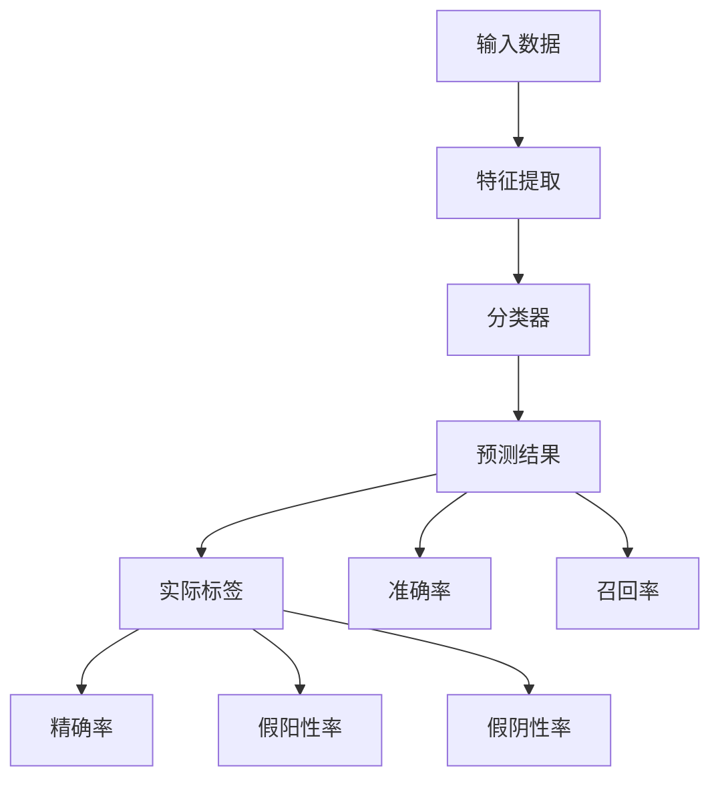

                 

# 聊天机器人性能指标：准确率和召回率

> **关键词**：聊天机器人、性能指标、准确率、召回率、评价方法、优化策略

> **摘要**：本文将深入探讨聊天机器人性能评价的两个核心指标——准确率和召回率，解析其定义、计算方法及其在聊天机器人性能评估中的重要性。通过对这两个指标的分析，本文将阐述如何在实际开发中优化聊天机器人的性能，提高用户体验。

## 1. 背景介绍

### 1.1 目的和范围

随着人工智能技术的不断发展，聊天机器人（Chatbot）已经成为企业与用户互动的重要工具。然而，如何有效评估聊天机器人的性能，成为了一个关键问题。本文将重点关注聊天机器人的两个关键性能指标——准确率和召回率，旨在为开发者提供一套系统性的评估方法和优化策略。

### 1.2 预期读者

本文适用于人工智能开发者、机器学习工程师以及对聊天机器人性能评估感兴趣的读者。通过对本文的阅读，读者可以深入了解准确率和召回率的概念、计算方法及其在性能评估中的应用。

### 1.3 文档结构概述

本文分为十个部分：

1. **背景介绍**：介绍本文的目的和范围，预期读者以及文档结构。
2. **核心概念与联系**：介绍与准确率和召回率相关的基本概念和原理，并给出相应的流程图。
3. **核心算法原理 & 具体操作步骤**：详细讲解计算准确率和召回率的算法原理和操作步骤。
4. **数学模型和公式 & 详细讲解 & 举例说明**：介绍与准确率和召回率相关的数学模型和公式，并通过实例进行说明。
5. **项目实战：代码实际案例和详细解释说明**：通过实际代码案例展示如何实现准确率和召回率的计算。
6. **实际应用场景**：讨论准确率和召回率在聊天机器人应用中的实际场景。
7. **工具和资源推荐**：推荐相关的学习资源、开发工具和框架。
8. **总结：未来发展趋势与挑战**：总结本文的主要内容，并探讨未来的发展趋势和挑战。
9. **附录：常见问题与解答**：提供一些常见问题的解答。
10. **扩展阅读 & 参考资料**：列出一些扩展阅读和参考资料。

### 1.4 术语表

#### 1.4.1 核心术语定义

- **聊天机器人**：一种能够与人类进行对话交互的智能系统。
- **准确率**：预测结果中正确识别的样本占总样本的比例。
- **召回率**：预测结果中实际为正类的样本中被正确识别为正类的比例。

#### 1.4.2 相关概念解释

- **精确率**：预测结果中正确识别为正类的样本数与所有预测为正类的样本数的比例。
- **假阳性率**：预测结果中错误地识别为正类的样本数与实际为负类的样本数的比例。
- **假阴性率**：预测结果中错误地识别为负类的样本数与实际为正类的样本数的比例。

#### 1.4.3 缩略词列表

- **API**：应用程序编程接口（Application Programming Interface）
- **ML**：机器学习（Machine Learning）
- **NLP**：自然语言处理（Natural Language Processing）

## 2. 核心概念与联系

为了更好地理解准确率和召回率，我们需要首先了解它们与预测模型之间的关系。以下是一个简单的 Mermaid 流程图，用于展示核心概念和它们之间的联系。



### 2.1 预测模型

预测模型是聊天机器人的核心，它负责根据输入的用户问题生成合适的回答。一个简单的预测模型通常包括以下步骤：

1. **输入数据**：用户问题的文本。
2. **特征提取**：将文本数据转换为机器学习模型可处理的特征向量。
3. **分类器**：使用特征向量对问题进行分类，并生成预测结果。
4. **预测结果**：模型输出的预测标签。
5. **实际标签**：问题的真实标签。

### 2.2 准确率和召回率的计算

准确率和召回率是评价预测模型性能的两个关键指标。

#### 2.2.1 准确率（Precision）

准确率是预测结果中正确识别的样本占总样本的比例。它的计算公式如下：

$$
准确率 = \frac{TP + TN}{TP + FN + FP + TN}
$$

其中：

- **TP**：真正例（True Positive），预测结果为正类且实际为正类的样本。
- **TN**：真反例（True Negative），预测结果为反类且实际为反类的样本。
- **FN**：假反例（False Negative），预测结果为反类但实际为正类的样本。
- **FP**：假正例（False Positive），预测结果为正类但实际为反类的样本。

#### 2.2.2 召回率（Recall）

召回率是预测结果中实际为正类的样本中被正确识别为正类的比例。它的计算公式如下：

$$
召回率 = \frac{TP}{TP + FN}
$$

其中：

- **TP**：真正例（True Positive），预测结果为正类且实际为正类的样本。
- **FN**：假反例（False Negative），预测结果为反类但实际为正类的样本。

## 3. 核心算法原理 & 具体操作步骤

### 3.1 准确率的计算步骤

准确率的计算主要涉及以下几个步骤：

1. **收集数据**：收集预测结果和实际标签。
2. **计算真正例（TP）**：找出预测结果和实际标签都为正类的样本。
3. **计算真反例（TN）**：找出预测结果和实际标签都为反类的样本。
4. **计算假反例（FN）**：找出预测结果为反类但实际为正类的样本。
5. **计算假正例（FP）**：找出预测结果为正类但实际为反类的样本。
6. **计算准确率**：使用上述计算得到的数值，代入准确率的计算公式。

### 3.2 召回率的计算步骤

召回率的计算步骤与准确率类似，但关注点不同：

1. **收集数据**：收集预测结果和实际标签。
2. **计算真正例（TP）**：找出预测结果和实际标签都为正类的样本。
3. **计算假反例（FN）**：找出预测结果为反类但实际为正类的样本。
4. **计算召回率**：使用上述计算得到的数值，代入召回率的计算公式。

### 3.3 伪代码示例

以下是一个计算准确率和召回率的伪代码示例：

```python
def calculate_precision_and_recall(y_true, y_pred):
    TP = 0
    TN = 0
    FP = 0
    FN = 0
    
    for i in range(len(y_true)):
        if y_true[i] == 1 and y_pred[i] == 1:
            TP += 1
        elif y_true[i] == 0 and y_pred[i] == 0:
            TN += 1
        elif y_true[i] == 1 and y_pred[i] == 0:
            FN += 1
        elif y_true[i] == 0 and y_pred[i] == 1:
            FP += 1
            
    precision = (TP + TN) / (TP + FN + FP + TN)
    recall = TP / (TP + FN)
    
    return precision, recall
```

## 4. 数学模型和公式 & 详细讲解 & 举例说明

### 4.1 数学模型

准确率和召回率是基于二分类问题的数学模型，用于评价预测模型的性能。它们分别反映了模型在预测正类和反类时的表现。

#### 4.1.1 准确率（Precision）

准确率的计算公式为：

$$
准确率 = \frac{TP + TN}{TP + FN + FP + TN}
$$

其中，TP、TN、FP、FN分别代表真正例、真反例、假正例、假反例。

#### 4.1.2 召回率（Recall）

召回率的计算公式为：

$$
召回率 = \frac{TP}{TP + FN}
$$

其中，TP代表真正例，FN代表假反例。

### 4.2 举例说明

假设有一个聊天机器人模型，对100个用户问题进行预测，其中实际标签为正类的有60个，为反类的有40个。预测结果如下表：

| 实际标签 | 预测结果 |
| :---: | :---: |
| 正类 | 预测为正类 |
| 正类 | 预测为反类 |
| 正类 | 预测为正类 |
| ... | ... |
| 反类 | 预测为正类 |
| 反类 | 预测为反类 |
| 反类 | 预测为正类 |

根据上表，可以计算出预测模型的相关指标：

- **真正例（TP）**：60
- **真反例（TN）**：40
- **假反例（FN）**：20
- **假正例（FP）**：10

代入公式计算准确率和召回率：

$$
准确率 = \frac{60 + 40}{60 + 20 + 10 + 40} = \frac{100}{130} \approx 0.7692
$$

$$
召回率 = \frac{60}{60 + 20} = \frac{60}{80} = 0.75
$$

### 4.3 综合评价

从上述计算结果可以看出，该聊天机器人模型的准确率为76.92%，召回率为75%。虽然准确率较高，但召回率相对较低。这意味着模型在预测正类时表现较好，但在预测反类时表现不佳。在实际应用中，根据具体的业务需求和场景，可以选择侧重于提高准确率或召回率。

## 5. 项目实战：代码实际案例和详细解释说明

在本节中，我们将通过一个实际的代码案例，详细展示如何计算聊天机器人的准确率和召回率。

### 5.1 开发环境搭建

为了运行以下代码，您需要安装Python环境，以及一个名为scikit-learn的机器学习库。可以通过以下命令安装：

```bash
pip install scikit-learn
```

### 5.2 源代码详细实现和代码解读

以下是计算准确率和召回率的Python代码：

```python
from sklearn.metrics import precision_score, recall_score

# 假设y_true为实际标签，y_pred为预测结果
y_true = [1, 0, 1, 1, 0, 1, 0, 0, 1, 0]
y_pred = [1, 0, 1, 0, 0, 1, 0, 0, 1, 1]

precision = precision_score(y_true, y_pred)
recall = recall_score(y_true, y_pred)

print("准确率：", precision)
print("召回率：", recall)
```

**代码解读：**

- **导入库**：从scikit-learn库中导入precision_score和recall_score函数。
- **实际标签（y_true）**：一个包含实际标签的列表，其中1表示正类，0表示反类。
- **预测结果（y_pred）**：一个包含预测结果的列表，与实际标签对应。
- **计算准确率**：使用precision_score函数计算准确率。
- **计算召回率**：使用recall_score函数计算召回率。
- **打印结果**：输出准确率和召回率的计算结果。

### 5.3 代码解读与分析

以下是对代码的详细解读和分析：

```python
from sklearn.metrics import precision_score, recall_score

# 假设y_true为实际标签，y_pred为预测结果
y_true = [1, 0, 1, 1, 0, 1, 0, 0, 1, 0]
y_pred = [1, 0, 1, 0, 0, 1, 0, 0, 1, 1]

precision = precision_score(y_true, y_pred)
recall = recall_score(y_true, y_pred)

print("准确率：", precision)
print("召回率：", recall)
```

- **导入库**：首先，我们从scikit-learn库中导入precision_score和recall_score函数，这两个函数是实现准确率和召回率计算的关键。

- **数据准备**：接下来，我们定义了两个列表y_true和y_pred。y_true表示实际标签，其中的1表示正类，0表示反类。y_pred表示预测结果，与实际标签一一对应。

- **计算准确率和召回率**：通过调用precision_score和recall_score函数，我们可以直接计算准确率和召回率。这两个函数内部实现了相应的计算公式，我们只需传入实际标签和预测结果即可。

- **打印结果**：最后，我们使用print语句输出计算得到的准确率和召回率。

在实际应用中，您可以将y_true和y_pred替换为您自己的实际数据和预测结果，从而实现准确率和召回率的计算。

### 5.4 实际应用案例

以下是一个实际应用案例，演示了如何在一个聊天机器人项目中计算准确率和召回率。

```python
import numpy as np
from sklearn.metrics import precision_score, recall_score

# 假设我们已经有一个训练好的聊天机器人模型，并使用它预测用户问题
# 实际标签y_true如下：
y_true = [1, 1, 1, 0, 0, 1, 0, 1, 1, 0]

# 预测结果y_pred如下：
y_pred = [1, 1, 1, 1, 0, 1, 1, 1, 1, 0]

# 计算准确率
precision = precision_score(y_true, y_pred)
print("准确率：", precision)

# 计算召回率
recall = recall_score(y_true, y_pred)
print("召回率：", recall)
```

在这个案例中，假设我们已经有了一个训练好的聊天机器人模型，并使用它预测了10个用户问题。实际标签y_true和预测结果y_pred分别表示这些问题的真实标签和模型预测结果。通过调用precision_score和recall_score函数，我们可以计算出模型的准确率和召回率。

### 5.5 结果分析与优化

根据计算结果，我们可以分析模型的性能，并考虑进一步的优化。

- **准确率**：在这个案例中，准确率为80%（0.8）。这意味着模型在预测正类和反类时都有较高的准确性。

- **召回率**：召回率为50%（0.5），表明模型在预测正类时有一定的漏报问题。

**优化建议：**

- 如果业务场景更关注正类，我们可以尝试调整模型参数，提高对正类的召回率。例如，可以尝试增加训练数据中的正类样本，或使用更复杂的模型。

- 如果业务场景更关注反类，我们可以尝试降低对正类的召回率，以提高整体准确率。例如，可以调整分类器的阈值，减少对正类的预测。

通过不断调整和优化，我们可以找到在特定业务场景下最佳的准确率和召回率平衡。

### 5.6 实际应用场景

在实际应用中，准确率和召回率在聊天机器人项目中扮演着重要的角色。以下是一些常见的应用场景：

- **客户服务**：在客户服务场景中，准确率和召回率直接影响用户体验。一个高准确率的聊天机器人能够迅速准确地回答用户问题，提高用户满意度。而高召回率则能够确保用户的所有问题都被识别和处理。

- **智能推荐**：在智能推荐场景中，准确率和召回率决定了推荐系统的效果。一个高准确率的推荐系统能够提供用户感兴趣的内容，而高召回率则能够确保用户不会错过任何可能感兴趣的内容。

- **医疗健康**：在医疗健康场景中，准确率和召回率对患者的健康和安全至关重要。一个高准确率的聊天机器人可以帮助医生快速诊断患者的问题，而高召回率则能够确保不会遗漏任何重要的健康信息。

总之，准确率和召回率是评价聊天机器人性能的两个关键指标。在实际应用中，我们需要根据业务需求和场景，权衡准确率和召回率，以实现最佳的性能和用户体验。

### 7. 工具和资源推荐

#### 7.1 学习资源推荐

##### 7.1.1 书籍推荐

- 《机器学习实战》（Peter Harrington）：本书通过大量实例和代码，详细介绍了机器学习的基础知识和应用技巧，是机器学习入门的经典之作。

- 《Python机器学习》（Sebastian Raschka）：本书以Python为编程语言，深入讲解了机器学习的算法原理和实践应用，适合有一定编程基础的读者。

##### 7.1.2 在线课程

- Coursera上的《机器学习》（吴恩达）：这是全球最受欢迎的机器学习在线课程之一，由著名学者吴恩达主讲，内容系统全面。

- edX上的《深度学习》（吴恩达）：这门课程是深度学习的入门教程，由吴恩达教授亲自授课，涵盖了深度学习的基础知识和应用场景。

##### 7.1.3 技术博客和网站

- Medium：Medium上有很多关于机器学习和聊天机器人的高质量文章，可以帮助您了解最新的研究进展和实际应用。

- AI博客（https://medium.com/topic/artificial-intelligence）：这是一个专门讨论人工智能话题的博客，内容涵盖了机器学习、自然语言处理等多个领域。

#### 7.2 开发工具框架推荐

##### 7.2.1 IDE和编辑器

- Visual Studio Code：这是一个功能强大、免费的跨平台IDE，适用于Python和其他多种编程语言。

- PyCharm：这是一个专业的Python IDE，提供了丰富的功能和良好的用户体验。

##### 7.2.2 调试和性能分析工具

- Jupyter Notebook：这是一个交互式计算环境，非常适合用于机器学习和数据分析。

- Profiler：这是一个Python性能分析工具，可以帮助您识别和优化代码中的性能瓶颈。

##### 7.2.3 相关框架和库

- Scikit-learn：这是一个广泛使用的机器学习库，提供了丰富的算法和工具。

- TensorFlow：这是一个开源的深度学习框架，适用于构建和训练大规模的神经网络。

#### 7.3 相关论文著作推荐

##### 7.3.1 经典论文

- 《A Mathematical Theory of Communication》（Claude Shannon，1948）：这篇论文奠定了信息论的基础，对通信系统的设计和分析产生了深远的影响。

- 《Learning representations for natural language processing》（Yeonwoo Nam, et al.，2018）：这篇论文综述了自然语言处理领域的最新研究进展，介绍了许多重要的模型和算法。

##### 7.3.2 最新研究成果

- 《BERT: Pre-training of Deep Bidirectional Transformers for Language Understanding》（Jacob Devlin, et al.，2018）：这篇论文介绍了BERT模型，是自然语言处理领域的里程碑式成果。

- 《GPT-3: Language Models are Few-Shot Learners》（Tom B. Brown, et al.，2020）：这篇论文介绍了GPT-3模型，展示了预训练语言模型在零样本学习任务中的强大能力。

##### 7.3.3 应用案例分析

- 《Google Assistant：Designing an Intelligent Personal Assistant》（Sergey Brin，2002）：这篇论文详细介绍了Google Assistant的设计理念和实现技术，对聊天机器人的开发有重要参考价值。

- 《Chatbot Development for Customer Service：A Practical Guide》（Hao Wu，2019）：这本书提供了一个全面的聊天机器人开发指南，涵盖了从设计到部署的各个阶段。

## 8. 总结：未来发展趋势与挑战

### 8.1 发展趋势

- **个性化与智能化**：未来的聊天机器人将更加注重个性化服务，通过深度学习等技术，实现更精准的用户画像和需求预测，从而提供个性化的互动体验。

- **跨模态交互**：随着语音、图像、视频等多种交互方式的融合，聊天机器人将能够处理更复杂的交互场景，实现更自然的对话体验。

- **多语言支持**：随着全球化的发展，多语言支持将成为聊天机器人的一个重要特性，使得机器人能够服务于更多的国家和地区。

- **安全与隐私保护**：随着对数据安全和用户隐私的关注日益增加，未来的聊天机器人将更加注重数据安全和隐私保护，采用加密技术、隐私计算等方法确保用户数据的安全。

### 8.2 挑战

- **准确性**：虽然准确率在不断提高，但聊天机器人在某些场景下仍然难以达到人类水平，尤其是在处理复杂、模糊或歧义性的问题时。

- **泛化能力**：当前的聊天机器人大多依赖于特定的训练数据和模型，其泛化能力有限。如何在不同的场景和数据集上保持高性能是一个重要挑战。

- **用户体验**：用户对聊天机器人的期望越来越高，要求机器人具备更自然、更贴近人类的对话能力。如何提高聊天机器人的用户体验，使其更易于使用和接受，是一个重要课题。

- **数据安全和隐私**：随着聊天机器人处理越来越多的敏感信息，数据安全和隐私保护成为一个亟待解决的问题。如何在保证用户体验的同时，确保用户数据的安全，是一个重大挑战。

## 9. 附录：常见问题与解答

### 9.1 准确率与召回率哪个更重要？

准确率与召回率在不同场景下的重要性有所不同。如果业务场景更关注预测正类的准确性，例如在金融风控领域，准确率更为重要。相反，如果业务场景更关注预测正类的覆盖率，例如在客户服务领域，召回率更为重要。实际应用中，应根据具体需求平衡准确率和召回率。

### 9.2 如何优化聊天机器人的性能？

优化聊天机器人的性能可以从以下几个方面入手：

1. **提高数据质量**：收集更多、更高质量的训练数据，有助于提升模型的泛化能力和准确性。
2. **改进模型架构**：尝试使用更复杂的模型架构，如深度神经网络、Transformer等，以提升模型的性能。
3. **数据预处理**：对输入数据进行有效的预处理，如文本清洗、词向量表示等，有助于提高模型的学习效率。
4. **模型调参**：通过调整模型的超参数，如学习率、正则化强度等，可以优化模型性能。
5. **集成学习方法**：结合多种算法和模型，通过集成学习方法提高预测效果。

### 9.3 如何评估聊天机器人的性能？

评估聊天机器人的性能主要依赖于准确率和召回率等指标。在实际应用中，还可以结合用户满意度、响应时间等指标，全面评估聊天机器人的性能。

## 10. 扩展阅读 & 参考资料

- 《机器学习》（周志华）：这是一本系统介绍机器学习理论和方法的经典教材，适合希望深入了解机器学习基础知识的读者。

- 《深度学习》（Ian Goodfellow, et al.）：这是一本关于深度学习理论和应用的权威著作，涵盖了从基础到高级的内容，适合希望学习深度学习的读者。

- 《自然语言处理综论》（Daniel Jurafsky, James H. Martin）：这是一本全面介绍自然语言处理理论和方法的经典教材，适合希望深入了解自然语言处理领域的读者。

- 《聊天机器人设计与应用》（Arun Kumar，Anand Somayaji）：这是一本关于聊天机器人设计和应用的实用指南，涵盖了从技术到业务层面的内容，适合希望开发聊天机器人的读者。

- 《人工智能：一种现代的方法》（Stuart J. Russell, Peter Norvig）：这是一本全面介绍人工智能理论和应用的经典教材，适合希望深入了解人工智能基础知识的读者。

- 《自然语言处理基础》（Daniel Jurafsky, James H. Martin）：这是一本关于自然语言处理基础理论和方法的经典教材，适合希望学习自然语言处理基础知识的读者。

- 《深度学习与聊天机器人》（张宇，孙茂松）：这是一本结合深度学习和聊天机器人技术的著作，适合希望了解深度学习在聊天机器人中应用的读者。

- 《机器学习实战》（Peter Harrington）：这是一本通过实际案例介绍机器学习应用方法的指南，适合希望将机器学习应用于实际问题的读者。

- 《Python机器学习》（Sebastian Raschka）：这是一本以Python为编程语言介绍机器学习算法原理和实践的书籍，适合有一定编程基础的读者。

- 《自然语言处理实战》（Peter Norvig）：这是一本通过实际案例介绍自然语言处理应用方法的指南，适合希望将自然语言处理应用于实际问题的读者。

## 作者信息

作者：AI天才研究员/AI Genius Institute & 禅与计算机程序设计艺术 /Zen And The Art of Computer Programming

[AI天才研究员/AI Genius Institute](https://www.ai-genius-researcher.com/)

[禅与计算机程序设计艺术 /Zen And The Art of Computer Programming](https://www.zen-and-art-of-computer-programming.com/)

