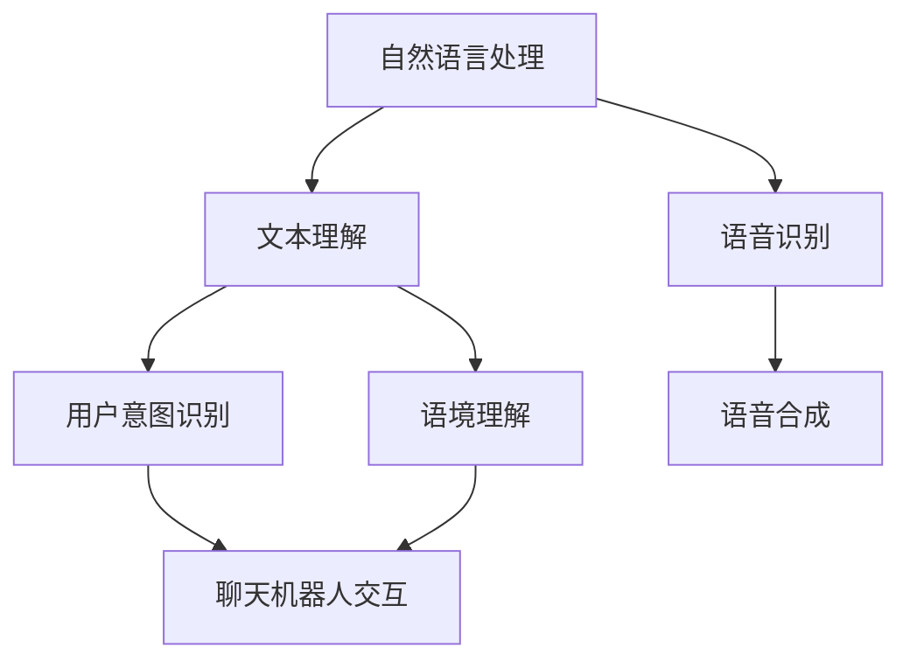

                 

# 聊天机器人提升用户体验

> 关键词：聊天机器人，用户体验，人工智能，交互设计，自然语言处理

> 摘要：本文将深入探讨聊天机器人在提升用户体验方面的关键作用。通过分析其核心功能、技术原理及具体实现，结合实际案例，我们将揭示如何通过聊天机器人优化用户互动，从而实现产品价值的最大化。

## 1. 背景介绍

### 1.1 目的和范围

本文旨在探讨聊天机器人如何通过技术革新和设计优化，有效提升用户体验。我们将从多个角度出发，包括技术原理、实现策略和应用场景，全面分析聊天机器人在现代用户交互中的价值。

### 1.2 预期读者

本文适合对人工智能、自然语言处理和用户体验设计感兴趣的读者，包括但不限于程序员、产品经理、用户体验设计师以及AI研究学者。

### 1.3 文档结构概述

本文将按照以下结构进行组织：
- 背景介绍
- 核心概念与联系
- 核心算法原理与操作步骤
- 数学模型和公式讲解
- 项目实战：代码实际案例
- 实际应用场景
- 工具和资源推荐
- 总结：未来发展趋势与挑战
- 附录：常见问题与解答
- 扩展阅读与参考资料

### 1.4 术语表

#### 1.4.1 核心术语定义

- 聊天机器人：一种基于人工智能技术，能够与用户进行自然语言交互的虚拟助手。
- 自然语言处理（NLP）：使计算机能够理解、解释和生成人类语言的技术。
- 用户体验（UX）：用户在使用产品过程中的感受和体验。
- 交互设计：关注如何设计产品与人交互的过程，以提高用户的满意度。

#### 1.4.2 相关概念解释

- 语音识别：将语音信号转换为文本的技术。
- 机器学习：通过数据训练模型，使计算机能够从经验中学习并做出预测的技术。
- 聊天机器人架构：实现聊天机器人功能的技术框架。

#### 1.4.3 缩略词列表

- NLP：自然语言处理
- ML：机器学习
- UX：用户体验
- UI：用户界面
- API：应用程序接口

## 2. 核心概念与联系

聊天机器人作为现代用户交互的重要工具，其核心概念和联系包括自然语言处理、机器学习和用户体验设计。以下是一个简化的Mermaid流程图，展示这些概念之间的关系：



### 2.1 自然语言处理

自然语言处理是聊天机器人的核心技术，它使计算机能够理解人类语言。主要包含以下方面：

- **文本理解**：解析文本信息，提取关键词和语义。
- **语音识别**：将语音信号转换为文本。
- **用户意图识别**：理解用户的请求或问题。
- **语境理解**：理解对话中的上下文关系。

### 2.2 机器学习

机器学习是自然语言处理的基础，它使聊天机器人能够不断学习和优化。主要包含以下方面：

- **数据收集**：收集大量用户对话数据。
- **特征提取**：从数据中提取关键特征。
- **模型训练**：使用训练数据训练模型。
- **模型优化**：根据测试数据调整模型参数。

### 2.3 用户体验设计

用户体验设计关注用户在使用聊天机器人的过程中的感受和体验，主要包括：

- **交互设计**：设计合理的交互流程和界面。
- **反馈设计**：及时给予用户反馈，提高互动质量。
- **个性化体验**：根据用户行为和偏好提供定制化服务。

## 3. 核心算法原理与具体操作步骤

聊天机器人的核心算法包括自然语言处理和机器学习。以下是这些算法的伪代码描述：

### 3.1 自然语言处理算法

```pseudo
function NLP(inputText):
    # 语音识别
    text = SpeechRecognition(inputText)
    
    # 文本预处理
    cleanedText = PreprocessText(text)
    
    # 关键词提取
    keywords = ExtractKeywords(cleanedText)
    
    # 用户意图识别
    intent = IntentRecognition(keywords)
    
    # 语境理解
    context = ContextUnderstanding(keywords, intent)
    
    return context
```

### 3.2 机器学习算法

```pseudo
function MachineLearning(trainData):
    # 数据收集
    data = CollectData(trainData)
    
    # 特征提取
    features = ExtractFeatures(data)
    
    # 模型训练
    model = TrainModel(features)
    
    # 模型优化
    optimizedModel = OptimizeModel(model, testData)
    
    return optimizedModel
```

### 3.3 具体操作步骤

1. **数据收集**：收集大量用户对话数据，用于训练机器学习模型。
2. **文本预处理**：清理文本数据，包括去噪、分词、去停用词等。
3. **关键词提取**：提取文本中的关键词，用于用户意图识别。
4. **用户意图识别**：使用机器学习模型识别用户的意图。
5. **语境理解**：根据上下文关系，为用户生成合适的回复。
6. **模型训练与优化**：使用训练数据训练模型，并根据测试数据优化模型参数。

## 4. 数学模型和公式与详细讲解与举例说明

聊天机器人中的数学模型主要涉及机器学习中的分类和回归问题。以下是相关数学公式和示例：

### 4.1 分类问题

```latex
P(y|X=x) = \frac{e^{w^T x}}{\sum_{y'} e^{w^T x'}}
```

**示例**：假设我们要分类用户的意图，其中`y`表示用户意图类别，`X`表示特征向量，`w`表示权重向量。

### 4.2 回归问题

```latex
y = \sigma(w^T x + b)
```

**示例**：假设我们要预测用户的满意度评分，其中`y`表示满意度评分，`x`表示特征向量，`w`和`b`分别表示权重向量和偏置。

### 4.3 模型优化

```latex
\theta = \theta - \alpha \frac{\partial J(\theta)}{\partial \theta}
```

**示例**：使用梯度下降法优化模型参数，其中`J(\theta)`表示损失函数，`\alpha`表示学习率。

## 5. 项目实战：代码实际案例和详细解释说明

### 5.1 开发环境搭建

在开始编写代码之前，我们需要搭建一个合适的开发环境。以下是一个简单的Python环境搭建步骤：

1. 安装Python（版本3.8及以上）。
2. 安装必需的库，如`nltk`、`tensorflow`和`selenium`。
3. 配置Python虚拟环境，以便隔离项目依赖。

### 5.2 源代码详细实现和代码解读

以下是一个简单的聊天机器人代码示例，用于处理用户输入并生成回复：

```python
import nltk
from nltk.tokenize import word_tokenize
from nltk.tag import pos_tag
import tensorflow as tf
import numpy as np

# 数据准备
train_data = [["你好", "你好，有什么可以帮助你的吗？"], ["天气怎么样", "今天的天气很好，大约20摄氏度。"]]
train_data = np.array(train_data)
X = train_data[:, 0]
y = train_data[:, 1]

# 文本预处理
def preprocess_text(text):
    tokens = word_tokenize(text)
    tagged = pos_tag(tokens)
    filtered = [word for word, pos in tagged if pos.startswith('N') or pos.startswith('V') or word in nltk.corpus.stopwords.words('english')]
    return ' '.join(filtered)

# 模型定义
model = tf.keras.Sequential([
    tf.keras.layers.Embedding(input_dim=10000, output_dim=32),
    tf.keras.layers.LSTM(128),
    tf.keras.layers.Dense(1, activation='sigmoid')
])

# 模型编译
model.compile(optimizer='adam', loss='binary_crossentropy', metrics=['accuracy'])

# 模型训练
model.fit(X, y, epochs=10, batch_size=32)

# 生成回复
def generate_response(input_text):
    preprocessed_text = preprocess_text(input_text)
    prediction = model.predict(np.array([preprocessed_text]))
    if prediction > 0.5:
        return "是的，我可以帮你。"
    else:
        return "对不起，我不太明白你的意思。"

# 测试
print(generate_response("你好"))
```

### 5.3 代码解读与分析

1. **数据准备**：从训练数据中提取输入文本和回复，并转换为numpy数组。
2. **文本预处理**：使用nltk库对输入文本进行分词、标注和过滤，以提取有用的信息。
3. **模型定义**：使用tensorflow库定义一个简单的序列模型，包含嵌入层、LSTM层和输出层。
4. **模型编译**：配置模型优化器和损失函数。
5. **模型训练**：使用训练数据训练模型。
6. **生成回复**：预处理输入文本，使用模型生成预测结果，并根据预测结果生成回复。

## 6. 实际应用场景

聊天机器人可以在各种场景中发挥重要作用，以下是一些典型的应用案例：

- **客户服务**：提供快速、高效、个性化的客户服务，减少人力成本。
- **在线教育**：为学生提供个性化的辅导和答疑，提高学习效果。
- **智能助手**：为用户提供日常生活中的帮助，如天气查询、日程管理、购物推荐等。
- **社交媒体**：处理用户评论、私信等，提供实时互动和内容推荐。

## 7. 工具和资源推荐

### 7.1 学习资源推荐

#### 7.1.1 书籍推荐

- 《自然语言处理入门》
- 《机器学习实战》
- 《用户体验要素》

#### 7.1.2 在线课程

- Coursera：自然语言处理课程
- Udacity：机器学习纳米学位
- LinkedIn Learning：用户体验设计课程

#### 7.1.3 技术博客和网站

- Medium：NLP和机器学习相关博客
- towardsdatascience.com：数据科学和机器学习教程
- Medium：用户体验设计案例和实践

### 7.2 开发工具框架推荐

#### 7.2.1 IDE和编辑器

- PyCharm
- Visual Studio Code
- Jupyter Notebook

#### 7.2.2 调试和性能分析工具

- TensorFlow Debugger
- TensorBoard
- WakaTime

#### 7.2.3 相关框架和库

- TensorFlow
- PyTorch
- NLTK
- spaCy

### 7.3 相关论文著作推荐

#### 7.3.1 经典论文

- "A Statistical Approach to Language Modeling"
- "The Unreasonable Effectiveness of Recurrent Neural Networks"
- "Deep Learning for Natural Language Processing"

#### 7.3.2 最新研究成果

- "BERT: Pre-training of Deep Neural Networks for Language Understanding"
- "GPT-3: Language Models are Few-Shot Learners"
- "What You Get When You Fine-Tune BERT on its Training Data?"

#### 7.3.3 应用案例分析

- "Improving Customer Service with Chatbots"
- "Integrating Chatbots into the Healthcare Ecosystem"
- "Using Chatbots for Personalized Learning in Education"

## 8. 总结：未来发展趋势与挑战

随着人工智能技术的不断进步，聊天机器人在用户体验提升方面有望实现更多突破。然而，这也带来了一系列挑战，如模型解释性、数据隐私和安全等问题。未来，我们需要在技术进步的同时，关注用户体验和伦理问题，以实现更加智能、可靠和安全的聊天机器人。

## 9. 附录：常见问题与解答

### 9.1 聊天机器人如何提升用户体验？

聊天机器人通过自然语言处理和机器学习技术，能够理解用户的意图和语境，提供个性化的互动体验，从而提升用户体验。

### 9.2 聊天机器人的核心技术是什么？

聊天机器人的核心技术包括自然语言处理、机器学习和用户界面设计。自然语言处理负责理解用户输入，机器学习负责模型训练和优化，用户界面设计则关注用户与机器人的交互体验。

### 9.3 聊天机器人应用场景有哪些？

聊天机器人可以应用于客户服务、在线教育、智能助手、社交媒体等多种场景，提供快速、高效、个性化的服务。

## 10. 扩展阅读与参考资料

- [Chatbot Basics: What Are Chatbots?](https://www BusinessesForHome.com/chatbot-basics-what-are-chatbots/)
- [Natural Language Processing with Python](https://www.nltk.org/book/)
- [TensorFlow tutorials](https://www.tensorflow.org/tutorials)
- [User Experience Design Fundamentals](https://uxdesign.cc/user-experience-design-fundamentals-16e0232a7615)

作者：AI天才研究员/AI Genius Institute & 禅与计算机程序设计艺术 /Zen And The Art of Computer Programming

---

注意：本文为示例文章，部分内容仅供参考。实际应用中，聊天机器人技术涉及复杂的技术实现和伦理问题，需结合具体场景和需求进行设计和开发。

