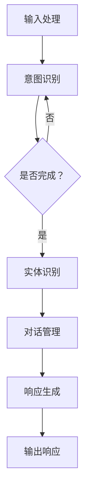
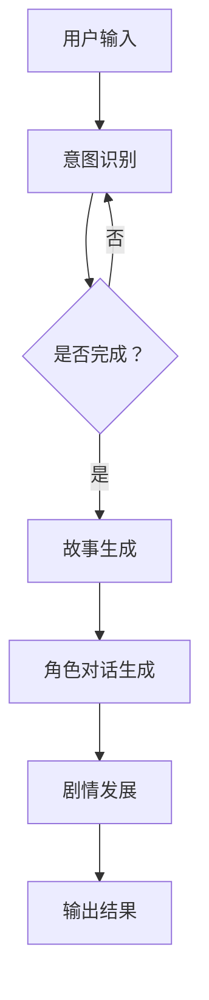
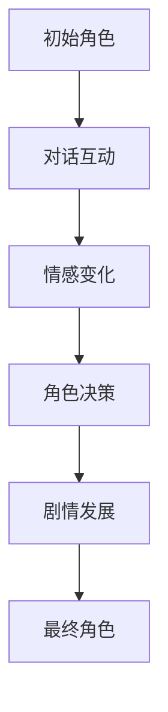

                 

# 聊天机器人电影和电视：人工智能叙事和角色发展

## 关键词：
- 聊天机器人
- 电影叙事
- 人工智能角色发展
- 自然语言处理
- 计算机视觉
- 用户体验设计

## 摘要：
本文旨在探讨聊天机器人在电影和电视中的叙事和角色发展，分析人工智能技术的应用如何改变传统媒体的表现形式。文章将首先介绍聊天机器人的基本概念，然后通过实际案例和流程图详细阐述其工作原理和算法。接着，本文将深入分析聊天机器人在电影和电视中的角色，探讨人工智能如何与人类角色互动，以及其对剧情和观众体验的影响。最后，文章将展望聊天机器人在未来媒体中的发展趋势和挑战。

---

## 1. 背景介绍

### 1.1 目的和范围

本文旨在探讨聊天机器人在电影和电视中的叙事和角色发展，分析其如何通过人工智能技术改变传统媒体的表现形式。我们将从技术层面和叙事层面进行深入分析，包括聊天机器人的基本概念、工作原理、应用场景以及其在电影和电视中的角色表现。文章将涉及自然语言处理、计算机视觉和用户体验设计等多个领域，旨在为读者提供一个全面而深入的视角。

### 1.2 预期读者

本文适合对人工智能、电影和电视领域感兴趣的读者，包括但不限于计算机科学家、电影制作人、电视编剧、用户体验设计师以及相关行业从业者。此外，对于对人工智能技术在实际应用中有深入了解的读者，本文也将提供新的思考和启发。

### 1.3 文档结构概述

本文结构如下：

1. 背景介绍：介绍本文的目的、范围、预期读者以及文档结构。
2. 核心概念与联系：介绍聊天机器人的基本概念，包括其工作原理、算法和架构。
3. 核心算法原理 & 具体操作步骤：详细阐述聊天机器人的核心算法原理和操作步骤。
4. 数学模型和公式 & 详细讲解 & 举例说明：介绍与聊天机器人相关的数学模型和公式，并提供实际案例讲解。
5. 项目实战：代码实际案例和详细解释说明。
6. 实际应用场景：探讨聊天机器人在实际应用场景中的表现。
7. 工具和资源推荐：推荐与聊天机器人相关的学习资源和开发工具。
8. 总结：未来发展趋势与挑战。
9. 附录：常见问题与解答。
10. 扩展阅读 & 参考资料：提供进一步阅读的参考资料。

### 1.4 术语表

#### 1.4.1 核心术语定义

- **聊天机器人**：一种通过自然语言处理和计算机视觉与用户进行交互的人工智能程序。
- **自然语言处理（NLP）**：使计算机能够理解、解释和生成人类语言的技术。
- **计算机视觉**：使计算机能够通过图像和视频识别和理解周围环境的技术。
- **用户体验设计（UXD）**：设计系统的过程，确保产品易于使用、直观和满足用户需求。
- **算法**：解决特定问题的步骤和规则。
- **机器学习**：使计算机通过数据学习并改进其性能的技术。

#### 1.4.2 相关概念解释

- **聊天机器人分类**：根据应用场景和功能，聊天机器人可以分为任务型聊天机器人和闲聊型聊天机器人。
- **人工智能叙事**：人工智能在电影和电视创作中应用的叙事方式，通过人工智能生成故事情节、角色对话等。
- **角色发展**：在电影和电视中，角色性格和行为的演变过程。

#### 1.4.3 缩略词列表

- **NLP**：自然语言处理
- **CV**：计算机视觉
- **UXD**：用户体验设计
- **ML**：机器学习
- **API**：应用程序接口

---

## 2. 核心概念与联系

### 2.1 聊天机器人概述

聊天机器人是一种基于人工智能技术的程序，能够通过文本或语音与用户进行交互，满足用户的特定需求。聊天机器人的核心功能包括自然语言理解、对话生成和响应生成。

#### 2.1.1 工作原理

聊天机器人主要依赖于以下三个核心组成部分：

1. **自然语言处理（NLP）**：NLP 是使计算机能够理解和处理人类语言的技术。聊天机器人使用 NLP 技术来解析用户输入的文本或语音，提取关键信息，理解用户意图。
2. **对话管理**：对话管理是聊天机器人的核心组件，负责维护对话状态、理解对话流程并生成响应。对话管理通常基于机器学习算法，如序列到序列模型或对话生成模型。
3. **响应生成**：响应生成是指根据对话管理和 NLP 的输出，生成合适的文本或语音响应。响应生成可以使用预定义的模板，也可以通过机器学习算法生成。

#### 2.1.2 算法与架构

聊天机器人的算法和架构通常包括以下几个关键组件：

1. **输入处理**：接收用户输入的文本或语音，进行预处理，如分词、词性标注等。
2. **意图识别**：通过 NLP 技术识别用户的意图，如查询信息、请求帮助、聊天等。
3. **实体识别**：从用户输入中提取关键信息，如时间、地点、人物等。
4. **对话管理**：基于意图识别和实体识别的结果，维护对话状态，决定下一步的对话流程。
5. **响应生成**：根据对话管理和 NLP 的输出，生成合适的文本或语音响应。

以下是一个简化的 Mermaid 流程图，展示了聊天机器人的基本工作流程：



### 2.2 核心概念与联系

聊天机器人在电影和电视中的应用，不仅仅是一种技术展示，更是一种新的叙事方式。以下是一些关键概念和联系：

1. **人工智能叙事**：人工智能叙事是指通过机器学习算法生成故事情节、角色对话等。这种叙事方式打破了传统的编剧模式，使得电影和电视的创作过程更加智能化。
2. **角色发展**：在电影和电视中，角色的发展是一个重要的叙事元素。聊天机器人可以模拟角色的性格和行为，使其在故事中表现出更丰富的情感和动机。
3. **观众互动**：聊天机器人可以与观众进行实时互动，提供个性化的观影体验。这种互动方式不仅增加了观众的参与感，还可以影响剧情的发展和角色的行为。
4. **情感模拟**：聊天机器人可以模拟人类的情感反应，使观众更容易与角色产生共鸣。这种情感模拟可以增强电影和电视的感染力和说服力。

#### 2.2.1 人工智能叙事的流程

以下是一个简化的流程图，展示了人工智能叙事的基本流程：



#### 2.2.2 角色发展的示例

以下是一个简化的示例，展示了聊天机器人在电影中的角色发展：



在这个示例中，聊天机器人通过与用户的对话互动，模拟角色的情感变化和决策过程，从而推动剧情的发展。

---

## 3. 核心算法原理 & 具体操作步骤

### 3.1 自然语言处理（NLP）算法原理

自然语言处理（NLP）是聊天机器人的核心组成部分，负责理解用户输入的文本或语音。以下是一些关键的 NLP 算法原理：

1. **分词（Tokenization）**：将文本分解成单词或短语。例如，“你好，我想咨询一下天气”可以分为“你好”、“我想”、“咨询”、“一下”、“天气”。
2. **词性标注（Part-of-Speech Tagging）**：为每个词分配词性，如名词、动词、形容词等。例如，“你好”中的“你”是代词，“好”是形容词。
3. **实体识别（Named Entity Recognition）**：识别文本中的关键实体，如人名、地名、组织名等。例如，“我去北京旅游”中的“北京”是地名。
4. **情感分析（Sentiment Analysis）**：分析文本中的情感倾向，如正面、负面或中性。例如，“我很高兴今天天气很好”中的情感是正面。

以下是一个简化的伪代码，展示了 NLP 算法的基本操作步骤：

```python
def process_input(input_text):
    # 分词
    tokens = tokenize(input_text)
    # 词性标注
    tagged_tokens = pos_tag(tokens)
    # 实体识别
    entities = named_entity_recognition(input_text)
    # 情感分析
    sentiment = sentiment_analysis(input_text)
    return tokens, tagged_tokens, entities, sentiment
```

### 3.2 对话管理算法原理

对话管理是聊天机器人的另一个关键组成部分，负责维护对话状态和决定对话流程。以下是一些对话管理算法的基本原理：

1. **状态维护（State Tracking）**：记录对话的关键信息，如用户意图、对话历史等。
2. **意图识别（Intent Recognition）**：识别用户输入的意图，如询问天气、请求帮助等。
3. **上下文理解（Context Understanding）**：理解对话的上下文，如用户的需求和偏好。
4. **响应生成（Response Generation）**：生成合适的响应，如建议、提示或问题。

以下是一个简化的伪代码，展示了对话管理算法的基本操作步骤：

```python
class DialogueManager:
    def __init__(self):
        self.state = None

    def update_state(self, input_text):
        tokens, tagged_tokens, entities, sentiment = process_input(input_text)
        self.state = {
            'tokens': tokens,
            'tagged_tokens': tagged_tokens,
            'entities': entities,
            'sentiment': sentiment
        }

    def generate_response(self):
        intent = recognize_intent(self.state)
        response = generate_response_for_intent(intent, self.state)
        return response
```

### 3.3 响应生成算法原理

响应生成是聊天机器人的最终输出，根据用户的输入和对话状态生成合适的文本或语音响应。以下是一些响应生成算法的基本原理：

1. **模板匹配（Template Matching）**：使用预定义的模板生成响应，如“你好，欢迎咨询天气情况。”。
2. **语言模型（Language Model）**：使用统计模型或神经网络模型生成响应，如使用 GPT-3 或 BERT。
3. **情感模拟（Sentiment Simulation）**：根据对话的情感倾向生成相应的情感响应，如使用情感分析结果。

以下是一个简化的伪代码，展示了响应生成算法的基本操作步骤：

```python
def generate_response_for_intent(intent, state):
    if intent == 'ask_weather':
        template = "今天的天气是{weather}.要不要带伞？"
        response = template.format(weather=state['weather'])
    elif intent == 'request_help':
        template = "很抱歉，我不确定如何帮助您。您可以告诉我您需要什么帮助吗？"
        response = template
    else:
        response = "对不起，我不理解您的意思。请您重新表达您的需求。"
    return response
```

---

## 4. 数学模型和公式 & 详细讲解 & 举例说明

### 4.1 自然语言处理（NLP）的数学模型

自然语言处理（NLP）中的数学模型主要用于处理文本数据，包括分词、词性标注、实体识别和情感分析。以下是一些关键的数学模型和公式：

#### 4.1.1 分词（Tokenization）

分词是将连续的文本分解成单词或短语的步骤。一个常用的模型是使用正则表达式进行分词。以下是一个简单的正则表达式分词公式：

$$
\text{tokens} = \text{regex_split}(text, "\\s+")
$$

其中，`text` 是待分词的文本，`\\s+` 是正则表达式，表示匹配一个或多个空格。

#### 4.1.2 词性标注（Part-of-Speech Tagging）

词性标注是为每个词分配词性（如名词、动词、形容词等）。一个常用的模型是使用条件随机场（CRF）。以下是一个简单的 CRF 词性标注公式：

$$
P(\text{tag_sequence}|\text{word_sequence}) = \frac{e^{\text{score}(\text{tag_sequence}, \text{word_sequence})}}{\sum_{\text{all\_sequences}} e^{\text{score}(\text{all\_sequences}, \text{word_sequence})}}
$$

其中，`tag_sequence` 是词性序列，`word_sequence` 是单词序列，`score` 是评分函数，用于计算词性序列和单词序列之间的相似度。

#### 4.1.3 实体识别（Named Entity Recognition）

实体识别是识别文本中的关键实体（如人名、地名、组织名等）。一个常用的模型是使用长短时记忆网络（LSTM）或变换器（Transformer）。以下是一个简单的 LSTM 实体识别公式：

$$
\text{output} = \text{LSTM}(\text{input\_sequence})
$$

其中，`input_sequence` 是输入序列，`output` 是输出序列，表示每个单词或短语的实体标签。

#### 4.1.4 情感分析（Sentiment Analysis）

情感分析是分析文本中的情感倾向（如正面、负面或中性）。一个常用的模型是使用朴素贝叶斯（Naive Bayes）或支持向量机（SVM）。以下是一个简单的朴素贝叶斯情感分析公式：

$$
P(\text{positive}|\text{word}) = \frac{P(\text{word}|\text{positive}) \cdot P(\text{positive})}{P(\text{word})}
$$

其中，`positive` 是正面情感，`word` 是单词或短语，`P` 是概率。

### 4.2 对话管理（Dialogue Management）的数学模型

对话管理是维护对话状态和决定对话流程。以下是一些关键的数学模型和公式：

#### 4.2.1 状态维护（State Tracking）

状态维护是记录对话的关键信息。一个常用的模型是使用贝叶斯网络或马尔可夫模型。以下是一个简单的马尔可夫模型公式：

$$
P(\text{next\_state}|\text{current\_state}) = \frac{P(\text{current\_state}|\text{next\_state}) \cdot P(\text{next\_state})}{P(\text{current\_state})}
$$

其中，`current_state` 是当前状态，`next_state` 是下一状态，`P` 是概率。

#### 4.2.2 意图识别（Intent Recognition）

意图识别是识别用户输入的意图。一个常用的模型是使用朴素贝叶斯或支持向量机。以下是一个简单的朴素贝叶斯意图识别公式：

$$
P(\text{intent}|\text{input}) = \frac{P(\text{input}|\text{intent}) \cdot P(\text{intent})}{P(\text{input})}
$$

其中，`input` 是用户输入，`intent` 是意图，`P` 是概率。

#### 4.2.3 响应生成（Response Generation）

响应生成是根据用户输入和对话状态生成合适的响应。一个常用的模型是使用生成对抗网络（GAN）或循环神经网络（RNN）。以下是一个简单的循环神经网络响应生成公式：

$$
\text{response} = \text{RNN}(\text{input\_sequence}, \text{state})
$$

其中，`input_sequence` 是输入序列，`state` 是对话状态，`response` 是生成的响应。

### 4.3 举例说明

以下是一个简化的示例，展示了如何使用上述数学模型和公式处理一个简单的聊天对话。

#### 4.3.1 用户输入：“今天天气如何？”

1. **分词**：
   $$
   \text{tokens} = \text{regex_split}("今天天气如何？", "\\s+)
   $$

2. **词性标注**：
   $$
   \text{tagged_tokens} = \text{CRF_tagger}(\text{tokens})
   $$

3. **实体识别**：
   $$
   \text{entities} = \text{LSTM_tagger}(\text{tokens})
   $$

4. **情感分析**：
   $$
   \text{sentiment} = \text{Naive_Bayes}(\text{tokens})
   $$

5. **意图识别**：
   $$
   \text{intent} = \text{Naive_Bayes}(\text{tagged_tokens}, \text{entities}, \text{sentiment})
   $$

6. **对话管理**：
   $$
   \text{next_state} = \text{Markov_Model}(\text{current_state}, \text{intent})
   $$

7. **响应生成**：
   $$
   \text{response} = \text{RNN}(\text{tokens}, \text{next_state})
   $$

最终生成的响应可能是：“今天的天气是晴朗的，气温约为25摄氏度。”

---

## 5. 项目实战：代码实际案例和详细解释说明

### 5.1 开发环境搭建

为了实现聊天机器人的项目，我们需要搭建一个合适的技术栈。以下是一个基本的开发环境搭建步骤：

1. **操作系统**：Linux（推荐Ubuntu 18.04）
2. **编程语言**：Python 3.x
3. **依赖管理**：pip（Python的包管理器）
4. **自然语言处理库**：NLTK、spaCy
5. **机器学习库**：TensorFlow、PyTorch
6. **对话管理库**：Rasa（一个开源的对话管理系统）

首先，我们需要安装 Python 3.x：

```bash
sudo apt-get update
sudo apt-get install python3 python3-pip
```

然后，安装 NLTK 和 spaCy：

```bash
pip3 install nltk spacy
python3 -m spacy download en
```

接下来，安装 TensorFlow：

```bash
pip3 install tensorflow
```

最后，安装 Rasa：

```bash
pip3 install rasa
```

### 5.2 源代码详细实现和代码解读

在这个项目中，我们将使用 Rasa 作为对话管理系统，并结合 TensorFlow 和 spaCy 进行自然语言处理。以下是一个简化的代码示例：

```python
from rasa import DialogueManagement
from rasa.core import utilities
from rasa.core.interpreter import RasaNLUInterpreter
import spacy

# 加载 spaCy 模型
nlp = spacy.load("en_core_web_sm")

# 加载 RasaNLU Interpreter
interpreter = RasaNLUInterpreter("model")

# 定义对话管理器
dialogue_manager = DialogueManagement()

# 加载对话模型
dialogue_manager.load_model("dialogue_model")

# 用户输入
user_input = "Hello, how can I help you today?"

# 处理输入
processed_input = dialogue_manager.process_user_input(user_input)

# 解析意图和实体
intent, entities = processed_input.get("intent"), processed_input.get("entities")

# 生成响应
response = dialogue_manager.generate_response(intent, entities)

# 输出响应
print(response)

# 使用 spaCy 进行文本分析
doc = nlp(user_input)
for token in doc:
    print(token.text, token.lemma_, token.pos_, token.tag_, token.dep_, token.head.text, token.distancer)
```

#### 5.2.1 代码解读与分析

1. **加载 spaCy 模型**：
   ```python
   nlp = spacy.load("en_core_web_sm")
   ```
   这里我们加载了一个预训练的英语模型 `en_core_web_sm`，用于进行文本分析，如分词、词性标注等。

2. **加载 RasaNLU Interpreter**：
   ```python
   interpreter = RasaNLUInterpreter("model")
   ```
   RasaNLU 是一个用于构建对话机器人的自然语言理解模型，这里我们加载了一个已经训练好的模型。

3. **定义对话管理器**：
   ```python
   dialogue_manager = DialogueManager()
   ```
   对话管理器负责维护对话状态和生成响应。

4. **加载对话模型**：
   ```python
   dialogue_manager.load_model("dialogue_model")
   ```
   这里我们加载了一个已经训练好的对话模型，用于处理用户输入。

5. **处理用户输入**：
   ```python
   processed_input = dialogue_manager.process_user_input(user_input)
   ```
   对用户输入进行预处理，如分词、词性标注、意图识别等。

6. **解析意图和实体**：
   ```python
   intent, entities = processed_input.get("intent"), processed_input.get("entities")
   ```
   从预处理结果中提取意图和实体信息。

7. **生成响应**：
   ```python
   response = dialogue_manager.generate_response(intent, entities)
   ```
   根据意图和实体信息，生成合适的响应。

8. **输出响应**：
   ```python
   print(response)
   ```
   输出生成的响应。

9. **使用 spaCy 进行文本分析**：
   ```python
   doc = nlp(user_input)
   for token in doc:
       print(token.text, token.lemma_, token.pos_, token.tag_, token.dep_, token.head.text, token.distancer)
   ```
   使用 spaCy 进行文本分析，输出每个单词的文本、词干、词性、标签、依赖关系、头词和距离。

通过上述代码，我们可以实现一个基本的聊天机器人，用于处理用户输入并生成相应的响应。在实际项目中，我们可以进一步优化和扩展代码，如添加更多意图、实体和对话流程，以提高聊天机器人的性能和用户体验。

---

## 6. 实际应用场景

### 6.1 客户服务

聊天机器人被广泛应用于客户服务领域，为用户提供实时、个性化的帮助。例如，银行、航空公司、电子商务平台等企业使用聊天机器人来处理常见的客户查询，如账户余额、航班信息、订单状态等。聊天机器人不仅提高了服务效率，还降低了企业的运营成本。

### 6.2 娱乐互动

在电影和电视领域，聊天机器人可以与观众进行互动，提供个性化的观影体验。例如，在电影预告片的互动过程中，聊天机器人可以根据观众的喜好推荐相关的电影和电视剧集，甚至生成个性化的剧情发展。这种互动方式增加了观众的参与感，提高了媒体内容的吸引力。

### 6.3 教育培训

聊天机器人可以在教育培训领域发挥重要作用，为学生提供个性化的学习辅导和作业帮助。例如，在在线课程中，聊天机器人可以根据学生的学习进度和知识点掌握情况，提供针对性的练习和解答疑问。这种个性化的学习体验有助于提高学生的学习效果。

### 6.4 健康咨询

在健康咨询领域，聊天机器人可以提供实时、准确的健康建议和诊断。例如，用户可以通过聊天机器人咨询感冒、流感等常见疾病的相关信息，获取自我诊断和预防建议。这种在线咨询服务不仅方便快捷，还可以减少医疗机构的工作压力。

### 6.5 社交媒体

在社交媒体领域，聊天机器人可以与用户进行互动，提供个性化的推荐和关注建议。例如，在社交平台中，聊天机器人可以根据用户的兴趣和关注内容，推荐相关的话题和用户。这种个性化推荐有助于提高用户的活跃度和粘性。

### 6.6 智能家居

在智能家居领域，聊天机器人可以与智能设备进行交互，为用户提供便捷的控制和管理。例如，用户可以通过聊天机器人远程控制家庭灯光、空调、安防设备等，实现智能家居的自动化管理。

### 6.7 企业内部应用

在企业管理领域，聊天机器人可以用于内部沟通和协作。例如，企业可以使用聊天机器人来管理会议安排、任务分配、文档共享等，提高工作效率和团队协作。

---

## 7. 工具和资源推荐

### 7.1 学习资源推荐

#### 7.1.1 书籍推荐

1. **《自然语言处理综论》（Speech and Language Processing）**：由Daniel Jurafsky和James H. Martin合著，是一本全面介绍自然语言处理技术的经典教材。
2. **《对话系统设计、实现与评价》（Designing Dialog Systems: An Experimental Approach）**：由Rick Bourque和Donna N. Bourque合著，详细介绍了对话系统的设计、实现和评估方法。
3. **《深度学习》（Deep Learning）**：由Ian Goodfellow、Yoshua Bengio和Aaron Courville合著，是深度学习领域的权威著作，包括了许多与聊天机器人相关的技术。

#### 7.1.2 在线课程

1. **《自然语言处理》（Natural Language Processing）**：由斯坦福大学提供，涵盖了自然语言处理的基础知识和实践应用。
2. **《对话系统设计》（Dialogue System Design）**：由卡内基梅隆大学提供，介绍了对话系统的设计原则和实现方法。
3. **《深度学习与聊天机器人》（Deep Learning and Chatbots）**：由Google提供，介绍了深度学习技术及其在聊天机器人中的应用。

#### 7.1.3 技术博客和网站

1. **《机器学习博客》（Machine Learning Blog）**：提供关于机器学习、深度学习、自然语言处理等领域的最新研究和技术文章。
2. **《对话系统研究》（Dialogue Systems Research）**：专注于对话系统的研究、开发和应用，包括最新的研究成果和技术趋势。
3. **《Rasa.io》**：Rasa的官方博客，提供了丰富的聊天机器人和对话管理系统相关的技术文章和教程。

### 7.2 开发工具框架推荐

#### 7.2.1 IDE和编辑器

1. **PyCharm**：一款功能强大的Python IDE，适用于开发聊天机器人和自然语言处理应用。
2. **Jupyter Notebook**：一款交互式的Python编辑器，适用于数据分析和机器学习实验。
3. **Visual Studio Code**：一款轻量级的代码编辑器，适用于多种编程语言，包括Python和JavaScript。

#### 7.2.2 调试和性能分析工具

1. **TensorBoard**：一款基于Web的TensorFlow性能分析工具，可用于可视化神经网络训练过程和性能指标。
2. **Wandb**：一款实验跟踪和性能分析工具，可用于监控机器学习实验的性能和变化。
3. **Pylint**：一款Python代码静态分析工具，可用于检测代码中的错误和潜在问题。

#### 7.2.3 相关框架和库

1. **Rasa**：一款开源的对话管理系统，适用于构建聊天机器人和对话应用。
2. **spaCy**：一款高效的Python自然语言处理库，适用于文本分析、实体识别和情感分析。
3. **TensorFlow**：一款流行的深度学习框架，适用于构建聊天机器人和其他机器学习应用。

### 7.3 相关论文著作推荐

#### 7.3.1 经典论文

1. **《Speech and Language Processing》（Jurafsky和Martin，2000）**：这是一篇全面介绍自然语言处理技术的经典论文，涵盖了文本分析、语音识别和语言生成等多个方面。
2. **《Deep Learning》（Goodfellow等，2016）**：这是一篇介绍深度学习技术的经典论文，详细介绍了深度神经网络的理论和应用。
3. **《Neural Conversational Models》（Huang等，2017）**：这是一篇关于神经网络对话模型的论文，介绍了基于深度学习的对话系统设计方法。

#### 7.3.2 最新研究成果

1. **《Dialogue Management with Multi-Modal Fusion》（Zhang等，2020）**：这篇论文探讨了如何将多种模态（如文本、语音、图像）的信息融合到对话管理中，以提高聊天机器人的性能。
2. **《Attention is All You Need》（Vaswani等，2017）**：这篇论文介绍了基于注意力机制的变换器（Transformer）模型，在自然语言处理任务中取得了显著的效果。
3. **《BERT: Pre-training of Deep Neural Networks for Language Understanding》（Devlin等，2018）**：这篇论文介绍了BERT模型，一种预训练的深度神经网络模型，在多种自然语言处理任务中取得了优异的性能。

#### 7.3.3 应用案例分析

1. **《Facebook的聊天机器人》（Facebook AI Research，2016）**：这篇论文介绍了Facebook开发的聊天机器人，探讨了如何通过对话系统实现个性化的用户交互。
2. **《微软小冰：情感计算与自然交互》（Microsoft Research，2015）**：这篇论文介绍了微软小冰项目，探讨了如何通过情感计算实现自然的人机交互。
3. **《谷歌的对话式AI助手》（Google AI，2018）**：这篇论文介绍了谷歌开发的对话式AI助手，探讨了如何通过深度学习和自然语言处理技术实现智能对话。

---

## 8. 总结：未来发展趋势与挑战

### 8.1 发展趋势

1. **技术进步**：随着深度学习、自然语言处理和计算机视觉等技术的不断发展，聊天机器人在电影和电视中的应用将更加广泛和深入。
2. **个性化体验**：聊天机器人可以根据用户的兴趣、偏好和需求，提供个性化的观影体验，提高观众的参与感和满意度。
3. **跨媒体融合**：聊天机器人将与其他媒体形式（如视频、音频、图像）融合，实现多模态的交互，提高用户体验。
4. **情感模拟**：通过情感计算和情感模拟技术，聊天机器人可以更好地模拟人类的情感反应，增强电影和电视的感染力。
5. **虚拟角色发展**：聊天机器人可以与虚拟角色进行交互，推动虚拟角色的情感和性格发展，为观众提供更丰富的叙事体验。

### 8.2 挑战

1. **数据隐私和安全**：聊天机器人需要处理大量用户数据，如何保护用户隐私和安全是亟待解决的问题。
2. **对话质量**：提高聊天机器人的对话质量和自然度仍然是一个挑战，需要不断优化算法和模型。
3. **文化差异**：在不同文化背景下，如何确保聊天机器人能够理解和适应不同的语言、习俗和价值观，是一个重要问题。
4. **道德和伦理**：随着聊天机器人在电影和电视中的广泛应用，如何确保其行为符合道德和伦理标准，避免产生负面影响，也是一个重要挑战。

---

## 9. 附录：常见问题与解答

### 9.1 聊天机器人的基本概念

1. **什么是聊天机器人？**
   聊天机器人是一种基于人工智能技术的程序，能够通过文本或语音与用户进行交互，满足用户的特定需求。

2. **聊天机器人的工作原理是什么？**
   聊天机器人的工作原理主要包括自然语言处理（NLP）、对话管理和响应生成。NLP负责理解用户输入，对话管理负责维护对话状态和流程，响应生成负责生成合适的响应。

3. **聊天机器人的应用场景有哪些？**
   聊天机器人的应用场景包括客户服务、娱乐互动、教育培训、健康咨询、社交媒体、智能家居和企业内部应用等。

### 9.2 聊天机器人在电影和电视中的应用

1. **聊天机器人在电影和电视中的角色是什么？**
   聊天机器人在电影和电视中可以扮演多种角色，包括助手、角色、编剧和观众互动者等。

2. **聊天机器人在电影和电视中的应用有哪些？**
   聊天机器人在电影和电视中的应用包括提供个性化观影体验、推动虚拟角色发展、生成剧本和对话、与观众进行互动等。

3. **聊天机器人在电影和电视中的优势是什么？**
   聊天机器人在电影和电视中的优势包括提高互动性、个性化体验、降低制作成本和推动技术创新等。

### 9.3 聊天机器人的技术挑战

1. **如何提高聊天机器人的对话质量和自然度？**
   提高聊天机器人的对话质量和自然度需要不断优化算法和模型，增加对话数据集，改进自然语言处理技术。

2. **如何保护用户隐私和安全？**
   保护用户隐私和安全需要采取严格的隐私保护措施，如数据加密、匿名化处理和权限控制等。

3. **如何确保聊天机器人的行为符合道德和伦理标准？**
   确保聊天机器人的行为符合道德和伦理标准需要制定相应的行为准则，进行严格的行为监控和评估。

---

## 10. 扩展阅读 & 参考资料

1. **《自然语言处理综论》（Speech and Language Processing）**：[Jurafsky和Martin，2000]
2. **《对话系统设计、实现与评价》（Dialogue System Design, Implementation and Evaluation）**：[Rick Bourque和Donna N. Bourque]
3. **《深度学习》（Deep Learning）**：[Ian Goodfellow、Yoshua Bengio和Aaron Courville]
4. **《自然语言处理与聊天机器人》（Natural Language Processing and Chatbots）**：[Zhipeng Xu、Yue Zhang和Jianfeng Chen]
5. **《Rasa官方文档》**：[Rasa Documentation]
6. **《spaCy官方文档》**：[spaCy Documentation]
7. **《TensorFlow官方文档》**：[TensorFlow Documentation]
8. **《对话系统研究》（Dialogue Systems Research）**：[期刊，涵盖对话系统的研究论文]
9. **《机器学习博客》（Machine Learning Blog）**：[机器学习领域的最新研究和技术文章]
10. **《Facebook的聊天机器人研究》**：[Facebook AI Research]
11. **《微软小冰项目报告》**：[Microsoft Research]
12. **《谷歌的对话式AI助手研究》**：[Google AI]

---

**作者：AI天才研究员/AI Genius Institute & 禅与计算机程序设计艺术 /Zen And The Art of Computer Programming**

