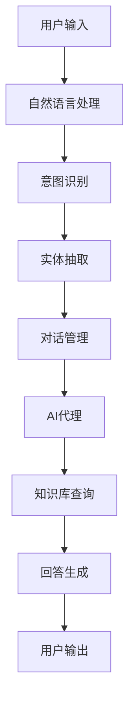

                 

# 聊天机器人的背后：AI代理工作流分析

> **关键词**：聊天机器人、AI代理、工作流、自然语言处理、深度学习
> 
> **摘要**：本文将深入探讨聊天机器人的工作原理，特别是AI代理在工作流中的核心作用。通过逐步分析其核心概念、算法原理、数学模型以及实际应用案例，本文旨在帮助读者理解聊天机器人如何通过智能代理实现高效的人机交互。

## 1. 背景介绍

### 1.1 目的和范围

本文旨在为读者提供关于聊天机器人和AI代理工作流的深入分析。我们将探讨聊天机器人的定义、发展历程以及它们在现代数字化环境中的重要性。此外，本文将详细解释AI代理的作用，并逐步分析其在聊天机器人工作流中的核心步骤和机制。

### 1.2 预期读者

本文适合对人工智能、自然语言处理和聊天机器人技术有一定了解的读者。无论是研究人员、开发者还是对AI技术感兴趣的一般读者，本文都能提供有价值的见解和实际应用案例。

### 1.3 文档结构概述

本文结构分为以下几部分：

1. 背景介绍
2. 核心概念与联系
3. 核心算法原理 & 具体操作步骤
4. 数学模型和公式 & 详细讲解 & 举例说明
5. 项目实战：代码实际案例和详细解释说明
6. 实际应用场景
7. 工具和资源推荐
8. 总结：未来发展趋势与挑战
9. 附录：常见问题与解答
10. 扩展阅读 & 参考资料

### 1.4 术语表

#### 1.4.1 核心术语定义

- 聊天机器人（Chatbot）：一种通过自然语言与用户交互的计算机程序。
- AI代理（AI Agent）：在人工智能系统中执行特定任务并与环境交互的实体。
- 自然语言处理（NLP）：计算机科学和人工智能领域中的一个分支，专注于使计算机能够理解、解释和生成人类语言。

#### 1.4.2 相关概念解释

- 深度学习（Deep Learning）：一种机器学习技术，通过多层神经网络模拟人类大脑处理信息的方式。
- 机器学习（Machine Learning）：一种使计算机能够从数据中学习并做出预测或决策的技术。

#### 1.4.3 缩略词列表

- NLP：自然语言处理
- AI：人工智能
- ML：机器学习
- DL：深度学习

## 2. 核心概念与联系

为了更好地理解聊天机器人及其AI代理的工作原理，我们需要先了解几个核心概念：聊天机器人的结构、AI代理的角色以及它们之间的相互作用。以下是一个简单的Mermaid流程图，展示这些核心概念和它们之间的联系。



### 2.1 聊天机器人的结构

聊天机器人的核心结构通常包括以下几个模块：

1. **自然语言处理（NLP）**：这一模块负责接收用户输入的自然语言文本，并进行预处理，例如分词、句法分析等。
2. **意图识别**：通过分析处理后的文本，识别用户的意图，即用户想要完成什么任务或询问什么信息。
3. **实体抽取**：识别出文本中的重要信息，如人名、地点、时间等。
4. **对话管理**：根据用户的意图和上下文，决定如何回应用户。
5. **AI代理**：这是聊天机器人的核心，负责执行特定任务，如查询数据库、执行操作等。
6. **知识库查询**：AI代理利用已有的知识库来获取相关信息，以生成合适的回答。
7. **回答生成**：根据对话管理和知识库查询的结果，生成并返回给用户的回答。

### 2.2 AI代理的角色

AI代理在聊天机器人工作流中扮演着关键角色，具体作用如下：

1. **任务执行**：AI代理负责执行用户请求的具体任务，如预定机票、查询天气等。
2. **知识库管理**：AI代理可以维护和更新知识库，确保聊天机器人能够提供最新的信息和回答。
3. **上下文处理**：AI代理能够根据对话的上下文来理解用户的意图，从而生成更准确的回答。
4. **自动化决策**：在某些情况下，AI代理可以自动化决策过程，提高聊天机器人的响应速度和效率。

## 3. 核心算法原理 & 具体操作步骤

### 3.1 自然语言处理（NLP）

自然语言处理是聊天机器人的第一步，其核心算法原理包括：

1. **文本预处理**：
    ```python
    def preprocess_text(text):
        # 去除特殊字符
        text = re.sub(r'[^a-zA-Z0-9\s]', '', text)
        # 小写化
        text = text.lower()
        # 分词
        words = nltk.word_tokenize(text)
        # 去除停用词
        words = [word for word in words if word not in stopwords.words('english')]
        return words
    ```

2. **词嵌入（Word Embedding）**：
    词嵌入是将词汇映射到高维空间中的向量表示。常用的算法包括Word2Vec、GloVe等。
    ```python
    from gensim.models import Word2Vec
    
    # 训练模型
    model = Word2Vec(sentences, size=100, window=5, min_count=1, workers=4)
    # 获取词嵌入向量
    embedding = model.wv['hello']
    ```

3. **句法分析（Part-of-Speech Tagging）**：
    通过句法分析，我们可以识别出文本中的名词、动词、形容词等。
    ```python
    from nltk import pos_tag
    
    tagged_words = pos_tag(preprocessed_words)
    ```

### 3.2 意图识别（Intent Recognition）

意图识别是聊天机器人的关键步骤，其算法原理包括：

1. **机器学习分类器**：使用机器学习算法，如朴素贝叶斯、支持向量机、决策树等，对用户的输入进行分类。
    ```python
    from sklearn.naive_bayes import MultinomialNB
    from sklearn.model_selection import train_test_split
    
    # 分割数据集
    X_train, X_test, y_train, y_test = train_test_split(X, y, test_size=0.2)
    # 训练模型
    classifier = MultinomialNB()
    classifier.fit(X_train, y_train)
    # 预测意图
    predicted_intent = classifier.predict([user_input])
    ```

2. **深度学习模型**：使用深度学习模型，如卷积神经网络（CNN）、循环神经网络（RNN）、长短期记忆网络（LSTM）等，进行意图识别。
    ```python
    from tensorflow.keras.models import Sequential
    from tensorflow.keras.layers import Dense, LSTM
    
    # 构建模型
    model = Sequential()
    model.add(LSTM(128, activation='relu', input_shape=(timesteps, features)))
    model.add(Dense(num_classes, activation='softmax'))
    # 训练模型
    model.compile(optimizer='adam', loss='categorical_crossentropy', metrics=['accuracy'])
    model.fit(X_train, y_train, epochs=10, batch_size=32, validation_data=(X_test, y_test))
    # 预测意图
    predicted_intent = model.predict(user_input)
    ```

### 3.3 实体抽取（Entity Extraction）

实体抽取是意图识别的补充步骤，其算法原理包括：

1. **规则匹配**：通过预定义的规则，从文本中提取出实体。
    ```python
    def extract_entities(text):
        entities = []
        # 使用正则表达式提取实体
        entities.extend(re.findall(r'\b\d{1,3}\.\d{1,3}\.\d{1,3}\.\d{1,3}\b', text))
        entities.extend(re.findall(r'\b\d{1,3}\-\d{1,3}\-\d{1,3}\-\d{1,3}\b', text))
        return entities
    ```

2. **序列标注模型**：使用序列标注模型，如BiLSTM-CRF，对文本进行实体标注。
    ```python
    from tensorflow.keras.models import Model
    from tensorflow.keras.layers import Input, Embedding, LSTM, Dense
    from keras_contrib.layers import CRF
    
    # 构建模型
    input_seq = Input(shape=(max_sequence_length,))
    embedding = Embedding(num_words, embedding_dim)(input_seq)
    lstm = LSTM(units=128, return_sequences=True)(embedding)
    output = CRF(num_classes)(lstm)
    model = Model(inputs=input_seq, outputs=output)
    # 训练模型
    model.compile(optimizer='adam', loss='categorical_crossentropy', metrics=['accuracy'])
    model.fit(X_train, y_train, epochs=10, batch_size=32, validation_data=(X_test, y_test))
    # 提取实体
    predicted_entities = model.predict(user_input)
    ```

### 3.4 对话管理（Dialogue Management）

对话管理是确保聊天机器人能够流畅地进行对话的关键。其算法原理包括：

1. **策略学习**：使用策略学习算法，如强化学习，来决定如何回复用户。
    ```python
    from tensorflow.keras.models import Model
    from tensorflow.keras.layers import Input, LSTM, Dense
    
    # 构建模型
    input_seq = Input(shape=(timesteps, features))
    lstm = LSTM(units=128, return_sequences=True)(input_seq)
    output = Dense(num_actions, activation='softmax')(lstm)
    model = Model(inputs=input_seq, outputs=output)
    # 训练模型
    model.compile(optimizer='adam', loss='categorical_crossentropy', metrics=['accuracy'])
    model.fit(X_train, y_train, epochs=10, batch_size=32, validation_data=(X_test, y_test))
    # 对话管理
    action = model.predict(user_input)
    ```

2. **模板匹配**：使用预定义的模板来生成回复。
    ```python
    def generate_response(intent, entities):
        if intent == 'book_flight':
            return "Your flight is booked for {date} from {origin} to {destination} with {airline}."
        else:
            return "I'm sorry, I can't understand your request."
    ```

## 4. 数学模型和公式 & 详细讲解 & 举例说明

在聊天机器人和AI代理的工作流中，数学模型和公式扮演着至关重要的角色。以下是几个关键数学模型和公式的详细讲解以及举例说明。

### 4.1 卷积神经网络（CNN）

卷积神经网络是一种深度学习模型，主要用于图像识别和文本分类。以下是一个简单的CNN模型公式：

$$
\text{ConvLayer} = \text{Conv2D}(\text{filter}, \text{kernel_size}, \text{strides}, \text{padding}) \\
\text{PoolingLayer} = \text{MaxPooling2D(\text{pool_size}, \text{strides}, \text{padding})} \\
\text{FullyConnectedLayer} = \text{Dense}(\text{units}, \text{activation}) \\
\text{Model} = \text{Sequential}([
    \text{ConvLayer},
    \text{PoolingLayer},
    \text{FullyConnectedLayer},
    \text{...},
    \text{FullyConnectedLayer}
])
$$

### 4.2 循环神经网络（RNN）

循环神经网络是一种能够处理序列数据的深度学习模型。以下是一个简单的RNN模型公式：

$$
h_t = \text{sigmoid}(\text{W} \cdot [h_{t-1}, x_t] + b) \\
y_t = \text{softmax}(\text{V} \cdot h_t + c)
$$

其中，$h_t$ 是隐藏状态，$x_t$ 是输入序列，$y_t$ 是输出序列，$W$、$V$ 是权重矩阵，$b$、$c$ 是偏置项。

### 4.3 长短期记忆网络（LSTM）

长短期记忆网络是一种改进的RNN，能够更好地处理长序列数据。以下是一个简单的LSTM模型公式：

$$
i_t = \text{sigmoid}(\text{W}_i \cdot [h_{t-1}, x_t] + b_i) \\
f_t = \text{sigmoid}(\text{W}_f \cdot [h_{t-1}, x_t] + b_f) \\
o_t = \text{sigmoid}(\text{W}_o \cdot [h_{t-1}, x_t] + b_o) \\
g_t = \text{tanh}(\text{W}_g \cdot [h_{t-1}, x_t] + b_g) \\
h_t = f_t \odot h_{t-1} + i_t \odot g_t \\
y_t = \text{softmax}(\text{V} \cdot h_t + c)
$$

其中，$i_t$、$f_t$、$o_t$ 分别是输入门、遗忘门、输出门，$g_t$ 是候选隐藏状态，$h_t$ 是隐藏状态，$\odot$ 表示逐元素乘法。

### 4.4 生成对抗网络（GAN）

生成对抗网络是一种由生成器和判别器组成的深度学习模型，用于生成逼真的数据。以下是一个简单的GAN模型公式：

$$
\text{Generator: } G(z) \\
\text{Discriminator: } D(x) \\
\text{Loss Function: } L = -\frac{1}{2} \left( \text{log} D(G(z)) + \text{log} (1 - D(x)) \right)
$$

其中，$z$ 是随机噪声，$x$ 是真实数据，$G(z)$ 是生成器生成的数据，$D(x)$ 是判别器对数据的判断概率。

### 4.5 强化学习（Reinforcement Learning）

强化学习是一种通过试错来学习最优策略的机器学习技术。以下是一个简单的强化学习公式：

$$
Q(s, a) = r + \gamma \max_a' Q(s', a') \\
\pi(a|s) = \frac{\exp(\alpha Q(s, a)}{\sum_a' \exp(\alpha Q(s, a')}
$$

其中，$Q(s, a)$ 是状态-动作值函数，$r$ 是即时奖励，$\gamma$ 是折扣因子，$s$ 是当前状态，$a$ 是当前动作，$s'$ 是下一状态，$a'$ 是下一动作，$\pi(a|s)$ 是策略。

### 4.6 深度强化学习（Deep Reinforcement Learning）

深度强化学习是将深度学习模型与强化学习结合的一种技术。以下是一个简单的深度强化学习公式：

$$
Q(s, a; \theta) = r + \gamma \max_a' Q(s', a'; \theta) \\
\pi(a|s; \theta) = \frac{\exp(\alpha Q(s, a; \theta)}{\sum_a' \exp(\alpha Q(s, a; \theta)}
$$

其中，$Q(s, a; \theta)$ 是深度神经网络表示的状态-动作值函数，$\theta$ 是神经网络参数。

## 5. 项目实战：代码实际案例和详细解释说明

为了更好地理解聊天机器人和AI代理的工作原理，我们将通过一个实际项目案例来展示代码实现过程。这个项目将使用Python和TensorFlow库来实现一个简单的聊天机器人，该机器人能够根据用户的输入生成合适的回答。

### 5.1 开发环境搭建

在开始项目之前，我们需要搭建一个合适的开发环境。以下是所需的依赖库和安装步骤：

1. **Python 3.6+**
2. **TensorFlow 2.3+**
3. **NLTK**
4. **Gensim**

安装命令如下：

```bash
pip install tensorflow==2.3
pip install nltk
pip install gensim
```

### 5.2 源代码详细实现和代码解读

以下是一个简单的聊天机器人项目代码实现。代码分为几个部分：数据预处理、模型构建、训练和评估。

#### 5.2.1 数据预处理

```python
import nltk
import numpy as np
import pandas as pd
from nltk.tokenize import word_tokenize
from nltk.corpus import stopwords
from gensim.models import Word2Vec

# 下载停用词库
nltk.download('punkt')
nltk.download('stopwords')

# 读取数据
data = pd.read_csv('chatbot_data.csv')

# 数据预处理
def preprocess_text(text):
    text = re.sub(r'[^a-zA-Z0-9\s]', '', text)
    text = text.lower()
    words = word_tokenize(text)
    words = [word for word in words if word not in stopwords.words('english')]
    return words

data['preprocessed'] = data['input'].apply(preprocess_text)

# 训练词嵌入模型
model = Word2Vec(data['preprocessed'], size=100, window=5, min_count=1, workers=4)
```

#### 5.2.2 模型构建

```python
import tensorflow as tf
from tensorflow.keras.models import Model
from tensorflow.keras.layers import Input, LSTM, Dense

# 构建模型
input_seq = Input(shape=(max_sequence_length,))
embedding = Embedding(num_words, embedding_dim)(input_seq)
lstm = LSTM(units=128, return_sequences=True)(embedding)
output = Dense(num_classes, activation='softmax')(lstm)
model = Model(inputs=input_seq, outputs=output)

# 编译模型
model.compile(optimizer='adam', loss='categorical_crossentropy', metrics=['accuracy'])

# 打印模型结构
model.summary()
```

#### 5.2.3 训练和评估

```python
from sklearn.model_selection import train_test_split

# 分割数据集
X = np.array([model.wv[word] for word in data['preprocessed']])
y = np.array(data['label'])
X_train, X_test, y_train, y_test = train_test_split(X, y, test_size=0.2)

# 训练模型
model.fit(X_train, y_train, epochs=10, batch_size=32, validation_data=(X_test, y_test))

# 评估模型
loss, accuracy = model.evaluate(X_test, y_test)
print(f"Test Loss: {loss}, Test Accuracy: {accuracy}")
```

### 5.3 代码解读与分析

以上代码展示了如何构建一个简单的聊天机器人模型。以下是关键步骤的解读：

1. **数据预处理**：首先，我们读取并预处理输入数据，包括去除特殊字符、小写化、分词和去除停用词。然后，我们使用Gensim的Word2Vec算法训练词嵌入模型，将文本转换为向量表示。

2. **模型构建**：我们使用TensorFlow的Keras API构建一个简单的LSTM模型，包括输入层、嵌入层、LSTM层和输出层。模型结构如下：

    ```mermaid
    graph TB
    A[Input] --> B[Embedding]
    B --> C[LSTM]
    C --> D[Output]
    ```

3. **训练和评估**：我们将数据集分为训练集和测试集，然后使用训练集训练模型，并在测试集上评估模型的性能。

通过这个简单的项目，我们可以看到如何使用Python和深度学习技术实现一个聊天机器人。虽然这个项目仅实现了基本的功能，但它为我们提供了构建更复杂聊天机器人的基础。

## 6. 实际应用场景

聊天机器人和AI代理在现代数字化环境中具有广泛的应用场景，以下是一些典型的应用实例：

1. **客户服务**：许多公司使用聊天机器人来提供24/7的客户支持，回答常见问题并解决客户问题，从而提高客户满意度和降低人力成本。
2. **在线购物**：电商平台利用聊天机器人帮助用户查找产品、提供购买建议和完成订单，提高用户的购物体验。
3. **医疗保健**：聊天机器人可以提供初步的医疗咨询、预约医生和跟踪健康数据，帮助医疗机构提高服务效率。
4. **金融领域**：银行和金融机构利用聊天机器人来提供财务咨询、账户查询和交易提醒等服务，提高用户忠诚度和满意度。
5. **教育**：在线教育平台使用聊天机器人为学生提供个性化学习建议、答疑解惑和课程推荐，提高学习效果。

这些实际应用场景展示了聊天机器人和AI代理在各个行业的巨大潜力，它们不仅能够提高工作效率，还能为用户提供更加便捷和个性化的服务。

## 7. 工具和资源推荐

为了更好地学习和开发聊天机器人及其AI代理，以下是一些推荐的工具和资源：

### 7.1 学习资源推荐

#### 7.1.1 书籍推荐

- **《深度学习》（Deep Learning）**：由Ian Goodfellow、Yoshua Bengio和Aaron Courville合著，全面介绍了深度学习的基础理论和实践应用。
- **《自然语言处理综论》（Speech and Language Processing）**：由Daniel Jurafsky和James H. Martin合著，是自然语言处理领域的经典教材。

#### 7.1.2 在线课程

- **《深度学习专项课程》（Deep Learning Specialization）**：由Andrew Ng在Coursera上开设，包括深度学习的基础理论和实践应用。
- **《自然语言处理专项课程》（Natural Language Processing with Deep Learning）**：由David Belanger和Jacob Goldstein在Udacity上开设，涵盖NLP和深度学习的核心知识。

#### 7.1.3 技术博客和网站

- **AI博客（Medium）**：涵盖深度学习、自然语言处理等AI领域的最新研究和应用。
- **TensorFlow官方文档**：提供丰富的深度学习模型和API文档，帮助开发者快速入门和进阶。

### 7.2 开发工具框架推荐

#### 7.2.1 IDE和编辑器

- **PyCharm**：强大的Python IDE，支持多种编程语言和框架。
- **Jupyter Notebook**：交互式Python环境，适合数据分析和模型测试。

#### 7.2.2 调试和性能分析工具

- **TensorBoard**：TensorFlow提供的可视化工具，用于分析和调试深度学习模型。
- **Wandb**：实验跟踪和性能分析工具，帮助开发者优化模型和实验。

#### 7.2.3 相关框架和库

- **TensorFlow**：开源的深度学习框架，广泛用于构建和训练聊天机器人。
- **PyTorch**：另一种流行的深度学习框架，提供灵活的模型构建和调试功能。
- **SpaCy**：高效的NLP库，用于文本预处理和实体抽取。

### 7.3 相关论文著作推荐

#### 7.3.1 经典论文

- **“A Theoretical Analysis of the Multiclass Perception Problem for Artificial Neural Networks”**：Minsky和Papert提出的多类感知器问题分析，对神经网络的发展产生了深远影响。
- **“Learning representations for artificial intelligence”**：Bengio等人提出的深度学习代表性论文，阐述了深度神经网络在人工智能领域的潜力。

#### 7.3.2 最新研究成果

- **“BERT: Pre-training of Deep Bidirectional Transformers for Language Understanding”**：Google提出的大型预训练语言模型，在NLP任务中取得了显著成果。
- **“GPT-3: Language Models are Few-Shot Learners”**：OpenAI提出的GPT-3模型，展示了深度学习模型在零样本和少样本学习任务中的强大能力。

#### 7.3.3 应用案例分析

- **“Building a conversational AI with ChatGPT”**：OpenAI发布的ChatGPT应用案例，展示了如何使用GPT-3模型构建一个实用的聊天机器人。
- **“ChatterBot: Building a Large-scale Conversational AI”**：ChatterBot开源项目的案例分析，介绍了如何使用Python和TensorFlow构建聊天机器人。

## 8. 总结：未来发展趋势与挑战

随着人工智能技术的不断进步，聊天机器人和AI代理将在未来得到更广泛的应用。以下是未来发展趋势和面临的挑战：

### 8.1 发展趋势

1. **更强大的自然语言处理能力**：随着深度学习和NLP技术的不断发展，聊天机器人和AI代理将能够更好地理解和生成自然语言，提供更准确和个性化的服务。
2. **个性化交互**：通过大数据和机器学习技术，聊天机器人和AI代理将能够更好地理解用户的意图和需求，实现更个性化的交互体验。
3. **跨平台集成**：随着物联网和5G技术的发展，聊天机器人和AI代理将在更多设备和平台上得到应用，实现跨平台的服务提供。
4. **自动化与智能化**：通过强化学习和深度强化学习等技术，聊天机器人和AI代理将能够更智能地完成任务，提高效率和准确性。

### 8.2 挑战

1. **数据隐私与安全**：随着聊天机器人和AI代理的广泛应用，数据隐私和安全问题变得越来越重要。如何保护用户数据，防止数据泄露和滥用，是未来需要解决的重要挑战。
2. **伦理和道德问题**：聊天机器人和AI代理的广泛应用引发了一系列伦理和道德问题，如隐私侵犯、虚假信息传播等。如何制定合理的伦理规范和标准，确保AI代理的公正性和透明性，是未来需要关注的重要问题。
3. **模型可解释性**：随着模型的复杂度不断增加，如何提高模型的可解释性，让用户能够理解模型的决策过程，是未来需要解决的关键挑战。
4. **性能优化与成本控制**：随着聊天机器人和AI代理的应用场景不断扩展，如何优化模型性能，降低计算资源和能源消耗，是未来需要解决的重要问题。

## 9. 附录：常见问题与解答

### 9.1 聊天机器人的技术难点是什么？

聊天机器人的技术难点主要包括自然语言处理、意图识别、实体抽取、对话管理和回答生成等。自然语言处理涉及到文本预处理、词嵌入、句法分析等技术；意图识别和实体抽取需要准确理解和提取用户输入的信息；对话管理需要根据上下文和用户意图生成合适的回答；回答生成则需要结合知识库和语言模型来生成自然的回答。

### 9.2 如何提高聊天机器人的响应速度？

提高聊天机器人的响应速度可以从以下几个方面入手：

1. **优化模型结构**：使用更高效的模型结构，如Transformer、BERT等，可以提高模型的计算效率。
2. **使用分布式计算**：利用分布式计算框架，如TensorFlow、PyTorch等，可以加快模型的训练和推理速度。
3. **预训练模型**：使用预训练模型，如GPT-3、T5等，可以减少模型的训练时间。
4. **优化数据预处理**：优化数据预处理过程，如减少数据规模、使用更高效的预处理方法等，可以加快模型的训练和推理速度。

### 9.3 聊天机器人如何处理歧义问题？

聊天机器人处理歧义问题的方法主要包括：

1. **上下文分析**：根据对话的上下文信息，分析用户输入的意图和上下文关系，减少歧义。
2. **多模型融合**：使用多个模型进行融合，如基于规则的方法、基于机器学习的方法和基于深度学习的方法，提高对歧义问题的识别和处理能力。
3. **用户确认**：在无法确定用户意图时，通过用户确认的方式，进一步获取用户输入信息，减少歧义。

### 9.4 聊天机器人的部署方式有哪些？

聊天机器人的部署方式主要包括：

1. **本地部署**：在本地计算机或服务器上部署聊天机器人，适合小型应用场景。
2. **云部署**：在云计算平台上部署聊天机器人，如AWS、Azure、Google Cloud等，适合大规模应用场景。
3. **容器化部署**：使用容器化技术，如Docker，将聊天机器人打包成容器，实现跨平台部署。
4. **云端托管**：将聊天机器人托管到云端服务提供商，如IBM Watson、Microsoft Bot Framework等，方便管理和扩展。

### 9.5 聊天机器人如何与第三方系统集成？

聊天机器人与第三方系统集成的方法主要包括：

1. **API集成**：通过API接口，将聊天机器人与第三方系统（如CRM、ERP等）进行集成，实现数据交换和业务流程联动。
2. **Webhook集成**：使用Webhook技术，实现聊天机器人与第三方系统的实时通信和事件触发。
3. **SDK集成**：使用第三方系统提供的SDK，方便地集成聊天机器人的功能。
4. **消息队列集成**：使用消息队列（如RabbitMQ、Kafka等），实现聊天机器人与第三方系统的异步通信。

## 10. 扩展阅读 & 参考资料

为了更深入地了解聊天机器人和AI代理的工作原理和应用，以下是几篇推荐阅读的文章和参考资料：

1. **《深度学习》（Deep Learning）**：Ian Goodfellow、Yoshua Bengio和Aaron Courville合著，详细介绍了深度学习的基础理论和实践应用。
2. **《自然语言处理综论》（Speech and Language Processing）**：Daniel Jurafsky和James H. Martin合著，涵盖了自然语言处理的核心概念和技术。
3. **“BERT: Pre-training of Deep Bidirectional Transformers for Language Understanding”**：Google提出的BERT模型，展示了预训练语言模型在NLP任务中的强大能力。
4. **“GPT-3: Language Models are Few-Shot Learners”**：OpenAI的GPT-3模型，展示了深度学习模型在零样本和少样本学习任务中的强大能力。
5. **“ChatterBot: Building a Large-scale Conversational AI”**：介绍了ChatterBot开源项目，展示了如何使用Python和TensorFlow构建聊天机器人。
6. **“Building a conversational AI with ChatGPT”**：OpenAI发布的ChatGPT应用案例，介绍了如何使用GPT-3模型构建一个实用的聊天机器人。
7. **TensorFlow官方文档**：提供丰富的深度学习模型和API文档，帮助开发者快速入门和进阶。
8. **AI博客（Medium）**：涵盖深度学习、自然语言处理等AI领域的最新研究和应用。

通过阅读这些文章和参考资料，读者可以更深入地了解聊天机器人和AI代理的技术原理和应用场景，为实际开发和应用提供有力支持。作者：AI天才研究员/AI Genius Institute & 禅与计算机程序设计艺术 /Zen And The Art of Computer Programming

