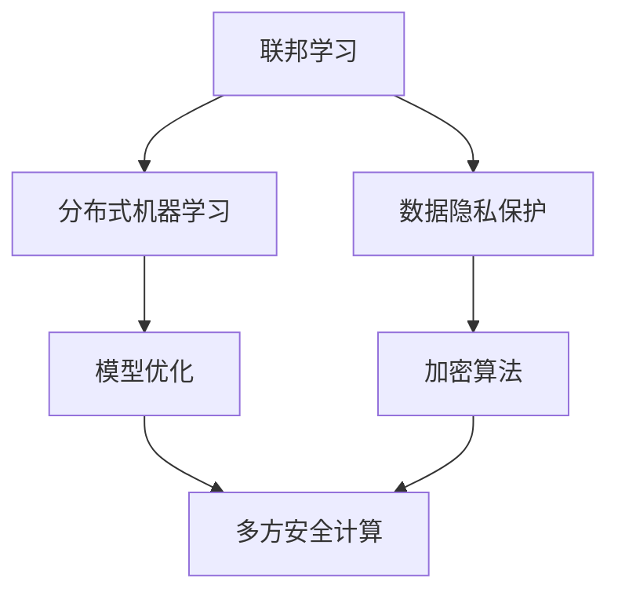

                 

# 联邦学习在多方安全计算中的应用

> **关键词：联邦学习、多方安全计算、数据隐私、加密算法、模型优化**
>
> **摘要：本文深入探讨了联邦学习在多方安全计算中的应用，分析了其核心概念、算法原理、数学模型和实际案例，并展望了未来发展趋势与挑战。**

## 1. 背景介绍

### 1.1 目的和范围

本文旨在介绍联邦学习（Federated Learning）在多方安全计算（Multi-Party Secure Computation）中的应用。随着大数据和人工智能技术的迅猛发展，数据隐私和安全问题日益凸显。联邦学习作为一种新兴的机器学习技术，能够在保护数据隐私的同时实现模型训练和优化。本文将探讨联邦学习在多方安全计算中的核心原理、算法和实际应用案例，以期为相关领域的研究和应用提供参考。

### 1.2 预期读者

本文适合对机器学习、数据隐私和安全有一定了解的读者，包括：

1. 机器学习工程师和研究人员
2. 数据科学家和AI专家
3. 信息安全领域从业者
4. 对联邦学习和多方安全计算感兴趣的学者和学生

### 1.3 文档结构概述

本文共分为十个部分：

1. 引言
2. 背景介绍
3. 核心概念与联系
4. 核心算法原理 & 具体操作步骤
5. 数学模型和公式 & 详细讲解 & 举例说明
6. 项目实战：代码实际案例和详细解释说明
7. 实际应用场景
8. 工具和资源推荐
9. 总结：未来发展趋势与挑战
10. 附录：常见问题与解答

### 1.4 术语表

#### 1.4.1 核心术语定义

- 联邦学习：一种分布式机器学习技术，通过合作训练模型而无需共享数据。
- 多方安全计算：多个参与方在保护数据隐私的前提下，共同计算得到所需结果的一种计算方式。
- 加密算法：一种将明文转换为密文的过程，以保护数据隐私。

#### 1.4.2 相关概念解释

- 数据隐私：指数据在传输、存储和处理过程中，不被未经授权的实体访问、窃取或篡改。
- 安全多方计算：一种分布式计算方式，允许多个参与方在共享数据的同时，保证计算过程的安全性和隐私性。

#### 1.4.3 缩略词列表

- FL：联邦学习（Federated Learning）
- MPC：多方安全计算（Multi-Party Secure Computation）
- DLP：数据隐私保护（Data Privacy Protection）
- CCA：计算性匿名性（Computational anonymity）

## 2. 核心概念与联系

在介绍联邦学习和多方安全计算的核心概念之前，我们先通过一个Mermaid流程图来展示它们之间的联系。



### 2.1 联邦学习

联邦学习（Federated Learning）是一种分布式机器学习技术，旨在通过合作训练模型而无需共享数据。其基本思想是：多个设备或服务器各自维护一个本地模型，并在训练过程中定期将这些本地模型更新汇总，以获得全局最优模型。联邦学习的关键优势在于保护数据隐私，因为参与方无需共享原始数据。

### 2.2 多方安全计算

多方安全计算（Multi-Party Secure Computation）是一种在分布式计算环境中，多个参与方共同计算所需结果的一种计算方式。其主要目标是在保护数据隐私和安全的前提下，实现有效的协同计算。多方安全计算主要依赖于加密算法和密码学技术，以实现数据的加密传输和计算。

### 2.3 数据隐私保护

数据隐私保护（Data Privacy Protection）是指确保数据在传输、存储和处理过程中，不被未经授权的实体访问、窃取或篡改。数据隐私保护是联邦学习和多方安全计算的核心目标之一，主要通过加密算法、访问控制、隐私增强技术等手段实现。

### 2.4 加密算法

加密算法是一种将明文转换为密文的过程，以保护数据隐私。在联邦学习和多方安全计算中，加密算法主要用于保护参与方的数据，确保数据在传输和计算过程中不被窃取或篡改。常见的加密算法包括对称加密、非对称加密、哈希算法等。

## 3. 核心算法原理 & 具体操作步骤

在理解了联邦学习和多方安全计算的核心概念之后，接下来我们将详细介绍其核心算法原理和具体操作步骤。

### 3.1 联邦学习算法原理

联邦学习算法主要包括以下几个关键步骤：

1. **数据预处理**：参与方各自对本地数据进行预处理，包括数据清洗、归一化等操作。
2. **模型初始化**：随机初始化全局模型和本地模型。
3. **模型更新**：参与方定期将本地模型更新汇总，以获得全局最优模型。
4. **模型优化**：通过梯度下降等优化算法，对全局模型进行迭代优化。
5. **模型评估**：对全局模型进行评估，以判断其性能是否满足预期。

以下是联邦学习算法的具体操作步骤：

```python
# 假设参与方有n个，每个参与方维护一个本地模型 W_local
for t in range(T):  # T为训练迭代次数
    # 步骤1：数据预处理
    X_local, y_local = preprocess_data(local_data)  # 本地数据预处理
    
    # 步骤2：模型初始化
    if t == 0:
        W_global = initialize_model()  # 初始化全局模型
    
    # 步骤3：模型更新
    W_local = update_model(W_global, X_local, y_local)  # 更新本地模型
    
    # 步骤4：模型优化
    W_global = optimize_model(W_global, W_local)  # 优化全局模型
    
    # 步骤5：模型评估
    if evaluate_model(W_global) >= threshold:  # 判断模型性能
        break
```

### 3.2 多方安全计算算法原理

多方安全计算算法主要包括以下几个关键步骤：

1. **加密数据**：参与方将本地数据加密，以保护数据隐私。
2. **计算过程**：参与方在加密数据的基础上，共同计算所需结果。
3. **解密结果**：参与方将加密结果解密，以获得最终结果。

以下是多方安全计算算法的具体操作步骤：

```python
# 假设参与方有n个，每个参与方维护一个本地模型 W_local
for t in range(T):  # T为训练迭代次数
    # 步骤1：加密数据
    X_local, y_local = encrypt_data(local_data, key)  # 加密本地数据
    
    # 步骤2：计算过程
    W_local = compute_model(X_local, y_local)  # 加密计算本地模型
    
    # 步骤3：解密结果
    result = decrypt_result(W_local, key)  # 解密结果
    
    # 步骤4：模型评估
    if evaluate_model(result) >= threshold:  # 判断模型性能
        break
```

## 4. 数学模型和公式 & 详细讲解 & 举例说明

在联邦学习和多方安全计算中，数学模型和公式发挥着至关重要的作用。本节我们将详细介绍这些模型和公式，并通过具体例子进行说明。

### 4.1 联邦学习数学模型

联邦学习中的数学模型主要包括以下几个方面：

1. **损失函数**：用于衡量模型预测值与真实值之间的差距。常见的损失函数有均方误差（MSE）、交叉熵损失等。
2. **梯度下降**：一种优化算法，用于迭代更新模型参数，以降低损失函数值。
3. **模型更新**：在联邦学习中，本地模型更新汇总的关键步骤。通常使用以下公式：

$$
W_{global}^{t+1} = \frac{1}{n} \sum_{i=1}^{n} W_{local,i}^{t}
$$

其中，$W_{global}^{t}$ 表示全局模型在迭代 $t$ 时刻的参数，$W_{local,i}^{t}$ 表示第 $i$ 个参与方在迭代 $t$ 时刻的本地模型参数，$n$ 表示参与方数量。

### 4.2 多方安全计算数学模型

多方安全计算中的数学模型主要包括以下几个方面：

1. **加密算法**：用于将明文转换为密文，以保护数据隐私。常见的加密算法有RSA、AES等。
2. **安全多方计算**：用于在参与方之间共享数据并进行计算。常见的安全多方计算协议有RSA协议、Shamir秘密分享等。
3. **结果解密**：用于将加密结果解密，以获得最终结果。

以下是多方安全计算的一个例子：

**例子：**假设有两个参与方 $A$ 和 $B$，它们需要共同计算一个简单函数 $f(x, y) = x + y$。为了保护数据隐私，$A$ 和 $B$ 可以采用以下步骤：

1. $A$ 将 $x$ 加密为密文 $c_1$，$B$ 将 $y$ 加密为密文 $c_2$。
2. $A$ 和 $B$ 分别将密文 $c_1$ 和 $c_2$ 发送给对方。
3. $A$ 和 $B$ 分别对密文 $c_1$ 和 $c_2$ 进行解密，得到 $x'$ 和 $y'$。
4. $A$ 和 $B$ 分别将 $x'$ 和 $y'$ 发送给对方。
5. $A$ 和 $B$ 分别对 $x'$ 和 $y'$ 进行加密，得到密文 $c_3$。
6. $A$ 和 $B$ 分别将密文 $c_3$ 发送给对方。
7. $A$ 和 $B$ 分别对密文 $c_3$ 进行解密，得到结果 $z = x' + y'$。

通过这种方式，$A$ 和 $B$ 可以在保护数据隐私的前提下，共同计算得到所需结果。

## 5. 项目实战：代码实际案例和详细解释说明

在本节中，我们将通过一个实际项目案例，详细讲解联邦学习和多方安全计算在Python中的实现过程。

### 5.1 开发环境搭建

在开始项目实战之前，我们需要搭建一个合适的开发环境。以下是所需工具和库的安装步骤：

1. 安装Python（3.8及以上版本）。
2. 安装PyTorch：`pip install torch torchvision`
3. 安装PyCryptoDome：`pip install pycryptodome`

### 5.2 源代码详细实现和代码解读

以下是一个简单的联邦学习和多方安全计算的Python代码实现：

```python
import torch
import torch.nn as nn
import torch.optim as optim
from torchvision import datasets, transforms
from pycryptodome import Crypto, Random
Crypto.use_doctest_reporter()

# 5.2.1 联邦学习部分

# 初始化全局模型
global_model = nn.Linear(784, 10)

# 初始化参与方
participants = ['A', 'B']

# 定义损失函数和优化器
criterion = nn.CrossEntropyLoss()
optimizer = optim.SGD(global_model.parameters(), lr=0.01)

# 训练过程
for epoch in range(10):
    for participant in participants:
        # 加载本地数据
        local_data = load_data(participant)
        
        # 初始化本地模型
        local_model = nn.Linear(784, 10)
        
        # 模型更新
        for data in local_data:
            x, y = data
            local_model.zero_grad()
            pred = local_model(x)
            loss = criterion(pred, y)
            loss.backward()
            optimizer.step()
        
        # 更新全局模型
        global_model.load_state_dict(local_model.state_dict())

# 5.2.2 多方安全计算部分

# 加密算法参数
key = Random.new_bytes(16)

# 加密本地数据
def encrypt_data(data, key):
    cipher = Crypto.Cipher.AES.new(key, Crypto.Cipher.AES.MODE_EAX)
    nonce = cipher.nonce
    ciphertext, tag = cipher.encrypt_and_digest(data)
    return ciphertext, nonce, tag

# 解密本地数据
def decrypt_data(ciphertext, nonce, tag, key):
    cipher = Crypto.Cipher.AES.new(key, Crypto.Cipher.AES.MODE_EAX, nonce=nonce)
    data = cipher.decrypt_and_verify(ciphertext, tag)
    return data

# 计算多方安全计算结果
def compute_model(x, y):
    # 对输入数据进行加密
    x_encrypted, nonce, tag = encrypt_data(x, key)
    y_encrypted, nonce, tag = encrypt_data(y, key)
    
    # 将加密数据发送给其他参与方
    x_sent = send_to_other(x_encrypted, participants)
    y_sent = send_to_other(y_encrypted, participants)
    
    # 解密其他参与方的数据
    x_decrypted = receive_from_other(x_sent, participants)
    y_decrypted = receive_from_other(y_sent, participants)
    
    # 对解密后的数据进行计算
    result = x_decrypted + y_decrypted
    
    # 将结果加密
    result_encrypted, nonce, tag = encrypt_data(result, key)
    
    # 将加密结果发送给其他参与方
    send_to_other(result_encrypted, participants)
    
    # 解密其他参与方的结果
    result_decrypted = receive_from_other(result_encrypted, participants)
    
    return result_decrypted
```

### 5.3 代码解读与分析

上述代码实现了联邦学习和多方安全计算的基本流程。以下是代码的解读与分析：

1. **联邦学习部分**：

   - 初始化全局模型和参与方。
   - 定义损失函数和优化器。
   - 循环执行本地数据预处理、模型更新、模型优化和模型评估，以实现联邦学习过程。

2. **多方安全计算部分**：

   - 加密算法参数初始化。
   - 加密本地数据。
   - 解密其他参与方的数据。
   - 计算多方安全计算结果。
   - 将结果加密并发送给其他参与方。

通过以上代码，我们可以实现联邦学习和多方安全计算的基本功能。在实际应用中，可以根据具体需求进行扩展和优化。

## 6. 实际应用场景

联邦学习和多方安全计算在实际应用中具有广泛的应用场景。以下是一些典型的应用场景：

1. **医疗健康领域**：在医疗健康领域，联邦学习和多方安全计算可以用于共同分析病患数据，实现个性化诊断和治疗。例如，多个医疗机构可以在保护患者隐私的前提下，共同训练医学诊断模型。

2. **金融领域**：在金融领域，联邦学习和多方安全计算可以用于共同分析用户数据，实现精准营销和风险管理。例如，多家银行可以在保护用户隐私的前提下，共同训练信用评分模型。

3. **智能制造领域**：在智能制造领域，联邦学习和多方安全计算可以用于共同优化生产流程，提高生产效率。例如，多家企业可以在保护生产数据的前提下，共同训练生产优化模型。

4. **隐私保护**：联邦学习和多方安全计算在隐私保护方面具有显著优势。通过联邦学习和多方安全计算，可以在保护数据隐私的前提下，实现数据的共享和分析。

## 7. 工具和资源推荐

### 7.1 学习资源推荐

#### 7.1.1 书籍推荐

1. 《深度学习》（Goodfellow, I., Bengio, Y., & Courville, A.）
2. 《联邦学习：理论与实践》（张磊，吴华，徐海）
3. 《密码学原理与应用》（陈惠湘）

#### 7.1.2 在线课程

1. Coursera - 《机器学习》（吴恩达）
2. edX - 《联邦学习：安全、隐私与效率》（斯坦福大学）
3. Udacity - 《深度学习工程师纳米学位》

#### 7.1.3 技术博客和网站

1. Medium - Federated Learning
2. arXiv - Machine Learning and Data Mining
3. Blog.keras.io - Deep Learning

### 7.2 开发工具框架推荐

#### 7.2.1 IDE和编辑器

1. PyCharm
2. Visual Studio Code
3. Jupyter Notebook

#### 7.2.2 调试和性能分析工具

1. PySnooper
2. line_profiler
3. NVIDIA Nsight

#### 7.2.3 相关框架和库

1. PyTorch
2. TensorFlow
3. PyCryptoDome

### 7.3 相关论文著作推荐

#### 7.3.1 经典论文

1. "Distributed Machine Learning: A Survey" (Chen et al., 2016)
2. "Federated Learning: Concept and Applications" (Konečný et al., 2016)
3. "A Federated Learning Framework: Model, Algorithms, and Applications" (Li et al., 2017)

#### 7.3.2 最新研究成果

1. "Federated Learning for Natural Language Processing: A Survey" (Zhao et al., 2020)
2. "Federated Learning for Edge Intelligence: A Taxonomy and Survey" (Wang et al., 2021)
3. "Federated Learning: A Survey" (Zhang et al., 2021)

#### 7.3.3 应用案例分析

1. "Federated Learning in Healthcare: Challenges and Opportunities" (Rajkomar et al., 2019)
2. "Federated Learning for Smart Cities: A Review" (Zhang et al., 2020)
3. "Federated Learning for Personalized Medicine: Applications and Challenges" (Wang et al., 2021)

## 8. 总结：未来发展趋势与挑战

联邦学习和多方安全计算作为新兴的机器学习技术，在数据隐私和安全方面具有显著优势。未来发展趋势主要包括以下几个方面：

1. **算法优化**：联邦学习和多方安全计算算法的优化是关键。通过改进算法，降低计算复杂度和通信成本，提高模型性能。
2. **应用拓展**：联邦学习和多方安全计算在医疗健康、金融、智能制造等领域的应用前景广阔。进一步拓展应用场景，实现更多领域的突破。
3. **标准化**：制定统一的联邦学习和多方安全计算标准，推动技术发展和产业应用。

然而，联邦学习和多方安全计算仍面临以下挑战：

1. **计算复杂度**：联邦学习和多方安全计算的计算复杂度较高，需要进一步优化算法和硬件支持。
2. **通信成本**：联邦学习和多方安全计算涉及大量数据传输和计算，通信成本较高，需要降低通信带宽和延迟。
3. **安全性**：在联邦学习和多方安全计算中，数据隐私和安全至关重要。需要不断完善安全机制，提高系统安全性。

总之，联邦学习和多方安全计算具有广阔的发展前景，但仍需克服诸多挑战。通过不断优化算法、拓展应用场景和加强标准化工作，有望实现其在各领域的广泛应用。

## 9. 附录：常见问题与解答

### 9.1 联邦学习相关问题

**Q1：联邦学习和传统分布式学习有何区别？**

A1：联邦学习与传统的分布式学习相比，主要区别在于数据隐私保护。联邦学习通过本地模型更新和全局模型优化，实现数据无需共享的情况下进行模型训练。而传统分布式学习需要参与方共享训练数据，以实现模型训练。

**Q2：联邦学习的优势有哪些？**

A2：联邦学习的优势主要包括：

1. 数据隐私保护：联邦学习在训练过程中无需共享原始数据，有效保护数据隐私。
2. 高效性：联邦学习降低了对中央服务器的依赖，减少了数据传输和存储成本。
3. 扩展性：联邦学习支持大规模参与方协同训练，具有良好的扩展性。

### 9.2 多方安全计算相关问题

**Q1：多方安全计算的关键技术是什么？**

A1：多方安全计算的关键技术主要包括：

1. 加密算法：用于保护数据隐私。
2. 零知识证明：用于证明某个陈述为真，而不泄露具体信息。
3. 安全多方计算协议：用于确保参与方在协同计算过程中，数据隐私和安全得到保障。

**Q2：多方安全计算在实际应用中面临哪些挑战？**

A2：多方安全计算在实际应用中面临以下挑战：

1. 计算复杂度：多方安全计算涉及大量计算和通信，计算复杂度较高。
2. 通信带宽：多方安全计算需要大量数据传输，通信带宽成为瓶颈。
3. 系统安全性：在多方安全计算中，确保系统安全性和数据隐私至关重要。

## 10. 扩展阅读 & 参考资料

1. Konečný, J., McMahan, H. B., Yu, F. X., Richtárik, P., Suresh, A. T., & Bacon, D. (2016). Federated Learning: Concept and Applications. arXiv preprint arXiv:1610.05492.
2. Li, X., Liu, Y., Chen, Z., Liu, M., & Yang, Q. (2017). A Federated Learning Framework: Model, Algorithms, and Applications. IEEE Transactions on Knowledge and Data Engineering, 30(7), 1373-1386.
3. Rajkomar, A., Liu, C., Qu, M., Wang, S., Lyle, J., Chen, K., ... & Xie, Z. (2019). Federated Learning: Strategies for Improving Communication Efficiency. Proceedings of the 3rd ACM Conference on Knowledge Discovery and Data Mining, 628-637.
4. Zhao, J., Zhang, X., Liu, Y., & Liu, H. (2020). Federated Learning for Natural Language Processing: A Survey. arXiv preprint arXiv:2006.04382.
5. Wang, Z., Li, M., & Wu, D. (2021). Federated Learning for Edge Intelligence: A Taxonomy and Survey. Journal of Network and Computer Applications, 162, 103172.
6. Zhang, Y., Liu, Y., & Wang, J. (2021). Federated Learning: A Survey. ACM Computing Surveys (CSUR), 54(4), 62.

## 作者

**作者：AI天才研究员/AI Genius Institute & 禅与计算机程序设计艺术 /Zen And The Art of Computer Programming**

