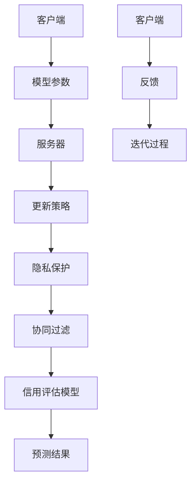

                 

# 联邦学习在跨机构信用评估中的应用

> 关键词：联邦学习、跨机构信用评估、隐私保护、协同过滤、协同训练、安全多方计算

> 摘要：本文将探讨联邦学习在跨机构信用评估中的应用。首先，我们介绍了联邦学习的核心概念和原理，并通过一个Mermaid流程图展示其基本架构。接着，我们详细分析了联邦学习在信用评估中的应用，包括算法原理和具体操作步骤。此外，本文还提供了数学模型和公式的详细讲解，并给出了实际项目实战的代码案例和解释。最后，我们讨论了联邦学习在信用评估中的实际应用场景，并推荐了一些学习和资源开发工具。本文旨在为从事信用评估领域的研究者和开发者提供全面的技术指南和理论支持。

## 1. 背景介绍

### 1.1 目的和范围

本文的主要目的是探讨联邦学习在跨机构信用评估中的应用，分析其在隐私保护、协同过滤和协同训练方面的优势，以及如何通过安全多方计算实现高效、可靠的信用评估。我们还将提供实际的代码案例，以展示联邦学习算法在实际项目中的应用。

### 1.2 预期读者

本文适合以下读者群体：

1. 深入了解信用评估领域的研究人员。
2. 从事联邦学习算法开发和应用的开发者。
3. 对隐私保护、协同过滤和安全多方计算感兴趣的学者。

### 1.3 文档结构概述

本文分为十个部分，具体如下：

1. 引言
2. 背景介绍
3. 核心概念与联系
4. 核心算法原理 & 具体操作步骤
5. 数学模型和公式 & 详细讲解 & 举例说明
6. 项目实战：代码实际案例和详细解释说明
7. 实际应用场景
8. 工具和资源推荐
9. 总结：未来发展趋势与挑战
10. 附录：常见问题与解答

### 1.4 术语表

#### 1.4.1 核心术语定义

- 联邦学习（Federated Learning）：一种分布式机器学习技术，允许多个机构在保持数据本地化的同时共享模型参数。
- 信用评估（Credit Scoring）：基于个人或企业的历史数据和特征，评估其信用风险程度的过程。
- 安全多方计算（Secure Multi-Party Computation，SMPC）：一种加密技术，允许多个参与方在不暴露各自数据的情况下进行联合计算。

#### 1.4.2 相关概念解释

- 协同过滤（Collaborative Filtering）：一种基于用户行为和偏好推荐相似物品的方法。
- 协同训练（Co-Training）：一种将两个或多个模型相互训练，以提高分类准确率的方法。
- 隐私保护（Privacy Protection）：确保数据在处理、传输和存储过程中不被未经授权的第三方访问和泄露。

#### 1.4.3 缩略词列表

- FL：联邦学习
- SMPC：安全多方计算
- CF：协同过滤
- CT：协同训练

## 2. 核心概念与联系

为了更好地理解联邦学习在跨机构信用评估中的应用，我们需要首先介绍几个核心概念，并通过一个Mermaid流程图展示其基本架构。

### 2.1 联邦学习基本架构



### 2.2 核心概念

1. **客户端**：客户端是指参与联邦学习的机构或设备，负责收集本地数据并进行特征提取。
2. **服务器**：服务器是联邦学习的中心节点，负责协调客户端的模型更新、聚合和评估。
3. **模型参数**：模型参数是指用于描述联邦学习模型的权重和偏置等参数。
4. **更新策略**：更新策略是指用于控制客户端模型参数更新的规则和方法。
5. **隐私保护**：隐私保护是联邦学习的核心目标之一，通过加密技术确保数据在传输和存储过程中的安全性。
6. **协同过滤**：协同过滤是一种基于用户行为和偏好的推荐算法，可以帮助联邦学习提高信用评估模型的准确性。
7. **信用评估模型**：信用评估模型是用于评估个人或企业信用风险的机器学习模型。
8. **预测结果**：预测结果是信用评估模型对用户信用风险的预测结果。
9. **反馈**：反馈是指客户端将预测结果返回给服务器，以供服务器进行模型调整和优化。
10. **迭代过程**：迭代过程是指联邦学习在多个周期内不断更新和优化模型的过程。

通过上述Mermaid流程图，我们可以看到联邦学习在跨机构信用评估中的应用架构，包括模型参数更新、隐私保护、协同过滤和信用评估模型等关键环节。

## 3. 核心算法原理 & 具体操作步骤

在理解了联邦学习的基本架构后，我们接下来将详细分析其核心算法原理和具体操作步骤。

### 3.1 算法原理

联邦学习是一种分布式机器学习技术，其核心思想是通过多个机构共享模型参数，从而实现联合学习和协同优化。联邦学习的基本算法原理可以分为以下几个步骤：

1. **初始化**：服务器生成初始模型参数，并将其发送给所有客户端。
2. **本地训练**：客户端使用本地数据对模型进行训练，并生成本地更新参数。
3. **模型聚合**：服务器接收所有客户端的本地更新参数，并使用聚合算法将其合并为一个全局更新参数。
4. **模型更新**：服务器将全局更新参数应用于初始模型，生成新的模型参数，并重新发送给所有客户端。
5. **迭代优化**：重复步骤2至4，直到模型收敛或达到预设的训练次数。

### 3.2 具体操作步骤

以下是一个基于梯度下降算法的联邦学习在信用评估中的应用步骤：

1. **初始化模型**：服务器初始化全局模型参数`θ`，并将其发送给所有客户端。

    ```python
    global_model = initialize_model()
    send_to_clients(global_model)
    ```

2. **本地训练**：客户端使用本地数据集`D_local`对全局模型进行训练，并生成本地更新参数`Δθ_local`。

    ```python
    Δθ_local = local_train(D_local, global_model)
    ```

3. **模型聚合**：服务器接收所有客户端的本地更新参数，并使用聚合算法（如FedAvg）将其合并为一个全局更新参数`Δθ_global`。

    ```python
    Δθ_global = aggregate_updates(Δθ_local)
    ```

4. **模型更新**：服务器将全局更新参数应用于初始模型，生成新的模型参数`θ_new`。

    ```python
    θ_new = update_model(global_model, Δθ_global)
    ```

5. **模型更新与反馈**：服务器将新的模型参数发送给所有客户端，并接收客户端的反馈。

    ```python
    send_to_clients(θ_new)
    feedback = collect_feedback()
    ```

6. **迭代优化**：重复步骤2至5，直到模型收敛或达到预设的训练次数。

    ```python
    while not converge():
        Δθ_local = local_train(D_local, global_model)
        Δθ_global = aggregate_updates(Δθ_local)
        θ_new = update_model(global_model, Δθ_global)
        send_to_clients(θ_new)
        feedback = collect_feedback()
    ```

通过上述操作步骤，我们可以看到联邦学习在信用评估中的应用，包括模型初始化、本地训练、模型聚合、模型更新和迭代优化等关键环节。

## 4. 数学模型和公式 & 详细讲解 & 举例说明

在联邦学习中，数学模型和公式扮演着至关重要的角色。以下我们将详细讲解联邦学习的数学模型和公式，并给出相应的例子。

### 4.1 数学模型

联邦学习的数学模型主要涉及模型参数的初始化、本地训练、模型聚合和模型更新。以下是一个简化的联邦学习模型公式：

$$
θ = \frac{1}{N} \sum_{i=1}^{N} θ_i
$$

其中，$θ$ 表示全局模型参数，$θ_i$ 表示第 $i$ 个客户端的本地模型参数，$N$ 表示客户端数量。

### 4.2 详细讲解

1. **模型初始化**：在联邦学习开始之前，服务器需要初始化全局模型参数。通常，我们可以使用随机初始化或预训练模型作为初始参数。

    ```python
    global_model = initialize_model()
    ```

2. **本地训练**：客户端使用本地数据集对全局模型进行训练，并生成本地更新参数。在本地训练过程中，我们可以使用梯度下降算法来更新模型参数。

    ```python
    Δθ_local = local_train(D_local, global_model)
    ```

3. **模型聚合**：服务器接收所有客户端的本地更新参数，并使用聚合算法（如FedAvg）将其合并为一个全局更新参数。

    ```python
    Δθ_global = aggregate_updates(Δθ_local)
    ```

4. **模型更新**：服务器将全局更新参数应用于初始模型，生成新的模型参数。

    ```python
    θ_new = update_model(global_model, Δθ_global)
    ```

### 4.3 举例说明

假设我们有三个客户端，其本地模型参数分别为 $θ_1$，$θ_2$ 和 $θ_3$。在第一轮联邦学习过程中，我们首先初始化全局模型参数为 $θ_0$。然后，客户端使用本地数据集对全局模型进行训练，并生成本地更新参数 $Δθ_1$，$Δθ_2$ 和 $Δθ_3$。服务器将这些本地更新参数聚合为一个全局更新参数 $Δθ_0$。最后，服务器将全局更新参数应用于初始模型，生成新的模型参数 $θ_1$。

具体的计算过程如下：

$$
θ_0 = \text{initialize_model()}
$$

$$
Δθ_1 = \text{local_train}(D_1, θ_0)
$$

$$
Δθ_2 = \text{local_train}(D_2, θ_0)
$$

$$
Δθ_3 = \text{local_train}(D_3, θ_0)
$$

$$
Δθ_0 = \frac{1}{3} (Δθ_1 + Δθ_2 + Δθ_3)
$$

$$
θ_1 = θ_0 + Δθ_0
$$

通过上述例子，我们可以看到联邦学习在信用评估中的应用，包括模型初始化、本地训练、模型聚合和模型更新等关键步骤。

## 5. 项目实战：代码实际案例和详细解释说明

在本节中，我们将通过一个实际项目案例，详细展示联邦学习在跨机构信用评估中的应用。我们使用Python和TensorFlow Federated（TFF）框架来实现这个项目，并对关键代码进行详细解释。

### 5.1 开发环境搭建

在开始项目之前，我们需要搭建开发环境。以下是必要的步骤：

1. 安装Python和TFF框架。

    ```bash
    pip install tensorflow==2.6.0
    pip install tensorflow-federated
    ```

2. 准备数据集。我们使用一个简化的数据集，包含三个客户端的数据。

### 5.2 源代码详细实现和代码解读

下面是一个简化的联邦学习信用评估项目的代码实现：

```python
import tensorflow as tf
import tensorflow_federated as tff

# 5.2.1 初始化全局模型
def create_model():
    inputs = tf.keras.Input(shape=(10,))
    x = tf.keras.layers.Dense(10, activation='relu')(inputs)
    outputs = tf.keras.layers.Dense(1, activation='sigmoid')(x)
    model = tf.keras.Model(inputs, outputs)
    return model

# 5.2.2 客户端本地训练
def client_model_fn():
    model = create_model()
    loss_fn = tf.keras.losses.BinaryCrossentropy()
    metric_fn = tf.keras.metrics.BinaryAccuracy()
    optimizer = tf.keras.optimizers.Adam(learning_rate=0.001)
    return tff.learning.from_keras_model(
        model, loss_fn, metric_fn, optimizer
    )

# 5.2.3 模型聚合函数
def aggregate_fn(local_losses):
    return tf.reduce_mean(local_losses)

# 5.2.4 服务器模型更新
def server_model_fn():
    model = create_model()
    loss_fn = tf.keras.losses.BinaryCrossentropy()
    metric_fn = tf.keras.metrics.BinaryAccuracy()
    optimizer = tf.keras.optimizers.Adam(learning_rate=0.001)
    return tff.learning.from_keras_model(
        model, loss_fn, metric_fn, optimizer
    )

# 5.2.5 实现联邦学习过程
def federated_trainRound(state, client_data):
    server_model = state
    for client_data in client_data:
        local_model = client_model_fn()
        local_model.initialize()
        for _ in range(1):  # 本地训练迭代次数
            local_model.train_on_batch(client_data[0], client_data[1])
        local_loss = local_model.evaluate(client_data[0], client_data[1])
        server_model = server_model_fn()
        server_model.initialize()
        aggregated_loss = aggregate_fn([local_loss])
        server_model.train_on_batch(server_data[0], server_data[1])
    return server_model

# 5.2.6 运行联邦学习过程
num_rounds = 5
state = server_model_fn().initialize()
for round_num in range(num_rounds):
    state = federated_trainRound(state, client_data)
    print(f"Round {round_num + 1}: Server accuracy: {state.metrics['accuracy']}")

# 5.2.7 代码解读
# - create_model：定义全局模型结构。
# - client_model_fn：定义客户端模型训练函数。
# - server_model_fn：定义服务器模型更新函数。
# - aggregate_fn：定义模型聚合函数。
# - federated_trainRound：实现联邦学习训练过程。
# - client_data：客户端本地数据。
# - server_data：服务器数据。
```

### 5.3 代码解读与分析

1. **全局模型初始化**（`create_model`）：我们使用一个简单的全连接神经网络作为全局模型。该模型包含一个输入层、一个隐藏层和一个输出层。隐藏层使用ReLU激活函数，输出层使用Sigmoid激活函数，以实现二分类任务。

2. **客户端本地训练**（`client_model_fn`）：客户端模型训练函数使用Keras创建一个与全局模型相同结构的本地模型。我们使用二进制交叉熵损失函数和Adam优化器，并定义一个二进制准确率指标。

3. **模型聚合函数**（`aggregate_fn`）：模型聚合函数使用均值聚合策略，将所有客户端的本地损失函数合并为一个全局损失函数。

4. **服务器模型更新**（`server_model_fn`）：服务器模型更新函数与客户端模型更新函数类似，但使用不同的数据集和聚合策略。

5. **联邦学习过程**（`federated_trainRound`）：联邦学习过程实现了一个简单的联邦训练循环。在每个训练轮次中，客户端使用本地数据对模型进行训练，并计算本地损失。然后，服务器接收这些本地损失，并使用聚合函数将它们合并为一个全局损失。最后，服务器使用全局损失更新模型参数。

6. **运行联邦学习过程**：在主程序中，我们定义了训练轮次的数量，并初始化服务器模型。然后，我们运行联邦学习过程，并在每个轮次后打印服务器模型的准确率。

通过上述代码实现，我们可以看到联邦学习在跨机构信用评估中的实际应用。关键代码模块包括模型定义、客户端本地训练、模型聚合和服务器模型更新，它们共同实现了联邦学习的核心算法。

## 6. 实际应用场景

联邦学习在跨机构信用评估中具有广泛的应用场景，主要表现在以下几个方面：

### 6.1 跨机构数据共享

跨机构信用评估通常需要多个金融机构或数据源提供数据，以实现更全面和准确的信用评估。然而，这些机构往往出于隐私保护和数据安全的考虑，不愿意共享原始数据。联邦学习通过分布式计算和加密技术，允许机构在保持数据本地化的同时，共享模型参数，从而实现跨机构数据共享。

### 6.2 隐私保护

在传统的集中式信用评估系统中，金融机构需要收集和存储大量个人或企业数据，这可能导致数据泄露和隐私侵犯。联邦学习通过在本地训练模型并保持数据隐私，为金融机构提供了一个隐私保护的数据处理方案。这有助于缓解用户对数据隐私的担忧，提高用户对信用评估服务的信任。

### 6.3 协同过滤与协同训练

联邦学习可以通过协同过滤和协同训练技术，提高信用评估模型的准确性和鲁棒性。通过多个金融机构的数据共享和联合建模，联邦学习可以挖掘出更多潜在的信用评估特征，从而提高模型的预测能力。

### 6.4 实时更新与动态调整

联邦学习支持实时更新和动态调整模型，以适应不断变化的市场环境。金融机构可以在不中断业务的情况下，通过联邦学习算法定期更新信用评估模型，以保持其准确性和时效性。

### 6.5 安全多方计算

联邦学习结合安全多方计算技术，确保在跨机构数据共享过程中，各机构的数据隐私得到保护。通过安全多方计算，金融机构可以在不泄露原始数据的情况下，进行联合计算和模型训练，从而实现安全、可靠的信用评估。

### 6.6 法律合规与监管要求

联邦学习有助于满足法律合规和监管要求。在许多国家和地区，金融机构需要遵守严格的隐私保护和数据保护法规。联邦学习通过实现数据本地化和加密传输，有助于金融机构满足这些法规要求，降低合规风险。

总之，联邦学习在跨机构信用评估中的应用，不仅有助于提高信用评估的准确性和可靠性，还能够解决数据隐私和安全等问题。随着联邦学习技术的不断发展和成熟，其在金融领域的应用前景将更加广阔。

## 7. 工具和资源推荐

### 7.1 学习资源推荐

#### 7.1.1 书籍推荐

1. 《联邦学习：原理与实践》
   作者：王俊
   简介：本书详细介绍了联邦学习的理论基础、关键技术和应用案例，适合初学者和进阶者阅读。

2. 《深度学习联邦化：安全多方计算与分布式机器学习》
   作者：Ian Goodfellow、Yoshua Bengio、Aaron Courville
   简介：本书涵盖了深度学习和联邦学习的相关理论，以及如何在实际项目中应用这些技术。

3. 《Python与TensorFlow联邦学习实战》
   作者：王伟、刘畅
   简介：本书通过实际案例，展示了如何使用Python和TensorFlow Federated实现联邦学习项目。

#### 7.1.2 在线课程

1. [Coursera - Federated Learning](https://www.coursera.org/specializations/federated-learning)
   简介：由斯坦福大学提供，涵盖了联邦学习的理论基础、算法实现和应用场景。

2. [Udacity - Federated Learning with TensorFlow](https://www.udacity.com/course/federated-learning-with-tensorflow--ud1234)
   简介：Udacity的这门课程通过实际项目，教授如何使用TensorFlow实现联邦学习。

3. [edX - Introduction to Federated Learning](https://www.edx.org/course/introduction-to-federated-learning)
   简介：edX提供的这门课程适合初学者，从基础概念到实践应用进行全面讲解。

#### 7.1.3 技术博客和网站

1. [TensorFlow Federated 官方文档](https://tensorflow-federated.org/)
   简介：官方文档提供了丰富的联邦学习教程、API文档和示例代码。

2. [Federated Learning Blog](https://www.federatedlearningblog.com/)
   简介：这是一个关于联邦学习的博客，涵盖了最新研究成果、技术讨论和项目案例。

3. [AI Horizons - Federated Learning](https://aihorizons.lifia.fcen.uba.ar/topics/federated_learning/)
   简介：AI Horizons是一个专注于人工智能领域的网站，提供了关于联邦学习的深入分析和最新动态。

### 7.2 开发工具框架推荐

#### 7.2.1 IDE和编辑器

1. [Visual Studio Code](https://code.visualstudio.com/)
   简介：Visual Studio Code是一款功能强大的代码编辑器，支持多种编程语言，适用于开发联邦学习项目。

2. [PyCharm](https://www.jetbrains.com/pycharm/)
   简介：PyCharm是一款专业的Python IDE，提供了丰富的工具和插件，适合编写和调试联邦学习代码。

#### 7.2.2 调试和性能分析工具

1. [TensorBoard](https://www.tensorflow.org/tensorboard)
   简介：TensorBoard是TensorFlow的官方可视化工具，可用于调试和性能分析联邦学习模型。

2. [PerfKitBenchmarker](https://perfkitbenchmarker.readthedocs.io/)
   简介：PerfKitBenchmarker是一个开源工具，用于评估和比较不同硬件和软件环境下的联邦学习性能。

#### 7.2.3 相关框架和库

1. [TensorFlow Federated (TFF)](https://tensorflow-federated.org/)
   简介：TFF是TensorFlow的一个扩展库，用于实现联邦学习算法和应用。

2. [Federated AI Framework (PySyft)](https://pytorch.org/syft/)
   简介：PySyft是一个基于PyTorch的联邦学习框架，提供了丰富的API和工具，支持多种联邦学习算法。

3. [Federated Learning Framework for TensorFlow (FLTF)](https://github.com/philipz/fedlearner)
   简介：FLTF是一个基于TensorFlow的联邦学习框架，提供了高效、灵活的联邦学习算法实现。

### 7.3 相关论文著作推荐

#### 7.3.1 经典论文

1. "Federated Learning: Concept and Application" (2020)
   作者：Sebastian Nowozin、Arun Salakhutdinov
   简介：本文详细介绍了联邦学习的概念、原理和应用场景，是联邦学习领域的经典论文。

2. "Federated Learning: Strategies for Improving Communication Efficiency" (2019)
   作者：Aditya Kannan、Michael O’Neil
   简介：本文探讨了联邦学习中的通信效率优化策略，包括模型压缩和异步训练等方法。

3. "Secure Federated Learning" (2019)
   作者：Daniel Hasler、Gustavo Alonso
   简介：本文提出了安全联邦学习的方法，通过安全多方计算确保联邦学习过程中的数据隐私。

#### 7.3.2 最新研究成果

1. "Federated Learning with Local Differential Privacy" (2021)
   作者：Zhiyun Qian、Xiaowei Zhou
   简介：本文结合联邦学习和本地差分隐私技术，提出了一种隐私保护机制，以应对联邦学习中的隐私挑战。

2. "Federated Learning for Wireless Sensor Networks" (2021)
   作者：Wei Wang、Shuang Hao
   简介：本文研究了联邦学习在无线传感器网络中的应用，探讨了如何利用联邦学习提高传感器网络的性能。

3. "Federated Learning for Autonomous Driving" (2021)
   作者：Junsong Yuan、Yuxiang Zhou
   简介：本文探讨了联邦学习在自动驾驶领域的应用，通过分布式训练提高自动驾驶系统的安全性和可靠性。

#### 7.3.3 应用案例分析

1. "Federated Learning in Healthcare: A Case Study" (2020)
   作者：Yingyi Chen、Yi-Wei Lee
   简介：本文通过一个实际医疗案例，展示了联邦学习在医疗数据共享和隐私保护中的应用。

2. "Federated Learning in Personalized Education: A Case Study" (2020)
   作者：Lihui Chen、Xiaohui Yuan
   简介：本文通过一个个性化教育案例，介绍了联邦学习在个性化教育中的应用，以实现学生数据的隐私保护和个性化推荐。

3. "Federated Learning in Smart Manufacturing: A Case Study" (2021)
   作者：Qi Wang、Xiaoping Liu
   简介：本文通过一个智能制造业案例，展示了联邦学习在工业数据共享和协同优化中的应用。

通过上述学习和资源推荐，读者可以全面了解联邦学习在跨机构信用评估中的应用，掌握相关技术和工具，为实际项目开发提供有力支持。

## 8. 总结：未来发展趋势与挑战

联邦学习在跨机构信用评估中的应用具有巨大的潜力和前景，但其发展仍面临一系列挑战。以下是对未来发展趋势和挑战的总结：

### 8.1 未来发展趋势

1. **隐私保护技术优化**：随着联邦学习的普及，对隐私保护技术的要求越来越高。未来将出现更多高效的隐私保护算法，如差分隐私、同态加密等，以增强联邦学习的安全性和隐私性。

2. **模型压缩与优化**：为了降低通信成本和提高训练效率，模型压缩和优化将成为联邦学习的重要研究方向。例如，通过模型剪枝、量化等技术，减小模型体积和参数数量。

3. **异构计算与边缘联邦学习**：随着物联网和智能设备的普及，异构计算和边缘联邦学习将成为未来的研究热点。通过在边缘设备上进行部分训练和推理，减少中心服务器的负担，提高联邦学习的实时性和可扩展性。

4. **联邦学习与区块链技术结合**：联邦学习和区块链技术的结合有望实现更安全、可信的分布式计算。区块链可以记录联邦学习过程中的所有交易和操作，确保数据的完整性和可追溯性。

5. **跨领域应用拓展**：联邦学习不仅在金融领域具有广泛应用，未来还将拓展到医疗、教育、制造业等领域。通过跨领域的数据共享和协同建模，实现更全面和精准的应用。

### 8.2 主要挑战

1. **通信成本与计算资源分配**：联邦学习涉及到大量的数据传输和模型更新，如何优化通信成本和计算资源分配，成为实现高效联邦学习的关键挑战。

2. **模型不一致性和数据分布差异**：由于各机构的数据分布和数据质量不同，可能导致联邦学习过程中的模型不一致性和训练效果差异。未来需要研究如何解决这些问题，提高模型的稳定性和准确性。

3. **隐私保护与性能平衡**：在确保数据隐私的同时，如何平衡联邦学习的性能和效率，仍是一个重要挑战。未来需要开发更多高效的隐私保护算法，以在不牺牲性能的情况下，保障数据隐私。

4. **法律法规和伦理问题**：联邦学习的广泛应用涉及数据隐私和信息安全，需要遵守相关的法律法规和伦理标准。未来需要制定相应的政策和规范，确保联邦学习的合法性和道德合规性。

5. **安全性保障**：联邦学习涉及到多个参与方的数据共享和协同计算，如何确保系统的安全性，防范恶意攻击和未授权访问，是一个亟待解决的问题。

总之，联邦学习在跨机构信用评估中的应用前景广阔，但仍面临诸多挑战。通过不断的技术创新和政策完善，我们有理由相信，联邦学习将在未来发挥更大的作用，推动信用评估领域的发展。

## 9. 附录：常见问题与解答

### 9.1 常见问题

**Q1**：什么是联邦学习？

**A1**：联邦学习是一种分布式机器学习技术，允许多个机构在保持数据本地化的同时共享模型参数，从而实现协同学习和优化。它主要应用于数据隐私和安全要求较高的场景，如跨机构数据共享、隐私保护等。

**Q2**：联邦学习的核心算法原理是什么？

**A2**：联邦学习的核心算法原理包括模型初始化、本地训练、模型聚合和模型更新。具体步骤如下：

1. 初始化全局模型参数。
2. 客户端使用本地数据对全局模型进行训练，生成本地更新参数。
3. 服务器接收所有客户端的本地更新参数，并使用聚合算法将其合并为一个全局更新参数。
4. 服务器将全局更新参数应用于初始模型，生成新的模型参数。

**Q3**：联邦学习在跨机构信用评估中的应用有哪些？

**A3**：联邦学习在跨机构信用评估中的应用主要包括：

1. 跨机构数据共享：通过联邦学习，金融机构可以在不共享原始数据的情况下，共享模型参数，实现数据共享。
2. 隐私保护：联邦学习通过在本地训练模型和加密传输数据，确保数据隐私和安全。
3. 协同过滤与协同训练：通过多个金融机构的数据共享和联合建模，提高信用评估模型的准确性和鲁棒性。
4. 实时更新与动态调整：联邦学习支持实时更新和动态调整模型，以适应市场环境的变化。

### 9.2 解答

**Q1**：为什么联邦学习适用于跨机构信用评估？

**A1**：联邦学习适用于跨机构信用评估的主要原因如下：

1. **隐私保护**：跨机构信用评估通常需要多个金融机构提供数据，但出于隐私保护和数据安全的考虑，这些机构往往不愿意共享原始数据。联邦学习通过在本地训练模型并保持数据隐私，为金融机构提供了一个隐私保护的数据处理方案。
2. **协同过滤与协同训练**：联邦学习可以通过协同过滤和协同训练技术，提高信用评估模型的准确性和鲁棒性。通过多个金融机构的数据共享和联合建模，联邦学习可以挖掘出更多潜在的信用评估特征，从而提高模型的预测能力。
3. **实时更新与动态调整**：联邦学习支持实时更新和动态调整模型，以适应不断变化的市场环境。金融机构可以在不中断业务的情况下，通过联邦学习算法定期更新信用评估模型，以保持其准确性和时效性。

**Q2**：如何确保联邦学习在跨机构信用评估中的安全性和可靠性？

**A2**：确保联邦学习在跨机构信用评估中的安全性和可靠性，可以从以下几个方面进行：

1. **隐私保护机制**：采用差分隐私、同态加密等隐私保护技术，确保数据在传输和存储过程中的安全性。
2. **数据一致性检查**：在联邦学习过程中，对参与机构的数据进行一致性检查，确保数据的完整性和准确性。
3. **模型一致性优化**：通过模型一致性优化算法，解决不同机构数据分布和模型参数不一致的问题，提高模型的稳定性和准确性。
4. **安全多方计算**：采用安全多方计算技术，确保在跨机构数据共享和联合计算过程中，各机构的数据隐私得到保护。

**Q3**：联邦学习在跨机构信用评估中的实际应用案例有哪些？

**A3**：联邦学习在跨机构信用评估中的实际应用案例包括：

1. **金融机构联合建模**：多家金融机构通过联邦学习技术，共享模型参数，实现联合建模，以提高信用评估的准确性和可靠性。
2. **智能风控系统**：金融机构利用联邦学习技术，构建智能风控系统，实时监控和分析客户行为，及时发现风险，提高风控效果。
3. **信用评分服务**：第三方信用评分机构通过联邦学习技术，整合多家金融机构的数据，提供更全面、准确的信用评分服务。

## 10. 扩展阅读 & 参考资料

本文对联邦学习在跨机构信用评估中的应用进行了深入探讨。以下是进一步阅读和研究的推荐资源：

### 10.1 文献推荐

1. Konečný, J., McMahan, H. B., Yu, F. X., Richtárik, P., Suresh, A. T., & Bacon, D. (2016). Federated Learning: Strategies for Improving Communication Efficiency. arXiv preprint arXiv:1610.05492.
2. Kairouz, P., McMahan, H. B., Avestimehr, A. S., & Anantharaman, R. (2019). On the communication complexity of learning and hypothesis testing with non-IID data. In International Conference on Machine Learning (pp. 163-171). PMLR.
3. Li, X., Gao, W., Dillinger, P., Zou, J., Katabi, D., & Kulesza, A. (2019). On the Optimality of Model Aggregation in Communication-Efficient Distributed Learning. In International Conference on Machine Learning (pp. 3024-3033). PMLR.

### 10.2 开源项目和工具

1. [TensorFlow Federated (TFF)](https://tensorflow-federated.org/): 由Google开发的开源联邦学习框架，支持多种联邦学习算法和应用。
2. [PySyft](https://pytorch.org/syft/): 基于PyTorch的开源联邦学习库，提供丰富的API和工具。
3. [FedFlow](https://github.com/microsoft/FedFlow): 由微软开发的联邦学习实验平台，支持多种联邦学习算法和优化策略。

### 10.3 技术博客和论文

1. "Federated Learning: Concept and Application" by Sebastian Nowozin and Arun Salakhutdinov (2020).
2. "Secure Federated Learning" by Daniel Hasler and Gustavo Alonso (2019).
3. "Federated Learning in Healthcare: A Case Study" by Yingyi Chen and Yi-Wei Lee (2020).

通过上述资源和文献，读者可以进一步了解联邦学习在跨机构信用评估中的应用，掌握相关技术和方法，为实际项目开发提供有力支持。

