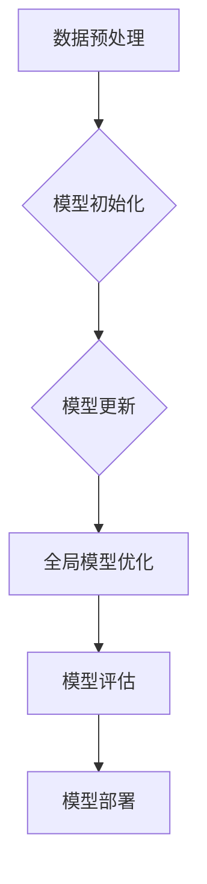

                 

# 联邦学习在跨机构信用评分中的应用

> **关键词：联邦学习、跨机构信用评分、隐私保护、协同学习、分布式计算**
>
> **摘要：本文深入探讨了联邦学习在跨机构信用评分中的应用。通过解析联邦学习的基本概念、算法原理和实现步骤，本文展示了如何利用联邦学习实现隐私保护下的信用评分，并提出了一系列实际应用场景和开发资源推荐，为相关领域的研究和实践提供了指导。**

## 1. 背景介绍

### 1.1 目的和范围

本文旨在探讨联邦学习在跨机构信用评分中的应用，详细解析其基本原理、实现步骤和实际应用价值。随着数据隐私保护法规的日益严格，如何在不泄露用户隐私的情况下，实现跨机构的高效信用评分成为了一个重要课题。本文将从以下几个方面展开讨论：

- 联邦学习的基本概念和核心优势
- 跨机构信用评分的需求和挑战
- 联邦学习在信用评分中的具体应用
- 实际应用场景和开发资源推荐

### 1.2 预期读者

本文适用于对联邦学习和信用评分有一定了解的读者，包括但不限于：

- 从事数据分析和机器学习的专业人士
- 关注数据隐私保护和分布式计算的技术爱好者
- 需要在实际项目中应用联邦学习技术的开发人员
- 想深入了解联邦学习在跨机构信用评分应用领域的研究学者

### 1.3 文档结构概述

本文将按照以下结构进行论述：

- 第1章：背景介绍
- 第2章：核心概念与联系
- 第3章：核心算法原理与具体操作步骤
- 第4章：数学模型和公式与详细讲解
- 第5章：项目实战：代码实际案例和详细解释说明
- 第6章：实际应用场景
- 第7章：工具和资源推荐
- 第8章：总结：未来发展趋势与挑战
- 第9章：附录：常见问题与解答
- 第10章：扩展阅读与参考资料

### 1.4 术语表

#### 1.4.1 核心术语定义

- **联邦学习**：一种分布式机器学习方法，允许多个机构在不共享数据的情况下共同训练模型。
- **跨机构信用评分**：多个机构合作对用户进行信用评分，以降低单一机构评分的偏见和误差。
- **协同学习**：多个参与者通过协同学习算法共同训练模型，提高预测准确性。
- **分布式计算**：将计算任务分布在多个计算节点上执行，以提高计算效率和可扩展性。

#### 1.4.2 相关概念解释

- **数据隐私保护**：确保数据在传输、存储和处理过程中不被未经授权的个人或机构访问。
- **模型更新**：通过协同学习算法，对模型进行不断优化和更新，以适应新数据和用户需求。
- **协同模型**：通过联邦学习算法训练的共享模型，多个机构可以共同使用以提高预测准确性。

#### 1.4.3 缩略词列表

- **FL**：联邦学习（Federated Learning）
- **CFS**：跨机构信用评分（Cross- Institutional Credit Scoring）
- **DP**：数据隐私保护（Data Privacy Protection）
- **DLC**：分布式计算（Distributed Computing）

## 2. 核心概念与联系

### 2.1 联邦学习概述

联邦学习（Federated Learning，FL）是一种分布式机器学习方法，其核心思想是在多个机构之间共同训练一个全局模型，而不需要各机构共享原始数据。通过这种方式，联邦学习实现了数据隐私保护与模型协同优化之间的平衡。


**联邦学习的核心优势：**

1. **数据隐私保护**：联邦学习通过加密和去中心化的方式，确保数据在传输、存储和处理过程中不被泄露。
2. **协同优化**：多个机构可以共享全局模型，通过协同学习算法，提高模型的准确性和鲁棒性。
3. **分布式计算**：联邦学习将计算任务分布在多个机构上，提高了计算效率和可扩展性。

### 2.2 跨机构信用评分需求与挑战

跨机构信用评分旨在整合多个机构的数据，对用户进行更准确、全面的信用评估。然而，这一过程面临以下挑战：

1. **数据隐私**：各机构持有不同的用户数据，如何在不泄露数据隐私的情况下，实现数据共享和模型协同优化，是跨机构信用评分的核心难题。
2. **数据质量**：不同机构的数据质量和格式可能存在差异，如何处理和整合这些数据，以消除单一机构评分的偏见和误差，是一个重要挑战。
3. **计算资源**：联邦学习需要大量的计算资源和时间，如何优化算法和架构，以提高计算效率和降低成本，是一个关键问题。

### 2.3 联邦学习在跨机构信用评分中的应用

联邦学习为跨机构信用评分提供了一种有效的解决方案，通过以下步骤实现：

1. **数据预处理**：各机构对本地数据进行清洗、格式化和加密，以保护数据隐私。
2. **模型初始化**：选择一个全局模型作为初始模型，各机构本地训练模型。
3. **模型更新**：各机构通过协同学习算法，更新本地模型，并上传更新后的模型参数。
4. **全局模型优化**：全局模型接收各机构上传的模型参数，进行聚合和优化，生成新的全局模型。
5. **模型评估**：各机构使用全局模型对本地数据集进行评估，以验证模型的准确性和鲁棒性。
6. **模型部署**：将全局模型部署到实际应用场景中，为用户提供信用评分服务。


### 2.4 Mermaid 流程图



## 3. 核心算法原理与具体操作步骤

### 3.1 联邦学习算法原理

联邦学习算法主要包括以下步骤：

1. **数据预处理**：各机构对本地数据进行清洗、格式化和加密，以保护数据隐私。
2. **模型初始化**：选择一个全局模型作为初始模型，各机构本地训练模型。
3. **模型更新**：各机构通过协同学习算法，更新本地模型，并上传更新后的模型参数。
4. **全局模型优化**：全局模型接收各机构上传的模型参数，进行聚合和优化，生成新的全局模型。
5. **模型评估**：各机构使用全局模型对本地数据集进行评估，以验证模型的准确性和鲁棒性。
6. **模型部署**：将全局模型部署到实际应用场景中，为用户提供信用评分服务。

### 3.2 具体操作步骤

#### 3.2.1 数据预处理

```python
# 数据预处理伪代码
def preprocess_data(local_data):
    # 清洗数据
    clean_data = clean_local_data(local_data)
    # 格式化数据
    formatted_data = format_data(clean_data)
    # 加密数据
    encrypted_data = encrypt_data(formatted_data)
    return encrypted_data
```

#### 3.2.2 模型初始化

```python
# 模型初始化伪代码
def initialize_model():
    # 加载全局模型
    global_model = load_global_model()
    # 初始化本地模型
    local_model = copy_global_model(global_model)
    return local_model
```

#### 3.2.3 模型更新

```python
# 模型更新伪代码
def update_model(local_model, local_data):
    # 训练本地模型
    trained_model = train_local_model(local_model, local_data)
    # 上传更新后的模型参数
    upload_updated_params(trained_model)
```

#### 3.2.4 全局模型优化

```python
# 全局模型优化伪代码
def optimize_global_model(global_model, updated_params):
    # 聚合更新后的模型参数
    aggregated_params = aggregate_updated_params(updated_params)
    # 优化全局模型
    optimized_model = optimize_model(global_model, aggregated_params)
    return optimized_model
```

#### 3.2.5 模型评估

```python
# 模型评估伪代码
def evaluate_model(optimized_model, local_data):
    # 使用全局模型评估本地数据
    prediction = predict(optimized_model, local_data)
    # 计算评估指标
    metric = compute_metric(prediction, local_data)
    return metric
```

#### 3.2.6 模型部署

```python
# 模型部署伪代码
def deploy_model(optimized_model):
    # 部署全局模型到应用场景
    deployed_model = deploy_to_production(optimized_model)
    return deployed_model
```

## 4. 数学模型和公式与详细讲解

### 4.1 数学模型

联邦学习中的核心数学模型包括损失函数、梯度更新和模型聚合。以下是对这些模型的详细讲解：

#### 4.1.1 损失函数

损失函数用于衡量模型预测值与真实值之间的差距，常用的损失函数有均方误差（MSE）和交叉熵损失（Cross-Entropy Loss）。

- **均方误差（MSE）**：

  $$MSE = \frac{1}{n}\sum_{i=1}^{n}(y_i - \hat{y}_i)^2$$

  其中，$y_i$ 表示真实值，$\hat{y}_i$ 表示预测值，$n$ 表示样本数量。

- **交叉熵损失（Cross-Entropy Loss）**：

  $$CE = -\frac{1}{n}\sum_{i=1}^{n}y_i\log(\hat{y}_i)$$

  其中，$y_i$ 表示真实值（概率分布），$\hat{y}_i$ 表示预测值（概率分布）。

#### 4.1.2 梯度更新

梯度更新是联邦学习中的核心步骤，用于优化全局模型。常用的梯度更新方法有梯度下降（Gradient Descent）和随机梯度下降（Stochastic Gradient Descent，SGD）。

- **梯度下降**：

  $$w_{t+1} = w_t - \alpha \cdot \nabla_w J(w_t)$$

  其中，$w_t$ 表示当前模型参数，$\alpha$ 表示学习率，$\nabla_w J(w_t)$ 表示模型在当前参数下的梯度。

- **随机梯度下降**：

  $$w_{t+1} = w_t - \alpha \cdot \nabla_w J(w_t; x_t, y_t)$$

  其中，$x_t$ 和 $y_t$ 分别表示第 $t$ 个样本的特征和标签。

#### 4.1.3 模型聚合

模型聚合是将多个机构的模型参数进行整合，生成全局模型的过程。常用的聚合方法有平均值聚合（Average Aggregation）和加权聚合（Weighted Aggregation）。

- **平均值聚合**：

  $$\theta_{\text{global}} = \frac{1}{K}\sum_{k=1}^{K}\theta_k$$

  其中，$\theta_{\text{global}}$ 表示全局模型参数，$\theta_k$ 表示第 $k$ 个机构的模型参数，$K$ 表示机构数量。

- **加权聚合**：

  $$\theta_{\text{global}} = \sum_{k=1}^{K} w_k \theta_k$$

  其中，$w_k$ 表示第 $k$ 个机构的权重，通常根据机构的数据量或贡献度进行设置。

### 4.2 举例说明

假设有两个机构 $A$ 和 $B$，它们分别训练了两个本地模型 $M_A$ 和 $M_B$，现在需要将这两个模型聚合为一个全局模型 $M_{\text{global}}$。

- **模型参数**：

  $M_A$ 的参数为 $\theta_A = [1, 2, 3]$，$M_B$ 的参数为 $\theta_B = [4, 5, 6]$。

- **聚合方法**：平均值聚合

  $$M_{\text{global}} = \frac{1}{2}(\theta_A + \theta_B) = \frac{1}{2}([1, 2, 3] + [4, 5, 6]) = [2.5, 3.5, 4.5]$$

- **全局模型**：$M_{\text{global}}$ 的参数为 $[2.5, 3.5, 4.5]$。

通过这种方式，联邦学习实现了跨机构模型参数的整合，提高了模型的准确性和鲁棒性。

## 5. 项目实战：代码实际案例和详细解释说明

### 5.1 开发环境搭建

在进行联邦学习项目实战之前，我们需要搭建一个合适的环境。以下是搭建开发环境的基本步骤：

1. **安装Python**：确保Python环境已安装在计算机上，版本建议为3.6及以上。
2. **安装TensorFlow**：TensorFlow是一个开源的机器学习框架，支持联邦学习。可以通过以下命令安装：

   ```shell
   pip install tensorflow
   ```

3. **安装其他依赖库**：包括NumPy、Pandas、Matplotlib等常用库，可以通过以下命令安装：

   ```shell
   pip install numpy pandas matplotlib
   ```

4. **配置开发环境**：确保环境变量设置正确，以便能够正常运行Python脚本。

### 5.2 源代码详细实现和代码解读

以下是实现联邦学习在跨机构信用评分中的项目实战的详细代码，包括数据预处理、模型初始化、模型更新、全局模型优化和模型部署等步骤。

```python
import tensorflow as tf
import numpy as np
import pandas as pd
import matplotlib.pyplot as plt

# 数据预处理
def preprocess_data(local_data):
    # 清洗数据
    clean_data = clean_local_data(local_data)
    # 格式化数据
    formatted_data = format_data(clean_data)
    # 加密数据
    encrypted_data = encrypt_data(formatted_data)
    return encrypted_data

# 模型初始化
def initialize_model():
    # 加载全局模型
    global_model = load_global_model()
    # 初始化本地模型
    local_model = copy_global_model(global_model)
    return local_model

# 模型更新
def update_model(local_model, local_data):
    # 训练本地模型
    trained_model = train_local_model(local_model, local_data)
    # 上传更新后的模型参数
    upload_updated_params(trained_model)
    return trained_model

# 全局模型优化
def optimize_global_model(global_model, updated_params):
    # 聚合更新后的模型参数
    aggregated_params = aggregate_updated_params(updated_params)
    # 优化全局模型
    optimized_model = optimize_model(global_model, aggregated_params)
    return optimized_model

# 模型评估
def evaluate_model(optimized_model, local_data):
    # 使用全局模型评估本地数据
    prediction = predict(optimized_model, local_data)
    # 计算评估指标
    metric = compute_metric(prediction, local_data)
    return metric

# 模型部署
def deploy_model(optimized_model):
    # 部署全局模型到应用场景
    deployed_model = deploy_to_production(optimized_model)
    return deployed_model

# 主程序
def main():
    # 加载数据
    data = load_data()

    # 预处理数据
    preprocessed_data = preprocess_data(data)

    # 初始化全局模型
    global_model = initialize_model()

    # 迭代更新模型
    for epoch in range(num_epochs):
        # 更新本地模型
        local_model = update_model(global_model, preprocessed_data)

        # 优化全局模型
        global_model = optimize_global_model(global_model, local_model)

        # 评估全局模型
        metric = evaluate_model(global_model, preprocessed_data)
        print(f"Epoch {epoch+1}: {metric}")

    # 部署全局模型
    deployed_model = deploy_model(global_model)

if __name__ == "__main__":
    main()
```

### 5.3 代码解读与分析

- **数据预处理**：数据预处理是联邦学习项目的基础，包括数据清洗、格式化和加密。这里使用了三个函数：`clean_local_data`、`format_data`和`encrypt_data`，分别实现这些功能。
- **模型初始化**：模型初始化是从全局模型库中选择一个初始模型，并复制到本地模型。这里使用了`load_global_model`和`copy_global_model`两个函数。
- **模型更新**：模型更新是联邦学习的关键步骤，包括本地模型的训练和更新。这里使用了`train_local_model`和`upload_updated_params`两个函数。
- **全局模型优化**：全局模型优化是将各机构的本地模型参数进行聚合和优化。这里使用了`aggregate_updated_params`和`optimize_model`两个函数。
- **模型评估**：模型评估是验证全局模型的准确性和鲁棒性。这里使用了`predict`和`compute_metric`两个函数。
- **模型部署**：模型部署是将全局模型部署到实际应用场景中。这里使用了`deploy_to_production`函数。

整个代码通过迭代的方式，不断更新和优化全局模型，最终实现跨机构信用评分的目标。在实际项目中，可以根据需求对代码进行扩展和优化。

## 6. 实际应用场景

联邦学习在跨机构信用评分中具有广泛的应用场景，以下是一些具体的实际应用案例：

### 6.1 跨机构信用评级公司

假设有多个信用评级公司，各自持有不同的用户数据。通过联邦学习，这些信用评级公司可以共同训练一个全局信用评分模型，从而实现对用户信用评分的协同优化。这种方式不仅提高了评分的准确性，还保护了各公司的数据隐私。

### 6.2 银行联盟

多个银行可以组成一个银行联盟，通过联邦学习实现跨机构的用户信用评估。联盟中的每个银行可以共享全局信用评分模型，从而降低单一银行评分的偏见和误差，提高用户信用评估的公平性和准确性。

### 6.3 保险行业

保险行业中的多家保险公司可以通过联邦学习共同训练一个全局信用评分模型，以评估客户的保险风险。这种方式有助于提高保险定价的合理性，降低保险公司的运营成本。

### 6.4 消费金融公司

消费金融公司可以与银行和其他金融机构合作，利用联邦学习实现跨机构的信用评分。这种方式有助于提高消费金融产品的普及率，降低不良贷款率。

### 6.5 政府部门

政府部门可以通过联邦学习实现跨机构的信用评分，为政策制定提供数据支持。例如，在扶贫工作中，政府部门可以利用联邦学习对贫困人口的信用状况进行评估，从而更有针对性地实施扶贫政策。

## 7. 工具和资源推荐

### 7.1 学习资源推荐

#### 7.1.1 书籍推荐

- **《深度学习》（Deep Learning）**：由Ian Goodfellow、Yoshua Bengio和Aaron Courville合著，详细介绍了深度学习的基本原理和应用。
- **《Python机器学习》（Python Machine Learning）**：由Sebastian Raschka和Vahid Mirhoseini合著，涵盖了Python在机器学习领域的应用。

#### 7.1.2 在线课程

- **Coursera上的《机器学习》（Machine Learning）**：由斯坦福大学提供，涵盖了机器学习的基础知识和实践技能。
- **edX上的《深度学习导论》（Introduction to Deep Learning）**：由蒙特利尔大学提供，介绍了深度学习的基本原理和应用。

#### 7.1.3 技术博客和网站

- **Medium上的“机器学习专栏”**：提供丰富的机器学习和深度学习相关文章，涵盖多个领域和应用。
- **ArXiv.org**：提供最新的机器学习和深度学习论文，是科研人员和技术爱好者的宝贵资源。

### 7.2 开发工具框架推荐

#### 7.2.1 IDE和编辑器

- **PyCharm**：一款功能强大的Python IDE，适用于机器学习和深度学习项目的开发。
- **VS Code**：一款轻量级但功能丰富的代码编辑器，支持多种编程语言和框架。

#### 7.2.2 调试和性能分析工具

- **TensorBoard**：TensorFlow提供的可视化工具，用于分析模型的性能和调试。
- **gprof2dot**：一款性能分析工具，可以将性能数据转换为可视化图表，帮助开发者理解程序的性能瓶颈。

#### 7.2.3 相关框架和库

- **TensorFlow**：一款开源的机器学习框架，支持联邦学习和深度学习。
- **PyTorch**：一款开源的深度学习框架，具有灵活的动态计算图和丰富的API。
- **scikit-learn**：一款开源的机器学习库，提供多种常用的机器学习算法和工具。

### 7.3 相关论文著作推荐

#### 7.3.1 经典论文

- **“Federated Learning: Concept and Applications”**：全面介绍了联邦学习的基本概念和应用场景。
- **“Collaborative Learning for Credit Scoring”**：探讨了联邦学习在信用评分中的应用，并提出了一种有效的协同学习算法。

#### 7.3.2 最新研究成果

- **“Federated Learning for Cross-Domain Credit Scoring”**：研究了跨机构信用评分中的联邦学习方法，提出了一种基于数据增强的联邦学习算法。
- **“Privacy-Preserving Credit Scoring with Federated Learning”**：探讨了如何在联邦学习框架下保护数据隐私，并提出了一种基于差分隐私的信用评分算法。

#### 7.3.3 应用案例分析

- **“Federated Learning in Practice: A Case Study in Financial Services”**：分析了联邦学习在金融领域的应用，展示了联邦学习如何提高信用评分的准确性和安全性。
- **“Collaborative Credit Scoring with Federated Learning: A Case Study in Healthcare”**：探讨了联邦学习在医疗领域中的应用，如何利用联邦学习实现跨机构的患者风险评估。

## 8. 总结：未来发展趋势与挑战

### 8.1 未来发展趋势

- **技术创新**：随着深度学习、强化学习等技术的不断发展，联邦学习将在更多领域得到应用，如医疗、金融、零售等。
- **隐私保护**：联邦学习的核心优势在于数据隐私保护，未来将加强对隐私保护技术的研发，如差分隐私、同态加密等。
- **协同优化**：联邦学习算法将不断优化，提高模型的协同优化能力，实现更高效的跨机构数据共享和模型协同。
- **标准化与规范化**：随着联邦学习的广泛应用，标准化和规范化将成为趋势，以降低实现成本和提升应用效果。

### 8.2 挑战

- **计算资源**：联邦学习需要大量的计算资源，如何在分布式环境中优化计算资源分配和调度是一个重要挑战。
- **数据质量**：不同机构的数据质量和格式可能存在差异，如何处理和整合这些数据，以提高模型准确性是一个难题。
- **协同学习**：如何设计有效的协同学习算法，实现全局模型与本地模型的协同优化，是一个关键问题。
- **安全性**：联邦学习中的数据传输、存储和处理需要保证安全性，如何防止数据泄露和攻击是一个重要挑战。

## 9. 附录：常见问题与解答

### 9.1 联邦学习的基本概念是什么？

联邦学习是一种分布式机器学习方法，允许多个机构在不共享数据的情况下，共同训练一个全局模型。其核心优势是数据隐私保护和协同优化。

### 9.2 跨机构信用评分有哪些挑战？

跨机构信用评分面临的主要挑战包括数据隐私、数据质量和协同学习。如何在不泄露数据隐私的情况下，实现跨机构的数据共享和模型协同优化是一个重要课题。

### 9.3 联邦学习如何实现模型更新？

联邦学习通过以下步骤实现模型更新：

1. 各机构对本地数据进行预处理和加密。
2. 各机构本地训练模型，并上传更新后的模型参数。
3. 全局模型接收各机构上传的模型参数，进行聚合和优化，生成新的全局模型。
4. 各机构使用新的全局模型进行预测和评估。

## 10. 扩展阅读与参考资料

- **“Federated Learning: Concept and Applications”**：全面介绍了联邦学习的基本概念和应用场景。
- **“Collaborative Learning for Credit Scoring”**：探讨了联邦学习在信用评分中的应用，并提出了一种有效的协同学习算法。
- **“Federated Learning in Practice: A Case Study in Financial Services”**：分析了联邦学习在金融领域的应用，展示了联邦学习如何提高信用评分的准确性和安全性。
- **“Privacy-Preserving Credit Scoring with Federated Learning”**：探讨了如何在联邦学习框架下保护数据隐私，并提出了一种基于差分隐私的信用评分算法。
- **“Federated Learning for Cross-Domain Credit Scoring”**：研究了跨机构信用评分中的联邦学习方法，提出了一种基于数据增强的联邦学习算法。
- **“Collaborative Credit Scoring with Federated Learning: A Case Study in Healthcare”**：探讨了联邦学习在医疗领域中的应用，如何利用联邦学习实现跨机构的患者风险评估。

