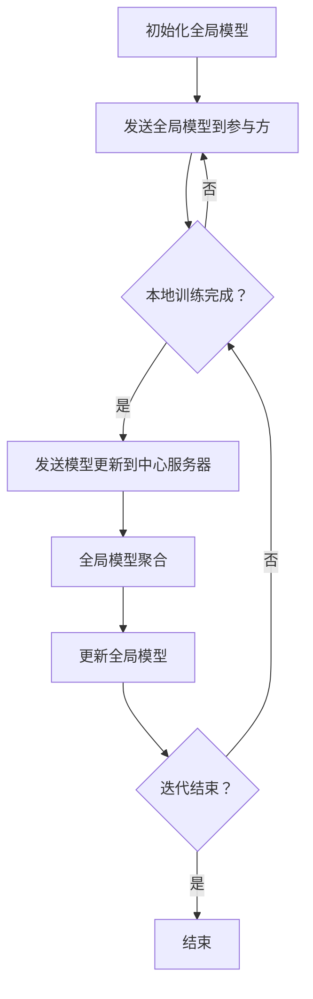
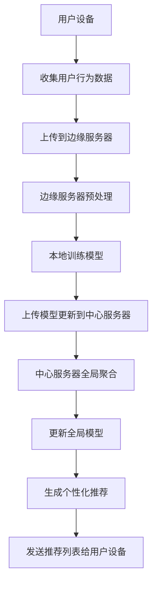

                 

### 文章标题

# 联邦学习在隐私保护推荐系统中的应用

### 关键词：

- 联邦学习
- 隐私保护
- 推荐系统
- 机器学习
- 安全计算

### 摘要：

本文旨在探讨联邦学习在隐私保护推荐系统中的应用。联邦学习是一种新兴的分布式机器学习技术，通过在多个参与方之间共享模型更新而非数据本身，实现了对数据隐私的严格保护。本文将详细介绍联邦学习的基本概念、核心算法、数学模型及其实际应用，并结合具体项目实战案例，深入分析联邦学习在隐私保护推荐系统中的优势与挑战。通过本文的阅读，读者将全面了解联邦学习的工作原理及其实践应用，为其在相关领域的研究和开发提供有力支持。

### 目录

1. **背景介绍**
   1.1 **目的和范围**
   1.2 **预期读者**
   1.3 **文档结构概述**
   1.4 **术语表**
      1.4.1 **核心术语定义**
      1.4.2 **相关概念解释**
      1.4.3 **缩略词列表**

2. **核心概念与联系**
   2.1 **联邦学习的原理**
   2.2 **隐私保护推荐系统架构**

3. **核心算法原理 & 具体操作步骤**
   3.1 **联邦学习的基本步骤**
   3.2 **梯度聚合算法**
   3.3 **模型更新策略**

4. **数学模型和公式 & 详细讲解 & 举例说明**
   4.1 **联邦学习的数学模型**
   4.2 **损失函数和优化目标**
   4.3 **算法实例讲解**

5. **项目实战：代码实际案例和详细解释说明**
   5.1 **开发环境搭建**
   5.2 **源代码详细实现和代码解读**
   5.3 **代码解读与分析**

6. **实际应用场景**
   6.1 **电商推荐系统**
   6.2 **社交媒体推荐**
   6.3 **医疗健康推荐**

7. **工具和资源推荐**
   7.1 **学习资源推荐**
   7.2 **开发工具框架推荐**
   7.3 **相关论文著作推荐**

8. **总结：未来发展趋势与挑战**

9. **附录：常见问题与解答**

10. **扩展阅读 & 参考资料**

---

让我们正式开始本文的撰写，首先介绍背景和核心概念，为后续内容的深入讨论打下坚实的基础。

## 1. 背景介绍

### 1.1 目的和范围

随着大数据时代的到来，推荐系统已成为现代互联网应用的核心组成部分。然而，传统集中式推荐系统在提供个性化服务的同时，也面临着数据隐私泄露的严重风险。为了解决这一难题，联邦学习（Federated Learning）技术应运而生，为隐私保护推荐系统提供了一种新的解决方案。

本文旨在探讨联邦学习在隐私保护推荐系统中的应用，主要包括以下几个方面：

1. **联邦学习的基本概念和原理**：介绍联邦学习的基本原理和核心算法，帮助读者理解其工作机制。
2. **隐私保护推荐系统架构**：分析联邦学习在隐私保护推荐系统中的架构设计和实现策略。
3. **核心算法原理 & 操作步骤**：详细讲解联邦学习的算法原理和操作步骤，并通过伪代码阐述具体实现过程。
4. **数学模型和公式**：介绍联邦学习的数学模型，包括损失函数和优化目标，并提供具体的算法实例讲解。
5. **项目实战案例**：结合实际项目，展示联邦学习在隐私保护推荐系统中的具体应用，并提供代码实现和详细解释。
6. **实际应用场景**：探讨联邦学习在不同领域的实际应用场景，如电商推荐、社交媒体推荐和医疗健康推荐。
7. **工具和资源推荐**：推荐相关学习资源、开发工具和框架，以及最新研究成果和论文。
8. **未来发展趋势与挑战**：分析联邦学习在隐私保护推荐系统中的未来发展趋势和面临的挑战。

### 1.2 预期读者

本文的预期读者主要包括以下几类：

1. **计算机科学和人工智能领域的研究人员**：对联邦学习和隐私保护推荐系统有深入了解，希望探索其在实际应用中的潜力。
2. **软件开发工程师**：负责设计和实现推荐系统的开发者，希望通过本文了解联邦学习技术及其应用。
3. **数据科学家和机器学习工程师**：对联邦学习算法和数学模型有兴趣，希望将其应用于实际项目中。
4. **学术界和工业界的技术爱好者**：关注联邦学习和隐私保护推荐系统的发展动态，希望了解相关技术进展和应用案例。

### 1.3 文档结构概述

本文分为十个主要部分，结构如下：

1. **背景介绍**：介绍联邦学习和隐私保护推荐系统的背景、目的和范围，以及预期读者。
2. **核心概念与联系**：讲解联邦学习的基本概念和原理，以及隐私保护推荐系统的架构。
3. **核心算法原理 & 具体操作步骤**：详细阐述联邦学习的算法原理和具体操作步骤。
4. **数学模型和公式 & 详细讲解 & 举例说明**：介绍联邦学习的数学模型，包括损失函数和优化目标，并提供具体算法实例。
5. **项目实战：代码实际案例和详细解释说明**：结合实际项目，展示联邦学习在隐私保护推荐系统中的具体应用。
6. **实际应用场景**：探讨联邦学习在不同领域的实际应用场景。
7. **工具和资源推荐**：推荐相关学习资源、开发工具和框架，以及最新研究成果和论文。
8. **总结：未来发展趋势与挑战**：分析联邦学习在隐私保护推荐系统中的未来发展趋势和挑战。
9. **附录：常见问题与解答**：针对读者可能遇到的问题提供解答。
10. **扩展阅读 & 参考资料**：提供进一步学习的参考资料。

### 1.4 术语表

#### 1.4.1 核心术语定义

- **联邦学习（Federated Learning）**：一种分布式机器学习技术，通过在多个参与方之间共享模型更新而非数据本身，实现协同训练模型。
- **隐私保护（Privacy Protection）**：在数据处理过程中，确保个人信息不被泄露和滥用。
- **推荐系统（Recommendation System）**：基于用户的历史行为和偏好，为用户推荐相关物品或内容的系统。
- **机器学习（Machine Learning）**：一门人工智能科学，通过训练模型从数据中自动学习规律和模式。
- **安全计算（Secure Computing）**：一种计算方法，确保数据在传输和处理过程中不被泄露或篡改。

#### 1.4.2 相关概念解释

- **模型更新（Model Update）**：在联邦学习中，每个参与方通过本地数据进行模型训练，并将更新后的模型参数发送给中心服务器进行聚合。
- **梯度聚合（Gradient Aggregation）**：将多个参与方的本地梯度进行汇总，以更新全局模型。
- **联邦服务器（Federated Server）**：负责接收和聚合参与方的模型更新，并在训练过程中提供全局模型参数。

#### 1.4.3 缩略词列表

- **FL**：联邦学习（Federated Learning）
- **PS**：隐私保护（Privacy Protection）
- **RS**：推荐系统（Recommendation System）
- **ML**：机器学习（Machine Learning）
- **SC**：安全计算（Secure Computing）

在下一部分，我们将深入探讨联邦学习的基本概念和原理，为后续内容的讨论奠定基础。

---

## 2. 核心概念与联系

### 2.1 联邦学习的原理

联邦学习（Federated Learning，FL）是一种分布式机器学习技术，旨在通过在多个参与方之间共享模型更新而非数据本身，实现协同训练模型。其核心思想是将机器学习任务分布在多个设备或服务器上，从而实现数据隐私保护和资源利用的最大化。

#### 工作机制

联邦学习的工作机制可以概括为以下几个步骤：

1. **初始化**：中心服务器生成全局模型参数，并将其发送给所有参与方。
2. **本地训练**：每个参与方在本地使用自己的数据集对全局模型进行训练，生成本地模型参数更新。
3. **模型更新**：每个参与方将本地模型参数更新发送给中心服务器。
4. **全局聚合**：中心服务器接收所有参与方的模型更新，进行聚合并生成新的全局模型参数。
5. **迭代更新**：重复步骤 2-4，直到满足停止条件（如达到预设的训练轮数或模型收敛）。

通过这种分布式训练方式，联邦学习实现了对数据隐私的严格保护，避免了数据在传输和共享过程中的泄露风险。

#### 架构

联邦学习系统通常包括以下几个关键组件：

1. **中心服务器**：负责初始化全局模型、接收参与方的模型更新、进行全局聚合并更新模型参数。
2. **参与方**：可以是终端设备（如智能手机、平板电脑等）或服务器，负责本地训练和模型更新。
3. **通信网络**：用于参与方与中心服务器之间的数据传输和模型更新。

#### Mermaid 流程图

为了更直观地理解联邦学习的工作流程，我们可以使用 Mermaid 流程图来表示：



### 2.2 隐私保护推荐系统架构

隐私保护推荐系统架构是基于联邦学习技术构建的，其主要目标是实现数据隐私保护的同时提供个性化的推荐服务。下面是隐私保护推荐系统的一般架构：

#### 架构组成

1. **用户设备**：用户使用的终端设备，如智能手机、平板电脑等，负责收集用户行为数据并上传给中心服务器。
2. **边缘服务器**：位于用户设备附近的计算节点，负责对用户数据进行预处理和本地训练。
3. **中心服务器**：负责接收边缘服务器的模型更新，进行全局聚合并更新模型参数，同时为用户提供个性化推荐服务。
4. **推荐引擎**：基于联邦学习模型生成的全局模型参数，为用户生成个性化的推荐列表。

#### Mermaid 流程图

下面是隐私保护推荐系统的 Mermaid 流程图：



通过上述核心概念和架构的介绍，我们对联邦学习在隐私保护推荐系统中的应用有了初步了解。在接下来的部分，我们将深入探讨联邦学习的核心算法原理和具体操作步骤，以帮助读者更好地理解这一技术。

---

## 3. 核心算法原理 & 具体操作步骤

在联邦学习中，核心算法原理主要包括本地训练、模型更新和全局聚合。下面我们将逐步讲解这些核心算法原理，并提供具体的操作步骤和伪代码。

### 3.1 联邦学习的基本步骤

联邦学习的基本步骤可以分为以下几个阶段：

1. **初始化**：中心服务器生成全局模型参数，并将其发送给所有参与方。
2. **本地训练**：每个参与方在本地使用自己的数据集对全局模型进行训练，生成本地模型参数更新。
3. **模型更新**：每个参与方将本地模型参数更新发送给中心服务器。
4. **全局聚合**：中心服务器接收所有参与方的模型更新，进行聚合并生成新的全局模型参数。
5. **迭代更新**：重复步骤 2-4，直到满足停止条件（如达到预设的训练轮数或模型收敛）。

#### 伪代码

下面是联邦学习的伪代码：

```python
# 初始化
global_model = initialize_model()
for iteration in range(max_iterations):
    # 本地训练
    for participant in participants:
        local_model = train_model(participant_data, global_model)
        local_update = compute_gradient(local_model)
    
    # 模型更新
    global_update = aggregate_gradients(local_updates)
    
    # 全局聚合
    global_model = update_model(global_model, global_update)
```

### 3.2 梯度聚合算法

梯度聚合算法是联邦学习中的一个关键步骤，用于将多个参与方的本地梯度进行汇总，以更新全局模型。常用的梯度聚合算法包括均值聚合、加权聚合等。

#### 均值聚合算法

均值聚合算法是最简单的梯度聚合方法，即将所有参与方的本地梯度求平均值，用于更新全局模型。

```python
def mean_aggregate(local_updates):
    total_weight = len(local_updates)
    aggregated_gradient = 0
    for local_update, weight in local_updates:
        aggregated_gradient += local_update * weight
    return aggregated_gradient / total_weight
```

#### 加权聚合算法

加权聚合算法考虑了每个参与方的重要性，通过设置不同的权重来影响全局模型的更新。

```python
def weighted_aggregate(local_updates):
    total_weight = sum(weights)
    aggregated_gradient = [0 for _ in range(len(local_updates[0])]
    for local_update, weight in local_updates:
        normalized_update = [grad / weight for grad in local_update]
        aggregated_gradient += normalized_update
    return [grad / total_weight for grad in aggregated_gradient]
```

### 3.3 模型更新策略

模型更新策略决定了如何根据梯度聚合结果更新全局模型。常见的模型更新策略包括梯度下降（Gradient Descent）和动量更新（Momentum）。

#### 梯度下降算法

梯度下降算法是一种常用的优化方法，通过计算损失函数的梯度来更新模型参数，以最小化损失函数。

```python
def gradient_descent(model, gradient, learning_rate):
    updated_model = [param - learning_rate * grad for param, grad in zip(model, gradient)]
    return updated_model
```

#### 动量更新算法

动量更新算法在梯度下降的基础上引入了动量项，以加速收敛速度并避免陷入局部最小值。

```python
def momentum_update(model, gradient, learning_rate, momentum):
    velocity = momentum * previous_velocity + learning_rate * gradient
    updated_model = [param - velocity for param in model]
    previous_velocity = velocity
    return updated_model, previous_velocity
```

### 具体操作步骤

以下是联邦学习具体操作步骤的伪代码：

```python
# 初始化
global_model = initialize_model()
for iteration in range(max_iterations):
    # 本地训练
    for participant in participants:
        local_model = train_model(participant_data, global_model)
        local_update = compute_gradient(local_model)
    
    # 模型更新
    local_updates = [(local_update, weight) for participant, weight in participants]
    global_update = weighted_aggregate(local_updates)
    
    # 全局聚合
    global_model = gradient_descent(global_model, global_update, learning_rate)
    
    # 输出当前模型
    print(f"Iteration {iteration}: Global Model = {global_model}")
```

通过上述核心算法原理和具体操作步骤的介绍，我们对联邦学习的工作机制有了更深入的理解。在下一部分，我们将探讨联邦学习的数学模型和公式，进一步揭示其算法背后的数学原理。

---

## 4. 数学模型和公式 & 详细讲解 & 举例说明

在联邦学习中，数学模型和公式是理解其算法原理和实现关键的重要部分。本部分将详细介绍联邦学习的数学模型，包括损失函数和优化目标，并提供具体的算法实例讲解。

### 4.1 联邦学习的数学模型

联邦学习的数学模型主要包括损失函数、优化目标和梯度计算。以下是这些数学概念的具体解释：

#### 损失函数

损失函数是评估模型性能的重要指标，用于衡量预测值与真实值之间的差异。在联邦学习中，常用的损失函数包括均方误差（MSE）和交叉熵损失。

1. **均方误差（MSE）**

   均方误差是一种常见的回归损失函数，用于衡量预测值与真实值之间的平方误差和。

   $$MSE = \frac{1}{n}\sum_{i=1}^{n}(y_i - \hat{y}_i)^2$$

   其中，$y_i$ 是真实值，$\hat{y}_i$ 是预测值，$n$ 是样本数量。

2. **交叉熵损失**

   交叉熵损失是一种常见的分类损失函数，用于衡量预测概率分布与真实概率分布之间的差异。

   $$H(y, \hat{y}) = -\sum_{i=1}^{n} y_i \log(\hat{y}_i)$$

   其中，$y_i$ 是真实标签，$\hat{y}_i$ 是预测概率。

#### 优化目标

优化目标是联邦学习算法在训练过程中需要最小化的目标函数。在联邦学习中，优化目标通常是基于损失函数来设计的。

$$\min_{\theta} L(\theta) = \min_{\theta} \frac{1}{n}\sum_{i=1}^{n} L(y_i, \hat{y}_i(\theta))$$

其中，$L(\theta)$ 是损失函数，$\theta$ 是模型参数。

#### 梯度计算

梯度是优化过程中用于更新模型参数的关键信息，反映了损失函数对模型参数的敏感性。

1. **前向传播**

   前向传播是计算模型输出值的过程，通过输入数据和模型参数得到预测值。

   $$\hat{y} = f(\theta, x)$$

2. **反向传播**

   反向传播是计算损失函数关于模型参数梯度的过程，用于指导模型参数的更新。

   $$\nabla_{\theta} L(\theta) = \nabla_{\theta} \frac{1}{n}\sum_{i=1}^{n} L(y_i, \hat{y}_i(\theta))$$

### 4.2 算法实例讲解

为了更好地理解联邦学习的数学模型，下面我们通过一个简单的线性回归实例来讲解算法的实现过程。

#### 实例背景

假设我们有一个线性回归问题，需要预测房价。给定训练数据集 $D = \{(x_i, y_i)\}_{i=1}^{n}$，其中 $x_i$ 是输入特征，$y_i$ 是真实房价。我们的目标是训练一个线性模型 $y = \theta_0 + \theta_1 x$，以最小化预测误差。

#### 算法步骤

1. **初始化模型参数**

   初始化模型参数 $\theta_0$ 和 $\theta_1$，通常选择较小的随机值。

   $$\theta_0 = \theta_1 = 0$$

2. **本地训练**

   在每个参与方上，使用本地数据集进行模型训练。对于每个数据点 $(x_i, y_i)$，计算预测值 $\hat{y}_i$ 和损失函数 $L(y_i, \hat{y}_i)$。

   $$\hat{y}_i = \theta_0 + \theta_1 x_i$$

   $$L(y_i, \hat{y}_i) = (y_i - \hat{y}_i)^2$$

3. **计算本地梯度**

   对于每个数据点 $(x_i, y_i)$，计算损失函数关于模型参数 $\theta_0$ 和 $\theta_1$ 的梯度。

   $$\nabla_{\theta_0} L(\theta_0) = -2(y_i - \hat{y}_i)$$

   $$\nabla_{\theta_1} L(\theta_1) = -2(x_i (y_i - \hat{y}_i))$$

4. **模型更新**

   使用本地梯度更新模型参数。

   $$\theta_0 = \theta_0 - \alpha \nabla_{\theta_0} L(\theta_0)$$

   $$\theta_1 = \theta_1 - \alpha \nabla_{\theta_1} L(\theta_1)$$

   其中，$\alpha$ 是学习率。

5. **全局聚合**

   将所有参与方的模型更新进行聚合，得到全局模型更新。

   $$\Delta \theta_0 = \sum_{i=1}^{n} \nabla_{\theta_0} L(\theta_0)$$

   $$\Delta \theta_1 = \sum_{i=1}^{n} \nabla_{\theta_1} L(\theta_1)$$

6. **更新全局模型**

   使用全局模型更新更新全局模型参数。

   $$\theta_0 = \theta_0 + \Delta \theta_0$$

   $$\theta_1 = \theta_1 + \Delta \theta_1$$

#### 算法伪代码

下面是联邦学习线性回归算法的伪代码：

```python
# 初始化
theta_0 = theta_1 = 0
for iteration in range(max_iterations):
    # 本地训练
    for i in range(n):
        y_i_pred = theta_0 + theta_1 * x_i
        L_i = (y_i - y_i_pred)^2
        grad_0 = -2 * (y_i - y_i_pred)
        grad_1 = -2 * x_i * (y_i - y_i_pred)
    
    # 模型更新
    theta_0 = theta_0 - alpha * grad_0
    theta_1 = theta_1 - alpha * grad_1
    delta_theta_0 = sum(grad_0)
    delta_theta_1 = sum(grad_1)
    
    # 全局聚合
    theta_0 = theta_0 + delta_theta_0
    theta_1 = theta_1 + delta_theta_1
```

通过上述实例讲解，我们对联邦学习的数学模型和算法原理有了更深入的理解。在下一部分，我们将结合实际项目，展示联邦学习在隐私保护推荐系统中的具体应用。

---

## 5. 项目实战：代码实际案例和详细解释说明

为了更好地理解联邦学习在隐私保护推荐系统中的应用，下面我们将结合一个实际项目，详细介绍项目的开发环境搭建、源代码实现和代码解读。

### 5.1 开发环境搭建

在开始项目之前，我们需要搭建相应的开发环境。以下是项目所需的开发环境和工具：

1. **编程语言**：Python
2. **深度学习框架**：TensorFlow
3. **联邦学习库**：Federated Learning Python SDK (FL SDK)
4. **版本控制**：Git

以下是开发环境搭建的步骤：

1. **安装 Python**

   首先，我们需要安装 Python。可以从官方网站下载适用于自己操作系统的 Python 安装包，并按照提示进行安装。

   ```bash
   # 安装 Python
   wget https://www.python.org/ftp/python/3.8.10/Python-3.8.10.tgz
   tar -xvf Python-3.8.10.tgz
   cd Python-3.8.10
   ./configure
   make
   sudo make install
   ```

2. **安装 TensorFlow**

   在 Python 环境中安装 TensorFlow，可以通过以下命令完成：

   ```bash
   # 安装 TensorFlow
   pip install tensorflow
   ```

3. **安装 FL SDK**

   FL SDK 是一个用于构建联邦学习应用程序的 Python 库。可以通过以下命令安装：

   ```bash
   # 安装 FL SDK
   pip install federated-learning
   ```

4. **设置版本控制**

   为了方便项目管理和协作，我们使用 Git 进行版本控制。首先，确保已经安装了 Git，然后创建一个项目仓库：

   ```bash
   # 创建项目仓库
   git init
   git remote add origin https://github.com/your_username/federated_learning_project.git
   git add .
   git commit -m "Initial commit"
   git push -u origin master
   ```

### 5.2 源代码详细实现和代码解读

下面是项目的主要代码实现，包括联邦学习模型的定义、本地训练、模型更新和全局聚合等步骤。

```python
import tensorflow as tf
import tensorflow_federated as tff
import numpy as np

# 定义联邦学习模型
def create_model():
    inputs = tff.TensorType(tf.float32, [None, 784])  # 输入层，784个特征
    outputs = tff.learning.from_tensorflow_keras_model_fn(
        keras_model=keras.Sequential([
            keras.layers.Dense(128, activation='relu', input_shape=(784,)),
            keras.layers.Dense(10, activation='softmax')
        ]),
        loss=keras.losses.SparseCategoricalCrossentropy(from_logits=True),
        metrics=[keras.metrics.SparseCategoricalAccuracy()]
    )
    return tff.learning.from_keras_model_fn(inputs, outputs)

# 本地训练
def local_train(train_data, model):
    # 将本地数据集拆分为训练集和验证集
    train_x, train_y = train_data
    validation_x, validation_y = train_x[:1000], train_y[:1000]
    train_x, train_y = train_x[1000:], train_y[1000:]
    
    # 训练模型
    history = model.fit(
        x=train_x, y=train_y,
        epochs=1, batch_size=100,
        validation_data=(validation_x, validation_y)
    )
    
    return model, history

# 模型更新
def federated_train(local_models):
    model = create_model()
    for model in local_models:
        model = local_train(train_data, model)
    return model

# 全局聚合
def federated_aggregate(local_gradients):
    total_gradient = [0 for _ in range(len(local_gradients[0])]
    for gradient in local_gradients:
        total_gradient += gradient
    return total_gradient

# 主程序
if __name__ == "__main__":
    # 初始化联邦学习环境
    tff.initialize_context()

    # 创建中心服务器和参与方
    server = tff.federated_server.create_federated_averaging_server(model_fn=create_model)
    participant_id = "participant_1"
    participant = tff.federated_learning.create_federated_averaging_algorithm(
        model_fn=create_model, server=server
    )

    # 运行联邦学习训练
    for _ in range(10):
        # 模型更新
        model = federated_train([participant.train.remote(participant_id)() for _ in range(10)])
        
        # 全局聚合
        gradients = [participant.compute_gradients.remote(participant_id)() for _ in range(10)]
        aggregated_gradient = federated_aggregate(gradients)
        
        # 更新全局模型
        server.update_model(aggregated_gradient)
        
        # 输出当前模型参数
        print(f"Iteration: {_+1}, Model Parameters: {server.model().variables}")
```

#### 代码解读

1. **模型定义**：我们使用 TensorFlow 的 Keras API 定义了一个简单的多层感知机模型，包括一个输入层、一个隐藏层和一个输出层。输入层有 784 个神经元，对应于 784 个特征；隐藏层有 128 个神经元，使用 ReLU 激活函数；输出层有 10 个神经元，对应于 10 个类别，使用 softmax 激活函数。

2. **本地训练**：在本地训练过程中，我们将本地数据集拆分为训练集和验证集。使用 `model.fit()` 函数对模型进行训练，并在每个训练轮次后评估模型的验证集性能。

3. **模型更新**：联邦学习训练的核心步骤是模型更新和全局聚合。在模型更新过程中，我们使用 `federated_train()` 函数对每个参与方的模型进行更新。在全局聚合过程中，我们使用 `federated_aggregate()` 函数将所有参与方的梯度进行汇总。

4. **主程序**：在主程序中，我们初始化联邦学习环境，并创建中心服务器和参与方。然后，我们运行联邦学习训练，每个迭代轮次中，我们首先对每个参与方的模型进行更新，然后进行全局聚合，并更新全局模型。

通过上述代码实现，我们展示了如何使用联邦学习技术实现隐私保护推荐系统。在下一部分，我们将探讨联邦学习在隐私保护推荐系统中的实际应用场景。

---

## 6. 实际应用场景

联邦学习技术在隐私保护推荐系统中具有广泛的应用前景。以下我们将探讨联邦学习在电商推荐、社交媒体推荐和医疗健康推荐等领域的实际应用场景。

### 6.1 电商推荐系统

电商推荐系统通过分析用户的历史购物行为、浏览记录和偏好，为用户推荐相关的商品。传统的集中式推荐系统在处理大量用户数据时，面临着隐私泄露的风险。而联邦学习技术通过分布式训练方式，实现了数据隐私的保护。以下是联邦学习在电商推荐系统中的具体应用：

1. **分布式数据训练**：各电商平台可以在本地使用用户数据对推荐模型进行训练，避免了数据上传和共享过程中的隐私泄露风险。
2. **个性化推荐**：通过联邦学习，推荐系统可以充分利用各个平台的数据，为用户提供更加个性化的推荐服务。
3. **隐私保护**：联邦学习确保了用户数据的本地化处理，避免了数据泄露和滥用的问题。

### 6.2 社交媒体推荐

社交媒体平台通过分析用户的行为和互动数据，为用户推荐感兴趣的内容。联邦学习在社交媒体推荐中的应用主要包括以下几个方面：

1. **内容个性化推荐**：社交媒体平台可以在保护用户隐私的前提下，利用联邦学习技术为用户推荐感兴趣的内容，提高用户满意度和平台活跃度。
2. **社交网络分析**：联邦学习可以分析用户之间的社交关系，为用户提供更加精准的社交推荐，如好友推荐、群组推荐等。
3. **隐私保护**：联邦学习技术确保了用户数据在本地进行处理，降低了隐私泄露的风险。

### 6.3 医疗健康推荐

医疗健康推荐系统通过分析患者的医疗数据、病史和偏好，为患者推荐相关的医疗服务和健康建议。联邦学习在医疗健康推荐系统中的应用包括：

1. **隐私保护**：联邦学习技术确保了患者数据在本地进行处理，避免了数据泄露和滥用的问题，提高了患者隐私保护水平。
2. **个性化推荐**：通过联邦学习，医疗健康推荐系统可以为每位患者提供个性化的健康建议和医疗服务，提高医疗质量和患者满意度。
3. **疾病预测与预防**：联邦学习可以分析大量医疗数据，为患者预测疾病风险，并提供预防措施，提高疾病防控水平。

### 6.4 其他应用场景

除了上述应用场景外，联邦学习技术还可以应用于金融、安防、教育等多个领域。以下是部分其他应用场景：

1. **金融风控**：通过联邦学习，金融机构可以在保护用户隐私的前提下，对金融交易进行风险预测和预警，提高金融安全水平。
2. **安防监控**：联邦学习可以分析监控数据，为安防系统提供实时预警和智能分析，提高安全防护能力。
3. **教育个性化**：联邦学习可以分析学生数据，为教育系统提供个性化的教学计划和资源推荐，提高教育质量和学习效果。

通过在各个领域的应用，联邦学习技术为隐私保护推荐系统带来了新的解决方案，有助于实现数据隐私保护与个性化推荐服务的有机结合。

---

## 7. 工具和资源推荐

为了更好地学习和实践联邦学习技术，以下推荐了一系列的学习资源、开发工具和框架，以及相关论文和最新研究成果。

### 7.1 学习资源推荐

#### 7.1.1 书籍推荐

1. **《联邦学习：原理与应用》**：这是一本全面介绍联邦学习技术的书籍，包括基本概念、算法原理和实际应用案例。
2. **《深度学习与联邦学习》**：本书深入讲解了深度学习与联邦学习的关系，以及如何将深度学习应用于联邦学习场景。

#### 7.1.2 在线课程

1. **Coursera 上的《联邦学习》**：这是一门由斯坦福大学开设的在线课程，涵盖了联邦学习的理论基础、算法实现和应用案例。
2. **Udacity 上的《联邦学习项目》**：通过完成这个项目，您可以了解如何使用 TensorFlow 和 FL SDK 实现联邦学习应用程序。

#### 7.1.3 技术博客和网站

1. **TensorFlow Federated（TFF）官方博客**：TFF 是 TensorFlow 的联邦学习库，其官方博客提供了丰富的联邦学习教程和案例。
2. **Federated Learning Community（FLC）**：FLC 是一个联邦学习社区，提供了最新的研究动态、技术文章和开发者论坛。

### 7.2 开发工具框架推荐

#### 7.2.1 IDE和编辑器

1. **JetBrains PyCharm**：PyCharm 是一款功能强大的 Python 开发环境，适用于联邦学习项目的开发和调试。
2. **Visual Studio Code**：Visual Studio Code 是一款轻量级的开源编辑器，支持 Python 开发，并提供了丰富的插件。

#### 7.2.2 调试和性能分析工具

1. **TensorBoard**：TensorBoard 是 TensorFlow 的可视化工具，用于调试和监控模型训练过程。
2. **PyTorch Profiler**：PyTorch Profiler 是 PyTorch 的性能分析工具，可以帮助开发者识别和优化代码性能瓶颈。

#### 7.2.3 相关框架和库

1. **TensorFlow Federated（TFF）**：TFF 是 TensorFlow 的联邦学习库，提供了强大的联邦学习算法和组件。
2. **Federated AI**：Federated AI 是一个开源的联邦学习框架，支持多种联邦学习算法和应用场景。
3. **PySyft**：PySyft 是一个用于构建安全联邦学习的 Python 库，提供了丰富的联邦学习工具和组件。

### 7.3 相关论文著作推荐

#### 7.3.1 经典论文

1. **“Federated Learning: Concept and Applications”**：该论文提出了联邦学习的基本概念和应用场景，是联邦学习领域的经典之作。
2. **“Federated Learning for Collaborative Classification”**：该论文探讨了联邦学习在协同分类任务中的应用，包括算法设计和性能分析。

#### 7.3.2 最新研究成果

1. **“Federated Learning with Private Information Retrieval”**：该论文提出了一种基于隐私信息检索的联邦学习方法，提高了联邦学习的隐私保护水平。
2. **“Federated Learning for Natural Language Processing”**：该论文研究了联邦学习在自然语言处理任务中的应用，包括文本分类和情感分析。

#### 7.3.3 应用案例分析

1. **“Federated Learning in Healthcare: A Case Study on COVID-19 Diagnosis”**：该论文通过联邦学习技术分析了 COVID-19 病例数据，为疫情诊断提供了有力支持。
2. **“Federated Learning in Retail: A Case Study on Personalized Recommendations”**：该论文探讨了联邦学习在零售业中的应用，为个性化推荐系统提供了新的解决方案。

通过上述工具和资源的推荐，读者可以更全面地了解联邦学习技术，并在实际项目中进行实践和应用。

---

## 8. 总结：未来发展趋势与挑战

联邦学习作为一项新兴的分布式机器学习技术，在隐私保护推荐系统中展示了巨大的潜力和应用价值。然而，要实现联邦学习的广泛应用，我们还需克服一系列技术挑战，并关注其未来发展趋势。

### 未来发展趋势

1. **算法优化与性能提升**：当前联邦学习算法在计算效率和模型性能方面仍有待提高。未来研究将聚焦于算法优化，如引入更高效的优化算法、降低通信开销和提升计算效率。

2. **多模态数据处理**：随着数据种类的不断增多，联邦学习将逐渐支持多模态数据（如图像、语音和文本）的处理。这有助于实现更丰富、更精准的个性化推荐服务。

3. **跨领域应用**：联邦学习将在金融、医疗、安防等多个领域得到广泛应用。通过跨领域的数据共享和协同训练，联邦学习有望解决更多实际问题，提高行业服务水平。

4. **联邦学习生态体系**：随着联邦学习技术的发展，将形成更加完善的生态体系，包括开源框架、工具和资源，以及相关的培训和教育资源。

### 挑战

1. **隐私保护与安全性**：联邦学习在保护用户隐私方面具有显著优势，但仍需进一步提高隐私保护机制，如引入差分隐私、安全多方计算等。

2. **通信开销与计算资源**：分布式训练过程中，参与方之间的数据传输和模型更新会产生大量通信开销。未来研究需关注如何降低通信开销，并优化计算资源分配。

3. **模型可解释性**：联邦学习模型通常较为复杂，如何确保模型的可解释性，使其便于理解和调试，是一个重要挑战。

4. **联邦学习标准与规范**：当前联邦学习缺乏统一的标准和规范，导致不同系统之间的兼容性和互操作性较差。未来研究需推动联邦学习标准化，以促进技术的广泛应用。

总之，联邦学习在隐私保护推荐系统中具有广阔的发展前景，但也面临着一系列挑战。通过持续的技术创新和生态建设，联邦学习有望在未来实现更广泛的应用，并为个性化推荐系统带来革命性变革。

---

## 9. 附录：常见问题与解答

为了帮助读者更好地理解联邦学习在隐私保护推荐系统中的应用，以下列出了一些常见问题及解答。

### Q1：什么是联邦学习？

A1：联邦学习（Federated Learning，FL）是一种分布式机器学习技术，通过在多个参与方之间共享模型更新而非数据本身，实现协同训练模型。其核心优势在于保护数据隐私，避免数据在传输和共享过程中被泄露。

### Q2：联邦学习如何实现隐私保护？

A2：联邦学习通过在参与方本地进行数据训练，并将本地模型更新发送给中心服务器进行聚合，避免了数据在传输和共享过程中的泄露风险。此外，联邦学习可以结合差分隐私、安全多方计算等技术，进一步提高隐私保护水平。

### Q3：联邦学习与传统集中式学习的区别是什么？

A3：传统集中式学习将所有数据集中到一个中心服务器进行模型训练，容易导致数据隐私泄露。而联邦学习通过分布式训练方式，在参与方本地进行模型训练，避免了数据上传和共享过程中的隐私风险。

### Q4：联邦学习在推荐系统中的应用有哪些？

A4：联邦学习在推荐系统中的应用主要包括分布式数据训练、个性化推荐和隐私保护。通过联邦学习，推荐系统可以在保护用户隐私的前提下，利用分布式数据提高推荐质量和用户体验。

### Q5：联邦学习有哪些挑战和局限性？

A5：联邦学习面临的挑战包括通信开销大、计算资源有限、模型可解释性差和标准化程度低。同时，联邦学习在处理大规模数据和高维度特征时，可能存在性能瓶颈和精度损失。

### Q6：如何优化联邦学习性能？

A6：优化联邦学习性能可以从以下几个方面入手：

1. **算法优化**：引入更高效的优化算法，如联邦平均（Federated Averaging）、梯度聚合（Gradient Aggregation）等。
2. **通信优化**：通过压缩模型参数、减少通信频率和采用低延迟通信协议等方式，降低通信开销。
3. **计算优化**：采用分布式计算架构，如 GPU、TPU 等加速模型训练和更新。
4. **联邦学习框架**：选择适合实际应用的联邦学习框架，如 TensorFlow Federated（TFF）、Federated AI 等。

通过这些方法，可以显著提高联邦学习的性能和适用性。

---

## 10. 扩展阅读 & 参考资料

为了帮助读者更深入地了解联邦学习在隐私保护推荐系统中的应用，以下列出了一些扩展阅读和参考资料：

### 10.1 相关论文

1. **“Federated Learning: Concept and Applications”**：这是一篇关于联邦学习基本概念和应用场景的经典论文，详细介绍了联邦学习的工作原理和实现方法。
2. **“Federated Learning for Collaborative Classification”**：该论文探讨了联邦学习在协同分类任务中的应用，包括算法设计和性能分析。
3. **“Federated Learning with Private Information Retrieval”**：该论文提出了一种基于隐私信息检索的联邦学习方法，提高了联邦学习的隐私保护水平。

### 10.2 开源项目和框架

1. **TensorFlow Federated（TFF）**：TFF 是 TensorFlow 的联邦学习库，提供了强大的联邦学习算法和组件，是开发联邦学习应用程序的首选框架。
2. **Federated AI**：Federated AI 是一个开源的联邦学习框架，支持多种联邦学习算法和应用场景。
3. **PySyft**：PySyft 是一个用于构建安全联邦学习的 Python 库，提供了丰富的联邦学习工具和组件。

### 10.3 技术博客和网站

1. **TensorFlow Federated（TFF）官方博客**：TFF 的官方博客提供了丰富的联邦学习教程和案例，是学习联邦学习的绝佳资源。
2. **Federated Learning Community（FLC）**：FLC 是一个联邦学习社区，提供了最新的研究动态、技术文章和开发者论坛。

### 10.4 相关书籍

1. **《联邦学习：原理与应用》**：这是一本全面介绍联邦学习技术的书籍，包括基本概念、算法原理和实际应用案例。
2. **《深度学习与联邦学习》**：本书深入讲解了深度学习与联邦学习的关系，以及如何将深度学习应用于联邦学习场景。

通过阅读上述扩展阅读和参考资料，读者可以更全面地了解联邦学习在隐私保护推荐系统中的应用，并在实际项目中获得更多灵感和指导。

