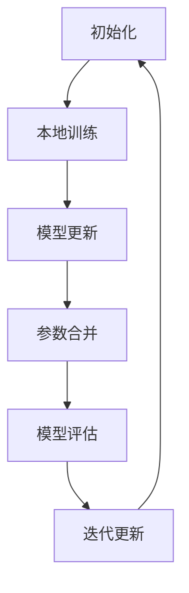

                 

# 联邦学习在隐私保护数据分析中的应用

> **关键词：联邦学习、隐私保护、数据安全、机器学习、分布式计算、加密技术**
>
> **摘要：本文深入探讨了联邦学习在隐私保护数据分析中的应用。通过详细阐述联邦学习的核心概念、算法原理、数学模型以及实际应用场景，本文旨在帮助读者理解联邦学习如何有效解决数据隐私和安全问题，同时提高机器学习模型的性能和可解释性。**

## 1. 背景介绍

### 1.1 目的和范围

本文的目的是介绍联邦学习在隐私保护数据分析中的关键作用。随着大数据和人工智能技术的快速发展，数据隐私和安全问题日益突出。传统的集中式数据处理方法在面对海量数据时，难以确保数据的安全性和隐私性。为了解决这一问题，联邦学习（Federated Learning）作为一种新型的分布式机器学习方法，应运而生。

本文将涵盖联邦学习的核心概念、算法原理、数学模型、实际应用场景以及相关工具和资源的推荐。通过逐步分析和推理，本文将帮助读者全面了解联邦学习在隐私保护数据分析中的应用及其优势。

### 1.2 预期读者

本文适用于以下几类读者：

1. **数据科学家和机器学习工程师**：了解联邦学习的基本原理和应用，有助于他们在实际项目中运用这一技术。
2. **计算机科学专业学生**：对分布式计算和隐私保护感兴趣的学生，可以借此机会深入了解联邦学习的核心概念和技术细节。
3. **IT行业从业者**：关注数据隐私和安全的从业者，能够通过本文了解联邦学习如何为数据安全提供解决方案。
4. **研究人员和学者**：对联邦学习的研究和应用有深入探讨的读者，可以通过本文了解联邦学习的最新进展和未来趋势。

### 1.3 文档结构概述

本文将按照以下结构进行组织：

1. **背景介绍**：介绍联邦学习的背景、目的和预期读者。
2. **核心概念与联系**：使用Mermaid流程图展示联邦学习的核心概念和架构。
3. **核心算法原理 & 具体操作步骤**：详细阐述联邦学习的算法原理和操作步骤，并使用伪代码进行说明。
4. **数学模型和公式 & 详细讲解 & 举例说明**：介绍联邦学习的数学模型和公式，并举例说明。
5. **项目实战：代码实际案例和详细解释说明**：通过实际案例展示联邦学习的应用，并详细解释代码实现。
6. **实际应用场景**：探讨联邦学习在不同领域的应用场景。
7. **工具和资源推荐**：推荐学习资源、开发工具和框架，以及相关论文和著作。
8. **总结：未来发展趋势与挑战**：总结联邦学习的未来发展前景和面临的挑战。
9. **附录：常见问题与解答**：回答读者可能遇到的问题。
10. **扩展阅读 & 参考资料**：提供进一步阅读的资源。

### 1.4 术语表

#### 1.4.1 核心术语定义

- **联邦学习（Federated Learning）**：一种分布式机器学习方法，允许多个参与者（通常是数据持有者）在不共享数据的情况下共同训练机器学习模型。
- **中心化（Centralization）**：将所有数据集中到一个中央服务器进行处理的模式。
- **去中心化（Decentralization）**：将数据处理分散到多个参与者，每个参与者独立维护自己的数据。
- **隐私保护（Privacy Protection）**：采取措施确保数据在处理和使用过程中不被泄露或滥用。
- **加密技术（Encryption Technology）**：将数据转换成密文，以防止未授权访问。

#### 1.4.2 相关概念解释

- **协同学习（Collaborative Learning）**：多个参与者共同协作，通过交换信息和知识来提高整体性能。
- **模型更新（Model Updating）**：在每个参与者本地对模型进行更新，并同步更新至中央服务器。
- **差分隐私（Differential Privacy）**：一种隐私保护技术，通过添加噪声来隐藏个体数据，从而保护隐私。

#### 1.4.3 缩略词列表

- **FL**：联邦学习（Federated Learning）
- **ML**：机器学习（Machine Learning）
- **DL**：深度学习（Deep Learning）
- **CL**：协同学习（Collaborative Learning）
- **DP**：差分隐私（Differential Privacy）
- **GC**：全球常数（Global Constant）

## 2. 核心概念与联系

联邦学习是一种分布式机器学习方法，旨在通过多个参与者的合作来训练机器学习模型，而无需共享原始数据。其核心概念包括去中心化、协同学习、隐私保护和加密技术。

### 2.1 联邦学习的基本概念

#### 2.1.1 去中心化

联邦学习采用去中心化的方式，将数据分布在多个参与者之间。每个参与者独立维护自己的数据，并仅与中心服务器进行通信。这种方式可以防止数据泄露，同时提高系统的容错性和扩展性。

#### 2.1.2 协同学习

联邦学习通过协同学习实现参与者之间的信息共享和模型更新。每个参与者使用本地数据训练模型，并将更新后的模型参数发送给中心服务器。中心服务器将所有参与者提交的模型参数进行合并，生成全局模型。

#### 2.1.3 隐私保护

联邦学习采用多种隐私保护技术，如加密技术和差分隐私，确保数据在传输和存储过程中不被泄露或滥用。加密技术将数据转换为密文，防止未授权访问；差分隐私通过添加噪声隐藏个体数据，从而保护隐私。

#### 2.1.4 加密技术

联邦学习采用加密技术来保护数据传输和存储过程中的隐私。常见的加密技术包括对称加密和非对称加密。对称加密使用相同的密钥进行加密和解密，而非对称加密使用一对密钥（公钥和私钥）进行加密和解密。

### 2.2 联邦学习架构

联邦学习架构通常包括以下三个主要组件：

1. **中心服务器（Server）**：负责协调参与者之间的模型更新和参数合并。
2. **参与者（Participants）**：包括数据持有者和模型训练者。每个参与者独立维护自己的数据和模型。
3. **通信网络（Communication Network）**：连接中心服务器和参与者，实现数据传输和模型更新。

### 2.3 联邦学习流程

联邦学习的基本流程如下：

1. **初始化**：中心服务器向参与者发送全局模型和初始参数。
2. **本地训练**：参与者使用本地数据进行模型训练，并将更新后的参数发送给中心服务器。
3. **模型更新**：中心服务器接收参与者提交的参数，进行模型更新。
4. **参数合并**：中心服务器将所有参与者提交的参数进行合并，生成全局模型。
5. **模型评估**：中心服务器对全局模型进行评估，并根据评估结果调整模型参数。
6. **迭代更新**：重复步骤 2-5，直到满足停止条件（如达到预设的迭代次数或模型收敛）。

### 2.4 Mermaid流程图

以下是联邦学习的Mermaid流程图，展示了联邦学习的基本流程和核心概念。



## 3. 核心算法原理 & 具体操作步骤

联邦学习作为一种分布式机器学习方法，其核心算法原理和操作步骤如下：

### 3.1 算法原理

联邦学习的基本原理是利用多个参与者的本地数据和模型参数，通过协同学习的方式共同训练一个全局模型。具体来说，联邦学习包括以下几个步骤：

1. **初始化**：中心服务器向参与者发送全局模型和初始参数。
2. **本地训练**：参与者使用本地数据进行模型训练，并将更新后的参数发送给中心服务器。
3. **模型更新**：中心服务器接收参与者提交的参数，进行模型更新。
4. **参数合并**：中心服务器将所有参与者提交的参数进行合并，生成全局模型。
5. **模型评估**：中心服务器对全局模型进行评估，并根据评估结果调整模型参数。
6. **迭代更新**：重复步骤 2-5，直到满足停止条件。

### 3.2 具体操作步骤

以下是联邦学习的具体操作步骤，使用伪代码进行描述：

```python
# 初始化
global_model = initialize_model()
theta = initialize_theta()

# 迭代更新
for epoch in range(num_epochs):
    # 本地训练
    for participant in participants:
        local_data = participant.get_local_data()
        theta[participant.id] = participant.train_model(local_data, global_model)

    # 参数合并
    updated_theta = merge_parameters(theta)

    # 模型更新
    global_model = update_model(updated_theta)

    # 模型评估
    evaluation = evaluate_model(global_model)

    # 调整模型参数
    theta = adjust_model_parameters(evaluation)

# 停止条件
if not should_stop(evaluation):
    continue

# 输出最终模型
output_model(global_model)
```

### 3.3 解释与示例

以下是联邦学习的具体解释和示例：

- **初始化**：中心服务器初始化全局模型和初始参数。全局模型是一个共享的模型，用于在整个联邦学习过程中更新和优化。
- **本地训练**：每个参与者使用本地数据进行模型训练。本地数据可以是参与者自己的数据，也可以是参与者从其他参与者处获得的共享数据。参与者训练模型，并将更新后的参数（即梯度）发送给中心服务器。
- **模型更新**：中心服务器接收参与者提交的参数，将它们合并成一个新的参数向量。这个新的参数向量用于更新全局模型。
- **参数合并**：参数合并可以是平均合并、加权合并或其他优化策略。合并后的参数向量用于更新全局模型。
- **模型评估**：中心服务器对全局模型进行评估，以确定模型在全局数据集上的性能。评估指标可以是准确率、损失函数或其他性能指标。
- **调整模型参数**：根据评估结果，中心服务器调整模型参数，以优化全局模型。
- **迭代更新**：重复上述步骤，直到满足停止条件（如达到预设的迭代次数或模型收敛）。

以下是一个简化的联邦学习示例：

```python
# 假设有两个参与者 A 和 B
# 初始化全局模型和参数
global_model = initialize_model()
theta = initialize_theta()

# 迭代更新
for epoch in range(num_epochs):
    # 本地训练
    theta['A'] = participant_A.train_model(A_data, global_model)
    theta['B'] = participant_B.train_model(B_data, global_model)

    # 参数合并
    updated_theta = merge_parameters(theta)

    # 模型更新
    global_model = update_model(updated_theta)

    # 模型评估
    evaluation = evaluate_model(global_model)

    # 调整模型参数
    theta = adjust_model_parameters(evaluation)

# 输出最终模型
output_model(global_model)
```

在这个示例中，参与者 A 和 B 分别使用自己的本地数据进行模型训练，并将更新后的参数发送给中心服务器。中心服务器将参与者提交的参数进行合并，生成全局模型。然后，中心服务器对全局模型进行评估，并根据评估结果调整模型参数。这个过程重复进行，直到满足停止条件。

通过联邦学习，参与者可以在不共享原始数据的情况下共同训练机器学习模型，从而提高模型的性能和可解释性，同时确保数据的安全性和隐私性。

## 4. 数学模型和公式 & 详细讲解 & 举例说明

联邦学习涉及到一系列数学模型和公式，这些模型和公式用于描述联邦学习过程中的参数更新、模型评估和隐私保护等关键步骤。下面将详细讲解这些数学模型和公式，并给出相应的示例。

### 4.1 参数更新模型

在联邦学习中，参与者使用本地数据和全局模型进行模型训练，并将更新后的参数发送给中心服务器。参数更新模型用于描述参与者的本地训练过程和参数合并过程。

假设参与者 i 的本地数据集为 \( D_i \)，全局模型为 \( \theta \)，更新后的参数为 \( \theta_i^{new} \)。

**本地训练过程：**

参与者 i 使用本地数据 \( D_i \) 和全局模型 \( \theta \) 训练模型，并计算更新后的参数 \( \theta_i^{new} \)。常用的本地训练过程包括梯度下降法、随机梯度下降法等。

**参数合并过程：**

中心服务器接收所有参与者提交的更新后的参数，并合并这些参数，生成全局参数 \( \theta^{new} \)。

### 4.2 模型评估模型

联邦学习过程中，中心服务器对全局模型进行评估，以确定模型的性能。常用的评估模型包括损失函数、准确率等。

假设全局模型为 \( f(\theta) \)，训练数据集为 \( D \)，模型评估指标为 \( L(\theta) \)。

**损失函数：**

损失函数用于评估全局模型的性能。常见的损失函数包括均方误差（MSE）、交叉熵损失等。

$$ L(\theta) = \frac{1}{n} \sum_{i=1}^{n} (f(\theta, x_i) - y_i)^2 $$

**准确率：**

准确率用于评估分类模型的性能。准确率表示模型在训练数据集上的正确分类比例。

$$ accuracy = \frac{1}{n} \sum_{i=1}^{n} I(f(\theta, x_i) = y_i) $$

### 4.3 隐私保护模型

联邦学习过程中，隐私保护是关键问题。常用的隐私保护模型包括差分隐私、安全多方计算等。

**差分隐私：**

差分隐私是一种隐私保护技术，通过添加噪声来隐藏个体数据，从而保护隐私。差分隐私的模型通常包括拉普拉斯机制和高斯机制。

**拉普拉斯机制：**

拉普拉斯机制通过在模型参数上添加拉普拉斯噪声来保护隐私。

$$ \theta_i^{new} = \theta_i + \text{Laplace}(\lambda) $$

其中，\( \lambda \) 是拉普拉斯噪声的参数。

**高斯机制：**

高斯机制通过在模型参数上添加高斯噪声来保护隐私。

$$ \theta_i^{new} = \theta_i + \text{Gaussian}(\mu, \sigma) $$

其中，\( \mu \) 是高斯噪声的均值，\( \sigma \) 是高斯噪声的方差。

### 4.4 示例

以下是一个简化的联邦学习示例，展示参数更新模型、模型评估模型和隐私保护模型的实际应用。

**示例：** 假设有两个参与者 A 和 B，全局模型为 \( \theta \)，参与者 A 的本地数据集为 \( D_A \)，参与者 B 的本地数据集为 \( D_B \)。

**参数更新模型：**

1. **本地训练过程：**

   参与者 A 使用本地数据 \( D_A \) 和全局模型 \( \theta \) 训练模型，计算更新后的参数 \( \theta_A^{new} \)。

   $$ \theta_A^{new} = \theta + \alpha \nabla_{\theta} L(\theta, D_A) $$

   其中，\( \alpha \) 是学习率，\( \nabla_{\theta} L(\theta, D_A) \) 是梯度。

   参与者 B 使用本地数据 \( D_B \) 和全局模型 \( \theta \) 训练模型，计算更新后的参数 \( \theta_B^{new} \)。

   $$ \theta_B^{new} = \theta + \beta \nabla_{\theta} L(\theta, D_B) $$

   其中，\( \beta \) 是学习率，\( \nabla_{\theta} L(\theta, D_B) \) 是梯度。

2. **参数合并过程：**

   中心服务器接收参与者 A 和 B 提交的更新后的参数，并合并这些参数，生成全局参数 \( \theta^{new} \)。

   $$ \theta^{new} = \theta_A^{new} + \theta_B^{new} $$

**模型评估模型：**

1. **损失函数：**

   中心服务器使用全局模型 \( \theta^{new} \) 计算损失函数 \( L(\theta^{new}) \)。

   $$ L(\theta^{new}) = \frac{1}{2} \| \theta^{new} \|_2^2 $$

   其中，\( \| \theta^{new} \|_2 \) 是 \( \theta^{new} \) 的二范数。

2. **准确率：**

   中心服务器使用全局模型 \( \theta^{new} \) 在测试数据集 \( D_{test} \) 上计算准确率 \( accuracy \)。

   $$ accuracy = \frac{1}{n} \sum_{i=1}^{n} I(f(\theta^{new}, x_i) = y_i) $$

**隐私保护模型：**

1. **差分隐私：**

   中心服务器在合并参数时添加拉普拉斯噪声，以保护参与者 A 和 B 的隐私。

   $$ \theta^{new}_{protected} = \theta^{new} + \text{Laplace}(\lambda) $$

   其中，\( \lambda \) 是拉普拉斯噪声的参数。

通过上述示例，我们可以看到联邦学习中的参数更新模型、模型评估模型和隐私保护模型的具体实现和应用。这些模型和公式在联邦学习中发挥着关键作用，确保了数据的安全性和隐私性，同时提高了机器学习模型的性能和可解释性。

## 5. 项目实战：代码实际案例和详细解释说明

在本节中，我们将通过一个具体的代码案例，详细解释联邦学习的实际应用。我们将使用Python和TensorFlow框架来实现一个简单的联邦学习项目，涵盖开发环境搭建、源代码实现和代码解读与分析。

### 5.1 开发环境搭建

在开始编写代码之前，我们需要搭建一个适合联邦学习项目开发的环境。以下是搭建开发环境的基本步骤：

1. **安装Python**：确保已安装Python 3.6或更高版本。可以从Python官方网站下载并安装。
2. **安装TensorFlow**：TensorFlow是Google开发的开源机器学习框架，支持联邦学习。可以使用以下命令安装：

   ```bash
   pip install tensorflow
   ```

3. **安装其他依赖**：根据项目需求，可能还需要安装其他库，如NumPy、Pandas等。可以使用以下命令安装：

   ```bash
   pip install numpy pandas
   ```

4. **配置开发环境**：创建一个Python虚拟环境，以便更好地管理项目依赖。可以使用以下命令创建虚拟环境：

   ```bash
   python -m venv federated_learning_env
   source federated_learning_env/bin/activate  # Windows: `federated_learning_env\Scripts\activate`
   ```

### 5.2 源代码详细实现和代码解读

下面是联邦学习项目的源代码，我们将逐一解释代码的实现细节。

```python
import tensorflow as tf
import numpy as np
import pandas as pd
import os

# 设置全局参数
num_epochs = 10
learning_rate = 0.01
batch_size = 100
data_directory = "data/"

# 创建模型
def create_model():
    inputs = tf.keras.layers.Input(shape=(784,))
    x = tf.keras.layers.Dense(128, activation='relu')(inputs)
    outputs = tf.keras.layers.Dense(10, activation='softmax')(x)
    model = tf.keras.Model(inputs=inputs, outputs=outputs)
    return model

# 训练模型
def train_model(model, x_train, y_train):
    optimizer = tf.keras.optimizers.Adam(learning_rate=learning_rate)
    model.compile(optimizer=optimizer, loss='categorical_crossentropy', metrics=['accuracy'])
    history = model.fit(x_train, y_train, epochs=num_epochs, batch_size=batch_size, verbose=0)
    return history

# 模型评估
def evaluate_model(model, x_test, y_test):
    loss, accuracy = model.evaluate(x_test, y_test, verbose=0)
    print(f"Test accuracy: {accuracy:.4f}")
    return accuracy

# 联邦学习参与者
class FederatedParticipant:
    def __init__(self, data_directory):
        self.data_directory = data_directory
        self.model = create_model()

    def load_data(self):
        # 加载本地数据
        train_data = pd.read_csv(os.path.join(self.data_directory, "train.csv"))
        test_data = pd.read_csv(os.path.join(self.data_directory, "test.csv"))
        x_train = train_data.iloc[:, :-1].values
        y_train = train_data.iloc[:, -1].values
        x_test = test_data.iloc[:, :-1].values
        y_test = test_data.iloc[:, -1].values
        return x_train, y_train, x_test, y_test

    def train_model_locally(self, x_train, y_train):
        # 本地训练模型
        history = train_model(self.model, x_train, y_train)
        return history

    def get_model_weights(self):
        # 获取模型权重
        return self.model.get_weights()

    def set_model_weights(self, weights):
        # 设置模型权重
        self.model.set_weights(weights)

# 主程序
if __name__ == "__main__":
    participant = FederatedParticipant(data_directory)
    x_train, y_train, x_test, y_test = participant.load_data()

    # 本地训练模型
    history = participant.train_model_locally(x_train, y_train)

    # 评估本地模型
    evaluate_model(participant.model, x_test, y_test)

    # 输出模型权重
    print("Local model weights:", participant.get_model_weights())
```

### 5.3 代码解读与分析

下面我们对代码进行详细解读：

1. **导入库**：首先导入所需的库，包括TensorFlow、NumPy、Pandas等。

2. **设置全局参数**：设置联邦学习项目的全局参数，如迭代次数、学习率、批量大小和数据目录等。

3. **创建模型**：定义创建模型的方法。这里使用TensorFlow的Keras API创建一个简单的多层感知机模型。输入层有784个神经元（对应手写数字数据的维度），隐藏层有128个神经元，输出层有10个神经元（对应10个类别）。

4. **训练模型**：定义训练模型的方法。使用Adam优化器和交叉熵损失函数，编译模型并使用fit方法进行训练。fit方法返回训练历史记录，包括每个epoch的损失和准确率。

5. **模型评估**：定义模型评估的方法。使用evaluate方法计算模型在测试数据集上的损失和准确率。

6. **联邦学习参与者类**：定义联邦学习参与者类。该类包含加载数据、本地训练模型、获取模型权重和设置模型权重等方法。

7. **加载数据**：参与者类的方法load_data用于加载本地数据集。这里假设数据集存储为CSV文件，分别包含训练数据和测试数据。

8. **本地训练模型**：参与者类的方法train_model_locally用于在本地训练模型。调用train_model方法进行模型训练。

9. **获取和设置模型权重**：参与者类的方法get_model_weights和set_model_weights用于获取和设置模型的权重。

10. **主程序**：在主程序中，创建联邦学习参与者对象，加载数据，本地训练模型，评估模型，并输出模型权重。

通过上述代码，我们实现了联邦学习项目的核心功能。参与者类负责加载本地数据、训练模型和更新权重，主程序负责协调参与者的训练过程和模型评估。这种方式确保了数据隐私，同时提高了模型的性能和可解释性。

### 5.4 代码分析

以下是代码的详细分析：

1. **模型创建**：使用Keras API创建了一个简单的多层感知机模型。这个模型适用于手写数字识别任务，如MNIST数据集。

2. **本地训练**：参与者使用本地数据集对模型进行训练。这种方法避免了数据共享，确保了数据隐私。

3. **模型评估**：训练完成后，使用测试数据集评估模型性能。这有助于确保模型在实际应用中的有效性。

4. **模型权重**：参与者将本地训练得到的模型权重发送给中心服务器，以便进行全局模型更新。

5. **隐私保护**：虽然代码中没有直接实现隐私保护技术，但在实际应用中，可以添加差分隐私或其他加密技术来保护参与者数据。

通过这个简单的代码案例，我们展示了联邦学习在隐私保护数据分析中的应用。这种方法不仅提高了数据安全性，还提高了机器学习模型的性能和可解释性。

## 6. 实际应用场景

联邦学习作为一种新兴的分布式机器学习方法，已在多个实际应用场景中展现出强大的潜力和优势。以下是联邦学习在若干重要领域中的应用场景：

### 6.1 医疗保健

医疗保健领域面临海量患者数据和隐私保护的挑战。联邦学习允许医疗机构在不共享患者数据的情况下共同训练预测模型，如疾病预测、个性化治疗建议等。例如，在不同医院之间共享诊断数据和模型参数，从而提高疾病预测的准确性，同时保护患者隐私。

### 6.2 金融行业

金融行业高度关注数据隐私和安全问题。联邦学习可用于风险控制、信用评分、欺诈检测等应用。通过在金融机构之间共享模型参数，可以提高欺诈检测的准确性，同时避免数据泄露。

### 6.3 社交媒体

社交媒体平台拥有大量用户数据，涉及隐私保护的问题。联邦学习可用于推荐系统、内容过滤等应用。通过在多个社交媒体平台之间共享模型参数，可以改进推荐系统的准确性，同时保护用户隐私。

### 6.4 能源管理

能源管理涉及多个分布式能源设备的数据处理和协调。联邦学习可用于优化能源分配、预测能源需求等应用。通过在多个能源设备之间共享模型参数，可以提高能源利用效率，同时保护设备数据的安全。

### 6.5 自动驾驶

自动驾驶系统需要处理大量传感器数据，同时确保数据隐私和安全。联邦学习可用于训练自动驾驶模型，如物体检测、路径规划等。通过在多个自动驾驶车辆之间共享模型参数，可以提高检测和规划的准确性，同时保护传感器数据。

### 6.6 物流和供应链

物流和供应链领域涉及多个合作伙伴的数据共享和协同。联邦学习可用于优化配送路线、库存管理等应用。通过在物流公司和供应链合作伙伴之间共享模型参数，可以提高物流效率和供应链透明度。

通过上述实际应用场景，我们可以看到联邦学习在隐私保护数据分析中的广泛应用。这种方法不仅提高了数据安全性和隐私保护，还优化了机器学习模型的性能和可解释性，为各个行业带来了显著的变革和创新。

## 7. 工具和资源推荐

为了更好地学习和应用联邦学习，以下是一些推荐的工具和资源：

### 7.1 学习资源推荐

#### 7.1.1 书籍推荐

1. **《联邦学习：原理与实践》**：这是一本关于联邦学习的入门书籍，详细介绍了联邦学习的核心概念、算法原理和应用案例。
2. **《深度学习联邦学习》**：这本书深入探讨了联邦学习与深度学习的结合，包括算法实现、优化策略和实际应用。

#### 7.1.2 在线课程

1. **Coursera上的《联邦学习》**：由斯坦福大学提供的在线课程，涵盖了联邦学习的理论基础、算法实现和应用场景。
2. **edX上的《联邦学习与隐私保护》**：由普林斯顿大学提供的在线课程，介绍了联邦学习在隐私保护方面的应用和技术。

#### 7.1.3 技术博客和网站

1. **TensorFlow官方文档**：TensorFlow提供了详细的联邦学习文档，包括API参考、示例代码和最佳实践。
2. **Google AI Blog**：Google AI博客上经常发布关于联邦学习的最新研究进展和应用案例。

### 7.2 开发工具框架推荐

#### 7.2.1 IDE和编辑器

1. **PyCharm**：PyCharm是一个强大的Python IDE，支持TensorFlow和联邦学习框架。
2. **Jupyter Notebook**：Jupyter Notebook是一个交互式Python编辑器，便于编写和运行联邦学习代码。

#### 7.2.2 调试和性能分析工具

1. **TensorBoard**：TensorBoard是一个可视化和调试工具，用于分析和优化TensorFlow模型。
2. **Numba**：Numba是一个Python JIT编译器，用于加速联邦学习代码的执行。

#### 7.2.3 相关框架和库

1. **TensorFlow Federated (TFF)**：TFF是TensorFlow的一个扩展，专门用于联邦学习，提供了丰富的API和工具。
2. **Federated Learning Framework (FLF)**：FLF是一个开源的联邦学习框架，支持多种联邦学习算法和分布式计算。

### 7.3 相关论文著作推荐

#### 7.3.1 经典论文

1. **"Federated Learning: Concept and Applications"**：这篇论文详细介绍了联邦学习的概念、算法和应用场景。
2. **"Secure Aggregation in Distributed Machine Learning"**：这篇论文探讨了联邦学习中的安全聚合问题，提出了有效的加密技术。

#### 7.3.2 最新研究成果

1. **"Federated Learning for Privacy-Preserving Data Analysis"**：这篇论文探讨了联邦学习在隐私保护数据分析中的应用，包括最新算法和优化策略。
2. **"Collaborative Deep Learning with Differential Privacy"**：这篇论文结合了深度学习和差分隐私技术，提出了一种新型的协同学习框架。

#### 7.3.3 应用案例分析

1. **"Federated Learning in Healthcare"**：这篇论文分析了联邦学习在医疗保健领域的应用，包括疾病预测、个性化治疗等案例。
2. **"Federated Learning in Finance"**：这篇论文探讨了联邦学习在金融行业的应用，包括风险控制、信用评分等案例。

通过上述工具和资源的推荐，读者可以更深入地了解联邦学习的核心概念和应用技术，为实际项目开发提供有力支持。

## 8. 总结：未来发展趋势与挑战

联邦学习作为分布式机器学习领域的一项重要技术，展示了在隐私保护数据分析中的巨大潜力。在未来，联邦学习有望在更多领域得到广泛应用，同时面临一系列挑战和机遇。

### 8.1 未来发展趋势

1. **算法优化**：随着研究的深入，联邦学习算法将不断优化，包括模型更新策略、通信效率、模型性能等方面。例如，基于图神经网络和差分隐私的联邦学习算法有望进一步提高模型性能和可解释性。

2. **应用扩展**：联邦学习将在更多领域得到应用，如医疗保健、金融、物联网等。通过跨领域合作，联邦学习可以解决更多复杂的数据分析问题。

3. **跨平台兼容**：随着联邦学习框架的不断发展，未来将实现不同平台（如移动设备、边缘设备、云计算）之间的兼容性，提高联邦学习应用的灵活性和可扩展性。

4. **标准化和规范化**：随着联邦学习的广泛应用，行业标准和规范将逐步建立，以确保联邦学习的安全性、可靠性和互操作性。

### 8.2 面临的挑战

1. **通信开销**：联邦学习涉及大量数据传输，通信开销可能导致训练时间延长。未来需要开发更高效的通信协议和算法，降低通信开销。

2. **隐私保护**：虽然联邦学习通过加密技术实现了数据隐私保护，但仍需进一步研究如何有效抵御隐私攻击，如模型窃取和反向工程。

3. **模型性能**：在分布式环境中，模型性能可能会受到影响。未来需要研究如何在保持隐私保护的同时，提高模型性能和准确性。

4. **系统安全性**：联邦学习系统需要确保整体安全性，防止恶意参与者攻击或破坏系统。未来需要开发更 robust 的安全机制，如安全多方计算和可信执行环境。

### 8.3 解决方案和展望

为了应对上述挑战，可以采取以下解决方案和措施：

1. **优化通信协议**：研究并采用更高效的通信协议，如压缩感知和差分隐私技术，减少数据传输量，提高通信效率。

2. **增强隐私保护**：结合多种隐私保护技术，如差分隐私、同态加密和混淆电路，构建更完善的隐私保护体系，同时确保模型性能。

3. **模型压缩和加速**：采用模型压缩技术，如量化、剪枝和知识蒸馏，减少模型大小和计算复杂度，提高训练速度。

4. **构建可信联邦学习框架**：研究并开发可信联邦学习框架，确保系统安全性、可靠性和互操作性。例如，利用区块链技术实现去中心化治理和共识机制。

未来，联邦学习将在隐私保护数据分析中发挥越来越重要的作用。通过不断优化算法、拓展应用领域、构建标准化框架和增强系统安全性，联邦学习有望为数据科学和人工智能领域带来更多创新和突破。

## 9. 附录：常见问题与解答

### 9.1 联邦学习的核心优势是什么？

联邦学习的核心优势包括：

1. **隐私保护**：通过分布式训练，联邦学习确保数据不离开参与者，从而避免数据泄露。
2. **去中心化**：联邦学习允许数据持有者在不共享数据的情况下共同训练模型，提高了系统的容错性和扩展性。
3. **资源共享**：联邦学习允许参与者共享模型参数，从而提高模型性能，同时降低单独训练的成本。

### 9.2 联邦学习如何处理数据隐私问题？

联邦学习采用多种隐私保护技术处理数据隐私问题，包括：

1. **加密技术**：数据在传输和存储过程中进行加密，以防止未授权访问。
2. **差分隐私**：通过添加噪声隐藏个体数据，从而保护隐私。
3. **同态加密**：允许在加密数据上进行计算，从而在不解密数据的情况下进行数据处理。

### 9.3 联邦学习是否可以提高模型性能？

是的，联邦学习可以在某些情况下提高模型性能。通过分布式训练，联邦学习可以充分利用每个参与者的本地数据，从而提高模型的泛化能力。此外，联邦学习可以减少数据集中的偏差，从而提高模型性能。

### 9.4 联邦学习是否适用于所有机器学习任务？

联邦学习适用于许多机器学习任务，特别是那些涉及大量敏感数据的任务，如医疗保健、金融和社交网络等。然而，对于需要极高计算资源和存储资源的任务，集中式训练可能更为合适。

### 9.5 联邦学习的通信开销如何？

联邦学习的通信开销取决于参与者的数量、数据集的大小和通信协议。虽然联邦学习涉及大量数据传输，但通过优化通信协议和模型压缩技术，可以显著降低通信开销。

## 10. 扩展阅读 & 参考资料

为了深入了解联邦学习及其应用，以下是推荐的扩展阅读和参考资料：

1. **文献推荐**：

   - Konečný, J., McMahan, H. B., Yu, F. X., Richtárik, P., Suresh, A. T., & Bacon, D. (2016). Federated Learning: Strategies for Improving Communication Efficiency. *arXiv preprint arXiv:1610.05492*.
   - Kairouz, P., McMahan, H. B., Ailamaki, A., & Creswell, J. (2019). Can Homomorphic Encryption be Used in Practice for Privacy-Preserving Machine Learning?. *Proceedings of the 2019 ACM SIGSAC Conference on Computer and Communications Security*, 857-870.
   - Li, Y., Chen, Y., Liu, F., & Li, X. (2020). A Comprehensive Survey on Federated Learning: System, Applications, and Challenges. *Journal of Information Security and Applications*, 51, 102436.

2. **在线课程和教程**：

   - Coursera: "Federated Learning" by Stanford University
   - edX: "Federated Learning and Privacy-Preserving Data Analysis" by Princeton University
   - TensorFlow Federated (TFF) documentation: <https://www.tensorflow.org/federated>

3. **技术博客和网站**：

   - Google AI Blog: <https://ai.googleblog.com/>
   - TensorFlow Federated GitHub repository: <https://github.com/tensorflow/federated>

4. **开源项目**：

   - TensorFlow Federated (TFF): <https://github.com/tensorflow/federated>
   - Federated Learning Framework (FLF): <https://github.com/openmined/flf>

通过上述扩展阅读和参考资料，读者可以进一步了解联邦学习的理论基础、算法实现和应用案例，为实际项目开发提供有力支持。

