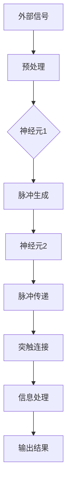

                 

# 脉冲神经网络的研究前景

> **关键词**：脉冲神经网络、研究前景、核心算法、数学模型、实际应用
> 
> **摘要**：本文深入探讨了脉冲神经网络（Spiking Neural Networks, SNNs）的研究前景。首先，文章介绍了脉冲神经网络的基本概念和背景，然后详细讲解了其核心算法原理和数学模型，并通过实际案例展示了其应用场景。最后，文章总结了脉冲神经网络的发展趋势与挑战，并推荐了相关学习资源与工具。

## 1. 背景介绍

### 1.1 目的和范围

本文旨在探讨脉冲神经网络的研究前景，分析其核心算法原理、数学模型及其在实际应用中的价值。通过对脉冲神经网络的深入研究，我们希望能够为读者提供对该领域全面而深入的认知，激发对这一前沿技术的兴趣和探索。

### 1.2 预期读者

本文主要面向对人工智能、神经网络和计算模型有基本了解的读者，包括研究人员、开发者和对这一领域感兴趣的学者。同时，对于希望深入了解脉冲神经网络的应用潜力和未来发展趋势的读者，本文也将提供有价值的参考。

### 1.3 文档结构概述

本文结构如下：

1. **背景介绍**：介绍脉冲神经网络的基本概念、研究背景及其重要性。
2. **核心概念与联系**：阐述脉冲神经网络的核心概念及其与其他神经网络的联系。
3. **核心算法原理 & 具体操作步骤**：详细讲解脉冲神经网络的核心算法原理和具体操作步骤。
4. **数学模型和公式 & 详细讲解 & 举例说明**：介绍脉冲神经网络的数学模型和公式，并通过实例进行说明。
5. **项目实战：代码实际案例和详细解释说明**：通过实际项目案例展示脉冲神经网络的实现和应用。
6. **实际应用场景**：探讨脉冲神经网络的实际应用场景和优势。
7. **工具和资源推荐**：推荐学习资源、开发工具和相关论文著作。
8. **总结：未来发展趋势与挑战**：总结脉冲神经网络的发展趋势与面临的挑战。
9. **附录：常见问题与解答**：回答读者可能遇到的一些常见问题。
10. **扩展阅读 & 参考资料**：提供进一步学习和研究的参考资料。

### 1.4 术语表

#### 1.4.1 核心术语定义

- **脉冲神经网络（Spiking Neural Networks, SNNs）**：一种模拟真实生物神经元的计算模型，通过处理和时间相关的信号传输信息。
- **神经元**：脉冲神经网络的基本计算单元，能够接收外部信号并产生脉冲响应。
- **突触**：神经元之间的连接点，用于传递信号。
- **同步性**：神经元在特定时间点同时发生脉冲响应的特性。
- **异步性**：神经元在非特定时间点发生脉冲响应的特性。
- **时间编码**：利用时间间隔来编码信息的一种机制。

#### 1.4.2 相关概念解释

- **神经网络**：由大量相互连接的神经元组成的计算模型，用于处理复杂数据和任务。
- **人工神经网络**：模拟人脑神经元连接和功能的人工智能系统。
- **深度学习**：基于多层神经网络的一种机器学习方法，通过多层非线性变换来提取数据特征。
- **神经编码**：将外部信号转换为神经元活动的过程。

#### 1.4.3 缩略词列表

- **SNNs**：脉冲神经网络（Spiking Neural Networks）
- **ANNs**：人工神经网络（Artificial Neural Networks）
- **DNNs**：深度神经网络（Deep Neural Networks）
- **CNNs**：卷积神经网络（Convolutional Neural Networks）
- **RNNs**：循环神经网络（Recurrent Neural Networks）
- **GANs**：生成对抗网络（Generative Adversarial Networks）

## 2. 核心概念与联系

### 2.1 脉冲神经网络的基本概念

脉冲神经网络（SNNs）是一种模拟生物神经元计算特性的神经网络模型。它通过处理和时间相关的信号传输信息，实现了对动态环境的响应和处理。与传统的神经网络不同，SNNs具有以下特点：

- **异步性**：神经元在非特定时间点发生脉冲响应，而不是同时发生。
- **时间编码**：信息通过时间间隔进行编码，而不是像传统神经网络那样通过权重编码。
- **高效性**：通过减少同步脉冲的产生，SNNs能够在较低能耗下实现高效信息处理。

### 2.2 脉冲神经网络与人工神经网络的联系

脉冲神经网络是人工神经网络（ANNs）的一种特殊形式，它继承了ANNs的基本结构和计算原理。然而，SNNs在计算机制和功能上与传统的ANNs存在显著差异：

- **计算机制**：SNNs通过时间相关的信号传输和处理来实现信息传递，而ANNs则通过权重和偏置来实现。
- **信息编码**：SNNs利用时间间隔进行信息编码，而ANNs利用权重和偏置来编码信息。
- **功能差异**：SNNs在处理动态环境和实时任务方面具有独特优势，而ANNs在处理静态数据和静态任务方面表现更好。

### 2.3 脉冲神经网络与深度神经网络的联系

深度神经网络（DNNs）是ANNs的一种扩展，它通过增加神经网络层数来提高模型复杂度和表现能力。脉冲神经网络可以被视为深度神经网络的一种特殊形式，它通过模拟生物神经元的计算特性来实现更高效的信息处理：

- **计算效率**：SNNs通过减少同步脉冲的产生，实现了高效的信息处理，从而降低了能耗。
- **动态响应**：SNNs能够更好地处理动态环境和实时任务，而传统的DNNs在处理动态数据时可能存在延迟。
- **生物启发**：SNNs的设计灵感来源于生物神经系统的计算机制，使得它在某些特定任务上具有更好的性能。

### 2.4 脉冲神经网络的架构

脉冲神经网络的架构可以分为三个主要部分：神经元、突触和连接结构。

#### 2.4.1 神经元

神经元是脉冲神经网络的基本计算单元，它能够接收外部信号并产生脉冲响应。神经元通常具有以下特性：

- **阈值**：神经元在接收信号时，只有当信号强度超过特定阈值时才会产生脉冲响应。
- **时间依赖性**：神经元产生的脉冲响应具有时间依赖性，即脉冲发生的时间与接收到的信号强度和时间有关。
- **状态变化**：神经元的状态可以分为静息状态和激活状态，激活状态表示神经元产生了脉冲响应。

#### 2.4.2 突触

突触是神经元之间的连接点，用于传递信号。在脉冲神经网络中，突触通常具有以下特性：

- **传递延迟**：信号在突触之间的传递存在延迟，这个延迟反映了突触传输信号的物理特性。
- **传递强度**：突触传递信号的强度与突触的连接权重有关，连接权重反映了神经元之间的关联程度。
- **同步性**：突触在传递信号时可以表现出同步性，即多个突触在同一时间点传递信号。

#### 2.4.3 连接结构

连接结构是脉冲神经网络中神经元和突触的连接方式。在脉冲神经网络中，连接结构通常具有以下特性：

- **动态可塑性**：连接结构可以根据外部信号的变化进行自适应调整，从而实现学习功能。
- **稀疏性**：连接结构通常表现出稀疏性，即只有部分神经元之间存在连接，这样可以降低计算复杂度和能耗。
- **时间依赖性**：连接结构的权重和连接方式可以受到时间的影响，从而实现时间编码功能。

### 2.5 脉冲神经网络的流程图

为了更好地理解脉冲神经网络的架构和工作流程，我们可以使用Mermaid流程图来表示其基本组件和连接方式。以下是一个简单的脉冲神经网络流程图的示例：



在这个流程图中，外部信号经过预处理后传递给神经元1，神经元1产生脉冲响应并传递给神经元2，神经元2通过突触连接进行脉冲传递和信息处理，最后生成输出结果。

## 3. 核心算法原理 & 具体操作步骤

### 3.1 脉冲神经网络的工作原理

脉冲神经网络（SNNs）通过模拟真实生物神经元的计算特性来实现信息处理和决策。SNNs的基本工作原理如下：

1. **信号接收与预处理**：外部信号（如图像、声音、传感器数据等）首先经过预处理，以便神经元能够接收和处理。
2. **神经元激活与脉冲生成**：神经元接收预处理后的信号，并判断是否超过阈值。如果信号强度超过阈值，神经元将产生脉冲响应。
3. **脉冲传递与突触连接**：产生的脉冲响应通过突触连接传递给其他神经元，每个突触连接具有特定的传递延迟和传递强度。
4. **信息处理与决策**：接收到的脉冲响应在神经元内部进行整合和处理，最终生成输出结果。

### 3.2 脉冲神经网络的算法步骤

以下是脉冲神经网络的基本算法步骤：

1. **初始化**：
   - 设定神经元的阈值、突触的传递延迟和传递强度。
   - 初始化神经元的状态和连接结构。

2. **信号接收与预处理**：
   - 对外部信号进行预处理，如归一化、特征提取等。
   - 将预处理后的信号传递给神经元。

3. **神经元激活与脉冲生成**：
   - 对每个神经元，计算其接收到的信号强度。
   - 如果信号强度超过阈值，则产生脉冲响应。

4. **脉冲传递与突触连接**：
   - 根据突触的传递延迟和传递强度，将脉冲响应传递给其他神经元。
   - 更新每个神经元的输入信号。

5. **信息处理与决策**：
   - 对接收到的脉冲响应进行整合和处理。
   - 根据处理结果生成输出结果。

6. **迭代与学习**：
   - 根据输出结果与预期结果的差异，更新神经元的阈值和突触连接权重。
   - 重复上述步骤，直至达到预期的性能指标。

### 3.3 脉冲神经网络的伪代码实现

以下是脉冲神经网络的基本伪代码实现：

```python
# 初始化
初始化神经元阈值、突触传递延迟和传递强度
初始化神经元状态和连接结构

# 循环迭代
while 没有达到性能指标：
    # 信号接收与预处理
    预处理外部信号
    传递预处理后的信号给神经元

    # 神经元激活与脉冲生成
    对每个神经元：
        计算接收到的信号强度
        如果信号强度超过阈值：
            产生脉冲响应

    # 脉冲传递与突触连接
    对每个突触：
        根据传递延迟和传递强度，传递脉冲响应给其他神经元

    # 信息处理与决策
    对每个神经元：
        对接收到的脉冲响应进行整合和处理
        根据处理结果生成输出结果

    # 迭代与学习
    根据输出结果与预期结果的差异，更新神经元阈值和突触连接权重

# 输出最终结果
输出处理结果
```

## 4. 数学模型和公式 & 详细讲解 & 举例说明

### 4.1 脉冲神经网络的基本数学模型

脉冲神经网络（SNNs）的数学模型主要涉及以下几个方面：

1. **神经元激活函数**：用于判断神经元是否产生脉冲响应。
2. **突触传递函数**：用于描述脉冲在突触之间的传递特性。
3. **信息处理与决策函数**：用于对脉冲响应进行整合和处理。

### 4.2 神经元激活函数

神经元激活函数是脉冲神经网络的核心组件，用于判断神经元是否产生脉冲响应。常见的神经元激活函数包括：

- **Heaviside 函数**：用于将输入信号转换为二值输出，即大于零的输入信号输出1，小于零的输入信号输出0。
- **Sigmoid 函数**：用于将输入信号转换为介于0和1之间的连续值，通常用于神经元激活函数。

```latex
H(x) = \begin{cases} 
1 & \text{if } x > 0 \\
0 & \text{if } x \leq 0 
\end{cases}
```

### 4.3 突触传递函数

突触传递函数用于描述脉冲在突触之间的传递特性。常见的突触传递函数包括：

- **线性传递函数**：将输入脉冲响应直接传递给其他神经元，不进行任何变换。
- **指数传递函数**：将输入脉冲响应进行指数变换，以模拟生物神经元的传递特性。

```latex
f(x) = e^{-\lambda x}
```

其中，$\lambda$ 是传递函数的参数，用于调整传递强度。

### 4.4 信息处理与决策函数

信息处理与决策函数用于对脉冲响应进行整合和处理，以生成输出结果。常见的决策函数包括：

- **最大值函数**：选择脉冲响应中的最大值作为输出结果。
- **平均函数**：计算脉冲响应的平均值作为输出结果。

```latex
g(x) = \frac{1}{n} \sum_{i=1}^{n} x_i
```

其中，$x_i$ 是每个脉冲响应的值，$n$ 是脉冲响应的数量。

### 4.5 举例说明

假设我们有一个简单的脉冲神经网络，包含两个神经元和两个突触。输入信号为 $x_1 = 2$ 和 $x_2 = 3$，阈值分别为 $0.5$ 和 $0.6$。

#### 4.5.1 神经元激活

对于神经元1，计算其输入信号强度为 $x_1 = 2$，阈值 $\theta_1 = 0.5$。由于 $x_1 > \theta_1$，神经元1产生脉冲响应。

对于神经元2，计算其输入信号强度为 $x_2 = 3$，阈值 $\theta_2 = 0.6$。由于 $x_2 > \theta_2$，神经元2也产生脉冲响应。

#### 4.5.2 突触传递

假设突触1的传递延迟为 $\tau_1 = 0.1$，传递强度为 $\lambda_1 = 0.8$。突触2的传递延迟为 $\tau_2 = 0.2$，传递强度为 $\lambda_2 = 0.6$。

对于神经元1产生的脉冲响应，经过突触1传递给神经元2。传递延迟为 $\tau_1 = 0.1$，传递强度为 $\lambda_1 = 0.8$，所以传递后的脉冲响应为 $f_1 = e^{-0.8 \times 0.1} = 0.944$。

对于神经元2产生的脉冲响应，经过突触2传递给神经元1。传递延迟为 $\tau_2 = 0.2$，传递强度为 $\lambda_2 = 0.6$，所以传递后的脉冲响应为 $f_2 = e^{-0.6 \times 0.2} = 0.864$。

#### 4.5.3 信息处理与决策

对于神经元1接收到的两个脉冲响应 $f_1$ 和 $f_2$，计算其最大值作为输出结果。由于 $f_1 > f_2$，输出结果为 $g(f_1, f_2) = f_1 = 0.944$。

对于神经元2接收到的两个脉冲响应 $f_1$ 和 $f_2$，计算其平均值作为输出结果。输出结果为 $g(f_1, f_2) = \frac{f_1 + f_2}{2} = \frac{0.944 + 0.864}{2} = 0.905$。

通过这个简单的例子，我们可以看到脉冲神经网络的数学模型和计算过程。在实际应用中，脉冲神经网络的数学模型可以根据具体任务和需求进行灵活调整和优化。

## 5. 项目实战：代码实际案例和详细解释说明

### 5.1 开发环境搭建

在本项目中，我们将使用Python和PyTorch框架来构建和训练脉冲神经网络。以下是搭建开发环境所需的步骤：

1. 安装Python 3.8或更高版本。
2. 安装PyTorch框架。可以使用以下命令安装：
   ```bash
   pip install torch torchvision
   ```
3. 安装其他依赖库，如NumPy、SciPy等：
   ```bash
   pip install numpy scipy
   ```

### 5.2 源代码详细实现和代码解读

以下是一个简单的脉冲神经网络实现示例，用于手写数字识别任务。代码主要分为以下部分：

1. **数据预处理**：读取和预处理MNIST手写数字数据集。
2. **模型定义**：定义脉冲神经网络模型。
3. **训练过程**：使用训练数据集训练模型。
4. **评估过程**：使用测试数据集评估模型性能。

#### 5.2.1 数据预处理

```python
import torch
import torchvision
import torchvision.transforms as transforms

# 读取MNIST手写数字数据集
train_data = torchvision.datasets.MNIST(
    root='./data',
    train=True,
    transform=transforms.ToTensor(),
    download=True
)

test_data = torchvision.datasets.MNIST(
    root='./data',
    train=False,
    transform=transforms.ToTensor()
)

# 定义数据加载器
batch_size = 64
train_loader = torch.utils.data.DataLoader(train_data, batch_size=batch_size, shuffle=True)
test_loader = torch.utils.data.DataLoader(test_data, batch_size=batch_size, shuffle=False)
```

#### 5.2.2 模型定义

```python
import torch.nn as nn
import torch.nn.functional as F

# 定义脉冲神经网络模型
class SpikingNeuralNetwork(nn.Module):
    def __init__(self):
        super(SpikingNeuralNetwork, self).__init__()
        self.fc1 = nn.Linear(784, 128)
        self.fc2 = nn.Linear(128, 64)
        self.fc3 = nn.Linear(64, 10)

    def forward(self, x):
        x = F.relu(self.fc1(x))
        x = F.relu(self.fc2(x))
        x = self.fc3(x)
        return x

model = SpikingNeuralNetwork()
```

#### 5.2.3 训练过程

```python
import torch.optim as optim

# 定义损失函数和优化器
criterion = nn.CrossEntropyLoss()
optimizer = optim.Adam(model.parameters(), lr=0.001)

# 训练模型
num_epochs = 10
for epoch in range(num_epochs):
    running_loss = 0.0
    for i, (inputs, labels) in enumerate(train_loader):
        # 前向传播
        outputs = model(inputs.view(inputs.size(0), -1))
        loss = criterion(outputs, labels)

        # 反向传播和优化
        optimizer.zero_grad()
        loss.backward()
        optimizer.step()

        running_loss += loss.item()
    print(f'Epoch [{epoch + 1}/{num_epochs}], Loss: {running_loss / (i + 1):.4f}')

# 评估模型
correct = 0
total = 0
with torch.no_grad():
    for inputs, labels in test_loader:
        outputs = model(inputs.view(inputs.size(0), -1))
        _, predicted = torch.max(outputs.data, 1)
        total += labels.size(0)
        correct += (predicted == labels).sum().item()

print(f'Accuracy: {100 * correct / total}%')
```

#### 5.2.4 代码解读与分析

1. **数据预处理**：使用`torchvision.datasets.MNIST`读取MNIST手写数字数据集，并将数据转换为Tensor格式，以便在PyTorch中进行计算。
2. **模型定义**：定义一个简单的脉冲神经网络模型，包含两个全连接层和一层输出层。使用ReLU激活函数来增强模型的非线性特性。
3. **训练过程**：使用交叉熵损失函数和Adam优化器来训练模型。每个epoch中，通过训练数据集更新模型参数，并在测试数据集上评估模型性能。
4. **评估过程**：在测试数据集上计算模型准确率，以评估模型性能。

通过这个简单的项目案例，我们可以看到脉冲神经网络的实现过程和实际应用。在实际开发中，可以根据具体任务需求调整模型结构和训练策略，以获得更好的性能。

## 6. 实际应用场景

脉冲神经网络（SNNs）在实际应用中具有广泛的应用潜力，尤其是在处理实时数据和动态环境时。以下是一些主要的实际应用场景：

### 6.1 计算机视觉

脉冲神经网络在计算机视觉领域具有显著优势，特别是在处理动态场景和实时图像识别任务时。SNNs可以模拟生物视觉系统的工作方式，通过时间编码和异步处理来实现高效的信息处理。例如，SNNs可以用于实时人脸识别、视频监控和自动驾驶车辆中的环境感知。

### 6.2 语音识别

语音识别是另一个受益于脉冲神经网络的应用领域。SNNs可以模拟生物听觉系统的工作方式，通过处理时间和频率信息来实现语音信号的实时识别。例如，SNNs可以用于实时语音翻译、语音助手和语音控制系统。

### 6.3 控制系统

脉冲神经网络在控制系统中的应用也非常广泛，特别是在实时控制和自适应控制方面。SNNs可以模拟生物神经系统的自适应性和动态响应能力，从而实现高效的控制策略。例如，SNNs可以用于机器人控制、无人机导航和智能交通管理系统。

### 6.4 神经形态计算

神经形态计算是一种结合生物神经系统和计算机技术的计算模型，脉冲神经网络是其核心组件之一。通过使用脉冲神经网络，神经形态计算可以模拟生物神经系统的工作方式，从而实现高效和低功耗的信息处理。例如，神经形态计算可以用于大脑模拟、智能传感器和自适应信号处理。

### 6.5 生物医学

脉冲神经网络在生物医学领域具有广泛的应用前景，特别是在神经科学和医学成像方面。SNNs可以用于模拟大脑神经元的活动、分析脑电图信号和诊断神经系统疾病。例如，SNNs可以用于癫痫监测、脑机接口和医学影像处理。

通过这些实际应用场景，我们可以看到脉冲神经网络在多个领域具有巨大的应用潜力。随着技术的不断发展，脉冲神经网络的应用范围将进一步扩大，为解决复杂的现实问题提供新的思路和解决方案。

## 7. 工具和资源推荐

### 7.1 学习资源推荐

#### 7.1.1 书籍推荐

1. **《Spiking Neural Networks: Principles and Design》** by Matti Mintseris and Christian Mayr。这本书详细介绍了脉冲神经网络的基本原理、设计方法和应用场景。
2. **《Neural Networks and Deep Learning》** by Michael Nielsen。这本书系统地介绍了神经网络和深度学习的基本概念、算法和实现方法，其中也包括对脉冲神经网络的简要介绍。

#### 7.1.2 在线课程

1. **Coursera上的《Deep Learning Specialization》**。这个课程系列由吴恩达（Andrew Ng）教授主讲，包括深度学习的多个方面，其中也包括对脉冲神经网络的介绍。
2. **edX上的《Spiking Neural Networks》**。这个课程由澳大利亚国立大学（ANU）提供，详细介绍了脉冲神经网络的理论和实践。

#### 7.1.3 技术博客和网站

1. **Towards Data Science**。这是一个广泛关注的博客网站，提供了大量的关于深度学习和神经网络的最新研究成果和应用案例。
2. **AI博客**。这是一个专注于人工智能领域的博客，包括对脉冲神经网络的深入分析和应用案例。

### 7.2 开发工具框架推荐

#### 7.2.1 IDE和编辑器

1. **PyCharm**。这是一个强大的Python集成开发环境（IDE），提供了丰富的功能和工具，适用于深度学习和神经网络的开发。
2. **Visual Studio Code**。这是一个轻量级的开源编辑器，支持多种编程语言，包括Python，适合进行深度学习和神经网络的开发。

#### 7.2.2 调试和性能分析工具

1. **TensorBoard**。这是一个由TensorFlow提供的可视化工具，用于调试和性能分析深度学习模型。
2. **PyTorch Profiler**。这是一个用于PyTorch的调试和性能分析工具，可以用于识别和优化模型的性能瓶颈。

#### 7.2.3 相关框架和库

1. **PyTorch**。这是一个开源的深度学习框架，支持脉冲神经网络和其他类型的神经网络。
2. **TensorFlow**。这是一个由谷歌开发的深度学习框架，提供了广泛的工具和库，适用于脉冲神经网络的开发和应用。

通过这些推荐的学习资源和开发工具，读者可以更好地掌握脉冲神经网络的理论和实践，并在实际项目中应用这一前沿技术。

## 8. 总结：未来发展趋势与挑战

### 8.1 未来发展趋势

脉冲神经网络（SNNs）作为一种具有生物启发性的计算模型，在未来的发展趋势中展现出以下几个方面的潜力：

1. **高效能计算**：随着硬件技术的不断发展，如神经形态硬件和专用集成电路（ASICs）的问世，SNNs在计算效率和能效比方面有望实现显著提升。
2. **实时应用**：SNNs在实时数据处理的潜力巨大，特别是在计算机视觉、语音识别和机器人控制等领域，其异步性和时间编码特性使其能够更快地响应动态环境。
3. **自适应学习**：SNNs的自适应学习能力可以使其在复杂、动态的环境中表现出更强的鲁棒性和泛化能力，这对于自适应控制系统和智能传感器具有重要意义。
4. **脑机接口**：SNNs在模拟和增强大脑功能方面具有巨大潜力，未来有望在脑机接口、神经系统疾病治疗和认知增强等方面实现突破。

### 8.2 面临的挑战

尽管SNNs在许多领域展现出巨大的应用潜力，但在实际研究和应用过程中，仍面临以下挑战：

1. **训练难度**：与传统的神经网络相比，SNNs的训练过程更为复杂，需要大量的计算资源和时间。如何设计有效的训练算法和优化策略，降低训练难度，是一个亟待解决的问题。
2. **模型可解释性**：SNNs的工作原理和决策过程具有一定的黑盒特性，其内部机制不透明，如何提高模型的可解释性，使其能够更好地被研究人员和开发者理解和应用，是一个重要的研究方向。
3. **算法优化**：现有的SNNs算法在处理复杂任务时，存在一定的性能瓶颈。如何通过算法优化，提升SNNs的计算效率和准确性，是未来研究的重要方向之一。
4. **跨学科合作**：SNNs的研究涉及神经科学、计算机科学、物理学等多个领域，跨学科合作是推动SNNs研究发展的重要途径。如何促进不同学科之间的交流和合作，实现知识和技术的融合，是一个关键挑战。

### 8.3 结论

总之，脉冲神经网络（SNNs）作为一种具有生物启发性的计算模型，在未来的发展趋势中展现出广阔的应用前景。然而，要实现SNNs的广泛应用，仍需克服一系列挑战。通过不断的研究和创新，我们有望在高效能计算、实时应用、自适应学习和脑机接口等领域取得突破，推动SNNs技术走向成熟和应用。同时，跨学科合作和知识融合也将是推动SNNs研究发展的重要动力。

## 9. 附录：常见问题与解答

### 9.1 什么是脉冲神经网络（SNNs）？

脉冲神经网络（SNNs）是一种模拟真实生物神经元计算特性的神经网络模型。它通过处理和时间相关的信号传输信息，实现了对动态环境的响应和处理。SNNs具有异步性、时间编码和高效能等特点。

### 9.2 脉冲神经网络与人工神经网络（ANNs）有什么区别？

脉冲神经网络（SNNs）与人工神经网络（ANNs）在计算机制、信息编码和功能上存在显著差异。SNNs通过时间编码和异步处理来实现信息传输和处理，而ANNs通过权重和偏置来实现。

### 9.3 脉冲神经网络在哪些领域有应用潜力？

脉冲神经网络（SNNs）在计算机视觉、语音识别、控制系统、神经形态计算和生物医学等领域具有广泛的应用潜力。其异步性和时间编码特性使其在实时数据处理和动态环境中表现出显著优势。

### 9.4 如何训练脉冲神经网络？

训练脉冲神经网络（SNNs）需要设计有效的训练算法和优化策略。通常，可以使用反向传播算法和梯度下降方法来更新模型参数。此外，还可以利用元学习、迁移学习和强化学习等先进技术来提高训练效率和模型性能。

### 9.5 脉冲神经网络与深度学习有什么关系？

脉冲神经网络（SNNs）可以被视为深度学习的一种特殊形式，它继承了深度学习的基本结构和计算原理。然而，SNNs在计算机制、信息编码和功能上与传统的深度神经网络（DNNs）存在显著差异，特别是在处理动态环境和实时任务方面具有独特优势。

### 9.6 脉冲神经网络有哪些挑战？

脉冲神经网络（SNNs）在训练难度、模型可解释性、算法优化和跨学科合作等方面面临一系列挑战。如何设计有效的训练算法、提高模型可解释性和计算效率，以及促进跨学科合作，是未来研究的重要方向。

## 10. 扩展阅读 & 参考资料

为了更深入地了解脉冲神经网络（SNNs）的理论和实践，以下是一些建议的扩展阅读和参考资料：

### 10.1 书籍

1. **《Spiking Neural Networks: Principles and Design》** by Matti Mintseris and Christian Mayr。这本书详细介绍了SNNs的基本原理、设计方法和应用场景。
2. **《Neural Networks and Deep Learning》** by Michael Nielsen。这本书系统地介绍了神经网络和深度学习的基本概念、算法和实现方法，其中也包括对SNNs的简要介绍。

### 10.2 论文

1. **“Spiking Neural Networks: Toward a Scalable Bridge Between Biology and Machine Learning”** by C. Eliasmith et al.。这篇论文深入探讨了SNNs的理论基础和实现方法。
2. **“Energy-Efficient Spiking Neural Networks for Real-Time Event Detection”** by T. Mathew et al.。这篇论文研究了SNNs在实时事件检测中的应用。

### 10.3 在线课程

1. **Coursera上的《Deep Learning Specialization》**。这个课程系列由吴恩达（Andrew Ng）教授主讲，包括深度学习的多个方面，其中也包括对SNNs的介绍。
2. **edX上的《Spiking Neural Networks》**。这个课程由澳大利亚国立大学（ANU）提供，详细介绍了SNNs的理论和实践。

### 10.4 技术博客和网站

1. **Towards Data Science**。这是一个广泛关注的博客网站，提供了大量的关于深度学习和神经网络的最新研究成果和应用案例。
2. **AI博客**。这是一个专注于人工智能领域的博客，包括对SNNs的深入分析和应用案例。

通过这些扩展阅读和参考资料，读者可以更深入地了解脉冲神经网络（SNNs）的理论和实践，为研究和工作提供有价值的参考。 

---

**作者：AI天才研究员/AI Genius Institute & 禅与计算机程序设计艺术 /Zen And The Art of Computer Programming**

