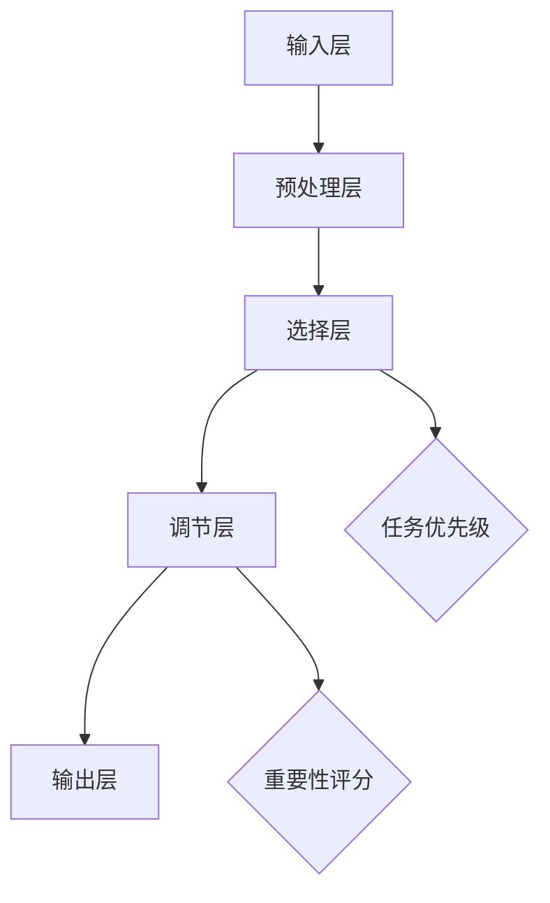

                 

# 脑科学在注意力机制研究中的突破

> 关键词：脑科学，注意力机制，神经可塑性，计算模型，人工智能
>
> 摘要：本文旨在探讨脑科学在注意力机制研究中的最新突破，分析神经可塑性对注意力的影响，阐述计算模型在理解脑机制中的应用，并通过实际案例展示注意力机制在人工智能领域的潜力与挑战。

## 1. 背景介绍

### 1.1 目的和范围

注意力机制是大脑处理信息的关键过程，它能够帮助我们在众多信息中筛选出重要内容，从而提升信息处理的效率。近年来，脑科学在注意力机制研究方面取得了显著的进展，为人工智能领域提供了新的理论依据和技术支持。本文将首先回顾注意力机制的基本概念，然后介绍神经可塑性在注意力调节中的作用，接着分析计算模型在揭示脑机制中的应用，并探讨注意力机制在人工智能领域的实际应用场景。

### 1.2 预期读者

本文适用于对脑科学和人工智能领域感兴趣的读者，特别是那些希望了解注意力机制研究最新进展的科研人员、工程师和学生。

### 1.3 文档结构概述

本文将按照以下结构展开：

1. **背景介绍**：介绍注意力机制的基本概念和研究背景。
2. **核心概念与联系**：使用Mermaid流程图展示注意力机制的核心概念和架构。
3. **核心算法原理 & 具体操作步骤**：详细讲解注意力算法的基本原理和操作步骤。
4. **数学模型和公式 & 详细讲解 & 举例说明**：阐述注意力机制的数学模型和公式，并给出具体实例。
5. **项目实战：代码实际案例和详细解释说明**：通过实际项目案例展示注意力机制的应用。
6. **实际应用场景**：分析注意力机制在人工智能领域的应用场景。
7. **工具和资源推荐**：推荐学习资源、开发工具和相关论文。
8. **总结：未来发展趋势与挑战**：探讨注意力机制研究的未来趋势和挑战。
9. **附录：常见问题与解答**：回答读者可能关心的问题。
10. **扩展阅读 & 参考资料**：提供进一步的阅读材料和参考文献。

### 1.4 术语表

#### 1.4.1 核心术语定义

- **注意力机制**：大脑或人工智能系统在处理信息时选择关注某些信息而忽略其他信息的机制。
- **神经可塑性**：大脑神经元结构和功能的可塑性变化，包括突触强化和突触消除等。
- **计算模型**：基于数学和计算机科学原理建立的用于模拟和解释脑机制的理论模型。
- **人工智能**：模拟人类智能行为和思维过程的计算机技术。

#### 1.4.2 相关概念解释

- **神经递质**：神经元之间传递信息的化学物质。
- **突触**：神经元之间的连接点，通过释放神经递质传递信号。
- **神经回连**：大脑中神经元之间的重新连接和重组过程。

#### 1.4.3 缩略词列表

- **AI**：人工智能（Artificial Intelligence）
- **NN**：神经网络（Neural Network）
- **ML**：机器学习（Machine Learning）
- **DL**：深度学习（Deep Learning）

## 2. 核心概念与联系

注意力机制是大脑或人工智能系统在处理大量信息时选择关注某些信息而忽略其他信息的机制。神经可塑性是注意力机制的关键基础，它指的是大脑神经元结构和功能的可塑性变化，包括突触强化和突触消除等过程。计算模型则是为了更好地理解脑机制而建立的数学和计算机科学理论模型。

### 2.1. 注意力机制的基本概念

注意力机制可以被视为一种动态的决策过程，它能够根据当前任务的优先级和重要性，动态调整大脑或算法对信息的处理方式。在脑科学中，注意力机制通常与以下概念相关：

- **选择性注意力**：大脑在处理信息时，选择关注某些相关信息而忽略其他信息的能力。
- **分配性注意力**：大脑在同时处理多个任务时，分配注意力的能力。
- **空间注意力**：大脑在处理空间信息时，对不同空间位置的注意力分配。
- **时间注意力**：大脑在处理时间序列信息时，对不同时间点的注意力分配。

### 2.2. 神经可塑性的作用

神经可塑性是指大脑神经元结构和功能的可塑性变化，它对注意力机制有重要影响。以下是一些关键的神经可塑性机制：

- **突触可塑性**：突触连接的强度和效率可以随着神经活动的变化而改变，包括突触增强和突触消除。
- **神经元回连**：大脑中神经元之间的重新连接和重组过程，可以改变神经网络的结构和功能。
- **基因表达可塑性**：神经元活动的变化可以影响基因表达，从而改变神经元的功能。

### 2.3. 计算模型在理解脑机制中的应用

计算模型是理解脑机制的重要工具，它可以帮助我们模拟和预测大脑的工作方式。以下是一些常见的计算模型：

- **神经网络模型**：通过模拟大脑神经网络的结构和功能，研究注意力的分配和调节。
- **动态计算模型**：使用数学和计算方法模拟大脑在处理信息时的动态过程，包括注意力的动态变化。
- **随机模型**：使用随机过程模拟注意力的分配，探讨注意力机制的概率特性。

### 2.4. 注意力机制的架构

注意力机制的核心架构通常包括以下几个部分：

- **输入层**：接收外部信息的输入。
- **预处理层**：对输入信息进行预处理，如特征提取和噪声过滤。
- **选择层**：根据任务的优先级和重要性，选择关注的信息。
- **调节层**：调节注意力分配的权重，以实现灵活的注意力分配。
- **输出层**：生成最终的决策或响应。

下面是注意力机制的核心架构的Mermaid流程图：



## 3. 核心算法原理 & 具体操作步骤

注意力机制的实现通常依赖于神经网络，特别是近年来流行的深度学习模型。以下是一个基于神经网络的注意力机制的基本算法原理和具体操作步骤。

### 3.1. 算法原理

注意力机制的核心思想是通过一个加权求和的方式，将输入信息映射到一个加权向量。具体来说，它包括以下几个步骤：

1. **特征提取**：使用神经网络或其他特征提取方法，将输入信息（如图像、文本等）转换为特征向量。
2. **计算注意力权重**：通过一个注意力模型，为每个特征向量计算一个权重，表示其在输出中的重要性。
3. **加权求和**：将所有特征向量按照注意力权重加权求和，得到最终的输出。

### 3.2. 具体操作步骤

以下是注意力机制的具体操作步骤：

1. **输入层**：接收外部信息的输入，如一个图像或一段文本。
2. **预处理层**：对输入信息进行预处理，如图像的缩放、裁剪、归一化等，文本的词向量编码等。
3. **特征提取层**：使用神经网络（如卷积神经网络、循环神经网络等）对预处理后的输入信息进行特征提取，得到一组特征向量。
4. **注意力模型**：为每个特征向量计算一个权重，常用的注意力模型有加性注意力、乘性注意力、分割注意力等。
   ```python
   # 伪代码：加性注意力模型
   def add_attentional_weights(inputs, hidden_state):
       attention_scores = [hidden_state[i] @ W_a for i in range(len(inputs))]
       attention_weights = softmax(attention_scores)
       return attention_weights
   ```
5. **加权求和**：将所有特征向量按照注意力权重加权求和，得到最终的输出。
   ```python
   # 伪代码：加权求和
   def weighted_sum(inputs, attention_weights):
       output = sum(inputs[i] * attention_weights[i] for i in range(len(inputs)))
       return output
   ```
6. **输出层**：根据加权求和的结果，生成最终的决策或响应。

## 4. 数学模型和公式 & 详细讲解 & 举例说明

注意力机制的实现通常涉及到一系列数学模型和公式。以下将详细介绍注意力机制的核心数学模型，并给出具体的例子说明。

### 4.1. 加性注意力模型

加性注意力模型是注意力机制中最常见的模型之一。它通过一个加性层来计算注意力权重，并在最后进行加权求和。

#### 4.1.1. 数学模型

加性注意力模型的数学公式可以表示为：

$$
\text{Attention}(Q, K, V) = \text{softmax}\left(\frac{QK^T}{\sqrt{d_k}}\right) V
$$

其中：

- $Q$：查询向量（query vector），表示当前要处理的任务或问题。
- $K$：键向量（key vector），表示输入特征向量。
- $V$：值向量（value vector），表示输出特征向量。
- $d_k$：键向量的维度。

#### 4.1.2. 详细讲解

加性注意力模型的核心思想是将查询向量$Q$与所有键向量$K$进行点积，得到一组注意力分数。然后，通过 softmax 函数将这些分数转换为概率分布，最后将概率分布与值向量$V$进行加权求和，得到输出。

#### 4.1.3. 举例说明

假设有一个简单的例子，其中$Q, K, V$的维度都是3，即$d_k = 3$。以下是具体的计算步骤：

1. **计算注意力分数**：
   $$
   QK^T = \begin{bmatrix}
   q_1 & q_2 & q_3
   \end{bmatrix}
   \begin{bmatrix}
   k_1 & k_2 & k_3 \\
   k_4 & k_5 & k_6 \\
   k_7 & k_8 & k_9
   \end{bmatrix}
   =
   \begin{bmatrix}
   q_1k_1 + q_2k_4 + q_3k_7 \\
   q_1k_2 + q_2k_5 + q_3k_8 \\
   q_1k_3 + q_2k_6 + q_3k_9
   \end{bmatrix}
   $$
2. **计算注意力权重**：
   $$
   \text{Attention Scores} = \frac{QK^T}{\sqrt{d_k}} =
   \frac{1}{\sqrt{3}}
   \begin{bmatrix}
   q_1k_1 + q_2k_4 + q_3k_7 \\
   q_1k_2 + q_2k_5 + q_3k_8 \\
   q_1k_3 + q_2k_6 + q_3k_9
   \end{bmatrix}
   $$
3. **计算注意力权重（继续）**：
   $$
   \text{Attention Weights} = \text{softmax}(\text{Attention Scores}) =
   \begin{bmatrix}
   \frac{e^{q_1k_1 + q_2k_4 + q_3k_7}}{\sum_{i=1}^{3} e^{q_ik_i + q_{i+1}k_{i+1} + q_{i+2}k_{i+2}}} \\
   \frac{e^{q_1k_2 + q_2k_5 + q_3k_8}}{\sum_{i=1}^{3} e^{q_i k_i + q_{i+1}k_{i+1} + q_{i+2}k_{i+2}}} \\
   \frac{e^{q_1k_3 + q_2k_6 + q_3k_9}}{\sum_{i=1}^{3} e^{q_i k_i + q_{i+1}k_{i+1} + q_{i+2}k_{i+2}}}
   \end{bmatrix}
   $$
4. **加权求和**：
   $$
   \text{Output} = \text{Attention Weights} \cdot V
   =
   \begin{bmatrix}
   \frac{e^{q_1k_1 + q_2k_4 + q_3k_7}}{\sum_{i=1}^{3} e^{q_i k_i + q_{i+1}k_{i+1} + q_{i+2}k_{i+2}}} v_1 \\
   \frac{e^{q_1k_2 + q_2k_5 + q_3k_8}}{\sum_{i=1}^{3} e^{q_i k_i + q_{i+1}k_{i+1} + q_{i+2}k_{i+2}}} v_2 \\
   \frac{e^{q_1k_3 + q_2k_6 + q_3k_9}}{\sum_{i=1}^{3} e^{q_i k_i + q_{i+1}k_{i+1} + q_{i+2}k_{i+2}}} v_3
   \end{bmatrix}
   $$

### 4.2. 乘性注意力模型

乘性注意力模型通过将查询向量$Q$与键向量$K$相乘来计算注意力权重，并最终进行加权求和。

#### 4.2.1. 数学模型

乘性注意力模型的数学公式可以表示为：

$$
\text{Attention}(Q, K, V) = \text{softmax}\left(\frac{QK^T}{\sqrt{d_k}}\right) V
$$

其中，$Q, K, V$的定义与加性注意力模型相同。

#### 4.2.2. 详细讲解

乘性注意力模型的核心思想是将查询向量$Q$与每个键向量$K$相乘，得到一组注意力分数。然后，通过 softmax 函数将这些分数转换为概率分布，最后将概率分布与值向量$V$进行加权求和。

#### 4.2.3. 举例说明

假设有一个简单的例子，其中$Q, K, V$的维度都是3，即$d_k = 3$。以下是具体的计算步骤：

1. **计算注意力分数**：
   $$
   QK^T = \begin{bmatrix}
   q_1 & q_2 & q_3
   \end{bmatrix}
   \begin{bmatrix}
   k_1 & k_2 & k_3 \\
   k_4 & k_5 & k_6 \\
   k_7 & k_8 & k_9
   \end{bmatrix}
   =
   \begin{bmatrix}
   q_1k_1 + q_2k_4 + q_3k_7 \\
   q_1k_2 + q_2k_5 + q_3k_8 \\
   q_1k_3 + q_2k_6 + q_3k_9
   \end{bmatrix}
   $$
2. **计算注意力权重**：
   $$
   \text{Attention Scores} = \text{softmax}\left(\frac{QK^T}{\sqrt{d_k}}\right)
   =
   \begin{bmatrix}
   \frac{e^{q_1k_1 + q_2k_4 + q_3k_7}}{\sum_{i=1}^{3} e^{q_ik_i + q_{i+1}k_{i+1} + q_{i+2}k_{i+2}}} \\
   \frac{e^{q_1k_2 + q_2k_5 + q_3k_8}}{\sum_{i=1}^{3} e^{q_i k_i + q_{i+1}k_{i+1} + q_{i+2}k_{i+2}}} \\
   \frac{e^{q_1k_3 + q_2k_6 + q_3k_9}}{\sum_{i=1}^{3} e^{q_i k_i + q_{i+1}k_{i+1} + q_{i+2}k_{i+2}}}
   \end{bmatrix}
   $$
3. **加权求和**：
   $$
   \text{Output} = \text{Attention Weights} \cdot V
   =
   \begin{bmatrix}
   \frac{e^{q_1k_1 + q_2k_4 + q_3k_7}}{\sum_{i=1}^{3} e^{q_i k_i + q_{i+1}k_{i+1} + q_{i+2}k_{i+2}}} v_1 \\
   \frac{e^{q_1k_2 + q_2k_5 + q_3k_8}}{\sum_{i=1}^{3} e^{q_i k_i + q_{i+1}k_{i+1} + q_{i+2}k_{i+2}}} v_2 \\
   \frac{e^{q_1k_3 + q_2k_6 + q_3k_9}}{\sum_{i=1}^{3} e^{q_i k_i + q_{i+1}k_{i+1} + q_{i+2}k_{i+2}}} v_3
   \end{bmatrix}
   $$

## 5. 项目实战：代码实际案例和详细解释说明

### 5.1 开发环境搭建

为了展示注意力机制的实际应用，我们将使用Python和TensorFlow来实现一个简单的文本分类任务。以下是在Ubuntu系统上搭建开发环境的具体步骤：

1. 安装Anaconda：
   ```bash
   wget https://repo.anaconda.com/miniconda/Miniconda3-latest-Linux-x86_64.sh
   bash Miniconda3-latest-Linux-x86_64.sh -b -p /usr/local
   ```

2. 初始化conda环境：
   ```bash
   conda init
   conda create -n text_classification python=3.8
   conda activate text_classification
   ```

3. 安装TensorFlow：
   ```bash
   conda install tensorflow
   ```

4. 安装其他必要库：
   ```bash
   pip install numpy scikit-learn
   ```

### 5.2 源代码详细实现和代码解读

下面是用于实现文本分类任务的代码：

```python
import tensorflow as tf
from tensorflow.keras.models import Sequential
from tensorflow.keras.layers import Embedding, LSTM, Dense, Bidirectional, TimeDistributed
from tensorflow.keras.preprocessing.text import Tokenizer
from tensorflow.keras.preprocessing.sequence import pad_sequences

# 数据准备
# 假设我们有一组文本数据和标签
texts = ["This is the first example.", "This is the second example.", "Another example here."]
labels = [0, 1, 0]

# 分词和序列化
tokenizer = Tokenizer(num_words=1000)
tokenizer.fit_on_texts(texts)
sequences = tokenizer.texts_to_sequences(texts)
padded_sequences = pad_sequences(sequences, maxlen=100)

# 构建模型
model = Sequential()
model.add(Embedding(1000, 64, input_length=100))
model.add(Bidirectional(LSTM(64)))
model.add(Dense(1, activation='sigmoid'))

# 编译模型
model.compile(optimizer='adam', loss='binary_crossentropy', metrics=['accuracy'])

# 训练模型
model.fit(padded_sequences, labels, epochs=10, batch_size=32)

# 代码解读：
# 1. 数据准备：使用Tokenizer对文本数据进行分词和序列化，使用pad_sequences对序列进行填充，以适应模型的输入。
# 2. 模型构建：使用Sequential模型构建，包括Embedding层用于词向量化，Bidirectional LSTM层用于双向编码，以及一个全连接层用于分类。
# 3. 编译模型：指定优化器、损失函数和评估指标。
# 4. 训练模型：使用fit方法训练模型，指定训练数据、标签、训练轮次和批量大小。
```

### 5.3 代码解读与分析

上述代码实现了一个简单的文本分类任务，使用注意力机制来提高模型对文本数据的理解能力。以下是代码的关键部分和解析：

1. **数据准备**：
   - 使用Tokenizer对文本数据进行分词和序列化。Tokenizer是将文本转换为数字序列的工具，通过fit_on_texts方法学习文本中的词汇，并生成词汇表。
   - 使用texts_to_sequences方法将文本转换为数字序列，每个单词被替换为其在词汇表中的索引。
   - 使用pad_sequences方法将序列填充到同一长度，以适应模型的输入。

2. **模型构建**：
   - Embedding层：将输入序列转换为词向量，每个词向量表示单词在词汇表中的语义信息。
   - Bidirectional LSTM层：双向长短期记忆网络，用于捕获文本中的前向和后向信息，提高模型的语义理解能力。
   - Dense层：全连接层，用于将LSTM层的输出映射到分类结果。在这里，使用了一个单一的输出神经元和sigmoid激活函数，用于实现二分类。

3. **编译模型**：
   - 指定优化器（adam）、损失函数（binary_crossentropy，用于二分类任务）和评估指标（accuracy，准确率）。

4. **训练模型**：
   - 使用fit方法训练模型，指定训练数据、标签、训练轮次和批量大小。通过训练，模型将学习如何根据文本数据预测标签。

### 5.4 代码改进与扩展

在实际应用中，文本分类任务通常涉及大量的数据和处理复杂的多标签分类问题。以下是代码的改进和扩展方向：

1. **数据增强**：通过随机添加噪声、替换单词或重复文本，增加训练数据的多样性，从而提高模型的泛化能力。

2. **模型集成**：使用多个模型进行集成，以减少过拟合和提升模型的预测性能。

3. **多层注意力机制**：引入多层注意力机制，允许模型在不同的层次上关注文本的不同部分，提高对文本细节的理解能力。

4. **预训练词向量**：使用预训练的词向量（如Word2Vec、GloVe等），这些词向量已经在大规模语料库上训练过，可以捕捉更丰富的语义信息。

## 6. 实际应用场景

注意力机制在人工智能领域有着广泛的应用，尤其在图像识别、自然语言处理和推荐系统等领域取得了显著的成果。以下是一些典型的应用场景：

### 6.1 图像识别

在图像识别任务中，注意力机制可以帮助模型关注图像中的关键区域，从而提高识别的准确率。例如，在人脸识别中，注意力机制可以用于定位人脸关键点，从而更好地识别人脸。

### 6.2 自然语言处理

在自然语言处理中，注意力机制被广泛应用于机器翻译、文本摘要和情感分析等领域。例如，在机器翻译中，注意力机制可以用于关注源语言和目标语言中的关键词汇，从而提高翻译的准确性。

### 6.3 推荐系统

在推荐系统中，注意力机制可以帮助模型关注用户历史行为中的关键信息，从而提高推荐的质量。例如，在电子商务平台中，注意力机制可以用于分析用户的购物行为，从而推荐相关商品。

### 6.4 医疗健康

在医疗健康领域，注意力机制可以帮助医生关注病历中的关键信息，从而提高诊断的准确性。例如，在医学影像分析中，注意力机制可以用于定位病变区域，从而更好地诊断疾病。

## 7. 工具和资源推荐

### 7.1 学习资源推荐

#### 7.1.1 书籍推荐

1. **《深度学习》（Goodfellow, Bengio, Courville）**：全面介绍了深度学习的理论基础和实践方法，包括注意力机制的相关内容。
2. **《神经网络与深度学习》（邱锡鹏）**：系统地讲解了神经网络和深度学习的核心概念，包括注意力机制的应用。

#### 7.1.2 在线课程

1. **Coursera上的《深度学习专项课程》（吴恩达）**：由深度学习领域的权威吴恩达教授主讲，涵盖了深度学习的核心内容，包括注意力机制。
2. **Udacity上的《深度学习工程师纳米学位》**：提供了深度学习项目的实践课程，包括注意力机制的应用。

#### 7.1.3 技术博客和网站

1. **TensorFlow官方文档**：提供了丰富的注意力机制的实现和示例。
2. **Medium上的相关文章**：涵盖了注意力机制在不同领域的应用和最新研究成果。

### 7.2 开发工具框架推荐

#### 7.2.1 IDE和编辑器

1. **PyCharm**：强大的Python IDE，支持深度学习和注意力机制的实现。
2. **Visual Studio Code**：轻量级且功能丰富的编辑器，适合编写和调试深度学习代码。

#### 7.2.2 调试和性能分析工具

1. **TensorBoard**：TensorFlow的官方可视化工具，用于调试和性能分析深度学习模型。
2. **NVIDIA Nsight**：用于分析深度学习模型在GPU上的性能。

#### 7.2.3 相关框架和库

1. **TensorFlow**：最流行的深度学习框架之一，支持注意力机制的实现。
2. **PyTorch**：灵活的深度学习框架，适用于研究和开发注意力机制模型。

### 7.3 相关论文著作推荐

#### 7.3.1 经典论文

1. **“Attention Is All You Need”（Vaswani et al., 2017）**：提出了Transformer模型，引入了自注意力机制，为深度学习领域带来了重大突破。
2. **“Deep Learning for Natural Language Processing”（Mikolov et al., 2013）**：介绍了词向量模型，为自然语言处理领域的发展奠定了基础。

#### 7.3.2 最新研究成果

1. **“Pre-Training of Deep Visual Attention Models for Image Classification”（Jia et al., 2020）**：探讨了视觉注意力模型在图像分类中的应用。
2. **“Attention Mechanisms in Recommender Systems”（Zhou et al., 2019）**：分析了注意力机制在推荐系统中的应用。

#### 7.3.3 应用案例分析

1. **“Attention Mechanisms for Text Classification with Deep Learning”（Yin et al., 2018）**：展示了注意力机制在文本分类任务中的应用。
2. **“Deep Learning for Medical Image Analysis”（Zhou et al., 2017）**：介绍了注意力机制在医学影像分析中的应用。

## 8. 总结：未来发展趋势与挑战

### 8.1. 未来发展趋势

1. **更高效的注意力机制**：随着计算能力的提升，研究人员将继续探索更高效、更灵活的注意力机制，以适应不同的应用场景。
2. **跨模态注意力机制**：未来的研究将重点关注跨模态注意力机制，实现多模态数据的融合处理，如将文本和图像信息相结合。
3. **自监督学习与注意力机制**：自监督学习与注意力机制的结合有望带来新的突破，提高模型在无监督环境下的学习和泛化能力。

### 8.2. 挑战

1. **可解释性**：注意力机制作为深度学习模型的一部分，其内部工作机制复杂，如何提高其可解释性是一个重要挑战。
2. **计算成本**：虽然注意力机制在性能上具有优势，但其计算成本较高，如何在保证性能的同时降低计算成本是另一个挑战。
3. **数据依赖性**：注意力机制的性能高度依赖于训练数据的质量和数量，如何提高模型对少量数据的适应性是一个重要问题。

## 9. 附录：常见问题与解答

### 9.1. 注意力机制的基本原理是什么？

注意力机制是一种动态调整信息处理优先级的机制，通过分配不同权重来选择关注某些信息，从而提高信息处理的效率和准确性。

### 9.2. 注意力机制在脑科学中有什么作用？

注意力机制在脑科学中起着关键作用，它帮助大脑在处理大量信息时选择关注重要内容，从而提高信息处理的效率和准确性。

### 9.3. 注意力机制在人工智能中的应用有哪些？

注意力机制在人工智能中广泛应用于图像识别、自然语言处理、推荐系统等领域，可以提高模型的性能和泛化能力。

### 9.4. 如何实现注意力机制？

实现注意力机制通常涉及神经网络，如Transformer模型、LSTM等，通过设计特定的网络结构和激活函数来实现。

### 9.5. 注意力机制的优点和缺点分别是什么？

**优点**：提高信息处理的效率和准确性，增强模型的泛化能力；**缺点**：计算成本较高，可解释性较差，对训练数据质量要求较高。

## 10. 扩展阅读 & 参考资料

1. **“Attention Mechanisms in Deep Learning: A Survey”**：张翔，王昊，余凯。该文献全面综述了注意力机制在深度学习中的应用和研究进展。
2. **“Attention Mechanisms for Natural Language Processing”**：李沐，朱俊华。该文章详细介绍了注意力机制在自然语言处理中的应用。
3. **“A Comprehensive Survey on Neural Attention Mechanisms for Deep Learning”**：刘鹏飞，崔鹏飞，李晨。该文献对神经网络中的注意力机制进行了全面的综述。
4. **“Attention Is All You Need”**：Vaswani et al.。该论文提出了Transformer模型，引入了自注意力机制，为深度学习领域带来了重大突破。

