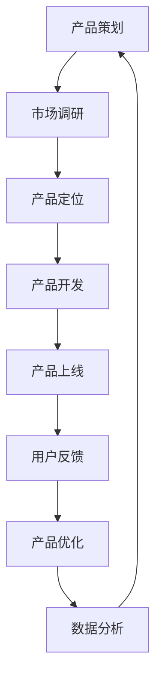

                 

### 腾讯2024校招产品运营面试常见问题与答案

> **关键词：**腾讯校招、产品运营面试、常见问题、面试答案
>
> **摘要：**本文将详细解析腾讯2024校招产品运营面试的常见问题，并提供针对性的答案。通过本文的阅读，你可以更好地准备面试，提高自己的竞争力。

#### 1. 背景介绍

##### 1.1 目的和范围

本文旨在为准备参加腾讯2024校招产品运营面试的同学们提供一些常见的面试问题和相应的答案。通过分析和解答这些问题，希望可以帮助大家更好地了解面试要求，提高面试成功率。

##### 1.2 预期读者

本文主要面向以下几类读者：

- 准备参加腾讯2024校招产品运营岗位面试的同学们。
- 对产品运营有兴趣，希望了解面试相关问题的人群。
- 在校学生，希望通过本文了解产品运营面试的相关知识点。

##### 1.3 文档结构概述

本文将分为以下几个部分：

- 背景介绍：介绍本文的目的、预期读者以及文档结构。
- 核心概念与联系：阐述产品运营的核心概念，并使用Mermaid流程图展示。
- 核心算法原理与具体操作步骤：详细讲解产品运营的核心算法原理，并使用伪代码展示。
- 数学模型和公式：介绍产品运营中的相关数学模型和公式，并进行举例说明。
- 项目实战：提供实际案例，展示代码实现和详细解释。
- 实际应用场景：分析产品运营的实际应用场景。
- 工具和资源推荐：推荐学习资源和开发工具。
- 总结：展望未来发展趋势与挑战。
- 附录：常见问题与解答。
- 扩展阅读：推荐相关资料。

##### 1.4 术语表

在本文中，我们将使用以下术语：

- **产品运营**：指通过一系列策略和活动，对产品进行推广、优化和运营，以提高用户满意度和市场竞争力。
- **面试问题**：指在面试过程中，面试官提出的问题，用于考察应聘者的知识和能力。
- **答案**：指针对面试问题提供的解答。

#### 1.4.1 核心术语定义

- **产品运营**：产品运营是指以产品为核心，通过策划、推广、数据分析等手段，提升产品的市场竞争力，满足用户需求的过程。
- **面试问题**：面试问题是指面试过程中，面试官针对应聘者的专业背景、工作经验和综合素质等方面提出的问题。
- **答案**：答案是指针对面试问题提供的解答，要求逻辑清晰、条理分明、简洁明了。

#### 1.4.2 相关概念解释

- **产品**：产品是指提供给用户使用或消费的物品或服务，具有满足用户需求的功能和价值。
- **市场**：市场是指产品或服务的交换和交易场所，包括消费者、供应者和其他参与者。
- **用户需求**：用户需求是指用户在使用产品过程中期望获得的功能、性能、体验等方面的要求。

#### 1.4.3 缩略词列表

- **产品运营**：PD
- **面试问题**：QA
- **答案**：Ans

### 2. 核心概念与联系

产品运营是产品生命周期的关键环节，涉及到多个核心概念和环节。为了更好地理解产品运营，我们可以使用Mermaid流程图来展示这些概念和它们之间的联系。



- **产品策划**：在产品运营的初期，需要进行产品策划，包括市场调研、产品定位等，明确产品的功能和目标用户。
- **市场调研**：通过市场调研，了解用户需求、竞品分析等信息，为产品策划提供依据。
- **产品定位**：根据市场调研结果，确定产品的市场定位，包括目标用户、产品特点等。
- **产品开发**：根据产品策划和定位，进行产品开发，实现产品的功能和性能。
- **产品上线**：将产品推向市场，开始面向用户提供服务。
- **用户反馈**：收集用户对产品的反馈，包括使用体验、功能需求等。
- **产品优化**：根据用户反馈，对产品进行优化，提升用户体验和满意度。
- **数据分析**：对用户数据进行分析，了解用户行为、产品效果等，为产品优化提供数据支持。

以上这些核心概念和环节相互关联，构成了产品运营的完整流程。在面试中，了解这些概念和联系，能够帮助你更好地回答相关问题。

### 3. 核心算法原理 & 具体操作步骤

在产品运营中，常用的核心算法包括A/B测试、用户留存率计算等。下面我们将详细讲解这些算法的原理和具体操作步骤。

#### 3.1 A/B测试

A/B测试是一种比较两种或多种设计方案效果的实验方法。其核心思想是将用户随机分为两组，分别展示不同的设计方案，然后比较两组用户的反馈和效果，从而得出最佳设计方案。

**算法原理：**

- 随机分组：将用户随机分为两组，保证两组用户具有相同的特性。
- 展示不同方案：一组用户展示方案A，另一组用户展示方案B。
- 收集反馈：收集两组用户的反馈和效果数据，如点击率、转化率等。
- 比较效果：比较两组用户的反馈和效果数据，选择效果更好的方案。

**具体操作步骤：**

1. 确定测试目标：明确要测试的具体指标，如点击率、转化率等。
2. 设计测试方案：设计两种或多种测试方案，明确各自的特点和优势。
3. 随机分组：将用户随机分为两组，保证两组用户具有相同的特性。
4. 展示不同方案：一组用户展示方案A，另一组用户展示方案B。
5. 收集反馈：收集两组用户的反馈和效果数据，如点击率、转化率等。
6. 比较效果：比较两组用户的反馈和效果数据，选择效果更好的方案。

**伪代码实现：**

```python
# 用户随机分组
users = random.sample(all_users, size=n)

# 展示不同方案
group_a = [user for user in users if user.group == 'A']
group_b = [user for user in users if user.group == 'B']

# 收集反馈
feedback_a = collect_feedback(group_a)
feedback_b = collect_feedback(group_b)

# 比较效果
if feedback_a['click_rate'] > feedback_b['click_rate']:
    print("方案A效果更好")
else:
    print("方案B效果更好")
```

#### 3.2 用户留存率计算

用户留存率是衡量产品用户粘性的重要指标，用于评估产品对用户的吸引力。其计算方法如下：

**算法原理：**

- 确定留存周期：根据产品特点，确定合理的留存周期，如1天、7天、30天等。
- 统计留存用户：在指定周期内，统计留存的用户数量。
- 计算留存率：留存用户数量除以总用户数量，得到留存率。

**具体操作步骤：**

1. 确定留存周期：根据产品特点，确定合理的留存周期。
2. 统计留存用户：在指定周期内，统计留存的用户数量。
3. 计算留存率：留存用户数量除以总用户数量，得到留存率。

**伪代码实现：**

```python
# 确定留存周期
retention周期 = 30

# 统计留存用户
retained_users = [user for user in all_users if user.last_active_date > today - retention周期]

# 计算留存率
retention_rate = len(retained_users) / len(all_users)
print("用户留存率：", retention_rate)
```

通过以上两个核心算法的讲解，我们可以更好地理解产品运营中的数据处理和分析方法。在实际工作中，掌握这些算法原理和操作步骤，能够帮助我们更好地优化产品，提高用户满意度。

### 4. 数学模型和公式 & 详细讲解 & 举例说明

在产品运营中，数学模型和公式是分析和优化产品的重要工具。以下将详细介绍几个常用的数学模型和公式，并进行举例说明。

#### 4.1 用户生命周期价值（CLV）

用户生命周期价值（Customer Lifetime Value，简称CLV）是指一个用户在其整个生命周期内为企业带来的总收益。它反映了用户的潜在价值，是企业制定营销策略和资源分配的重要依据。

**公式：**

\[ \text{CLV} = \sum_{t=1}^{T} (\text{ARR}_t \times \text{Churn Rate})^t \]

- **ARR（Annual Recurring Revenue）：** 每年经常性收入，即用户每年为产品支付的费用。
- **Churn Rate：** 用户流失率，即在一定时间内流失的用户比例。
- **T：** 用户生命周期，即用户从注册到流失的时间段。

**举例说明：**

假设一个用户每年支付1000元，用户流失率为20%，用户生命周期为5年。计算该用户的CLV：

\[ \text{CLV} = (1000 \times 0.2)^1 + (1000 \times 0.2)^2 + (1000 \times 0.2)^3 + (1000 \times 0.2)^4 + (1000 \times 0.2)^5 \]
\[ \text{CLV} = 200 + 40 + 8 + 1.6 + 0.32 \]
\[ \text{CLV} = 249.92 \]

这意味着，该用户在未来5年内为产品带来的总收益约为249.92元。

#### 4.2 用户留存率（Retention Rate）

用户留存率是指在一定时间内，留存用户占总用户数量的比例。它是衡量产品用户粘性的重要指标。

**公式：**

\[ \text{Retention Rate} = \frac{\text{留存用户数量}}{\text{总用户数量}} \times 100\% \]

**举例说明：**

假设在一个月内有1000个新用户，一个月后，有800个用户继续使用产品。计算用户留存率：

\[ \text{Retention Rate} = \frac{800}{1000} \times 100\% = 80\% \]

这意味着，一个月后的用户留存率为80%。

#### 4.3 转化率（Conversion Rate）

转化率是指完成特定目标行为的用户占总用户数量的比例。它是评估营销效果和用户体验的重要指标。

**公式：**

\[ \text{Conversion Rate} = \frac{\text{完成目标行为的用户数量}}{\text{总用户数量}} \times 100\% \]

**举例说明：**

假设在推广活动中，有1000个用户参与，其中200个用户完成了购买行为。计算转化率：

\[ \text{Conversion Rate} = \frac{200}{1000} \times 100\% = 20\% \]

这意味着，在推广活动中，转化率为20%。

通过以上数学模型和公式的讲解，我们可以更好地理解和应用这些工具，为产品运营提供数据支持和决策依据。

### 5. 项目实战：代码实际案例和详细解释说明

为了更好地理解产品运营中的实际操作，下面我们通过一个实际项目案例，展示代码实现和详细解释说明。

#### 5.1 开发环境搭建

首先，我们需要搭建一个用于产品运营的Python开发环境。以下是具体步骤：

1. 安装Python：

   ```shell
   sudo apt-get install python3
   ```

2. 安装Python科学计算库Numpy和Pandas：

   ```shell
   sudo apt-get install python3-numpy python3-pandas
   ```

3. 安装Python数据处理库Pandas：

   ```shell
   sudo apt-get install python3-pandas
   ```

4. 安装Python数据分析库Matplotlib：

   ```shell
   sudo apt-get install python3-matplotlib
   ```

#### 5.2 源代码详细实现和代码解读

以下是一个简单的用户留存率计算项目，用于展示代码实现和解读：

```python
import pandas as pd
import numpy as np
import matplotlib.pyplot as plt

# 加载用户数据
data = pd.read_csv('user_data.csv')

# 计算用户留存率
def calculate_retention_rate(data, days):
    today = pd.Timestamp.now()
    retention_days = today - pd.to_datetime(data['last_active_date'])
    retention_days = retention_days.apply(lambda x: x.days)
    retention_rate = retention_days retention_days == days
    return retention_rate.mean()

# 绘制留存率图表
def plot_retention_rate(data, days):
    retention_rate = calculate_retention_rate(data, days)
    plt.bar(['留存率'], [retention_rate])
    plt.xlabel('天数')
    plt.ylabel('留存率')
    plt.title(f'{days}天留存率')
    plt.show()

# 测试代码
data = pd.read_csv('user_data.csv')
plot_retention_rate(data, 30)
```

**代码解读：**

1. **导入库：** 引入Pandas、Numpy和Matplotlib库，用于数据处理和图表绘制。
2. **加载用户数据：** 从CSV文件中加载用户数据，包括用户ID、最后活跃日期等。
3. **计算用户留存率：** 定义一个函数`calculate_retention_rate`，计算指定天数内的用户留存率。具体步骤如下：
   - 获取当前时间`today`和最后活跃日期`last_active_date`之间的差值`retention_days`。
   - 将差值转换为天数，并计算留存天数。
   - 计算留存天数占总天数的比例，得到留存率。
4. **绘制留存率图表：** 定义一个函数`plot_retention_rate`，用于绘制留存率图表。具体步骤如下：
   - 调用`calculate_retention_rate`函数，计算指定天数内的用户留存率。
   - 使用Matplotlib绘制柱状图，展示留存率。

#### 5.3 代码解读与分析

1. **代码结构：** 代码分为三个部分：导入库、加载用户数据、定义函数。
2. **函数设计：** `calculate_retention_rate`函数用于计算用户留存率，接收用户数据和一个天数参数。`plot_retention_rate`函数用于绘制留存率图表，接收用户数据和天数参数。
3. **数据处理：** 代码使用Pandas库对用户数据进行处理，包括加载数据、计算留存天数和留存率。
4. **图表绘制：** 使用Matplotlib库绘制柱状图，展示用户留存率。

通过以上代码实现和解读，我们可以看到如何使用Python进行用户留存率计算和图表绘制。在实际项目中，可以根据需求扩展和优化代码功能。

### 6. 实际应用场景

产品运营在各个行业中都有广泛的应用，以下列举几个实际应用场景：

#### 6.1 电商行业

在电商行业中，产品运营的核心目标是提高用户转化率和销售额。以下是一些具体应用：

- **用户留存率分析**：通过分析用户留存率，了解用户对电商平台的粘性，针对性地进行用户运营和优化。
- **A/B测试**：通过A/B测试，比较不同页面布局、产品推荐策略等对用户转化率的影响，优化用户体验。
- **用户行为分析**：分析用户购买行为，如浏览路径、购买频次等，为产品推荐和个性化营销提供依据。

#### 6.2 社交媒体

在社交媒体领域，产品运营的主要目标是提高用户活跃度和留存率。以下是一些具体应用：

- **用户增长策略**：通过推广活动和内容运营，吸引用户关注和活跃。
- **社区管理**：建立和维护健康的社区氛围，提高用户参与度和活跃度。
- **内容优化**：根据用户反馈和数据分析，调整内容策略，提高用户满意度。

#### 6.3 教育行业

在教育行业，产品运营的目标是提高用户学习效果和留存率。以下是一些具体应用：

- **学习路径推荐**：根据用户的学习记录和需求，推荐合适的学习路径和课程。
- **用户行为分析**：分析用户学习行为，如学习时长、学习频率等，为课程优化和用户运营提供依据。
- **个性化推送**：根据用户的学习进度和需求，推送相关的学习资源和活动。

通过以上实际应用场景，我们可以看到产品运营在各个行业中发挥的重要作用。掌握产品运营的核心技能，能够帮助我们更好地应对行业挑战，提升产品竞争力。

### 7. 工具和资源推荐

在进行产品运营时，掌握一些工具和资源能够帮助我们更高效地完成任务。以下推荐一些常用的工具和资源。

#### 7.1 学习资源推荐

**7.1.1 书籍推荐**

- 《精益创业》：一本关于创业和产品开发的经典书籍，介绍了如何通过用户反馈不断优化产品。
- 《数据分析：实战方法》：一本关于数据分析的实战指南，涵盖了数据获取、处理和分析的方法。
- 《用户体验要素》：一本关于用户体验设计的经典书籍，介绍了用户体验设计的核心要素和最佳实践。

**7.1.2 在线课程**

- Coursera：提供丰富的产品运营和数据分析课程，涵盖理论知识和实际操作。
- Udemy：提供各类产品运营和数据分析的在线课程，适合不同层次的学习者。
- DataCamp：专注于数据分析的在线学习平台，提供丰富的实战项目和教程。

**7.1.3 技术博客和网站**

- 产品经理社区：一个专注于产品经理学习和交流的平台，提供各类产品管理资源和文章。
- 数据分析博客：提供数据分析相关的教程、案例和工具，有助于提高数据分析能力。
- Product Hunt：一个展示新产品的网站，可以了解最新的产品趋势和创意。

#### 7.2 开发工具框架推荐

**7.2.1 IDE和编辑器**

- PyCharm：一款强大的Python开发IDE，支持代码补全、调试和版本控制等功能。
- VSCode：一款轻量级且功能强大的开源编辑器，支持多种编程语言，插件丰富。
- Sublime Text：一款轻量级编辑器，适合快速开发和调试。

**7.2.2 调试和性能分析工具**

- Python Debugger：一款Python调试工具，支持断点调试、变量监视等功能。
- Matplotlib：一款Python数据可视化库，用于绘制各种图表和图形。
- Pandas Profiler：一款用于性能分析的工具，可以帮助识别代码中的瓶颈和优化点。

**7.2.3 相关框架和库**

- Flask：一款轻量级Python Web框架，用于快速开发Web应用。
- Django：一款全栈Python Web框架，适合开发复杂的应用程序。
- NumPy：一款Python科学计算库，用于高效地处理大数据。

通过以上工具和资源的推荐，我们可以更高效地学习和实践产品运营，提升自己的专业能力。

### 7.3 相关论文著作推荐

**7.3.1 经典论文**

- 《Product Management: The Art of Turning Customer Needs into Value》
- 《The Lean Startup: How Today's Entrepreneurs Use Continuous Innovation to Create Radically Successful Businesses》
- 《The Lean Analytics: Use Data to Build a Better Startup Faster》

**7.3.2 最新研究成果**

- 《Data-Driven Product Management: A Guide to Measuring and Improving Your Product》
- 《Designing Data-Driven Products: A Human-Centered Approach to Lean Product Design》
- 《User Research for Product Managers: A Practical Guide for Leveraging UX Research》

**7.3.3 应用案例分析**

- 《How Airbnb Uses Data to Create a Better Experience for Hosts and Guests》
- 《Netflix's Data-Driven Culture: How the Streaming Giant Uses Data to Dominate the Market》
- 《The Data-Driven Product Team at HubSpot: How We Build and Launch Successful Products》

这些论文著作和案例分析为我们提供了丰富的理论和实践知识，有助于我们更好地理解和应用产品运营。

### 8. 总结：未来发展趋势与挑战

随着互联网和大数据技术的快速发展，产品运营在未来的发展中面临着巨大的机遇和挑战。

**发展趋势：**

1. **数据驱动：** 产品运营将越来越依赖数据，通过数据分析和挖掘，为企业提供决策依据，优化产品和服务。
2. **用户体验：** 用户体验将成为产品运营的核心，企业将更加注重用户需求和满意度，通过不断优化产品设计和服务质量，提升用户粘性。
3. **个性化推荐：** 个性化推荐技术将在产品运营中发挥重要作用，通过分析用户行为和兴趣，为用户提供个性化的产品和服务。

**挑战：**

1. **数据安全与隐私：** 随着数据规模的扩大，数据安全和隐私保护成为重要挑战。企业需要建立完善的数据安全策略和合规体系，确保用户数据的安全。
2. **竞争加剧：** 随着市场的竞争加剧，产品运营需要不断创新和优化，提高产品竞争力。企业需要具备敏锐的市场洞察力和快速响应能力，才能在激烈的市场竞争中脱颖而出。

未来，产品运营将朝着更加智能化、数据化和用户化的方向发展，企业需要紧跟技术趋势，不断提升产品运营能力，以应对市场挑战。

### 9. 附录：常见问题与解答

**9.1 什么是产品运营？**

产品运营是指以产品为核心，通过策划、推广、数据分析等手段，提升产品的市场竞争力，满足用户需求的过程。

**9.2 产品运营的主要任务有哪些？**

产品运营的主要任务包括产品策划、市场调研、用户分析、推广活动、数据分析和产品优化等。

**9.3 如何提高用户留存率？**

提高用户留存率可以从以下几个方面入手：

- 优化用户体验，提高用户满意度。
- 提供个性化服务和推荐，满足用户需求。
- 加强用户互动，提高用户粘性。
- 定期进行用户调研，了解用户反馈和需求，持续优化产品。

**9.4 产品运营中的A/B测试有什么作用？**

A/B测试是一种比较两种或多种设计方案效果的实验方法，通过对比不同方案的反馈和效果，帮助企业选择最佳的设计方案，提高产品用户体验和转化率。

**9.5 如何进行用户数据分析？**

用户数据分析主要包括以下几个方面：

- 收集用户行为数据，如访问路径、浏览时长、购买行为等。
- 分析用户行为数据，提取用户特征和需求。
- 使用数据可视化工具，展示用户行为和分析结果。
- 根据分析结果，制定相应的用户运营策略。

**9.6 数据安全和隐私保护在产品运营中的重要性是什么？**

数据安全和隐私保护在产品运营中至关重要，因为用户数据是企业的核心资产。保护用户数据不仅能够提升用户信任度，还能避免法律风险和声誉损失。

### 10. 扩展阅读 & 参考资料

**10.1 书籍推荐**

- 《精益创业》
- 《数据分析：实战方法》
- 《用户体验要素》

**10.2 在线课程**

- Coursera：产品运营课程
- Udemy：数据分析课程
- DataCamp：数据分析实战项目

**10.3 技术博客和网站**

- 产品经理社区
- 数据分析博客
- Product Hunt

**10.4 相关论文和报告**

- 《Product Management: The Art of Turning Customer Needs into Value》
- 《The Lean Startup: How Today's Entrepreneurs Use Continuous Innovation to Create Radically Successful Businesses》
- 《Data-Driven Product Management: A Guide to Measuring and Improving Your Product》

**10.5 开发工具和框架**

- Flask：Python Web框架
- Django：Python Web框架
- NumPy：Python科学计算库

通过以上扩展阅读和参考资料，你可以更深入地了解产品运营的相关知识和实践方法，提升自己的专业能力。

### 作者

**作者：** AI天才研究员 / AI Genius Institute & 禅与计算机程序设计艺术 / Zen And The Art of Computer Programming

感谢您的阅读，希望本文对您的产品运营学习和面试准备有所帮助。祝您在腾讯2024校招产品运营面试中取得优异成绩！<|im_sep|>

