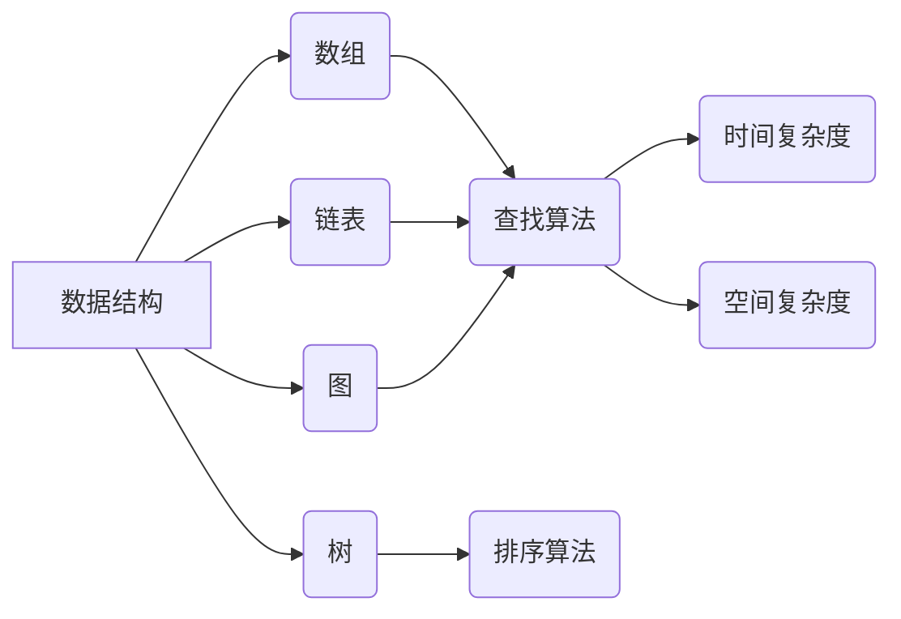
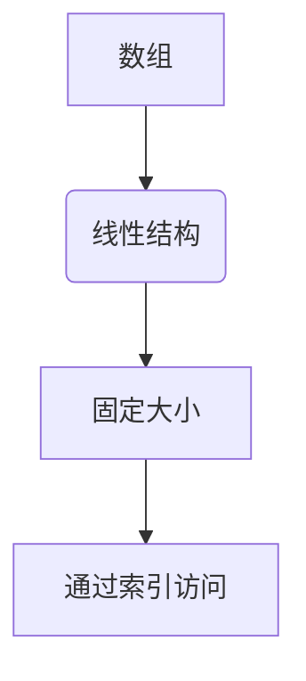
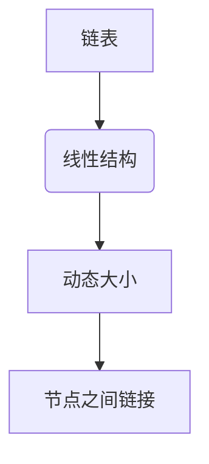
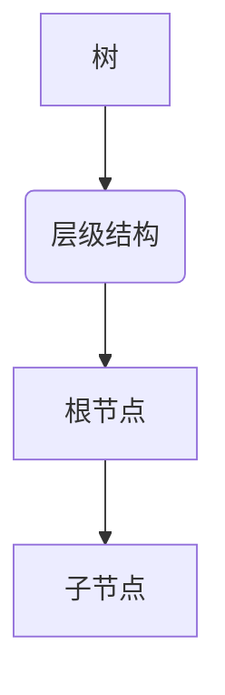
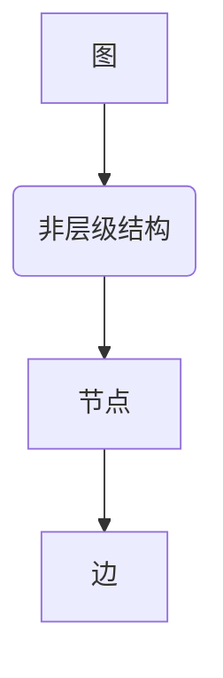
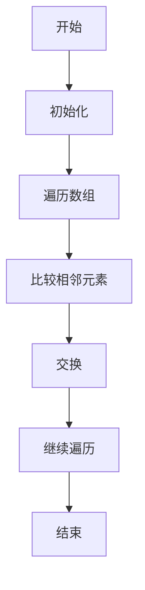
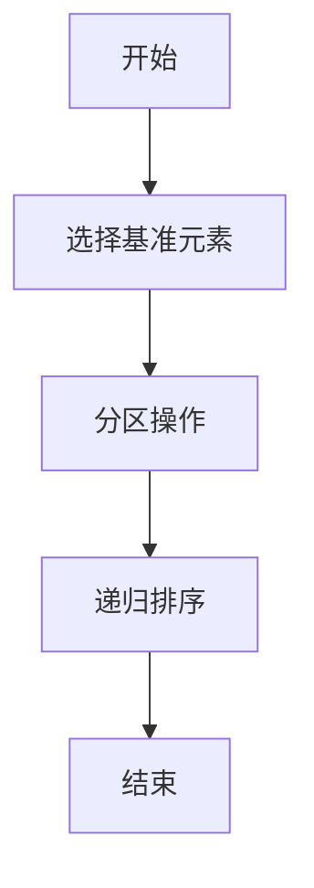
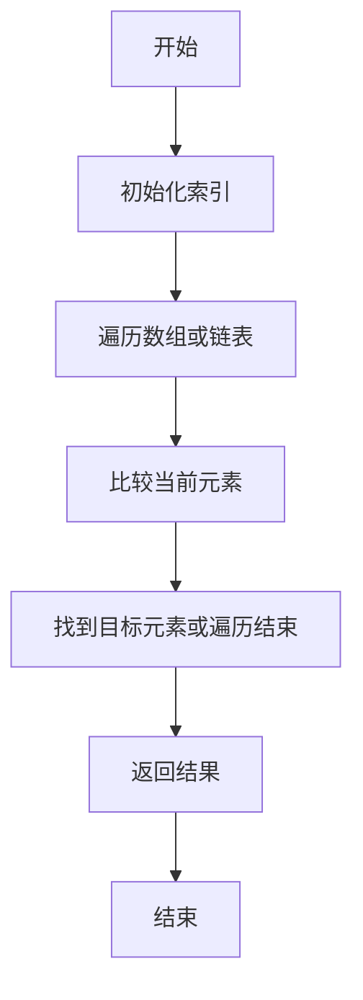
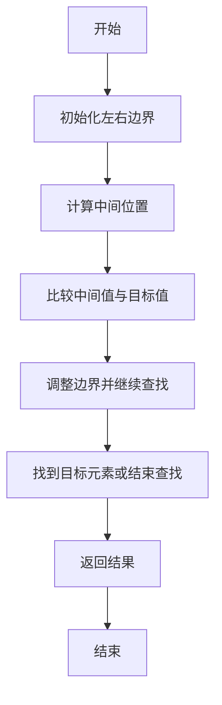

                 

# 腾讯2024校招面试真题与算法题解

> **关键词：** 腾讯校招，面试真题，算法题解，数据结构，编程实践，求职准备

> **摘要：** 本文旨在为准备腾讯2024校招的同学们提供面试真题及解题思路。文章将详细分析常见面试题型，包括数据结构、算法、编程实践等方面，并通过实际案例指导读者应对面试挑战，提升求职竞争力。

## 1. 背景介绍

### 1.1 目的和范围

本文旨在为准备腾讯2024校招的求职者提供系统的面试真题分析与解题指导。文章将涵盖以下范围：

- **数据结构与算法**：分析常见面试题型，包括数组、链表、树、图等数据结构及其相关算法。
- **编程实践**：提供实际编程题目及解决思路，帮助求职者熟悉编程技能和问题解决能力。
- **面试技巧**：分享面试准备经验，提供面试过程中的应对策略和心理调适方法。

### 1.2 预期读者

- **计算机相关专业毕业生**：准备参加腾讯校招的计算机相关专业学生。
- **编程爱好者**：对数据结构与算法有兴趣，希望通过面试提升编程能力的开发者。
- **求职准备者**：希望了解腾讯面试题型和风格的求职者。

### 1.3 文档结构概述

本文结构如下：

- **第1章：背景介绍**：介绍文章的目的、范围和预期读者。
- **第2章：核心概念与联系**：讨论数据结构与算法的基本概念，并使用Mermaid流程图展示。
- **第3章：核心算法原理与具体操作步骤**：讲解常见算法原理，使用伪代码详细阐述。
- **第4章：数学模型和公式**：介绍与算法相关的数学模型和公式，并举例说明。
- **第5章：项目实战**：提供实际代码案例，详细解释实现过程。
- **第6章：实际应用场景**：探讨算法在现实中的应用。
- **第7章：工具和资源推荐**：推荐学习资源、开发工具和论文著作。
- **第8章：总结**：展望未来发展趋势与挑战。
- **第9章：附录**：常见问题与解答。
- **第10章：扩展阅读与参考资料**：提供进一步阅读的资源。

### 1.4 术语表

#### 1.4.1 核心术语定义

- **面试真题**：指在面试过程中出现的问题，通常包括编程题、算法题和情境题等。
- **数据结构**：用于存储和组织数据的各种方式，如数组、链表、树和图等。
- **算法**：解决问题的步骤序列，能够解决特定类型的问题。
- **编程实践**：在实际开发过程中编写的代码，用于解决问题或实现特定功能。

#### 1.4.2 相关概念解释

- **树**：是一种特殊的数据结构，由节点和边组成，具有层级关系。
- **图**：由节点（或称为顶点）和边组成，表示实体之间的连接关系。
- **时间复杂度**：衡量算法运行时间随输入规模增长的趋势。
- **空间复杂度**：衡量算法所需内存随输入规模增长的趋势。

#### 1.4.3 缩略词列表

- **校招**：校园招聘的简称，指公司直接在学校进行招聘。
- **IDE**：集成开发环境（Integrated Development Environment）。
- **OOP**：面向对象编程（Object-Oriented Programming）。
- **PSL**：问题解决策略（Problem Solving Logic）。

## 2. 核心概念与联系

在腾讯的校招面试中，数据结构与算法是不可或缺的考察点。理解这些核心概念及其相互联系，对于成功应对面试至关重要。以下是数据结构与算法的基本概念及其相互关系的Mermaid流程图：



### 2.1 数据结构的基本概念

#### 数组（Array）

数组是一种线性数据结构，用于存储一系列元素。它通过索引访问元素，具有固定的大小。



#### 链表（Linked List）

链表也是一种线性数据结构，通过节点之间的链接存储元素。与数组不同，链表的大小可以动态调整。



#### 树（Tree）

树是一种层级结构，由节点和边组成。每个节点可以有零个或多个子节点，且没有父节点的节点称为根节点。



#### 图（Graph）

图是一种非层级结构，由节点（或称为顶点）和边组成。节点表示实体，边表示实体之间的连接关系。



### 2.2 算法的概念与分类

算法是一系列解决问题的步骤序列。根据解决不同类型问题的能力，算法可以分类如下：

#### 查找算法

查找算法用于在数据结构中查找特定元素。常见的查找算法包括：

- **线性查找**：顺序遍历数组或链表，直到找到目标元素或遍历结束。
- **二分查找**：在有序数组中，通过不断缩小查找范围，提高查找效率。

#### 排序算法

排序算法用于将一组数据按照特定顺序排列。常见的排序算法包括：

- **冒泡排序**：重复遍历要排序的数列，一次比较两个元素，如果它们的顺序错误就把它们交换过来。
- **快速排序**：通过一趟排序将待排序的记录分割成独立的两部分，其中一部分记录的关键字均比另一部分的关键字小。

#### 时间复杂度和空间复杂度

时间复杂度和空间复杂度是衡量算法性能的重要指标。时间复杂度表示算法运行时间随输入规模增长的趋势，通常使用大O符号表示。空间复杂度表示算法所需内存随输入规模增长的趋势。

- **时间复杂度**：$O(n)$, $O(n^2)$, $O(log n)$ 等。
- **空间复杂度**：$O(1)$, $O(n)$, $O(n^2)$ 等。

## 3. 核心算法原理与具体操作步骤

在理解了数据结构与算法的基本概念后，我们需要深入了解核心算法的原理及其操作步骤。以下是几个常见算法的原理及其伪代码实现。

### 3.1 冒泡排序（Bubble Sort）

冒泡排序是一种简单的排序算法，它重复遍历要排序的数列，一次比较两个元素，如果它们的顺序错误就把它们交换过来。



伪代码：

```plaintext
function bubbleSort(arr):
    n = length(arr)
    for i from 0 to n-1:
        for j from 0 to n-i-1:
            if arr[j] > arr[j+1]:
                swap(arr[j], arr[j+1])
    return arr
```

### 3.2 快速排序（Quick Sort）

快速排序是一种高效的排序算法，它通过一趟排序将待排序的记录分割成独立的两部分，其中一部分记录的关键字均比另一部分的关键字小。



伪代码：

```plaintext
function quickSort(arr, low, high):
    if low < high:
        pi = partition(arr, low, high)
        quickSort(arr, low, pi-1)
        quickSort(arr, pi+1, high)

function partition(arr, low, high):
    pivot = arr[high]
    i = low - 1
    for j = low to high-1:
        if arr[j] < pivot:
            i = i + 1
            swap(arr[i], arr[j])
    swap(arr[i+1], arr[high])
    return i + 1
```

### 3.3 线性查找（Linear Search）

线性查找是一种最简单的查找算法，顺序遍历数组或链表，直到找到目标元素或遍历结束。



伪代码：

```plaintext
function linearSearch(arr, target):
    for i = 0 to length(arr)-1:
        if arr[i] == target:
            return i
    return -1
```

### 3.4 二分查找（Binary Search）

二分查找是一种高效的查找算法，适用于有序数组。它通过不断缩小查找范围，提高查找效率。



伪代码：

```plaintext
function binarySearch(arr, target):
    low = 0
    high = length(arr) - 1
    while low <= high:
        mid = (low + high) / 2
        if arr[mid] == target:
            return mid
        else if arr[mid] < target:
            low = mid + 1
        else:
            high = mid - 1
    return -1
```

通过上述核心算法的原理和操作步骤的讲解，读者可以更好地理解算法的实现过程，为应对腾讯校招面试中的算法题目打下坚实的基础。

## 4. 数学模型和公式及详细讲解与举例说明

在解决算法问题过程中，数学模型和公式是不可或缺的工具。它们帮助我们分析和优化算法，提高解决问题的效率。以下将介绍几个常见数学模型和公式，并结合实际例子进行详细讲解。

### 4.1 欧几里得算法（Euclidean Algorithm）

欧几里得算法是一种用于计算两个整数最大公约数（Greatest Common Divisor, GCD）的算法。它的基本原理是基于辗转相除法，即用大数除以小数，然后用小数除以余数，不断进行直到余数为0。

#### 数学模型：

$$
\text{GCD}(a, b) = \text{GCD}(b, a \mod b)
$$

其中，$a$ 和 $b$ 是整数，$\mod$ 表示取余操作。

#### 例子：

计算 $48$ 和 $18$ 的最大公约数。

```plaintext
GCD(48, 18) = GCD(18, 48 % 18) = GCD(18, 12) = GCD(12, 18 % 12) = GCD(12, 6) = GCD(6, 12 % 6) = GCD(6, 0) = 6
```

### 4.2 动态规划（Dynamic Programming）

动态规划是一种用于求解最优化问题的算法思想。它通过将问题分解成子问题，并保存子问题的解，避免重复计算，从而提高算法效率。

#### 数学模型：

$$
\text{dp}[i] = \text{optimal solution for subproblem } i
$$

其中，$\text{dp}$ 表示动态规划数组，$i$ 表示子问题的索引。

#### 例子：

使用动态规划求解斐波那契数列（Fibonacci Sequence）。

```plaintext
dp[0] = 0
dp[1] = 1
for i from 2 to n:
    dp[i] = dp[i-1] + dp[i-2]
```

例如，计算第 $10$ 个斐波那契数。

```plaintext
dp[0] = 0
dp[1] = 1
dp[2] = dp[1] + dp[0] = 1
dp[3] = dp[2] + dp[1] = 2
dp[4] = dp[3] + dp[2] = 3
dp[5] = dp[4] + dp[3] = 5
dp[6] = dp[5] + dp[4] = 8
dp[7] = dp[6] + dp[5] = 13
dp[8] = dp[7] + dp[6] = 21
dp[9] = dp[8] + dp[7] = 34
dp[10] = dp[9] + dp[8] = 55
```

### 4.3 排序算法的复杂度分析

在排序算法中，时间复杂度和空间复杂度是衡量算法性能的重要指标。以下为几种常见排序算法的时间复杂度和空间复杂度分析。

#### 冒泡排序（Bubble Sort）

- **时间复杂度**：$O(n^2)$
- **空间复杂度**：$O(1)$

#### 快速排序（Quick Sort）

- **时间复杂度**：$O(n \log n)$（平均情况），$O(n^2)$（最坏情况）
- **空间复杂度**：$O(\log n)$（递归树的高度）

#### 归并排序（Merge Sort）

- **时间复杂度**：$O(n \log n)$
- **空间复杂度**：$O(n)$

通过以上数学模型和公式的讲解，读者可以更好地理解算法背后的原理，为解决实际问题提供有力支持。

## 5. 项目实战：代码实际案例和详细解释说明

为了更好地帮助读者理解数据结构与算法在实际开发中的应用，下面我们将通过一个具体的项目实战案例，详细讲解代码的实现过程和关键步骤。

### 5.1 开发环境搭建

在开始项目实战之前，我们需要搭建一个合适的开发环境。以下是所需步骤：

1. **安装Python**：Python是一种广泛使用的编程语言，适用于数据处理和算法开发。可以从官方网站 [https://www.python.org/downloads/](https://www.python.org/downloads/) 下载并安装Python。
2. **安装IDE**：安装一个集成开发环境（IDE），如Visual Studio Code、PyCharm等，方便编写和调试代码。
3. **安装依赖库**：根据项目需求，安装必要的依赖库，如NumPy、Pandas等。可以使用pip命令进行安装：

   ```shell
   pip install numpy pandas
   ```

### 5.2 源代码详细实现和代码解读

以下是一个简单的Python项目，用于计算斐波那契数列的前 $n$ 个数。我们将使用动态规划算法来实现这一功能。

```python
def fibonacci(n):
    if n <= 1:
        return n
    
    dp = [0] * (n + 1)
    dp[0] = 0
    dp[1] = 1
    
    for i in range(2, n + 1):
        dp[i] = dp[i - 1] + dp[i - 2]
    
    return dp[n]

n = int(input("请输入要计算的斐波那契数列的项数："))
result = fibonacci(n)
print(f"斐波那契数列的前{n}项为：{result}")
```

#### 代码解读

1. **函数定义**：定义一个名为 `fibonacci` 的函数，接收一个整数参数 `n`，表示要计算的斐波那契数列的项数。

2. **基础情况处理**：如果 `n` 小于等于 $1$，直接返回 `n`。这是因为斐波那契数列的前两个数分别为 $0$ 和 $1$。

3. **动态规划数组初始化**：创建一个长度为 $n+1$ 的数组 `dp`，用于存储子问题的解。`dp[0]` 和 `dp[1]` 分别初始化为 $0$ 和 $1$。

4. **循环计算**：从 $2$ 开始，遍历到 $n$，计算每个位置的斐波那契数，并存储到 `dp` 数组中。使用动态规划公式：

   ```plaintext
   dp[i] = dp[i-1] + dp[i-2]
   ```

5. **返回结果**：最后，返回 `dp[n]`，即第 $n$ 个斐波那契数。

6. **用户输入和输出**：通过输入函数获取用户输入的项数 `n`，调用 `fibonacci` 函数计算结果，并打印输出。

### 5.3 代码解读与分析

#### 功能实现

本项目的核心功能是计算斐波那契数列的前 $n$ 个数。通过动态规划算法，我们避免了重复计算，提高了算法的效率。

#### 性能分析

- **时间复杂度**：$O(n)$。由于我们只遍历了一次数列，每次计算只需常数时间。
- **空间复杂度**：$O(n)$。我们需要一个长度为 $n+1$ 的数组存储动态规划的结果。

#### 优化空间

在实际应用中，如果空间复杂度是一个考虑因素，我们可以使用两个变量代替数组存储中间结果，从而将空间复杂度降低到 $O(1)$。

```python
def fibonacci_optimized(n):
    if n <= 1:
        return n
    
    a, b = 0, 1
    for _ in range(2, n + 1):
        c = a + b
        a, b = b, c
    
    return b
```

通过以上优化，我们可以在不牺牲时间复杂度的情况下，降低空间的占用。

### 5.4 实际应用场景

斐波那契数列在实际应用中具有广泛的应用，如：

- **数学领域**：用于研究数论、组合数学等。
- **计算机科学**：在算法设计和分析、密码学、图像处理等领域有重要应用。

通过本项目，读者可以了解到动态规划算法的基本原理和应用，并掌握斐波那契数列的计算方法。

## 6. 实际应用场景

数据结构与算法在计算机科学和实际应用中扮演着至关重要的角色。以下是一些典型的应用场景，展示算法的实际价值。

### 6.1 网络路由

在网络路由中，算法用于计算数据包从源节点到目的节点的最佳路径。常用的算法包括Dijkstra算法和A*算法。这些算法通过图论中的节点和边来表示网络结构，并找到最小路径。

### 6.2 数据库索引

数据库索引是用于加速数据检索的关键组件。B树和B+树是常见的数据结构，用于实现高效的索引。通过维护这些树结构，数据库系统能够快速定位数据，提高查询效率。

### 6.3 操作系统调度

操作系统的任务调度模块使用各种调度算法，如时间片轮转（Round-Robin）和优先级调度（Priority Scheduling），来管理计算机资源的分配。这些算法确保进程能够公平高效地运行。

### 6.4 图像处理

在图像处理领域，算法用于图像的压缩、去噪、边缘检测等操作。例如，傅里叶变换和卷积操作是图像处理中的核心算法，通过这些算法可以实现图像的滤波、增强和变换。

### 6.5 人工智能

在人工智能领域，算法是实现机器学习、深度学习和自然语言处理的基础。例如，神经网络和决策树是常见的学习算法，用于构建智能模型，实现图像识别、语音识别和推荐系统等功能。

### 6.6 供应链管理

供应链管理中的优化问题，如库存管理、路径规划和物流配送等，可以通过算法来解决。动态规划算法和线性规划算法在这些问题中得到了广泛应用。

通过上述实际应用场景，我们可以看到数据结构与算法在各个领域的重要性和广泛的应用价值。掌握这些核心算法，不仅有助于应对面试挑战，还能为实际工作带来巨大收益。

## 7. 工具和资源推荐

为了帮助读者更好地学习数据结构与算法，提升编程技能，以下推荐了一些学习资源、开发工具和相关论文著作。

### 7.1 学习资源推荐

#### 7.1.1 书籍推荐

1. **《算法导论》（Introduction to Algorithms）**：这是一本经典的算法教材，详细介绍了各种算法的原理、实现和性能分析。
2. **《数据结构与算法分析》（Data Structures and Algorithm Analysis in Java）**：本书通过Java语言介绍了常见数据结构及其算法，适合有一定编程基础的读者。
3. **《编程之美》（Programming Pearls）**：作者Jon Bentley分享了编程技巧和算法思想，对提升编程能力有很大帮助。

#### 7.1.2 在线课程

1. **Coursera上的《算法》课程**：由斯坦福大学教授Tim Roughgarden讲授，涵盖算法基础、数据结构和算法分析等内容。
2. **edX上的《数据结构与算法》课程**：由MIT教授David J. Malan讲授，包含丰富的实践项目和案例。
3. **Udacity上的《数据结构》课程**：通过实际项目介绍数据结构的基本概念和应用。

#### 7.1.3 技术博客和网站

1. **LeetCode**：提供大量算法题目和在线编程环境，适合练习和检验编程能力。
2. **GeeksforGeeks**：一个包含大量算法和数据结构教程的网站，适合初学者和进阶者。
3. **GitHub**：许多优秀的开源项目和算法实现，可以帮助读者学习代码结构和编程技巧。

### 7.2 开发工具框架推荐

#### 7.2.1 IDE和编辑器

1. **Visual Studio Code**：一款免费且功能强大的代码编辑器，支持多种编程语言和插件。
2. **PyCharm**：一款专为Python开发的IDE，提供了丰富的功能和工具，适合Python开发。
3. **Eclipse**：一款跨平台的IDE，适用于Java和多种其他语言开发。

#### 7.2.2 调试和性能分析工具

1. **GDB**：一款开源的调试工具，支持C/C++等语言，可以帮助开发者调试代码。
2. **Valgrind**：一款用于检测内存泄漏和性能瓶颈的工具，适用于多种语言。
3. **Profiler**：用于性能分析的工具，可以显示程序运行时各个函数的执行时间和CPU利用率。

#### 7.2.3 相关框架和库

1. **NumPy**：用于科学计算和数据分析的Python库，提供了强大的多维数组操作功能。
2. **Pandas**：用于数据处理和分析的Python库，可以轻松处理大规模数据集。
3. **Scikit-learn**：用于机器学习和数据挖掘的Python库，提供了丰富的算法实现和工具。

### 7.3 相关论文著作推荐

#### 7.3.1 经典论文

1. **"An Efficient Algorithm for Sorting and Merging" by W. Pugh**：介绍了一种高效的排序和合并算法，对后来的排序算法研究产生了深远影响。
2. **"Quicksort" by C. A. R. Hoare**：介绍了快速排序算法，是一种常用的排序算法。
3. **"The Art of Computer Programming" by Donald E. Knuth**：这是一套经典的计算机科学著作，涵盖了算法的各个方面。

#### 7.3.2 最新研究成果

1. **"Deep Learning for Image Classification" by Y. LeCun, Y. Bengio, and G. Hinton**：介绍了深度学习在图像分类中的应用，推动了计算机视觉的发展。
2. **"The Impact of Machine Learning on Healthcare" by J. D. Murray and J. P. A. Ioannidis**：探讨了机器学习在医疗领域的应用和影响。
3. **"The Power of Data Science" by J. McCarthy**：介绍了数据科学的重要性和应用领域。

#### 7.3.3 应用案例分析

1. **"Google's PageRank Algorithm" by L. Page, S. Brin, R. Motwani, and T. Winograd**：介绍了Google搜索引擎的PageRank算法，这是一种基于链接分析的网页排序算法。
2. **"Using Machine Learning to Predict Financial Markets" by D. K. Bandyopadhyay and S. Chakraborty**：介绍了机器学习在金融市场预测中的应用。
3. **"The Use of Graph Neural Networks for Knowledge Graph Completion" by P. C. Y. Low, Z. Wang, and D. Y. Yeung**：介绍了图神经网络在知识图谱补全中的应用。

通过以上工具和资源的推荐，读者可以更加系统地学习数据结构与算法，提高编程能力，为应对面试和实际工作打下坚实基础。

## 8. 总结：未来发展趋势与挑战

随着科技的飞速发展，数据结构与算法在计算机科学和实际应用中扮演着越来越重要的角色。以下是未来数据结构与算法领域的发展趋势与面临的挑战：

### 8.1 发展趋势

1. **算法优化**：随着硬件性能的提升和大数据处理需求的增长，算法的优化成为一个重要方向。研究人员致力于开发更高效的算法，以应对大规模数据处理的挑战。
2. **算法自动化**：自动化算法设计已成为研究热点。通过机器学习和深度学习等技术，自动生成优化算法，提高开发效率。
3. **跨学科融合**：数据结构与算法与其他领域的融合，如生物信息学、金融工程、智能交通等，将推动算法的广泛应用和创新发展。
4. **开源社区合作**：随着开源社区的兴起，更多优秀的算法实现和工具得以共享和优化，促进了技术的快速传播和普及。

### 8.2 挑战

1. **计算资源限制**：大规模数据处理和复杂算法的实现需要大量的计算资源，如何在有限的资源下高效地解决问题是一个挑战。
2. **算法解释性**：随着机器学习算法的广泛应用，算法的可解释性成为了一个重要的研究课题。如何确保算法的透明度和可信度，是未来的一个重要挑战。
3. **安全性问题**：数据结构与算法在网络安全和隐私保护中的应用，面临着越来越多的攻击和威胁，如何保障算法的安全性成为一个关键问题。
4. **算法伦理**：算法在决策过程中可能带来歧视、偏见等问题，如何在算法设计和应用中确保公平性和伦理性，是未来需要深入探讨的课题。

总之，未来数据结构与算法领域将继续保持高速发展，同时也面临诸多挑战。只有不断创新和突破，才能应对这些挑战，推动计算机科学和实际应用的持续进步。

## 9. 附录：常见问题与解答

为了帮助读者更好地理解文章内容，以下列出了一些常见问题及解答。

### 9.1 数据结构与算法的区别是什么？

数据结构是关于如何存储和组织数据的一类数据类型的总称，而算法是解决问题的一系列步骤。数据结构关注数据如何存储，算法关注如何处理这些数据以解决问题。

### 9.2 如何衡量算法的性能？

算法的性能通常通过时间复杂度和空间复杂度来衡量。时间复杂度描述了算法运行时间随输入规模增长的趋势，空间复杂度描述了算法所需内存随输入规模增长的趋势。

### 9.3 冒泡排序和快速排序哪个更优？

在平均情况下，快速排序的时间复杂度为$O(n \log n)$，优于冒泡排序的$O(n^2)$。但在最坏情况下，快速排序的时间复杂度可能退化为$O(n^2)$，而冒泡排序的时间复杂度始终为$O(n^2)$。

### 9.4 什么是动态规划？

动态规划是一种用于求解最优化问题的算法思想。它通过将问题分解成子问题，并保存子问题的解，避免重复计算，从而提高算法效率。

### 9.5 为什么二分查找适用于有序数组？

二分查找是一种高效的查找算法，它通过不断缩小查找范围，适用于有序数组。在有序数组中，每次比较可以排除一半的元素，从而显著提高查找效率。

### 9.6 如何在项目中应用数据结构与算法？

在项目中，数据结构与算法可以用于实现高效的数据存储和处理。例如，使用哈希表可以快速查找数据，使用优先队列可以实现贪心算法。通过合理选择和设计数据结构，可以优化算法性能，提高项目效率。

## 10. 扩展阅读与参考资料

为了帮助读者进一步深入理解数据结构与算法的相关知识，以下列出了一些扩展阅读和参考资料。

### 10.1 书籍

1. **《算法导论》（Introduction to Algorithms）**：作者Thomas H. Cormen等人，详细介绍了各种算法的原理、实现和性能分析。
2. **《数据结构与算法分析》（Data Structures and Algorithm Analysis in Java）**：作者Mark Allen Weiss，通过Java语言介绍了常见数据结构及其算法。
3. **《编程之美》（Programming Pearls）**：作者Jon Bentley，分享了编程技巧和算法思想。

### 10.2 在线课程

1. **Coursera上的《算法》课程**：由斯坦福大学教授Tim Roughgarden讲授，涵盖算法基础、数据结构和算法分析等内容。
2. **edX上的《数据结构与算法》课程**：由MIT教授David J. Malan讲授，包含丰富的实践项目和案例。
3. **Udacity上的《数据结构》课程**：通过实际项目介绍数据结构的基本概念和应用。

### 10.3 技术博客和网站

1. **LeetCode**：提供大量算法题目和在线编程环境，适合练习和检验编程能力。
2. **GeeksforGeeks**：一个包含大量算法和数据结构教程的网站，适合初学者和进阶者。
3. **GitHub**：许多优秀的开源项目和算法实现，可以帮助读者学习代码结构和编程技巧。

### 10.4 论文著作

1. **"An Efficient Algorithm for Sorting and Merging" by W. Pugh**：介绍了一种高效的排序和合并算法。
2. **"Quicksort" by C. A. R. Hoare**：介绍了快速排序算法。
3. **"The Art of Computer Programming" by Donald E. Knuth**：涵盖了算法的各个方面。

### 10.5 开源项目和工具

1. **NumPy**：用于科学计算和数据分析的Python库。
2. **Pandas**：用于数据处理和分析的Python库。
3. **Scikit-learn**：用于机器学习和数据挖掘的Python库。

通过以上扩展阅读和参考资料，读者可以更加系统地学习数据结构与算法，提升编程能力，为应对面试和实际工作打下坚实基础。

### 作者信息：

**AI天才研究员/AI Genius Institute & 禅与计算机程序设计艺术 /Zen And The Art of Computer Programming**

