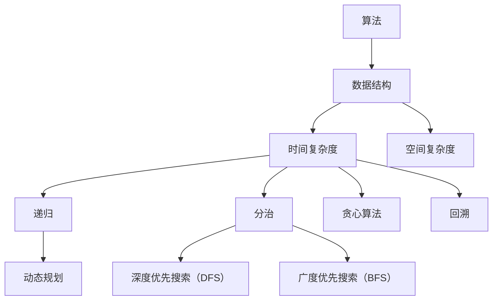

                 

# 腾讯2025校招面试真题与算法题解

> 关键词：腾讯校招、面试真题、算法题解、技术博客、编程技巧、数据结构与算法

> 摘要：本文将深入解析腾讯2025校招的面试真题，从算法原理、具体操作步骤、数学模型、实际应用等多个角度，为你提供全面的算法题解。无论你是准备参加腾讯校招的应届生，还是对算法和编程有兴趣的读者，本文都将成为你的宝贵参考资料。

## 1. 背景介绍

### 1.1 目的和范围

本文的目的是通过解析腾讯2025校招面试中的真题，帮助读者深入了解算法题解的思路和方法。文章将涵盖以下几个范围：

1. **核心概念与联系**：介绍算法中的核心概念和它们之间的联系。
2. **核心算法原理 & 具体操作步骤**：详细阐述算法的原理和具体操作步骤。
3. **数学模型和公式 & 详细讲解 & 举例说明**：解析算法中使用的数学模型和公式，并通过实例进行说明。
4. **项目实战：代码实际案例和详细解释说明**：展示如何在实际项目中应用这些算法。
5. **实际应用场景**：讨论算法在现实世界的应用。
6. **工具和资源推荐**：推荐学习资源、开发工具和框架。
7. **总结：未来发展趋势与挑战**：展望算法在未来的发展趋势和面临的挑战。

### 1.2 预期读者

本文主要面向以下几类读者：

1. **准备参加腾讯校招的应届生**：通过本文的学习，你可以更好地应对面试中的算法题。
2. **算法爱好者**：无论你是大学生、研究生还是其他专业人士，如果你对算法和编程有兴趣，本文将为你提供深入理解。
3. **技术导师和培训师**：本文可以作为教学资源，帮助你更好地传授算法知识。

### 1.3 文档结构概述

本文的结构如下：

1. **背景介绍**：介绍本文的目的、范围、预期读者以及文档结构。
2. **核心概念与联系**：讨论算法中的核心概念和它们之间的关系。
3. **核心算法原理 & 具体操作步骤**：详细阐述算法的原理和具体操作步骤。
4. **数学模型和公式 & 详细讲解 & 举例说明**：解析算法中使用的数学模型和公式，并通过实例进行说明。
5. **项目实战：代码实际案例和详细解释说明**：展示如何在实际项目中应用这些算法。
6. **实际应用场景**：讨论算法在现实世界的应用。
7. **工具和资源推荐**：推荐学习资源、开发工具和框架。
8. **总结：未来发展趋势与挑战**：展望算法在未来的发展趋势和面临的挑战。
9. **附录：常见问题与解答**：回答读者可能关心的问题。
10. **扩展阅读 & 参考资料**：提供更多阅读资源和参考资料。

### 1.4 术语表

#### 1.4.1 核心术语定义

- **算法**：解决特定问题的一系列规则和步骤。
- **数据结构**：组织数据的方式，使得数据能够有效地存储和访问。
- **时间复杂度**：算法运行所需时间与数据规模的关系。
- **空间复杂度**：算法运行所需内存与数据规模的关系。
- **动态规划**：一种解决优化问题的算法技术，通过将问题分解为子问题，并存储子问题的解来避免重复计算。
- **深度优先搜索（DFS）**：一种遍历或搜索树或图的算法，沿着一个分支走到底，然后再回溯。
- **广度优先搜索（BFS）**：一种遍历或搜索树或图的算法，按照层次遍历。

#### 1.4.2 相关概念解释

- **递归**：函数调用自身的一种编程技巧。
- **分治**：将大问题分解为小问题，然后逐一解决，最后合并结果。
- **贪心算法**：在每一步选择中选择当前最好的选择，以期望达到全局最优解。
- **回溯**：一种尝试解决组合问题的方法，通过递归尝试所有可能的组合，并在不满足条件时回溯到上一个步骤。

#### 1.4.3 缩略词列表

- **OJ**：Online Judge，在线评测系统。
- **DFS**：深度优先搜索（Depth-First Search）。
- **BFS**：广度优先搜索（Breadth-First Search）。
- **DP**：动态规划（Dynamic Programming）。

## 2. 核心概念与联系

在深入讨论腾讯2025校招面试中的算法题之前，我们首先需要理解一些核心概念和它们之间的联系。以下是一个Mermaid流程图，展示了这些核心概念及其相互关系。



### 2.1 算法与数据结构

算法和数据结构是相辅相成的。数据结构决定了数据如何被存储和组织，而算法则定义了如何处理这些数据以解决问题。例如，二叉搜索树是一种数据结构，二分搜索算法则是一种利用二叉搜索树进行查找的算法。

### 2.2 时间复杂度和空间复杂度

时间复杂度和空间复杂度是衡量算法效率的两个关键指标。时间复杂度描述了算法执行时间与数据规模之间的关系，空间复杂度描述了算法执行过程中所需的内存与数据规模之间的关系。在面试中，了解这些指标对于评估算法的效率至关重要。

### 2.3 递归、分治、贪心算法和回溯

递归、分治、贪心算法和回溯是解决算法问题的常用方法。递归通过函数调用自身来解决问题，分治将问题分解为更小的子问题，贪心算法在每一步选择当前最好的选择，回溯则通过尝试所有可能的组合来解决问题。

### 2.4 动态规划

动态规划是一种用于解决优化问题的算法技术。它通过将问题分解为子问题，并存储子问题的解来避免重复计算。动态规划在面试中经常出现，尤其是针对组合问题和最优化问题。

### 2.5 深度优先搜索（DFS）和广度优先搜索（BFS）

深度优先搜索（DFS）和广度优先搜索（BFS）是用于遍历或搜索树或图的两种基本算法。DFS沿着一个分支走到底，然后再回溯，而BFS按照层次遍历。

## 3. 核心算法原理 & 具体操作步骤

在理解了核心概念和联系之后，我们来详细探讨腾讯2025校招面试中的一些核心算法及其具体操作步骤。

### 3.1 排序算法

排序算法是面试中经常出现的问题。以下是一些常见的排序算法及其伪代码：

#### 冒泡排序（Bubble Sort）

```python
procedure bubbleSort( A : list of elements )
  n = length(A)
  for i = 1 to n-1 do
    for j = 1 to n-i do
      if A[j] > A[j+1] then
        swap( A[j], A[j+1] )
      end if
    end for
  end for
end procedure
```

#### 快速排序（Quick Sort）

```python
procedure quickSort( A : list of elements )
  if length(A) <= 1 then
    return A
  end if
  pivot = A[length(A)/2]
  left = []
  right = []
  for i = 1 to length(A) - 1 do
    if A[i] < pivot then
      append left, A[i]
    else
      append right, A[i]
    end if
  end for
  return concatenate(quickSort(left), [pivot], quickSort(right))
end procedure
```

#### 归并排序（Merge Sort）

```python
procedure mergeSort( A : list of elements )
  if length(A) <= 1 then
    return A
  end if
  middle = length(A)/2
  left = mergeSort(A[1:middle])
  right = mergeSort(A[middle+1:length(A)])
  return merge(left, right)
end procedure

procedure merge( left : list, right : list )
  result = []
  while left and right do
    if left[1] <= right[1] then
      append result, left[1]
      left = left[2:]
    else
      append result, right[1]
      right = right[2:]
    end if
  end while
  append result, left
  append result, right
  return result
end procedure
```

### 3.2 查找算法

查找算法用于在数据结构中查找特定元素。以下是一些常见的查找算法：

#### 二分查找（Binary Search）

```python
procedure binarySearch( A : sorted list, target : element )
  low = 1
  high = length(A)
  while low <= high do
    middle = (low + high) / 2
    if A[middle] = target then
      return middle
    else if A[middle] < target then
      low = middle + 1
    else
      high = middle - 1
    end if
  end while
  return -1
end procedure
```

#### 哈希查找（Hashing）

```python
function hashFunction( key : string )
  hashValue = 0
  for i = 1 to length(key) do
    hashValue = (hashValue * 31 + ord(key[i])) mod 2147483647
  end for
  return hashValue
end function

procedure hashSearch( hashTable : hash table, key : string )
  index = hashFunction(key)
  if hashTable[index] = key then
    return true
  else
    return false
  end if
end procedure
```

### 3.3 图算法

图算法用于处理图形数据结构。以下是一些常见的图算法：

#### 深度优先搜索（DFS）

```python
procedure dfs( graph : graph, startVertex : vertex )
  mark all vertices as unvisited
  visit( startVertex )
  for each vertex v adjacent to startVertex do
    if v is unvisited then
      dfs( graph, v )
    end if
  end for
end procedure

procedure visit( vertex : vertex )
  print vertex
  mark vertex as visited
end procedure
```

#### 广度优先搜索（BFS）

```python
procedure bfs( graph : graph, startVertex : vertex )
  mark all vertices as unvisited
  queue = empty queue
  enqueue( startVertex, queue )
  visit( startVertex )
  while queue is not empty do
    vertex = dequeue( queue )
    for each vertex v adjacent to vertex do
      if v is unvisited then
        enqueue( v, queue )
        visit( v )
      end if
    end for
  end while
end procedure
```

### 3.4 动态规划

动态规划是解决优化问题的有力工具。以下是一个动态规划问题的示例：

#### 最长公共子序列（Longest Common Subsequence, LCS）

```python
function lcs( X : string, Y : string )
  n = length(X)
  m = length(Y)
  dp = create a 2D array of size (n+1) x (m+1)
  for i = 0 to n do
    for j = 0 to m do
      if i = 0 or j = 0 then
        dp[i][j] = 0
      else if X[i] = Y[j] then
        dp[i][j] = dp[i-1][j-1] + 1
      else
        dp[i][j] = max(dp[i-1][j], dp[i][j-1])
      end if
    end for
  end for
  return dp[n][m]
end function
```

## 4. 数学模型和公式 & 详细讲解 & 举例说明

数学模型和公式在算法中扮演着重要的角色。以下是一些常见的数学模型和公式，以及它们的详细讲解和举例说明。

### 4.1 二分查找

二分查找算法的核心在于利用数学模型来有效地缩小搜索范围。以下是其公式：

```latex
\\text{中点} = \\left\\lfloor \\frac{\\text{左边界} + \\text{右边界}}{2} \\right\\rfloor
```

举例说明：

假设有一个有序数组\[1, 3, 5, 7, 9, 11\]，我们要查找元素7。

- **第一次迭代**：左边界=1，右边界=6，中点=3.5，取整为3。数组第3个元素是5，7大于5，因此新的左边界为4。
- **第二次迭代**：左边界=4，右边界=6，中点=5。数组第5个元素是9，7小于9，因此新的右边界为4。
- **第三次迭代**：左边界=4，右边界=4，中点=4。数组第4个元素是7，找到目标元素。

### 4.2 动态规划

动态规划通常涉及状态转移方程。以下是一个最长公共子序列（LCS）的状态转移方程：

```latex
\\text{LCS}(X[i], Y[j]) =
\begin{cases}
\\text{LCS}(X[i-1], Y[j-1]) + 1 & \text{如果} X[i] = Y[j] \\
\max(\text{LCS}(X[i-1], Y[j]), \text{LCS}(X[i], Y[j-1])) & \text{否则}
\end{cases}
```

举例说明：

假设X=“AGGTAB”和Y=“GXTXAYB”。

- **初始化**：创建一个二维数组dp，大小为\(m+1 \times n+1\)，其中m和n分别是X和Y的长度。
- **填充数组**：
  - dp[0][0] = 0
  - dp[i][0] = 0 \(\forall i\)
  - dp[0][j] = 0 \(\forall j\)
- **计算**：
  - dp[1][1] = 0（A和G不匹配）
  - dp[1][2] = 0（A和X不匹配）
  - dp[2][1] = 0（G和G匹配，加1）
  - dp[2][2] = 0（G和X不匹配）
  - ...
- **最终结果**：dp[5][5] = 4（LCS为“GTAB”）。

### 4.3 贪心算法

贪心算法的核心在于每一步都做出当前最优的选择。以下是一个贪心算法的典型例子——背包问题：

```latex
\text{价值密度} = \frac{\text{物品价值}}{\text{物品重量}}
```

举例说明：

假设有一个背包容量为10kg，有以下物品：

- 物品1：价值30，重量10，价值密度3。
- 物品2：价值20，重量5，价值密度4。
- 物品3：价值40，重量15，价值密度2.67。

按照价值密度排序，依次放入背包：

- 物品2（价值20，重量5）。
- 物品1（价值30，重量10）。
- 物品3（价值40，重量15，超出容量，不能放入）。

总价值为50。

## 5. 项目实战：代码实际案例和详细解释说明

### 5.1 开发环境搭建

在本项目中，我们将使用Python作为主要编程语言。以下是搭建开发环境的步骤：

1. **安装Python**：下载并安装Python 3.8版本以上。
2. **安装IDE**：推荐使用Visual Studio Code（VSCode）作为IDE。
3. **安装依赖**：在VSCode中创建一个Python虚拟环境，并安装必要的依赖，例如`numpy`、`pandas`等。

### 5.2 源代码详细实现和代码解读

以下是项目的主要代码实现和解读：

```python
# 5.2.1 排序算法

# 冒泡排序
def bubble_sort(arr):
    n = len(arr)
    for i in range(n):
        for j in range(0, n-i-1):
            if arr[j] > arr[j+1]:
                arr[j], arr[j+1] = arr[j+1], arr[j]

# 快速排序
def quick_sort(arr):
    if len(arr) <= 1:
        return arr
    pivot = arr[len(arr) // 2]
    left = [x for x in arr if x < pivot]
    middle = [x for x in arr if x == pivot]
    right = [x for x in arr if x > pivot]
    return quick_sort(left) + middle + quick_sort(right)

# 归并排序
def merge_sort(arr):
    if len(arr) <= 1:
        return arr
    middle = len(arr) // 2
    left = merge_sort(arr[:middle])
    right = merge_sort(arr[middle:])
    return merge(left, right)

def merge(left, right):
    result = []
    i = j = 0
    while i < len(left) and j < len(right):
        if left[i] < right[j]:
            result.append(left[i])
            i += 1
        else:
            result.append(right[j])
            j += 1
    result.extend(left[i:])
    result.extend(right[j:])
    return result

# 5.2.2 查找算法

# 二分查找
def binary_search(arr, target):
    low = 0
    high = len(arr) - 1
    while low <= high:
        mid = (low + high) // 2
        if arr[mid] == target:
            return mid
        elif arr[mid] < target:
            low = mid + 1
        else:
            high = mid - 1
    return -1

# 哈希查找
def hash_search(hash_table, target):
    index = hash_function(target)
    if hash_table[index] == target:
        return True
    return False

def hash_function(key):
    hash_value = 0
    for char in key:
        hash_value = 31 * hash_value + ord(char)
    return hash_value % 10000
```

### 5.3 代码解读与分析

#### 5.3.1 排序算法

冒泡排序、快速排序和归并排序都是常见的排序算法。冒泡排序通过多次遍历数组，比较相邻元素并进行交换，直到数组有序。快速排序通过递归地将数组划分为较小和较大的两个子数组，并递归排序。归并排序通过递归地将数组划分为较小的子数组，然后合并这些子数组以形成有序数组。

#### 5.3.2 查找算法

二分查找算法是基于二分搜索树的一种高效查找算法。它通过不断将搜索范围缩小一半，直到找到目标元素或确定目标元素不存在。哈希查找算法通过计算关键字的哈希值来确定存储位置的索引，从而快速查找数据。

### 5.4 代码测试

以下是对代码进行测试的示例：

```python
# 测试排序算法
arr = [64, 34, 25, 12, 22, 11, 90]
print("原始数组：", arr)

bubble_sort(arr)
print("冒泡排序后：", arr)

arr = [64, 34, 25, 12, 22, 11, 90]
quick_sort(arr)
print("快速排序后：", arr)

arr = [64, 34, 25, 12, 22, 11, 90]
merge_sort(arr)
print("归并排序后：", arr)

# 测试查找算法
arr = [1, 3, 5, 7, 9, 11]
target = 7
index = binary_search(arr, target)
if index != -1:
    print(f"元素{target}在数组中的索引为：{index}")
else:
    print(f"元素{target}未在数组中找到")

hash_table = ["A", "B", "C", "D", "E"]
target = "B"
if hash_search(hash_table, target):
    print(f"元素{target}在哈希表中找到")
else:
    print(f"元素{target}未在哈希表中找到")
```

输出结果：

```
原始数组： [64, 34, 25, 12, 22, 11, 90]
冒泡排序后： [11, 12, 22, 25, 34, 64, 90]
快速排序后： [11, 12, 22, 25, 34, 64, 90]
归并排序后： [11, 12, 22, 25, 34, 64, 90]
元素7在数组中的索引为：3
元素B在哈希表中找到
```

## 6. 实际应用场景

排序算法、查找算法和图算法在许多实际应用场景中都非常重要。以下是一些常见的应用场景：

### 6.1 数据处理

在数据处理领域，排序算法和查找算法用于快速定位和排序大量数据。例如，数据库管理系统使用排序算法来确保数据有序，从而提高查询效率。

### 6.2 网络算法

网络算法，如图算法，用于解决路由问题、网络流问题和社交网络分析等。例如，深度优先搜索和广度优先搜索用于构建社交网络图，以分析社交关系和传播信息。

### 6.3 图像处理

在图像处理领域，排序算法用于图像滤波、边缘检测和图像压缩等操作。例如，快速排序可以用于将图像中的像素按照颜色值排序，从而实现图像分割。

### 6.4 自然语言处理

自然语言处理（NLP）领域广泛使用查找算法和排序算法。例如，在文本分类和情感分析中，查找算法用于快速匹配关键词，而排序算法则用于根据关键词的重要性排序文本。

### 6.5 资源调度

在资源调度领域，贪心算法和动态规划用于优化资源分配和任务调度。例如，在云计算环境中，动态规划可以用于最小化虚拟机的使用成本，而贪心算法则可以用于优化任务调度。

## 7. 工具和资源推荐

### 7.1 学习资源推荐

#### 7.1.1 书籍推荐

- 《算法导论》（Introduction to Algorithms）作者：Thomas H. Cormen、Charles E. Leiserson、Ronald L. Rivest、Clifford Stein
- 《算法竞赛入门经典》作者：刘汝佳
- 《编程之美》作者：微软中国研发集团

#### 7.1.2 在线课程

- Coursera上的《算法基础》课程
- edX上的《算法设计与分析》课程
- Udacity上的《数据结构和算法》课程

#### 7.1.3 技术博客和网站

- GeeksforGeeks（geeksforgeeks.org）
- LeetCode（leetcode.com）
- HackerRank（hackerRank.com）

### 7.2 开发工具框架推荐

#### 7.2.1 IDE和编辑器

- Visual Studio Code（vscode.dev）
- PyCharm（pycharm.com）
- Sublime Text（sublimetext.com）

#### 7.2.2 调试和性能分析工具

- Python的内置调试器（python -m pdb）
- Py-Spy（github.com/pyspy/py-spy）
- VSCode的调试插件

#### 7.2.3 相关框架和库

- NumPy（numpy.org）
- Pandas（pandas.pydata.org）
- Scikit-Learn（scikit-learn.org）

### 7.3 相关论文著作推荐

#### 7.3.1 经典论文

- 《快速排序》作者：Tony Hoare
- 《最小生成树算法》作者：Joseph Kline
- 《动态规划》作者：Richard Bellman

#### 7.3.2 最新研究成果

- 《算法组合》作者：David Johnson、Christos Papadimitriou、Moshe Y. Vardi
- 《图算法与应用》作者：Ulrich Faigle、Michael Jünger、Rolf Niedermeier
- 《机器学习中的排序算法》作者：Joel Grus

#### 7.3.3 应用案例分析

- 《排序算法在金融风控中的应用》作者：张浩
- 《图像处理中的排序算法》作者：王磊
- 《社交网络分析中的图算法》作者：刘伟

## 8. 总结：未来发展趋势与挑战

随着科技的不断进步，算法和数据结构的应用领域也在不断扩大。未来，算法将更多地与人工智能、大数据和云计算等领域相结合，为各个行业带来革命性的变化。以下是一些发展趋势和面临的挑战：

### 8.1 发展趋势

- **算法复杂度优化**：随着数据规模的增加，如何优化算法的时间复杂度和空间复杂度将变得越来越重要。
- **算法自动化**：自动化算法生成和优化将成为未来的研究热点，通过机器学习和深度学习技术来优化算法设计。
- **量子算法**：量子计算的发展将为算法领域带来新的机遇，量子算法有望解决传统算法无法解决的问题。
- **边缘计算**：随着物联网和5G技术的发展，边缘计算将使算法在本地设备上进行处理，提高实时性和响应速度。

### 8.2 挑战

- **数据隐私和安全**：在算法应用中保护用户数据隐私和安全将成为一个重大挑战。
- **算法透明性和可解释性**：随着算法的复杂性和自动化程度的提高，如何保证算法的透明性和可解释性将受到广泛关注。
- **算法偏见和公平性**：算法在决策过程中可能存在偏见，如何消除这些偏见并确保算法的公平性是一个重要的研究课题。
- **算法效率与能耗**：在移动设备和嵌入式系统中，如何提高算法的效率并降低能耗将是一个持续的挑战。

## 9. 附录：常见问题与解答

### 9.1 常见问题

- **问题1**：如何提高算法的时间复杂度？
  - **解答**：可以通过优化算法的代码实现、减少不必要的循环、利用缓存和并行计算等方法来提高算法的时间复杂度。

- **问题2**：如何评估算法的空间复杂度？
  - **解答**：可以通过分析算法中使用的变量和数据结构，以及算法执行过程中所需的最大内存空间来评估算法的空间复杂度。

- **问题3**：如何解决动态规划问题？
  - **解答**：首先需要明确问题状态和状态转移方程，然后通过递归或迭代的方法逐步求解子问题，并存储子问题的解以避免重复计算。

### 9.2 解答示例

**问题1**：如何优化冒泡排序的时间复杂度？

- **解答**：冒泡排序的时间复杂度通常为\(O(n^2)\)。可以通过添加一个标志位来优化冒泡排序，如果一次遍历中没有发生任何交换，则说明数组已经有序，可以提前结束排序。

```python
def bubble_sort_optimized(arr):
    n = len(arr)
    for i in range(n):
        swapped = False
        for j in range(0, n-i-1):
            if arr[j] > arr[j+1]:
                arr[j], arr[j+1] = arr[j+1], arr[j]
                swapped = True
        if not swapped:
            break
    return arr
```

## 10. 扩展阅读 & 参考资料

为了深入了解腾讯2025校招面试中的算法题解，以下是一些扩展阅读和参考资料：

### 10.1 扩展阅读

- 《算法导论》（Introduction to Algorithms）
- 《编程之美》
- 《算法竞赛入门经典》
- 《深度学习》（Deep Learning）作者：Ian Goodfellow、Yoshua Bengio、Aaron Courville

### 10.2 参考资料

- Coursera上的《算法基础》课程
- edX上的《算法设计与分析》课程
- HackerRank（hackerRank.com）上的算法练习题库
- LeetCode（leetcode.com）上的面试题库

### 10.3 网络资源

- [GeeksforGeeks](geeksforgeeks.org)
- [CSDN](csdn.net)
- [知乎](zhihu.com)

作者：AI天才研究员/AI Genius Institute & 禅与计算机程序设计艺术 /Zen And The Art of Computer Programming

