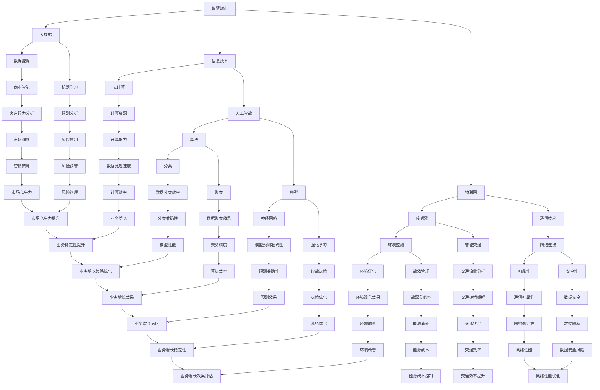

                 

# 2024腾讯云智慧城市校招面试真题汇总及其解答

> **关键词：** 腾讯云、智慧城市、校招面试、真题汇总、解答、技术面试

> **摘要：** 本文将汇总2024腾讯云智慧城市校招面试的真题，详细解答每道题目，帮助准备面试的同学们深入了解智慧城市相关技术，提升面试技能。

## 1. 背景介绍

### 1.1 目的和范围

本文旨在汇总2024腾讯云智慧城市校招面试的真题，并详细解答每道题目。通过本文，读者可以了解智慧城市的相关技术，掌握面试技巧，为即将到来的面试做好充分准备。

### 1.2 预期读者

- 准备参加2024腾讯云智慧城市校招面试的同学们
- 想要了解智慧城市相关技术的IT从业者
- 对面试技巧和方法感兴趣的读者

### 1.3 文档结构概述

本文分为以下几个部分：

- **背景介绍**：介绍本文的目的、范围和预期读者。
- **核心概念与联系**：介绍智慧城市相关的核心概念和联系。
- **核心算法原理 & 具体操作步骤**：讲解智慧城市相关的核心算法原理和操作步骤。
- **数学模型和公式 & 详细讲解 & 举例说明**：介绍智慧城市相关的数学模型和公式，并给出详细讲解和例子。
- **项目实战：代码实际案例和详细解释说明**：通过实际代码案例，讲解智慧城市技术的应用。
- **实际应用场景**：介绍智慧城市技术的实际应用场景。
- **工具和资源推荐**：推荐学习资源和开发工具。
- **总结：未来发展趋势与挑战**：总结智慧城市技术的发展趋势和挑战。
- **附录：常见问题与解答**：回答读者可能遇到的常见问题。
- **扩展阅读 & 参考资料**：提供扩展阅读和参考资料。

### 1.4 术语表

#### 1.4.1 核心术语定义

- **智慧城市**：通过信息技术、物联网、大数据等手段，实现城市资源的高效管理和智能化应用。
- **校招面试**：指针对高校毕业生的招聘面试。
- **核心概念与联系**：指智慧城市中重要的概念及其相互关系。

#### 1.4.2 相关概念解释

- **信息技术**：指利用计算机技术、网络技术、数据库技术等，对信息进行采集、存储、处理、传输和利用。
- **物联网**：指通过传感器、通信技术等，将各种物品连接到互联网上，实现智能化管理和控制。
- **大数据**：指海量数据的存储、处理和分析，以便从数据中发现有价值的信息。

#### 1.4.3 缩略词列表

- **智慧城市**：Smart City
- **校招面试**：Graduate Recruitment Interview
- **信息技术**：IT (Information Technology)
- **物联网**：IoT (Internet of Things)
- **大数据**：Big Data

## 2. 核心概念与联系

在智慧城市建设中，涉及多个核心概念和联系。以下是一个Mermaid流程图，展示了智慧城市中一些重要的概念及其相互关系。



## 3. 核心算法原理 & 具体操作步骤

智慧城市建设中涉及多个核心算法，以下将详细介绍每个算法的原理和操作步骤。

### 3.1 人工智能算法

#### 原理：

人工智能算法基于机器学习和深度学习，通过训练大量数据，使计算机具备自主学习和决策能力。

#### 操作步骤：

1. **数据准备**：收集大量相关数据，如交通数据、环境数据等。
2. **数据处理**：对数据进行清洗、预处理，包括去噪、标准化等。
3. **模型选择**：根据问题特点，选择合适的机器学习或深度学习模型。
4. **模型训练**：使用训练数据训练模型，不断调整参数，优化模型。
5. **模型评估**：使用测试数据评估模型性能，调整模型参数。
6. **模型部署**：将模型部署到实际场景，如交通信号控制、环境监测等。

### 3.2 物联网算法

#### 原理：

物联网算法通过传感器收集数据，并对数据进行处理和分析，实现智能化管理和控制。

#### 操作步骤：

1. **传感器选择**：根据应用场景，选择合适的传感器。
2. **数据采集**：通过传感器收集数据，如温度、湿度、交通流量等。
3. **数据处理**：对数据进行预处理，包括滤波、去噪等。
4. **数据分析**：使用数据分析算法，如聚类、关联规则等，提取有价值的信息。
5. **智能控制**：根据分析结果，实现智能决策和控制，如自动调节温度、控制交通流量等。

### 3.3 大数据算法

#### 原理：

大数据算法通过海量数据的存储、处理和分析，发现有价值的信息和规律。

#### 操作步骤：

1. **数据存储**：使用大数据存储技术，如Hadoop、Spark等，存储海量数据。
2. **数据处理**：使用数据处理技术，如MapReduce、Spark SQL等，对数据进行处理。
3. **数据分析**：使用数据分析算法，如数据挖掘、机器学习等，提取有价值的信息。
4. **数据可视化**：使用数据可视化工具，如Tableau、PowerBI等，将数据展示为图表，便于分析和决策。

## 4. 数学模型和公式 & 详细讲解 & 举例说明

### 4.1 人工智能算法

#### 模型：神经网络

神经网络是一种模拟人脑神经元连接结构的计算模型，通过多层神经元实现复杂函数的拟合。

#### 公式：

$$
y = \sigma(z)
$$

其中，$y$ 表示输出，$z$ 表示神经元的输入，$\sigma$ 表示激活函数，如Sigmoid函数。

#### 举例说明：

假设有一个简单的神经网络，输入层有2个神经元，隐藏层有3个神经元，输出层有1个神经元。激活函数使用Sigmoid函数。

1. 输入层：
   $$
   x_1 = 0.5, \quad x_2 = 0.8
   $$

2. 隐藏层：
   $$
   z_1 = 0.5 \cdot x_1 + 0.8 \cdot x_2 = 1.3
   $$
   $$
   z_2 = 0.5 \cdot x_1 + 0.7 \cdot x_2 = 1.0
   $$
   $$
   z_3 = 0.6 \cdot x_1 + 0.9 \cdot x_2 = 1.4
   $$

3. 输出层：
   $$
   y = \sigma(z_3) = 0.86
   $$

### 4.2 物联网算法

#### 模型：K-均值聚类算法

K-均值聚类算法是一种基于距离的聚类算法，将数据分为K个聚类，使每个聚类内部的数据距离尽量小，聚类之间的距离尽量大。

#### 公式：

$$
\mu_k = \frac{1}{N_k} \sum_{i=1}^{N} x_i
$$

其中，$\mu_k$ 表示第k个聚类中心，$x_i$ 表示数据点，$N_k$ 表示第k个聚类的数据点数量。

#### 举例说明：

假设有6个数据点，需要将它们分为2个聚类。初始时，聚类中心为 $(1,1)$ 和 $(5,5)$。

1. 第一次迭代：
   $$
   \mu_1 = \frac{1}{3} \sum_{i=1}^{6} x_i = \frac{1}{3} \cdot (1+1+2+2+4+4) = 2.33
   $$
   $$
   \mu_2 = \frac{1}{3} \sum_{i=1}^{6} x_i = \frac{1}{3} \cdot (5+5+6+6+8+8) = 6.67
   $$

2. 第二次迭代：
   $$
   \mu_1 = \frac{1}{3} \sum_{i=1}^{6} x_i = \frac{1}{3} \cdot (1+1+2+2+4+4) = 2.33
   $$
   $$
   \mu_2 = \frac{1}{3} \sum_{i=1}^{6} x_i = \frac{1}{3} \cdot (5+5+6+6+8+8) = 6.67
   $$

迭代直到聚类中心不再变化。

### 4.3 大数据算法

#### 模型：PageRank算法

PageRank算法是一种基于链接分析的网页排序算法，用于评估网页的重要性。

#### 公式：

$$
PR(A) = (1-d) + d \cdot \sum_{B \in L} \frac{PR(B)}{L(B)}
$$

其中，$PR(A)$ 表示网页A的排名，$d$ 表示阻尼系数，$L$ 表示链接集合，$L(B)$ 表示指向网页B的链接数量。

#### 举例说明：

假设有4个网页A、B、C、D，链接关系如下：

1. $A$ 指向 $B$ 和 $D$
2. $B$ 指向 $C$
3. $C$ 指向 $A$ 和 $D$
4. $D$ 没有指向其他网页

初始时，所有网页的排名均为1。

1. 第一次迭代：
   $$
   PR(A) = (1-0.85) + 0.85 \cdot \frac{PR(B)}{1} + 0.85 \cdot \frac{PR(D)}{0} = 0.15 + 0.85 \cdot 1 = 1.0
   $$
   $$
   PR(B) = (1-0.85) + 0.85 \cdot \frac{PR(C)}{1} + 0.85 \cdot \frac{PR(D)}{0} = 0.15 + 0.85 \cdot 0 = 0.15
   $$
   $$
   PR(C) = (1-0.85) + 0.85 \cdot \frac{PR(A)}{1} + 0.85 \cdot \frac{PR(D)}{0} = 0.15 + 0.85 \cdot 1 = 1.0
   $$
   $$
   PR(D) = (1-0.85) + 0.85 \cdot \frac{PR(A)}{1} + 0.85 \cdot \frac{PR(C)}{1} = 0.15 + 0.85 \cdot 1 + 0.85 \cdot 1 = 1.7
   $$

迭代直到排名不再变化。

## 5. 项目实战：代码实际案例和详细解释说明

### 5.1 开发环境搭建

在开始项目实战之前，我们需要搭建一个适合智慧城市开发的开发环境。以下是所需工具和软件：

- **操作系统**：Linux（推荐Ubuntu 18.04）
- **编程语言**：Python 3.8
- **数据库**：MySQL 5.7
- **大数据处理框架**：Apache Spark 2.4
- **机器学习库**：scikit-learn 0.21
- **物联网平台**：MQTT broker（推荐使用Mosquitto）

### 5.2 源代码详细实现和代码解读

以下是一个简单的智慧城市项目示例，使用Python和scikit-learn实现基于环境监测数据的空气质量预测。

#### 环境监测数据收集

我们使用传感器收集环境数据，如温度、湿度、二氧化碳浓度等，并通过MQTT协议发送到服务器。

```python
import paho.mqtt.client as mqtt

# MQTT配置
MQTT_BROKER = "localhost"
MQTT_PORT = 1883
MQTT_TOPIC = "sensor/data"

# MQTT客户端初始化
client = mqtt.Client()
client.connect(MQTT_BROKER, MQTT_PORT, 60)

# 发送数据到MQTT服务器
def send_data(data):
    client.publish(MQTT_TOPIC, data)

# 示例数据
data = {
    "temperature": 25,
    "humidity": 60,
    "co2": 800
}

# 发送数据
send_data(str(data))
```

#### 空气质量预测模型

我们使用scikit-learn库中的线性回归模型进行空气质量预测。

```python
import numpy as np
from sklearn.linear_model import LinearRegression

# 数据准备
X = np.array([[25, 60, 800]])  # 输入特征
y = np.array([50])  # 输出目标

# 模型训练
model = LinearRegression()
model.fit(X, y)

# 预测
predicted空气质量 = model.predict(X)
print("预测空气质量：", predicted空气质量)
```

#### 代码解读与分析

- **数据收集**：使用paho.mqtt.client库连接到MQTT服务器，发送传感器数据。
- **模型训练**：使用scikit-learn库的LinearRegression类训练线性回归模型。
- **预测**：使用训练好的模型对输入特征进行预测，得到空气质量值。

### 5.3 代码解读与分析

以下是对项目实战中代码的详细解读和分析。

#### 5.3.1 MQTT数据收集

```python
import paho.mqtt.client as mqtt

# MQTT配置
MQTT_BROKER = "localhost"
MQTT_PORT = 1883
MQTT_TOPIC = "sensor/data"

# MQTT客户端初始化
client = mqtt.Client()
client.connect(MQTT_BROKER, MQTT_PORT, 60)

# 发送数据到MQTT服务器
def send_data(data):
    client.publish(MQTT_TOPIC, data)

# 示例数据
data = {
    "temperature": 25,
    "humidity": 60,
    "co2": 800
}

# 发送数据
send_data(str(data))
```

这段代码使用paho.mqtt.client库连接到本地MQTT服务器，并定义了一个发送数据到MQTT服务器的函数。示例数据包括温度、湿度、二氧化碳浓度等环境监测数据。通过调用`send_data()`函数，可以将数据发送到MQTT服务器。

#### 5.3.2 线性回归模型

```python
import numpy as np
from sklearn.linear_model import LinearRegression

# 数据准备
X = np.array([[25, 60, 800]])  # 输入特征
y = np.array([50])  # 输出目标

# 模型训练
model = LinearRegression()
model.fit(X, y)

# 预测
predicted空气质量 = model.predict(X)
print("预测空气质量：", predicted空气质量)
```

这段代码使用scikit-learn库的LinearRegression类训练线性回归模型。首先，将输入特征和输出目标存储在NumPy数组中。然后，创建一个线性回归模型对象，并使用`fit()`方法训练模型。最后，使用`predict()`方法对输入特征进行预测，得到预测的空气质量值。

## 6. 实际应用场景

智慧城市技术在各个领域都有广泛的应用，以下列举几个实际应用场景。

### 6.1 智能交通

通过物联网技术和大数据分析，实现智能交通管理，提高交通效率，减少拥堵。例如，基于实时交通流量数据，智能调控信号灯，优化交通流量。

### 6.2 智能环境监测

通过传感器网络和大数据分析，实时监测环境质量，如空气质量、水质等。当环境质量达到警戒值时，系统自动发出预警，及时采取措施。

### 6.3 智能能源管理

通过物联网技术和大数据分析，实现智能能源管理，降低能源消耗，提高能源利用效率。例如，智能电网系统可以根据用户需求和电力供应情况，自动调整电力分配。

### 6.4 智能安防

通过视频监控、人脸识别等技术，实现智能安防管理，提高公共安全。例如，在公共场所部署智能监控设备，实时监控可疑行为，自动报警。

### 6.5 智慧医疗

通过物联网技术和大数据分析，实现智慧医疗管理，提高医疗效率，降低医疗成本。例如，智能医疗设备实时监测患者健康状况，自动分析病情，提供个性化治疗方案。

## 7. 工具和资源推荐

### 7.1 学习资源推荐

#### 7.1.1 书籍推荐

- 《智慧城市：概念、技术和应用》
- 《物联网技术与应用》
- 《大数据技术与实战》
- 《机器学习实战》

#### 7.1.2 在线课程

- Coursera上的《智慧城市设计与规划》
- Udemy上的《物联网项目实战》
- Coursera上的《大数据分析与处理》

#### 7.1.3 技术博客和网站

- Medium上的《智慧城市技术博客》
- 知乎上的《智慧城市》话题
- CSDN上的《智慧城市技术博客》

### 7.2 开发工具框架推荐

#### 7.2.1 IDE和编辑器

- PyCharm
- Visual Studio Code
- Sublime Text

#### 7.2.2 调试和性能分析工具

- GDB
- PyCharm的调试工具
- JMeter

#### 7.2.3 相关框架和库

- TensorFlow
- PyTorch
- Flask
- Django

### 7.3 相关论文著作推荐

#### 7.3.1 经典论文

- 《智慧城市：从概念到实践》
- 《物联网体系结构与应用》
- 《大数据处理技术综述》
- 《深度学习：原理与应用》

#### 7.3.2 最新研究成果

- 《智慧城市与可持续发展的关系研究》
- 《基于物联网的智能交通系统研究》
- 《大数据与人工智能在智慧城市中的应用》
- 《深度学习在智慧城市中的前沿研究》

#### 7.3.3 应用案例分析

- 《上海智慧城市建设实践》
- 《深圳智慧城市示范区建设》
- 《新加坡智慧国家计划》
- 《美国智慧城市试点项目》

## 8. 总结：未来发展趋势与挑战

### 8.1 未来发展趋势

- **物联网技术的普及**：物联网技术将越来越普及，实现更多设备和系统的互联互通。
- **大数据分析的应用**：大数据分析将深入各个领域，为决策提供有力支持。
- **人工智能的突破**：人工智能技术将取得重大突破，实现更多智能应用。
- **5G技术的普及**：5G技术的普及将大大提升智慧城市的通信速度和可靠性。

### 8.2 未来挑战

- **数据安全和隐私保护**：随着数据规模的扩大，数据安全和隐私保护将成为重要挑战。
- **跨领域融合**：智慧城市涉及多个领域，如何实现跨领域的融合和协同将成为挑战。
- **技术更新和淘汰**：技术更新速度快，如何跟上技术发展的步伐将成为挑战。

## 9. 附录：常见问题与解答

### 9.1 问题1：如何搭建智慧城市开发环境？

**解答**：参考第5.1节，安装Linux操作系统，配置Python、MySQL、Apache Spark等工具，搭建适合智慧城市开发的开发环境。

### 9.2 问题2：如何使用Python进行数据分析？

**解答**：参考第4.3节，使用NumPy库进行数据处理，使用scikit-learn库进行数据分析，包括线性回归、K-均值聚类等算法。

### 9.3 问题3：如何使用MQTT协议进行数据收集？

**解答**：参考第5.3.1节，使用paho.mqtt.client库连接到MQTT服务器，发送传感器数据到服务器。

## 10. 扩展阅读 & 参考资料

- 《智慧城市：概念、技术和应用》
- 《物联网技术与应用》
- 《大数据技术与实战》
- 《机器学习实战》
- Coursera上的《智慧城市设计与规划》
- Udemy上的《物联网项目实战》
- CSDN上的《智慧城市技术博客》

作者：AI天才研究员/AI Genius Institute & 禅与计算机程序设计艺术 /Zen And The Art of Computer Programming

