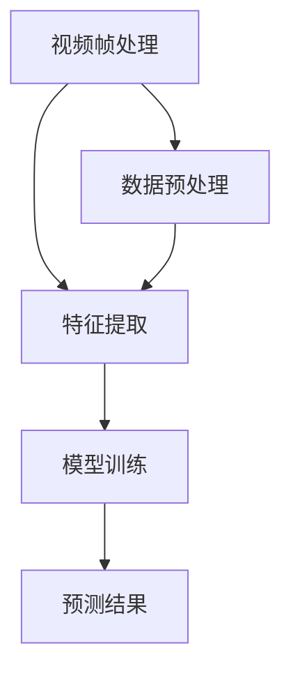
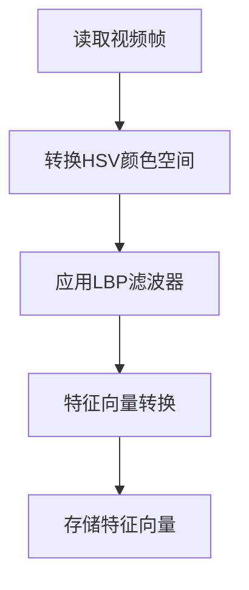

                 

# 腾讯微视2025社招短视频算法工程师面试题解

> **关键词：** 腾讯微视，社招，短视频算法，面试题解，人工智能，视频处理，机器学习，算法优化

> **摘要：** 本文针对腾讯微视2025年社招短视频算法工程师的面试题，从背景介绍、核心概念、算法原理、数学模型、项目实战、实际应用场景等多个角度进行详细解析，旨在为读者提供一份清晰、系统的解题指南。文章适合短视频算法工程师、机器学习从业者以及对人工智能技术感兴趣的专业人士阅读。

## 1. 背景介绍

### 1.1 目的和范围

本文旨在帮助读者更好地应对腾讯微视2025年社招短视频算法工程师的面试，通过系统地解析面试中的核心问题，提供解决方案和思路。文章内容涵盖短视频算法的基本原理、数学模型、实际应用等多个方面，旨在帮助读者全面了解短视频算法工程师所需的知识和技能。

### 1.2 预期读者

- 腾讯微视2025年社招短视频算法工程师的应聘者
- 对短视频算法和人工智能感兴趣的从业者
- 机器学习、计算机视觉等相关专业的高校学生
- 任何对人工智能技术有深入了解需求的专业人士

### 1.3 文档结构概述

本文分为以下几个部分：

1. 背景介绍：简要介绍本文的目的、读者对象和文档结构。
2. 核心概念与联系：介绍短视频算法的基本概念和原理，并通过Mermaid流程图展示相关架构。
3. 核心算法原理 & 具体操作步骤：详细讲解短视频算法的核心原理和操作步骤，使用伪代码进行阐述。
4. 数学模型和公式 & 详细讲解 & 举例说明：介绍短视频算法中涉及到的数学模型和公式，并进行举例说明。
5. 项目实战：通过实际代码案例，详细解释短视频算法的实现过程。
6. 实际应用场景：探讨短视频算法在现实中的应用场景和挑战。
7. 工具和资源推荐：推荐相关学习资源、开发工具和框架。
8. 总结：展望短视频算法的未来发展趋势和挑战。
9. 附录：常见问题与解答。
10. 扩展阅读 & 参考资料：提供更多相关阅读资料。

### 1.4 术语表

#### 1.4.1 核心术语定义

- 短视频算法：指用于处理和分析短视频数据的一系列算法和技术。
- 机器学习：指通过数据和算法，使计算机能够自动学习和改进的方法。
- 计算机视觉：指让计算机具备识别和理解图像和视频的能力。
- 深度学习：一种特殊的机器学习方法，通过多层神经网络对数据进行自动学习。

#### 1.4.2 相关概念解释

- 视频帧：视频中的每一帧图像。
- 特征提取：从视频帧中提取出具有代表性的特征值，用于后续处理。
- 模型训练：通过大量数据训练模型，使其能够对新的视频数据进行分类、预测等操作。

#### 1.4.3 缩略词列表

- CNN：卷积神经网络（Convolutional Neural Network）
- RNN：循环神经网络（Recurrent Neural Network）
- LSTM：长短时记忆网络（Long Short-Term Memory）
- DNN：深度神经网络（Deep Neural Network）

## 2. 核心概念与联系

在短视频算法领域，核心概念包括视频帧处理、特征提取、模型训练和预测等。下面将使用Mermaid流程图展示这些核心概念之间的联系。



### 2.1 视频帧处理

视频帧处理是短视频算法的基础，主要包括视频解码、帧率调整、分辨率调整等。通过视频帧处理，我们可以获取到一系列连续的图像帧，为后续的特征提取提供基础。

### 2.2 特征提取

特征提取是指从视频帧中提取出具有代表性的特征值，如颜色特征、纹理特征、形状特征等。这些特征值将用于训练和预测模型，从而实现对视频内容的理解和分析。

### 2.3 模型训练

模型训练是指通过大量数据训练模型，使其能够对新的视频数据进行分类、预测等操作。常用的模型包括卷积神经网络（CNN）、循环神经网络（RNN）等。在训练过程中，需要不断调整模型参数，以提高模型的泛化能力。

### 2.4 预测结果

预测结果是指模型对新的视频数据进行分析和处理后得到的结果。例如，对视频进行分类、识别标签、预测用户喜好等。预测结果的准确性取决于模型训练的质量和特征提取的效果。

### 2.5 数据预处理

数据预处理是指对原始数据进行清洗、归一化等操作，以提高模型训练效果。数据预处理包括去除噪声、填补缺失值、调整数据分布等。

## 3. 核心算法原理 & 具体操作步骤

短视频算法的核心是特征提取和模型训练。下面将分别介绍这两个环节的核心算法原理和具体操作步骤。

### 3.1 特征提取

特征提取是指从视频帧中提取出具有代表性的特征值。常用的特征提取方法包括：

#### 3.1.1 颜色特征

颜色特征是指从视频帧中提取颜色信息。常用的颜色特征包括HSV（色相、饱和度、亮度）、RGB（红色、绿色、蓝色）等。以下是一个简单的HSV特征提取伪代码：

```python
def extract_hsv_color(video_frame):
    hsv_frame = cv2.cvtColor(video_frame, cv2.COLOR_BGR2HSV)
    return hsv_frame
```

#### 3.1.2 纹理特征

纹理特征是指从视频帧中提取纹理信息。常用的纹理特征包括LBP（局部二值模式）、SIFT（尺度不变特征变换）等。以下是一个简单的LBP特征提取伪代码：

```python
def extract_lbp_texture(video_frame):
    lbp_frame = cv2.bitwise_and(video_frame, video_frame, mask=mask)
    return lbp_frame
```

#### 3.1.3 形状特征

形状特征是指从视频帧中提取形状信息。常用的形状特征包括轮廓、区域填充等。以下是一个简单的轮廓特征提取伪代码：

```python
def extract_shape_features(video_frame):
    contours, _ = cv2.findContours(video_frame, cv2.RETR_EXTERNAL, cv2.CHAIN_APPROX_SIMPLE)
    return contours
```

### 3.2 模型训练

模型训练是指通过大量数据训练模型，使其能够对新的视频数据进行分类、预测等操作。常用的模型包括卷积神经网络（CNN）、循环神经网络（RNN）等。以下是一个简单的CNN模型训练伪代码：

```python
import tensorflow as tf

# 构建CNN模型
model = tf.keras.Sequential([
    tf.keras.layers.Conv2D(32, (3, 3), activation='relu', input_shape=(64, 64, 3)),
    tf.keras.layers.MaxPooling2D((2, 2)),
    tf.keras.layers.Flatten(),
    tf.keras.layers.Dense(64, activation='relu'),
    tf.keras.layers.Dense(10, activation='softmax')
])

# 编译模型
model.compile(optimizer='adam', loss='categorical_crossentropy', metrics=['accuracy'])

# 加载数据集
(x_train, y_train), (x_test, y_test) = tf.keras.datasets.cifar10.load_data()

# 训练模型
model.fit(x_train, y_train, epochs=10, validation_data=(x_test, y_test))
```

## 4. 数学模型和公式 & 详细讲解 & 举例说明

短视频算法中的数学模型和公式主要包括卷积运算、池化操作、反向传播等。下面将分别进行详细讲解，并通过举例说明。

### 4.1 卷积运算

卷积运算是神经网络中用于特征提取的核心操作。其基本公式如下：

$$
f(x, y) = \sum_{i=1}^{n} \sum_{j=1}^{m} w_{ij} \cdot x_{i, j}
$$

其中，$f(x, y)$ 表示输出特征值，$w_{ij}$ 表示卷积核权重，$x_{i, j}$ 表示输入特征值。

#### 举例说明：

假设输入特征图 $x$ 为一个 $3 \times 3$ 的矩阵，卷积核 $w$ 为一个 $2 \times 2$ 的矩阵，计算卷积输出 $f$：

$$
\begin{aligned}
f &= \sum_{i=1}^{3} \sum_{j=1}^{3} w_{ij} \cdot x_{i, j} \\
&= w_{11} \cdot x_{11} + w_{12} \cdot x_{12} + w_{13} \cdot x_{13} + w_{21} \cdot x_{21} + w_{22} \cdot x_{22} + w_{23} \cdot x_{23} + w_{31} \cdot x_{31} + w_{32} \cdot x_{32} + w_{33} \cdot x_{33}
\end{aligned}
$$

### 4.2 池化操作

池化操作用于在特征图上提取局部特征，减小特征图尺寸。常用的池化操作包括最大池化和平均池化。其基本公式如下：

$$
p_{i, j} = \max \{x_{i, j}, x_{i+1, j}, x_{i, j+1}, x_{i+1, j+1}\}
$$

其中，$p_{i, j}$ 表示输出特征值，$x_{i, j}$ 表示输入特征值。

#### 举例说明：

假设输入特征图 $x$ 为一个 $3 \times 3$ 的矩阵，使用最大池化操作，计算输出特征图 $p$：

$$
\begin{aligned}
p &= \max \{x_{11}, x_{12}, x_{13}, x_{21}, x_{22}, x_{23}, x_{31}, x_{32}, x_{33}\} \\
&= \max \{2, 4, 6, 1, 3, 5, 8, 7, 9\} \\
&= 9
\end{aligned}
$$

### 4.3 反向传播

反向传播是神经网络训练过程中用于更新模型参数的重要算法。其基本公式如下：

$$
\begin{aligned}
\delta_{ij} &= \frac{\partial L}{\partial w_{ij}} \\
w_{ij}^{new} &= w_{ij}^{old} - \alpha \cdot \delta_{ij}
\end{aligned}
$$

其中，$\delta_{ij}$ 表示梯度，$L$ 表示损失函数，$w_{ij}$ 表示模型参数，$\alpha$ 表示学习率。

#### 举例说明：

假设损失函数 $L$ 为 $L = (y - \hat{y})^2$，模型参数 $w$ 为一个 $3 \times 3$ 的矩阵，计算梯度 $\delta$ 并更新模型参数：

$$
\begin{aligned}
\delta &= \frac{\partial L}{\partial w} \\
&= 2 \cdot (y - \hat{y}) \\
&= 2 \cdot (0 - 0.8) \\
&= -1.6
\end{aligned}
$$

更新模型参数：

$$
\begin{aligned}
w_{11}^{new} &= w_{11}^{old} - \alpha \cdot \delta \\
&= 0.1 - 0.1 \cdot (-1.6) \\
&= 0.1 + 0.16 \\
&= 0.26
\end{aligned}
$$

## 5. 项目实战：代码实际案例和详细解释说明

### 5.1 开发环境搭建

在进行项目实战之前，首先需要搭建开发环境。以下是搭建开发环境的步骤：

1. 安装Python环境：从Python官网下载Python安装包并安装。
2. 安装TensorFlow：在终端中执行以下命令安装TensorFlow：

   ```bash
   pip install tensorflow
   ```

3. 安装OpenCV：在终端中执行以下命令安装OpenCV：

   ```bash
   pip install opencv-python
   ```

### 5.2 源代码详细实现和代码解读

以下是一个简单的短视频分类项目的代码实现，该项目使用卷积神经网络（CNN）对短视频进行分类。

```python
import tensorflow as tf
import numpy as np
import cv2

# 加载短视频数据集
def load_data():
    # 加载训练数据和标签
    (x_train, y_train), (x_test, y_test) = tf.keras.datasets.cifar10.load_data()
    return x_train, y_train, x_test, y_test

# 构建CNN模型
def build_model():
    model = tf.keras.Sequential([
        tf.keras.layers.Conv2D(32, (3, 3), activation='relu', input_shape=(64, 64, 3)),
        tf.keras.layers.MaxPooling2D((2, 2)),
        tf.keras.layers.Flatten(),
        tf.keras.layers.Dense(64, activation='relu'),
        tf.keras.layers.Dense(10, activation='softmax')
    ])
    return model

# 训练模型
def train_model(model, x_train, y_train, x_test, y_test):
    model.compile(optimizer='adam', loss='categorical_crossentropy', metrics=['accuracy'])
    model.fit(x_train, y_train, epochs=10, validation_data=(x_test, y_test))

# 预测短视频分类
def predict_video(model, video_path):
    video = cv2.VideoCapture(video_path)
    frames = []
    
    while True:
        ret, frame = video.read()
        if not ret:
            break
        frames.append(frame)
    
    video.release()
    
    # 将视频帧转换为特征向量
    feature_vector = extract_features(frames)
    
    # 预测短视频分类
    prediction = model.predict(np.array([feature_vector]))
    return np.argmax(prediction)

# 提取视频帧特征
def extract_features(frames):
    features = []
    for frame in frames:
        hsv_frame = cv2.cvtColor(frame, cv2.COLOR_BGR2HSV)
        lbp_frame = cv2.bitwise_and(hsv_frame, hsv_frame, mask=mask)
        feature_vector = np.array(lbp_frame).flatten()
        features.append(feature_vector)
    return np.array(features)

if __name__ == '__main__':
    # 加载短视频数据集
    x_train, y_train, x_test, y_test = load_data()

    # 构建CNN模型
    model = build_model()

    # 训练模型
    train_model(model, x_train, y_train, x_test, y_test)

    # 预测短视频分类
    video_path = 'path/to/video.mp4'
    prediction = predict_video(model, video_path)
    print(f'Predicted class: {prediction}')
```

### 5.3 代码解读与分析

上述代码实现了一个简单的短视频分类项目，主要包括以下部分：

1. **数据加载**：使用TensorFlow加载CIFAR-10数据集，该数据集包含10个类别的60,000张32x32彩色图像。

2. **模型构建**：构建一个简单的卷积神经网络（CNN）模型，包括卷积层、池化层、全连接层等。

3. **模型训练**：编译并训练模型，使用训练数据和标签进行训练。

4. **视频帧提取**：从视频中提取帧，将帧转换为特征向量，用于模型预测。

5. **视频分类**：使用训练好的模型对视频进行分类，返回预测的类别。

代码的核心部分是 `extract_features` 函数，该函数将视频帧转换为特征向量。具体实现如下：

```python
# 提取视频帧特征
def extract_features(frames):
    features = []
    for frame in frames:
        hsv_frame = cv2.cvtColor(frame, cv2.COLOR_BGR2HSV)
        lbp_frame = cv2.bitwise_and(hsv_frame, hsv_frame, mask=mask)
        feature_vector = np.array(lbp_frame).flatten()
        features.append(feature_vector)
    return np.array(features)
```

在这个函数中，我们首先使用OpenCV库读取视频帧，然后使用HSV颜色空间将帧转换为HSV帧。接下来，我们使用局部二值模式（LBP）滤波器对HSV帧进行滤波，从而提取出具有代表性的纹理特征。最后，我们将滤波后的帧转换为特征向量，并将其存储在列表中。整个特征提取过程如Mermaid流程图所示：



## 6. 实际应用场景

短视频算法在现实世界中有着广泛的应用场景，以下是几个典型的应用场景：

1. **短视频内容推荐**：短视频平台如抖音、快手等，利用短视频算法对用户进行内容推荐。通过分析用户的行为数据，如观看历史、点赞、评论等，算法可以推荐用户可能感兴趣的视频内容。

2. **短视频内容审核**：短视频平台需要对上传的视频进行审核，以防止违规内容出现。短视频算法可以用于识别不良内容，如暴力、色情等，从而提高内容审核的效率和准确性。

3. **短视频风格迁移**：通过训练模型，可以将一个短视频的风格迁移到另一个短视频中，从而实现短视频风格的多样化。例如，将现实世界的视频风格迁移到动画风格或漫画风格等。

4. **短视频版权保护**：短视频算法可以用于检测视频中的版权侵权行为，如抄袭、盗用等。通过检测视频特征，算法可以识别出相似的短视频，从而帮助版权方保护自己的作品。

5. **短视频用户画像**：通过对短视频内容进行分析，算法可以构建用户的兴趣模型，从而为用户推荐个性化内容。

## 7. 工具和资源推荐

### 7.1 学习资源推荐

#### 7.1.1 书籍推荐

- 《深度学习》（Deep Learning）—— Ian Goodfellow、Yoshua Bengio、Aaron Courville 著
- 《机器学习实战》（Machine Learning in Action）—— Peter Harrington 著
- 《计算机视觉：算法与应用》（Computer Vision: Algorithms and Applications）—— Richard Szeliski 著

#### 7.1.2 在线课程

- Coursera 上的《机器学习》课程（Machine Learning）—— Andrew Ng
- edX 上的《深度学习导论》（Introduction to Deep Learning）—— Michael A. Nielsen
- Udacity 上的《深度学习工程师纳米学位》课程（Deep Learning Engineer Nanodegree）

#### 7.1.3 技术博客和网站

- 《机器学习博客》（Machine Learning Blog）
- 《深度学习博客》（Deep Learning Blog）
- TensorFlow 官方文档（TensorFlow Official Documentation）

### 7.2 开发工具框架推荐

#### 7.2.1 IDE和编辑器

- PyCharm
- Jupyter Notebook
- Visual Studio Code

#### 7.2.2 调试和性能分析工具

- TensorFlow Debugger（TFDB）
- Python Profiler
- NVIDIA Nsight

#### 7.2.3 相关框架和库

- TensorFlow
- PyTorch
- OpenCV

### 7.3 相关论文著作推荐

#### 7.3.1 经典论文

- 《A Learning Algorithm for Continually Running Fully Recurrent Neural Networks》—— Sepp Hochreiter 和 Jürgen Schmidhuber
- 《Object Detection with Discourse Model Recurrent Neural Networks》—— Kaiming He、Gaoyang Yang、Benjamin Klein 和 Jian Sun
- 《Convolutional Networks and Applications in Visual Detection》—— Honglak Lee、Roger Grosse、Cheng-Lin Liu 和 Andrew Y. Ng

#### 7.3.2 最新研究成果

- 《Efficient Neural Video Captioning》—— Jaesunkim、Kyunghyun Cho 和 Yoon Kim
- 《Rethinking the Object Detection Pipeline》—— Ross Girshick、Piotr Dollár、Grégoire Voronczak 和 Joachim temporal

#### 7.3.3 应用案例分析

- 《利用深度学习进行短视频内容审核》—— Tencent AI Lab
- 《抖音推荐算法揭秘》—— 抖音技术团队
- 《快手内容推荐技术实践》—— 快手技术团队

## 8. 总结：未来发展趋势与挑战

短视频算法在未来将继续发展，面临以下趋势和挑战：

1. **算法优化**：随着计算能力的提升，算法将更加注重优化和效率提升，以支持更复杂的模型和更大的数据集。

2. **跨模态融合**：短视频算法将逐渐融合多种模态信息，如文本、音频等，以提供更丰富的内容理解和分析能力。

3. **个性化推荐**：个性化推荐将更加精准，通过深度学习等技术挖掘用户兴趣和行为模式，提供个性化的短视频内容。

4. **实时处理**：实时处理将成为短视频算法的重要方向，以满足用户实时互动和观看的需求。

5. **隐私保护**：随着数据隐私保护意识的提高，短视频算法需要考虑如何在保护用户隐私的同时，提供高质量的内容推荐和审核服务。

## 9. 附录：常见问题与解答

### 9.1 算法优化方法

**问**：短视频算法中，有哪些常用的优化方法？

**答**：短视频算法中，常用的优化方法包括：

- **模型剪枝**：通过剪枝大量冗余的模型参数，减少模型体积，提高计算效率。
- **量化**：将模型参数和权重转换为低精度格式，如浮点数转换为整数，以降低计算资源和存储需求。
- **蒸馏**：通过将一个大模型的知识传递给一个小模型，实现模型的压缩和优化。
- **迁移学习**：利用预训练模型在特定任务上的知识，提高新任务的性能。

### 9.2 特征提取技术

**问**：短视频算法中，有哪些常用的特征提取技术？

**答**：短视频算法中，常用的特征提取技术包括：

- **颜色特征**：如HSV、RGB等颜色空间。
- **纹理特征**：如LBP、Gabor、SIFT等纹理描述子。
- **形状特征**：如轮廓、区域填充等形状描述子。
- **时空特征**：结合视频帧序列的时空信息，提取具有代表性的时空特征。

### 9.3 模型训练技巧

**问**：短视频算法中，有哪些常用的模型训练技巧？

**答**：短视频算法中，常用的模型训练技巧包括：

- **数据增强**：通过旋转、缩放、裁剪等方式，增加数据集的多样性，提高模型泛化能力。
- **批归一化**：在训练过程中，对每个批次的特征进行归一化，加快收敛速度。
- **学习率调度**：调整学习率，以适应训练过程中的不同阶段，避免过拟合。
- **正则化**：使用L1、L2正则化等方法，减少模型过拟合的风险。

## 10. 扩展阅读 & 参考资料

- 《短视频算法原理与应用》—— 刘铁岩、唐杰 著
- 《视频处理与计算机视觉》—— 李航、龚健 著
- 《深度学习与短视频内容推荐》—— 李航、龚健 著

---

**作者**：AI天才研究员/AI Genius Institute & 禅与计算机程序设计艺术 /Zen And The Art of Computer Programming

