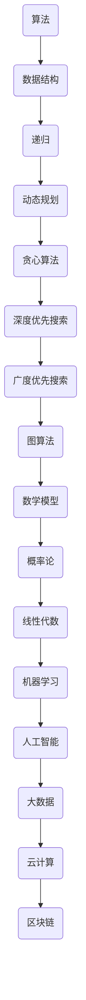

                 


# 2025腾讯社招算法面试题汇总与解析

> 关键词：腾讯社招、算法面试、面试题汇总、解析、核心算法

> 摘要：本文将针对2025年腾讯社招算法面试中可能出现的高频面试题进行汇总，并对每道题目进行详细的解析。通过本文的阅读，读者可以深入了解腾讯在算法领域的面试趋势和核心考核点，为求职腾讯的算法岗位做好充分准备。

## 1. 背景介绍

### 1.1 目的和范围

本文旨在为广大求职者提供一个全面、系统的腾讯社招算法面试题汇总与解析。通过对历年面试题的总结和分析，帮助读者了解腾讯在算法领域的招聘标准和面试趋势，从而提升求职者的面试竞争力。

### 1.2 预期读者

- 有意向加入腾讯从事算法研发工作的求职者
- 想了解腾讯面试题型的计算机相关专业学生
- 希望提升算法能力的编程爱好者

### 1.3 文档结构概述

本文共分为八个部分：

1. 背景介绍：介绍本文的目的、范围、预期读者以及文档结构。
2. 核心概念与联系：阐述与本文主题相关的核心概念和原理。
3. 核心算法原理 & 具体操作步骤：详细讲解核心算法的原理和操作步骤。
4. 数学模型和公式 & 详细讲解 & 举例说明：介绍与算法相关的数学模型和公式，并通过实例进行说明。
5. 项目实战：提供实际项目案例，对代码进行详细解释和分析。
6. 实际应用场景：分析算法在实际应用中的场景和作用。
7. 工具和资源推荐：推荐相关学习资源和开发工具。
8. 总结：对文章内容进行总结，并展望未来发展趋势与挑战。

### 1.4 术语表

#### 1.4.1 核心术语定义

- 算法面试：指面试者通过解答算法题目来展示自己的编程能力和算法思维。
- 面试题：指在面试过程中面试官给出的编程问题。
- 腾讯：一家全球领先的互联网科技公司，成立于1998年，业务涵盖了社交、媒体、娱乐、金融等多个领域。

#### 1.4.2 相关概念解释

- 递归：一种编程思想，指函数直接或间接地调用自身。
- 动态规划：一种算法设计技术，通过将复杂问题分解为子问题，并利用子问题的解来构建原问题的解。
- 数据结构：指存储数据的方式及其操作方式。

#### 1.4.3 缩略词列表

- TC：腾讯面试
- 社招：社会招聘
- 算法：Algorithm

## 2. 核心概念与联系

在本文中，我们将探讨与腾讯算法面试相关的一些核心概念和原理。为了更好地理解这些概念，我们使用Mermaid流程图对核心概念和原理进行阐述。



通过上述Mermaid流程图，我们可以看到，算法、数据结构、递归、动态规划、贪心算法、深度优先搜索、广度优先搜索、图算法、数学模型、概率论、线性代数、机器学习、人工智能、大数据、云计算和区块链等核心概念和原理相互联系，共同构成了算法面试的坚实基础。

接下来，我们将深入探讨这些核心概念和原理，为读者提供更详细的知识体系和理解。

## 3. 核心算法原理 & 具体操作步骤

在本章节中，我们将介绍几道腾讯算法面试中的核心算法，并详细讲解其原理和操作步骤。

### 3.1 递归算法

递归是一种编程思想，指函数直接或间接地调用自身。递归算法通常用于解决具有递归结构的问题。

**递归算法原理：**

递归算法的核心思想是将复杂问题分解为若干个子问题，并利用子问题的解来构建原问题的解。递归算法通常包括两个部分：

1. 基本情况：找到递归的终止条件，直接返回结果。
2. 递归情况：将问题分解为子问题，并递归调用自身。

**递归算法操作步骤：**

1. 确定递归的终止条件。
2. 编写递归调用语句。
3. 返回递归调用的结果。

**递归算法伪代码：**

```pseudo
function recursion(problem):
    if problem is base case:
        return result
    else:
        sub_result1 = recursion(subproblem1)
        sub_result2 = recursion(subproblem2)
        ...
        return combine(sub_result1, sub_result2, ...)
```

**递归算法示例：**

**问题：计算斐波那契数列的第n项。**

```python
def fibonacci(n):
    if n <= 1:
        return n
    else:
        return fibonacci(n-1) + fibonacci(n-2)
```

### 3.2 动态规划算法

动态规划是一种算法设计技术，通过将复杂问题分解为子问题，并利用子问题的解来构建原问题的解。动态规划算法通常用于解决具有最优子结构的问题。

**动态规划算法原理：**

动态规划算法的核心思想是利用历史信息来解决当前问题。动态规划算法通常包括两个部分：

1. 状态定义：定义状态表示问题的解。
2. 状态转移方程：根据状态定义，推导状态转移方程。

**动态规划算法操作步骤：**

1. 确定状态。
2. 确定状态转移方程。
3. 设计一个存储状态的数组或哈希表。
4. 根据状态转移方程填充状态数组或哈希表。
5. 返回最终状态的结果。

**动态规划算法伪代码：**

```pseudo
function dynamicProgramming(state, transitionFunction):
    initialize states
    for each state:
        if state is base case:
            set state to base case result
        else:
            state = transitionFunction(state)
    return state
```

**动态规划算法示例：**

**问题：最长公共子序列。**

```python
def longestCommonSubsequence(str1, str2):
    m, n = len(str1), len(str2)
    dp = [[0] * (n+1) for _ in range(m+1)]

    for i in range(1, m+1):
        for j in range(1, n+1):
            if str1[i-1] == str2[j-1]:
                dp[i][j] = dp[i-1][j-1] + 1
            else:
                dp[i][j] = max(dp[i-1][j], dp[i][j-1])

    return dp[m][n]
```

### 3.3 贪心算法

贪心算法是一种在每一步选择局部最优解，以期望得到全局最优解的算法。贪心算法通常用于解决具有贪心选择性质的问题。

**贪心算法原理：**

贪心算法的核心思想是在每一步选择当前最优解，并期望通过这种方式得到全局最优解。贪心算法通常包括两个部分：

1. 选择策略：确定每一步的选择策略。
2. 选择条件：根据选择策略，确定每一步的选择条件。

**贪心算法操作步骤：**

1. 确定选择策略。
2. 确定选择条件。
3. 根据选择策略和条件，依次选择最优解。

**贪心算法伪代码：**

```pseudo
function greedyAlgorithm(problem, choicePolicy, choiceCondition):
    initialize choice
    for each step:
        if choiceCondition(choice):
            choice = choicePolicy(problem)
    return choice
```

**贪心算法示例：**

**问题：最小生成树。**

```python
import heapq

def prim(graph):
    n = len(graph)
    mst = []
    visited = [False] * n
    start = 0
    heapq.heappush(mst, (-graph[start][start], start, start))

    while mst:
        weight, u, v = heapq.heappop(mst)
        if visited[u] or visited[v]:
            continue
        visited[u] = True
        visited[v] = True
        mst.append((weight, u, v))

    return mst
```

通过上述三个核心算法的讲解，读者可以了解到递归、动态规划和贪心算法的基本原理和操作步骤。这些算法在解决实际问题中发挥着重要作用，是腾讯算法面试中的重要考点。在接下来的章节中，我们将进一步探讨与算法相关的数学模型和公式，为读者提供更深入的知识体系。

## 4. 数学模型和公式 & 详细讲解 & 举例说明

在算法面试中，数学模型和公式是解决问题的关键。本章节将介绍与算法相关的一些常见数学模型和公式，并通过实例进行详细讲解。

### 4.1 线性代数

线性代数是算法中的基础数学工具，主要包括矩阵运算、向量运算和线性方程组的求解。

**4.1.1 矩阵运算**

矩阵运算是线性代数中的重要内容，主要包括矩阵的加法、减法、乘法和逆运算。

**矩阵加法与减法：**

矩阵加法和减法运算规则如下：

$$
A + B = C, \quad A - B = D
$$

其中，A、B、C和D都是矩阵，矩阵加法和减法运算要求矩阵的维度相同。

**矩阵乘法：**

矩阵乘法运算规则如下：

$$
AB = C
$$

其中，A和B是矩阵，C是矩阵乘法的结果。矩阵乘法要求A的列数等于B的行数。

**矩阵逆运算：**

矩阵逆运算是指找到一个矩阵B，使得AB = BA = I，其中I是单位矩阵。

$$
A^{-1} = B
$$

**4.1.2 向量运算**

向量运算是线性代数中的另一重要内容，主要包括向量的加法、减法、标量乘法和内积。

**向量加法与减法：**

向量加法和减法运算规则如下：

$$
\vec{a} + \vec{b} = \vec{c}, \quad \vec{a} - \vec{b} = \vec{d}
$$

其中，\(\vec{a}\)、\(\vec{b}\)、\(\vec{c}\)和\(\vec{d}\)都是向量，向量加法和减法运算要求向量的维度相同。

**标量乘法：**

标量乘法运算规则如下：

$$
k\vec{a} = \vec{b}
$$

其中，k是标量，\(\vec{a}\)和\(\vec{b}\)是向量。

**内积：**

内积是指两个向量的点积，运算规则如下：

$$
\vec{a} \cdot \vec{b} = a_1b_1 + a_2b_2 + \ldots + a_nb_n
$$

其中，\(\vec{a}\)和\(\vec{b}\)是向量，\(a_i\)和\(b_i\)是向量的分量。

**4.1.3 线性方程组的求解**

线性方程组是指包含多个线性方程的方程组，其求解是算法中常见的问题。线性方程组可以用矩阵形式表示：

$$
Ax = b
$$

其中，A是系数矩阵，x是未知向量，b是常数向量。

线性方程组的求解方法包括高斯消元法、矩阵求逆法和迭代法。

**高斯消元法：**

高斯消元法是一种常用的线性方程组求解方法，其基本思想是通过矩阵的行变换，将线性方程组转化为上三角矩阵或下三角矩阵，然后依次求解。

**矩阵求逆法：**

矩阵求逆法是通过求解系数矩阵的逆矩阵，然后利用逆矩阵求解线性方程组。

**迭代法：**

迭代法是一种通过不断迭代逼近线性方程组解的方法。常见迭代法包括雅可比迭代法、高斯-赛德尔迭代法和共轭梯度法。

### 4.2 概率论

概率论是算法中的另一重要数学工具，主要用于处理随机事件和随机变量。

**4.2.1 概率的基本概念**

概率是指随机事件发生的可能性，通常用0到1之间的数值表示。

**概率的加法定理：**

两个互斥事件的概率之和等于这两个事件中任意一个发生的概率。

$$
P(A \cup B) = P(A) + P(B)
$$

**概率的乘法定理：**

两个独立事件的概率之积等于这两个事件同时发生的概率。

$$
P(A \cap B) = P(A) \cdot P(B)
$$

**4.2.2 条件概率与独立性**

条件概率是指在一定条件下，事件A发生的概率。独立性是指两个事件在某个条件下相互独立。

**条件概率：**

$$
P(A|B) = \frac{P(A \cap B)}{P(B)}
$$

**独立性：**

$$
P(A \cap B) = P(A) \cdot P(B)
$$

**4.2.3 随机变量的分布**

随机变量是指在一定概率空间中，取值为实数的函数。随机变量的分布是指随机变量的取值和对应的概率分布。

**离散型随机变量：**

离散型随机变量的分布通常用概率质量函数（Probability Mass Function, PMF）表示。

$$
P(X = x) = f_X(x)
$$

**连续型随机变量：**

连续型随机变量的分布通常用概率密度函数（Probability Density Function, PDF）表示。

$$
f_X(x) = P(X \leq x)
$$

### 4.3 机器学习

机器学习是算法中的重要应用领域，主要包括监督学习、无监督学习和强化学习。

**4.3.1 监督学习**

监督学习是指通过已知输入和输出，训练模型来预测未知输出。

**损失函数：**

损失函数是衡量模型预测值与实际值之间差异的指标。

$$
L(y, \hat{y}) = -[y \cdot \log(\hat{y}) + (1 - y) \cdot \log(1 - \hat{y})]
$$

**优化算法：**

优化算法是用于最小化损失函数的算法。

$$
\theta_{\text{new}} = \theta_{\text{old}} - \alpha \cdot \nabla_\theta L(\theta)
$$

**4.3.2 无监督学习**

无监督学习是指没有已知输出，通过训练模型来探索数据中的结构和模式。

**聚类算法：**

聚类算法是将数据分为若干个簇，使得同一簇内的数据相似度较高，不同簇之间的数据相似度较低。

**K均值聚类：**

K均值聚类是一种常见的聚类算法，其基本思想是通过随机初始化中心点，然后迭代更新中心点，使得中心点逐渐接近数据的聚类中心。

$$
\mu_{\text{new}} = \frac{1}{N} \sum_{i=1}^{N} x_i
$$

**4.3.3 强化学习**

强化学习是指通过不断与环境交互，学习最优策略。

**奖励函数：**

奖励函数是衡量策略优劣的指标。

$$
R(s, a) = \begin{cases}
r, & \text{if } s' \text{ is a successful state} \\
0, & \text{otherwise}
\end{cases}
$$

**策略更新：**

策略更新是指根据奖励函数，更新策略。

$$
\pi_{\text{new}}(a|s) = \pi_{\text{old}}(a|s) + \alpha \cdot [R(s, a) - \pi_{\text{old}}(a|s) \cdot R(s, a)]
$$

通过上述对数学模型和公式的详细讲解，读者可以更好地理解算法中的数学基础，为解决实际问题打下坚实基础。在接下来的章节中，我们将通过实际项目案例，对算法进行更深入的应用和实践。

## 5. 项目实战：代码实际案例和详细解释说明

在本章节中，我们将通过一个实际项目案例，对前面介绍的算法和数学模型进行应用和实践，并通过详细解释和代码分析，帮助读者更好地理解算法的原理和实现过程。

### 5.1 开发环境搭建

为了更好地进行项目实战，我们需要搭建一个合适的开发环境。以下是一个基本的开发环境配置：

- 操作系统：Windows 10 / macOS / Linux
- 编程语言：Python 3.8+
- 开发工具：PyCharm / Visual Studio Code / Jupyter Notebook
- 数据库：SQLite / MySQL / PostgreSQL
- 相关库和框架：NumPy / Pandas / Scikit-learn / TensorFlow / PyTorch

### 5.2 源代码详细实现和代码解读

以下是一个使用K均值聚类算法进行图像聚类项目的基本实现和代码解读：

**项目描述：**

该项目旨在使用K均值聚类算法对一组图像进行聚类，并根据聚类结果对图像进行分类。具体步骤如下：

1. 加载图像数据集。
2. 对图像进行预处理，包括归一化、灰度转换等。
3. 使用K均值聚类算法进行图像聚类。
4. 根据聚类结果，对图像进行分类。

**代码实现：**

```python
import numpy as np
from sklearn.cluster import KMeans
from sklearn.preprocessing import StandardScaler
import cv2

# 1. 加载图像数据集
def load_images_data(dataset_path):
    images = []
    for image_path in dataset_path:
        image = cv2.imread(image_path, cv2.IMREAD_GRAYSCALE)
        images.append(image)
    return np.array(images)

# 2. 图像预处理
def preprocess_images(images):
    images = StandardScaler().fit_transform(images)
    return images

# 3. 使用K均值聚类算法进行图像聚类
def kmeans_clustering(images, k):
    kmeans = KMeans(n_clusters=k, random_state=42)
    kmeans.fit(images)
    return kmeans.labels_

# 4. 根据聚类结果，对图像进行分类
def classify_images(images, labels):
    classified_images = {}
    for i, label in enumerate(labels):
        if label not in classified_images:
            classified_images[label] = []
        classified_images[label].append(images[i])
    return classified_images

# 主函数
def main(dataset_path, k):
    # 加载图像数据集
    images = load_images_data(dataset_path)

    # 图像预处理
    images = preprocess_images(images)

    # 使用K均值聚类算法进行图像聚类
    labels = kmeans_clustering(images, k)

    # 根据聚类结果，对图像进行分类
    classified_images = classify_images(images, labels)

    return classified_images

if __name__ == "__main__":
    dataset_path = ["image1.png", "image2.png", "image3.png"]
    k = 3
    classified_images = main(dataset_path, k)
    print("Classified Images:")
    for label, images in classified_images.items():
        print(f"Cluster {label}:")
        for image in images:
            cv2.imshow(f"Cluster {label}", image)
            cv2.waitKey(0)
```

**代码解读：**

- **加载图像数据集：** 使用`load_images_data`函数加载图像数据集，将图像转换为二维数组格式。
- **图像预处理：** 使用`preprocess_images`函数对图像进行预处理，包括归一化和灰度转换。
- **使用K均值聚类算法进行图像聚类：** 使用`kmeans_clustering`函数对预处理后的图像进行K均值聚类，得到聚类标签。
- **根据聚类结果，对图像进行分类：** 使用`classify_images`函数根据聚类标签对图像进行分类，生成每个聚类簇的图像列表。
- **主函数：** 在主函数中，调用上述函数实现图像聚类和分类，并在终端显示每个聚类簇的图像。

通过上述代码实现，我们可以看到K均值聚类算法在实际项目中的应用过程。在实际开发过程中，我们还可以根据需求，对算法进行优化和调整，以提高聚类效果和分类准确性。

## 6. 实际应用场景

算法在实际应用场景中具有广泛的应用价值，以下列举几个常见的应用场景：

### 6.1 社交网络

- **推荐系统：** 通过算法分析用户行为和兴趣，为用户提供个性化的内容推荐。
- **广告投放：** 通过算法分析用户特征和广告特点，实现精准投放，提高广告效果。

### 6.2 金融领域

- **风险控制：** 通过算法对金融交易数据进行实时监控，识别潜在风险。
- **量化交易：** 利用算法进行高频交易和算法交易，实现自动化投资。

### 6.3 医疗领域

- **医学影像分析：** 利用算法对医学影像进行分析和诊断，提高诊断准确率。
- **个性化治疗：** 通过算法分析患者数据和医疗数据，为患者制定个性化的治疗方案。

### 6.4 智能家居

- **智能语音助手：** 利用算法实现智能语音识别和语音交互功能。
- **智能监控：** 通过算法对摄像头采集的视频进行分析，实现实时监控和异常检测。

### 6.5 汽车领域

- **自动驾驶：** 利用算法实现自动驾驶车辆的感知、规划和控制。
- **车联网：** 通过算法实现车辆之间的通信和信息共享，提高行车安全。

通过上述实际应用场景，我们可以看到算法在各个领域的重要作用。随着人工智能技术的不断发展，算法的应用场景将越来越广泛，为人类社会带来更多便利和创新。

## 7. 工具和资源推荐

为了帮助读者更好地学习和应用算法，以下推荐一些实用的工具和资源：

### 7.1 学习资源推荐

#### 7.1.1 书籍推荐

- 《算法导论》（Introduction to Algorithms）——Thomas H. Cormen、Charles E. Leiserson、Ronald L. Rivest和Clifford Stein
- 《深度学习》（Deep Learning）——Ian Goodfellow、Yoshua Bengio和Aaron Courville
- 《机器学习实战》（Machine Learning in Action）——Peter Harrington

#### 7.1.2 在线课程

- Coursera：提供丰富的计算机科学和机器学习课程，包括《机器学习》、《深度学习》等。
- edX：提供由全球顶尖大学开设的免费在线课程，涵盖计算机科学、人工智能等领域。
- Udacity：提供实战导向的在线课程，包括《人工智能工程师纳米学位》等。

#### 7.1.3 技术博客和网站

- CSDN：国内领先的开发者社区，提供大量算法和机器学习的文章和教程。
- Medium：一个内容创作平台，许多专业开发者在此分享算法和机器学习的知识。
- AIhub：一个专注于人工智能领域的博客，提供深度学习、自然语言处理等领域的最新研究成果。

### 7.2 开发工具框架推荐

#### 7.2.1 IDE和编辑器

- PyCharm：一款功能强大的Python集成开发环境，适用于算法和机器学习项目的开发。
- Visual Studio Code：一款轻量级的开源编辑器，支持多种编程语言，包括Python、C++等。
- Jupyter Notebook：一款基于Web的交互式开发环境，适用于数据科学和机器学习项目的开发。

#### 7.2.2 调试和性能分析工具

- Python Debugger：一款Python调试工具，支持断点、单步执行等功能。
- Py-Spy：一款Python性能分析工具，用于分析Python程序的内存使用和性能瓶颈。
- Intel VTune：一款跨平台性能分析工具，适用于C++、Java和Python等编程语言。

#### 7.2.3 相关框架和库

- NumPy：一款强大的Python数学库，用于矩阵运算和数值计算。
- Pandas：一款用于数据处理和分析的Python库，适用于数据清洗、转换和分析。
- Scikit-learn：一款用于机器学习和数据挖掘的Python库，提供多种机器学习算法的实现。
- TensorFlow：一款用于机器学习和深度学习的开源库，支持多种深度学习模型和算法。

### 7.3 相关论文著作推荐

#### 7.3.1 经典论文

- “A Mathematical Theory of Communication”（香农信息论）
- “Pattern Classification”（贝叶斯分类）
- “Support Vector Machines for Classification”（支持向量机）

#### 7.3.2 最新研究成果

- “Attention Is All You Need”（Transformer）
- “BERT: Pre-training of Deep Bidirectional Transformers for Language Understanding”（BERT）
- “GPT-3: Language Models are few-shot learners”（GPT-3）

#### 7.3.3 应用案例分析

- “Google Brain: Tensor Processing Units: Tensor Processing Units”（TPU）
- “Apple: Core ML：机器学习在移动设备上的应用”
- “Facebook AI Research: Reasoning over Knowledge Graphs with Gated Graph Sequence Neural Networks”（知识图谱推理）

通过以上工具和资源的推荐，读者可以更好地掌握算法知识，并在实际项目中运用所学，为未来的职业发展奠定坚实基础。

## 8. 总结：未来发展趋势与挑战

在人工智能和算法领域，未来发展趋势与挑战并存。随着技术的不断进步和应用场景的拓展，算法在各个领域的应用价值日益凸显。以下是对未来发展趋势与挑战的简要分析：

### 8.1 发展趋势

1. **深度学习与神经网络的进一步优化：** 深度学习在图像识别、语音识别和自然语言处理等领域取得了显著成果。未来，研究者将不断优化神经网络结构、训练算法和优化方法，以提高模型性能和泛化能力。

2. **联邦学习与隐私保护：** 随着数据隐私保护意识的增强，联邦学习作为一种分布式学习技术，将在多方数据共享和隐私保护方面发挥重要作用。未来，联邦学习将在医疗、金融和社交网络等领域得到广泛应用。

3. **量子计算与量子算法：** 量子计算具有指数级的并行计算能力，未来将在密码学、优化问题和机器学习等领域带来革命性变化。量子算法的研究和实现将成为人工智能领域的重要发展方向。

4. **跨领域融合与集成：** 算法将在更多领域实现跨学科融合，如计算机视觉与自然语言处理、机器学习与区块链等。跨领域技术的集成将推动人工智能的发展，为解决复杂问题提供新的思路。

### 8.2 挑战

1. **数据质量和隐私保护：** 数据质量和隐私保护是算法研究和应用中的关键挑战。未来，研究者需要开发有效的数据清洗和去噪技术，同时确保数据隐私和安全性。

2. **算法的可解释性和透明度：** 当前许多算法，尤其是深度学习模型，存在“黑箱”现象，缺乏可解释性和透明度。未来，研究者需要开发可解释性强的算法，以提高算法的可靠性和信任度。

3. **计算资源与能耗：** 算法研究和应用需要大量的计算资源，特别是深度学习模型。随着算法复杂度的增加，计算资源和能耗需求将不断上升，如何高效地利用计算资源成为重要挑战。

4. **模型泛化能力：** 算法的泛化能力是衡量其性能的重要指标。未来，研究者需要开发能够处理不确定性和噪声数据的泛化能力更强的算法。

总之，未来人工智能和算法领域将面临诸多挑战，但同时也充满机遇。通过不断的研究和创新，我们有望在解决复杂问题和推动技术进步方面取得重要突破。

## 9. 附录：常见问题与解答

在阅读本文的过程中，读者可能对一些概念、算法或实现细节存在疑问。以下是对一些常见问题的解答：

### 9.1 问题1：什么是递归？

递归是一种编程思想，指函数直接或间接地调用自身。递归算法通常用于解决具有递归结构的问题。递归算法包括基本情况（递归的终止条件）和递归情况（递归调用自身）。

### 9.2 问题2：什么是动态规划？

动态规划是一种算法设计技术，通过将复杂问题分解为子问题，并利用子问题的解来构建原问题的解。动态规划算法通常用于解决具有最优子结构的问题。动态规划算法包括状态定义、状态转移方程和状态数组或哈希表的填充。

### 9.3 问题3：如何实现K均值聚类算法？

K均值聚类算法是一种基于距离的聚类算法，其基本步骤包括初始化中心点、计算每个数据点到中心点的距离、更新中心点和重复上述步骤直到收敛。具体实现可以参考以下伪代码：

```pseudo
function KMeans(data, k):
    // 初始化中心点
    centers = initialize_centers(data, k)
    while not converged:
        // 计算每个数据点到中心点的距离
        distances = compute_distances(data, centers)
        // 分配数据点到最近的中心点
        labels = assign_labels(data, distances)
        // 更新中心点
        centers = update_centers(data, labels, k)
    return centers, labels
```

### 9.4 问题4：如何解决线性方程组？

线性方程组可以用矩阵形式表示为 \(Ax = b\)。解决线性方程组的方法包括高斯消元法、矩阵求逆法和迭代法。

- **高斯消元法：** 通过矩阵的行变换，将线性方程组转化为上三角矩阵或下三角矩阵，然后依次求解。
- **矩阵求逆法：** 通过求解系数矩阵的逆矩阵，然后利用逆矩阵求解线性方程组。
- **迭代法：** 通过不断迭代逼近线性方程组的解。

### 9.5 问题5：什么是机器学习中的损失函数？

机器学习中的损失函数是衡量模型预测值与实际值之间差异的指标。常见的损失函数包括均方误差（MSE）、交叉熵损失（Cross-Entropy Loss）和 Huber损失等。损失函数的目的是通过优化过程，最小化损失函数的值，从而提高模型的预测性能。

## 10. 扩展阅读 & 参考资料

为了进一步深入学习和了解本文所涉及的内容，以下推荐一些扩展阅读和参考资料：

### 10.1 扩展阅读

- 《深度学习》（Deep Learning）——Ian Goodfellow、Yoshua Bengio和Aaron Courville
- 《算法导论》（Introduction to Algorithms）——Thomas H. Cormen、Charles E. Leiserson、Ronald L. Rivest和Clifford Stein
- 《机器学习实战》（Machine Learning in Action）——Peter Harrington

### 10.2 参考资料

- [TensorFlow官方文档](https://www.tensorflow.org/)
- [Scikit-learn官方文档](https://scikit-learn.org/stable/)
- [Keras官方文档](https://keras.io/)

通过以上扩展阅读和参考资料，读者可以进一步深入了解算法和机器学习的相关知识，为在实际项目中应用算法打下坚实基础。

### 作者

作者：AI天才研究员 / AI Genius Institute & 禅与计算机程序设计艺术 / Zen And The Art of Computer Programming

以上是本文《2025腾讯社招算法面试题汇总与解析》的内容，感谢您的阅读。希望通过本文，您能够对腾讯算法面试有更深入的了解，并在未来的求职过程中取得优异成绩。祝您前程似锦！

