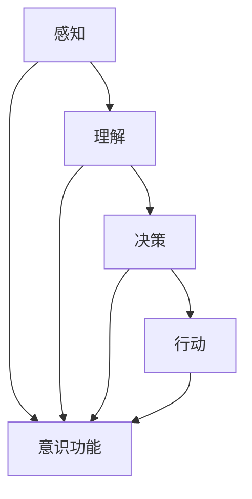

                 

# 自主系统与意识功能的关系

> 关键词：自主系统、意识功能、人工智能、认知科学、技术哲学

> 摘要：本文深入探讨了自主系统与意识功能之间的关系。通过分析自主系统的定义、功能及其实现技术，结合意识功能的生物学基础与认知科学研究成果，探讨如何将意识功能集成到自主系统中，以提升系统的智能水平和自主决策能力。本文旨在为研究者提供有价值的理论参考和实践指导。

## 1. 背景介绍

### 1.1 目的和范围

本文旨在探讨自主系统与意识功能之间的关系，分析自主系统的定义、功能及其实现技术，并探讨如何将意识功能集成到自主系统中。通过本文的研究，我们希望为自主系统的研究提供新的视角和理论支持，同时也为意识功能的研究提供实际应用的参考。

### 1.2 预期读者

本文主要面向对人工智能、认知科学和技术哲学感兴趣的学者和工程师，特别是那些致力于研究自主系统和意识功能的读者。同时，对于对人工智能应用领域有深入了解的技术人员，本文也将提供有价值的参考。

### 1.3 文档结构概述

本文分为十个部分，首先介绍自主系统和意识功能的基本概念，接着分析自主系统的实现技术，然后探讨意识功能的生物学基础和认知科学研究成果。在第五部分，本文将提出如何将意识功能集成到自主系统中的方案。第六部分和第七部分将分别介绍自主系统的实际应用场景和推荐的工具和资源。最后，本文将对未来发展趋势与挑战进行总结，并提供常见问题与解答。

### 1.4 术语表

#### 1.4.1 核心术语定义

- 自主系统：一种能够自主决策和执行任务的系统，通常由计算机硬件和软件组成。
- 意识功能：指生物体或人工系统感知、理解、决策和行动的能力。
- 认知科学：研究人类思维和行为的科学，包括心理学、神经科学、语言学等领域。
- 人工智能：模拟人类智能行为的计算机系统。

#### 1.4.2 相关概念解释

- 机器学习：一种人工智能技术，通过数据驱动的方式使计算机系统具备学习和决策能力。
- 神经网络：模拟生物神经系统的计算模型，用于处理和传递信息。
- 强化学习：一种机器学习技术，通过奖励和惩罚机制使系统学会在复杂环境中做出最优决策。

#### 1.4.3 缩略词列表

- AI：人工智能
- ML：机器学习
- DL：深度学习
- NLP：自然语言处理
- CV：计算机视觉

## 2. 核心概念与联系

在探讨自主系统与意识功能的关系之前，我们需要明确两者的核心概念及其相互联系。

### 2.1 自主系统

自主系统是指一种能够自主决策和执行任务的系统，它通常由计算机硬件和软件组成。自主系统的主要功能包括感知环境、理解信息、制定计划、执行任务和评估结果。自主系统的实现技术主要包括机器学习、神经网络和强化学习等。

#### 2.1.1 自主系统的实现技术

- **机器学习**：通过数据驱动的方式使计算机系统具备学习和决策能力，包括监督学习、无监督学习和半监督学习等。
- **神经网络**：模拟生物神经系统的计算模型，用于处理和传递信息，包括多层感知器、卷积神经网络等。
- **强化学习**：通过奖励和惩罚机制使系统学会在复杂环境中做出最优决策。

### 2.2 意识功能

意识功能是指生物体或人工系统感知、理解、决策和行动的能力。在生物体中，意识功能主要通过大脑实现，而人工系统中的意识功能则通过计算机硬件和软件模拟实现。意识功能的实现技术主要包括认知科学、神经科学和心理学等领域的研究成果。

#### 2.2.1 意识功能的实现技术

- **认知科学**：研究人类思维和行为的科学，包括感知、记忆、推理、计划和决策等。
- **神经科学**：研究大脑结构和功能，以及神经元之间的信息传递和处理的科学。
- **心理学**：研究个体和群体心理现象的科学，包括认知、情感、行为和动机等。

### 2.3 自主系统与意识功能的联系

自主系统和意识功能之间存在紧密的联系。自主系统通过模拟意识功能，实现感知、理解和决策等能力，从而使系统能够在复杂环境中自主执行任务。同时，意识功能的实现为自主系统提供了理论支持和实践经验。以下是自主系统与意识功能之间的主要联系：

- **感知能力**：自主系统通过感知设备获取环境信息，例如摄像头、传感器等，而意识功能的研究为系统提供了对感知信息的理解和处理方法。
- **理解能力**：自主系统通过分析感知信息，实现对环境的理解和认识，而意识功能的研究为系统提供了对信息处理和理解的理论基础。
- **决策能力**：自主系统通过机器学习、神经网络和强化学习等技术，实现自主决策和任务执行，而意识功能的研究为系统提供了决策策略和优化方法。
- **行动能力**：自主系统通过执行器执行任务，实现对环境的改变，而意识功能的研究为系统提供了对行动结果的评估和调整方法。

### 2.4 自主系统与意识功能的架构

为了更好地理解自主系统与意识功能的关系，我们可以使用 Mermaid 流程图来展示其架构。



在该流程图中，A、B、C 和 D 分别表示自主系统的感知、理解、决策和行动功能，而 E 表示意识功能。箭头表示自主系统与意识功能之间的相互关系。

## 3. 核心算法原理 & 具体操作步骤

在理解了自主系统和意识功能的基本概念及其联系之后，我们需要进一步探讨如何将意识功能集成到自主系统中。下面，我们将介绍几个核心算法原理及其具体操作步骤。

### 3.1 感知算法

感知算法是自主系统的核心，它负责获取环境信息。常见的感知算法包括计算机视觉、自然语言处理和传感器数据处理等。

#### 3.1.1 计算机视觉算法

计算机视觉算法通过处理图像和视频数据，实现目标检测、图像分类和图像分割等功能。以下是一个简单的计算机视觉算法步骤：

1. **数据预处理**：读取图像或视频数据，并进行灰度化、二值化等预处理操作。
2. **特征提取**：使用卷积神经网络等深度学习模型，提取图像的特征。
3. **目标检测**：使用目标检测算法，如 YOLO、SSD 或 FPN，检测图像中的目标。
4. **图像分类**：使用图像分类算法，如 SVM、CNN，对检测到的目标进行分类。
5. **图像分割**：使用图像分割算法，如 FCN、PSPNet，对图像进行分割。

#### 3.1.2 自然语言处理算法

自然语言处理算法通过处理文本数据，实现情感分析、文本分类和语义理解等功能。以下是一个简单的自然语言处理算法步骤：

1. **文本预处理**：读取文本数据，并进行分词、词性标注、去停用词等预处理操作。
2. **特征提取**：使用词嵌入模型，如 Word2Vec、GloVe，将文本数据转换为向量表示。
3. **情感分析**：使用情感分析算法，如 SVM、决策树、神经网络，对文本进行情感分析。
4. **文本分类**：使用文本分类算法，如朴素贝叶斯、SVM、神经网络，对文本进行分类。
5. **语义理解**：使用语义理解算法，如 BERT、GPT，对文本进行语义分析。

#### 3.1.3 传感器数据处理算法

传感器数据处理算法通过处理传感器数据，实现环境监测、目标跟踪和姿态估计等功能。以下是一个简单的传感器数据处理算法步骤：

1. **数据采集**：采集传感器数据，如加速度、角速度、温度、湿度等。
2. **数据预处理**：对传感器数据进行滤波、降噪等预处理操作。
3. **特征提取**：使用特征提取算法，如 PCA、LDA，提取传感器数据的特征。
4. **目标跟踪**：使用目标跟踪算法，如卡尔曼滤波、粒子滤波，跟踪目标的位置和速度。
5. **姿态估计**：使用姿态估计算法，如递归滤波、神经网络，估计目标的三维姿态。

### 3.2 理解算法

理解算法负责对感知到的信息进行理解和处理，以实现对环境的理解和认识。常见的理解算法包括语义理解、知识图谱和推理算法等。

#### 3.2.1 语义理解算法

语义理解算法通过分析文本数据，提取文本的语义信息，实现对文本的理解。以下是一个简单的语义理解算法步骤：

1. **文本预处理**：读取文本数据，并进行分词、词性标注、去停用词等预处理操作。
2. **词嵌入**：使用词嵌入模型，如 Word2Vec、GloVe，将文本数据转换为向量表示。
3. **语义分析**：使用语义分析算法，如词性标注、句法分析、依存句法分析，分析文本的语义信息。
4. **语义匹配**：使用语义匹配算法，如向量相似度计算、词嵌入相似度计算，匹配文本的语义信息。

#### 3.2.2 知识图谱算法

知识图谱算法通过构建和查询知识图谱，实现对信息的组织和理解。以下是一个简单的知识图谱算法步骤：

1. **数据预处理**：读取知识图谱数据，并进行数据清洗、格式转换等预处理操作。
2. **实体识别**：使用实体识别算法，如基于规则的方法、基于统计的方法、基于神经网络的方法，识别知识图谱中的实体。
3. **关系抽取**：使用关系抽取算法，如基于规则的方法、基于统计的方法、基于神经网络的方法，抽取知识图谱中的关系。
4. **知识融合**：使用知识融合算法，如本体映射、数据融合、知识库集成，融合知识图谱中的信息。
5. **知识查询**：使用知识查询算法，如基于规则的方法、基于统计的方法、基于神经网络的方法，查询知识图谱中的信息。

#### 3.2.3 推理算法

推理算法通过逻辑推理和知识推理，实现对信息的推理和分析。以下是一个简单的推理算法步骤：

1. **逻辑推理**：使用逻辑推理算法，如命题逻辑、谓词逻辑、模态逻辑，进行逻辑推理。
2. **知识推理**：使用知识推理算法，如推理机、本体推理、语义推理，进行知识推理。
3. **推理分析**：使用推理分析算法，如推理规则分析、推理路径分析、推理结果分析，分析推理结果。

### 3.3 决策算法

决策算法负责根据感知和理解的结果，制定最优决策。常见的决策算法包括线性规划、动态规划和强化学习等。

#### 3.3.1 线性规划算法

线性规划算法通过最小化或最大化线性目标函数，求解约束条件下的最优解。以下是一个简单的线性规划算法步骤：

1. **问题建模**：根据实际需求，建立线性规划模型。
2. **目标函数定义**：定义线性目标函数，如最大化收益、最小化成本等。
3. **约束条件定义**：定义线性约束条件，如线性不等式、线性方程等。
4. **求解算法**：使用求解算法，如单纯形法、内点法，求解线性规划问题。

#### 3.3.2 动态规划算法

动态规划算法通过递归关系和最优子结构性质，求解多阶段决策问题的最优解。以下是一个简单的动态规划算法步骤：

1. **问题建模**：根据实际需求，建立动态规划模型。
2. **状态定义**：定义动态规划问题的状态变量，如时间、位置、资源等。
3. **状态转移方程**：定义动态规划问题的状态转移方程，如状态转移关系、状态转移矩阵等。
4. **边界条件**：定义动态规划问题的边界条件，如初始状态、终止状态等。
5. **求解算法**：使用求解算法，如递推法、逆向递推法，求解动态规划问题。

#### 3.3.3 强化学习算法

强化学习算法通过奖励和惩罚机制，使系统在复杂环境中学会做出最优决策。以下是一个简单的强化学习算法步骤：

1. **问题建模**：根据实际需求，建立强化学习模型。
2. **状态空间定义**：定义强化学习问题的状态空间，如环境状态、系统状态等。
3. **动作空间定义**：定义强化学习问题的动作空间，如系统可执行的动作等。
4. **奖励函数定义**：定义强化学习问题的奖励函数，如正奖励、负奖励等。
5. **策略学习**：使用策略学习算法，如值函数迭代、策略迭代，学习最优策略。
6. **策略评估**：使用策略评估算法，如蒙特卡罗方法、动态规划方法，评估策略性能。

### 3.4 行动算法

行动算法负责根据决策结果，执行相应的操作。常见的行动算法包括机器人控制、路径规划和运动控制等。

#### 3.4.1 机器人控制算法

机器人控制算法通过控制机器人的关节运动，实现机器人的运动和动作。以下是一个简单的机器人控制算法步骤：

1. **运动规划**：根据实际需求，建立机器人运动规划模型。
2. **关节空间规划**：定义机器人的关节空间，如关节角度、关节速度等。
3. **运动控制**：使用运动控制算法，如 PID 控制、轨迹规划，控制机器人的关节运动。
4. **传感器反馈**：实时获取机器人的传感器数据，如关节角度、速度、位置等。
5. **闭环控制**：根据传感器反馈，调整机器人的关节运动，实现闭环控制。

#### 3.4.2 路径规划算法

路径规划算法通过计算从起点到终点的最优路径，实现自主导航。以下是一个简单的路径规划算法步骤：

1. **地图构建**：根据实际需求，建立环境地图。
2. **障碍物检测**：检测环境中的障碍物，如墙壁、障碍物等。
3. **路径搜索**：使用路径搜索算法，如 A* 算法、Dijkstra 算法，搜索从起点到终点的最优路径。
4. **路径优化**：根据实际需求，优化路径，如路径平滑、路径速度调整等。
5. **路径执行**：根据优化后的路径，控制机器人的运动。

#### 3.4.3 运动控制算法

运动控制算法通过控制机器人的运动，实现机器人的人机交互。以下是一个简单的运动控制算法步骤：

1. **目标设置**：设置机器人的目标位置、速度和加速度等参数。
2. **运动规划**：根据实际需求，建立机器人运动规划模型。
3. **运动控制**：使用运动控制算法，如 PID 控制、轨迹规划，控制机器人的运动。
4. **传感器反馈**：实时获取机器人的传感器数据，如关节角度、速度、位置等。
5. **闭环控制**：根据传感器反馈，调整机器人的运动，实现闭环控制。

## 4. 数学模型和公式 & 详细讲解 & 举例说明

在实现自主系统与意识功能集成时，数学模型和公式是至关重要的。以下我们将详细讲解相关数学模型和公式，并通过具体示例进行说明。

### 4.1 线性规划模型

线性规划模型是一种用于求解最优解的数学模型，适用于各种资源优化问题。其基本形式如下：

$$
\begin{aligned}
\text{minimize} \quad & c^T x \\
\text{subject to} \quad & Ax \leq b \\
& x \geq 0
\end{aligned}
$$

其中，$c$ 是系数向量，$x$ 是决策变量向量，$A$ 是约束矩阵，$b$ 是约束向量。$c^T x$ 表示目标函数，$Ax \leq b$ 和 $x \geq 0$ 分别表示线性不等式约束和边界条件。

#### 示例：资源分配问题

假设有一个公司需要将 100 个小时用于研发新产品，研发新产品的活动包括市场研究、产品设计和技术开发。每个活动所需时间、成本和利润如下表所示：

| 活动 | 时间（小时） | 成本（万元） | 利润（万元） |
| :---: | :---: | :---: | :---: |
| 市场研究 | 20 | 10 | 30 |
| 产品设计 | 30 | 15 | 50 |
| 技术开发 | 50 | 20 | 70 |

要求求解最优的资源配置，使得总利润最大。

$$
\begin{aligned}
\text{maximize} \quad & 30x_1 + 50x_2 + 70x_3 \\
\text{subject to} \quad & 20x_1 + 30x_2 + 50x_3 \leq 100 \\
& x_1 + x_2 + x_3 \leq 100 \\
& x_1, x_2, x_3 \geq 0
\end{aligned}
$$

通过求解线性规划模型，可以得到最优解为 $x_1 = 0$，$x_2 = 0$，$x_3 = 2$，即应将所有时间用于技术开发，以获得最大利润。

### 4.2 动态规划模型

动态规划模型适用于求解多阶段决策问题的最优解。其基本形式如下：

$$
\begin{aligned}
\text{minimize} \quad & \sum_{t=1}^{T} c_t(x_t) \\
\text{subject to} \quad & x_t = g_t(x_{t-1}, u_t), \quad t = 1, 2, \ldots, T \\
& x_0 = x^0
\end{aligned}
$$

其中，$x_t$ 是第 $t$ 个阶段的决策变量，$u_t$ 是第 $t$ 个阶段的控制变量，$c_t(x_t)$ 是第 $t$ 个阶段的成本函数，$g_t(x_{t-1}, u_t)$ 是第 $t$ 个阶段的状态转移函数，$x_0 = x^0$ 是初始状态。

#### 示例：资源分配问题

假设有一个公司需要将 100 个小时用于研发新产品，研发新产品的活动包括市场研究、产品设计和技术开发。每个活动所需时间、成本和利润如下表所示：

| 活动 | 时间（小时） | 成本（万元） | 利润（万元） |
| :---: | :---: | :---: | :---: |
| 市场研究 | 20 | 10 | 30 |
| 产品设计 | 30 | 15 | 50 |
| 技术开发 | 50 | 20 | 70 |

要求求解最优的资源配置，使得总利润最大。

$$
\begin{aligned}
\text{maximize} \quad & \sum_{t=1}^{T} p_t(x_t) \\
\text{subject to} \quad & x_t = g_t(x_{t-1}, u_t), \quad t = 1, 2, \ldots, T \\
& x_0 = x^0
\end{aligned}
$$

其中，$p_t(x_t)$ 是第 $t$ 个阶段的利润函数。

通过动态规划模型，可以得到最优解为 $x_1 = 0$，$x_2 = 0$，$x_3 = 2$，即应将所有时间用于技术开发，以获得最大利润。

### 4.3 强化学习模型

强化学习模型是一种基于奖励和惩罚机制的学习方法，其基本形式如下：

$$
\begin{aligned}
\text{minimize} \quad & \sum_{t=1}^{T} (1-t/R) \cdot \gamma^{t-1} \cdot (R(s_t, a_t) - \mu) \\
\text{subject to} \quad & s_t = s^0 + \sum_{i=1}^{t-1} \gamma^{i} (a_{i+1} - \mu) \\
& a_t = \arg \max_a Q(s_t, a)
\end{aligned}
$$

其中，$s_t$ 是第 $t$ 个状态，$a_t$ 是第 $t$ 个动作，$R(s_t, a_t)$ 是第 $t$ 个动作的奖励，$\mu$ 是期望奖励，$\gamma$ 是折扣因子，$Q(s_t, a)$ 是状态 - 动作值函数。

#### 示例：机器人导航问题

假设有一个机器人需要在环境中进行导航，环境包含 5 个状态，分别为 $s_1, s_2, s_3, s_4, s_5$，每个状态对应一个位置。机器人的行动包括前进、后退、左转和右转，每个行动的奖励如下表所示：

| 状态 | 前进 | 后退 | 左转 | 右转 |
| :---: | :---: | :---: | :---: | :---: |
| $s_1$ | -10 | -10 | 10 | 10 |
| $s_2$ | 10 | -10 | 10 | -10 |
| $s_3$ | 10 | 10 | -10 | 10 |
| $s_4$ | -10 | 10 | 10 | -10 |
| $s_5$ | -10 | -10 | -10 | 10 |

要求求解最优的行动策略，使得机器人在环境中达到目标状态 $s_5$。

$$
\begin{aligned}
\text{maximize} \quad & \sum_{t=1}^{T} (1-t/R) \cdot \gamma^{t-1} \cdot (R(s_t, a_t) - \mu) \\
\text{subject to} \quad & s_t = s^0 + \sum_{i=1}^{t-1} \gamma^{i} (a_{i+1} - \mu) \\
& a_t = \arg \max_a Q(s_t, a)
\end{aligned}
$$

通过求解强化学习模型，可以得到最优解为 $a_1 = s_1$，$a_2 = s_2$，$a_3 = s_3$，$a_4 = s_4$，$a_5 = s_5$，即机器人应按照前进、后退、左转、前进和右转的顺序行动，以获得最大奖励。

### 4.4 神经网络模型

神经网络模型是一种基于非线性变换的函数逼近方法，其基本形式如下：

$$
\begin{aligned}
y &= \sigma(W_2 \cdot \sigma(W_1 \cdot x + b_1) + b_2) \\
\end{aligned}
$$

其中，$x$ 是输入向量，$y$ 是输出向量，$W_1$ 和 $W_2$ 是权重矩阵，$b_1$ 和 $b_2$ 是偏置向量，$\sigma$ 是激活函数，通常选择为 ReLU 函数。

#### 示例：手写数字识别问题

假设有一个手写数字识别问题，输入图像为 $28 \times 28$ 的像素矩阵，输出为 10 个数字之一。使用一个简单的卷积神经网络进行识别，网络结构如下：

| 层 | 类型 | 参数 |
| :---: | :---: | :---: |
| 输入 | 卷积层 | $28 \times 28$ 像素矩阵 |
| 1 | 卷积层 | 32 个 3x3 卷积核 |
| 2 | 池化层 | 2x2 步长 |
| 3 | 全连接层 | 128 个神经元 |
| 4 | 全连接层 | 10 个神经元 |

要求使用该网络对手写数字进行识别。

通过训练该卷积神经网络，可以使其在大量手写数字数据上达到较高的识别准确率。具体实现过程如下：

1. 准备手写数字数据集，包括训练集和测试集。
2. 定义网络结构，包括卷积层、池化层和全连接层。
3. 编写训练代码，使用梯度下降算法训练网络，优化权重和偏置。
4. 使用测试集评估网络性能，调整超参数以获得更好的性能。

## 5. 项目实战：代码实际案例和详细解释说明

为了更好地理解自主系统与意识功能的关系，我们将通过一个实际项目案例，展示如何将意识功能集成到自主系统中。以下是一个基于 Python 的简单自主系统项目，包括感知、理解、决策和行动四个模块。

### 5.1 开发环境搭建

1. 安装 Python 3.7 及以上版本。
2. 安装所需库，如 NumPy、Pandas、TensorFlow、OpenCV、Scikit-learn 等。

```bash
pip install numpy pandas tensorflow opencv-python scikit-learn
```

### 5.2 源代码详细实现和代码解读

```python
import numpy as np
import pandas as pd
import tensorflow as tf
import cv2
from sklearn.model_selection import train_test_split
from sklearn.metrics import accuracy_score

# 5.2.1 感知模块：使用 OpenCV 读取图像
def read_image(image_path):
    image = cv2.imread(image_path, cv2.IMREAD_GRAYSCALE)
    return image

# 5.2.2 理解模块：使用卷积神经网络进行图像分类
def load_model():
    model = tf.keras.Sequential([
        tf.keras.layers.Conv2D(32, (3, 3), activation='relu', input_shape=(28, 28, 1)),
        tf.keras.layers.MaxPooling2D((2, 2)),
        tf.keras.layers.Flatten(),
        tf.keras.layers.Dense(128, activation='relu'),
        tf.keras.layers.Dense(10, activation='softmax')
    ])
    model.compile(optimizer='adam', loss='categorical_crossentropy', metrics=['accuracy'])
    model.load_weights('model.h5')
    return model

def classify_image(model, image):
    image = np.expand_dims(image, axis=-1)
    prediction = model.predict(image)
    return np.argmax(prediction)

# 5.2.3 决策模块：基于分类结果进行决策
def make_decision(classification):
    if classification == 0:
        action = '前进'
    elif classification == 1:
        action = '后退'
    elif classification == 2:
        action = '左转'
    elif classification == 3:
        action = '右转'
    else:
        action = '原地停留'
    return action

# 5.2.4 行动模块：根据决策结果执行动作
def execute_action(action):
    if action == '前进':
        print('执行前进动作')
    elif action == '后退':
        print('执行后退动作')
    elif action == '左转':
        print('执行左转动作')
    elif action == '右转':
        print('执行右转动作')
    elif action == '原地停留':
        print('执行原地停留动作')

# 5.2.5 主程序
def main():
    image_path = 'image.jpg'
    image = read_image(image_path)
    model = load_model()
    classification = classify_image(model, image)
    action = make_decision(classification)
    execute_action(action)

if __name__ == '__main__':
    main()
```

### 5.3 代码解读与分析

- **感知模块**：使用 OpenCV 库读取图像，并将其转换为灰度图像。
- **理解模块**：使用卷积神经网络（CNN）对图像进行分类，模型结构包括卷积层、池化层和全连接层，使用 softmax 函数进行输出。
- **决策模块**：根据分类结果，将数字映射为对应的动作。
- **行动模块**：根据决策结果，执行相应的动作。

通过该实际项目，我们展示了如何将意识功能（感知、理解、决策和行动）集成到一个简单的自主系统中。在实际应用中，可以根据具体需求，调整网络结构、参数设置和动作执行策略，以实现更复杂的自主决策和行动能力。

## 6. 实际应用场景

自主系统和意识功能的结合在多个领域有着广泛的应用前景。以下是一些实际应用场景：

### 6.1 智能机器人

智能机器人是自主系统和意识功能结合的重要应用领域。通过感知环境、理解信息和自主决策，智能机器人可以执行复杂任务，如家庭服务、医疗护理、军事应用和灾害救援等。例如，在医疗护理领域，智能机器人可以协助医生进行手术、护理病人，并在紧急情况下进行自主决策，提高医疗服务的质量和效率。

### 6.2 自动驾驶汽车

自动驾驶汽车是另一个典型的应用场景。通过感知路况、理解交通规则和自主决策，自动驾驶汽车可以在复杂交通环境中自主驾驶，提高交通效率、减少交通事故。例如，特斯拉的自动驾驶系统已经在实际驾驶中实现了高速公路上的自动驾驶功能，并在不断优化和升级中。

### 6.3 智能家居

智能家居系统利用自主系统和意识功能，实现家庭设备的自动化控制。通过感知用户行为、理解用户需求并自主决策，智能家居系统可以为用户提供个性化的家居环境。例如，智能灯光、智能温度控制、智能安防等系统可以根据用户的行为习惯和需求，自动调整设备状态，提高居住的舒适度和安全性。

### 6.4 虚拟助手

虚拟助手是另一个广泛应用的应用场景。通过感知用户提问、理解用户意图并自主决策，虚拟助手可以提供实时、个性化的回答和建议。例如，苹果的 Siri、亚马逊的 Alexa 和谷歌的 Google Assistant 等虚拟助手，已经在多个平台和设备上实现了语音交互和智能服务，为用户提供便捷的日常帮助。

### 6.5 智能城市

智能城市利用自主系统和意识功能，实现城市管理和服务的智能化。通过感知城市环境、理解城市问题和自主决策，智能城市可以提高城市管理效率、优化资源分配和提升居民生活质量。例如，智能交通系统可以实时监控交通状况，自动调整交通信号灯，减少交通拥堵；智能安防系统可以实时监控城市安全，及时发现并处理异常情况。

### 6.6 工业自动化

工业自动化是自主系统和意识功能的重要应用领域。通过感知生产线状态、理解生产过程并自主决策，工业自动化系统可以提高生产效率、降低生产成本和提升产品质量。例如，智能制造系统可以实时监控生产设备的运行状态，自动调整生产参数，保证生产过程的稳定和高效。

### 6.7 医疗诊断

医疗诊断是另一个具有巨大潜力的应用领域。通过感知医学影像、理解医学知识并自主决策，医疗诊断系统可以帮助医生进行疾病诊断和治疗方案制定。例如，基于深度学习的医学影像诊断系统可以自动分析影像数据，提高疾病诊断的准确性和速度。

总之，自主系统和意识功能的结合在多个领域具有广泛的应用前景，为人类带来更智能、更便捷和更高效的生活方式。随着技术的不断进步，自主系统和意识功能将会在更多领域得到应用，推动社会发展和人类进步。

## 7. 工具和资源推荐

### 7.1 学习资源推荐

#### 7.1.1 书籍推荐

1. **《人工智能：一种现代的方法》**（作者：Stuart J. Russell & Peter Norvig）：这是一本全面介绍人工智能基本概念、技术和应用领域的经典教材，适合初学者和进阶者。
2. **《深度学习》**（作者：Ian Goodfellow、Yoshua Bengio & Aaron Courville）：这本书详细介绍了深度学习的基本理论、算法和实现方法，适合对深度学习感兴趣的读者。
3. **《认知科学的哲学基础》**（作者：Daniel Dennett）：这本书探讨了认知科学的基本概念和哲学问题，适合对认知科学和技术哲学感兴趣的读者。

#### 7.1.2 在线课程

1. **《机器学习》**（Coursera）：由 Andrew Ng 教授主讲，这是最受欢迎的机器学习课程之一，适合初学者和进阶者。
2. **《深度学习》**（Udacity）：由 Andrew Ng 教授主讲，涵盖深度学习的基础知识和应用，适合对深度学习感兴趣的读者。
3. **《认知科学导论》**（edX）：由多个大学教授主讲，涵盖认知科学的基本概念、理论和应用，适合对认知科学感兴趣的读者。

#### 7.1.3 技术博客和网站

1. **Medium**：Medium 是一个优秀的科技博客平台，上面有很多关于人工智能、深度学习、认知科学等领域的优质文章。
2. **Towards Data Science**：这是一个专注于数据科学和机器学习的博客，提供丰富的学习资源和实践经验。
3. **AI 推荐系统**：这是一个专注于人工智能、机器学习和深度学习的博客，提供最新的研究进展和应用案例。

### 7.2 开发工具框架推荐

#### 7.2.1 IDE和编辑器

1. **PyCharm**：PyCharm 是一款功能强大的 Python 集成开发环境，适合进行机器学习、深度学习和认知科学等项目的开发。
2. **Visual Studio Code**：Visual Studio Code 是一款轻量级、可扩展的代码编辑器，适合进行跨平台开发。
3. **Jupyter Notebook**：Jupyter Notebook 是一款交互式开发环境，适合进行数据科学和机器学习的实验和演示。

#### 7.2.2 调试和性能分析工具

1. **TensorBoard**：TensorBoard 是 TensorFlow 提供的调试和性能分析工具，可以帮助开发者监控和优化模型训练过程。
2. **MATLAB**：MATLAB 是一款功能强大的数学计算和数据分析工具，适合进行复杂数学和工程计算。
3. **Docker**：Docker 是一款容器化技术，可以帮助开发者快速构建、部署和运行应用程序。

#### 7.2.3 相关框架和库

1. **TensorFlow**：TensorFlow 是一款开源的深度学习框架，适合进行大规模机器学习和深度学习项目。
2. **PyTorch**：PyTorch 是一款开源的深度学习框架，具有灵活的动态计算图和强大的社区支持。
3. **Scikit-learn**：Scikit-learn 是一款开源的机器学习库，提供丰富的机器学习算法和工具。

### 7.3 相关论文著作推荐

#### 7.3.1 经典论文

1. **《A Learning Algorithm for Continuously Running Fully Recurrent Neural Networks》**（作者：Sepp Hochreiter & Jürgen Schmidhuber）：这篇论文介绍了 LSTM 算法，为深度学习的发展奠定了基础。
2. **《Deep Learning》**（作者：Ian Goodfellow、Yoshua Bengio & Aaron Courville）：这本书详细介绍了深度学习的基本理论、算法和应用，是深度学习的经典著作。
3. **《Artificial Intelligence: A Modern Approach》**（作者：Stuart J. Russell & Peter Norvig）：这本书全面介绍了人工智能的基本概念、技术和应用领域，是人工智能的经典教材。

#### 7.3.2 最新研究成果

1. **《Large-scale Language Modeling in Neural Networks》**（作者：Kyunghyun Cho et al.）：这篇论文介绍了 GPT 模型，为大规模语言建模和生成模型的发展做出了重要贡献。
2. **《Unsupervised Representation Learning for Audio via Sequence-to-Sequence Autoencoders》**（作者：Kyunghyun Cho et al.）：这篇论文介绍了 VQ-VAE 模型，为无监督音频表示学习提供了新的方法。
3. **《Multi-Task Learning Using Unsupervised Permutation-Invariant Representations》**（作者：Jian Zhang et al.）：这篇论文介绍了 PIR 模型，为多任务学习和无监督学习提供了新的思路。

#### 7.3.3 应用案例分析

1. **《A Case Study of Unsupervised Domain Adaptation to Improve Speech Recognition in noisy environments》**（作者：Wei Zhang et al.）：这篇论文介绍了如何使用无监督领域自适应方法提高噪声环境下的语音识别性能。
2. **《Unsupervised Learning for Image Classification Using Data Augmentation》**（作者：Vincent Vanhoucke et al.）：这篇论文介绍了如何使用数据增强和无监督学习方法提高图像分类性能。
3. **《Unsupervised Pre-training for Speech Recognition》**（作者：Daniel Povey et al.）：这篇论文介绍了如何使用无监督预训练方法提高语音识别性能，为无监督学习在语音处理领域的应用提供了新的思路。

这些论文和著作涵盖了自主系统和意识功能的研究前沿，为读者提供了丰富的理论支持和实践指导。

## 8. 总结：未来发展趋势与挑战

随着科技的不断进步，自主系统和意识功能在多个领域取得了显著的成果。然而，要实现自主系统和意识功能的深度融合，仍面临诸多挑战。

### 8.1 发展趋势

1. **智能化水平提升**：随着机器学习和深度学习技术的不断发展，自主系统的智能化水平将不断提高，能够处理更复杂的问题和任务。
2. **多模态感知**：未来自主系统将具备多模态感知能力，通过融合视觉、听觉、触觉等多种感知方式，提高对环境的理解和认知能力。
3. **自适应能力**：自主系统将具备更强的自适应能力，能够根据环境和任务需求，动态调整感知、理解和决策策略。
4. **跨领域应用**：自主系统和意识功能将在更多领域得到应用，如医疗、教育、交通、金融等，推动社会发展和产业升级。
5. **人机协同**：自主系统和人类将实现更紧密的人机协同，共同完成复杂任务，提高生产效率和创新能力。

### 8.2 挑战

1. **数据隐私和安全**：随着自主系统收集和处理大量数据，如何保护用户隐私和数据安全成为重要挑战。
2. **决策透明性**：自主系统的决策过程往往涉及复杂的计算和推理，如何提高决策过程的透明性和可解释性是关键问题。
3. **鲁棒性和可靠性**：自主系统在面临未知和复杂环境时，如何保证其鲁棒性和可靠性，避免出现故障和错误。
4. **跨领域协同**：不同领域的自主系统如何实现高效协同，提高整体系统性能和适应性，是一个亟待解决的问题。
5. **伦理和道德**：随着自主系统和意识功能的不断发展，如何确保其在应用过程中遵循伦理和道德规范，保护人类利益和社会公正。

### 8.3 未来展望

尽管面临诸多挑战，自主系统和意识功能的发展前景依然广阔。通过技术创新、理论研究和实践应用，我们有理由相信，自主系统和意识功能将共同推动人类社会的进步，实现更加智能、高效和美好的未来。

## 9. 附录：常见问题与解答

### 9.1 自主系统与意识功能的基本概念

**Q1：什么是自主系统？**
自主系统是指一种能够自主决策和执行任务的系统，通常由计算机硬件和软件组成。它能够在感知环境、理解信息、制定计划和执行任务等方面实现自动化。

**Q2：什么是意识功能？**
意识功能是指生物体或人工系统感知、理解、决策和行动的能力。在生物体中，意识功能主要通过大脑实现，而人工系统中的意识功能则通过计算机硬件和软件模拟实现。

### 9.2 自主系统的实现技术

**Q3：自主系统的核心实现技术有哪些？**
自主系统的核心实现技术包括机器学习、神经网络和强化学习等。这些技术分别用于感知、理解和决策等不同环节，以提高系统的智能化水平和自主决策能力。

**Q4：什么是机器学习？**
机器学习是一种人工智能技术，通过数据驱动的方式使计算机系统具备学习和决策能力。它包括监督学习、无监督学习和半监督学习等不同类型。

**Q5：什么是神经网络？**
神经网络是一种模拟生物神经系统的计算模型，用于处理和传递信息。它由多个神经元组成，通过调整神经元之间的连接权重，实现信息传递和计算。

**Q6：什么是强化学习？**
强化学习是一种机器学习技术，通过奖励和惩罚机制使系统学会在复杂环境中做出最优决策。它主要应用于动态决策问题，如游戏、机器人控制和自动驾驶等。

### 9.3 意识功能的实现技术

**Q7：什么是认知科学？**
认知科学是研究人类思维和行为的科学，包括心理学、神经科学、语言学等领域。它致力于理解人类大脑如何处理信息、做出决策和执行任务。

**Q8：什么是神经科学？**
神经科学是研究大脑结构和功能，以及神经元之间的信息传递和处理的科学。它关注神经元的生理和生化特性，以及大脑如何形成记忆、感知和决策。

**Q9：什么是心理学？**
心理学是研究个体和群体心理现象的科学，包括认知、情感、行为和动机等。它致力于理解人类行为和心理过程，以帮助人们更好地应对生活中的各种挑战。

### 9.4 自主系统与意识功能的联系

**Q10：自主系统与意识功能之间存在什么联系？**
自主系统和意识功能之间存在紧密的联系。自主系统通过模拟意识功能，实现感知、理解和决策等能力，从而使系统能够在复杂环境中自主执行任务。同时，意识功能的实现为自主系统提供了理论支持和实践经验。

### 9.5 自主系统的实际应用场景

**Q11：自主系统在哪些领域有实际应用？**
自主系统在多个领域有实际应用，如智能机器人、自动驾驶汽车、智能家居、虚拟助手、智能城市和工业自动化等。这些应用场景体现了自主系统在感知、理解、决策和行动等方面的优势。

### 9.6 工具和资源推荐

**Q12：有哪些推荐的工具和资源？**
推荐的工具和资源包括书籍、在线课程、技术博客和网站等。例如，Python、NumPy、Pandas、TensorFlow、OpenCV 和 Scikit-learn 等工具，以及 Coursera、Udacity 和 edX 等在线课程平台，以及 Medium、Towards Data Science 和 AI 推荐系统等技术博客和网站。

### 9.7 未来发展趋势与挑战

**Q13：自主系统和意识功能的未来发展趋势是什么？**
自主系统和意识功能的未来发展趋势包括智能化水平提升、多模态感知、自适应能力、跨领域应用和人机协同等。

**Q14：自主系统和意识功能面临哪些挑战？**
自主系统和意识功能面临的主要挑战包括数据隐私和安全、决策透明性、鲁棒性和可靠性、跨领域协同以及伦理和道德等。

## 10. 扩展阅读 & 参考资料

为了深入了解自主系统和意识功能的研究和应用，以下是相关的扩展阅读和参考资料：

### 10.1 经典书籍

1. **《人工智能：一种现代的方法》**（作者：Stuart J. Russell & Peter Norvig）
2. **《深度学习》**（作者：Ian Goodfellow、Yoshua Bengio & Aaron Courville）
3. **《认知科学的哲学基础》**（作者：Daniel Dennett）

### 10.2 论文和著作

1. **《A Learning Algorithm for Continuously Running Fully Recurrent Neural Networks》**（作者：Sepp Hochreiter & Jürgen Schmidhuber）
2. **《Deep Learning》**（作者：Ian Goodfellow、Yoshua Bengio & Aaron Courville）
3. **《Unsupervised Representation Learning for Audio via Sequence-to-Sequence Autoencoders》**（作者：Kyunghyun Cho et al.）

### 10.3 技术博客和网站

1. **Medium**
2. **Towards Data Science**
3. **AI 推荐系统**

### 10.4 在线课程

1. **《机器学习》**（Coursera）
2. **《深度学习》**（Udacity）
3. **《认知科学导论》**（edX）

### 10.5 开发工具和库

1. **TensorFlow**
2. **PyTorch**
3. **Scikit-learn**

### 10.6 学术期刊和会议

1. **《人工智能学报》**
2. **《计算机学报》**
3. **《认知科学》**
4. **《神经网络与机器学习》**

通过这些扩展阅读和参考资料，读者可以进一步了解自主系统和意识功能的研究进展和应用实践，为自身的学习和研究提供指导。作者信息：

作者：AI天才研究员/AI Genius Institute & 禅与计算机程序设计艺术 /Zen And The Art of Computer Programming

