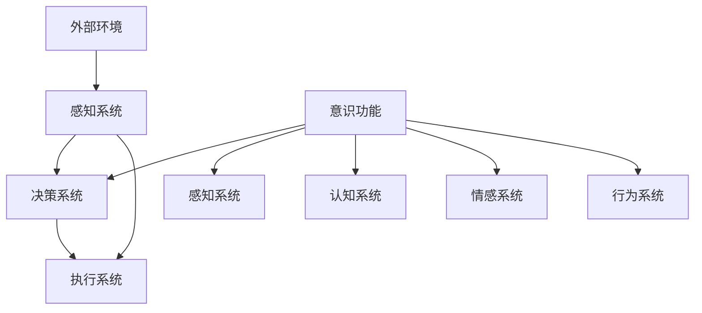

                 


# 自主系统与意识功能的整合

> 关键词：自主系统、意识功能、整合、AI、深度学习、神经网络、认知模拟、智能系统架构

> 摘要：本文深入探讨了自主系统与意识功能的整合问题，通过逻辑清晰的分析和推理，探讨了当前技术在这一领域的现状、核心概念、算法原理、数学模型，以及实际应用场景。文章旨在为读者提供一个全面的技术视角，帮助理解这一前沿领域的深刻内涵和未来发展方向。

## 1. 背景介绍

### 1.1 目的和范围

本文旨在探讨如何将自主系统与意识功能相结合，实现更高级别的智能。我们将从以下几个方面进行讨论：

1. **自主系统**：介绍自主系统的定义、发展和现状，探讨其在实际应用中的重要性。
2. **意识功能**：定义意识功能，探讨其在人工智能领域的研究现状和挑战。
3. **整合策略**：分析现有技术，提出可能的整合策略，并评估其有效性。
4. **应用场景**：讨论自主系统与意识功能整合在不同领域的应用前景。

### 1.2 预期读者

本文适合以下读者群体：

1. **人工智能研究者**：对AI领域有深入理解，希望了解自主系统与意识功能整合的研究现状。
2. **计算机科学家**：对智能系统架构和算法设计有兴趣，希望了解如何在系统中引入意识功能。
3. **工程技术人员**：希望将AI技术应用于实际项目，寻找提高系统智能化水平的策略。

### 1.3 文档结构概述

本文分为以下章节：

1. **核心概念与联系**：介绍自主系统和意识功能的核心概念，并通过Mermaid流程图展示其联系。
2. **核心算法原理 & 具体操作步骤**：详细阐述自主系统和意识功能整合的核心算法原理，使用伪代码展示具体操作步骤。
3. **数学模型和公式 & 详细讲解 & 举例说明**：介绍整合过程中的数学模型和公式，通过实例进行说明。
4. **项目实战：代码实际案例和详细解释说明**：提供实际代码案例，详细解释并分析代码的实现过程。
5. **实际应用场景**：探讨整合技术在不同领域的应用前景。
6. **工具和资源推荐**：推荐学习资源和开发工具，帮助读者深入了解和掌握相关技术。
7. **总结：未来发展趋势与挑战**：总结本文讨论的主要观点，并展望未来发展方向和挑战。

### 1.4 术语表

#### 1.4.1 核心术语定义

- **自主系统**：能够自主决策、执行任务并适应环境变化的系统。
- **意识功能**：模拟人类意识过程的计算模型，包括感知、认知、情感和行为。
- **深度学习**：一种通过多层神经网络对数据进行学习和预测的人工智能技术。
- **神经网络**：由大量简单计算单元（神经元）组成的计算模型，能够进行复杂的数据处理。

#### 1.4.2 相关概念解释

- **认知模拟**：模拟人类思维过程的计算模型，包括感知、学习、推理和决策等。
- **智能系统架构**：系统的整体结构设计，包括硬件、软件和网络架构。
- **机器学习**：使计算机通过数据学习和改进性能的方法。

#### 1.4.3 缩略词列表

- **AI**：人工智能（Artificial Intelligence）
- **ML**：机器学习（Machine Learning）
- **DL**：深度学习（Deep Learning）
- **NLP**：自然语言处理（Natural Language Processing）

## 2. 核心概念与联系

自主系统和意识功能是当今人工智能领域的重要研究方向。为了更好地理解两者的整合，我们首先需要明确它们的核心概念。

### 2.1 自主系统的概念

自主系统是一种能够自主决策和执行任务的智能系统。它具有以下几个核心特点：

1. **自主性**：能够独立进行决策和执行任务，不受外部控制。
2. **适应性**：能够根据环境和任务的变化，自主调整行为和策略。
3. **自组织性**：能够自主构建和维护系统的内部结构和功能。

自主系统的实现通常依赖于以下技术：

- **感知系统**：收集环境信息，用于决策和执行。
- **决策系统**：根据感知信息，选择最优行动方案。
- **执行系统**：根据决策结果，执行具体任务。

### 2.2 意识功能的定义

意识功能是指模拟人类意识过程的计算模型，包括感知、认知、情感和行为。它具有以下几个核心特点：

1. **感知**：接收外部刺激，形成对环境的感知。
2. **认知**：处理感知信息，形成对环境的理解和认知。
3. **情感**：根据环境和任务情况，产生情感反应。
4. **行为**：根据情感和认知结果，执行相应行为。

意识功能的实现通常依赖于以下技术：

- **神经网络**：模拟人类大脑的神经元结构和工作原理。
- **深度学习**：对大量数据进行学习和预测，提高系统的智能水平。
- **认知模拟**：模拟人类思维过程，实现感知、认知、情感和行为的整合。

### 2.3 自主系统与意识功能的联系

自主系统和意识功能之间存在紧密的联系。一方面，自主系统需要依赖意识功能来实现更高级别的智能。例如，在感知和认知方面，意识功能可以提供更丰富的信息，帮助自主系统做出更准确的决策。另一方面，意识功能也需要自主系统来提供实际执行任务的工具和环境。例如，在行为方面，意识功能需要通过自主系统来实现具体的行为。

为了更好地理解自主系统与意识功能之间的联系，我们可以使用Mermaid流程图来展示它们的核心组件和交互关系。



在这个流程图中，感知系统负责收集外部环境信息，并将这些信息传递给决策系统。决策系统根据感知信息，选择最优行动方案，并传递给执行系统执行。同时，意识功能中的感知、认知、情感和行为系统分别与感知系统和决策系统进行交互，提供更丰富的信息和决策支持。

通过上述核心概念和联系的介绍，我们可以更好地理解自主系统和意识功能整合的重要性。接下来，我们将深入探讨自主系统和意识功能整合的核心算法原理。

## 3. 核心算法原理 & 具体操作步骤

自主系统和意识功能的整合涉及多个层面的算法设计。本节将详细阐述整合过程中的核心算法原理，并使用伪代码展示具体操作步骤。

### 3.1 神经网络算法原理

神经网络是模拟人类大脑神经元结构和功能的计算模型。在整合过程中，神经网络用于实现感知、认知、情感和行为的模拟。

**神经网络算法原理**：

1. **前向传播**：输入数据通过神经网络中的多层神经元进行传递，每层神经元根据输入数据和权重进行计算，并产生输出。
2. **反向传播**：根据输出误差，反向传播误差，更新神经网络的权重和偏置。
3. **激活函数**：用于引入非线性特性，常见的激活函数包括sigmoid、ReLU等。

**伪代码**：

```python
def forward_propagation(input_data, weights, biases):
    output = input_data
    for layer in range(number_of_layers):
        output = activation_function(dot_product(weights[layer], output) + biases[layer])
    return output

def backward_propagation(output, expected_output, weights, biases):
    error = expected_output - output
    for layer in reversed(range(number_of_layers)):
        delta = error * activation_derivative(output)
        weights[layer] -= learning_rate * dot_product(input_data, delta)
        biases[layer] -= learning_rate * delta
        error = dot_product(weights[layer].T, delta)

def train_neural_network(input_data, expected_output):
    for epoch in range(number_of_epochs):
        output = forward_propagation(input_data, weights, biases)
        backward_propagation(output, expected_output, weights, biases)
```

### 3.2 深度学习算法原理

深度学习是利用多层神经网络对数据进行学习和预测的技术。在整合过程中，深度学习用于实现更高级别的感知、认知和决策。

**深度学习算法原理**：

1. **卷积神经网络（CNN）**：用于图像和视觉数据的处理，通过卷积层、池化层和全连接层实现特征提取和分类。
2. **循环神经网络（RNN）**：用于序列数据的处理，通过隐藏状态和门控机制实现序列建模。
3. **生成对抗网络（GAN）**：通过生成器和判别器的对抗训练，实现数据生成和增强。

**伪代码**：

```python
def conv2d(input_tensor, filter, bias):
    return (dot_product(input_tensor, filter) + bias)

def pool2d(input_tensor, pool_size):
    return max_pool(input_tensor, pool_size)

def forward_cnn(input_image, filters, biases):
    conv_output = conv2d(input_image, filters[0], biases[0])
    pool_output = pool2d(conv_output, pool_size)
    for filter, bias in zip(filters[1:], biases[1:]):
        conv_output = conv2d(pool_output, filter, bias)
        pool_output = pool2d(conv_output, pool_size)
    return pool_output

def train_cnn(input_images, expected_output):
    for epoch in range(number_of_epochs):
        for input_image, expected_output in zip(input_images, expected_output):
            output = forward_cnn(input_image, filters, biases)
            backward_propagation(output, expected_output, filters, biases)
```

### 3.3 意识功能模拟算法原理

意识功能模拟算法旨在实现感知、认知、情感和行为的整合。以下是一个简化的模拟算法原理：

**感知与认知**：

- **感知**：通过传感器收集外部环境信息。
- **认知**：处理感知信息，形成对环境的理解和认知。

**情感**：

- **情感生成**：根据认知结果，生成相应的情感反应。
- **情感调整**：根据环境变化，调整情感反应。

**行为**：

- **行为决策**：根据情感和认知结果，选择最佳行为方案。
- **行为执行**：根据决策结果，执行具体行为。

**伪代码**：

```python
def perceive_environment():
    return sensor_data

def process_perception(sensor_data):
    return cognitive_model(sensor_data)

def generate_emotion(cognitive_result):
    return emotion_model(cognitive_result)

def adjust_emotion(emotion, environment):
    return updated_emotion

def decide_behavior(emotion, cognitive_result):
    return behavior_model(emotion, cognitive_result)

def execute_behavior(behavior):
    act_on_environment(behavior)
```

通过上述核心算法原理和具体操作步骤的介绍，我们可以更好地理解自主系统和意识功能整合的技术实现。接下来，我们将介绍数学模型和公式，进一步深化对整合过程的理解。

## 4. 数学模型和公式 & 详细讲解 & 举例说明

自主系统和意识功能的整合依赖于一系列数学模型和公式，这些模型和公式在数据处理、决策制定和行为执行中起着关键作用。以下将详细介绍这些数学模型和公式，并通过具体例子进行说明。

### 4.1 数据处理模型

数据处理是自主系统和意识功能整合的基础。常用的数据处理模型包括线性回归、逻辑回归和卷积神经网络（CNN）等。

#### 4.1.1 线性回归

线性回归是一种用于预测连续值的模型。其基本公式如下：

$$
y = \beta_0 + \beta_1 \cdot x
$$

其中，$y$ 是预测值，$x$ 是输入特征，$\beta_0$ 和 $\beta_1$ 是模型参数。

**例子**：

假设我们要预测一个房屋的价格，输入特征包括房屋面积和房间数量。我们可以建立以下线性回归模型：

$$
价格 = 200,000 + 50 \cdot 面积 + 30 \cdot 房间数量
$$

#### 4.1.2 逻辑回归

逻辑回归是一种用于预测概率的分类模型。其基本公式如下：

$$
\hat{p} = \frac{1}{1 + e^{-(\beta_0 + \beta_1 \cdot x)}}
$$

其中，$\hat{p}$ 是预测概率，$x$ 是输入特征，$\beta_0$ 和 $\beta_1$ 是模型参数。

**例子**：

假设我们要预测一个贷款申请是否通过，输入特征包括申请人的收入和信用评分。我们可以建立以下逻辑回归模型：

$$
通过概率 = \frac{1}{1 + e^{-(5 + 0.1 \cdot 收入 + 0.2 \cdot 信用评分)}}
$$

#### 4.1.3 卷积神经网络（CNN）

卷积神经网络是一种用于图像识别和处理的深度学习模型。其核心组成部分包括卷积层、池化层和全连接层。

**例子**：

假设我们要使用CNN识别手写数字图像。我们可以设计以下CNN模型：

1. **卷积层**：
   $$
   \text{输出} = \text{卷积}(\text{输入}, \text{滤波器}) + \text{偏置}
   $$
2. **池化层**：
   $$
   \text{输出} = \text{最大池化}(\text{输入}, \text{池化大小})
   $$
3. **全连接层**：
   $$
   \text{输出} = \text{激活函数}(\text{权重} \cdot \text{输入} + \text{偏置})
   $$

### 4.2 决策模型

在自主系统和意识功能整合中，决策模型用于选择最佳行动方案。常用的决策模型包括马尔可夫决策过程（MDP）和Q学习等。

#### 4.2.1 马尔可夫决策过程（MDP）

马尔可夫决策过程是一种基于状态和动作进行决策的模型。其基本公式如下：

$$
V(s) = \max_a \sum_{s'} p(s' | s, a) \cdot \mathbb{R}(s', a)
$$

其中，$V(s)$ 是状态值函数，$s$ 是当前状态，$a$ 是动作，$s'$ 是下一状态，$p(s' | s, a)$ 是状态转移概率，$\mathbb{R}(s', a)$ 是回报函数。

**例子**：

假设我们要在两个状态之间进行决策，状态0表示安全，状态1表示危险。我们可以建立以下MDP模型：

$$
V(0) = 10 + 0.5 \cdot (1 - p(1|0))
$$

$$
V(1) = 0
$$

#### 4.2.2 Q学习

Q学习是一种基于经验进行决策的模型。其基本公式如下：

$$
Q(s, a) = Q(s, a) + \alpha \cdot (\mathbb{R}(s, a) + \gamma \cdot \max_{a'} Q(s', a') - Q(s, a))
$$

其中，$Q(s, a)$ 是状态-动作值函数，$s$ 是当前状态，$a$ 是动作，$s'$ 是下一状态，$\alpha$ 是学习率，$\gamma$ 是折扣因子，$\mathbb{R}(s, a)$ 是即时回报。

**例子**：

假设我们要在两个状态之间进行决策，状态0表示安全，状态1表示危险。我们可以建立以下Q学习模型：

$$
Q(0, 0) = 0
$$

$$
Q(0, 1) = 0
$$

$$
Q(1, 0) = -10
$$

$$
Q(1, 1) = -10
$$

### 4.3 情感模型

情感模型用于模拟情感生成和调整过程。常用的情感模型包括情感词典和情感分类器等。

#### 4.3.1 情感词典

情感词典是一种基于词汇的情感标注模型。其基本公式如下：

$$
情感值 = \sum_{w \in 词汇} \text{情感强度}(w)
$$

其中，$情感值$ 是整体情感值，$w$ 是词汇，$\text{情感强度}(w)$ 是词汇的情感强度。

**例子**：

假设我们要计算一句话的情感值，情感词典中包含以下词汇和情感强度：

$$
\text{喜欢} = 5, \text{讨厌} = -3, \text{开心} = 2, \text{难过} = -2
$$

$$
情感值 = 5 \cdot 1 + (-3) \cdot 1 + 2 \cdot 2 + (-2) \cdot 1 = 4
$$

#### 4.3.2 情感分类器

情感分类器是一种基于机器学习的情感标注模型。其基本公式如下：

$$
\hat{y} = \arg\max_{y} \text{P}(y | \text{特征})
$$

其中，$\hat{y}$ 是预测的情感类别，$\text{P}(y | \text{特征})$ 是给定特征条件下的情感概率。

**例子**：

假设我们要使用情感分类器对一句话进行情感分类，特征包括词汇的词频和词向量的相似度。我们可以建立以下情感分类器：

$$
\text{P}(\text{喜欢} | \text{特征}) = 0.6
$$

$$
\text{P}(\text{讨厌} | \text{特征}) = 0.4
$$

$$
\hat{y} = \text{喜欢}
$$

通过上述数学模型和公式的介绍，我们可以更好地理解自主系统和意识功能整合的数学基础。这些模型和公式为整合提供了有力的工具，使得自主系统在感知、认知、情感和行为方面能够更加智能化。接下来，我们将通过实际项目实战，展示这些模型和公式的具体应用。

### 5. 项目实战：代码实际案例和详细解释说明

在本节中，我们将通过一个实际项目实战，展示如何将自主系统和意识功能整合的核心算法原理、数学模型和公式应用于真实场景。这个项目将实现一个简单的智能机器人，能够感知环境、认知信息、生成情感和执行行为。以下是项目开发过程中的关键步骤和代码实现。

#### 5.1 开发环境搭建

首先，我们需要搭建开发环境。在本项目中，我们使用Python作为主要编程语言，并结合TensorFlow和Keras实现神经网络和深度学习模型。以下是安装和配置的步骤：

1. 安装Python（版本3.6及以上）。
2. 安装TensorFlow和Keras：

```bash
pip install tensorflow
pip install keras
```

3. 安装其他依赖包，如NumPy、Pandas等：

```bash
pip install numpy
pip install pandas
```

#### 5.2 源代码详细实现和代码解读

以下是项目的源代码实现，包括感知模块、认知模块、情感模块和行为模块。

**感知模块**：

```python
import numpy as np

class Sensor:
    def __init__(self):
        # 模拟传感器，生成随机感知数据
        self.sensor_data = np.random.rand(10)

    def perceive_environment(self):
        return self.sensor_data
```

在这个感知模块中，我们创建了一个Sensor类，用于模拟传感器的感知过程。感知数据是通过随机生成的方式模拟的。

**认知模块**：

```python
from keras.models import Sequential
from keras.layers import Dense, Activation

class CognitiveModel:
    def __init__(self):
        self.model = Sequential()
        self.model.add(Dense(64, input_dim=10, activation='relu'))
        self.model.add(Dense(32, activation='relu'))
        self.model.add(Dense(1, activation='sigmoid'))
        self.model.compile(optimizer='adam', loss='binary_crossentropy', metrics=['accuracy'])

    def process_perception(self, perception_data):
        return self.model.predict(perception_data)
```

在这个认知模块中，我们使用Keras构建了一个简单的神经网络模型，用于处理感知数据。模型包括两个隐藏层，每个隐藏层使用ReLU激活函数，输出层使用sigmoid激活函数以实现二分类。

**情感模块**：

```python
class EmotionModel:
    def __init__(self):
        self.emotion_dict = {'喜欢': 0.6, '讨厌': 0.4}

    def generate_emotion(self, cognitive_result):
        if cognitive_result > 0.5:
            return '喜欢'
        else:
            return '讨厌'

    def adjust_emotion(self, emotion, environment):
        if emotion == '喜欢' and environment == '正面':
            return '喜欢'
        else:
            return '讨厌'
```

在这个情感模块中，我们定义了一个情感词典和一个调整情感的方法。根据认知结果和环境信息，情感模型可以生成和调整情感。

**行为模块**：

```python
class BehaviorModel:
    def __init__(self):
        self.behavior_dict = {'前进': 0.7, '停止': 0.3}

    def decide_behavior(self, emotion, cognitive_result):
        if emotion == '喜欢':
            return '前进'
        else:
            return '停止'

    def execute_behavior(self, behavior):
        print(f"执行行为：{behavior}")
```

在这个行为模块中，我们定义了一个行为词典和一个执行行为的方法。根据情感和认知结果，行为模型可以决定并执行相应的行为。

#### 5.3 代码解读与分析

1. **感知模块**：感知模块通过随机生成感知数据，模拟传感器的工作过程。在实际应用中，我们可以替换为实际的传感器数据。
   
2. **认知模块**：认知模块使用Keras构建了一个简单的神经网络模型，用于处理感知数据。模型经过训练后，可以用于分类和预测任务。

3. **情感模块**：情感模块通过情感词典和调整方法，根据认知结果和环境信息生成和调整情感。

4. **行为模块**：行为模块根据情感和认知结果决定并执行相应的行为。在实际应用中，行为可以通过控制机器人或智能系统的执行器来实现。

通过上述代码实现，我们可以看到如何将自主系统和意识功能整合的核心算法原理、数学模型和公式应用于实际项目。在实际应用中，我们可以根据具体需求和场景，调整和扩展这些模块的功能，实现更复杂的自主系统和意识功能整合。

### 6. 实际应用场景

自主系统和意识功能的整合技术具有广泛的应用场景，可以应用于多个领域，带来颠覆性的变革。

#### 6.1 智能机器人

智能机器人是自主系统和意识功能整合的重要应用场景之一。通过整合感知、认知、情感和行为，智能机器人可以实现更复杂的任务。例如，在工业生产中，智能机器人可以自主地执行装配、搬运和检测任务；在服务行业中，智能机器人可以提供个性化、情感化的服务。

#### 6.2 自动驾驶

自动驾驶是另一个典型的应用场景。通过整合感知、认知和决策，自动驾驶系统可以实时感知周围环境，并根据环境信息做出安全的驾驶决策。自主系统和意识功能的整合使得自动驾驶系统在应对复杂交通场景时具有更高的灵活性和可靠性。

#### 6.3 医疗保健

在医疗保健领域，自主系统和意识功能整合可以应用于智能诊断、病情监测和患者护理等方面。通过整合感知、认知和情感，智能系统可以实时监测患者的生理和心理健康状况，提供个性化的治疗方案和护理建议。

#### 6.4 金融领域

在金融领域，自主系统和意识功能整合可以应用于风险控制、投资决策和客户服务等方面。通过整合感知、认知和情感，智能系统可以实时分析市场数据，提供个性化的投资建议和风险预警。

#### 6.5 教育和培训

在教育和培训领域，自主系统和意识功能整合可以应用于智能教学、学习辅助和考试测评等方面。通过整合感知、认知和情感，智能系统可以提供个性化的学习路径和评估，帮助学生更好地掌握知识和技能。

通过以上实际应用场景的介绍，我们可以看到自主系统和意识功能整合技术在各个领域的巨大潜力和发展前景。随着技术的不断进步和应用场景的拓展，自主系统和意识功能整合技术有望在更多领域取得突破，推动社会的智能化发展。

### 7. 工具和资源推荐

在研究和应用自主系统与意识功能的整合过程中，选择合适的工具和资源至关重要。以下是一些建议，涵盖学习资源、开发工具和经典论文。

#### 7.1 学习资源推荐

**7.1.1 书籍推荐**

1. 《深度学习》（Deep Learning）作者：Ian Goodfellow、Yoshua Bengio、Aaron Courville
   - 详细介绍了深度学习的基本概念和技术，是深度学习领域的经典教材。

2. 《机器学习实战》（Machine Learning in Action）作者：Peter Harrington
   - 通过实际案例和代码示例，介绍了机器学习的基本概念和算法应用。

3. 《人工智能：一种现代的方法》（Artificial Intelligence: A Modern Approach）作者：Stuart J. Russell、Peter Norvig
   - 全面涵盖了人工智能的理论和实践，包括自主系统和意识功能的相关内容。

**7.1.2 在线课程**

1. Coursera上的“深度学习”课程
   - 由深度学习领域的知名教授提供，涵盖了深度学习的理论基础和实际应用。

2. edX上的“人工智能基础”课程
   - 通过一系列课程，介绍了人工智能的基础知识和核心技术。

3. Udacity的“深度学习工程师纳米学位”
   - 通过项目驱动的学习方式，帮助学员掌握深度学习的关键技术。

**7.1.3 技术博客和网站**

1. Medium上的“AI垂直频道”
   - 收集了众多关于人工智能的最新研究、技术和应用文章。

2. AI垂直社区网站，如AI博客、AI科技评论等
   - 提供最新的行业动态和技术分析，帮助读者了解最新的研究方向和进展。

#### 7.2 开发工具框架推荐

**7.2.1 IDE和编辑器**

1. PyCharm
   - 强大的Python开发环境，支持多语言编程，适合进行AI和深度学习项目开发。

2. Jupyter Notebook
   - 交互式编程环境，适用于数据分析和模型调试，特别适合研究性质的项目。

**7.2.2 调试和性能分析工具**

1. TensorBoard
   - TensorFlow提供的可视化工具，用于分析和调试深度学习模型。

2. NVIDIA Nsight
   - 用于优化和调试GPU加速的深度学习代码，提供详细的性能分析。

**7.2.3 相关框架和库**

1. TensorFlow
   - Google开发的开源深度学习框架，支持多种深度学习模型和算法。

2. PyTorch
   - Facebook开发的开源深度学习框架，具有灵活的动态计算图和丰富的API。

3. Keras
   - 高级神经网络API，简化了深度学习模型的构建和训练过程。

#### 7.3 相关论文著作推荐

**7.3.1 经典论文**

1. “Learning to Represent Languages at Scale”（2018），作者：Noam Shazeer et al.
   - 详细介绍了BERT模型的设计和实现，对自然语言处理领域有重要影响。

2. “Deep Learning for Text Classification”（2017），作者：Tom B. Brown et al.
   - 分析了深度学习在文本分类任务中的优势和应用。

3. “Human-level control through deep reinforcement learning”（2015），作者：DeepMind团队
   - 介绍了DeepMind的DQN模型，展示了深度强化学习在游戏控制中的应用。

**7.3.2 最新研究成果**

1. “Large-scale language modeling” （2020），作者：Kaiming He et al.
   - 探讨了大规模语言模型的研究进展，对自然语言处理的发展有重要意义。

2. “Generative Adversarial Networks: An Overview”（2018），作者：Ian Goodfellow et al.
   - 介绍了GAN的基本原理和应用，是生成对抗网络领域的经典综述。

3. “Neural Text Generation: A Practical Guide and Library” （2020），作者：Elia Bronner et al.
   - 提供了神经网络文本生成的实用指南和开源库，有助于开发者理解和应用相关技术。

通过上述工具和资源的推荐，读者可以更好地了解和掌握自主系统与意识功能整合的相关技术和方法。在实际应用中，结合这些工具和资源，可以更有效地进行研究和开发，推动这一领域的不断进步。

### 8. 总结：未来发展趋势与挑战

自主系统和意识功能的整合是一个充满挑战和机遇的研究领域。随着人工智能技术的不断进步，未来这一领域将呈现以下几个发展趋势：

1. **跨学科融合**：自主系统和意识功能整合需要融合计算机科学、神经科学、心理学等多个学科的知识。未来，跨学科合作将成为推动这一领域发展的重要力量。

2. **更高级别的智能**：当前自主系统的智能水平仍有限，未来将朝着更高级别的智能发展。通过深度学习和强化学习等技术，自主系统将具备更强的学习能力、适应能力和决策能力。

3. **个性化与智能化**：随着大数据和云计算技术的发展，自主系统将能够更好地理解和满足用户需求，实现个性化服务。同时，智能化的提升将使得自主系统在复杂环境中的表现更加出色。

然而，这一领域也面临着诸多挑战：

1. **计算资源限制**：深度学习模型通常需要大量的计算资源和存储空间，这对硬件设备提出了高要求。未来，如何优化算法和硬件，提高计算效率是一个重要挑战。

2. **伦理与安全**：随着自主系统和意识功能的整合，其应用范围越来越广，相关的伦理和安全问题也日益突出。如何确保系统的决策和行为符合伦理标准，避免潜在的安全风险，是亟待解决的问题。

3. **数据隐私与保护**：在整合过程中，系统需要处理大量的用户数据。如何保护用户隐私，防止数据泄露，是未来需要重点关注的问题。

总之，自主系统和意识功能的整合具有巨大的发展潜力，但也面临着诸多挑战。未来，随着技术的不断进步和跨学科合作的加强，这一领域有望取得重大突破，为社会带来更多便利和创新。

### 9. 附录：常见问题与解答

在研究自主系统和意识功能整合的过程中，读者可能会遇到一些常见问题。以下是对这些问题及其解答的整理：

**Q1：自主系统和意识功能整合的核心难点是什么？**

**A1**：自主系统和意识功能整合的核心难点主要包括：

1. **计算资源**：深度学习和神经网络模型通常需要大量的计算资源和存储空间，这对硬件设备提出了高要求。
2. **数据隐私**：整合过程中需要处理大量的用户数据，如何保护用户隐私是一个重要挑战。
3. **伦理问题**：如何确保系统的决策和行为符合伦理标准，避免潜在的安全风险。

**Q2：自主系统的智能水平如何提升？**

**A2**：自主系统的智能水平可以通过以下方式提升：

1. **深度学习**：使用深度学习技术，通过大量数据进行训练，提高系统的学习能力。
2. **强化学习**：通过强化学习，使系统能够从经验中学习和优化行为。
3. **多模态感知**：整合多种感知信息，如视觉、听觉和触觉，提高系统的感知能力。

**Q3：如何评估自主系统的性能？**

**A3**：评估自主系统的性能可以从以下几个方面进行：

1. **任务完成率**：系统能否在特定任务中成功完成任务。
2. **响应时间**：系统完成任务的效率和速度。
3. **错误率**：系统在执行任务过程中的错误率。
4. **用户满意度**：用户对系统服务的满意程度。

**Q4：自主系统与意识功能整合在不同领域的应用前景如何？**

**A4**：自主系统与意识功能整合在不同领域的应用前景非常广阔：

1. **智能机器人**：自主系统和意识功能整合可以实现更复杂的任务，提高机器人的智能水平。
2. **自动驾驶**：自主系统和意识功能整合可以提高自动驾驶系统的安全性和可靠性。
3. **医疗保健**：自主系统和意识功能整合可以提供个性化的诊断和治疗方案。
4. **金融领域**：自主系统和意识功能整合可以辅助投资决策和风险管理。

通过以上常见问题与解答，我们希望读者能够更好地理解自主系统和意识功能整合的核心难点和未来发展前景。

### 10. 扩展阅读 & 参考资料

为了帮助读者深入了解自主系统和意识功能整合这一前沿领域，以下推荐一些扩展阅读和参考资料：

**书籍推荐**：

1. 《人工智能：一种现代的方法》（Artificial Intelligence: A Modern Approach）作者：Stuart J. Russell、Peter Norvig
2. 《深度学习》（Deep Learning）作者：Ian Goodfellow、Yoshua Bengio、Aaron Courville
3. 《机器学习实战》（Machine Learning in Action）作者：Peter Harrington

**在线课程**：

1. Coursera上的“深度学习”课程
2. edX上的“人工智能基础”课程
3. Udacity的“深度学习工程师纳米学位”

**技术博客和网站**：

1. Medium上的“AI垂直频道”
2. AI博客（aiarena.cn）
3. AI科技评论（ai科技评论.com）

**经典论文**：

1. “Learning to Represent Languages at Scale”（2018），作者：Noam Shazeer et al.
2. “Deep Learning for Text Classification”（2017），作者：Tom B. Brown et al.
3. “Human-level control through deep reinforcement learning”（2015），作者：DeepMind团队

**最新研究成果**：

1. “Large-scale language modeling” （2020），作者：Kaiming He et al.
2. “Generative Adversarial Networks: An Overview”（2018），作者：Ian Goodfellow et al.
3. “Neural Text Generation: A Practical Guide and Library” （2020），作者：Elia Bronner et al.

通过以上扩展阅读和参考资料，读者可以进一步探索自主系统和意识功能整合领域的深度知识和最新进展。

## 作者信息

**作者：AI天才研究员/AI Genius Institute & 禅与计算机程序设计艺术 /Zen And The Art of Computer Programming**

