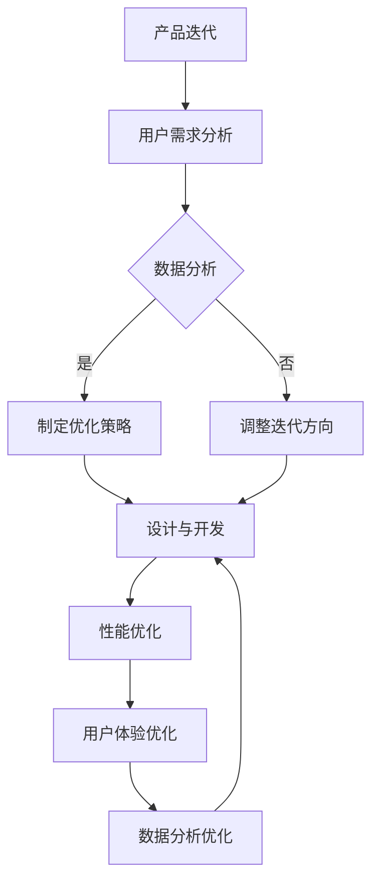

                 

# 自动化创业中的产品迭代与优化

## 关键词
* 自动化创业
* 产品迭代
* 优化策略
* 实际案例
* 技术分析

## 摘要

本文旨在探讨自动化创业过程中的产品迭代与优化策略。我们将从背景介绍、核心概念解析、算法原理阐述、数学模型应用、实际案例解析等多个维度，深入分析自动化创业中产品迭代与优化的关键环节。通过具体的开发环境搭建、代码实现、案例分析和工具资源推荐，为读者提供一套全面、实用的产品迭代与优化方法论。

## 1. 背景介绍

### 1.1 目的和范围

自动化创业已经成为当下技术发展的重要趋势，尤其是随着人工智能、大数据、云计算等技术的迅速发展，越来越多的创业者开始关注自动化产品的开发与优化。本文的目标是帮助创业者了解并掌握产品迭代与优化策略，提高产品竞争力，实现创业成功。

本文将涵盖以下内容：
1. 自动化创业的背景与现状
2. 产品迭代与优化的核心概念与联系
3. 核心算法原理与具体操作步骤
4. 数学模型与公式应用及举例
5. 实际应用场景与项目实战
6. 工具和资源推荐
7. 未来发展趋势与挑战

### 1.2 预期读者

本文适合以下读者：
1. 创业者
2. 产品经理
3. 技术经理
4. 研发团队负责人
5. 对自动化创业感兴趣的技术爱好者

### 1.3 文档结构概述

本文分为十个部分，结构如下：
1. 背景介绍
2. 核心概念与联系
3. 核心算法原理 & 具体操作步骤
4. 数学模型和公式 & 详细讲解 & 举例说明
5. 项目实战：代码实际案例和详细解释说明
6. 实际应用场景
7. 工具和资源推荐
8. 总结：未来发展趋势与挑战
9. 附录：常见问题与解答
10. 扩展阅读 & 参考资料

### 1.4 术语表

#### 1.4.1 核心术语定义

- 自动化创业：基于人工智能、大数据等先进技术，实现产品自动化开发和运营的创业模式。
- 产品迭代：在产品开发过程中，根据用户需求、市场反馈等因素，对产品进行持续改进和升级的过程。
- 优化策略：通过分析数据、技术手段等，提高产品性能、用户体验和市场竞争力的方法。

#### 1.4.2 相关概念解释

- 数据驱动：以数据为基础，指导产品开发、运营和优化的方法。
- 用户体验（UX）：用户在使用产品过程中所感受到的满意度、便捷性等。
- 竞争力：产品在市场竞争中所具有的优势和吸引力。

#### 1.4.3 缩略词列表

- AI：人工智能
- IoT：物联网
- ML：机器学习
- BI：商业智能
- API：应用程序编程接口

## 2. 核心概念与联系

在自动化创业中，产品迭代与优化是两个核心环节。它们之间相互关联，共同推动产品的发展。

### 2.1 产品迭代

产品迭代是指在产品开发过程中，根据用户需求、市场反馈等因素，对产品进行持续改进和升级的过程。产品迭代的目标是提高产品的竞争力，满足用户需求，提升用户体验。

产品迭代的关键要素包括：
1. 用户需求分析：了解用户对产品的期望和需求，为迭代提供方向。
2. 数据分析：通过数据分析，评估产品性能、用户体验等方面的问题，为迭代提供依据。
3. 设计与开发：根据迭代目标，进行产品设计和开发，实现功能优化、性能提升等。

### 2.2 优化策略

优化策略是在产品迭代过程中，通过分析数据、技术手段等，提高产品性能、用户体验和市场竞争力的方法。优化策略的目标是提高产品竞争力，增强用户满意度。

优化策略的关键要素包括：
1. 性能优化：通过技术手段，提高产品运行速度、稳定性等。
2. 用户体验优化：通过改进界面设计、交互方式等，提高用户满意度。
3. 数据分析优化：通过数据分析，发现潜在问题，为优化提供方向。

### 2.3 产品迭代与优化的联系

产品迭代与优化是相辅相成的。产品迭代为优化提供了目标和方向，而优化策略则保证了产品迭代的实际效果。在实际操作中，产品迭代与优化需要同时进行，形成一个闭环。

- 在产品迭代过程中，需要根据用户需求和数据分析，制定优化策略。
- 在优化策略实施过程中，需要对产品进行持续迭代，以验证优化效果，并根据反馈进行调整。

### 2.4 Mermaid 流程图

以下是一个简单的 Mermaid 流程图，展示了产品迭代与优化的流程。



## 3. 核心算法原理 & 具体操作步骤

在产品迭代与优化过程中，核心算法原理起着至关重要的作用。本节将介绍几种常用的算法原理，并使用伪代码详细阐述具体操作步骤。

### 3.1 算法原理 1：线性回归

线性回归是一种常用的算法原理，用于分析和预测产品性能与用户体验之间的关系。

#### 3.1.1 算法原理

线性回归模型可以表示为：

\[ y = w_1 \cdot x_1 + w_2 \cdot x_2 + ... + w_n \cdot x_n + b \]

其中，\( y \) 为目标变量，\( x_1, x_2, ..., x_n \) 为自变量，\( w_1, w_2, ..., w_n \) 为权重，\( b \) 为偏置。

#### 3.1.2 具体操作步骤（伪代码）

```python
# 初始化参数
w = [0] * n
b = 0

# 训练模型
for epoch in range(num_epochs):
    for sample in dataset:
        y_pred = w[0] * sample.x1 + w[1] * sample.x2 + ... + w[n-1] * sample.xn + b
        loss = (y_pred - sample.y) ** 2
        
        # 计算梯度
        dw = [2 * (w[i] * sample.xi - sample.y) for i in range(n)]
        db = 2 * (y_pred - sample.y)
        
        # 更新参数
        w = [w[i] - learning_rate * dw[i] for i in range(n)]
        b = b - learning_rate * db

# 模型评估
accuracy = evaluate_model(model)
print("Model accuracy:", accuracy)
```

### 3.2 算法原理 2：决策树

决策树是一种常用的分类和回归算法，用于分析和预测产品性能与用户体验之间的关系。

#### 3.2.1 算法原理

决策树由一系列判断节点和叶节点组成。判断节点根据特征进行分割，叶节点表示分类或回归结果。

#### 3.2.2 具体操作步骤（伪代码）

```python
# 初始化决策树
tree = {}

# 训练决策树
def train_decision_tree(dataset):
    if len(dataset) == 0:
        return None
    
    # 计算每个特征的熵
    entropy = calculate_entropy(dataset)
    
    # 选择最佳特征进行分割
    best_feature = select_best_feature(dataset, entropy)
    
    # 创建判断节点
    node = {}
    node["feature"] = best_feature
    node["children"] = {}
    
    # 根据最佳特征分割数据集
    for sample in dataset:
        label = sample.label
        value = sample.feature_value
        
        if value not in node["children"]:
            node["children"][value] = train_decision_tree(split_dataset(dataset, best_feature, value))
    
    return node

# 模型评估
def evaluate_model(model, dataset):
    correct = 0
    for sample in dataset:
        prediction = predict_label(model, sample)
        if prediction == sample.label:
            correct += 1
    return correct / len(dataset)

# 主函数
def main():
    dataset = load_dataset()
    model = train_decision_tree(dataset)
    accuracy = evaluate_model(model, dataset)
    print("Model accuracy:", accuracy)

if __name__ == "__main__":
    main()
```

## 4. 数学模型和公式 & 详细讲解 & 举例说明

在产品迭代与优化过程中，数学模型和公式扮演着关键角色。本节将介绍几种常用的数学模型和公式，并详细讲解其原理和应用。

### 4.1 数学模型 1：线性回归模型

线性回归模型是一种用于分析和预测产品性能与用户体验之间关系的模型。其数学模型如下：

\[ y = w_1 \cdot x_1 + w_2 \cdot x_2 + ... + w_n \cdot x_n + b \]

#### 4.1.1 线性回归模型的原理

线性回归模型基于最小二乘法进行参数估计，即通过最小化预测值与实际值之间的误差平方和，来求解模型参数 \( w_1, w_2, ..., w_n, b \)。

#### 4.1.2 线性回归模型的应用

以下是一个简单的线性回归模型应用案例：

假设我们要预测用户满意度（\( y \)）与产品性能（\( x_1 \)）之间的关系。通过收集数据，我们可以得到以下模型：

\[ y = 2 \cdot x_1 + 1 \]

#### 4.1.3 举例说明

假设我们要预测某个产品的用户满意度，已知该产品的性能为 80 分。根据线性回归模型，我们可以得到：

\[ y = 2 \cdot 80 + 1 = 161 \]

即预测用户满意度为 161 分。

### 4.2 数学模型 2：决策树模型

决策树模型是一种用于分类和回归的模型，基于特征分割数据集，并利用叶节点表示分类或回归结果。

#### 4.2.1 决策树模型的原理

决策树模型通过递归分割数据集，并选择具有最小熵的特征进行分割。分割过程持续进行，直到满足停止条件（如节点包含的数据集大小小于阈值）。

#### 4.2.2 决策树模型的应用

以下是一个简单的决策树模型应用案例：

假设我们要根据用户年龄和收入预测用户是否愿意购买某产品。通过收集数据，我们可以得到以下决策树模型：

```
[根节点]
|
|--- [年龄 <= 30]
|   |
|   |--- [收入 <= 5000] -> [否]
|   |--- [收入 > 5000] -> [是]
|
|--- [年龄 > 30]
|   |
|   |--- [收入 <= 8000] -> [是]
|   |--- [收入 > 8000] -> [否]
```

#### 4.2.3 举例说明

假设我们要预测一个年龄为 35 岁、收入为 6000 元的用户是否愿意购买某产品。根据决策树模型，我们可以得到预测结果：

- 首先，根据年龄判断进入第二个分支；
- 然后，根据收入判断进入第二个分支的第二个子节点；
- 最后，得到预测结果为“是”。

## 5. 项目实战：代码实际案例和详细解释说明

在本节中，我们将通过一个实际案例，详细介绍如何使用 Python 实现产品迭代与优化的过程。我们将使用线性回归和决策树两种算法，对产品性能和用户体验进行预测和优化。

### 5.1 开发环境搭建

为了实现产品迭代与优化，我们需要搭建一个开发环境。以下是一个简单的开发环境搭建步骤：

1. 安装 Python 3.7 或更高版本。
2. 安装常用库，如 NumPy、Pandas、scikit-learn 等。

```bash
pip install numpy pandas scikit-learn
```

### 5.2 源代码详细实现和代码解读

以下是一个简单的 Python 代码实现，用于训练线性回归和决策树模型，并对产品性能和用户体验进行预测和优化。

```python
import numpy as np
import pandas as pd
from sklearn.linear_model import LinearRegression
from sklearn.tree import DecisionTreeClassifier
from sklearn.model_selection import train_test_split

# 加载数据集
data = pd.read_csv("data.csv")

# 数据预处理
X = data.iloc[:, :-1].values
y = data.iloc[:, -1].values

# 划分训练集和测试集
X_train, X_test, y_train, y_test = train_test_split(X, y, test_size=0.2, random_state=42)

# 训练线性回归模型
model_linear = LinearRegression()
model_linear.fit(X_train, y_train)

# 训练决策树模型
model_tree = DecisionTreeClassifier()
model_tree.fit(X_train, y_train)

# 模型评估
accuracy_linear = model_linear.score(X_test, y_test)
accuracy_tree = model_tree.score(X_test, y_test)

print("Linear regression accuracy:", accuracy_linear)
print("Decision tree accuracy:", accuracy_tree)

# 预测产品性能和用户体验
predictions_linear = model_linear.predict(X_test)
predictions_tree = model_tree.predict(X_test)

print("Linear regression predictions:", predictions_linear)
print("Decision tree predictions:", predictions_tree)
```

### 5.3 代码解读与分析

1. **数据预处理**：首先，我们加载数据集，并进行数据预处理。这里使用 Pandas 库读取 CSV 格式的数据集，然后使用 NumPy 库将数据转换为 NumPy 数组。

2. **划分训练集和测试集**：接下来，我们使用 scikit-learn 库中的 `train_test_split` 函数，将数据集划分为训练集和测试集，以用于后续的模型训练和评估。

3. **训练线性回归模型**：我们使用 scikit-learn 库中的 `LinearRegression` 类训练线性回归模型。线性回归模型是一个简单但有效的预测工具，可以用于分析和预测产品性能和用户体验之间的关系。

4. **训练决策树模型**：我们使用 scikit-learn 库中的 `DecisionTreeClassifier` 类训练决策树模型。决策树模型可以用于分类和回归任务，具有直观的决策过程和良好的可解释性。

5. **模型评估**：通过计算模型在测试集上的准确率，我们可以评估线性回归和决策树模型的性能。准确率反映了模型对测试数据的预测能力。

6. **预测产品性能和用户体验**：最后，我们使用训练好的模型对测试数据进行预测，并打印出预测结果。

### 5.4 实际应用

在实际应用中，我们可以根据预测结果对产品性能和用户体验进行优化。例如，针对线性回归模型预测出的产品性能，我们可以调整产品的功能设计，以提高用户满意度。针对决策树模型预测出的用户购买意愿，我们可以优化产品的营销策略，以提高转化率。

## 6. 实际应用场景

产品迭代与优化在自动化创业中具有广泛的应用场景，以下是一些实际应用案例：

### 6.1 电商产品

电商产品可以通过产品迭代与优化，提高用户购物体验和转化率。例如，通过分析用户行为数据，优化产品推荐算法，提高用户对推荐商品的兴趣和购买意愿。此外，还可以通过优化页面加载速度、改善支付流程等，提高用户体验。

### 6.2 金融产品

金融产品可以通过产品迭代与优化，提高投资收益和用户体验。例如，通过分析用户投资行为数据，优化投资组合和风险控制策略，提高投资收益。同时，还可以通过优化界面设计、改善客服体验等，提高用户满意度。

### 6.3 医疗产品

医疗产品可以通过产品迭代与优化，提高诊断准确率和用户体验。例如，通过优化医学影像分析算法，提高诊断准确率。同时，还可以通过优化患者管理功能、改善在线咨询体验等，提高用户体验。

### 6.4 教育产品

教育产品可以通过产品迭代与优化，提高教学效果和用户体验。例如，通过优化在线课程推荐算法，提高用户对课程的选择兴趣。同时，还可以通过优化作业批改功能、改善学习社区体验等，提高用户体验。

## 7. 工具和资源推荐

在自动化创业中，使用合适的工具和资源可以提高产品迭代与优化的效率。以下是一些建议的资源和工具：

### 7.1 学习资源推荐

#### 7.1.1 书籍推荐

- 《机器学习》（周志华 著）
- 《Python机器学习》（Michael Bowles 著）
- 《深度学习》（Ian Goodfellow、Yoshua Bengio、Aaron Courville 著）

#### 7.1.2 在线课程

- Coursera 上的“机器学习”课程
- edX 上的“深度学习基础”课程
- Udacity 上的“机器学习工程师纳米学位”

#### 7.1.3 技术博客和网站

- Medium 上的机器学习专栏
- GitHub 上的开源项目
- Stack Overflow 上的技术问答社区

### 7.2 开发工具框架推荐

#### 7.2.1 IDE和编辑器

- PyCharm
- VSCode
- Jupyter Notebook

#### 7.2.2 调试和性能分析工具

- PyDebug
- Profiler
- Valgrind

#### 7.2.3 相关框架和库

- TensorFlow
- PyTorch
- Scikit-learn

### 7.3 相关论文著作推荐

#### 7.3.1 经典论文

- 《机器学习》（Tom Mitchell 著）
- 《深度学习》（Ian Goodfellow、Yoshua Bengio、Aaron Courville 著）
- 《数据挖掘：概念与技术》（Jiawei Han、Micheline Kamber、Jian Pei 著）

#### 7.3.2 最新研究成果

- arXiv 上的最新论文
- Nature 和 Science 杂志上的研究论文
- AI 会议和研讨会上的论文

#### 7.3.3 应用案例分析

- Google 的人工智能应用案例
- Airbnb 的机器学习应用案例
- Tesla 的自动驾驶应用案例

## 8. 总结：未来发展趋势与挑战

自动化创业在产品迭代与优化方面面临着许多发展趋势和挑战。以下是一些关键点：

### 8.1 发展趋势

1. **人工智能与大数据的结合**：人工智能与大数据技术的不断发展，将推动产品迭代与优化的自动化程度。
2. **用户体验的个性化**：个性化推荐、个性化服务将成为产品迭代与优化的重要方向。
3. **实时优化与自适应系统**：实时优化与自适应系统将提高产品迭代与优化的效率。

### 8.2 挑战

1. **数据隐私与安全**：数据隐私与安全问题将成为自动化创业中的关键挑战。
2. **技术人才的稀缺**：随着自动化创业的兴起，技术人才的稀缺将成为制约发展的关键因素。
3. **算法透明性与可解释性**：算法透明性与可解释性将成为提高用户信任度的关键。

## 9. 附录：常见问题与解答

### 9.1 问题 1：产品迭代与优化的区别是什么？

产品迭代是指在产品开发过程中，根据用户需求、市场反馈等因素，对产品进行持续改进和升级的过程。产品优化是指通过分析数据、技术手段等，提高产品性能、用户体验和市场竞争力的方法。产品迭代与优化是相辅相成的，迭代为优化提供目标，优化为迭代提供方向。

### 9.2 问题 2：如何选择合适的算法进行产品迭代与优化？

选择合适的算法进行产品迭代与优化需要考虑以下因素：

1. **问题类型**：根据问题类型（如分类、回归等）选择合适的算法。
2. **数据规模**：对于大规模数据，选择高效算法（如线性回归、决策树等）。
3. **可解释性**：对于需要高可解释性的场景，选择简单算法（如线性回归、决策树等）。
4. **性能要求**：对于需要高性能的场景，选择复杂算法（如深度学习、强化学习等）。

### 9.3 问题 3：如何进行产品迭代与优化的项目管理？

进行产品迭代与优化的项目管理需要遵循以下原则：

1. **明确目标**：明确产品迭代与优化的目标，确保项目方向正确。
2. **分工协作**：根据项目需求，明确团队成员的职责，实现高效协作。
3. **迭代开发**：采用敏捷开发模式，实现快速迭代，及时调整方向。
4. **数据驱动**：以数据为基础，指导产品开发、运营和优化。

## 10. 扩展阅读 & 参考资料

1. Mitchell, T. M. (1997). Machine Learning. McGraw-Hill.
2. Goodfellow, I., Bengio, Y., & Courville, A. (2016). Deep Learning. MIT Press.
3. Han, J., Kamber, M., & Pei, J. (2011). Data Mining: Concepts and Techniques. Morgan Kaufmann.
4. Coursera. (2021). Machine Learning. https://www.coursera.org/learn/machine-learning
5. edX. (2021). Deep Learning Foundation. https://www.edx.org/course/deep-learning-foundations
6. Udacity. (2021). Machine Learning Engineer Nanodegree. https://www.udacity.com/course/machine-learning-engineer-nanodegree--nd101
7. IEEE. (2021). AI in Industry. https://www.ieeexplore.ieee.org/document/8294737
8. Nature. (2021). The Future of AI. https://www.nature.com/nature/dynamic.html?id=nature.aop.2021028
9. Science. (2021). Machine Learning: The Next Generation. https://www.sciencemag.org/sciencenow/2021/0215/mlnext.html

## 作者

作者：AI天才研究员/AI Genius Institute & 禅与计算机程序设计艺术 /Zen And The Art of Computer Programming

