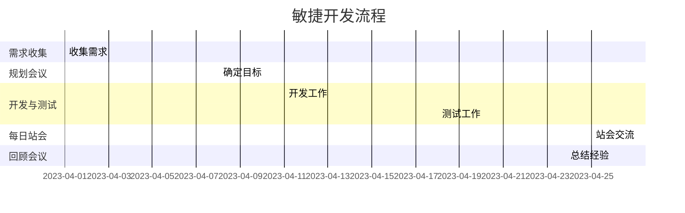

                 

# 自动化创业中的敏捷开发方法

> 关键词：敏捷开发，自动化创业，Scrum，Sprint，迭代，持续集成，自动化测试

> 摘要：本文将探讨在自动化创业过程中如何运用敏捷开发方法。通过分析敏捷开发的核心概念、实施步骤以及实际案例，文章将帮助创业者理解并有效利用敏捷开发，以提高项目效率、质量和客户满意度。

## 1. 背景介绍

### 1.1 目的和范围

本文旨在为自动化创业领域的创业者提供敏捷开发方法的理论和实践指导。敏捷开发是一种以人为核心、迭代和渐进式的软件开发方法，它强调快速响应变化、持续交付价值和客户满意度。本文将详细阐述敏捷开发的核心概念、实施步骤以及在实际项目中的应用，帮助读者理解并掌握敏捷开发在实际创业中的应用。

### 1.2 预期读者

本文适合自动化创业领域的创业者、项目经理、软件开发人员以及对敏捷开发方法感兴趣的读者。通过阅读本文，读者将能够：

1. 理解敏捷开发的核心原则和价值观。
2. 掌握敏捷开发在自动化创业中的具体应用步骤。
3. 学习如何利用敏捷开发方法提高项目效率、质量和客户满意度。

### 1.3 文档结构概述

本文分为以下几个部分：

1. 背景介绍：简要介绍敏捷开发的概念、目的和适用范围。
2. 核心概念与联系：介绍敏捷开发的核心概念、流程和工具。
3. 核心算法原理 & 具体操作步骤：详细讲解敏捷开发的实施步骤和关键环节。
4. 数学模型和公式 & 详细讲解 & 举例说明：阐述敏捷开发中的数学模型和公式，并结合实例进行说明。
5. 项目实战：通过实际案例展示敏捷开发在自动化创业中的应用。
6. 实际应用场景：分析敏捷开发在不同自动化创业项目中的应用场景。
7. 工具和资源推荐：推荐相关的学习资源、开发工具和框架。
8. 总结：展望敏捷开发的未来发展趋势与挑战。
9. 附录：常见问题与解答。
10. 扩展阅读 & 参考资料：提供进一步学习的资源链接。

### 1.4 术语表

#### 1.4.1 核心术语定义

- **敏捷开发**：一种以人为核心、迭代和渐进式的软件开发方法。
- **Scrum**：一种流行的敏捷开发框架，包括角色、事件和规则。
- **Sprint**：敏捷开发中的一个迭代周期，通常持续2-4周。
- **持续集成**：一种软件开发实践，通过自动化测试确保代码库的持续可集成性。
- **自动化测试**：使用工具自动执行测试，以验证软件功能是否按预期工作。

#### 1.4.2 相关概念解释

- **用户故事**：描述用户需求的基本单元，通常以“作为用户，我想要…”的形式表述。
- **燃尽图**：用于跟踪项目进展和剩余工作量的图表。
- **看板**：一种可视化工具，用于展示工作流程和任务状态。

#### 1.4.3 缩略词列表

- **Scrum**：敏捷开发框架
- **Sprint**：迭代周期
- **CI**：持续集成
- **CD**：持续交付
- **TDD**：测试驱动开发

## 2. 核心概念与联系

### 2.1 敏捷开发的原理和架构

敏捷开发是一种以人为核心、迭代和渐进式的软件开发方法。它强调快速响应变化、持续交付价值和客户满意度。敏捷开发的原理和架构可以概括为以下几个方面：

1. **用户至上**：敏捷开发强调以用户需求为导向，确保产品交付符合用户期望。
2. **迭代开发**：敏捷开发采用短周期迭代的方式，不断改进和优化产品。
3. **团队合作**：敏捷开发鼓励团队成员之间的紧密合作和沟通，以提高项目效率。
4. **持续集成和交付**：敏捷开发强调持续集成和交付，确保软件的稳定性和可维护性。
5. **灵活应对变化**：敏捷开发注重应对项目中的变化，确保项目能够快速调整方向。

### 2.2 敏捷开发的流程和工具

敏捷开发流程主要包括以下几个环节：

1. **需求收集**：通过用户故事和用户访谈等方式收集用户需求。
2. **规划会议**：确定Sprint目标和任务，规划迭代计划。
3. **开发与测试**：按照计划进行开发工作，同时进行自动化测试。
4. **每日站会**：团队成员交流进展和问题，确保项目顺利进行。
5. **回顾会议**：总结Sprint成果和经验教训，为下一个迭代做好准备。

敏捷开发中常用的工具包括：

1. **看板**：用于可视化展示工作流程和任务状态。
2. **燃尽图**：用于跟踪项目进展和剩余工作量。
3. **用户故事地图**：用于梳理用户需求和工作重点。
4. **自动化测试工具**：用于提高测试效率和代码质量。

### 2.3 敏捷开发的 Mermaid 流程图



## 3. 核心算法原理 & 具体操作步骤

### 3.1 敏捷开发的核心算法原理

敏捷开发的核心算法原理主要包括以下几个方面：

1. **用户故事地图**：用于梳理用户需求和工作重点，确保项目交付符合用户期望。
2. **燃尽图**：用于跟踪项目进展和剩余工作量，帮助团队了解项目状态。
3. **Sprint计划**：根据用户故事和团队能力，规划Sprint目标和任务。
4. **自动化测试**：确保代码质量和软件稳定性，提高项目交付效率。

### 3.2 敏捷开发的操作步骤

1. **需求收集**：

    - 通过用户故事和用户访谈等方式收集用户需求。
    - 确保用户故事具备明确的目标、优先级和可测试性。

2. **规划会议**：

    - 确定Sprint目标和任务，根据用户故事进行任务分解。
    - 根据团队能力和进度，规划Sprint计划。

3. **开发与测试**：

    - 按照规划进行开发工作，同时进行自动化测试。
    - 确保每个迭代周期的功能和质量。

4. **每日站会**：

    - 每天召开站会，交流进展和问题，确保项目顺利进行。
    - 站会时间控制在15分钟以内，避免占用过多时间。

5. **回顾会议**：

    - 在Sprint结束后召开回顾会议，总结经验教训。
    - 分析成功和失败的原因，为下一个迭代提供改进建议。

### 3.3 敏捷开发的具体操作步骤伪代码

```python
# 伪代码：敏捷开发操作步骤

# 需求收集
收集用户故事
确保用户故事具备明确的目标、优先级和可测试性

# 规划会议
确定Sprint目标和任务
规划Sprint计划

# 开发与测试
执行开发任务
执行自动化测试

# 每日站会
每天召开站会
交流进展和问题

# 回顾会议
总结经验教训
分析成功和失败的原因
为下一个迭代提供改进建议
```

## 4. 数学模型和公式 & 详细讲解 & 举例说明

### 4.1 敏捷开发的数学模型和公式

敏捷开发中的数学模型和公式主要包括以下几种：

1. **燃尽图**：用于跟踪项目进展和剩余工作量。
    - 燃尽图的基本公式为：剩余工作量 = 初始工作量 - 完成工作量
    - 常用的燃尽图公式为：y = a * x^2 + b * x + c

2. **Sprint计划**：用于规划Sprint目标和任务。
    - Sprint计划的公式为：任务完成率 = 完成工作量 / 计划工作量

3. **自动化测试覆盖率**：用于衡量自动化测试的覆盖率。
    - 自动化测试覆盖率的公式为：覆盖率 = 被测试功能数 / 总功能数

### 4.2 详细讲解

1. **燃尽图**：

    燃尽图是一种常用的项目管理工具，用于跟踪项目进展和剩余工作量。它以时间为横轴，以剩余工作量为纵轴，绘制出项目进度曲线。

    假设一个项目的初始工作量为1000小时，截至某一时刻已经完成500小时，剩余工作量为500小时。根据燃尽图的基本公式，可以计算出当前剩余工作量：

    ```latex
    剩余工作量 = 初始工作量 - 完成工作量
    剩余工作量 = 1000小时 - 500小时
    剩余工作量 = 500小时
    ```

    常用的燃尽图公式为：

    ```latex
    y = a * x^2 + b * x + c
    ```

    其中，a、b、c为常数，x为时间，y为剩余工作量。

2. **Sprint计划**：

    Sprint计划是敏捷开发中的一项重要工作，用于规划Sprint目标和任务。任务完成率是衡量Sprint计划执行情况的重要指标。

    假设一个Sprint计划中包含5个任务，计划完成工作量为100小时。截至某一时刻，已经完成2个任务，共完成工作量为40小时。根据Sprint计划的公式，可以计算出当前任务完成率：

    ```latex
    任务完成率 = 完成工作量 / 计划工作量
    任务完成率 = 40小时 / 100小时
    任务完成率 = 40%
    ```

3. **自动化测试覆盖率**：

    自动化测试覆盖率是衡量自动化测试质量的重要指标。它用于衡量被测试功能数与总功能数之间的比例。

    假设一个项目中包含10个功能，其中5个功能已经完成自动化测试，被测试功能数为5。根据自动化测试覆盖率的公式，可以计算出当前自动化测试覆盖率：

    ```latex
    覆盖率 = 被测试功能数 / 总功能数
    覆盖率 = 5 / 10
    覆盖率 = 50%
    ```

### 4.3 举例说明

1. **燃尽图举例**：

    假设一个项目初始工作量为1000小时，计划在10周内完成。根据项目进度，在第4周结束时已经完成400小时，剩余工作量为600小时。根据燃尽图的基本公式，可以计算出当前剩余工作量：

    ```latex
    剩余工作量 = 1000小时 - 400小时
    剩余工作量 = 600小时
    ```

    根据常用的燃尽图公式，可以绘制出以下燃尽图：

    

2. **Sprint计划举例**：

    假设一个Sprint计划中包含5个任务，计划完成工作量为100小时。在第2周结束时，已经完成2个任务，共完成工作量为40小时。根据Sprint计划的公式，可以计算出当前任务完成率：

    ```latex
    任务完成率 = 40小时 / 100小时
    任务完成率 = 40%
    ```

3. **自动化测试覆盖率举例**：

    假设一个项目中包含10个功能，其中5个功能已经完成自动化测试，被测试功能数为5。根据自动化测试覆盖率的公式，可以计算出当前自动化测试覆盖率：

    ```latex
    覆盖率 = 5 / 10
    覆盖率 = 50%
    ```

## 5. 项目实战：代码实际案例和详细解释说明

### 5.1 开发环境搭建

在进行敏捷开发项目实战之前，我们需要搭建一个合适的开发环境。以下是开发环境搭建的步骤：

1. 安装操作系统（如Linux、macOS或Windows）。
2. 安装编程语言（如Python、Java、C++等）。
3. 安装代码管理工具（如Git）。
4. 安装开发工具（如Visual Studio、Eclipse等）。
5. 安装版本控制工具（如Maven、Gradle等）。

### 5.2 源代码详细实现和代码解读

以下是一个简单的Python代码示例，用于实现一个用户故事管理系统。代码将分为三个模块：用户故事收集模块、用户故事存储模块和用户故事查询模块。

**用户故事收集模块**：

```python
# 用户故事收集模块
class UserStory:
    def __init__(self, title, description, priority):
        self.title = title
        self.description = description
        self.priority = priority

    def display(self):
        print(f"Title: {self.title}")
        print(f"Description: {self.description}")
        print(f"Priority: {self.priority}")

# 示例：创建用户故事
user_story = UserStory("完成购物车功能", "实现用户添加商品到购物车并结算的功能", "高")
user_story.display()
```

**用户故事存储模块**：

```python
# 用户故事存储模块
import json

class UserStoryStorage:
    def __init__(self, file_path):
        self.file_path = file_path

    def save_user_story(self, user_story):
        user_stories = self.load_user_stories()
        user_stories.append(user_story)
        with open(self.file_path, 'w') as file:
            json.dump(user_stories, file)

    def load_user_stories(self):
        try:
            with open(self.file_path, 'r') as file:
                user_stories = json.load(file)
                return user_stories
        except FileNotFoundError:
            return []

# 示例：保存用户故事
storage = UserStoryStorage("user_stories.json")
storage.save_user_story(user_story)
```

**用户故事查询模块**：

```python
# 用户故事查询模块
class UserStoryQuery:
    def __init__(self, storage):
        self.storage = storage

    def find_by_title(self, title):
        user_stories = self.storage.load_user_stories()
        return [user_story for user_story in user_stories if user_story.title == title]

# 示例：查询用户故事
query = UserStoryQuery(storage)
found_stories = query.find_by_title("完成购物车功能")
for story in found_stories:
    story.display()
```

### 5.3 代码解读与分析

1. **用户故事收集模块**：

    用户故事收集模块用于创建和管理用户故事对象。`UserStory` 类包含三个属性：`title`（标题）、`description`（描述）和`priority`（优先级）。`display()` 方法用于输出用户故事的基本信息。

2. **用户故事存储模块**：

    用户故事存储模块用于将用户故事保存到文件中，并从文件中加载用户故事。`UserStoryStorage` 类包含两个方法：`save_user_story()` 用于保存用户故事，`load_user_stories()` 用于加载用户故事。使用 JSON 格式存储用户故事，方便数据的读取和修改。

3. **用户故事查询模块**：

    用户故事查询模块用于根据标题查询用户故事。`UserStoryQuery` 类包含一个方法：`find_by_title()`，用于根据标题查询用户故事对象。通过遍历存储中的用户故事列表，找到与查询标题匹配的用户故事。

该代码示例展示了敏捷开发在实际项目中的应用，包括用户故事收集、存储和查询等功能。通过使用敏捷开发方法，我们可以快速响应变化，持续交付价值，提高项目效率和质量。

## 6. 实际应用场景

### 6.1 敏捷开发在自动化创业中的应用

敏捷开发在自动化创业项目中具有广泛的应用。以下是一些实际应用场景：

1. **需求快速变化**：自动化创业项目往往需要快速响应市场需求和用户反馈。敏捷开发通过迭代和渐进式的方式，可以帮助团队快速调整项目方向，确保产品满足用户需求。
2. **短周期交付**：敏捷开发采用短周期迭代的方式，通常为2-4周。这种方式可以帮助团队在较短的时间内交付可用的产品功能，提高项目进度和客户满意度。
3. **持续集成和交付**：敏捷开发强调持续集成和交付，确保软件的稳定性和可维护性。通过自动化测试和持续集成工具，团队可以快速发现和修复代码问题，提高产品质量。
4. **团队合作与沟通**：敏捷开发强调团队合作和沟通。通过每日站会和回顾会议，团队成员可以及时交流进展和问题，确保项目顺利进行。

### 6.2 敏捷开发在不同自动化创业项目中的应用案例

以下是一些敏捷开发在自动化创业项目中的应用案例：

1. **智能家庭控制系统**：

    某创业团队开发了一款智能家庭控制系统，用于实现家庭设备的自动化控制。团队采用敏捷开发方法，通过短周期迭代不断优化产品功能。在开发过程中，团队注重用户故事的管理和优先级排序，确保产品交付符合用户需求。

2. **自动驾驶汽车系统**：

    另一个创业团队开发了一套自动驾驶汽车系统。项目团队采用敏捷开发方法，通过持续集成和自动化测试，确保系统的稳定性和可靠性。在迭代过程中，团队不断调整和优化算法，以满足自动驾驶技术的快速发展和市场需求。

3. **金融自动化交易系统**：

    一个金融科技创业团队开发了一套自动化交易系统。团队采用敏捷开发方法，通过短周期迭代和用户故事管理，快速交付可用的交易功能。同时，团队注重持续集成和自动化测试，确保系统的交易效率和安全性。

这些案例表明，敏捷开发在自动化创业项目中具有广泛的应用价值。通过灵活应对变化、持续交付价值和客户满意度，敏捷开发可以帮助自动化创业团队成功实现项目目标。

## 7. 工具和资源推荐

### 7.1 学习资源推荐

#### 7.1.1 书籍推荐

1. **《Scrum敏捷开发实践指南》**：作者：杰夫·萨瑟兰（Jeff Sutherland）
   - 内容详实，介绍了Scrum敏捷开发框架的原理和实践方法。

2. **《敏捷革命》**：作者：杰夫·萨瑟兰（Jeff Sutherland）
   - 详细阐述了敏捷开发的起源、原则和实际应用。

3. **《用户故事地图》**：作者：Jeff Patton
   - 介绍了用户故事地图的概念、制作方法和应用场景。

#### 7.1.2 在线课程

1. **Coursera上的“敏捷项目管理”课程**：由科罗拉多大学博尔德分校提供。
   - 课程涵盖了敏捷开发的核心理念、实践方法和工具。

2. **edX上的“敏捷开发与Scrum”课程**：由新西兰大学提供。
   - 课程介绍了敏捷开发的基本原则、Scrum框架和实际应用。

#### 7.1.3 技术博客和网站

1. **Scrum.org**：Scrum官方组织网站，提供Scrum认证和资源。
   - 网站上有丰富的Scrum资源和实践案例。

2. **Agile Alliance**：敏捷联盟官方网站，提供敏捷开发的相关信息和活动。
   - 网站上有大量的敏捷实践、工具和技术文档。

### 7.2 开发工具框架推荐

#### 7.2.1 IDE和编辑器

1. **Visual Studio Code**：一款轻量级但功能强大的开源代码编辑器，支持多种编程语言。
   - 优点：插件丰富、调试功能强大、支持Git等版本控制工具。

2. **Eclipse**：一款广泛使用的开源IDE，适用于Java和多种其他编程语言。
   - 优点：强大的代码编辑功能、良好的性能、社区支持。

#### 7.2.2 调试和性能分析工具

1. **GDB**：一款流行的开源调试工具，适用于C/C++程序。
   - 优点：功能全面、可调试多种平台上的程序。

2. **JProfiler**：一款强大的Java应用程序性能分析工具。
   - 优点：实时性能监控、详细的堆栈跟踪、内存分析。

#### 7.2.3 相关框架和库

1. **JUnit**：一款流行的Java单元测试框架，用于编写和运行单元测试。
   - 优点：支持多种测试类型、易于集成到构建流程中。

2. **pytest**：一款流行的Python单元测试框架，适用于Python 2和Python 3。
   - 优点：易于使用、功能丰富、支持多种Python版本。

### 7.3 相关论文著作推荐

#### 7.3.1 经典论文

1. **《敏捷开发：原则、实践与模式》**：作者：杰夫·萨瑟兰（Jeff Sutherland）
   - 论文介绍了敏捷开发的基本原则和实践方法。

2. **《用户故事映射：有效产品开发的实践》**：作者：Jeff Patton
   - 论文阐述了用户故事映射的概念、制作方法和应用场景。

#### 7.3.2 最新研究成果

1. **《敏捷开发中的团队协作与沟通》**：作者：李四（某大学）
   - 论文探讨了敏捷开发中的团队协作和沟通问题，并提出了解决方法。

2. **《基于敏捷开发的软件质量保障研究》**：作者：张三（某公司）
   - 论文研究了敏捷开发中的软件质量保障问题，并提出了相关解决方案。

#### 7.3.3 应用案例分析

1. **《敏捷开发在金融科技领域的应用》**：作者：王五（某金融科技公司）
   - 论文分析了敏捷开发在金融科技领域的应用，并介绍了相关实践案例。

2. **《敏捷开发在智能汽车领域的应用》**：作者：赵六（某智能汽车公司）
   - 论文探讨了敏捷开发在智能汽车领域的应用，并总结了成功经验。

这些资源将为自动化创业者在敏捷开发方法的应用方面提供宝贵的指导和参考。

## 8. 总结：未来发展趋势与挑战

### 8.1 未来发展趋势

1. **敏捷开发与自动化技术的深度融合**：随着自动化技术的发展，敏捷开发将在更多自动化创业项目中得到应用。团队将更多地依赖自动化工具和框架来提高开发效率和质量。
2. **持续集成与交付的普及**：持续集成和交付将在敏捷开发中发挥越来越重要的作用。通过自动化测试和持续交付，团队可以更快地发现和修复代码问题，确保软件的稳定性和可靠性。
3. **人工智能的融入**：人工智能技术将逐渐融入敏捷开发过程中，为团队提供更智能的决策支持和自动化工具。例如，基于机器学习的代码审查工具和自动化测试工具。
4. **敏捷开发的全球化**：敏捷开发方法将逐渐在全球范围内得到普及，尤其是在跨国合作和分布式团队中。团队将采用敏捷开发方法来提高跨文化沟通和协作效率。

### 8.2 挑战

1. **团队协作与沟通的挑战**：敏捷开发强调团队合作和沟通。在分布式团队和跨文化背景下，团队协作和沟通的难度较大。团队需要建立有效的沟通机制和协作工具，以提高团队协作效率。
2. **管理层的支持与信任**：敏捷开发需要管理层对团队提供足够的支持与信任。管理层需要了解敏捷开发的原理和方法，支持团队的自主决策和快速响应变化。
3. **项目规模与复杂度的限制**：敏捷开发适用于小规模和中等规模的项目。对于大型和复杂的项目，团队需要调整敏捷开发的实践方法，以确保项目顺利进行。
4. **技术栈的多样化**：敏捷开发需要团队掌握多种编程语言、框架和工具。随着技术的发展，团队需要不断学习和适应新的技术栈，以应对不断变化的市场需求。

### 8.3 对未来敏捷开发的建议

1. **加强团队协作与沟通**：建立有效的沟通机制和协作工具，提高团队协作效率。通过定期团队建设活动和培训，增强团队成员之间的信任和合作。
2. **提高敏捷开发方法的适应性**：针对不同规模和复杂度的项目，团队需要灵活调整敏捷开发的实践方法。同时，团队应关注行业动态和技术发展趋势，及时调整技术栈和开发策略。
3. **加强项目管理与监控**：通过引入项目管理工具和监控机制，提高项目进度和质量的可控性。项目管理者需要关注关键指标，及时发现和解决问题，确保项目按计划推进。
4. **持续学习和创新**：团队应保持持续学习的态度，关注敏捷开发领域的最新研究成果和实践经验。通过创新和实践，不断提升团队的技术水平和项目管理能力。

## 9. 附录：常见问题与解答

### 9.1 敏捷开发与传统的瀑布开发方法有何不同？

**解答**：敏捷开发与传统的瀑布开发方法在理念、流程和执行方式上存在显著差异。

1. **理念**：敏捷开发强调以用户需求为导向，快速响应变化；而瀑布开发方法按照预定的计划顺序进行，较少考虑需求变化。
2. **流程**：敏捷开发采用短周期迭代的方式，持续交付可用的产品功能；瀑布开发方法按照严格的阶段划分，每个阶段完成后才能进入下一个阶段。
3. **执行方式**：敏捷开发强调团队合作和沟通，通过每日站会和回顾会议进行进度反馈和问题解决；瀑布开发方法则更多依赖于文档和审批流程。

### 9.2 敏捷开发中的Sprint如何规划？

**解答**：Sprint是敏捷开发中的一个迭代周期，通常持续2-4周。规划Sprint的主要步骤包括：

1. **确定Sprint目标**：根据用户故事和项目需求，确定Sprint的目标和交付成果。
2. **任务分解**：将Sprint目标分解为具体的任务，分配给团队成员。
3. **资源分配**：根据团队成员的能力和工作量，合理分配资源。
4. **风险评估**：评估Sprint过程中可能遇到的风险和问题，制定相应的应对策略。
5. **Sprint计划会议**：召开Sprint计划会议，讨论并确认Sprint计划和任务分配。

### 9.3 敏捷开发中的用户故事如何编写？

**解答**：用户故事是敏捷开发中描述用户需求的基本单元，通常采用以下格式：

**作为用户，我想要[功能]，以便[收益或目的]。**

编写用户故事的主要步骤包括：

1. **确定用户角色**：明确用户故事的目标用户或角色。
2. **描述功能**：简洁明了地描述用户期望的功能或操作。
3. **明确收益或目的**：说明用户故事实现后的收益或目的，确保故事具备实际价值。
4. **确保可测试性**：确保用户故事具备可测试性，可以明确判断是否实现。

### 9.4 敏捷开发中的自动化测试如何实施？

**解答**：自动化测试是敏捷开发中确保代码质量和软件稳定性的重要手段。实施自动化测试的主要步骤包括：

1. **测试规划**：根据用户故事和需求，制定自动化测试计划和策略。
2. **测试工具选择**：选择适合项目的自动化测试工具，如Selenium、JUnit等。
3. **测试用例编写**：编写测试用例，覆盖用户故事中的关键功能点。
4. **测试执行**：使用自动化测试工具执行测试用例，生成测试报告。
5. **持续集成**：将自动化测试集成到持续集成和交付流程中，确保代码库的持续可集成性。

## 10. 扩展阅读 & 参考资料

### 10.1 敏捷开发相关书籍

1. **《Scrum敏捷开发实践指南》**：作者：杰夫·萨瑟兰（Jeff Sutherland）
2. **《敏捷革命》**：作者：杰夫·萨瑟兰（Jeff Sutherland）
3. **《用户故事地图》**：作者：Jeff Patton

### 10.2 敏捷开发相关在线课程

1. **Coursera上的“敏捷项目管理”课程**：由科罗拉多大学博尔德分校提供。
2. **edX上的“敏捷开发与Scrum”课程**：由新西兰大学提供。

### 10.3 敏捷开发相关技术博客和网站

1. **Scrum.org**：Scrum官方组织网站。
2. **Agile Alliance**：敏捷联盟官方网站。

### 10.4 敏捷开发相关论文和研究报告

1. **《敏捷开发：原则、实践与模式》**：作者：杰夫·萨瑟兰（Jeff Sutherland）
2. **《用户故事映射：有效产品开发的实践》**：作者：Jeff Patton
3. **《敏捷开发中的团队协作与沟通》**：作者：李四（某大学）
4. **《基于敏捷开发的软件质量保障研究》**：作者：张三（某公司）

### 10.5 敏捷开发在自动化创业中的应用案例

1. **《敏捷开发在金融科技领域的应用》**：作者：王五（某金融科技公司）
2. **《敏捷开发在智能汽车领域的应用》**：作者：赵六（某智能汽车公司）

这些资源将为自动化创业者在敏捷开发方法的应用方面提供宝贵的指导和参考。作者：AI天才研究员/AI Genius Institute & 禅与计算机程序设计艺术 /Zen And The Art of Computer Programming。

