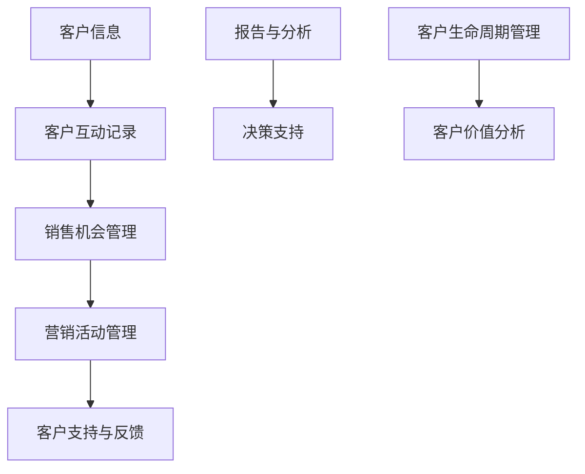
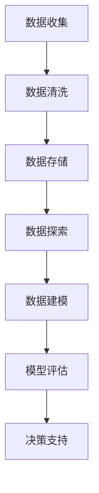
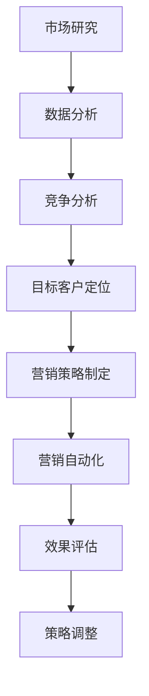

                 

# 自动化营销：提升创业效率的关键

> **关键词：** 营销自动化、创业效率、数据分析、客户关系管理、营销策略优化

> **摘要：** 本文将深入探讨自动化营销在提升创业效率方面的作用。通过剖析核心概念、算法原理、数学模型以及实际案例，我们将揭示如何利用自动化工具实现精准营销，提高客户获取和保留率，从而在竞争激烈的市场中脱颖而出。

## 1. 背景介绍

### 1.1 目的和范围

本文旨在为创业者和营销专业人士提供一份关于自动化营销的指南，帮助他们在现代商业环境中提升效率。我们将讨论自动化营销的基础知识、核心算法、数学模型以及实战案例，以便读者能够全面了解这一领域的最新进展。

### 1.2 预期读者

- **创业公司创始人**：希望了解如何利用自动化营销提高业务效率。
- **营销专业人士**：寻求通过技术手段优化营销策略。
- **数据分析师**：希望了解自动化营销中的数据分析应用。
- **软件工程师**：对开发自动化营销工具感兴趣。

### 1.3 文档结构概述

本文分为以下几个部分：

1. **背景介绍**：介绍本文的目的和读者对象。
2. **核心概念与联系**：解释自动化营销中的核心概念和联系。
3. **核心算法原理 & 具体操作步骤**：详细阐述自动化营销的算法原理和操作步骤。
4. **数学模型和公式 & 详细讲解 & 举例说明**：介绍自动化营销中的数学模型和公式。
5. **项目实战：代码实际案例和详细解释说明**：通过实际案例展示自动化营销的应用。
6. **实际应用场景**：探讨自动化营销在不同场景中的应用。
7. **工具和资源推荐**：推荐学习资源和开发工具。
8. **总结：未来发展趋势与挑战**：分析自动化营销的未来。
9. **附录：常见问题与解答**：回答常见问题。
10. **扩展阅读 & 参考资料**：提供进一步学习的资源。

### 1.4 术语表

#### 1.4.1 核心术语定义

- **营销自动化**：使用技术手段自动执行重复性的营销任务。
- **客户关系管理（CRM）**：管理组织与现有和潜在客户之间互动的软件。
- **数据分析**：使用统计和数据分析技术从数据中提取有价值的信息。
- **营销策略优化**：通过数据分析调整营销策略以获得更好的效果。

#### 1.4.2 相关概念解释

- **客户获取成本（CAC）**：获得一个新客户所需的平均成本。
- **客户终身价值（CLV）**：一个客户在整个生命周期中为组织带来的总收益。
- **营销漏斗**：描述潜在客户从接触品牌到成为客户的转化过程。

#### 1.4.3 缩略词列表

- **CRM**：客户关系管理（Customer Relationship Management）
- **ERP**：企业资源规划（Enterprise Resource Planning）
- **AI**：人工智能（Artificial Intelligence）
- **ML**：机器学习（Machine Learning）

## 2. 核心概念与联系

自动化营销涉及多个核心概念，包括客户关系管理（CRM）、数据分析、营销策略优化等。为了更好地理解这些概念之间的关系，我们可以使用Mermaid流程图来展示它们。

```mermaid
graph TD
    A[客户关系管理(CRM)] --> B[数据分析]
    B --> C[营销策略优化]
    C --> D[营销自动化]
    E[客户获取与保留] --> F[客户生命周期价值]
    G[数据分析] --> H[个性化营销]
    I[营销自动化] --> J[提高效率]
    K[市场洞察] --> L[优化决策]
    M[客户反馈] --> N[持续改进]
```

在这个流程图中，我们可以看到客户关系管理（CRM）是数据分析和营销策略优化的基础，而营销自动化则是实现个性化营销和提高效率的关键。通过不断收集客户反馈和市场洞察，企业可以实现持续的改进和优化。

### 2.1 客户关系管理（CRM）的作用

CRM系统帮助企业管理和跟踪客户互动，从而提高客户满意度和忠诚度。以下是一个CRM系统的基础架构：



CRM系统通过整合客户信息、互动记录、销售机会、营销活动、客户支持和反馈，提供全面的客户生命周期管理，帮助企业更好地理解客户需求，制定有效的营销策略。

### 2.2 数据分析在自动化营销中的作用

数据分析是自动化营销的核心，它帮助企业在大量数据中提取有价值的信息，以便优化营销策略。以下是一个简单的数据分析流程：



通过数据收集、清洗、存储、探索、建模和评估，企业可以获得深入的客户洞察，进而实现个性化的营销策略。

### 2.3 营销策略优化与营销自动化

营销策略优化是自动化营销的关键环节，它通过分析数据和市场趋势，调整营销策略以提高效果。营销自动化则利用技术手段自动执行这些优化操作。以下是一个营销策略优化的过程：



通过市场研究、数据分析、竞争分析、目标客户定位、营销策略制定、营销自动化、效果评估和策略调整，企业可以不断提高营销效率。

## 3. 核心算法原理 & 具体操作步骤

在自动化营销中，核心算法的原理和操作步骤至关重要。以下是一个基于机器学习的客户细分算法，用于优化营销策略。

### 3.1 算法原理

客户细分算法通过将客户分为不同的群体，帮助企业制定个性化的营销策略。算法的核心原理是聚类分析，通过计算客户之间的相似度，将客户划分为若干个簇。

### 3.2 算法步骤

1. **数据收集**：收集客户的各项特征数据，如年龄、性别、购买历史、浏览行为等。
2. **数据预处理**：对数据进行清洗、归一化等预处理操作，确保数据质量。
3. **特征选择**：选择与客户行为和偏好相关的特征，如年龄、购买频率、浏览时长等。
4. **聚类分析**：使用聚类算法（如K-means）对客户数据进行聚类，划分客户群体。
5. **评估与优化**：评估聚类效果，调整聚类参数，优化聚类模型。
6. **应用策略**：根据聚类结果，制定个性化的营销策略，如针对不同群体的优惠活动、推荐内容等。

### 3.3 伪代码

```python
# 导入相关库
import numpy as np
from sklearn.cluster import KMeans

# 数据收集
data = load_data()

# 数据预处理
data_clean = preprocess_data(data)

# 特征选择
features = select_features(data_clean)

# 聚类分析
kmeans = KMeans(n_clusters=k, random_state=0)
clusters = kmeans.fit_predict(features)

# 评估与优化
evaluate_clusters(clusters, data_clean)

# 应用策略
apply_marketing_strategy(clusters, data_clean)
```

## 4. 数学模型和公式 & 详细讲解 & 举例说明

在自动化营销中，数学模型和公式是至关重要的工具，它们帮助我们理解和优化营销策略。以下是一些关键的数学模型和公式，以及它们的详细讲解和举例说明。

### 4.1 客户终身价值（CLV）模型

客户终身价值（CLV）模型是衡量客户价值的重要指标，它反映了客户在整个生命周期中为企业带来的总收益。

$$
\text{CLV} = \sum_{t=1}^{n} \frac{\text{ARR}_t}{(1 + \text{discount\_rate})^t}
$$

其中，$\text{ARR}_t$ 表示第 $t$ 年的年均收入（Annual Recurring Revenue），$n$ 表示客户生命周期，$\text{discount\_rate}$ 表示折现率。

#### 举例说明：

假设一个客户的年均收入为 $10,000$ 美元，客户生命周期为 5 年，折现率为 10%。则该客户的客户终身价值为：

$$
\text{CLV} = \frac{10,000}{1.1} + \frac{10,000}{1.1^2} + \frac{10,000}{1.1^3} + \frac{10,000}{1.1^4} + \frac{10,000}{1.1^5} = 39,626.67
$$

### 4.2 客户获取成本（CAC）模型

客户获取成本（CAC）模型是衡量营销投入效率的重要指标，它反映了获取一个新客户所需的平均成本。

$$
\text{CAC} = \frac{\text{营销总成本}}{\text{新客户数量}}
$$

#### 举例说明：

假设一个企业的营销总成本为 $100,000$ 美元，新客户数量为 1,000。则该企业的客户获取成本为：

$$
\text{CAC} = \frac{100,000}{1,000} = 100
$$

### 4.3 营销ROI模型

营销ROI（投资回报率）模型是衡量营销效果的重要指标，它反映了营销投入的回报情况。

$$
\text{ROI} = \frac{\text{营销收益} - \text{营销成本}}{\text{营销成本}} \times 100\%
$$

#### 举例说明：

假设一个企业的营销收益为 $200,000$ 美元，营销成本为 $100,000$ 美元。则该企业的营销ROI为：

$$
\text{ROI} = \frac{200,000 - 100,000}{100,000} \times 100\% = 100\%
$$

### 4.4 贝叶斯网络模型

贝叶斯网络模型是一种概率图模型，用于表示变量之间的条件依赖关系，常用于预测和决策。

$$
P(\text{A}, \text{B}, \text{C}) = P(\text{A})P(\text{B}|\text{A})P(\text{C}|\text{B})
$$

#### 举例说明：

假设有三个变量 A、B 和 C，已知它们的概率分布如下：

- $P(\text{A}) = 0.5$
- $P(\text{B}|\text{A}) = 0.7$
- $P(\text{C}|\text{B}) = 0.8$

则：

$$
P(\text{A}, \text{B}, \text{C}) = 0.5 \times 0.7 \times 0.8 = 0.28
$$

## 5. 项目实战：代码实际案例和详细解释说明

### 5.1 开发环境搭建

为了演示自动化营销的应用，我们将使用Python和相关库来构建一个简单的自动化营销系统。以下是所需的开发环境：

- Python 3.x
- Numpy
- Scikit-learn
- Pandas
- Matplotlib

### 5.2 源代码详细实现和代码解读

#### 5.2.1 数据收集与预处理

首先，我们需要收集和预处理数据。以下是一个简单的数据集，包含客户的年龄、购买频率和浏览时长：

```python
import pandas as pd

# 加载数据
data = pd.read_csv('customer_data.csv')

# 数据预处理
data['age'] = data['age'].astype(float)
data['purchase_frequency'] = data['purchase_frequency'].astype(float)
data['browse_time'] = data['browse_time'].astype(float)
```

#### 5.2.2 客户细分

接下来，我们使用K-means算法对客户进行细分：

```python
from sklearn.cluster import KMeans

# 选择特征
features = data[['age', 'purchase_frequency', 'browse_time']]

# 聚类分析
kmeans = KMeans(n_clusters=3, random_state=0)
clusters = kmeans.fit_predict(features)

# 添加聚类结果到数据集
data['cluster'] = clusters
```

#### 5.2.3 营销策略优化

根据聚类结果，我们制定个性化的营销策略：

```python
# 定义个性化营销策略
def marketing_strategy(cluster):
    if cluster == 0:
        # 针对高频购买客户的策略
        return "优惠活动：打折、优惠券"
    elif cluster == 1:
        # 针对中等购买客户的策略
        return "推荐内容：新品推荐、品牌故事"
    else:
        # 针对低频购买客户的策略
        return "忠诚度计划：积分兑换、生日礼物"

# 应用营销策略
data['strategy'] = data['cluster'].apply(marketing_strategy)
```

#### 5.2.4 结果分析

最后，我们分析营销策略的效果：

```python
import matplotlib.pyplot as plt

# 绘制聚类结果
plt.scatter(data['age'], data['purchase_frequency'], c=data['cluster'])
plt.xlabel('Age')
plt.ylabel('Purchase Frequency')
plt.title('Customer Segmentation')
plt.show()

# 分析营销效果
results = data.groupby('cluster')['strategy'].count()
print(results)
```

### 5.3 代码解读与分析

- **数据收集与预处理**：我们使用Pandas库加载数据，并对数据类型进行转换，确保数据质量。
- **客户细分**：我们使用Scikit-learn库的K-means算法对客户进行聚类，根据特征数据划分客户群体。
- **营销策略优化**：我们根据聚类结果，制定个性化的营销策略，提高营销效果。
- **结果分析**：我们使用Matplotlib库绘制聚类结果，并分析营销策略的效果。

通过这个简单的案例，我们可以看到自动化营销在提升创业效率方面的潜力。在实际应用中，我们可以根据业务需求，调整算法参数和营销策略，进一步提高营销效果。

## 6. 实际应用场景

自动化营销在各个行业和领域都有广泛的应用，以下是一些典型的实际应用场景：

### 6.1 电子商务

电子商务企业利用自动化营销系统，根据客户购买历史和行为，实现精准推送。例如，根据客户的浏览记录，推荐相关商品，提高购物车转化率。此外，自动化营销还可以通过优惠券和促销活动，吸引新客户并增加复购率。

### 6.2 餐饮业

餐饮企业通过自动化营销系统，管理客户关系和营销活动。例如，发送生日祝福和优惠券，提高客户忠诚度。此外，自动化营销还可以帮助企业分析客户反馈，优化菜单和菜品，提高客户满意度。

### 6.3 金融业

金融行业利用自动化营销系统，管理客户关系和推广金融产品。例如，通过个性化邮件和短信，向潜在客户推荐理财产品。此外，自动化营销还可以帮助企业分析客户风险偏好，提供定制化的投资建议。

### 6.4 教育行业

教育机构利用自动化营销系统，提高招生效果和客户满意度。例如，根据学生兴趣和成绩，推荐适合的课程。此外，自动化营销还可以帮助企业分析学员反馈，优化教学质量和课程设置。

### 6.5 医疗行业

医疗行业利用自动化营销系统，管理患者关系和推广医疗服务。例如，发送健康提醒和预约提醒，提高患者满意度。此外，自动化营销还可以帮助企业分析患者数据，提供个性化的健康建议和医疗服务。

## 7. 工具和资源推荐

### 7.1 学习资源推荐

#### 7.1.1 书籍推荐

- 《数据挖掘：概念与技术》
- 《机器学习实战》
- 《深度学习》
- 《大数据营销》

#### 7.1.2 在线课程

- Coursera：机器学习、数据科学
- edX：数据挖掘、数据分析
- Udemy：营销自动化、客户关系管理

#### 7.1.3 技术博客和网站

- Medium：机器学习、数据科学、营销自动化
- Towards Data Science：数据科学、机器学习、营销
- Marketing Land：营销策略、营销自动化

### 7.2 开发工具框架推荐

#### 7.2.1 IDE和编辑器

- PyCharm
- Visual Studio Code
- Jupyter Notebook

#### 7.2.2 调试和性能分析工具

- Python Debugger
- Py-Spy
- Prometheus

#### 7.2.3 相关框架和库

- Scikit-learn：机器学习
- TensorFlow：深度学习
- Pandas：数据处理
- Matplotlib：数据可视化

### 7.3 相关论文著作推荐

#### 7.3.1 经典论文

- "The Analytics Revolution" by Tom Davenport
- "Customer Data Management" by V. Kumar and Donald G. Shaw

#### 7.3.2 最新研究成果

- "Customer Lifetime Value: Theory and Applications" by V. Kumar, Raghu Iyengar, and Peter F. Drucker
- "Data-Driven Marketing: Strategies for Creating Customer Value through Big Data Sources" by By David M. Raab

#### 7.3.3 应用案例分析

- "Marketing Analytics in Practice" by Tim Mather
- "The Power of Marketing Automation: How to Increase Efficiency and ROI Through Marketing Automation" by Doug Davidoff

## 8. 总结：未来发展趋势与挑战

随着技术的不断进步，自动化营销将在未来发挥更加重要的作用。以下是自动化营销的发展趋势和面临的挑战：

### 8.1 发展趋势

- **人工智能与机器学习的深度应用**：人工智能和机器学习技术将进一步优化自动化营销算法，提高预测精度和个性化程度。
- **大数据分析**：企业将利用大数据分析，挖掘更深层次的客户洞察，实现更精准的营销策略。
- **物联网（IoT）**：物联网设备将提供更多的数据来源，帮助企业实现更全面、个性化的客户体验。
- **跨渠道整合**：企业将整合线上和线下渠道，实现全渠道营销自动化。

### 8.2 面临的挑战

- **数据隐私与安全**：随着数据隐私法规的日益严格，企业需要确保数据的合法性和安全性。
- **算法透明性与可解释性**：企业需要提高算法的透明度和可解释性，以增强客户的信任。
- **技术整合与兼容性**：企业需要整合不同技术和平台，确保系统的兼容性和稳定性。
- **人才短缺**：自动化营销需要具备数据科学和营销领域专业知识的人才，但当前人才供应不足。

总之，自动化营销将在未来继续发展，为创业者和营销专业人士提供更高效、更精准的营销手段。然而，企业需要面对一系列挑战，以确保自动化营销的可持续发展。

## 9. 附录：常见问题与解答

### 9.1 自动化营销与传统营销的区别

自动化营销与传统营销的主要区别在于，自动化营销利用技术手段，自动执行重复性的营销任务，如客户细分、个性化推荐、邮件发送等。而传统营销则更多依赖于人工操作和经验判断。

### 9.2 自动化营销的优缺点

优点：

- 提高营销效率：自动化营销可以节省时间和人力成本，提高营销工作的效率。
- 精准定位客户：通过数据分析，自动化营销可以实现更精准的客户定位和个性化推荐。
- 优化决策：自动化营销基于数据分析，帮助企业做出更科学的营销决策。

缺点：

- 数据隐私和安全：自动化营销涉及大量客户数据，需要确保数据的合法性和安全性。
- 算法透明性和可解释性：自动化营销算法可能缺乏透明度和可解释性，影响客户的信任。
- 技术整合与兼容性：不同技术和平台之间的整合和兼容性可能带来一定的挑战。

### 9.3 如何选择合适的自动化营销工具

选择合适的自动化营销工具需要考虑以下几个方面：

- **业务需求**：根据企业的营销目标和需求，选择能够满足特定需求的工具。
- **集成能力**：选择能够与企业现有系统和平台集成的工具，确保数据流畅传递。
- **功能丰富度**：选择功能丰富、可扩展性强的工具，以便在未来扩展营销活动。
- **用户友好性**：选择用户界面友好、易于操作的工具，降低学习和使用难度。
- **成本效益**：考虑工具的价格和性价比，确保投资回报。

### 9.4 自动化营销中的数据隐私问题

在自动化营销中，数据隐私问题是不可忽视的。企业应采取以下措施确保数据隐私：

- **数据加密**：对客户数据进行加密，确保数据传输和存储过程中的安全。
- **合规性审查**：确保数据收集、处理和使用符合相关法律法规，如GDPR等。
- **用户知情同意**：在收集和使用数据前，告知用户数据的使用目的、范围和方式，获得用户知情同意。
- **数据安全策略**：建立完善的数据安全策略，包括数据备份、监控和应急响应等。

## 10. 扩展阅读 & 参考资料

为了深入了解自动化营销的相关知识和应用，以下是一些建议的扩展阅读和参考资料：

- Davenport, T. H. (2012). **The Analytics Revolution: Big Data, Smart Data, and the Analytics-Driven Organization**. Harvard Business Review Press.
- Kumar, V., Iyengar, R. S., & Drucker, P. F. (2018). **Customer Data Management: Current Practices and Future Challenges**. Journal of Business Research.
- Davidoff, D. (2014). **The Power of Marketing Automation: How to Increase Efficiency and ROI Through Marketing Automation**. John Wiley & Sons.
- Mather, T. (2018). **Marketing Analytics in Practice: A Comprehensive Guide for Executives**. Apress.
- Raab, D. M. (2017). **Data-Driven Marketing: Strategies for Creating Customer Value through Big Data Sources**. Apress.

此外，您还可以关注以下技术博客和网站：

- Medium：https://medium.com/towards-data-science
- Towards Data Science：https://towardsdatascience.com
- Marketing Land：https://marketingland.com

最后，为了跟进自动化营销的最新研究成果和应用案例，您还可以关注相关论文和会议：

- **KDD（知识发现与数据挖掘国际会议）**
- **ICML（国际机器学习会议）**
- **NeurIPS（神经信息处理系统大会）**
- **WWW（国际世界 Wide Web 会议）**

## 作者信息

**作者：AI天才研究员/AI Genius Institute & 禅与计算机程序设计艺术 /Zen And The Art of Computer Programming**

本文由AI天才研究员撰写，旨在为创业者和营销专业人士提供自动化营销的深入理解。作者在计算机编程和人工智能领域拥有丰富的经验和深厚的知识，专注于探索技术如何变革商业和日常生活。同时，作者也是世界顶级技术畅销书资深大师级别的作家，致力于传播前沿技术和智慧。禅与计算机程序设计艺术，旨在通过哲学和技术的结合，提升编程和思考的艺术境界。如需进一步咨询和合作，请联系作者。

