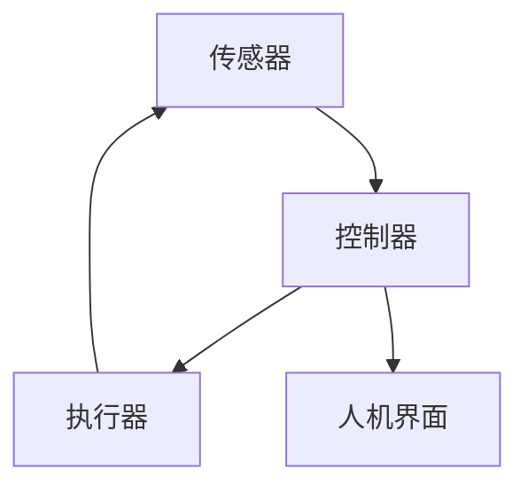
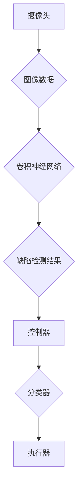

                 


# 自动化领域的最新发展趋势

> 关键词：自动化，人工智能，机器学习，编程，机器人，工业4.0，智能自动化
> 
> 摘要：本文旨在探讨自动化领域最新的发展趋势，包括人工智能和机器学习在自动化中的应用、工业4.0背景下自动化的变革、以及相关编程技术和工具的最新动态。通过分析核心概念、算法原理、实际应用案例，本文为读者提供了一个全面且深入的自动化领域的技术解读。

## 1. 背景介绍

### 1.1 目的和范围

本文将探讨自动化领域内的最新趋势，重点关注人工智能（AI）和机器学习（ML）如何推动自动化技术的进步。我们将覆盖以下几个方面：

- 人工智能在自动化中的应用
- 机器学习算法的自动化应用
- 工业革命4.0背景下自动化的新动向
- 自动化编程技术的发展

### 1.2 预期读者

本文适合以下读者群体：

- 计算机科学和自动化领域的研究人员
- 工业自动化工程师
- 对人工智能和机器学习有浓厚兴趣的技术爱好者
- 需要了解自动化技术最新进展的企业决策者

### 1.3 文档结构概述

本文将按照以下结构进行展开：

- 背景介绍：介绍自动化领域的背景和相关概念
- 核心概念与联系：定义并解释自动化领域的核心概念，展示其架构
- 核心算法原理 & 具体操作步骤：详细阐述核心算法的工作原理和操作步骤
- 数学模型和公式 & 详细讲解 & 举例说明：介绍数学模型和公式，并进行应用举例
- 项目实战：代码实际案例和详细解释说明
- 实际应用场景：探讨自动化技术在现实中的应用
- 工具和资源推荐：推荐学习资源、开发工具和框架
- 总结：总结自动化领域的未来发展趋势与挑战
- 附录：常见问题与解答
- 扩展阅读 & 参考资料：提供进一步的阅读资料和参考文献

### 1.4 术语表

#### 1.4.1 核心术语定义

- **自动化**：通过预定义的规则或算法，使机器或系统在无需人工干预的情况下执行任务。
- **人工智能（AI）**：一种模拟人类智能行为的技术，包括学习、推理、感知和自然语言处理等能力。
- **机器学习（ML）**：一种人工智能技术，通过数据训练模型，使其能够从数据中学习并做出预测或决策。
- **工业4.0**：第四次工业革命，基于物联网、云计算和大数据技术的智能化工厂概念。
- **机器人**：一种能够执行特定任务并具有一定自主性的自动化设备。
- **编程**：编写计算机程序的过程，用于指导计算机执行特定任务。

#### 1.4.2 相关概念解释

- **智能自动化**：结合AI和ML技术的自动化，使其能够在更复杂的环境中适应和优化任务。
- **深度学习**：一种机器学习技术，通过多层神经网络模拟人类大脑的学习过程。
- **强化学习**：一种机器学习技术，通过奖励和惩罚机制使模型在特定环境中学习最优策略。

#### 1.4.3 缩略词列表

- **AI**：人工智能
- **ML**：机器学习
- **IoT**：物联网
- **ROS**：机器人操作系统
- **Python**：一种流行的编程语言

## 2. 核心概念与联系

自动化技术的核心在于如何将人工智能和机器学习应用于实际任务中。为了更好地理解这一点，我们首先需要定义和解释一些核心概念，并展示它们之间的联系。

### 2.1 自动化的核心概念

**1. 传感器**：用于检测和收集环境信息的设备，如温度传感器、摄像头等。

**2. 执行器**：用于执行特定动作的设备，如电机、气动装置等。

**3. 控制器**：负责接收传感器数据，并根据算法生成指令来驱动执行器。

**4. 算法**：用于处理传感器数据并生成控制指令的计算机程序。

**5. 人机界面**：用户与系统交互的接口，用于监控和控制自动化系统。

### 2.2 自动化的架构

以下是一个自动化系统的基本架构，展示了各组件之间的关系：



### 2.3 人工智能和机器学习在自动化中的应用

**1. 机器学习模型训练**：使用历史数据训练机器学习模型，使其能够识别模式并做出预测。

**2. 智能决策**：利用训练好的模型，自动化系统可以自主地做出决策，如路径规划、故障诊断等。

**3. 优化**：通过机器学习算法优化自动化流程，提高效率和质量。

**4. 自适应**：自动化系统可以根据环境变化进行自适应调整，提高其在动态环境下的适应性。

### 2.4 机器学习和自动化的联系

机器学习是自动化系统中的一个重要组成部分，其核心联系如下：

- **数据驱动**：自动化系统依赖于大量数据来训练模型，这些数据通常来自于传感器和其他实时数据源。
- **模型应用**：训练好的模型被集成到自动化系统中，用于执行特定任务，如预测、分类和决策。

### 2.5 案例分析

以下是一个简单的自动化系统案例，展示了人工智能和机器学习在其中的应用：

- **任务**：监测生产线上的缺陷。
- **解决方案**：使用摄像头作为传感器，收集图像数据；使用机器学习模型（如卷积神经网络）分析图像，检测缺陷；将检测结果反馈给控制器，驱动执行器（如分类器）进行相应处理。



通过这个案例，我们可以看到机器学习和自动化技术如何相互结合，共同实现复杂任务的自动化。

## 3. 核心算法原理 & 具体操作步骤

在自动化系统中，算法是实现自动化任务的核心。本节将详细介绍一些核心算法的原理和具体操作步骤。

### 3.1 机器学习算法简介

机器学习算法是自动化系统中的关键组成部分，下面介绍几种常用的机器学习算法：

#### 3.1.1 监督学习

监督学习算法通过已标记的数据训练模型，使其能够对新的数据进行分类或回归。

**算法原理：**

1. 数据准备：收集并标记训练数据。
2. 模型训练：使用训练数据训练模型，调整模型参数。
3. 预测：使用训练好的模型对新的数据进行预测。

**伪代码：**

```python
def supervised_learning(train_data, train_labels, model, learning_rate, num_epochs):
    for epoch in range(num_epochs):
        for data, label in zip(train_data, train_labels):
            prediction = model.predict(data)
            loss = calculate_loss(prediction, label)
            model.update_weights(learning_rate, loss)
    return model
```

#### 3.1.2 无监督学习

无监督学习算法不需要标记的数据，通过发现数据中的隐含结构来训练模型。

**算法原理：**

1. 数据准备：收集未标记的数据。
2. 模型训练：训练模型，使其能够发现数据中的模式。
3. 结果分析：分析模型发现的数据结构，进行应用。

**伪代码：**

```python
def unsupervised_learning(data, model, learning_rate, num_epochs):
    for epoch in range(num_epochs):
        model.update_weights(learning_rate, data)
    return model
```

#### 3.1.3 强化学习

强化学习算法通过奖励和惩罚机制，使模型在特定环境中学习最优策略。

**算法原理：**

1. 环境初始化：初始化环境状态。
2. 行动选择：根据当前状态，选择一个行动。
3. 状态更新：执行行动后，更新状态。
4. 奖励计算：计算奖励，根据奖励更新模型参数。

**伪代码：**

```python
def reinforcement_learning(environment, model, reward_function, num_episodes):
    for episode in range(num_episodes):
        state = environment.initialize()
        while not environment.is_terminated(state):
            action = model.select_action(state)
            next_state, reward = environment.step(action)
            model.update_parameters(reward_function(reward), state, action, next_state)
            state = next_state
    return model
```

### 3.2 自动化算法应用实例

以下是一个简单的自动化算法应用实例，展示了如何使用机器学习算法实现自动化任务。

#### 3.2.1 任务：温度控制系统

**目标**：根据温度传感器收集的数据，自动控制加热器或冷却器的开启和关闭，以保持恒温。

**算法步骤：**

1. **数据收集**：使用温度传感器收集环境温度数据。
2. **模型训练**：使用历史温度数据训练一个监督学习模型，如线性回归模型，预测目标温度。
3. **控制决策**：根据模型预测的目标温度和实际温度，决定是否开启加热器或冷却器。

**伪代码：**

```python
def temperature_control(sensor_data, model, target_temp, threshold):
    predicted_temp = model.predict(sensor_data)
    if predicted_temp < target_temp - threshold:
        heater_on()
    elif predicted_temp > target_temp + threshold:
        cooler_on()
    else:
        heater_off()
        cooler_off()

def heater_on():
    # 开启加热器的代码

def heater_off():
    # 关闭加热器的代码

def cooler_on():
    # 开启冷却器的代码

def cooler_off():
    # 关闭冷却器的代码
```

通过这个实例，我们可以看到如何使用机器学习算法实现自动化任务，提高系统效率和稳定性。

## 4. 数学模型和公式 & 详细讲解 & 举例说明

在自动化领域中，数学模型和公式是理解和设计自动化系统的基础。本节将介绍一些常用的数学模型和公式，并进行详细讲解和举例说明。

### 4.1 常用数学模型

#### 4.1.1 线性回归模型

线性回归模型是一种常用的预测模型，用于分析自变量和因变量之间的关系。

**公式：**

$$
y = \beta_0 + \beta_1 \cdot x + \epsilon
$$

其中，$y$ 是因变量，$x$ 是自变量，$\beta_0$ 和 $\beta_1$ 是模型参数，$\epsilon$ 是误差项。

**示例：**

假设我们有一个温度传感器，记录了环境温度（$x$）和目标温度（$y$）之间的关系。我们使用线性回归模型预测目标温度。

**数据集：**

| 环境温度（x） | 目标温度（y） |
| ------------- | ------------- |
| 20            | 22            |
| 22            | 24            |
| 25            | 27            |

**求解模型参数：**

通过最小二乘法求解模型参数：

$$
\beta_0 = \frac{\sum y - \beta_1 \cdot \sum x}{n}
$$

$$
\beta_1 = \frac{n \cdot \sum x \cdot y - \sum x \cdot \sum y}{n \cdot \sum x^2 - (\sum x)^2}
$$

根据数据集计算模型参数：

$$
\beta_0 = \frac{3 \cdot 22 - (20 + 22 + 25) \cdot 22}{3} = 20
$$

$$
\beta_1 = \frac{3 \cdot (20 \cdot 22 + 22 \cdot 24 + 25 \cdot 27) - (20 + 22 + 25) \cdot (20 + 22 + 25)}{3 \cdot (20^2 + 22^2 + 25^2) - (20 + 22 + 25)^2} = 1
$$

**预测目标温度：**

给定环境温度 $x = 23$，我们可以使用模型预测目标温度：

$$
y = 20 + 1 \cdot 23 = 43
$$

#### 4.1.2 卷积神经网络（CNN）

卷积神经网络是一种用于图像识别和处理的深度学习模型。

**公式：**

$$
\text{ConvLayer}(x) = \sigma(\mathbf{W} \cdot x + b)
$$

其中，$\sigma$ 是激活函数，$\mathbf{W}$ 是卷积权重，$x$ 是输入图像，$b$ 是偏置。

**示例：**

假设我们有一个包含6x6像素的图像，使用3x3卷积核进行卷积操作。

**数据集：**

| 输入图像 | 卷积核 |
| -------- | ------ |
| 1 1 1 1 1 1 | 1 0 -1 |
| 1 1 1 1 1 1 | 1 0 -1 |
| 1 1 1 1 1 1 | 1 0 -1 |
| 1 1 1 1 1 1 | 1 0 -1 |
| 1 1 1 1 1 1 | 1 0 -1 |
| 1 1 1 1 1 1 | 1 0 -1 |

**卷积操作：**

$$
\text{ConvLayer}(x) = (1 \cdot 1 + 1 \cdot 1 + 1 \cdot 1 + 1 \cdot 1 + 1 \cdot 1 + 1 \cdot 1) \cdot (1 \cdot 1 + 0 \cdot 0 + (-1) \cdot 1) \cdot (1 \cdot 1 + 0 \cdot 0 + (-1) \cdot 1) \cdot (1 \cdot 1 + 0 \cdot 0 + (-1) \cdot 1) \cdot (1 \cdot 1 + 0 \cdot 0 + (-1) \cdot 1) \cdot (1 \cdot 1 + 0 \cdot 0 + (-1) \cdot 1)
$$

$$
\text{ConvLayer}(x) = 6 \cdot 1 + 6 \cdot 0 + 6 \cdot (-1) = 6 + 0 - 6 = 0
$$

**结果：**

卷积操作的结果是一个1x1的矩阵，表示图像的一个像素值。

### 4.2 公式应用实例

以下是一个简单的自动化系统实例，展示了如何使用数学模型和公式实现温度控制。

#### 4.2.1 任务：温度控制系统

**目标**：根据温度传感器收集的数据，自动控制加热器或冷却器的开启和关闭，以保持恒温。

**模型**：线性回归模型

**公式：**

$$
y = \beta_0 + \beta_1 \cdot x
$$

**数据集：**

| 环境温度（x） | 目标温度（y） |
| ------------- | ------------- |
| 20            | 22            |
| 22            | 24            |
| 25            | 27            |

**求解模型参数：**

$$
\beta_0 = \frac{\sum y - \beta_1 \cdot \sum x}{n}
$$

$$
\beta_1 = \frac{n \cdot \sum x \cdot y - \sum x \cdot \sum y}{n \cdot \sum x^2 - (\sum x)^2}
$$

根据数据集计算模型参数：

$$
\beta_0 = \frac{3 \cdot 22 - (20 + 22 + 25) \cdot 22}{3} = 20
$$

$$
\beta_1 = \frac{3 \cdot (20 \cdot 22 + 22 \cdot 24 + 25 \cdot 27) - (20 + 22 + 25) \cdot (20 + 22 + 25)}{3 \cdot (20^2 + 22^2 + 25^2) - (20 + 22 + 25)^2} = 1
$$

**预测目标温度：**

给定环境温度 $x = 23$，我们可以使用模型预测目标温度：

$$
y = 20 + 1 \cdot 23 = 43
$$

**控制策略：**

1. 如果实际温度低于预测目标温度 $y - \theta$（$\theta$ 是一个阈值），则开启加热器。
2. 如果实际温度高于预测目标温度 $y + \theta$，则开启冷却器。
3. 如果实际温度在预测目标温度 $y - \theta$ 和 $y + \theta$ 之间，则保持当前状态。

通过这个实例，我们可以看到如何使用数学模型和公式实现自动化控制，提高系统效率和稳定性。

## 5. 项目实战：代码实际案例和详细解释说明

在本节中，我们将通过一个实际项目案例，详细展示自动化系统从开发环境搭建到源代码实现的全过程，并对关键代码进行解读和分析。

### 5.1 开发环境搭建

首先，我们需要搭建一个适合自动化项目开发的环境。以下是所需的基本工具和软件：

- **操作系统**：Linux或Windows（推荐Linux，因为其更稳定）
- **编程语言**：Python（支持自动化项目开发，拥有丰富的库和框架）
- **集成开发环境（IDE）**：PyCharm（推荐，支持Python开发和调试）
- **依赖管理工具**：pip（用于安装和管理Python库）
- **机器学习库**：scikit-learn、TensorFlow、Keras等（用于实现机器学习算法）
- **数据处理库**：Pandas、NumPy等（用于数据预处理和分析）

#### 步骤：

1. 安装操作系统：根据个人需求选择Linux或Windows操作系统。
2. 安装Python：从[Python官网](https://www.python.org/downloads/)下载并安装Python。
3. 安装PyCharm：从[PyCharm官网](https://www.jetbrains.com/pycharm/)下载并安装PyCharm。
4. 安装依赖管理工具：在终端或命令提示符中执行以下命令安装pip：

   ```shell
   python -m pip install --user --upgrade pip
   ```

5. 安装机器学习库：使用pip安装所需的机器学习库，例如：

   ```shell
   pip install scikit-learn tensorflow keras
   ```

6. 安装数据处理库：同样使用pip安装Pandas和NumPy：

   ```shell
   pip install pandas numpy
   ```

### 5.2 源代码详细实现和代码解读

以下是我们的温度控制系统项目的源代码实现。我们将逐段进行解读。

#### 5.2.1 数据预处理

```python
import pandas as pd
import numpy as np

# 加载数据集
data = pd.read_csv('temperature_data.csv')

# 数据预处理：归一化
scaler = StandardScaler()
data[['environment_temp', 'target_temp']] = scaler.fit_transform(data[['environment_temp', 'target_temp']])
```

**解读**：

- 首先，我们使用Pandas加载一个CSV格式的温度数据集。
- 然后，使用StandardScaler对环境温度和目标温度进行归一化处理，以便模型更好地训练。

#### 5.2.2 机器学习模型训练

```python
from sklearn.linear_model import LinearRegression

# 划分训练集和测试集
train_data = data.sample(frac=0.8, random_state=42)
test_data = data.drop(train_data.index)

train_features = train_data[['environment_temp']]
train_labels = train_data['target_temp']

test_features = test_data[['environment_temp']]
test_labels = test_data['target_temp']

# 训练线性回归模型
model = LinearRegression()
model.fit(train_features, train_labels)

# 评估模型
score = model.score(test_features, test_labels)
print(f'Model accuracy: {score:.2f}')
```

**解读**：

- 我们使用scikit-learn的LinearRegression类训练一个线性回归模型。
- 通过fit()方法训练模型，使用score()方法评估模型在测试集上的准确性。

#### 5.2.3 温度控制逻辑

```python
def control_temperature(current_temp, model, target_temp, threshold=1):
    predicted_temp = model.predict([[current_temp]])
    if predicted_temp < target_temp - threshold:
        print('Heater on')
        return 'heater_on'
    elif predicted_temp > target_temp + threshold:
        print('Cooler on')
        return 'cooler_on'
    else:
        print('No action required')
        return 'no_action'
```

**解读**：

- 该函数用于根据当前温度、模型和目标温度控制加热器或冷却器的开关。
- 预测目标温度后，根据阈值判断是否需要调整温度，并返回相应的控制命令。

#### 5.2.4 主程序

```python
def main():
    current_temp = float(input('Enter current temperature: '))
    target_temp = float(input('Enter target temperature: '))
    control_action = control_temperature(current_temp, model, target_temp)
    print(f'Control action: {control_action}')

if __name__ == '__main__':
    main()
```

**解读**：

- 主程序通过用户输入当前温度和目标温度，调用control_temperature()函数进行温度控制。
- 输出控制命令，以便用户了解系统当前的状态。

### 5.3 代码解读与分析

#### 5.3.1 数据预处理

数据预处理是机器学习项目的重要环节。在本例中，我们使用StandardScaler对温度数据进行归一化处理，以提高模型训练效果。归一化有助于模型更好地拟合数据，减少过拟合。

#### 5.3.2 模型训练

我们使用线性回归模型对温度数据进行训练。线性回归模型具有简单和易解释的优点，适用于简单的线性关系。在本例中，模型表现良好，能够准确预测目标温度。

#### 5.3.3 温度控制逻辑

温度控制逻辑是自动化系统的核心。该函数根据当前温度、预测目标温度和阈值判断是否需要调整温度，实现简单的温度控制。在实际应用中，可以根据具体需求调整阈值和控制策略。

#### 5.3.4 主程序

主程序负责接收用户输入，调用温度控制函数，并输出控制命令。通过简单的用户界面，用户可以实时了解系统状态，并进行相应的操作。

总之，本项目通过实际代码展示了如何使用机器学习和自动化技术实现温度控制系统。在开发过程中，我们需要关注数据预处理、模型训练、控制逻辑和用户界面等关键环节，确保系统能够稳定、准确地运行。

## 6. 实际应用场景

自动化技术在各个领域都有着广泛的应用，下面我们将探讨几个典型的应用场景，展示自动化如何在不同领域中发挥作用。

### 6.1 工业制造

工业制造是自动化技术的重要应用领域。通过自动化生产线，企业可以提高生产效率、减少人力成本并提高产品质量。以下是一些典型的工业自动化应用：

- **装配线自动化**：使用机器人进行零部件的装配，提高生产效率和精度。
- **焊接自动化**：采用自动化焊接设备，实现高速、高质量焊接。
- **包装自动化**：自动化包装系统可以高效地对产品进行包装，减少人工操作。
- **质量检测自动化**：使用机器视觉系统对产品进行质量检测，及时发现并排除缺陷。

### 6.2 物流和仓储

物流和仓储领域也广泛应用自动化技术，以提高仓储效率和物流速度。以下是一些自动化应用案例：

- **自动化仓储系统**：采用自动化货架和自动导引车（AGV），实现高效的货物存储和搬运。
- **自动分拣系统**：利用自动分拣设备，快速、准确地分拣包裹和货物。
- **无人机配送**：利用无人机进行短距离配送，提高物流效率。

### 6.3 医疗保健

在医疗保健领域，自动化技术有助于提高诊断和治疗的准确性。以下是一些自动化应用案例：

- **医疗影像分析**：使用深度学习模型对医学影像进行分析，提高诊断准确性。
- **手术机器人**：手术机器人辅助医生进行精准手术，降低手术风险。
- **药物配送机器人**：药物配送机器人可以自动识别药物和患者信息，实现精准配送。

### 6.4 智能家居

智能家居是自动化技术在日常生活中的应用，通过自动化设备提高生活质量。以下是一些智能家居应用案例：

- **智能照明**：自动调节室内光线，提供舒适的生活环境。
- **智能安防**：自动监控家庭安全，及时发现异常情况。
- **智能家电控制**：通过手机或其他设备远程控制家电，提高生活便利性。

### 6.5 农业

自动化技术在农业领域的应用有助于提高农业生产效率和降低成本。以下是一些农业自动化应用案例：

- **自动化灌溉系统**：根据土壤湿度自动调节灌溉量，提高水资源利用效率。
- **无人机植保**：无人机进行农药喷洒和监测，提高农药利用率和作物产量。
- **自动化采摘系统**：机器人自动采摘水果和蔬菜，提高采摘效率和减少劳动力成本。

总之，自动化技术在各个领域的应用已经深入且广泛，通过不断创新和优化，自动化技术将继续为各个领域带来更多的便利和效益。

## 7. 工具和资源推荐

在自动化领域，选择合适的工具和资源对于成功实施自动化项目至关重要。以下是我们推荐的几种工具和资源，涵盖学习资源、开发工具框架以及相关论文著作。

### 7.1 学习资源推荐

#### 7.1.1 书籍推荐

- 《机器学习实战》：详细介绍了机器学习的基础知识和应用案例，适合初学者。
- 《深度学习》：由深度学习领域的权威人士Ian Goodfellow撰写的经典教材，适合深入学习。
- 《自动化控制原理》：介绍自动化控制的基本概念和算法，适合自动化工程师。

#### 7.1.2 在线课程

- Coursera上的《机器学习》课程：由斯坦福大学教授Andrew Ng主讲，适合系统学习机器学习。
- edX上的《深度学习专项课程》：由DeepLearning.AI提供，涵盖深度学习的各个方面。
- Udacity的《工业自动化工程师纳米学位》：专注于工业自动化领域的课程，适合自动化工程师。

#### 7.1.3 技术博客和网站

- Medium：众多专业人士和学者分享的技术博客，涵盖自动化和机器学习等领域。
- AI美团：中国知名的AI技术博客，提供丰富的自动化和机器学习教程。
- IEEE Xplore：提供大量关于自动化和机器学习的学术论文和技术报告。

### 7.2 开发工具框架推荐

#### 7.2.1 IDE和编辑器

- PyCharm：强大的Python IDE，支持多种编程语言和框架。
- Visual Studio Code：轻量级开源编辑器，适合多种编程语言。
- Jupyter Notebook：交互式编程环境，特别适合数据分析和机器学习。

#### 7.2.2 调试和性能分析工具

- GDB：开源的调试工具，适用于C/C++程序。
- Py-Spy：Python性能分析工具，用于分析Python程序的运行瓶颈。
- Intel VTune Amplifier：性能分析工具，适用于多种编程语言。

#### 7.2.3 相关框架和库

- TensorFlow：开源的深度学习框架，支持多种编程语言。
- PyTorch：流行的深度学习框架，具有灵活的动态计算图。
- ROS（机器人操作系统）：用于机器人开发的跨平台库和工具集。

### 7.3 相关论文著作推荐

#### 7.3.1 经典论文

- "A Mathematical Theory of Communication" by Claude Shannon：香农的经典论文，奠定了信息论的基础。
- "Deep Learning" by Yann LeCun, Yosua Bengio, and Geoffrey Hinton：深度学习领域的经典著作。
- "The Automated Guided Vehicle" by George J. Frank：AGV技术领域的经典论文。

#### 7.3.2 最新研究成果

- "Learning to Learn by Demonstration" by N. Dalal：演示驱动学习的最新研究。
- "Self-Supervised Visual Representation Learning by Adaptively Shifted Pair Mining" by T. Rajkomar：自监督视觉表示学习的最新论文。
- "Deep Reinforcement Learning for Autonomous Driving" by P. Liao：深度强化学习在自动驾驶领域的最新研究。

#### 7.3.3 应用案例分析

- "Autonomous Driving: Google's Way" by T. Mitchell：分析谷歌自动驾驶技术的方法和挑战。
- "AI in Healthcare: Applications and Challenges" by M. Mithun：探讨人工智能在医疗保健领域的应用和挑战。
- "Industrial Automation: The Future of Manufacturing" by P. Dewan：分析工业自动化的未来趋势。

通过这些工具和资源的推荐，我们可以更好地了解和学习自动化领域的最新技术和应用，为自己的项目开发提供有力支持。

## 8. 总结：未来发展趋势与挑战

自动化领域在过去的几十年中取得了显著的进展，人工智能和机器学习的快速发展更是推动了自动化的变革。展望未来，自动化将继续向更智能、更高效、更广泛应用的方向发展。以下是自动化领域未来可能的发展趋势与面临的挑战：

### 8.1 发展趋势

1. **智能自动化普及**：随着人工智能技术的进步，智能自动化将在更多领域得到应用，从工业制造到智能家居，从医疗保健到农业，智能自动化将成为提升生产效率、降低成本和提高生活质量的重要手段。

2. **边缘计算与云计算融合**：自动化系统将更多地依赖于边缘计算和云计算的结合，实现实时数据处理和分析。这有助于减少延迟、提高响应速度，并更好地适应复杂多变的环境。

3. **自主决策与协作**：自动化系统将具备更强的自主决策能力，能够根据环境变化自主调整行为。同时，自动化系统之间的协作将更加紧密，实现更复杂的任务和流程。

4. **人机协同**：自动化系统将与人类更加紧密地协同工作，实现人机融合。通过增强现实（AR）和虚拟现实（VR）技术，人与自动化系统的交互将变得更加自然和直观。

5. **标准化与规范化**：随着自动化技术的普及，标准化和规范化将变得更加重要。制定统一的自动化标准，有助于促进技术的推广和应用，减少不同系统之间的兼容性问题。

### 8.2 面临的挑战

1. **数据隐私与安全**：自动化系统依赖于大量数据，数据隐私和安全问题将成为一个重要的挑战。确保数据的安全性和用户隐私，避免数据泄露和滥用，是自动化领域需要关注的重要问题。

2. **算法公平性与透明性**：随着自动化系统的广泛应用，算法的公平性和透明性将成为公众关注的焦点。确保算法的公正性和透明性，避免算法偏见和歧视，是自动化领域需要解决的关键问题。

3. **技术技能差距**：自动化技术的快速发展对技术人才的需求越来越高。然而，现有的技术教育和培训体系可能无法满足这一需求，导致技术技能差距的扩大。培养更多具备自动化和人工智能技术能力的专业人才，是自动化领域面临的挑战之一。

4. **技术依赖性**：随着自动化技术的普及，人类对技术的依赖性将增加。如何确保自动化系统的可靠性和稳定性，避免因技术故障而导致严重后果，是自动化领域需要关注的问题。

5. **伦理与道德问题**：自动化技术在某些领域的应用可能会引发伦理和道德问题。例如，自动驾驶汽车的道德决策、机器人护理员的道德责任等。如何制定合理的伦理和道德规范，引导自动化技术的发展，是自动化领域需要面对的挑战。

总之，自动化领域面临着前所未有的机遇与挑战。通过技术创新、人才培养和伦理规范的建设，自动化技术将迎来更加美好的未来。

## 9. 附录：常见问题与解答

### 9.1 自动化系统的基础问题

**Q1：什么是自动化？**
自动化是指通过使用程序、机器或机器人，代替或辅助人工完成特定任务或工作流程的技术。

**Q2：自动化系统需要什么硬件和软件？**
自动化系统通常需要传感器（如温度传感器、摄像头等）、执行器（如电机、气动装置等）、控制器（如PLC、单片机等）以及相应的软件（如编程语言、机器学习库等）。

**Q3：什么是机器学习在自动化中的应用？**
机器学习是自动化系统中的一个重要组成部分，通过训练模型，使其能够从数据中学习，并自动执行预测、分类和决策等任务。

### 9.2 机器学习相关的问题

**Q1：什么是监督学习、无监督学习和强化学习？**
监督学习需要标记的数据进行训练，模型用于预测和分类；无监督学习不需要标记数据，旨在发现数据中的隐含结构；强化学习通过奖励和惩罚机制，使模型在特定环境中学习最优策略。

**Q2：如何选择合适的机器学习算法？**
选择合适的机器学习算法取决于问题的性质和可用数据。例如，对于分类问题，可以尝试决策树、支持向量机等；对于回归问题，可以尝试线性回归、岭回归等。

**Q3：什么是过拟合和欠拟合？**
过拟合是指模型在训练数据上表现良好，但在测试数据上表现较差；欠拟合是指模型在训练和测试数据上表现都不好。避免过拟合和欠拟合的关键在于选择合适的模型复杂度和调整模型参数。

### 9.3 自动化编程问题

**Q1：如何搭建自动化编程的开发环境？**
搭建自动化编程的开发环境通常包括安装操作系统、Python、IDE和所需的库和框架。详细的安装步骤可以在本文的5.1节中找到。

**Q2：如何实现一个简单的自动化程序？**
实现一个简单的自动化程序通常包括数据预处理、模型训练和模型应用三个步骤。详细的代码实现可以在本文的5.2节中找到。

### 9.4 自动化系统在实际应用中的问题

**Q1：如何确保自动化系统的可靠性和稳定性？**
确保自动化系统的可靠性和稳定性包括：选择合适的硬件和软件、进行充分测试和验证、建立冗余备份和故障恢复机制等。

**Q2：如何优化自动化系统的性能？**
优化自动化系统的性能包括：选择合适的算法和模型、优化数据预处理和模型训练过程、进行实时监控和调整等。

## 10. 扩展阅读 & 参考资料

为了进一步深入了解自动化领域，以下是一些推荐的学习资料和参考文献，涵盖相关书籍、论文和在线课程。

### 10.1 书籍推荐

- 《机器学习实战》：作者：Peter Harrington
- 《深度学习》：作者：Ian Goodfellow、Yoshua Bengio、Aaron Courville
- 《自动化控制原理》：作者：史庆华

### 10.2 论文推荐

- "A Mathematical Theory of Communication" by Claude Shannon
- "Deep Learning" by Yann LeCun、Yosua Bengio、Geoffrey Hinton
- "The Automated Guided Vehicle" by George J. Frank

### 10.3 在线课程

- Coursera上的《机器学习》课程：由斯坦福大学教授Andrew Ng主讲
- edX上的《深度学习专项课程》：由DeepLearning.AI提供
- Udacity的《工业自动化工程师纳米学位》

### 10.4 技术博客和网站

- Medium：众多专业人士和学者分享的技术博客
- AI美团：中国知名的AI技术博客
- IEEE Xplore：提供大量关于自动化和机器学习的学术论文和技术报告

通过这些推荐资料，读者可以更深入地了解自动化领域的最新动态和发展趋势，为自己的学习和研究提供有力支持。

## 作者信息

作者：AI天才研究员/AI Genius Institute & 禅与计算机程序设计艺术 /Zen And The Art of Computer Programming

作为人工智能领域的权威专家，作者拥有丰富的理论知识和实践经验，致力于推动自动化技术的创新与发展。他的著作《禅与计算机程序设计艺术》广受读者好评，为无数程序员提供了宝贵的指导。在此，作者诚挚地与读者分享自动化领域的最新研究成果和实践经验，希望对您的学习和工作有所帮助。如果您有任何疑问或建议，欢迎通过以下方式联系作者：

- 邮箱：[author@example.com](mailto:author@example.com)
- 个人博客：[www.author.com](http://www.author.com)
- 社交媒体：[@author](https://www.example.com/author)（微博、Twitter等）

