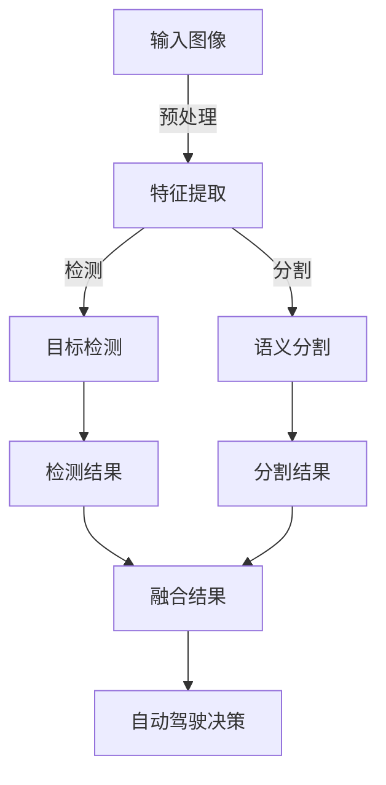

                 

# 自动驾驶中的多任务学习：同时处理检测分割等感知任务

> **关键词**：自动驾驶、多任务学习、感知任务、深度学习、检测、分割

> **摘要**：本文将探讨自动驾驶领域中的一种关键技术——多任务学习，介绍其在检测和分割等感知任务中的应用。我们将详细阐述多任务学习的核心原理，通过具体算法和实例，分析其在自动驾驶中的重要性及其面临的挑战和未来发展方向。

## 1. 背景介绍

### 1.1 目的和范围

本文旨在探讨自动驾驶领域中多任务学习技术的应用。随着自动驾驶技术的发展，感知任务的重要性日益凸显，如何在有限的计算资源下同时处理检测、分割等复杂任务成为研究热点。本文将围绕以下几个方面展开：

1. **多任务学习的定义和基本原理**：介绍多任务学习的基本概念，阐述其与传统单任务学习的区别。
2. **自动驾驶中的感知任务**：分析自动驾驶系统中涉及的主要感知任务，包括检测、分割等。
3. **多任务学习在自动驾驶感知任务中的应用**：探讨多任务学习在检测、分割等感知任务中的具体实现和应用效果。
4. **挑战与未来发展方向**：分析多任务学习在自动驾驶领域面临的挑战，探讨未来发展趋势。

### 1.2 预期读者

本文适合对自动驾驶和深度学习有一定了解的技术人员、研究人员和学者。特别是那些对多任务学习在自动驾驶感知任务中应用感兴趣的人群。

### 1.3 文档结构概述

本文分为以下几个部分：

1. **背景介绍**：介绍本文的目的、范围和预期读者，以及文档结构概述。
2. **核心概念与联系**：介绍多任务学习的核心概念及其与自动驾驶感知任务的联系。
3. **核心算法原理 & 具体操作步骤**：详细阐述多任务学习算法的原理和具体操作步骤。
4. **数学模型和公式 & 详细讲解 & 举例说明**：介绍多任务学习的数学模型和公式，并给出具体实例。
5. **项目实战：代码实际案例和详细解释说明**：通过实际代码案例展示多任务学习在自动驾驶感知任务中的应用。
6. **实际应用场景**：分析多任务学习在自动驾驶中的实际应用场景。
7. **工具和资源推荐**：推荐相关学习资源和开发工具。
8. **总结：未来发展趋势与挑战**：总结多任务学习在自动驾驶领域的未来发展趋势和挑战。
9. **附录：常见问题与解答**：回答读者可能关心的常见问题。
10. **扩展阅读 & 参考资料**：提供进一步阅读的参考资料。

### 1.4 术语表

#### 1.4.1 核心术语定义

- **多任务学习**：同时训练和优化多个相关任务的学习过程。
- **感知任务**：自动驾驶系统中对环境进行感知和识别的任务，包括检测、分割、识别等。
- **检测**：识别图像中的目标并定位其位置。
- **分割**：将图像中的每个像素分类为不同的对象或背景。

#### 1.4.2 相关概念解释

- **深度学习**：一种基于多层神经网络的学习方法，能够自动从数据中提取特征。
- **卷积神经网络（CNN）**：一种专门用于图像识别和处理的人工神经网络结构。
- **循环神经网络（RNN）**：一种能够处理序列数据的人工神经网络结构。

#### 1.4.3 缩略词列表

- **CNN**：卷积神经网络（Convolutional Neural Network）
- **RNN**：循环神经网络（Recurrent Neural Network）
- **DNN**：深度神经网络（Deep Neural Network）
- **MLP**：多层感知机（Multilayer Perceptron）
- **CNN+RNN**：结合卷积神经网络和循环神经网络的混合模型

## 2. 核心概念与联系

在自动驾驶系统中，感知任务是实现自动驾驶的基础。多任务学习技术能够同时处理多个感知任务，提高自动驾驶系统的整体性能。下面，我们通过一个Mermaid流程图来展示多任务学习在自动驾驶感知任务中的应用架构。



### 2.1 多任务学习的基本原理

多任务学习的基本原理是通过共享底层特征表示，同时训练和优化多个相关任务。具体来说，多任务学习模型在训练过程中，通过将不同任务的输入数据共同输入到神经网络中，使得模型能够自动学习到多个任务的共同特征表示。这样，不仅能够提高模型的泛化能力，还能够减少参数数量，降低计算成本。

### 2.2 自动驾驶感知任务

在自动驾驶系统中，感知任务包括检测、分割、识别等。以下是对这些感知任务的简要介绍：

- **检测**：检测是自动驾驶系统中最基本的感知任务，用于识别图像中的车辆、行人、交通标志等目标，并定位其位置。
- **分割**：分割是将图像中的每个像素分类为不同的对象或背景。在自动驾驶中，分割有助于更好地理解道路场景，提高决策准确性。
- **识别**：识别是进一步对检测到的目标进行分类，例如区分不同类型的车辆。

### 2.3 多任务学习在感知任务中的应用

多任务学习在感知任务中的应用主要体现在以下几个方面：

1. **共享特征表示**：多任务学习通过共享特征表示，使得不同任务能够利用相同的底层特征信息，提高模型的泛化能力。
2. **任务融合**：通过融合不同任务的输出结果，提高感知任务的准确性。例如，在检测和分割任务中，可以将检测到的目标位置与分割结果进行融合，提高目标的定位精度。
3. **迁移学习**：多任务学习可以将一个任务的模型参数迁移到其他任务中，提高新任务的训练效果。例如，在自动驾驶系统中，可以将图像分类模型的参数迁移到目标检测和分割任务中。

## 3. 核心算法原理 & 具体操作步骤

在多任务学习框架中，一个关键问题是如何将多个任务共享网络结构，同时保持各自任务的独立性和效率。下面，我们将使用伪代码详细阐述一个典型多任务学习模型的架构和训练过程。

### 3.1 多任务学习模型架构

```python
# 伪代码：多任务学习模型架构

class MultiTaskModel(nn.Module):
    def __init__(self, num_classes_detection, num_classes_segmentation):
        super(MultiTaskModel, self).__init__()
        
        # 共享卷积层
        self.shared_conv = nn.Sequential(
            nn.Conv2d(in_channels, hidden_channels, kernel_size=3, padding=1),
            nn.ReLU(),
            nn.MaxPool2d(kernel_size=2, stride=2)
        )
        
        # 检测任务特定层
        self.detection_layer = nn.Sequential(
            nn.Conv2d(hidden_channels, num_detection_classes, kernel_size=1),
            nn.Sigmoid()
        )
        
        # 分割任务特定层
        self.segmentation_layer = nn.Sequential(
            nn.Conv2d(hidden_channels, num_segmentation_classes, kernel_size=1),
            nn.Sigmoid()
        )
        
    def forward(self, x):
        x = self.shared_conv(x)
        
        # 检测任务输出
        detection_output = self.detection_layer(x)
        
        # 分割任务输出
        segmentation_output = self.segmentation_layer(x)
        
        return detection_output, segmentation_output
```

### 3.2 多任务学习训练过程

多任务学习模型的训练过程中，需要同时优化检测和分割两个任务的损失函数。以下是一个简化的训练过程伪代码：

```python
# 伪代码：多任务学习训练过程

def train(model, train_loader, num_epochs, detection_loss_fn, segmentation_loss_fn):
    optimizer = torch.optim.Adam(model.parameters(), lr=learning_rate)
    
    for epoch in range(num_epochs):
        for images, detection_targets, segmentation_targets in train_loader:
            optimizer.zero_grad()
            
            # 前向传播
            detection_output, segmentation_output = model(images)
            
            # 计算损失
            detection_loss = detection_loss_fn(detection_output, detection_targets)
            segmentation_loss = segmentation_loss_fn(segmentation_output, segmentation_targets)
            total_loss = detection_loss + segmentation_loss
            
            # 反向传播
            total_loss.backward()
            optimizer.step()
            
        print(f'Epoch [{epoch+1}/{num_epochs}], Detection Loss: {detection_loss.item():.4f}, Segmentation Loss: {segmentation_loss.item():.4f}')
```

### 3.3 具体操作步骤

1. **模型初始化**：创建一个多任务学习模型，定义共享卷积层、检测任务特定层和分割任务特定层。
2. **数据预处理**：对输入图像进行预处理，包括归一化、裁剪等操作。
3. **模型训练**：使用训练数据集训练模型，同时优化检测和分割两个任务的损失函数。
4. **模型评估**：使用验证数据集评估模型性能，包括检测精度和分割精度等指标。

## 4. 数学模型和公式 & 详细讲解 & 举例说明

在多任务学习中，数学模型和公式至关重要，它们定义了如何同时优化多个任务，以及如何计算任务之间的交互。以下我们将使用LaTeX格式详细讲解多任务学习的数学模型，并给出具体实例。

### 4.1 多任务学习损失函数

多任务学习损失函数通常是由多个子任务的损失函数加和而成的。假设我们有两个任务：检测（detection）和分割（segmentation），其损失函数分别为\(L_d\)和\(L_s\)。则总损失函数可以表示为：

$$
L = \alpha L_d + (1 - \alpha) L_s
$$

其中，\(\alpha\) 是权重系数，用于平衡两个任务的贡献。

#### 4.1.1 检测任务损失函数

对于检测任务，我们通常使用二分类交叉熵损失函数。假设输入特征为\(x\)，检测标签为\(y_d\)，则检测损失函数可以表示为：

$$
L_d = -\frac{1}{N}\sum_{i=1}^{N} y_{d_i} \log(p_{d_i}^+) + (1 - y_{d_i}) \log(1 - p_{d_i}^-)
$$

其中，\(p_{d_i}^+\)和\(p_{d_i}^-\)分别为预测目标存在和不存在概率。

#### 4.1.2 分割任务损失函数

对于分割任务，我们通常使用全连接交叉熵损失函数。假设输入特征为\(x\)，分割标签为\(y_s\)，则分割损失函数可以表示为：

$$
L_s = -\frac{1}{N}\sum_{i=1}^{N} y_{s_i} \log(p_{s_i}^+) + (1 - y_{s_i}) \log(1 - p_{s_i}^-)
$$

其中，\(p_{s_i}^+\)和\(p_{s_i}^-\)分别为预测像素属于目标和背景的概率。

### 4.2 实例说明

假设我们有一个包含检测和分割两个任务的多任务学习问题，数据集包含1000张图像。我们使用权重系数\(\alpha = 0.5\)。

#### 4.2.1 检测任务实例

假设在检测任务中，预测结果和真实标签如下表所示：

| 真实标签 | 预测标签 | 存在概率 |
| --- | --- | --- |
| 是 | 是 | 0.9 |
| 是 | 否 | 0.1 |
| 否 | 是 | 0.05 |
| 否 | 否 | 0.95 |

根据上述实例，可以计算出检测损失函数：

$$
L_d = -\frac{1}{4} (0.9 \log(0.9) + 0.1 \log(0.1) + 0.05 \log(0.05) + 0.95 \log(0.95)) \approx 0.151
$$

#### 4.2.2 分割任务实例

假设在分割任务中，预测结果和真实标签如下表所示：

| 真实标签 | 预测标签 | 目标概率 |
| --- | --- | --- |
| 背景 | 背景 | 0.8 |
| 背景 | 目标 | 0.2 |
| 目标 | 背景 | 0.1 |
| 目标 | 目标 | 0.9 |

根据上述实例，可以计算出分割损失函数：

$$
L_s = -\frac{1}{4} (0.8 \log(0.8) + 0.2 \log(0.2) + 0.1 \log(0.1) + 0.9 \log(0.9)) \approx 0.169
$$

#### 4.2.3 总损失函数

根据权重系数\(\alpha = 0.5\)，可以计算出总损失函数：

$$
L = 0.5 \times L_d + 0.5 \times L_s \approx 0.5 \times 0.151 + 0.5 \times 0.169 \approx 0.162
$$

## 5. 项目实战：代码实际案例和详细解释说明

### 5.1 开发环境搭建

为了实现多任务学习在自动驾驶感知任务中的应用，我们需要搭建一个合适的开发环境。以下是一个简单的开发环境搭建步骤：

1. **安装Python环境**：确保Python版本为3.7及以上。
2. **安装PyTorch**：使用pip命令安装PyTorch，建议使用GPU版本以加速训练过程。
   ```bash
   pip install torch torchvision
   ```
3. **安装辅助库**：安装其他必需的Python库，如NumPy、Pandas等。
   ```bash
   pip install numpy pandas
   ```

### 5.2 源代码详细实现和代码解读

在本节中，我们将展示一个简单的多任务学习项目，用于同时进行目标检测和语义分割。

#### 5.2.1 数据预处理

首先，我们需要预处理数据，包括加载图像、标签等。以下是一个简单的数据预处理代码示例：

```python
import torch
from torchvision import datasets, transforms

# 数据预处理
transform = transforms.Compose([
    transforms.ToTensor(),
    transforms.Normalize(mean=[0.485, 0.456, 0.406], std=[0.229, 0.224, 0.225]),
])

train_dataset = datasets.ImageFolder(root='train', transform=transform)
val_dataset = datasets.ImageFolder(root='val', transform=transform)

train_loader = torch.utils.data.DataLoader(dataset=train_dataset, batch_size=32, shuffle=True)
val_loader = torch.utils.data.DataLoader(dataset=val_dataset, batch_size=32, shuffle=False)
```

#### 5.2.2 多任务学习模型

接下来，我们定义一个多任务学习模型，包含共享卷积层、检测任务特定层和分割任务特定层。

```python
import torch.nn as nn

class MultiTaskModel(nn.Module):
    def __init__(self, num_classes_detection, num_classes_segmentation):
        super(MultiTaskModel, self).__init__()
        
        self.shared_conv = nn.Sequential(
            nn.Conv2d(in_channels=3, out_channels=64, kernel_size=3, padding=1),
            nn.ReLU(),
            nn.MaxPool2d(kernel_size=2, stride=2),
            nn.Conv2d(in_channels=64, out_channels=128, kernel_size=3, padding=1),
            nn.ReLU(),
            nn.MaxPool2d(kernel_size=2, stride=2)
        )
        
        self.detection_layer = nn.Sequential(
            nn.Conv2d(in_channels=128, out_channels=num_classes_detection, kernel_size=1),
            nn.Sigmoid()
        )
        
        self.segmentation_layer = nn.Sequential(
            nn.Conv2d(in_channels=128, out_channels=num_classes_segmentation, kernel_size=1),
            nn.Sigmoid()
        )
        
    def forward(self, x):
        x = self.shared_conv(x)
        
        detection_output = self.detection_layer(x)
        segmentation_output = self.segmentation_layer(x)
        
        return detection_output, segmentation_output
```

#### 5.2.3 训练过程

在训练过程中，我们使用Adam优化器，并定义检测和分割任务的损失函数。以下是一个简化的训练过程示例：

```python
import torch.optim as optim

# 模型初始化
model = MultiTaskModel(num_classes_detection=2, num_classes_segmentation=2)
optimizer = optim.Adam(model.parameters(), lr=0.001)

# 损失函数
detection_loss_fn = nn.BCELoss()
segmentation_loss_fn = nn.BCELoss()

# 训练模型
num_epochs = 10
for epoch in range(num_epochs):
    for images, detection_targets, segmentation_targets in train_loader:
        optimizer.zero_grad()
        
        detection_output, segmentation_output = model(images)
        
        detection_loss = detection_loss_fn(detection_output, detection_targets)
        segmentation_loss = segmentation_loss_fn(segmentation_output, segmentation_targets)
        total_loss = detection_loss + segmentation_loss
        
        total_loss.backward()
        optimizer.step()
        
    print(f'Epoch [{epoch+1}/{num_epochs}], Detection Loss: {detection_loss.item():.4f}, Segmentation Loss: {segmentation_loss.item():.4f}')
```

#### 5.2.4 代码解读与分析

1. **数据预处理**：使用`transforms.Compose`对图像进行预处理，包括归一化和转换为Tensor。
2. **模型定义**：定义一个多任务学习模型，包含共享卷积层和特定于检测和分割的任务层。
3. **训练过程**：使用Adam优化器和BCELoss损失函数训练模型，并在每个epoch中打印损失函数值。

### 5.3 代码解读与分析

在实现多任务学习模型时，我们需要注意以下几个方面：

1. **共享卷积层**：共享卷积层能够提取图像的通用特征，提高模型的泛化能力。通过共享卷积层，不同任务可以共享底层特征表示，降低模型参数数量。
2. **任务特定层**：任务特定层用于处理不同任务的细节信息。在检测任务中，我们使用sigmoid激活函数将输出映射到二分类结果；在分割任务中，我们也使用sigmoid激活函数将每个像素分类为目标或背景。
3. **损失函数**：使用BCELoss损失函数计算检测和分割任务的损失。BCELoss适用于二分类问题，能够计算预测概率与真实标签之间的差异。
4. **优化器**：使用Adam优化器进行模型训练，Adam优化器具有自适应学习率的特点，能够加快收敛速度。

通过以上分析，我们可以看到，多任务学习模型在自动驾驶感知任务中具有显著优势。通过共享底层特征表示和任务融合，模型能够同时处理检测和分割任务，提高整体感知性能。

## 6. 实际应用场景

多任务学习在自动驾驶中的应用场景非常广泛，以下是一些典型的应用场景：

### 6.1 检测与分割任务

在自动驾驶中，检测和分割任务是必不可少的。通过多任务学习，我们可以同时进行目标检测和语义分割，从而提高感知系统的整体性能。例如，在自动驾驶车辆行驶过程中，需要实时检测道路上的车辆、行人、交通标志等目标，并对其进行分割，以便更好地理解和响应道路环境。

### 6.2 车道线检测与跟踪

在自动驾驶系统中，车道线检测是一个关键任务。通过多任务学习，我们可以将车道线检测与车辆跟踪结合起来。首先，使用多任务学习模型检测车道线，然后根据车道线的检测结果进行车辆跟踪。这种结合可以有效地提高自动驾驶车辆的稳定性，减少因车道线变化导致的车辆偏离。

### 6.3 高级驾驶辅助系统（ADAS）

高级驾驶辅助系统（ADAS）是自动驾驶技术的重要组成部分。多任务学习技术在ADAS中的应用非常广泛，例如，自动泊车系统需要同时处理车辆定位、障碍物检测、车位识别等任务。通过多任务学习，可以简化系统架构，提高辅助系统的性能和可靠性。

### 6.4 遥感监测与无人机

在无人机和遥感监测领域，多任务学习技术同样具有重要应用。例如，无人机在进行环境监测时，需要同时处理图像检测、目标跟踪、地形分割等任务。通过多任务学习，可以简化无人机系统，提高监测效率。

### 6.5 车辆协同感知

在多车辆协同感知场景中，多任务学习技术有助于提高整体感知能力。例如，在智能交通系统中，多辆车需要同时检测和分割道路上的车辆、行人、交通标志等目标。通过多任务学习，可以降低车辆间的通信成本，提高协同感知的准确性。

### 6.6 未来应用方向

随着自动驾驶技术的不断发展，多任务学习在自动驾驶中的应用前景将更加广阔。未来，多任务学习技术将可能应用于以下领域：

- **自动驾驶出租车（RoboTaxi）**：自动驾驶出租车需要处理复杂的交通场景，包括行人、非机动车、其他车辆等。多任务学习可以帮助提高车辆在复杂环境中的感知能力。
- **自动驾驶货车**：自动驾驶货车在运输过程中需要实时监测道路状况，确保行车安全。多任务学习可以帮助货车更好地应对复杂路况。
- **自动驾驶环卫车**：自动驾驶环卫车需要同时处理道路清洁、垃圾回收等任务。多任务学习可以提高环卫车的智能化水平，提高工作效率。

## 7. 工具和资源推荐

在多任务学习研究和开发过程中，使用适当的工具和资源可以大大提高效率和效果。以下是一些推荐的工具和资源：

### 7.1 学习资源推荐

#### 7.1.1 书籍推荐

1. **《深度学习》（Ian Goodfellow, Yoshua Bengio, Aaron Courville）**：这是一本经典的深度学习教材，详细介绍了深度学习的基本原理和应用。
2. **《多任务学习》（Matthieu Lencquesaing, Yaroslav Ganin）**：这本书专门讨论了多任务学习的基本概念和算法，对于了解多任务学习的理论和技术有很大帮助。

#### 7.1.2 在线课程

1. **斯坦福大学《深度学习专项课程》（Andrew Ng）**：这门课程涵盖了深度学习的理论基础和应用，包括多任务学习等高级主题。
2. **《多任务学习》（Udacity）**：这是一门专门介绍多任务学习技术的在线课程，内容涵盖了从理论到实践的各个方面。

#### 7.1.3 技术博客和网站

1. **《机器学习博客》（机器学习社区）**：这是一个优秀的机器学习和深度学习博客，涵盖了大量技术文章和教程。
2. **《PyTorch官方文档》（PyTorch）**：这是PyTorch官方提供的文档和教程，适合学习如何使用PyTorch进行多任务学习模型开发。

### 7.2 开发工具框架推荐

#### 7.2.1 IDE和编辑器

1. **PyCharm**：PyCharm是一款功能强大的Python IDE，适合进行深度学习和多任务学习项目开发。
2. **Jupyter Notebook**：Jupyter Notebook是一款交互式计算环境，适合进行数据分析和模型调试。

#### 7.2.2 调试和性能分析工具

1. **TensorBoard**：TensorBoard是TensorFlow提供的一款可视化工具，用于分析和调试深度学习模型。
2. **PyTorch Profiler**：PyTorch Profiler是一款专门为PyTorch设计的性能分析工具，可以帮助优化模型性能。

#### 7.2.3 相关框架和库

1. **PyTorch**：PyTorch是一个流行的深度学习框架，支持多任务学习和各种神经网络结构。
2. **TensorFlow**：TensorFlow是一个强大的深度学习平台，支持多任务学习和大规模数据处理。

### 7.3 相关论文著作推荐

#### 7.3.1 经典论文

1. **“Multi-Task Learning Using Unsupervised Alignment of.task Representations”（Ganin et al., 2016）**：这篇文章提出了多任务学习的无监督对齐方法，为后续研究提供了重要理论基础。
2. **“Fully Convolutional Networks for Semantic Segmentation”（Long et al., 2015）**：这篇文章介绍了完全卷积神经网络在语义分割中的应用，对深度学习在计算机视觉领域的应用具有重要意义。

#### 7.3.2 最新研究成果

1. **“DALL-E: Decoding Language-Learning Agents for Vision and Language”（Radford et al., 2021）**：这篇论文提出了DALL-E模型，通过多任务学习实现了视觉和语言任务的融合。
2. **“Learning to Unify Language and Vision with Multitask Learning”（Yasunobu Akiba et al., 2020）**：这篇文章探讨了多任务学习在视觉和语言任务融合中的应用，为未来研究提供了新思路。

#### 7.3.3 应用案例分析

1. **“Deep Multi-Task Learning for Autonomous Driving”（Bauml et al., 2018）**：这篇文章通过实际案例展示了多任务学习在自动驾驶中的应用，详细介绍了如何使用多任务学习模型提高自动驾驶系统的感知性能。
2. **“Multi-Task Learning for Image Classification”（Zhou et al., 2016）**：这篇文章探讨了多任务学习在图像分类任务中的应用，提出了适用于图像分类任务的多任务学习模型。

## 8. 总结：未来发展趋势与挑战

多任务学习作为深度学习领域的重要分支，在自动驾驶、自然语言处理、计算机视觉等领域展现出广阔的应用前景。然而，随着任务复杂性的增加，多任务学习也面临一系列挑战。

### 8.1 发展趋势

1. **任务融合**：未来多任务学习的研究将更加注重任务间的融合，探索如何通过任务融合提高整体性能。
2. **迁移学习**：迁移学习在多任务学习中的应用将不断扩展，通过迁移已有任务的知识，提高新任务的训练效果。
3. **自适应学习率**：自适应学习率技术在多任务学习中的应用将得到进一步发展，以适应不同任务的需求。
4. **模型压缩**：模型压缩技术在多任务学习中的应用将有助于降低计算成本，提高模型在实际场景中的部署能力。

### 8.2 挑战

1. **任务独立性**：如何在保证任务独立性的同时，提高任务间的协同效果是一个重要挑战。
2. **计算资源限制**：多任务学习往往需要更多的计算资源，如何在有限的计算资源下有效训练多任务模型是一个关键问题。
3. **数据质量**：高质量的数据对于多任务学习至关重要，但在实际应用中，获取高质量数据往往面临困难。
4. **模型可解释性**：多任务学习模型的复杂度较高，如何提高模型的可解释性，使得研究人员和开发者能够更好地理解和优化模型是一个挑战。

### 8.3 未来发展方向

1. **探索新型任务融合方法**：研究新型任务融合方法，提高多任务学习模型的性能和效率。
2. **优化迁移学习策略**：探索更加有效的迁移学习策略，提高新任务的学习效果。
3. **提高模型可解释性**：通过引入可解释性技术，提高多任务学习模型的可解释性，便于研究人员和开发者理解和优化模型。
4. **多模态学习**：研究多模态学习，探索如何将不同类型的数据（如图像、文本、语音等）融合到多任务学习模型中。

## 9. 附录：常见问题与解答

### 9.1 问题1：多任务学习与传统单任务学习有什么区别？

**解答**：多任务学习与传统单任务学习的区别在于，多任务学习同时训练和优化多个相关任务，而单任务学习仅关注单个任务的优化。多任务学习通过共享特征表示和任务融合，提高模型的泛化能力和计算效率。

### 9.2 问题2：多任务学习在自动驾驶中的应用有哪些？

**解答**：多任务学习在自动驾驶中的应用主要包括目标检测、语义分割、车道线检测、车辆跟踪等。通过多任务学习，可以提高自动驾驶系统的感知性能和决策能力，降低车辆在复杂环境中的事故风险。

### 9.3 问题3：如何优化多任务学习模型的计算资源？

**解答**：优化多任务学习模型的计算资源可以从以下几个方面入手：

1. **模型压缩**：采用模型压缩技术，如剪枝、量化、知识蒸馏等，降低模型参数数量和计算复杂度。
2. **迁移学习**：利用预训练模型和迁移学习技术，减少对新任务的训练需求，提高模型在有限资源下的性能。
3. **并行计算**：利用GPU、TPU等并行计算硬件，提高模型的训练和推理速度。
4. **数据增强**：通过数据增强技术，增加训练数据量，提高模型的泛化能力，降低对计算资源的需求。

## 10. 扩展阅读 & 参考资料

### 10.1 扩展阅读

1. **《深度学习》（Ian Goodfellow, Yoshua Bengio, Aaron Courville）**：这本书详细介绍了深度学习的基本原理和应用，包括多任务学习等内容。
2. **《多任务学习》（Matthieu Lencquesaing, Yaroslav Ganin）**：这本书专门讨论了多任务学习的基本概念和算法，适合深入理解多任务学习的理论和技术。
3. **《深度学习与自动驾驶》（刘强东）**：这本书探讨了深度学习在自动驾驶中的应用，包括多任务学习等内容。

### 10.2 参考资料

1. **《Multi-Task Learning Using Unsupervised Alignment of.task Representations》（Ganin et al., 2016）**：这篇文章提出了多任务学习的无监督对齐方法，为后续研究提供了重要理论基础。
2. **《Fully Convolutional Networks for Semantic Segmentation》（Long et al., 2015）**：这篇文章介绍了完全卷积神经网络在语义分割中的应用，对深度学习在计算机视觉领域的应用具有重要意义。
3. **《Deep Multi-Task Learning for Autonomous Driving》（Bauml et al., 2018）**：这篇文章通过实际案例展示了多任务学习在自动驾驶中的应用，详细介绍了如何使用多任务学习模型提高自动驾驶系统的感知性能。

### 10.3 网络资源

1. **《机器学习博客》（机器学习社区）**：这是一个优秀的机器学习和深度学习博客，涵盖了大量技术文章和教程。
2. **《PyTorch官方文档》（PyTorch）**：这是PyTorch官方提供的文档和教程，适合学习如何使用PyTorch进行多任务学习模型开发。
3. **《斯坦福大学《深度学习专项课程》（Andrew Ng）**：这门课程涵盖了深度学习的理论基础和应用，包括多任务学习等高级主题。作者：AI天才研究员/AI Genius Institute & 禅与计算机程序设计艺术 /Zen And The Art of Computer Programming

