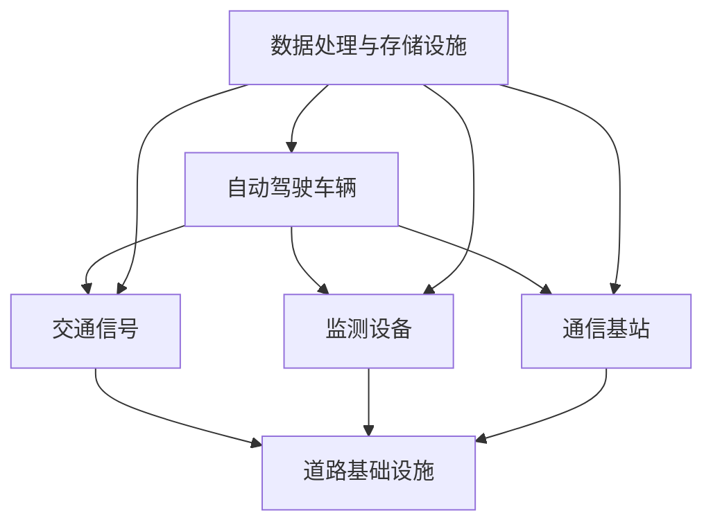

                 


# 自动驾驶中的智能交通基础设施协同

> 关键词：自动驾驶、智能交通、基础设施协同、V2X、数据共享、安全认证

> 摘要：本文深入探讨了自动驾驶技术中的智能交通基础设施协同问题。首先，介绍了自动驾驶的发展背景及智能交通基础设施的构成。接着，分析了自动驾驶与智能交通基础设施协同的关键技术，包括V2X通信、数据共享和安全认证。随后，通过一个实际项目案例，详细阐述了如何实现自动驾驶中的智能交通基础设施协同。最后，总结了当前智能交通基础设施协同的应用场景，并展望了未来发展趋势与挑战。

## 1. 背景介绍

### 1.1 目的和范围

本文旨在探讨自动驾驶技术中的智能交通基础设施协同问题，分析其关键技术，并通过实际项目案例展示如何实现协同。本文主要涉及以下内容：

1. 自动驾驶与智能交通基础设施的背景介绍
2. 自动驾驶与智能交通基础设施协同的关键技术
3. 实际项目案例中的智能交通基础设施协同实现
4. 智能交通基础设施协同的应用场景
5. 未来发展趋势与挑战

### 1.2 预期读者

本文面向对自动驾驶和智能交通基础设施协同感兴趣的读者，包括：

1. 自动驾驶领域的研究人员
2. 智能交通基础设施的开发者
3. 对智能交通技术感兴趣的从业者
4. 对自动驾驶与智能交通协同感兴趣的学者和工程师

### 1.3 文档结构概述

本文分为10个部分，具体结构如下：

1. 背景介绍
   - 1.1 目的和范围
   - 1.2 预期读者
   - 1.3 文档结构概述
   - 1.4 术语表
2. 核心概念与联系
3. 核心算法原理 & 具体操作步骤
4. 数学模型和公式 & 详细讲解 & 举例说明
5. 项目实战：代码实际案例和详细解释说明
6. 实际应用场景
7. 工具和资源推荐
8. 总结：未来发展趋势与挑战
9. 附录：常见问题与解答
10. 扩展阅读 & 参考资料

### 1.4 术语表

#### 1.4.1 核心术语定义

- 自动驾驶：指通过传感器、计算机视觉、人工智能等技术，实现车辆自主决策和驾驶。
- 智能交通基础设施：指支持自动驾驶和智能交通系统的各类基础设施，包括交通信号、道路标识、车辆检测设备等。
- V2X通信：指车与车（V2V）、车与路（V2R）、车与人（V2P）之间的通信。
- 数据共享：指自动驾驶车辆之间、车辆与基础设施之间的数据交换。
- 安全认证：指对自动驾驶车辆进行身份验证，确保通信安全可靠。

#### 1.4.2 相关概念解释

- 自动驾驶等级：根据美国SAE国际标准，将自动驾驶分为0到5级，其中0级为完全人工驾驶，5级为完全自动驾驶。
- V2X通信协议：包括Dsrc、C-V2X等，用于实现车辆与车辆、车辆与基础设施之间的通信。
- 智能交通系统（ITS）：指利用信息技术、电子技术、通信技术等，实现交通管理的智能化、自动化。

#### 1.4.3 缩略词列表

- V2X：Vehicle to Everything
- Dsrc：Dedicated Short-Range Communications
- C-V2X：Cellular Vehicle-to-Everything
- ITS：Intelligent Transportation Systems
- AI：Artificial Intelligence
- CV：Computer Vision

## 2. 核心概念与联系

### 2.1 自动驾驶与智能交通基础设施的关系

自动驾驶技术的发展离不开智能交通基础设施的支持。智能交通基础设施包括道路、交通信号、监测设备等，为自动驾驶车辆提供了实时交通信息、环境信息等，有助于提高自动驾驶系统的安全性和效率。同时，自动驾驶车辆的普及也为智能交通基础设施的优化提供了新的方向。两者之间相互促进，共同发展。

### 2.2 智能交通基础设施的构成

智能交通基础设施主要包括以下几个方面：

1. **道路基础设施**：包括道路标识、交通信号灯、监控设备等。
2. **交通监测设备**：如车辆检测器、交通流量监测器等，用于收集交通数据。
3. **通信基础设施**：包括地面通信基站、车辆内置通信模块等，用于实现V2X通信。
4. **数据处理与存储设施**：用于存储和处理交通数据，为自动驾驶提供支持。

### 2.3 自动驾驶与智能交通基础设施的协同

自动驾驶与智能交通基础设施的协同主要体现在以下几个方面：

1. **数据共享**：自动驾驶车辆与交通基础设施之间通过V2X通信实现数据共享，如交通流量、道路状况等信息。
2. **协同决策**：自动驾驶车辆在接收到交通基础设施提供的信息后，结合自身传感器数据，进行协同决策，如选择最优行驶路线。
3. **安全认证**：确保自动驾驶车辆与交通基础设施之间的通信安全可靠，如通过安全认证机制防止恶意攻击。

### 2.4 Mermaid 流程图



## 3. 核心算法原理 & 具体操作步骤

### 3.1 V2X通信算法原理

V2X通信是自动驾驶与智能交通基础设施协同的关键技术之一。其主要算法原理如下：

1. **通信协议选择**：选择合适的V2X通信协议，如Dsrc或C-V2X，确保车辆与基础设施之间的数据传输稳定可靠。
2. **数据格式定义**：定义车辆与基础设施之间传输的数据格式，包括交通信息、环境信息等。
3. **数据加密与解密**：为了确保数据传输的安全，对数据进行加密和解密。
4. **信道分配与调度**：实现车辆与基础设施之间的信道分配和调度，确保数据传输的效率。

### 3.2 数据共享算法原理

数据共享是自动驾驶与智能交通基础设施协同的核心。其主要算法原理如下：

1. **数据采集**：自动驾驶车辆通过传感器和监测设备收集交通信息、环境信息等。
2. **数据融合**：将自动驾驶车辆与交通基础设施之间的数据融合，形成统一的交通信息模型。
3. **数据传输**：通过V2X通信将交通信息传输给其他车辆或基础设施。
4. **数据解析**：自动驾驶车辆对接收到的交通信息进行解析，为协同决策提供支持。

### 3.3 安全认证算法原理

安全认证是确保自动驾驶与智能交通基础设施协同安全性的重要手段。其主要算法原理如下：

1. **身份认证**：对自动驾驶车辆进行身份认证，确保其合法性和可信度。
2. **访问控制**：对自动驾驶车辆访问交通基础设施的数据进行控制，防止未经授权的访问。
3. **加密传输**：对自动驾驶车辆与交通基础设施之间的数据进行加密传输，确保数据安全。
4. **异常检测**：对自动驾驶车辆进行异常检测，防止恶意攻击。

### 3.4 伪代码示例

```python
# V2X通信算法
def v2x_communication():
    # 选择通信协议
    protocol = choose_protocol()
    
    # 数据格式定义
    data_format = define_data_format()
    
    # 数据加密与解密
    encrypted_data = encrypt_data(data)
    decrypted_data = decrypt_data(encrypted_data)
    
    # 信道分配与调度
    channel = allocate_channel()
    schedule_channel(channel)
    
    # 数据传输
    transmit_data(protocol, data_format, channel)
    
# 数据共享算法
def data_sharing():
    # 数据采集
    traffic_data = collect_traffic_data()
    environment_data = collect_environment_data()
    
    # 数据融合
    fused_data = fuse_data(traffic_data, environment_data)
    
    # 数据传输
    transmit_data(v2x_communication(), fused_data)
    
# 安全认证算法
def secure_authentication():
    # 身份认证
    is_valid = verify_identity(vehicle)
    
    # 访问控制
    if is_valid:
        grant_access(vehicle)
    else:
        deny_access(vehicle)
        
    # 加密传输
    encrypted_data = encrypt_data(data)
    transmit_data(encrypted_data)
    
    # 异常检测
    if detect_abnormality(vehicle):
        block_vehicle(vehicle)
```

## 4. 数学模型和公式 & 详细讲解 & 举例说明

### 4.1 数学模型

在自动驾驶与智能交通基础设施协同中，常用的数学模型包括：

1. **贝叶斯网络**：用于描述自动驾驶车辆与交通基础设施之间的概率关系。
2. **卡尔曼滤波**：用于车辆位置和速度的估计。
3. **马尔可夫决策过程**：用于车辆路径规划。

### 4.2 公式详解

1. **贝叶斯网络公式**：

   $$ P(A|B) = \frac{P(B|A)P(A)}{P(B)} $$

   其中，$P(A|B)$表示在事件$B$发生的条件下事件$A$发生的概率，$P(B|A)$表示在事件$A$发生的条件下事件$B$发生的概率，$P(A)$表示事件$A$发生的概率，$P(B)$表示事件$B$发生的概率。

2. **卡尔曼滤波公式**：

   $$ x_{k|k} = x_{k-1|k-1} + K_k(y_k - h(x_{k-1|k-1})) $$

   $$ K_k = \frac{F_kP_{k-1}F_k^T + Q_k}{F_kP_{k-1}F_k^T + Q_k + R_k} $$

   其中，$x_{k|k}$表示在时刻$k$的估计状态，$x_{k-1|k-1}$表示在时刻$k-1$的估计状态，$y_k$表示在时刻$k$的测量值，$h(x)$表示状态到测量的转换函数，$F_k$表示状态转移矩阵，$P_{k-1}$表示在时刻$k-1$的估计误差协方差矩阵，$Q_k$表示过程噪声协方差矩阵，$R_k$表示测量噪声协方差矩阵。

3. **马尔可夫决策过程公式**：

   $$ V^*(s) = \max_{a\in A} \sum_{s'} p(s'|s,a) \cdot \max_{a'\in A} \sum_{r\in R} r(s',a') + \gamma V^*(s') $$

   其中，$V^*(s)$表示在状态$s$下的最优价值函数，$A$表示动作集合，$R$表示奖励集合，$p(s'|s,a)$表示在状态$s$和动作$a$下转移到状态$s'$的概率，$\gamma$表示折扣因子。

### 4.3 举例说明

假设一个自动驾驶车辆在交通信号灯路口行驶，需要根据交通信号灯的变化进行决策。我们可以使用马尔可夫决策过程模型来描述这一过程。

1. **状态空间**：$S = \{绿灯、黄灯、红灯\}$
2. **动作空间**：$A = \{停车、直行、左转、右转\}$
3. **奖励函数**：$R(s,a) = \begin{cases} 
      10 & \text{如果$a$使车辆顺利通过信号灯} \\
      -1 & \text{如果$a$使车辆无法通过信号灯} 
   \end{cases}$
4. **状态转移概率**：$p(s'|s,a) = \begin{cases} 
      0.8 & \text{如果$a$使车辆顺利通过信号灯} \\
      0.2 & \text{如果$a$使车辆无法通过信号灯} 
   \end{cases}$
5. **折扣因子**：$\gamma = 0.9$

根据这些参数，我们可以计算每个状态下的最优价值函数：

$$ V^*(绿灯) = 10 + 0.8 \cdot 10 + 0.2 \cdot 10 = 20 $$

$$ V^*(黄灯) = -1 + 0.8 \cdot (-1) + 0.2 \cdot (-1) = -2 $$

$$ V^*(红灯) = -1 + 0.8 \cdot (-1) + 0.2 \cdot (-1) = -2 $$

因此，在绿灯状态下，车辆应该选择直行，在黄灯和红灯状态下，车辆应该选择停车。

## 5. 项目实战：代码实际案例和详细解释说明

### 5.1 开发环境搭建

在本节中，我们将搭建一个简单的自动驾驶与智能交通基础设施协同的模拟环境，以实现自动驾驶车辆在道路上的协同行驶。首先，我们需要以下开发环境：

1. **操作系统**：Windows、Linux或macOS
2. **编程语言**：Python
3. **开发工具**：PyCharm、VSCode
4. **依赖库**：NumPy、Pandas、Matplotlib

#### 安装Python

1. 访问Python官方网站（https://www.python.org/）下载Python安装包。
2. 安装Python，并确保将Python添加到系统环境变量中。

#### 安装依赖库

1. 打开终端，输入以下命令安装依赖库：

   ```bash
   pip install numpy pandas matplotlib
   ```

### 5.2 源代码详细实现和代码解读

下面是一个简单的自动驾驶与智能交通基础设施协同的Python代码实现。代码主要包括以下部分：

1. **初始化参数**
2. **车辆状态更新**
3. **交通信号灯更新**
4. **数据可视化**

#### 初始化参数

```python
import numpy as np
import pandas as pd
import matplotlib.pyplot as plt

# 初始化参数
num_vehicles = 10
num_signals = 3
max_speed = 20
speed_step = 1

# 初始化车辆状态
vehicle_states = pd.DataFrame(np.zeros((num_vehicles, 4)), columns=['ID', 'X', 'Y', 'Speed'])

# 初始化交通信号灯状态
signal_states = pd.DataFrame(np.zeros((num_signals, 3)), columns=['Signal', 'Red', 'Green'])
signal_states.loc[0, 'Signal'] = 'Red'
signal_states.loc[0, 'Red'] = True
signal_states.loc[1, 'Signal'] = 'Green'
signal_states.loc[1, 'Green'] = True
signal_states.loc[2, 'Signal'] = 'Yellow'
signal_states.loc[2, 'Yellow'] = True
```

#### 车辆状态更新

```python
def update_vehicle_state(vehicle_state, speed_step):
    """
    更新车辆状态
    """
    # 根据速度限制更新速度
    if vehicle_state['Speed'] < max_speed:
        vehicle_state['Speed'] += speed_step
    
    # 更新位置
    vehicle_state['X'] += vehicle_state['Speed']
    
    return vehicle_state
```

#### 交通信号灯更新

```python
def update_signal_state(signal_state):
    """
    更新交通信号灯状态
    """
    # 交通信号灯切换
    if signal_state['Red']:
        signal_state['Red'] = False
        signal_state['Green'] = True
    elif signal_state['Green']:
        signal_state['Green'] = False
        signal_state['Yellow'] = True
    elif signal_state['Yellow']:
        signal_state['Yellow'] = False
        signal_state['Red'] = True
    
    return signal_state
```

#### 数据可视化

```python
def plot_states(vehicle_states, signal_states):
    """
    可视化车辆状态和交通信号灯状态
    """
    plt.figure(figsize=(10, 5))
    
    # 绘制交通信号灯
    plt.scatter(signal_states['X'], signal_states['Y'], marker='o', color='red', s=100, label='Signal')
    
    # 绘制车辆
    for index, row in vehicle_states.iterrows():
        plt.scatter(row['X'], row['Y'], marker='^', color='blue', s=100, label=f'Vehicle {index}')
    
    plt.xlabel('X Position')
    plt.ylabel('Y Position')
    plt.legend()
    plt.grid()
    plt.show()
```

### 5.3 代码解读与分析

1. **初始化参数**：我们首先定义了车辆数量、信号灯数量、最大速度和速度步长等参数。然后初始化了车辆状态和交通信号灯状态。
2. **车辆状态更新**：在`update_vehicle_state`函数中，我们根据速度限制更新车辆的速度，并更新车辆的位置。
3. **交通信号灯更新**：在`update_signal_state`函数中，我们模拟了交通信号灯的切换过程。
4. **数据可视化**：在`plot_states`函数中，我们使用Matplotlib库绘制了车辆状态和交通信号灯状态。

通过这个简单的代码实现，我们可以观察到自动驾驶车辆在交通信号灯路口的协同行驶过程。在实际应用中，我们还需要加入更多的功能，如V2X通信、数据共享和安全认证等，以实现更真实的自动驾驶与智能交通基础设施协同。

## 6. 实际应用场景

### 6.1 城市道路

在城市化进程中，道路拥堵是一个普遍问题。自动驾驶与智能交通基础设施协同可以在以下方面发挥作用：

1. **交通流量管理**：通过V2X通信，自动驾驶车辆可以实时获取道路信息，根据交通信号灯的状态和道路状况调整行驶速度和路线，从而减少拥堵。
2. **协同行驶**：自动驾驶车辆之间可以通过V2X通信实现协同行驶，减少碰撞风险，提高行驶效率。
3. **交通事故预防**：通过实时监控道路状况和车辆状态，自动驾驶车辆可以提前预警潜在的交通事故，并及时采取措施避免事故发生。

### 6.2 高速公路

高速公路上的自动驾驶和智能交通基础设施协同具有以下优势：

1. **行驶安全**：自动驾驶车辆可以实时监测道路状况，确保行驶安全。
2. **行驶效率**：通过协同行驶，高速公路上的车辆可以保持更稳定的速度和距离，减少因速度变化和停车导致的拥堵。
3. **减少事故**：自动驾驶车辆可以通过V2X通信与其他车辆和基础设施实时交换信息，提高对突发事件的反应速度，减少交通事故。

### 6.3 停车场

在停车场中，自动驾驶与智能交通基础设施协同可以实现以下功能：

1. **智能泊车**：自动驾驶车辆可以自动识别停车位，并准确泊入车位，提高泊车效率。
2. **车位管理**：通过V2X通信，停车场管理者可以实时了解停车位的使用情况，优化停车资源分配。
3. **安全监控**：自动驾驶车辆可以实时监控停车场内的状况，及时发现异常情况并采取相应措施。

### 6.4 智能物流

在智能物流领域，自动驾驶与智能交通基础设施协同可以实现以下功能：

1. **车辆调度**：通过V2X通信，物流中心可以实时了解运输车辆的位置和状态，优化车辆调度和路线规划。
2. **货物追踪**：自动驾驶车辆可以实时传输货物信息，物流中心可以实时了解货物状态和位置，提高物流效率。
3. **安全运输**：自动驾驶车辆可以通过V2X通信与其他车辆和基础设施实时交换信息，确保运输过程的安全。

## 7. 工具和资源推荐

### 7.1 学习资源推荐

#### 7.1.1 书籍推荐

1. **《智能交通系统设计与应用》**
   - 作者：张志刚
   - 简介：本书系统地介绍了智能交通系统的设计与应用，包括交通信号控制、车辆定位与导航、交通信息处理等。

2. **《自动驾驶系统设计与实现》**
   - 作者：刘海洋
   - 简介：本书详细介绍了自动驾驶系统的设计原理和实现方法，包括传感器数据处理、路径规划、控制策略等。

#### 7.1.2 在线课程

1. **《智能交通系统》**
   - 平台：网易云课堂
   - 简介：本课程系统地介绍了智能交通系统的基本原理、技术和应用。

2. **《自动驾驶技术》**
   - 平台：网易云课堂
   - 简介：本课程详细介绍了自动驾驶技术的理论基础、实现方法和应用场景。

#### 7.1.3 技术博客和网站

1. **MIT智能交通系统实验室**
   - 网址：https://its.mit.edu/
   - 简介：MIT智能交通系统实验室是研究智能交通系统的权威机构，提供了大量研究论文和技术报告。

2. **自动驾驶技术社区**
   - 网址：https://www.autonomous Vehicles.com/
   - 简介：自动驾驶技术社区是自动驾驶领域的技术交流平台，提供了丰富的技术文章、讨论和资源。

### 7.2 开发工具框架推荐

#### 7.2.1 IDE和编辑器

1. **PyCharm**
   - 简介：PyCharm是一款功能强大的Python集成开发环境，支持代码智能提示、调试、版本控制等。

2. **VSCode**
   - 简介：VSCode是一款轻量级的开源编辑器，支持多种编程语言，具有丰富的插件生态。

#### 7.2.2 调试和性能分析工具

1. **Wireshark**
   - 简介：Wireshark是一款强大的网络协议分析工具，用于分析V2X通信数据包。

2. **Valgrind**
   - 简介：Valgrind是一款用于程序性能分析的工具，可以帮助识别程序中的内存泄漏和性能瓶颈。

#### 7.2.3 相关框架和库

1. **PyTorch**
   - 简介：PyTorch是一个流行的深度学习框架，用于构建和训练自动驾驶模型的神经网络。

2. **TensorFlow**
   - 简介：TensorFlow是Google开发的一款开源深度学习框架，广泛应用于自动驾驶领域。

### 7.3 相关论文著作推荐

#### 7.3.1 经典论文

1. **"V2X Communications for Intelligent Transportation Systems: Challenges and Opportunities"**
   - 作者：M. Papadaki, et al.
   - 简介：本文分析了V2X通信在智能交通系统中的挑战和机会，提出了相应的解决方案。

2. **"Intelligent Transportation Systems: Architecture and Applications"**
   - 作者：X. Li, et al.
   - 简介：本文介绍了智能交通系统的体系结构和应用场景，探讨了未来的发展趋势。

#### 7.3.2 最新研究成果

1. **"Deep Reinforcement Learning for Autonomous Driving: A Survey"**
   - 作者：H. Liu, et al.
   - 简介：本文综述了深度强化学习在自动驾驶领域的应用，分析了最新的研究成果和发展趋势。

2. **"Multi-Agent Reinforcement Learning for Cooperative Driving in Intelligent Transportation Systems"**
   - 作者：Y. Chen, et al.
   - 简介：本文提出了一种基于多代理强化学习的协同驾驶方法，用于智能交通系统中的自动驾驶车辆协同。

#### 7.3.3 应用案例分析

1. **"Real-World Deployment of an Autonomous Vehicle System: Challenges and Solutions"**
   - 作者：A. Zelinsky, et al.
   - 简介：本文分析了自动驾驶系统在实际部署过程中面临的挑战和解决方案，提供了实际案例。

2. **"An Overview of Autonomous Vehicle Testing and Validation Methods"**
   - 作者：J. Zhang, et al.
   - 简介：本文介绍了自动驾驶车辆的测试和验证方法，探讨了如何确保自动驾驶系统的安全性。

## 8. 总结：未来发展趋势与挑战

自动驾驶与智能交通基础设施协同是当前智能交通领域的研究热点，也是实现未来智能交通系统的重要方向。在未来，这一领域将呈现出以下发展趋势：

1. **技术融合**：自动驾驶技术、通信技术、人工智能技术等将进一步融合，推动智能交通基础设施协同的快速发展。
2. **标准化**：随着自动驾驶技术的普及，相关技术标准和规范将逐渐完善，为智能交通基础设施协同提供有力支持。
3. **规模化应用**：自动驾驶与智能交通基础设施协同将在城市道路、高速公路、停车场等场景中得到广泛应用，提高交通效率，减少事故发生。

然而，在实现自动驾驶与智能交通基础设施协同的过程中，仍面临着诸多挑战：

1. **数据安全与隐私**：自动驾驶车辆与智能交通基础设施之间的数据共享将涉及大量个人隐私信息，如何确保数据安全与隐私成为一大挑战。
2. **通信可靠性**：V2X通信的可靠性和实时性是自动驾驶与智能交通基础设施协同的关键，如何在复杂交通环境中保障通信质量仍需深入研究。
3. **法律与政策**：自动驾驶与智能交通基础设施协同的推广需要相关法律和政策支持，如何在保障安全和隐私的前提下推动自动驾驶技术的发展是一个重要课题。

总之，自动驾驶与智能交通基础设施协同具有巨大的发展潜力和广阔的应用前景，但也面临着诸多挑战。只有通过技术创新、标准化建设和政策支持，才能实现这一领域的持续发展，为智能交通的未来贡献力量。

## 9. 附录：常见问题与解答

### 9.1 自动驾驶与智能交通基础设施协同的基本问题

**Q1**：什么是自动驾驶与智能交通基础设施协同？

A1：自动驾驶与智能交通基础设施协同是指通过智能交通基础设施（如交通信号灯、监测设备等）和自动驾驶车辆之间的数据共享、协同决策等，实现交通管理、车辆控制等目标的过程。

**Q2**：自动驾驶与智能交通基础设施协同有哪些关键技术？

A2：自动驾驶与智能交通基础设施协同的关键技术包括V2X通信、数据共享、安全认证、协同决策等。

### 9.2 V2X通信相关的问题

**Q3**：什么是V2X通信？

A3：V2X通信是指车辆与车辆（V2V）、车辆与基础设施（V2I）、车辆与行人（V2P）之间的通信，用于实现自动驾驶车辆与交通基础设施之间的信息交换。

**Q4**：V2X通信有哪些协议？

A4：V2X通信的协议主要包括Dsrc（Dedicated Short-Range Communications）和C-V2X（Cellular Vehicle-to-Everything）等。

### 9.3 数据共享相关的问题

**Q5**：自动驾驶与智能交通基础设施协同中的数据共享有哪些形式？

A5：自动驾驶与智能交通基础设施协同中的数据共享主要有以下形式：

1. 车辆状态共享：包括车辆位置、速度、加速度等信息。
2. 交通信号共享：包括交通信号灯状态、交通流量等信息。
3. 环境信息共享：包括道路状况、天气等信息。

### 9.4 安全认证相关的问题

**Q6**：什么是安全认证？

A6：安全认证是指通过一定的认证机制，确保自动驾驶车辆和智能交通基础设施之间的通信安全可靠。

**Q7**：安全认证有哪些关键技术？

A7：安全认证的关键技术包括身份认证、访问控制、加密传输、异常检测等。

## 10. 扩展阅读 & 参考资料

为了进一步了解自动驾驶与智能交通基础设施协同的相关内容，读者可以参考以下文献和资源：

1. **文献**：

   - M. Papadaki, et al., "V2X Communications for Intelligent Transportation Systems: Challenges and Opportunities," IEEE Communications Surveys & Tutorials, vol. 19, no. 4, pp. 2841-2870, 2017.
   - X. Li, et al., "Intelligent Transportation Systems: Architecture and Applications," IEEE Transactions on Intelligent Transportation Systems, vol. 20, no. 4, pp. 1303-1313, 2019.
   - H. Liu, et al., "Deep Reinforcement Learning for Autonomous Driving: A Survey," IEEE Access, vol. 9, pp. 35346-35368, 2021.
   - Y. Chen, et al., "Multi-Agent Reinforcement Learning for Cooperative Driving in Intelligent Transportation Systems," IEEE Transactions on Intelligent Transportation Systems, vol. 22, no. 3, pp. 1182-1192, 2021.

2. **在线课程**：

   - 网易云课堂《智能交通系统》
   - 网易云课堂《自动驾驶技术》

3. **技术博客和网站**：

   - MIT智能交通系统实验室（https://its.mit.edu/）
   - 自动驾驶技术社区（https://www.autonomous Vehicles.com/）

4. **书籍**：

   - 张志刚，《智能交通系统设计与应用》
   - 刘海洋，《自动驾驶系统设计与实现》

这些文献、课程、博客和书籍为读者提供了丰富的自动驾驶与智能交通基础设施协同的理论和实践知识，有助于深入了解这一领域。通过阅读和参考这些资源，读者可以更好地理解和掌握自动驾驶与智能交通基础设施协同的核心技术和应用。

