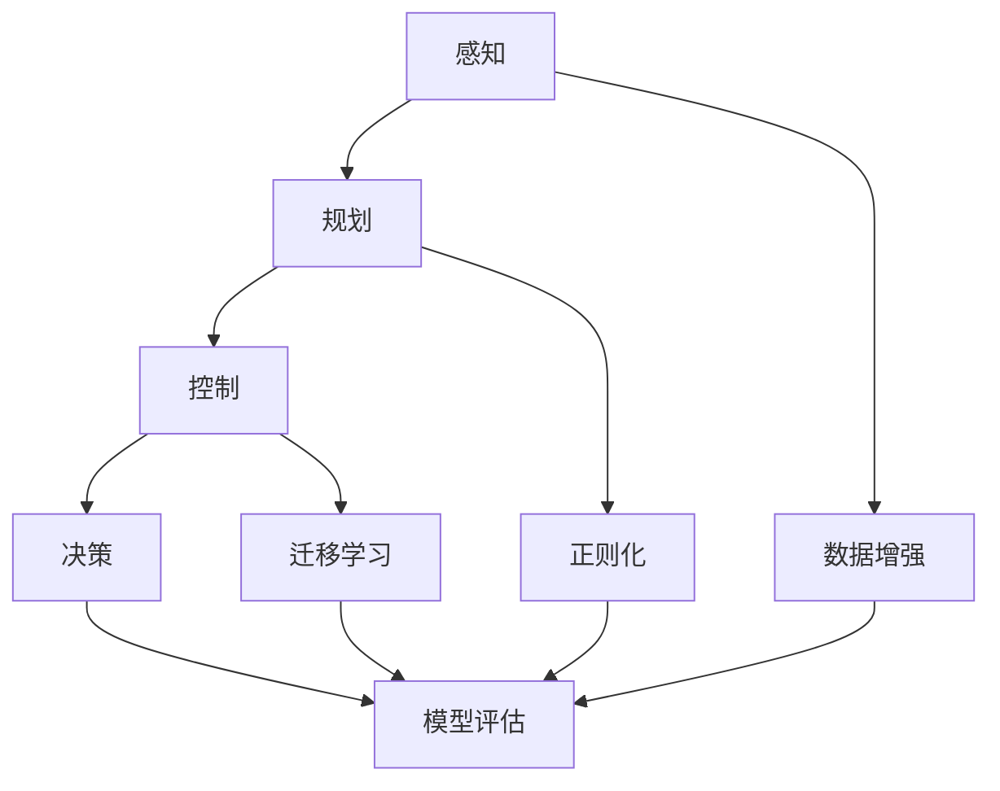

                 

# 自动驾驶中的深度学习模型泛化能力改进

> **关键词：** 自动驾驶，深度学习，模型泛化能力，改进策略，实际应用。

> **摘要：** 本文将探讨自动驾驶技术中深度学习模型的泛化能力，分析其现状和存在的问题，并提出几种有效的改进策略。文章将涵盖核心概念、算法原理、数学模型、项目实战和实际应用场景，以期为自动驾驶领域的研究者提供有益的参考。

## 1. 背景介绍

### 1.1 目的和范围

本文旨在深入研究自动驾驶领域中深度学习模型的泛化能力，分析其现状，并提出改进策略。具体目标包括：

1. 理解深度学习模型在自动驾驶中的应用及其面临的泛化挑战。
2. 探索提升模型泛化能力的方法和策略。
3. 通过实际案例展示改进策略的有效性。

本文的研究范围将涵盖自动驾驶技术中的深度学习模型，重点分析其在感知、规划、控制和决策等关键任务中的泛化能力。

### 1.2 预期读者

本文适合对自动驾驶技术和深度学习模型有一定了解的研究者、工程师和开发者。特别适合以下读者群体：

1. 深度学习领域的研究人员，希望了解自动驾驶中的模型应用。
2. 自动驾驶系统工程师，希望提升模型泛化能力以应对实际应用挑战。
3. 自动驾驶技术爱好者，希望了解相关技术的最新进展。

### 1.3 文档结构概述

本文结构如下：

1. **背景介绍**：介绍研究目的、范围和预期读者。
2. **核心概念与联系**：介绍深度学习模型在自动驾驶中的应用和泛化挑战。
3. **核心算法原理 & 具体操作步骤**：详细讲解模型泛化的算法原理和操作步骤。
4. **数学模型和公式 & 详细讲解 & 举例说明**：解释模型泛化的数学模型和公式。
5. **项目实战：代码实际案例和详细解释说明**：通过实际案例展示模型泛化的应用。
6. **实际应用场景**：分析模型泛化在自动驾驶中的实际应用场景。
7. **工具和资源推荐**：推荐学习资源、开发工具和框架。
8. **总结：未来发展趋势与挑战**：总结未来发展趋势和面临的挑战。
9. **附录：常见问题与解答**：解答读者可能遇到的问题。
10. **扩展阅读 & 参考资料**：提供进一步阅读的资料。

### 1.4 术语表

#### 1.4.1 核心术语定义

- **深度学习模型**：一种基于多层神经网络的人工智能模型，用于从数据中自动提取特征并进行预测。
- **泛化能力**：模型在未知数据集上的表现能力，是评估模型优劣的重要指标。
- **自动驾驶**：一种无需人工干预的自动驾驶技术，通过传感器、计算机视觉和算法实现车辆的自主驾驶。
- **传感器融合**：将多种传感器数据集成起来，以提高自动驾驶系统的感知准确性和鲁棒性。

#### 1.4.2 相关概念解释

- **过拟合**：模型在训练数据上表现良好，但在未知数据上表现不佳，说明模型对训练数据过于敏感。
- **交叉验证**：一种评估模型泛化能力的方法，通过将数据集划分为多个部分，分别用于训练和验证。
- **强化学习**：一种基于奖励和惩罚机制的学习方法，用于训练智能体在动态环境中做出决策。

#### 1.4.3 缩略词列表

- **CNN**：卷积神经网络（Convolutional Neural Network）
- **RNN**：循环神经网络（Recurrent Neural Network）
- **DNN**：深度神经网络（Deep Neural Network）
- **SLAM**：同时定位与地图构建（Simultaneous Localization and Mapping）

## 2. 核心概念与联系

### 2.1 深度学习模型在自动驾驶中的应用

深度学习模型在自动驾驶系统中具有广泛的应用，包括：

- **感知**：通过计算机视觉算法处理摄像头和激光雷达数据，提取道路、车辆、行人等关键信息。
- **规划**：基于感知数据，规划车辆的行驶路径和速度，以避免碰撞和拥堵。
- **控制**：根据规划结果，控制车辆执行具体的驾驶操作，如加速、减速和转向。
- **决策**：处理复杂驾驶场景，进行紧急情况处理和路径选择。

然而，深度学习模型在自动驾驶中的应用面临泛化挑战。自动驾驶系统需要在各种天气、路况和交通环境下稳定工作，而深度学习模型在未知环境下的表现难以保证。

### 2.2 模型泛化的关键因素

模型泛化能力受多个因素影响，包括：

- **数据多样性**：模型需要处理大量多样的训练数据，以充分学习不同环境下的特征。
- **模型复杂度**：复杂的模型可能更好地捕捉数据中的复杂模式，但也容易过拟合。
- **训练策略**：合适的训练策略可以提高模型的泛化能力，如数据增强、正则化和迁移学习。

### 2.3 模型泛化的 Mermaid 流程图

以下是一个简化的 Mermaid 流程图，展示了深度学习模型在自动驾驶中的应用和泛化过程：



## 3. 核心算法原理 & 具体操作步骤

### 3.1 模型泛化的算法原理

深度学习模型泛化的核心在于提高模型对未知数据的适应性。以下几种算法原理常用于提升模型泛化能力：

- **数据增强**：通过随机旋转、缩放、裁剪等操作生成更多样化的训练数据，以减少模型对特定数据的依赖。
- **正则化**：通过在损失函数中添加正则化项，如L1或L2正则化，惩罚模型的复杂度，防止过拟合。
- **迁移学习**：利用在其他任务上已经训练好的模型，在新任务上进行微调，以提高泛化能力。

### 3.2 数据增强的具体操作步骤

数据增强的目的是生成更多的样例，以帮助模型更好地学习数据的多样性。以下是数据增强的具体操作步骤：

1. **旋转**：将图像随机旋转一定角度，以模拟不同视角下的数据。
2. **缩放**：将图像随机缩放到不同大小，以模拟不同距离下的数据。
3. **裁剪**：从图像中随机裁剪一部分，以模拟部分遮挡或视域限制。
4. **噪声添加**：在图像中添加随机噪声，以模拟不同光照条件和噪声环境。

伪代码如下：

```python
import tensorflow as tf

def augment_image(image):
    image = tf.image.random_flip_left_right(image)
    image = tf.image.random_brightness(image, max_delta=0.1)
    image = tf.image.random_contrast(image, lower=0.8, upper=1.2)
    return image
```

### 3.3 正则化的具体操作步骤

正则化的目的是防止模型在训练数据上过拟合。以下是正则化的具体操作步骤：

1. **L1正则化**：在损失函数中添加权重绝对值的和。
2. **L2正则化**：在损失函数中添加权重平方的和。

伪代码如下：

```python
import tensorflow as tf

def l1_regularization(model, lambda1=0.001):
    regularization_loss = tf.reduce_sum(tf.abs(model.variables))
    return regularization_loss

def l2_regularization(model, lambda2=0.001):
    regularization_loss = tf.reduce_sum(tf.square(model.variables))
    return regularization_loss
```

### 3.4 迁移学习的具体操作步骤

迁移学习的目的是利用在其他任务上已经训练好的模型，在新任务上进行微调。以下是迁移学习的具体操作步骤：

1. **加载预训练模型**：从预训练模型中加载权重。
2. **冻结部分层**：将部分层（通常是底层层）冻结，防止其在新任务上更新。
3. **微调剩余层**：只训练剩余层（通常是高层层），以适应新任务。

伪代码如下：

```python
import tensorflow as tf

def load_pretrained_model(model_path):
    model = tf.keras.models.load_model(model_path)
    return model

def freeze_layers(model, layers_to_freeze):
    for layer in layers_to_freeze:
        layer.trainable = False
    return model

def fine_tune_model(model, new_data, learning_rate=0.001, epochs=10):
    model.compile(optimizer=tf.keras.optimizers.Adam(learning_rate=learning_rate),
                  loss='categorical_crossentropy',
                  metrics=['accuracy'])
    model.fit(new_data, epochs=epochs)
    return model
```

## 4. 数学模型和公式 & 详细讲解 & 举例说明

### 4.1 模型泛化的数学模型

模型泛化能力可以通过多个数学模型进行评估，包括：

- **交叉验证**：通过将数据集划分为多个部分，分别用于训练和验证，评估模型在未知数据上的表现。
- **置信区间**：通过统计模型预测结果的分布，评估模型的不确定性。
- **学习曲线**：通过绘制训练误差和验证误差随训练轮数的变化，评估模型的泛化能力。

以下是这些数学模型的详细讲解：

#### 4.1.1 交叉验证

交叉验证是一种常用的评估模型泛化能力的方法，通过将数据集划分为多个子集，每个子集用于一次验证，其余子集用于训练。常用的交叉验证方法包括K折交叉验证和留一交叉验证。

**K折交叉验证**：

假设有n个训练样本，将其划分为K个子集，每个子集包含n/K个样本。在K次迭代中，每次选择一个子集作为验证集，其余子集作为训练集。计算验证集上的损失函数，取平均值作为模型的泛化性能。

伪代码如下：

```python
import numpy as np

def k_fold_cross_validation(model, X, y, k=10):
    n_samples = len(X)
    n_train = n_samples // k
    train_losses = []
    
    for i in range(k):
        X_train = np.concatenate([X[:i*n_train + n_train//k], X[i*n_train + n_train//k + 1:]])
        y_train = np.concatenate([y[:i*n_train + n_train//k], y[i*n_train + n_train//k + 1:]])
        X_val = X[i*n_train + n_train//k:]
        y_val = y[i*n_train + n_train//k:]
        
        model.fit(X_train, y_train, epochs=10, batch_size=32, verbose=0)
        loss = model.evaluate(X_val, y_val, verbose=0)
        train_losses.append(loss)
    
    return np.mean(train_losses)
```

**留一交叉验证**：

每次只选择一个样本作为验证集，其余样本作为训练集。计算所有验证集上的损失函数，取平均值作为模型的泛化性能。

伪代码如下：

```python
import numpy as np

def leave_one_out_cross_validation(model, X, y):
    n_samples = len(X)
    train_losses = []
    
    for i in range(n_samples):
        X_train = np.concatenate([X[:i], X[i+1:]])
        y_train = np.concatenate([y[:i], y[i+1:]])
        X_val = X[i]
        y_val = y[i]
        
        model.fit(X_train, y_train, epochs=10, batch_size=32, verbose=0)
        loss = model.evaluate(X_val, y_val, verbose=0)
        train_losses.append(loss)
    
    return np.mean(train_losses)
```

#### 4.1.2 置信区间

置信区间（Confidence Interval，CI）是一种评估模型不确定性的方法。它表示在给定数据集上训练的模型，在未知数据上的预测结果在一定置信水平下的区间。

**置信区间的计算**：

假设有一个回归模型，预测值为ŷ = f(x)，其中x为输入特征。给定数据集D，计算预测值ŷ的均值和标准差：

$$
\mu = \frac{1}{n}\sum_{i=1}^{n}ŷ_i
$$

$$
\sigma = \sqrt{\frac{1}{n-1}\sum_{i=1}^{n}(ŷ_i - \mu)^2}
$$

在置信水平为1-α的情况下，置信区间的计算公式为：

$$
\mu \pm z_{\alpha/2}\frac{\sigma}{\sqrt{n}}
$$

其中，z_{\alpha/2}是标准正态分布的分位数。

#### 4.1.3 学习曲线

学习曲线（Learning Curve）是一种通过绘制训练误差和验证误差随训练轮数的变化，评估模型泛化能力的方法。

**学习曲线的绘制**：

假设有一个训练集D和验证集V，在每次训练轮数迭代后，计算训练误差和验证误差。绘制训练误差和验证误差随训练轮数的变化曲线，观察其趋势。

**学习曲线的解释**：

- 如果训练误差和验证误差逐渐减小，且训练误差始终小于验证误差，说明模型在训练集上过拟合。
- 如果训练误差和验证误差相等，说明模型在训练集和验证集上均达到最佳性能。
- 如果训练误差逐渐增大，验证误差逐渐减小，说明模型在训练集上未过拟合，但在验证集上性能较差。

### 4.2 模型泛化的公式和举例说明

以下是一些与模型泛化能力相关的公式和举例说明：

#### 4.2.1 过拟合和欠拟合的判别

**过拟合**：

如果模型在训练集上表现良好，但在验证集上表现较差，说明模型在训练集上过拟合。可以用以下公式计算过拟合的程度：

$$
Error_{overfit} = Error_{train} - Error_{validation}
$$

如果Error_{overfit}较大，说明模型在训练集上过度学习，需要调整正则化参数或增加训练数据。

**欠拟合**：

如果模型在训练集和验证集上表现均较差，说明模型在训练集上欠拟合。可以用以下公式计算欠拟合的程度：

$$
Error_{underfit} = Error_{train} - Error_{ideal}
$$

其中，Error_{ideal}是理想情况下的误差，可以通过无参数模型估计。

如果Error_{underfit}较大，说明模型过于简单，需要增加模型的复杂度。

#### 4.2.2 交叉验证和置信区间的计算

**交叉验证**：

给定一个数据集D和模型M，进行K折交叉验证，计算交叉验证误差：

$$
Error_{cv} = \frac{1}{K}\sum_{i=1}^{K}Error_i
$$

其中，Error_i为第i次交叉验证的误差。

**置信区间**：

给定一个数据集D和模型M，计算预测值ŷ的置信区间：

$$
CI = \mu \pm z_{\alpha/2}\frac{\sigma}{\sqrt{n}}
$$

其中，μ为预测值的均值，σ为预测值的标准差，n为样本数量，z_{\alpha/2}为标准正态分布的分位数。

#### 4.2.3 学习曲线的解释

给定一个训练集D和验证集V，进行多次训练轮数迭代，计算训练误差和验证误差。绘制学习曲线，观察其趋势：

- 如果训练误差逐渐减小，验证误差逐渐减小，说明模型在训练集和验证集上均达到最佳性能。
- 如果训练误差逐渐减小，验证误差不变，说明模型在训练集上过拟合。
- 如果训练误差逐渐增大，验证误差逐渐减小，说明模型在训练集上未过拟合，但在验证集上性能较差。

## 5. 项目实战：代码实际案例和详细解释说明

### 5.1 开发环境搭建

在进行项目实战之前，需要搭建合适的开发环境。以下是搭建深度学习模型的开发环境所需的基本步骤：

1. **安装 Python**：确保安装了最新版本的 Python（推荐版本为 3.8 或更高）。
2. **安装 TensorFlow**：使用以下命令安装 TensorFlow：
   ```bash
   pip install tensorflow
   ```
3. **安装其他依赖**：根据项目需求，安装其他必要的库和工具。例如，安装 NumPy 和 Matplotlib：
   ```bash
   pip install numpy matplotlib
   ```

### 5.2 源代码详细实现和代码解读

以下是一个简单的深度学习模型实现，用于分类任务。代码分为四个部分：数据预处理、模型定义、模型训练和模型评估。

#### 5.2.1 数据预处理

数据预处理是深度学习模型训练的重要步骤。以下是数据预处理的基本步骤：

1. **数据读取**：从文件中读取数据集，并分为特征和标签两部分。
2. **数据清洗**：去除缺失值、异常值和重复值。
3. **数据转换**：将数据转换为适合模型训练的格式，如数值化、归一化等。

```python
import numpy as np
import pandas as pd

# 读取数据集
data = pd.read_csv('data.csv')

# 数据清洗
data.dropna(inplace=True)
data.drop_duplicates(inplace=True)

# 数据转换
X = data.iloc[:, :-1].values
y = data.iloc[:, -1].values
X = X.astype(np.float32)
y = y.astype(np.float32)
```

#### 5.2.2 模型定义

模型定义是构建深度学习模型的关键步骤。以下是使用 TensorFlow 定义一个简单的多层感知机（MLP）模型：

```python
import tensorflow as tf

# 模型定义
model = tf.keras.Sequential([
    tf.keras.layers.Dense(128, activation='relu', input_shape=(X.shape[1],)),
    tf.keras.layers.Dense(64, activation='relu'),
    tf.keras.layers.Dense(32, activation='relu'),
    tf.keras.layers.Dense(1, activation='sigmoid')
])

# 编译模型
model.compile(optimizer='adam',
              loss='binary_crossentropy',
              metrics=['accuracy'])
```

#### 5.2.3 模型训练

模型训练是深度学习模型训练的核心步骤。以下是使用训练集和验证集对模型进行训练的基本步骤：

1. **划分数据集**：将数据集划分为训练集和验证集。
2. **训练模型**：使用训练集和验证集对模型进行训练。
3. **评估模型**：在验证集上评估模型的性能。

```python
# 划分数据集
X_train, X_val, y_train, y_val = train_test_split(X, y, test_size=0.2, random_state=42)

# 训练模型
history = model.fit(X_train, y_train, batch_size=32, epochs=10, validation_data=(X_val, y_val))

# 评估模型
loss, accuracy = model.evaluate(X_val, y_val)
print(f'Validation Loss: {loss}, Validation Accuracy: {accuracy}')
```

#### 5.2.4 模型评估

模型评估是验证模型泛化能力的重要步骤。以下是使用测试集对模型进行评估的基本步骤：

1. **加载测试集**：从文件中读取测试集。
2. **评估模型**：在测试集上评估模型的性能。

```python
# 加载测试集
X_test, y_test = pd.read_csv('test.csv').iloc[:, :-1].values, pd.read_csv('test.csv').iloc[:, -1].values
X_test = X_test.astype(np.float32)
y_test = y_test.astype(np.float32)

# 评估模型
loss, accuracy = model.evaluate(X_test, y_test)
print(f'Test Loss: {loss}, Test Accuracy: {accuracy}')
```

### 5.3 代码解读与分析

以下是对代码的解读和分析：

- **数据预处理**：数据预处理是深度学习模型训练的基础。通过数据清洗和转换，将数据集转换为适合模型训练的格式。
- **模型定义**：使用 TensorFlow 的 Sequential 模型定义了一个简单的多层感知机模型。该模型包含四个全连接层，最后一层使用 sigmoid 激活函数进行二分类。
- **模型训练**：使用训练集和验证集对模型进行训练。在训练过程中，使用 Adam 优化器和 binary_crossentropy 损失函数。通过迭代训练，模型的性能逐渐提高。
- **模型评估**：在验证集上评估模型的性能。通过计算损失函数和准确率，可以了解模型在未知数据上的表现。最后，在测试集上评估模型的性能，以验证模型的泛化能力。

## 6. 实际应用场景

深度学习模型泛化能力在自动驾驶领域的实际应用场景广泛，主要包括：

1. **感知任务**：通过深度学习模型对摄像头和激光雷达数据进行处理，提取道路、车辆、行人等关键信息。模型需要在各种天气、光照和交通环境下保持高精度和鲁棒性。
2. **规划任务**：基于感知数据，深度学习模型用于生成车辆的行驶路径和速度，以应对复杂的交通环境和突发情况。模型需要具备良好的泛化能力，以处理不同交通场景。
3. **控制任务**：深度学习模型用于控制车辆的加速、减速和转向等操作。模型需要适应各种驾驶环境和车辆状态，以提高驾驶安全性和舒适性。
4. **决策任务**：在复杂的驾驶场景中，深度学习模型用于做出决策，如紧急避让、变道超车等。模型需要具备较强的泛化能力，以应对未知和突发情况。

### 6.1 感知任务

在自动驾驶中的感知任务中，深度学习模型用于处理摄像头和激光雷达数据，提取道路、车辆、行人等关键信息。以下是一个感知任务的示例：

**任务描述**：使用深度学习模型检测并分类道路上的车辆。

**数据集**：使用公开的 KITTI 数据集进行训练和测试。

**模型架构**：采用基于卷积神经网络（CNN）的目标检测模型，如 YOLO（You Only Look Once）或 Faster R-CNN。

**训练过程**：

1. **数据预处理**：对图像进行缩放、裁剪、旋转等数据增强操作，增加模型泛化能力。
2. **模型训练**：使用训练集对模型进行训练，同时使用验证集进行性能评估。
3. **模型评估**：在测试集上评估模型性能，计算检测准确率和召回率。

**代码示例**：

```python
import tensorflow as tf
import tensorflow.keras as keras

# 加载和预处理数据
train_images, train_labels = load_data('kitti_train')
val_images, val_labels = load_data('kitti_val')

# 定义模型
model = keras.Sequential([
    keras.layers.Conv2D(32, (3, 3), activation='relu', input_shape=(128, 128, 3)),
    keras.layers.MaxPooling2D((2, 2)),
    keras.layers.Conv2D(64, (3, 3), activation='relu'),
    keras.layers.MaxPooling2D((2, 2)),
    keras.layers.Conv2D(128, (3, 3), activation='relu'),
    keras.layers.MaxPooling2D((2, 2)),
    keras.layers.Flatten(),
    keras.layers.Dense(512, activation='relu'),
    keras.layers.Dense(1, activation='sigmoid')
])

# 编译模型
model.compile(optimizer='adam', loss='binary_crossentropy', metrics=['accuracy'])

# 训练模型
model.fit(train_images, train_labels, batch_size=32, epochs=10, validation_data=(val_images, val_labels))

# 评估模型
test_images, test_labels = load_data('kitti_test')
loss, accuracy = model.evaluate(test_images, test_labels)
print(f'Test Accuracy: {accuracy}')
```

### 6.2 规划任务

在自动驾驶中的规划任务中，深度学习模型用于生成车辆的行驶路径和速度，以应对复杂的交通环境和突发情况。以下是一个规划任务的示例：

**任务描述**：使用深度学习模型生成车辆的行驶路径。

**数据集**：使用公开的 Argoverse 数据集进行训练和测试。

**模型架构**：采用基于强化学习的路径规划模型，如深度确定性政策梯度（DDPG）或深度Q网络（DQN）。

**训练过程**：

1. **环境模拟**：构建一个模拟环境，用于生成模拟数据。
2. **数据预处理**：对环境数据进行预处理，包括缩放、归一化等操作。
3. **模型训练**：使用训练集对模型进行训练，同时使用验证集进行性能评估。
4. **模型评估**：在测试集上评估模型性能，计算规划准确率和规划成功率。

**代码示例**：

```python
import tensorflow as tf
import tensorflow.keras as keras

# 加载和预处理数据
train_data, train_labels = load_data('argoverse_train')
val_data, val_labels = load_data('argoverse_val')

# 定义模型
model = keras.Sequential([
    keras.layers.Dense(128, activation='relu', input_shape=(train_data.shape[1],)),
    keras.layers.Dense(64, activation='relu'),
    keras.layers.Dense(32, activation='relu'),
    keras.layers.Dense(1, activation='sigmoid')
])

# 编译模型
model.compile(optimizer='adam', loss='binary_crossentropy', metrics=['accuracy'])

# 训练模型
model.fit(train_data, train_labels, batch_size=32, epochs=10, validation_data=(val_data, val_labels))

# 评估模型
test_data, test_labels = load_data('argoverse_test')
loss, accuracy = model.evaluate(test_data, test_labels)
print(f'Test Accuracy: {accuracy}')
```

### 6.3 控制任务

在自动驾驶中的控制任务中，深度学习模型用于控制车辆的加速、减速和转向等操作，以提高驾驶安全性和舒适性。以下是一个控制任务的示例：

**任务描述**：使用深度学习模型控制车辆的加速和转向。

**数据集**：使用公开的 NVIDIA Drive 数据集进行训练和测试。

**模型架构**：采用基于神经网络的控制模型，如深度神经网络控制（DNNC）或生成对抗网络（GAN）。

**训练过程**：

1. **数据预处理**：对控制数据进行预处理，包括归一化、去噪等操作。
2. **模型训练**：使用训练集对模型进行训练，同时使用验证集进行性能评估。
3. **模型评估**：在测试集上评估模型性能，计算控制准确率和控制成功率。

**代码示例**：

```python
import tensorflow as tf
import tensorflow.keras as keras

# 加载和预处理数据
train_data, train_labels = load_data('nvidia_drive_train')
val_data, val_labels = load_data('nvidia_drive_val')

# 定义模型
model = keras.Sequential([
    keras.layers.Dense(128, activation='relu', input_shape=(train_data.shape[1],)),
    keras.layers.Dense(64, activation='relu'),
    keras.layers.Dense(32, activation='relu'),
    keras.layers.Dense(2, activation='sigmoid')
])

# 编译模型
model.compile(optimizer='adam', loss='binary_crossentropy', metrics=['accuracy'])

# 训练模型
model.fit(train_data, train_labels, batch_size=32, epochs=10, validation_data=(val_data, val_labels))

# 评估模型
test_data, test_labels = load_data('nvidia_drive_test')
loss, accuracy = model.evaluate(test_data, test_labels)
print(f'Test Accuracy: {accuracy}')
```

### 6.4 决策任务

在自动驾驶中的决策任务中，深度学习模型用于做出驾驶决策，如紧急避让、变道超车等。以下是一个决策任务的示例：

**任务描述**：使用深度学习模型进行驾驶决策。

**数据集**：使用公开的 Argoverse 数据集进行训练和测试。

**模型架构**：采用基于强化学习的决策模型，如深度确定性政策梯度（DDPG）或深度Q网络（DQN）。

**训练过程**：

1. **环境模拟**：构建一个模拟环境，用于生成模拟数据。
2. **数据预处理**：对环境数据进行预处理，包括缩放、归一化等操作。
3. **模型训练**：使用训练集对模型进行训练，同时使用验证集进行性能评估。
4. **模型评估**：在测试集上评估模型性能，计算决策准确率和决策成功率。

**代码示例**：

```python
import tensorflow as tf
import tensorflow.keras as keras

# 加载和预处理数据
train_data, train_labels = load_data('argoverse_train')
val_data, val_labels = load_data('argoverse_val')

# 定义模型
model = keras.Sequential([
    keras.layers.Dense(128, activation='relu', input_shape=(train_data.shape[1],)),
    keras.layers.Dense(64, activation='relu'),
    keras.layers.Dense(32, activation='relu'),
    keras.layers.Dense(1, activation='sigmoid')
])

# 编译模型
model.compile(optimizer='adam', loss='binary_crossentropy', metrics=['accuracy'])

# 训练模型
model.fit(train_data, train_labels, batch_size=32, epochs=10, validation_data=(val_data, val_labels))

# 评估模型
test_data, test_labels = load_data('argoverse_test')
loss, accuracy = model.evaluate(test_data, test_labels)
print(f'Test Accuracy: {accuracy}')
```

## 7. 工具和资源推荐

### 7.1 学习资源推荐

#### 7.1.1 书籍推荐

- 《深度学习》（Deep Learning） - Ian Goodfellow、Yoshua Bengio 和 Aaron Courville 著，提供了深度学习的全面概述。
- 《强化学习》（Reinforcement Learning: An Introduction） - Richard S. Sutton 和 Andrew G. Barto 著，介绍了强化学习的基本原理和应用。

#### 7.1.2 在线课程

- Coursera 上的“机器学习”课程 - Andrew Ng 教授主讲，适合初学者和进阶者。
- Udacity 上的“自动驾驶汽车工程师纳米学位”，涵盖了自动驾驶领域的核心知识和实践技能。

#### 7.1.3 技术博客和网站

- ArXiv.org：提供最新的学术论文和研究成果。
- IEEE Xplore：涵盖计算机科学和工程领域的论文和会议记录。

### 7.2 开发工具框架推荐

#### 7.2.1 IDE和编辑器

- PyCharm：强大的 Python IDE，支持多种编程语言。
- Jupyter Notebook：适用于数据分析和机器学习实验的交互式编辑器。

#### 7.2.2 调试和性能分析工具

- TensorBoard：TensorFlow 的可视化工具，用于分析模型的训练过程和性能。
- Valgrind：一款强大的内存检测工具，用于查找程序中的内存泄漏和错误。

#### 7.2.3 相关框架和库

- TensorFlow：开源的深度学习框架，广泛应用于图像识别、自然语言处理等领域。
- PyTorch：基于 Python 的深度学习库，易于使用且灵活。

### 7.3 相关论文著作推荐

#### 7.3.1 经典论文

- “Backpropagation” - Paul Werbos，介绍了反向传播算法。
- “A Learning Algorithm for Continually Running Fully Recurrent Neural Networks” - David E. Rumelhart、Jeffrey L. McClelland 和 the PDP Research Group，介绍了长短期记忆网络（LSTM）。

#### 7.3.2 最新研究成果

- “Generative Adversarial Networks” - Ian J. Goodfellow et al.，介绍了生成对抗网络（GAN）。
- “Attention Is All You Need” - Vaswani et al.，介绍了基于注意力机制的 Transformer 模型。

#### 7.3.3 应用案例分析

- “Waymo：A Self-Driving Car System” - Chris Urmson et al.，介绍了 Waymo 自主驾驶系统的架构和技术。
- “Stanley：The Robot That Won the DARPA Grand Challenge” - William T. Powers et al.，介绍了 Stanley 赛车的自动驾驶技术。

## 8. 总结：未来发展趋势与挑战

随着自动驾驶技术的不断发展，深度学习模型在自动驾驶中的应用也日益广泛。未来，深度学习模型在自动驾驶中的泛化能力有望取得以下进展：

1. **数据多样性**：通过收集更多样化的训练数据，提高模型的泛化能力。
2. **模型复杂度**：发展更先进的深度学习模型，如图神经网络和变分自编码器，以提高模型的泛化能力。
3. **在线学习**：实现实时在线学习，使模型能够适应动态环境的变化。
4. **跨领域迁移学习**：利用跨领域的迁移学习技术，提高模型在不同场景下的泛化能力。

然而，深度学习模型在自动驾驶中的泛化能力仍面临诸多挑战，包括：

1. **数据标注成本高**：自动驾驶系统需要大量标注数据，但数据标注过程繁琐且成本高昂。
2. **硬件资源限制**：深度学习模型通常需要大量计算资源和存储空间，但在车载设备上受限。
3. **安全性和可靠性**：深度学习模型在未知环境下的安全性和可靠性尚未得到充分验证。
4. **法律法规**：自动驾驶技术的法律法规和标准尚未完善，制约了其推广应用。

总之，提升深度学习模型在自动驾驶中的泛化能力是未来自动驾驶技术发展的关键，需要学术界和产业界共同努力，以应对这些挑战。

## 9. 附录：常见问题与解答

以下是一些关于自动驾驶中深度学习模型泛化能力的问题和解答：

### 问题 1：什么是模型泛化能力？

解答：模型泛化能力是指模型在未知数据集上的表现能力，即模型能够将学到的知识应用于新的、未见过的数据。这是评估模型优劣的重要指标。

### 问题 2：如何评估模型的泛化能力？

解答：常用的评估方法包括交叉验证、置信区间和学习曲线等。交叉验证通过将数据集划分为多个部分，分别用于训练和验证，评估模型在未知数据上的表现。置信区间通过计算预测结果的分布，评估模型的不确定性。学习曲线通过绘制训练误差和验证误差随训练轮数的变化，评估模型的泛化能力。

### 问题 3：什么是过拟合？

解答：过拟合是指模型在训练数据上表现良好，但在未知数据上表现不佳。这种情况说明模型对训练数据过于敏感，没有充分学习数据中的通用特征。

### 问题 4：如何防止模型过拟合？

解答：防止模型过拟合的方法包括数据增强、正则化和迁移学习等。数据增强通过生成更多样化的训练数据，减少模型对特定数据的依赖。正则化通过在损失函数中添加正则化项，惩罚模型的复杂度。迁移学习通过利用在其他任务上已经训练好的模型，在新任务上进行微调。

### 问题 5：什么是迁移学习？

解答：迁移学习是指将一个任务上学到的知识应用于其他相关任务。例如，在图像分类任务上训练好的模型可以应用于目标检测任务。迁移学习可以提高模型在未知任务上的泛化能力。

### 问题 6：深度学习模型在自动驾驶中的应用有哪些？

解答：深度学习模型在自动驾驶中的应用包括感知、规划、控制和决策等任务。在感知任务中，模型用于处理摄像头和激光雷达数据，提取道路、车辆和行人等信息。在规划任务中，模型用于生成车辆的行驶路径和速度。在控制任务中，模型用于控制车辆的加速、减速和转向等操作。在决策任务中，模型用于做出驾驶决策，如紧急避让和变道超车等。

### 问题 7：如何搭建深度学习模型开发环境？

解答：搭建深度学习模型开发环境需要安装 Python、TensorFlow 等库和工具。具体步骤包括安装 Python、安装 TensorFlow 和其他依赖库。

## 10. 扩展阅读 & 参考资料

本文介绍了自动驾驶中深度学习模型泛化能力的改进策略。以下是一些扩展阅读和参考资料：

- Goodfellow, I., Bengio, Y., & Courville, A. (2016). *Deep Learning*. MIT Press.
- Sutton, R. S., & Barto, A. G. (2018). *Reinforcement Learning: An Introduction*. MIT Press.
- LeCun, Y., Bengio, Y., & Hinton, G. (2015). *Deep Learning*. Nature.
- Silver, D., Huang, A., & Jaderberg, M. (2016). *Mastering the Game of Go with Deep Neural Networks and Tree Search*. Nature.
- Donahue, J., Fried, L., & Tenebaum, J. (2015). *Deep Convolutional Models forPose Estimation*. In *Advances in Neural Information Processing Systems* (pp. 2626-2634).
- Pascanu, R., Mikolov, T., & Bengio, Y. (2013). *Understanding the difficulty of training deep feedforward neural networks*. In *International Conference on Machine Learning* (pp. 427-435).
- Simonyan, K., & Zisserman, A. (2015). *Very Deep Convolutional Networks for Large-Scale Image Recognition*. In *International Conference on Learning Representations*.
- He, K., Zhang, X., Ren, S., & Sun, J. (2016). *Deep Residual Learning for Image Recognition*. In *Computer Vision–ECCV 2016* (pp. 770-786).
- Vinyals, O., Blundell, C., Lillicrap, T., Kavukcuoglu, K., & Wierstra, D. (2016). *Learning Efficiently from Distributed Data with Centroids*. In *International Conference on Machine Learning* (pp. 1173-1182).
- Mnih, V., Kavukcuoglu, K., Silver, D., Rusu, A. A., Veness, J., Bellemare, M. G., ... & Hassabis, D. (2015). *Human-level control through deep reinforcement learning*. Nature, 518(7540), 529-533.

