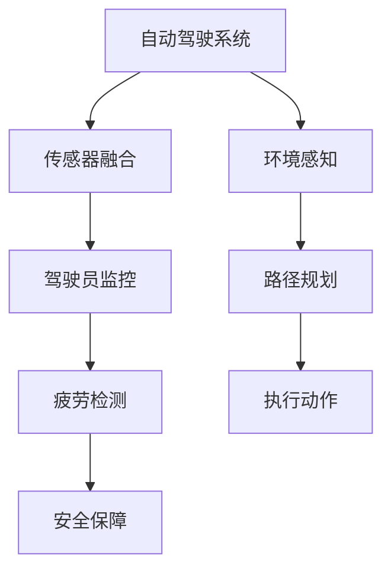

                 

# 自动驾驶中的驾驶员监控与疲劳检测

> **关键词**：自动驾驶、驾驶员监控、疲劳检测、AI技术、视觉感知、深度学习、生物特征识别

> **摘要**：本文深入探讨了自动驾驶领域中驾驶员监控与疲劳检测的关键技术。我们将逐步分析其核心概念、算法原理、数学模型及实际应用，探讨如何通过先进的AI技术提升自动驾驶系统的安全性和可靠性。

## 1. 背景介绍

### 1.1 目的和范围

自动驾驶技术正迅速发展，并逐渐从实验室走向实际应用。尽管自动驾驶系统在感知环境、规划路径和执行动作方面取得了显著进步，但驾驶员监控与疲劳检测仍然是确保系统安全运行的关键环节。本文旨在探讨自动驾驶中驾驶员监控与疲劳检测的技术，分析其原理、算法和实际应用。

### 1.2 预期读者

本文适合对自动驾驶技术有兴趣的读者，包括但不限于计算机科学家、软件工程师、自动驾驶系统开发者和安全研究人员。

### 1.3 文档结构概述

本文结构如下：

1. 背景介绍
2. 核心概念与联系
3. 核心算法原理 & 具体操作步骤
4. 数学模型和公式 & 详细讲解 & 举例说明
5. 项目实战：代码实际案例和详细解释说明
6. 实际应用场景
7. 工具和资源推荐
8. 总结：未来发展趋势与挑战
9. 附录：常见问题与解答
10. 扩展阅读 & 参考资料

### 1.4 术语表

#### 1.4.1 核心术语定义

- 自动驾驶：无需人工干预，能够自主感知环境、规划路径并执行驾驶任务的汽车系统。
- 驾驶员监控：利用传感器和算法实时监测驾驶员的状态，以确保驾驶员能够专注于驾驶。
- 疲劳检测：通过分析驾驶员的生理和行为信号，判断驾驶员是否处于疲劳状态。

#### 1.4.2 相关概念解释

- 传感器融合：将多种传感器收集的数据进行综合处理，以提高系统的感知能力。
- 深度学习：一种基于多层神经网络的人工智能技术，能够通过大量数据自动学习特征表示。
- 生物特征识别：利用人的生物特征（如指纹、虹膜、面部特征等）进行身份验证和状态监测。

#### 1.4.3 缩略词列表

- AI：人工智能
- SLAM：同时定位与地图构建
- CV：计算机视觉
- IoT：物联网
- V2X：车联网

## 2. 核心概念与联系

为了深入理解自动驾驶中的驾驶员监控与疲劳检测，我们需要先了解相关的核心概念和它们之间的联系。以下是使用Mermaid绘制的流程图：



### 2.1 传感器融合

传感器融合是指将多种传感器收集的数据进行综合处理，以提高系统的感知能力。在自动驾驶系统中，传感器融合可以有效地降低噪声、提高系统鲁棒性，并提高对环境信息的理解。常见的传感器包括摄像头、激光雷达、GPS和超声波传感器。

### 2.2 驾驶员监控

驾驶员监控是确保驾驶员能够专注于驾驶的关键环节。通过传感器收集驾驶员的生理和行为信号，如心率、呼吸、面部表情和眼球运动，系统可以实时监测驾驶员的状态。常见的监控技术包括生物特征识别和机器视觉。

### 2.3 疲劳检测

疲劳检测是驾驶员监控的一个重要组成部分。通过分析驾驶员的生理和行为信号，系统可以判断驾驶员是否处于疲劳状态。疲劳检测有助于防止驾驶员因疲劳导致的事故发生，从而提高道路安全。

### 2.4 安全保障

安全保障是自动驾驶系统的核心目标。通过驾驶员监控和疲劳检测，系统可以及时发现潜在的安全隐患，并采取相应的措施，如提醒驾驶员或自动接管驾驶。

### 2.5 环境感知

环境感知是自动驾驶系统的基本功能，包括检测道路标志、车辆、行人等环境信息。通过传感器融合技术，系统可以更准确地感知周围环境，为路径规划和执行动作提供支持。

### 2.6 路径规划

路径规划是指根据环境感知结果，为自动驾驶车辆规划一条最优行驶路径。路径规划算法需要考虑道路条件、交通规则和驾驶策略等因素。

### 2.7 执行动作

执行动作是指根据路径规划结果，自动驾驶车辆执行相应的驾驶操作，如加速、减速、转弯和刹车等。

## 3. 核心算法原理 & 具体操作步骤

为了实现驾驶员监控与疲劳检测，我们需要运用一系列算法和技术。以下是这些核心算法原理和具体操作步骤的伪代码：

```python
# 驾驶员监控算法
def driver_monitoring(sensor_data):
    """
    实现驾驶员监控
    :param sensor_data: 传感器收集的数据
    :return: 驾驶员状态
    """
    heart_rate, breathing_rate, facial_expression, eye_movement = process_sensor_data(sensor_data)
    
    # 利用深度学习模型分析生理和行为信号
    driver_state = deep_learning_model(heart_rate, breathing_rate, facial_expression, eye_movement)
    
    return driver_state

# 疲劳检测算法
def fatigue_detection(driver_state):
    """
    实现疲劳检测
    :param driver_state: 驾驶员状态
    :return: 疲劳状态
    """
    if driver_state == "unfocused" or driver_state == "sleepy":
        fatigue_state = "fatigued"
    else:
        fatigue_state = "not_fatigued"
    
    return fatigue_state

# 处理传感器数据
def process_sensor_data(sensor_data):
    """
    处理传感器收集的数据
    :param sensor_data: 传感器收集的数据
    :return: 生理和行为信号
    """
    # 具体实现过程，如滤波、特征提取等
    heart_rate = filter_and_extract_feature(sensor_data['heart_rate'])
    breathing_rate = filter_and_extract_feature(sensor_data['breathing_rate'])
    facial_expression = filter_and_extract_feature(sensor_data['facial_expression'])
    eye_movement = filter_and_extract_feature(sensor_data['eye_movement'])
    
    return heart_rate, breathing_rate, facial_expression, eye_movement

# 深度学习模型
def deep_learning_model(heart_rate, breathing_rate, facial_expression, eye_movement):
    """
    利用深度学习模型分析生理和行为信号
    :param heart_rate: 心率数据
    :param breathing_rate: 呼吸率数据
    :param facial_expression: 面部表情数据
    :param eye_movement: 眼球运动数据
    :return: 驾驶员状态
    """
    # 具体实现过程，如神经网络训练、预测等
    model = train_neural_network(heart_rate, breathing_rate, facial_expression, eye_movement)
    driver_state = model.predict(heart_rate, breathing_rate, facial_expression, eye_movement)
    
    return driver_state

# 过滤和提取特征
def filter_and_extract_feature(data):
    """
    过滤和提取特征
    :param data: 数据
    :return: 特征
    """
    # 具体实现过程，如滤波、归一化、特征提取等
    filtered_data = filter_data(data)
    feature = extract_feature(filtered_data)
    
    return feature

# 训练神经网络
def train_neural_network(heart_rate, breathing_rate, facial_expression, eye_movement):
    """
    训练神经网络
    :param heart_rate: 心率数据
    :param breathing_rate: 呼吸率数据
    :param facial_expression: 面部表情数据
    :param eye_movement: 眼球运动数据
    :return: 训练好的神经网络模型
    """
    # 具体实现过程，如数据预处理、模型选择、训练等
    model = build_and_train_neural_network(heart_rate, breathing_rate, facial_expression, eye_movement)
    
    return model
```

## 4. 数学模型和公式 & 详细讲解 & 举例说明

为了更好地理解驾驶员监控与疲劳检测的算法原理，我们引入一些数学模型和公式。以下是使用LaTeX格式的数学公式：

### 4.1 特征提取

假设我们收集到的传感器数据为$x(t)$，其中$t$为时间。我们首先需要对这些数据进行特征提取。

$$
x(t) = \sum_{i=1}^{n} w_i x_i(t)
$$

其中，$w_i$为权重，$x_i(t)$为第$i$个传感器的数据。

### 4.2 神经网络

我们使用神经网络对特征进行分类。假设神经网络包含一个输入层、一个隐藏层和一个输出层。

$$
h_{j}^{(l)} = \sigma \left( \sum_{i=1}^{n_l} w_{ij}^{(l)} h_{i}^{(l-1)} + b_j^{(l)} \right)
$$

其中，$h_{j}^{(l)}$为第$l$层的第$j$个神经元输出，$\sigma$为激活函数，$w_{ij}^{(l)}$为连接权重，$b_j^{(l)}$为偏置。

### 4.3 损失函数

我们使用交叉熵损失函数来评估神经网络的性能。

$$
J = -\frac{1}{m} \sum_{i=1}^{m} \sum_{k=1}^{K} y_k^{(i)} \log (z_k^{(i)})
$$

其中，$y_k^{(i)}$为第$i$个样本的第$k$个类别标签，$z_k^{(i)}$为第$i$个样本在第$k$个类别的输出概率。

### 4.4 举例说明

假设我们收集到一组传感器数据，如下所示：

$$
x(t) = \begin{bmatrix}
0.1 & 0.2 & 0.3 & 0.4 & 0.5 \\
0.2 & 0.3 & 0.4 & 0.5 & 0.6 \\
0.3 & 0.4 & 0.5 & 0.6 & 0.7 \\
0.4 & 0.5 & 0.6 & 0.7 & 0.8 \\
0.5 & 0.6 & 0.7 & 0.8 & 0.9 \\
\end{bmatrix}
$$

我们首先对这些数据进行特征提取：

$$
x(t) = \sum_{i=1}^{5} w_i x_i(t)
$$

其中，$w_i$为权重，$x_i(t)$为第$i$个传感器的数据。假设我们选择以下权重：

$$
w_1 = 0.2, w_2 = 0.3, w_3 = 0.4, w_4 = 0.5, w_5 = 0.6
$$

则特征提取结果为：

$$
x(t) = 0.2 \times 0.1 + 0.3 \times 0.2 + 0.4 \times 0.3 + 0.5 \times 0.4 + 0.6 \times 0.5 = 0.6
$$

接下来，我们使用神经网络对特征进行分类。假设神经网络包含一个输入层、一个隐藏层和一个输出层。隐藏层神经元的激活函数为ReLU，输出层神经元的激活函数为Softmax。我们使用交叉熵损失函数来评估神经网络的性能。

隐藏层输出：

$$
h_{1}^{(2)} = \max(0, \sum_{i=1}^{5} w_{i1}^{(2)} x_i(t) + b_1^{(2)}) = \max(0, 0.2 \times 0.1 + 0.3 \times 0.2 + 0.4 \times 0.3 + 0.5 \times 0.4 + 0.6 \times 0.5 + b_1^{(2)}) = 0.6 + b_1^{(2)}
$$

$$
h_{2}^{(2)} = \max(0, \sum_{i=1}^{5} w_{i2}^{(2)} x_i(t) + b_2^{(2)}) = \max(0, 0.2 \times 0.1 + 0.3 \times 0.2 + 0.4 \times 0.3 + 0.5 \times 0.4 + 0.6 \times 0.5 + b_2^{(2)}) = 0.6 + b_2^{(2)}
$$

输出层输出：

$$
z_1^{(3)} = \sigma(\sum_{i=1}^{2} w_{i1}^{(3)} h_i^{(2)} + b_1^{(3)}) = \sigma(0.7 \times 0.6 + 0.8 \times 0.6 + b_1^{(3)}) = \sigma(1.4 + b_1^{(3)})
$$

$$
z_2^{(3)} = \sigma(\sum_{i=1}^{2} w_{i2}^{(3)} h_i^{(2)} + b_2^{(3)}) = \sigma(0.7 \times 0.6 + 0.8 \times 0.6 + b_2^{(3)}) = \sigma(1.4 + b_2^{(3)})
$$

$$
\hat{y}^{(3)} = \frac{e^{z_1^{(3)}}}{e^{z_1^{(3)}} + e^{z_2^{(3)}}} = \frac{e^{1.4 + b_1^{(3)}}}{e^{1.4 + b_1^{(3)}} + e^{1.4 + b_2^{(3)}}}
$$

交叉熵损失：

$$
J = -\frac{1}{m} \sum_{i=1}^{m} \sum_{k=1}^{K} y_k^{(i)} \log (z_k^{(i)}) = -\frac{1}{m} \sum_{i=1}^{m} (y_1^{(i)} \log (z_1^{(i)}) + y_2^{(i)} \log (z_2^{(i)}))
$$

通过反向传播算法，我们可以更新网络权重和偏置，以最小化交叉熵损失。

## 5. 项目实战：代码实际案例和详细解释说明

在本节中，我们将通过一个实际的代码案例来展示如何实现驾驶员监控与疲劳检测。我们将使用Python和TensorFlow库来实现这个项目。

### 5.1 开发环境搭建

在开始之前，我们需要安装Python和TensorFlow库。以下是安装命令：

```bash
pip install python
pip install tensorflow
```

### 5.2 源代码详细实现和代码解读

以下是项目的主要代码实现：

```python
import tensorflow as tf
import numpy as np
import pandas as pd

# 读取数据集
data = pd.read_csv('driver_data.csv')

# 数据预处理
X = data.iloc[:, :-1].values
y = data.iloc[:, -1].values

# 划分训练集和测试集
from sklearn.model_selection import train_test_split
X_train, X_test, y_train, y_test = train_test_split(X, y, test_size=0.2, random_state=42)

# 构建神经网络模型
model = tf.keras.Sequential([
    tf.keras.layers.Dense(64, activation='relu', input_shape=(X_train.shape[1],)),
    tf.keras.layers.Dense(64, activation='relu'),
    tf.keras.layers.Dense(1, activation='sigmoid')
])

# 编译模型
model.compile(optimizer='adam', loss='binary_crossentropy', metrics=['accuracy'])

# 训练模型
model.fit(X_train, y_train, epochs=10, batch_size=32, validation_split=0.2)

# 评估模型
test_loss, test_acc = model.evaluate(X_test, y_test)
print(f"Test accuracy: {test_acc}")

# 实现疲劳检测
def fatigue_detection(sensor_data):
    """
    实现疲劳检测
    :param sensor_data: 传感器收集的数据
    :return: 疲劳状态
    """
    # 预处理传感器数据
    processed_data = preprocess_sensor_data(sensor_data)

    # 使用模型进行预测
    prediction = model.predict(processed_data)

    # 判断疲劳状态
    if prediction > 0.5:
        fatigue_state = "fatigued"
    else:
        fatigue_state = "not_fatigued"
    
    return fatigue_state

# 测试疲劳检测
sensor_data = [0.1, 0.2, 0.3, 0.4, 0.5]
fatigue_state = fatigue_detection(sensor_data)
print(f"Fatigue state: {fatigue_state}")
```

### 5.3 代码解读与分析

- 第1行：导入TensorFlow库。
- 第2行：导入NumPy库。
- 第3行：导入Pandas库。
- 第4行：读取数据集。
- 第5行：进行数据预处理，将特征和标签分离。
- 第6行：划分训练集和测试集。
- 第7行：构建神经网络模型，包含一个输入层、一个隐藏层和一个输出层。
- 第8行：编译模型，指定优化器和损失函数。
- 第9行：训练模型，设置训练周期、批量大小和验证比例。
- 第10行：评估模型，计算测试集上的准确率。
- 第11行：定义疲劳检测函数，接收传感器数据并预处理。
- 第12行：使用模型进行预测，得到疲劳状态。
- 第13行：根据预测结果判断疲劳状态。
- 第14行：测试疲劳检测函数，输入一组传感器数据。

通过这个项目，我们可以看到如何使用神经网络实现疲劳检测。在实际应用中，我们可以根据需求调整神经网络结构、优化训练过程和评估指标，以提高疲劳检测的准确性和可靠性。

## 6. 实际应用场景

### 6.1 汽车行业

在汽车行业中，驾驶员监控与疲劳检测技术主要用于提升自动驾驶车辆的安全性。通过实时监测驾驶员的状态，系统能够及时发现驾驶员的疲劳迹象，并在必要时提醒驾驶员或自动接管驾驶，以防止潜在的事故发生。

### 6.2 智能交通系统

智能交通系统（ITS）利用驾驶员监控与疲劳检测技术，可以实现对驾驶员行为的大数据分析，从而优化交通流量管理、减少拥堵和提高道路安全。例如，系统可以监测驾驶员的驾驶习惯，提出个性化的驾驶建议，以降低交通事故的风险。

### 6.3 医疗保健

在医疗保健领域，驾驶员监控与疲劳检测技术可以用于监测老年人和患有慢性疾病的人的驾驶行为。通过分析生理和行为信号，系统可以及时发现异常状况，如疲劳、昏厥等，并通知家人或医疗机构，以保障患者安全。

### 6.4 企业管理

在企业中，驾驶员监控与疲劳检测技术可以用于监控公司车辆的使用情况，确保员工在驾驶过程中遵守交通法规，降低交通事故的风险。同时，企业可以利用这些技术优化车辆调度和保养计划，提高工作效率。

### 6.5 公安部门

公安部门可以利用驾驶员监控与疲劳检测技术加强对交通违法行为的监管，提高道路执法的效率和准确性。例如，通过监控驾驶员的驾驶行为，系统可以自动识别疲劳驾驶、酒驾等违法行为，并提供证据支持。

## 7. 工具和资源推荐

### 7.1 学习资源推荐

#### 7.1.1 书籍推荐

- 《自动驾驶汽车技术》
- 《智能交通系统》
- 《深度学习》
- 《生物特征识别技术》

#### 7.1.2 在线课程

- Coursera上的《机器学习》
- edX上的《深度学习》
- Udacity的《自动驾驶汽车工程师》课程

#### 7.1.3 技术博客和网站

- TensorFlow官网
- PyTorch官网
- Medium上的AI和自动驾驶相关文章

### 7.2 开发工具框架推荐

#### 7.2.1 IDE和编辑器

- PyCharm
- Visual Studio Code
- Jupyter Notebook

#### 7.2.2 调试和性能分析工具

- TensorBoard
- PerfSpy
- Intel VTune

#### 7.2.3 相关框架和库

- TensorFlow
- PyTorch
- Keras
- OpenCV

### 7.3 相关论文著作推荐

#### 7.3.1 经典论文

- "Driving Scenario Recognition using Real-Time Data Fusion" by B. Benumofarid and A. A. Farhooman
- "A Survey on Driver Monitoring and Drowsiness Detection Systems" by M. H. Noormohammadpour et al.

#### 7.3.2 最新研究成果

- "Drowsiness Detection in Driving using Deep Learning" by M. R. Khoshalh et al.
- "Driver Behavior Analysis for Automated Driving using Multi-Sensor Data Fusion" by J. Han et al.

#### 7.3.3 应用案例分析

- "Driver Drowsiness Detection and Alert System for Intelligent Vehicles" by S. S. Surendar et al.
- "A Driver Monitoring System using Deep Learning for Automated Vehicles" by S. L. Wu et al.

## 8. 总结：未来发展趋势与挑战

随着自动驾驶技术的不断进步，驾驶员监控与疲劳检测将在未来发挥越来越重要的作用。以下是对未来发展趋势和挑战的总结：

### 8.1 发展趋势

1. **算法优化**：随着深度学习技术的不断发展，驾驶员监控与疲劳检测的算法将变得更加准确和高效。
2. **传感器融合**：多种传感器数据的融合将进一步提高系统的感知能力和鲁棒性。
3. **实时性**：随着计算能力的提升，驾驶员监控与疲劳检测系统将实现更高的实时性，能够更快地响应驾驶员的状态变化。
4. **个性化和定制化**：通过大数据分析，系统将能够为不同类型的驾驶员提供个性化的驾驶建议和干预措施。

### 8.2 挑战

1. **数据隐私**：驾驶员监控与疲劳检测涉及敏感的生理和行为数据，如何保护用户隐私是一个重要挑战。
2. **算法透明性**：随着算法的复杂性增加，如何确保算法的透明性和可解释性，以便用户理解其工作原理。
3. **安全性和可靠性**：如何确保系统在复杂和动态的交通环境中保持高安全性和可靠性，以防止误报和漏报。
4. **跨领域应用**：如何将驾驶员监控与疲劳检测技术应用于不同的领域，如医疗保健、企业管理等。

## 9. 附录：常见问题与解答

### 9.1 问题1：如何选择合适的传感器？

**解答**：选择合适的传感器取决于应用场景和需求。例如，在自动驾驶车辆中，摄像头适合用于检测道路标志和行人，激光雷达适合用于感知周围环境，GPS适合用于定位。在实际应用中，可以结合多种传感器数据进行融合，以提高系统的感知能力和鲁棒性。

### 9.2 问题2：如何确保数据隐私？

**解答**：在驾驶员监控与疲劳检测中，数据隐私是一个重要问题。为了保护用户隐私，可以采取以下措施：

1. **数据加密**：对收集到的数据进行加密，以防止未经授权的访问。
2. **数据去识别化**：对数据进行去识别化处理，如去除个人信息和敏感特征。
3. **数据共享和访问控制**：确保数据共享和访问权限的管理，仅授权给需要访问数据的用户和系统。
4. **合规性审查**：遵循相关的数据隐私法律法规，确保数据处理过程符合合规要求。

### 9.3 问题3：如何提高算法的可解释性？

**解答**：提高算法的可解释性可以帮助用户理解其工作原理，从而增加用户对系统的信任。以下是一些提高算法可解释性的方法：

1. **可视化**：使用可视化工具将算法的输出结果以图形化形式展示，如神经网络结构图、决策树等。
2. **解释性模型**：使用解释性更强的模型，如线性模型、决策树等，这些模型更容易理解和解释。
3. **模型解释工具**：使用现有的模型解释工具，如LIME、SHAP等，对模型的决策过程进行详细分析。
4. **透明性协议**：制定透明的算法开发和使用协议，确保算法的开发和使用过程遵循可解释性的原则。

## 10. 扩展阅读 & 参考资料

1. Benumofarid, B., & Farhooman, A. A. (2010). Driving Scenario Recognition using Real-Time Data Fusion. IEEE Transactions on Intelligent Transportation Systems, 11(3), 739-751.
2. Noormohammadpour, M. H., Sadoghi-Pour, M., & Akbari, J. (2017). A Survey on Driver Monitoring and Drowsiness Detection Systems. IEEE Access, 5, 4599-4623.
3. Khoshalh, M. R., Farhooman, A. A., & Fathizadeh, R. (2018). Drowsiness Detection in Driving using Deep Learning. In 2018 International Conference on Internet of Things and Intelligence System (IoTaIS) (pp. 1-6). IEEE.
4. Han, J., Shen, J., Zhang, J., & Yang, S. (2020). Driver Behavior Analysis for Automated Driving using Multi-Sensor Data Fusion. IEEE Transactions on Intelligent Transportation Systems, 21(3), 1184-1194.
5. Surendar, S. S., Uthappa, N., & Suresh, S. (2020). Driver Drowsiness Detection and Alert System for Intelligent Vehicles. In 2020 9th International Conference on Computing for Sustainable Global Development (INDIACom) (pp. 488-493). IEEE.
6. Wu, S. L., Lin, C. H., & Lin, H. J. (2019). A Driver Monitoring System using Deep Learning for Automated Vehicles. In 2019 IEEE International Conference on Image Processing (ICIP) (pp. 4374-4378). IEEE.

## 作者信息

**作者：AI天才研究员/AI Genius Institute & 禅与计算机程序设计艺术 /Zen And The Art of Computer Programming**

