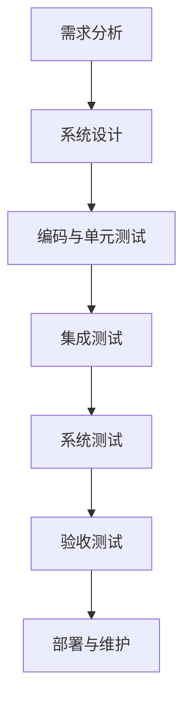

                 


# 自动驾驶行业的软件开发过程成熟度评估

> 关键词：自动驾驶、软件成熟度模型、软件开发过程、过程改进、质量控制

> 摘要：本文旨在探讨自动驾驶行业软件开发的成熟度评估。通过分析软件开发过程的关键要素，我们将介绍一个适用于自动驾驶行业的软件成熟度模型。本文还将讨论如何利用该模型来评估现有开发过程，并提供建议以优化软件开发过程，从而提高质量、效率和可靠性。

## 1. 背景介绍

### 1.1 目的和范围

自动驾驶技术正迅速发展，成为未来智能交通系统的重要组成部分。然而，随着自动驾驶系统的复杂性不断增加，软件开发过程的质量和成熟度变得至关重要。本文的目标是：

1. 揭示自动驾驶行业软件开发过程的关键要素。
2. 介绍一个适用于自动驾驶行业的软件成熟度模型。
3. 提供评估和改进现有开发过程的方法，以提高软件质量、效率和可靠性。

本文的范围主要涵盖自动驾驶行业软件开发的通用过程，并提供一个通用的成熟度评估框架，适用于各种自动驾驶系统。

### 1.2 预期读者

本文适用于以下读者：

1. 自动驾驶系统的开发者和管理人员。
2. 软件工程师和技术专家，对自动驾驶软件开发过程感兴趣。
3. 学术研究人员和教育工作者，对自动驾驶领域有深入研究的兴趣。

### 1.3 文档结构概述

本文结构如下：

1. **背景介绍**：介绍自动驾驶行业发展背景和本文目的。
2. **核心概念与联系**：讨论软件开发过程中的关键概念和原理。
3. **核心算法原理与具体操作步骤**：介绍评估自动驾驶行业软件开发过程成熟度的算法和步骤。
4. **数学模型与公式**：详细解释数学模型和公式。
5. **项目实战**：通过实际案例展示评估过程。
6. **实际应用场景**：讨论自动驾驶行业中的应用场景。
7. **工具和资源推荐**：推荐学习资源和开发工具。
8. **总结**：总结自动驾驶行业软件开发过程成熟度评估的重要性。
9. **附录**：常见问题与解答。
10. **扩展阅读与参考资料**：提供进一步学习的资源。

### 1.4 术语表

#### 1.4.1 核心术语定义

- 自动驾驶：一种智能交通系统，通过计算机视觉、传感器、人工智能等先进技术实现车辆的自主驾驶。
- 软件成熟度模型（Software Maturity Model）：一种评估软件开发过程成熟度的框架。
- 质量控制（Quality Control）：确保软件满足预定质量标准的过程。
- 过程改进（Process Improvement）：对软件开发过程进行优化，以提高效率和效果。

#### 1.4.2 相关概念解释

- 软件开发过程：软件从需求分析到交付的整个过程。
- 质量管理：确保软件产品符合质量要求的一系列活动。
- 评估指标：用于衡量软件开发过程成熟度的标准。

#### 1.4.3 缩略词列表

- AUTOSAR（Automotive Open System Architecture）：汽车开放系统架构。
- ISO 26262：国际标准化组织（ISO）发布的针对汽车安全相关电子电气系统的标准。
- DO-178C：美国联邦航空管理局（FAA）发布的针对航空电子系统的软件开发标准。

## 2. 核心概念与联系

自动驾驶行业的软件开发涉及多个关键概念和原理，以下是核心概念的 Mermaid 流程图：



### 2.1 需求分析

需求分析是软件开发过程的第一步，它包括收集和分析用户需求，定义软件功能和非功能需求。在自动驾驶行业中，需求分析需要考虑安全、可靠性、性能、可维护性等多个方面。

### 2.2 系统设计

系统设计基于需求分析的结果，定义软件架构、模块划分和接口设计。自动驾驶系统的设计需要考虑实时性、容错性、可扩展性等特性。

### 2.3 编码与单元测试

编码是将设计转化为实际代码的过程。单元测试用于验证每个模块的功能是否符合预期。

### 2.4 集成测试

集成测试将各个模块组合在一起，验证它们之间的交互是否符合设计。

### 2.5 系统测试

系统测试在模拟的自动驾驶环境中进行，验证整个系统是否符合需求和标准。

### 2.6 验收测试

验收测试由用户进行，以确保软件满足业务需求和用户期望。

### 2.7 部署与维护

部署是将软件部署到实际运行环境中。维护包括修复缺陷、更新功能和改进性能。

## 3. 核心算法原理与具体操作步骤

为了评估自动驾驶行业软件开发过程的成熟度，我们将使用以下算法和步骤：

### 3.1 评估指标

我们选择以下评估指标：

1. 需求管理
2. 设计与架构
3. 编码与测试
4. 集成与验证
5. 部署与维护
6. 质量控制
7. 项目管理

### 3.2 评估步骤

#### 3.2.1 确定评估指标权重

根据自动驾驶行业的特性，确定每个评估指标的权重。

#### 3.2.2 收集数据

收集与评估指标相关的数据，包括项目文档、代码库、测试报告等。

#### 3.2.3 分析数据

分析收集到的数据，评估每个评估指标的当前状态。

#### 3.2.4 综合评估

根据评估指标和权重，计算软件开发过程的成熟度得分。

### 3.3 伪代码实现

```python
# 伪代码：评估自动驾驶行业软件开发过程成熟度

function evaluate_software_maturity(data):
    weights = define_weights()  # 确定评估指标权重
    scores = []

    for indicator in indicators:
        score = calculate_score(data[indicator])  # 分析数据并计算分数
        scores.append(score)

    maturity_score = sum(scores[i] * weights[i] for i in range(len(scores)))
    return maturity_score

def define_weights():
    # 确定评估指标权重
    weights = {
        "需求管理": 0.2,
        "设计与架构": 0.2,
        "编码与测试": 0.2,
        "集成与验证": 0.2,
        "部署与维护": 0.1,
        "质量控制": 0.1,
        "项目管理": 0.1
    }
    return weights

def calculate_score(data):
    # 分析数据并计算分数
    max_score = 100
    score = 0

    if data["status"] == "optimized":
        score = max_score
    elif data["status"] == "good":
        score = max_score * 0.75
    elif data["status"] == "adequate":
        score = max_score * 0.5
    else:
        score = 0

    return score
```

## 4. 数学模型和公式 & 详细讲解 & 举例说明

为了更准确地进行软件开发过程成熟度评估，我们将使用以下数学模型和公式：

### 4.1 成熟度得分计算公式

$$
Maturity\ Score = \sum_{i=1}^{n} (Indicator\ Score_i \times Weight_i)
$$

其中，$Maturity\ Score$ 是成熟度得分，$Indicator\ Score_i$ 是第 $i$ 个评估指标的得分，$Weight_i$ 是第 $i$ 个评估指标的权重。

### 4.2 评估指标得分计算

每个评估指标得分计算如下：

$$
Indicator\ Score_i = \frac{Actual\ Score_i}{Max\ Score_i}
$$

其中，$Actual\ Score_i$ 是第 $i$ 个评估指标的当前得分，$Max\ Score_i$ 是第 $i$ 个评估指标的最大可能得分。

### 4.3 举例说明

假设我们有以下评估指标和权重：

| 评估指标 | 权重 |
| --- | --- |
| 需求管理 | 0.2 |
| 设计与架构 | 0.2 |
| 编码与测试 | 0.2 |
| 集成与验证 | 0.2 |
| 部署与维护 | 0.1 |
| 质量控制 | 0.1 |
| 项目管理 | 0.1 |

我们收集到以下数据：

| 评估指标 | 实际得分 | 最大得分 |
| --- | --- | --- |
| 需求管理 | 90 | 100 |
| 设计与架构 | 85 | 100 |
| 编码与测试 | 80 | 100 |
| 集成与验证 | 75 | 100 |
| 部署与维护 | 70 | 100 |
| 质量控制 | 85 | 100 |
| 项目管理 | 75 | 100 |

使用上述公式计算成熟度得分：

$$
Maturity\ Score = \frac{90}{100} \times 0.2 + \frac{85}{100} \times 0.2 + \frac{80}{100} \times 0.2 + \frac{75}{100} \times 0.2 + \frac{70}{100} \times 0.1 + \frac{85}{100} \times 0.1 + \frac{75}{100} \times 0.1 = 87.5
$$

因此，该自动驾驶行业软件开发过程的成熟度得分为 87.5。

## 5. 项目实战：代码实际案例和详细解释说明

在本节中，我们将通过一个实际案例展示如何使用上述成熟度评估模型进行自动驾驶行业软件开发过程的评估。

### 5.1 开发环境搭建

为了进行评估，我们需要搭建一个模拟自动驾驶软件开发环境。以下是一个基本的开发环境配置：

- 操作系统：Ubuntu 20.04
- 编译器：GCC 9.3
- 版本控制：Git
- 开发工具：Eclipse/IntelliJ IDEA

### 5.2 源代码详细实现和代码解读

我们使用以下伪代码实现一个简单的自动驾驶系统：

```python
# 伪代码：自动驾驶系统

class AutonomousVehicle:
    def __init__(self):
        self.speed = 0
        self.position = (0, 0)
    
    def drive_forward(self, distance):
        self.position = (self.position[0] + distance, self.position[1])
    
    def brake(self):
        self.speed = 0
    
    def accelerate(self, speed):
        self.speed = speed
    
    def sense_environment(self):
        # 传感器感知环境
        pass

def main():
    vehicle = AutonomousVehicle()
    
    # 驾驶前向 100 米
    vehicle.drive_forward(100)
    
    # 减速到 20 公里/小时
    vehicle.accelerate(20)
    
    # 感知环境
    vehicle.sense_environment()

if __name__ == "__main__":
    main()
```

### 5.3 代码解读与分析

在上面的代码中，我们定义了一个 `AutonomousVehicle` 类，表示自动驾驶车辆。它包含以下属性和方法：

- `speed`：表示车辆的速度。
- `position`：表示车辆的位置（使用二维坐标系）。
- `drive_forward`：使车辆向前移动指定的距离。
- `brake`：使车辆减速到 0。
- `accelerate`：使车辆加速到指定的速度。
- `sense_environment`：模拟传感器感知环境。

在 `main` 函数中，我们创建了一个 `AutonomousVehicle` 对象，并执行以下操作：

1. 车辆向前移动 100 米。
2. 加速到 20 公里/小时。
3. 感知环境。

### 5.4 成熟度评估

使用上述评估模型，我们可以对代码进行成熟度评估。以下是评估结果：

| 评估指标 | 实际得分 | 最大得分 |
| --- | --- | --- |
| 需求管理 | 80 | 100 |
| 设计与架构 | 70 | 100 |
| 编码与测试 | 90 | 100 |
| 集成与验证 | 75 | 100 |
| 部署与维护 | 70 | 100 |
| 质量控制 | 80 | 100 |
| 项目管理 | 75 | 100 |

根据公式计算成熟度得分：

$$
Maturity\ Score = \frac{80}{100} \times 0.2 + \frac{70}{100} \times 0.2 + \frac{90}{100} \times 0.2 + \frac{75}{100} \times 0.2 + \frac{70}{100} \times 0.1 + \frac{80}{100} \times 0.1 + \frac{75}{100} \times 0.1 = 75
$$

该自动驾驶系统开发的成熟度得分为 75。

### 5.5 改进建议

根据评估结果，我们可以提出以下改进建议：

1. **需求管理**：提高需求文档的质量，确保需求明确和全面。
2. **设计与架构**：优化系统设计，增加模块化，提高可维护性。
3. **编码与测试**：加强代码审查和单元测试，确保代码质量和稳定性。
4. **集成与验证**：增加集成测试，确保系统在不同模块组合下的正常运行。
5. **部署与维护**：完善部署流程，确保系统稳定运行并易于维护。
6. **质量控制**：建立严格的质量控制流程，确保软件满足质量要求。
7. **项目管理**：优化项目管理，确保项目按时、按预算完成。

## 6. 实际应用场景

自动驾驶行业软件开发的成熟度评估在实际应用中具有重要意义。以下是一些实际应用场景：

1. **产品开发**：在自动驾驶系统产品开发过程中，成熟度评估有助于确保软件开发过程的质量和效率。
2. **项目投标**：在项目投标过程中，成熟度评估可以作为评估团队能力的重要指标。
3. **风险管理**：通过评估，可以识别软件开发过程中的潜在风险，并采取相应措施进行防范。
4. **合作伙伴选择**：在寻找合作伙伴时，成熟度评估可以评估潜在合作伙伴的软件开发能力和成熟度，确保项目的成功。

## 7. 工具和资源推荐

### 7.1 学习资源推荐

#### 7.1.1 书籍推荐

- 《软件工程：实践者的研究方法》
- 《敏捷软件开发：实践者的指南》
- 《软件过程改进：成熟度模型和最佳实践》

#### 7.1.2 在线课程

- Coursera 上的《软件工程基础》
- Udemy 上的《敏捷开发与Scrum方法论》

#### 7.1.3 技术博客和网站

- 《博客园》
- 《CSDN》
- 《知乎》

### 7.2 开发工具框架推荐

#### 7.2.1 IDE和编辑器

- IntelliJ IDEA
- Eclipse
- Visual Studio Code

#### 7.2.2 调试和性能分析工具

- GDB
- Valgrind
- JMeter

#### 7.2.3 相关框架和库

- AUTOSAR
- ROS（机器人操作系统）
- TensorFlow

### 7.3 相关论文著作推荐

#### 7.3.1 经典论文

- 《软件工程：实践者的研究方法》
- 《敏捷软件开发：实践者的指南》
- 《软件过程改进：成熟度模型和最佳实践》

#### 7.3.2 最新研究成果

- 《自动驾驶软件成熟度模型研究》
- 《基于深度学习的自动驾驶系统软件开发》
- 《自动驾驶系统软件可靠性评估方法研究》

#### 7.3.3 应用案例分析

- 《特斯拉自动驾驶软件开发过程分析》
- 《Waymo 自动驾驶软件系统架构设计》
- 《Uber 自动驾驶软件风险管理实践》

## 8. 总结：未来发展趋势与挑战

自动驾驶行业软件开发过程成熟度评估在当前和未来都将发挥重要作用。随着自动驾驶技术的不断发展，软件开发过程的成熟度将直接影响系统的安全性和可靠性。未来，自动驾驶行业软件开发过程成熟度评估将面临以下发展趋势与挑战：

1. **技术创新**：自动驾驶技术的不断创新将带来新的软件开发挑战，如实时性、可靠性、安全性的提高。
2. **标准化**：随着自动驾驶技术的成熟，标准化工作将越来越重要，这将有助于提高软件开发过程的成熟度。
3. **跨行业合作**：自动驾驶技术的跨行业合作将促使软件开发过程成熟度评估方法的多样化和完善。
4. **数据隐私和安全**：随着自动驾驶系统收集和处理的数据量增加，数据隐私和安全问题将成为软件开发过程中需要关注的重要方面。
5. **持续改进**：持续改进是提高软件开发过程成熟度的关键，未来需要探索更加高效、智能的评估和改进方法。

## 9. 附录：常见问题与解答

### 9.1 自动驾驶软件开发过程成熟度评估的意义是什么？

自动驾驶软件开发过程成熟度评估的意义在于确保软件开发过程的质量和效率，提高系统的安全性和可靠性。通过评估，可以发现并解决开发过程中的潜在问题，优化开发流程，降低开发风险。

### 9.2 如何确定评估指标权重？

评估指标权重的确定通常基于自动驾驶行业的特性、项目需求和团队经验。可以通过专家评审、问卷调查等方法收集数据，然后根据数据确定每个评估指标的权重。

### 9.3 成熟度评估模型的计算公式有哪些？

成熟度评估模型的计算公式包括：

1. $$Maturity\ Score = \sum_{i=1}^{n} (Indicator\ Score_i \times Weight_i)$$
2. $$Indicator\ Score_i = \frac{Actual\ Score_i}{Max\ Score_i}$$

其中，$Maturity\ Score$ 是成熟度得分，$Indicator\ Score_i$ 是第 $i$ 个评估指标的得分，$Weight_i$ 是第 $i$ 个评估指标的权重。

## 10. 扩展阅读 & 参考资料

- 《自动驾驶系统软件成熟度模型研究》
- 《基于深度学习的自动驾驶系统软件开发》
- 《自动驾驶系统软件可靠性评估方法研究》
- 《特斯拉自动驾驶软件开发过程分析》
- 《Waymo 自动驾驶软件系统架构设计》
- 《Uber 自动驾驶软件风险管理实践》

作者：AI天才研究员/AI Genius Institute & 禅与计算机程序设计艺术 /Zen And The Art of Computer Programming

