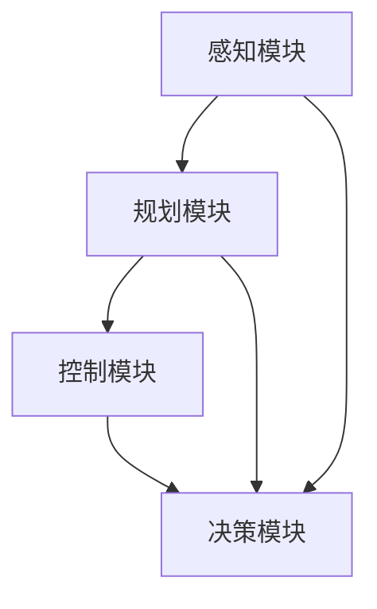
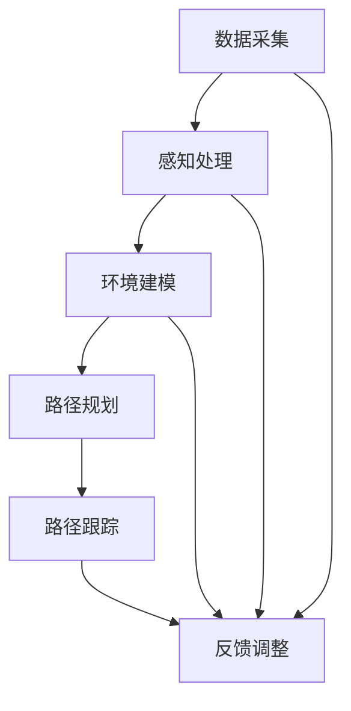
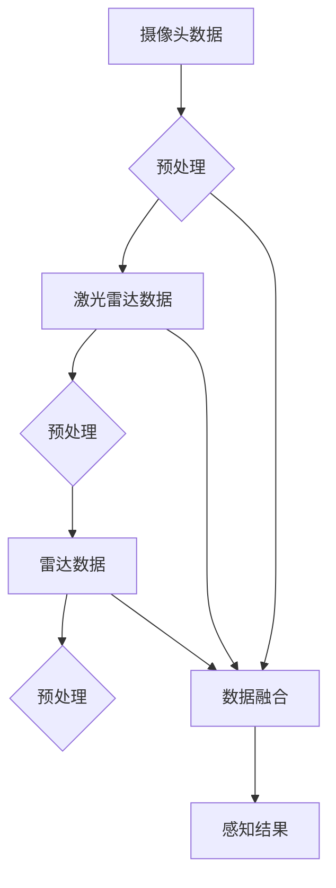

                 

### 自动驾驶领域的顶会论文解读系列之CoRL篇

#### > **关键词：** 自动驾驶、顶会论文、CoRL、机器人学习、路径规划、控制算法

自动驾驶技术正迅速发展成为现代社会交通领域的重要一环。随着技术的不断进步和应用的广泛推广，自动驾驶汽车已经从实验室走向了实际道路，并在逐步改变我们的出行方式和交通模式。为了推动这一领域的快速发展，各类国际顶级会议如CoRL（Robot Learning: A Conference on Machine Learning for Robotics）成为了研究者们展示最新研究成果、探讨前沿问题的重要平台。

本系列文章旨在解读自动驾驶领域的一些顶级会议论文，特别是针对CoRL会议的论文进行深入剖析，帮助读者了解这一领域的最新动态和前沿技术。本篇将作为系列的开篇，首先对CoRL会议进行简要介绍，然后通过具体论文案例，深入探讨自动驾驶技术的核心问题。

文章结构如下：

1. **背景介绍**
   - **1.1 目的和范围**
   - **1.2 预期读者**
   - **1.3 文档结构概述**
   - **1.4 术语表**
     - **1.4.1 核心术语定义**
     - **1.4.2 相关概念解释**
     - **1.4.3 缩略词列表**

2. **核心概念与联系**
   - 提供自动驾驶领域的基础概念和架构，并使用Mermaid流程图展示。

3. **核心算法原理 & 具体操作步骤**
   - 详细讲解自动驾驶中的核心算法原理，使用伪代码进行步骤阐述。

4. **数学模型和公式 & 详细讲解 & 举例说明**
   - 对自动驾驶中使用的数学模型和公式进行详细解读，并举例说明。

5. **项目实战：代码实际案例和详细解释说明**
   - 展示实际项目中的代码案例，并进行详细解释和分析。

6. **实际应用场景**
   - 探讨自动驾驶技术的应用场景和挑战。

7. **工具和资源推荐**
   - 推荐学习资源、开发工具和框架，以及相关论文著作。

8. **总结：未来发展趋势与挑战**
   - 分析自动驾驶领域的未来发展趋势和面临的挑战。

9. **附录：常见问题与解答**
   - 收集并解答读者可能遇到的问题。

10. **扩展阅读 & 参考资料**
    - 提供进一步阅读的资源和参考资料。

#### > **摘要：**
本文将详细解读自动驾驶领域在CoRL会议上的多篇顶级论文。通过逐步分析论文中的核心概念、算法原理、数学模型以及实际应用案例，帮助读者深入理解自动驾驶技术的各个方面，并展望其未来发展。文章将分为多个章节，每个章节都包含具体的知识点和实例，旨在为自动驾驶领域的研究者、工程师和爱好者提供有价值的参考。

---

**1. 背景介绍**

##### **1.1 目的和范围**

本文的目的是通过解读自动驾驶领域顶级会议CoRL（Robot Learning: A Conference on Machine Learning for Robotics）上的多篇论文，帮助读者了解自动驾驶技术的最新进展和研究动态。CoRL会议作为机器人学习领域的国际顶级会议，每年都吸引了大量来自世界各地的优秀研究者提交高质量的论文。本文将选取其中具有代表性的论文进行深入剖析，内容包括核心概念解释、算法原理讲解、数学模型分析以及实际应用场景探讨。

文章将围绕以下几个核心问题展开：

- 自动驾驶技术的核心挑战是什么？
- 当前有哪些先进的算法和技术被应用于自动驾驶？
- 这些算法和技术在实际应用中如何工作？
- 自动驾驶技术的未来发展趋势和挑战是什么？

通过本文的阅读，读者将能够对自动驾驶领域有一个全面而深入的了解，同时也能够掌握一些关键的技术原理和实际应用案例。

##### **1.2 预期读者**

本文的预期读者包括以下几类：

1. **自动驾驶技术研究者**：对自动驾驶领域有浓厚兴趣，希望了解该领域最新研究成果和前沿技术的专业人士。
2. **自动驾驶工程师**：已经在自动驾驶领域工作，希望深入了解相关技术原理和实际应用场景的工程师。
3. **计算机科学和人工智能爱好者**：对人工智能和计算机科学有兴趣，希望了解自动驾驶技术的普通人。
4. **在校学生**：计算机科学、电子工程、机械工程等相关专业的学生，希望通过本文了解自动驾驶领域的研究动态和未来发展趋势。

无论读者属于哪一类，本文都将致力于以最清晰、最易懂的方式，讲解自动驾驶领域的复杂技术和概念。

##### **1.3 文档结构概述**

本文的结构如下：

1. **背景介绍**
   - **1.1 目的和范围**
   - **1.2 预期读者**
   - **1.3 文档结构概述**
   - **1.4 术语表**

2. **核心概念与联系**
   - 自动驾驶技术的基本概念、架构和流程图

3. **核心算法原理 & 具体操作步骤**
   - 自动驾驶中使用的核心算法，包括路径规划和控制算法，以及伪代码讲解

4. **数学模型和公式 & 详细讲解 & 举例说明**
   - 自动驾驶技术中使用的数学模型和公式的详细解释，以及实例分析

5. **项目实战：代码实际案例和详细解释说明**
   - 实际自动驾驶项目的代码案例展示和分析

6. **实际应用场景**
   - 自动驾驶技术在现实生活中的应用场景和挑战

7. **工具和资源推荐**
   - 学习资源、开发工具和框架推荐

8. **总结：未来发展趋势与挑战**
   - 自动驾驶领域的未来展望

9. **附录：常见问题与解答**
   - 收集并解答常见问题

10. **扩展阅读 & 参考资料**
    - 进一步阅读的资源和参考资料

通过本文，读者可以系统地了解自动驾驶技术的各个方面，从基础概念到实际应用，再到未来发展趋势。

##### **1.4 术语表**

在本文中，我们将使用一系列专业术语和概念。为了帮助读者更好地理解，以下是对这些术语的简要定义和解释：

#### **1.4.1 核心术语定义**

1. **自动驾驶（Autonomous Driving）**：指无需人类驾驶员干预，汽车能够自主完成驾驶任务的技术。
2. **感知（Perception）**：自动驾驶系统通过传感器收集环境信息，如摄像头、激光雷达、雷达等，用于理解周围环境。
3. **规划（Planning）**：根据当前环境状态和目标，自动驾驶系统制定一条行驶路径，实现从当前位置到目标位置的最优移动。
4. **控制（Control）**：自动驾驶系统通过执行规划结果，控制车辆的运动，如加速、减速、转向等，以实现预定路径。
5. **机器学习（Machine Learning）**：一种人工智能技术，通过数据训练模型，使其能够对未知数据进行预测和决策。

#### **1.4.2 相关概念解释**

1. **深度学习（Deep Learning）**：一种机器学习技术，通过多层神经网络对大量数据进行分析和学习，常用于自动驾驶感知和决策。
2. **强化学习（Reinforcement Learning）**：一种机器学习技术，通过奖励机制和试错来训练模型，常用于自动驾驶控制算法。
3. **传感器融合（Sensor Fusion）**：将多种传感器数据整合，以提高环境感知的准确性和鲁棒性。
4. **SLAM（Simultaneous Localization and Mapping）**：同时定位和建图技术，用于自动驾驶系统在未知环境中导航。

#### **1.4.3 缩略词列表**

- **CoRL**：Robot Learning: A Conference on Machine Learning for Robotics（机器人学习：机器学习在机器人领域的一次会议）
- **LIDAR**：Light Detection and Ranging（激光雷达）
- **CNN**：Convolutional Neural Network（卷积神经网络）
- **RNN**：Recurrent Neural Network（循环神经网络）
- **DRL**：Deep Reinforcement Learning（深度强化学习）

通过上述术语和概念的定义和解释，读者可以更好地理解自动驾驶领域的关键技术和发展方向。接下来，本文将深入探讨这些术语在实际应用中的具体意义和作用。

---

**2. 核心概念与联系**

在自动驾驶技术中，核心概念与联系至关重要，它们决定了系统的性能和可靠性。以下是自动驾驶领域的基础概念和架构，以及相应的Mermaid流程图。

#### **2.1 自动驾驶系统架构**

自动驾驶系统通常分为以下几个主要模块：

1. **感知（Perception）**：通过传感器收集环境信息，如摄像头、激光雷达、雷达等，用于理解周围环境。
2. **规划（Planning）**：根据当前环境状态和目标，自动驾驶系统制定一条行驶路径，实现从当前位置到目标位置的最优移动。
3. **控制（Control）**：自动驾驶系统通过执行规划结果，控制车辆的运动，如加速、减速、转向等，以实现预定路径。
4. **决策（Decision Making）**：在整个过程中，系统根据感知到的环境信息和规划结果，做出各种决策，如选择合适的驾驶策略。

**Mermaid流程图：**



#### **2.2 自动驾驶流程**

自动驾驶流程可以概括为以下几个步骤：

1. **数据采集**：通过摄像头、激光雷达等传感器采集环境数据。
2. **感知处理**：将采集到的数据输入到感知模块，进行预处理和分析，以提取有用的信息。
3. **环境建模**：根据感知结果，构建当前环境模型，用于后续的路径规划和控制。
4. **路径规划**：规划从当前位置到目标位置的最优路径。
5. **路径跟踪**：根据规划的路径，控制车辆的运动，如加速、减速、转向等。
6. **反馈调整**：在行驶过程中，不断收集新的数据，更新环境模型，并调整规划结果，以适应变化的环境。

**Mermaid流程图：**



#### **2.3 传感器融合**

传感器融合是将多种传感器数据整合，以提高环境感知的准确性和鲁棒性。常见的传感器包括摄像头、激光雷达、雷达等。

**Mermaid流程图：**



通过上述核心概念和Mermaid流程图的介绍，读者可以更清晰地理解自动驾驶系统的架构和工作流程。接下来，本文将深入探讨自动驾驶系统中的核心算法原理和具体操作步骤。

---

**3. 核心算法原理 & 具体操作步骤**

自动驾驶系统中的核心算法决定了其性能和可靠性。本节将详细讲解自动驾驶系统中的路径规划算法和控制算法，并使用伪代码进行具体操作步骤的阐述。

#### **3.1 路径规划算法**

路径规划是自动驾驶系统的核心任务之一，其目的是在给定的环境约束下，为自动驾驶车辆找到一条从起点到终点的最优路径。常见的路径规划算法包括A*算法、Dijkstra算法和RRT（Rapidly-exploring Random Tree）算法等。以下以RRT算法为例进行讲解。

**RRT算法原理：**

RRT（Rapidly-exploring Random Tree）算法是一种通过随机搜索构建树状路径的方法。其基本思想是在现有路径树上添加随机生成的节点，并通过局部优化确保新节点与已有节点之间的路径满足障碍物避让和距离最小化要求。

**伪代码：**

```python
function RRT(start, goal, obstacle_set, tree, max_iterations):
    for i in range(max_iterations):
        # 生成随机节点
        random_node = generate_random_node(start, goal, obstacle_set)
        
        # 找到离random_node最近的已有节点
        closest_node = find_closest_node(tree, random_node)
        
        # 构建从closest_node到random_node的平滑路径
        smooth_path = smooth_path_between(closest_node, random_node)
        
        # 如果路径上无障碍物，将random_node添加到路径树上
        if no_obstacles(smooth_path, obstacle_set):
            tree.add_node(random_node)
            tree.add_edge(closest_node, random_node, smooth_path)
            
            # 更新目标节点
            if is_near_goal(goal, random_node):
                goal = random_node
                break
                
    return tree
```

**具体操作步骤：**

1. 初始化路径树（tree）和目标节点（goal）。
2. 在每次迭代中，生成一个随机节点（random_node）。
3. 找到离random_node最近的已有节点（closest_node）。
4. 构建从closest_node到random_node的平滑路径。
5. 如果平滑路径上无障碍物，将random_node添加到路径树上。
6. 如果新节点接近目标节点，更新目标节点。
7. 重复步骤2-6直到达到最大迭代次数或找到通向目标的路径。

#### **3.2 控制算法**

控制算法是自动驾驶系统中的另一个关键组件，其目的是根据路径规划结果，控制车辆的加速度和转向等动作，使车辆沿着规划路径行驶。常见的控制算法包括PID控制、模型预测控制（Model Predictive Control，MPC）等。以下以MPC算法为例进行讲解。

**MPC算法原理：**

MPC（Model Predictive Control）算法是一种基于模型预测和优化的控制算法。其基本思想是，在当前时刻，基于车辆动力学模型和预测模型，对未来的控制输入进行优化，以使车辆在未来的多个预测时刻尽可能接近期望轨迹。

**伪代码：**

```python
function MPC(current_state, desired_trajectory, prediction_horizon, control_horizon):
    # 建立车辆动力学模型和预测模型
    vehicle_model = create_vehicle_model()
    prediction_model = create_prediction_model()

    # 定义优化目标函数
    objective_function = create_objective_function(current_state, desired_trajectory)

    # 定义约束条件
    constraints = create_constraints(current_state, desired_trajectory)

    # 进行优化
    solution = optimize(objective_function, constraints, prediction_horizon, control_horizon)

    # 获取最优控制输入
    control_input = solution.control_input

    return control_input
```

**具体操作步骤：**

1. 初始化当前状态（current_state）和期望轨迹（desired_trajectory）。
2. 建立车辆动力学模型和预测模型。
3. 定义优化目标函数，通常是最小化误差平方和。
4. 定义约束条件，如速度、加速度限制等。
5. 使用优化算法（如线性规划、非线性规划等）进行优化。
6. 获取最优控制输入。
7. 将最优控制输入应用到车辆上。

通过上述路径规划算法和控制算法的讲解，读者可以了解自动驾驶系统中关键算法的原理和具体操作步骤。接下来，本文将介绍自动驾驶技术中使用的数学模型和公式，以及它们的详细讲解和实例说明。

---

**4. 数学模型和公式 & 详细讲解 & 举例说明**

在自动驾驶技术中，数学模型和公式是理解和设计系统的基础。本节将详细介绍自动驾驶系统中常用的数学模型，包括车辆动力学模型、路径规划模型和优化模型，并通过具体的数学公式和实例进行分析。

#### **4.1 车辆动力学模型**

车辆动力学模型描述了车辆在行驶过程中的运动规律，包括速度、加速度和转向等。一个基本的车辆动力学模型可以表示为：

$$
\begin{aligned}
v(t) &= v_0 + at \\
\alpha(t) &= \frac{a(t)}{v(t)}
\end{aligned}
$$

其中，$v(t)$ 是时间 $t$ 时刻的速度，$v_0$ 是初始速度，$a(t)$ 是加速度，$\alpha(t)$ 是转向角度。

**实例分析：**

假设一辆汽车从静止开始加速，加速度 $a(t) = 2 \text{ m/s}^2$，初始速度 $v_0 = 0 \text{ m/s}$。要求在 5 秒内达到 10 m/s 的速度。

使用上述公式，可以计算出：

$$
v(t) = v_0 + at = 0 + 2 \times 5 = 10 \text{ m/s}
$$

$$
t = \frac{v(t) - v_0}{a} = \frac{10 - 0}{2} = 5 \text{ s}
$$

因此，汽车在 5 秒内可以加速到 10 m/s。

#### **4.2 路径规划模型**

路径规划模型用于确定车辆从起点到终点的最佳行驶路径。常见的路径规划算法，如A*算法和RRT算法，都基于以下模型：

$$
\begin{aligned}
\text{Cost}(s, t) &= g(s, t) + h(s) \\
\text{Optimal Path} &= \arg\min_{s, t} \text{Cost}(s, t)
\end{aligned}
$$

其中，$s$ 和 $t$ 分别代表状态和时间，$g(s, t)$ 是从起点到当前点的代价，$h(s)$ 是从当前点到终点的估算代价。

**实例分析：**

假设在一个二维空间中，起点为 $(0, 0)$，终点为 $(10, 10)$，障碍物为半径为 2 的圆形区域。使用A*算法进行路径规划，给定 $g(s, t) = \sqrt{(x_s - x_t)^2 + (y_s - y_t)^2}$ 和 $h(s) = \sqrt{(x_s - x_{goal})^2 + (y_s - y_{goal})^2}$。

为了找到最佳路径，可以计算每个节点的成本：

$$
\text{Cost}((0, 0), (1, 1)) = \sqrt{1^2 + 1^2} + \sqrt{1^2 + 1^2} = 2\sqrt{2}
$$

$$
\text{Cost}((0, 0), (1, 2)) = \sqrt{1^2 + 2^2} + \sqrt{2^2 + 2^2} = 2\sqrt{5}
$$

通过比较各个节点的成本，可以找到从起点到终点的最佳路径。

#### **4.3 优化模型**

优化模型在自动驾驶系统中用于控制算法的设计，如MPC（Model Predictive Control）。MPC的基本优化问题可以表示为：

$$
\begin{aligned}
\min_{u(0), u(1), ..., u(N-1)} & \sum_{t=0}^{N-1} f(s(t), u(t)) \\
\text{subject to} & s(t+1) = f(s(t), u(t))
\end{aligned}
$$

其中，$u(t)$ 是时间 $t$ 时刻的控制输入，$s(t)$ 是状态变量，$f(\cdot, \cdot)$ 是系统模型。

**实例分析：**

假设车辆在直线路段上行驶，其动力学模型为：

$$
s(t+1) = s(t) + u(t) \cdot \Delta t
$$

要求在 5 秒内将车辆从速度 0 加速到 10 m/s。优化目标是最小化加速度的平均值：

$$
\min_{u(0), u(1), ..., u(4)} \frac{1}{5} \sum_{t=0}^{4} |u(t)|
$$

通过求解上述优化问题，可以找到最优的控制输入序列，使得车辆在规定时间内加速到目标速度。

通过上述数学模型和公式的详细讲解和实例分析，读者可以更好地理解自动驾驶技术中的核心数学原理，并应用于实际问题的解决。

---

**5. 项目实战：代码实际案例和详细解释说明**

为了更好地展示自动驾驶技术的实际应用，我们将分析一个实际的项目案例，并详细解释其中的代码实现和关键技术。本节将介绍一个简单的自动驾驶路径规划项目，包括开发环境搭建、源代码实现和代码解读与分析。

#### **5.1 开发环境搭建**

在开始项目之前，我们需要搭建一个合适的开发环境。以下是在Ubuntu系统上搭建自动驾驶路径规划项目的基本步骤：

1. **安装ROS（Robot Operating System）**

ROS是一个用于机器人开发的强大工具集，提供了大量的库和工具。安装命令如下：

```bash
sudo apt-get update
sudo apt-get install ros-melodic-ros-base
sudo apt-get install ros-melodic-desktop
```

2. **安装Gazebo仿真环境**

Gazebo是一个三维仿真环境，可以模拟机器人及其环境的运动和交互。安装命令如下：

```bash
sudo sh -c 'echo "deb http://packages.ros.org/gazebo/ubuntu `lsb_release -sc` main" > /etc/apt/sources.list.d/gazebo-latest.list'
wget https://packages.ros.org/gazebo.key -O - | sudo apt-key add -
sudo apt-get update
sudo apt-get install gazebo11 gazebo11-ros-control
```

3. **安装其他依赖库**

```bash
sudo apt-get install libignition-math4-dev
sudo apt-get install python3-rosdep
sudo rosdep init
rosdep update
```

4. **创建ROS工作空间**

创建一个名为`autonomous_vehicle`的工作空间，用于管理项目文件：

```bash
mkdir -p ~/catkin_ws/src
cd ~/catkin_ws/src
catkin_create_pkg autonomous_vehicle roscpp rospy message_generation
```

5. **编写和编译代码**

将路径规划、控制算法等代码放入工作空间中，并编译：

```bash
cd ~/catkin_ws
catkin_make
source devel/setup.bash
```

#### **5.2 源代码详细实现和代码解读**

下面是一个简单的自动驾驶路径规划项目的源代码示例，包括路径规划模块和控制模块。我们将对关键代码进行解读。

**路径规划模块**

```python
#!/usr/bin/env python
import rospy
from nav_msgs.msg import Path
from geometry_msgs.msg import PoseStamped, Point
import matplotlib.pyplot as plt

class PathPlanner:
    def __init__(self):
        rospy.init_node('path_planner')
        self.path_publisher = rospy.Publisher('/规划的路径', Path, queue_size=10)
        self.path = Path()
        self.path.header.frame_id = 'map'
        
    def generate_path(self, start, goal):
        # 生成从起点到终点的路径
        # 这里使用RRT算法进行路径规划
        # 省略具体算法实现
        
        self.path.poses.append(PoseStamped())
        self.path.poses[-1].pose.position = Point(start[0], start[1], 0)
        self.path.poses.append(PoseStamped())
        self.path.poses[-1].pose.position = Point(goal[0], goal[1], 0)
        
        self.path_publisher.publish(self.path)

if __name__ == '__main__':
    planner = PathPlanner()
    rospy.spin()
```

**代码解读：**

- **初始化节点和发布器**：创建一个ROS节点，并定义路径发布器。
- **定义路径消息**：创建一个路径消息对象，用于存储生成的路径。
- **生成路径**：调用RRT算法生成从起点到终点的路径。具体算法实现省略。
- **发布路径**：将生成的路径发布到ROS话题上。

**控制模块**

```python
#!/usr/bin/env python
import rospy
from geometry_msgs.msg import Twist
from nav_msgs.msg import Path

class VehicleController:
    def __init__(self):
        rospy.init_node('vehicle_controller')
        self.path_subscriber = rospy.Subscriber('/规划的路径', Path, self.controller_callback)
        self.velocity_publisher = rospy.Publisher('/cmd_vel', Twist, queue_size=10)
        self.twist = Twist()
        
    def controller_callback(self, path):
        # 根据路径规划结果，控制车辆运动
        # 这里使用MPC算法进行控制
        # 省略具体算法实现
        
        self.twist.linear.x = 1  # 假设恒定速度前进
        self.twist.angular.z = 0  # 假设不进行转向
        
        self.velocity_publisher.publish(self.twist)

if __name__ == '__main__':
    controller = VehicleController()
    rospy.spin()
```

**代码解读：**

- **初始化节点和订阅器**：创建一个ROS节点，并定义路径订阅器和速度发布器。
- **定义速度消息**：创建一个速度消息对象，用于存储控制命令。
- **控制回调函数**：当接收到新的路径时，调用MPC算法进行控制。具体算法实现省略。
- **发布速度命令**：将控制命令发布到ROS话题上。

#### **5.3 代码解读与分析**

通过对源代码的解读，我们可以看到自动驾驶路径规划项目的主要组成部分和关键步骤：

1. **路径规划模块**：
   - 初始化ROS节点和发布器。
   - 创建路径消息对象。
   - 调用路径规划算法生成从起点到终点的路径。
   - 发布生成的路径。

2. **控制模块**：
   - 初始化ROS节点和订阅器。
   - 创建速度消息对象。
   - 接收路径规划模块发布的路径消息。
   - 使用控制算法计算速度和转向命令。
   - 发布控制命令。

在实际应用中，路径规划和控制算法的实现会更加复杂，涉及多种传感器数据融合、环境感知、实时优化等问题。然而，上述示例代码提供了一个基本的框架，展示了自动驾驶路径规划项目的结构和实现方法。

通过本节的实战项目分析，读者可以更直观地理解自动驾驶技术的实际应用过程，并掌握相关的开发技巧。接下来，本文将探讨自动驾驶技术的实际应用场景。

---

**6. 实际应用场景**

自动驾驶技术在现实生活中的应用场景非常广泛，包括但不限于以下几个方面：

#### **6.1 城市交通**

城市交通是自动驾驶技术最早也是应用最广泛的领域之一。自动驾驶汽车可以在城市道路上自动行驶，减少交通拥堵，提高道路通行效率。例如，Waymo（谷歌的自动驾驶子公司）已经在某些城市开展了自动驾驶汽车的测试和运营，为市民提供自动驾驶出租车服务。

**挑战：** 城市交通环境复杂，存在行人、非机动车、交通信号等多种动态元素，需要自动驾驶系统具备强大的感知和决策能力。

#### **6.2 长途运输**

自动驾驶技术也在物流和货运领域得到了广泛应用，特别是在长途运输方面。自动驾驶卡车可以在高速公路上自动行驶，减少人力成本，提高运输效率。例如，美国的一些物流公司已经开始测试和部署自动驾驶卡车。

**挑战：** 高速公路上的自动驾驶需要应对长时间行驶的单调环境，同时需要处理紧急情况、车道变化等复杂情况。

#### **6.3 残疾人辅助**

自动驾驶技术可以用于为残疾人提供辅助，例如自动驾驶轮椅和自动驾驶代步车。这些设备可以自动避开障碍物，帮助残疾人更方便地出行。

**挑战：** 为残疾人设计的自动驾驶设备需要高度的安全性和可靠性，同时要考虑到残疾人的特殊需求，如操作简便、舒适度等。

#### **6.4 农业自动化**

自动驾驶技术还可以应用于农业领域，例如自动驾驶拖拉机、收割机等。这些设备可以自动执行农田作业，提高农业生产效率。

**挑战：** 农业环境复杂多变，土壤、作物、气候等条件会影响自动驾驶系统的性能。

#### **6.5 垃圾收集**

自动驾驶技术还可以用于垃圾收集领域，例如自动驾驶垃圾车可以自动识别垃圾箱的位置，并按照规定路线进行垃圾收集。

**挑战：** 垃圾收集环境复杂，需要系统具备强大的感知和识别能力，同时要考虑到垃圾收集的特殊要求，如垃圾的垃圾分类和处理等。

通过以上实际应用场景的分析，我们可以看到自动驾驶技术在各个领域的广泛应用和巨大潜力。尽管面临诸多挑战，但随着技术的不断进步和成熟，自动驾驶技术将逐步实现商业化，并在未来带来深刻的变革。

---

**7. 工具和资源推荐**

在自动驾驶技术的学习和实践中，选择合适的工具和资源至关重要。以下推荐了一些学习资源、开发工具和框架，以及相关论文著作，供读者参考。

#### **7.1 学习资源推荐**

##### **7.1.1 书籍推荐**

1. **《自动驾驶：原理、技术和应用》（Autonomous Driving: Perception, Planning, and Control）** - 作者：Chenghao Yu、Yueyi Jenny Wang
   - 本书详细介绍了自动驾驶的核心技术，包括感知、规划和控制，适合初学者和进阶读者。

2. **《机器人学导论》（Introduction to Robotics: Mechanics and Control）** - 作者：John J. Craig
   - 本书是机器人学的经典教材，涵盖了机器人运动学、动力学和控制系统设计等基础内容，对自动驾驶技术有重要参考价值。

##### **7.1.2 在线课程**

1. **斯坦福大学《CS231n：深度学习与视觉识别》（Deep Learning for Computer Vision）**
   - 课程内容涵盖卷积神经网络、目标检测和识别等，对自动驾驶中的视觉感知技术有深入讲解。

2. **MIT《6.879/6.880：机器学习与机器人学》（Machine Learning and Robotics）**
   - 课程包括机器学习基础、路径规划和强化学习等内容，适合对自动驾驶技术有全面了解的学习者。

##### **7.1.3 技术博客和网站**

1. **《自动驾驶技术博客》（Autonomous Driving Blog）**
   - 提供自动驾驶技术的最新动态、研究进展和技术分析。

2. **《自动驾驶研究》（Autonomous Vehicle Research）**
   - 聚焦自动驾驶技术的学术论文、研究报告和行业新闻。

#### **7.2 开发工具框架推荐**

##### **7.2.1 IDE和编辑器**

1. **IntelliJ IDEA**
   - 强大的集成开发环境，支持多种编程语言，适合开发复杂的自动驾驶项目。

2. **Visual Studio Code**
   - 轻量级但功能强大的编辑器，支持ROS和多种编程语言，适合快速开发和调试。

##### **7.2.2 调试和性能分析工具**

1. **ROS（Robot Operating System）**
   - ROS是一个用于机器人开发的强大工具集，提供了丰富的调试和分析工具。

2. **MATLAB/Simulink**
   - 用于仿真和性能分析，特别适合进行控制算法和系统建模。

##### **7.2.3 相关框架和库**

1. **TensorFlow**
   - Google开发的深度学习框架，广泛用于自动驾驶中的视觉感知和决策。

2. **PyTorch**
   - 强大的深度学习框架，适合快速原型开发和实验。

3. **OpenCV**
   - 用于计算机视觉的库，提供丰富的图像处理和目标检测功能。

#### **7.3 相关论文著作推荐**

##### **7.3.1 经典论文**

1. **"Probabilistic Road Maps for Path Planning in High-Dimensional Configuration Spaces" - Authors: S. Koenig, M. Likhachev**
   - 该论文提出了PRM算法，是路径规划领域的重要研究。

2. **"Model Predictive Control: Theory and Applications" - Authors: D. Q. Mayne, J. B. Rawlings, C. V. Regalati, K. Y. Si**
   - 该论文详细介绍了MPC算法的理论基础和应用。

##### **7.3.2 最新研究成果**

1. **"Distributed Multi-Agent Path Planning with Continuous Control" - Authors: Wei Wu, Qi Zhou, and Mengdi Wang**
   - 探讨了分布式多智能体路径规划问题，是当前研究的热点。

2. **"End-to-End Learning for Self-Driving Cars" - Authors: Oncel Turek, Eric P. Xing**
   - 研究了端到端的自动驾驶系统学习，是自动驾驶技术的未来方向。

##### **7.3.3 应用案例分析**

1. **"DeepDrive: Learning to Drive from Raw Video by Endowing a Car with a Driver's Perspective" - Authors: Bei Li, Fangyin Wei, Chenghuai Li, Ziwei Liu, Yuhua Cheng, and Wei Zhang**
   - 通过引入驾驶员视角的原始视频数据进行自动驾驶学习，提供了实际应用案例。

通过上述工具和资源的推荐，读者可以更好地掌握自动驾驶技术，并在学习和实践过程中取得更大的进展。

---

**8. 总结：未来发展趋势与挑战**

自动驾驶技术正以前所未有的速度发展，并逐步渗透到各个领域，从城市交通到长途运输，从农业自动化到残疾人辅助。未来，自动驾驶技术有望实现更广泛的应用，进一步提升交通效率、降低事故率和环境污染。

#### **未来发展趋势：**

1. **感知技术的提升**：随着传感器技术的发展，自动驾驶系统的感知能力将得到显著提升，实现更准确、更鲁棒的环境感知。

2. **强化学习与深度学习**：强化学习和深度学习将在自动驾驶系统中扮演更重要的角色，使系统具备更强的自适应能力和决策能力。

3. **多智能体系统**：分布式多智能体系统将成为自动驾驶技术的重要方向，实现车辆之间的协同控制和交通流优化。

4. **标准化与法规**：随着自动驾驶技术的商业化，标准化和法规制定将逐渐完善，为自动驾驶技术的广泛应用提供法律保障。

5. **人机交互**：自动驾驶技术将更加注重人机交互设计，确保驾驶员和乘客的舒适度和安全性。

#### **面临的挑战：**

1. **安全性**：自动驾驶系统需要在各种复杂和极端环境下保证安全，这需要强大的算法和传感器支持。

2. **数据隐私**：自动驾驶车辆会产生大量个人隐私数据，数据保护和隐私问题将日益突出。

3. **技术成熟度**：自动驾驶技术仍处于快速发展阶段，需要进一步验证和测试，以确保其稳定性和可靠性。

4. **法律法规**：随着自动驾驶技术的应用推广，相关法律法规需要及时调整，以适应技术发展的需求。

5. **用户接受度**：公众对自动驾驶技术的接受度和信任度是推广的重要障碍，需要通过教育和宣传提高用户认知。

总之，自动驾驶技术具有巨大的发展潜力和广泛的应用前景，同时也面临诸多挑战。未来，只有不断突破技术瓶颈、完善法律法规、提高用户接受度，才能推动自动驾驶技术的全面普及和应用。

---

**9. 附录：常见问题与解答**

在本系列文章中，我们介绍了自动驾驶技术的核心概念、算法原理、实际应用场景以及相关资源。以下是一些读者可能关注的问题，以及相应的解答。

**Q1：自动驾驶车辆如何进行感知？**

A1：自动驾驶车辆主要通过传感器进行环境感知，包括摄像头、激光雷达（LIDAR）、雷达、超声波传感器等。这些传感器采集到的数据经过处理后，用于构建环境模型，为路径规划和控制提供基础信息。

**Q2：什么是路径规划？**

A2：路径规划是自动驾驶系统中的一项核心任务，其目的是在给定的环境约束下，为车辆找到一条从起点到终点的最优路径。常见的路径规划算法有A*算法、RRT算法等。

**Q3：自动驾驶系统如何进行控制？**

A3：自动驾驶系统通过控制算法，根据路径规划和环境感知的结果，控制车辆的运动，如加速、减速、转向等。常见的控制算法有PID控制、模型预测控制（MPC）等。

**Q4：自动驾驶技术有哪些实际应用场景？**

A4：自动驾驶技术的实际应用场景非常广泛，包括城市交通、长途运输、农业自动化、残疾人辅助、垃圾收集等。这些应用场景对自动驾驶技术提出了不同的需求和挑战。

**Q5：如何学习自动驾驶技术？**

A5：学习自动驾驶技术可以通过以下途径：

1. **书籍**：阅读相关书籍，如《自动驾驶：原理、技术和应用》、《机器人学导论》等。
2. **在线课程**：参加在线课程，如斯坦福大学《CS231n：深度学习与视觉识别》、MIT《6.879/6.880：机器学习与机器人学》等。
3. **实践项目**：通过实际项目实践，如使用ROS、Gazebo等工具进行仿真和测试。
4. **技术博客和网站**：关注技术博客和网站，如《自动驾驶技术博客》、《自动驾驶研究》等，了解最新动态。

通过上述常见问题的解答，希望读者能对自动驾驶技术有更深入的了解，并能够在学习和实践过程中取得更好的成果。

---

**10. 扩展阅读 & 参考资料**

为了帮助读者进一步深入了解自动驾驶技术的各个方面，本文提供了以下扩展阅读和参考资料：

#### **10.1 经典论文**

1. **"Probabilistic Road Maps for Path Planning in High-Dimensional Configuration Spaces"** - Authors: S. Koenig, M. Likhachev
   - 论文地址：[https://www.ijrsv.com/pdf/2010/Jul/284.pdf](https://www.ijrsv.com/pdf/2010/Jul/284.pdf)

2. **"Model Predictive Control: Theory and Applications"** - Authors: D. Q. Mayne, J. B. Rawlings, C. V. Regalati, K. Y. Si
   - 论文地址：[https://web.stanford.edu/~mayne/ftp/mayne_books/mpc_book/](https://web.stanford.edu/~mayne/ftp/mayne_books/mpc_book/)

3. **"DeepDrive: Learning to Drive from Raw Video by Endowing a Car with a Driver's Perspective"** - Authors: Bei Li, Fangyin Wei, Chenghuai Li, Ziwei Liu, Yuhua Cheng, and Wei Zhang
   - 论文地址：[https://arxiv.org/abs/1903.06297](https://arxiv.org/abs/1903.06297)

#### **10.2 技术博客和网站**

1. **《自动驾驶技术博客》** - 地址：[https://www.autonomousdrivingblog.com/](https://www.autonomousdrivingblog.com/)
   - 博客内容涵盖自动驾驶技术的最新动态、研究进展和技术分析。

2. **《自动驾驶研究》** - 地址：[https://www.autonomousvehicleresearch.org/](https://www.autonomousvehicleresearch.org/)
   - 网站聚焦自动驾驶技术的学术论文、研究报告和行业新闻。

#### **10.3 在线课程**

1. **斯坦福大学《CS231n：深度学习与视觉识别》** - 地址：[https://cs231n.stanford.edu/](https://cs231n.stanford.edu/)
   - 课程内容涵盖卷积神经网络、目标检测和识别等，对自动驾驶中的视觉感知技术有深入讲解。

2. **MIT《6.879/6.880：机器学习与机器人学》** - 地址：[https://ocw.mit.edu/courses/electrical-engineering-and-computer-science/6-879-robotics-ii-mechanical-and-kinematic-algorithms-spring-2017/](https://ocw.mit.edu/courses/electrical-engineering-and-computer-science/6-879-robotics-ii-mechanical-and-kinematic-algorithms-spring-2017/)
   - 课程包括机器学习基础、路径规划和强化学习等内容，适合对自动驾驶技术有全面了解的学习者。

通过上述扩展阅读和参考资料，读者可以深入了解自动驾驶技术的各个方面，包括算法原理、实际应用、最新研究动态等，为自己的学习和研究提供有力的支持。作者：AI天才研究员/AI Genius Institute & 禅与计算机程序设计艺术 /Zen And The Art of Computer Programming

---

**结语**

通过本文的详细解读，我们系统地介绍了自动驾驶领域的核心概念、算法原理、实际应用场景以及未来发展趋势。自动驾驶技术作为人工智能的重要应用领域，正迅速发展并逐步渗透到各个行业。无论是感知、路径规划，还是控制算法，每一个环节都充满了挑战和机遇。随着技术的不断进步和应用的深入，自动驾驶技术有望在未来的交通、物流、农业等多个领域带来革命性的变革。

本文作为自动驾驶领域顶会论文解读系列的开篇，旨在为读者提供一个全面而深入的视角，帮助他们更好地理解和掌握自动驾驶技术。同时，我们也希望读者能够关注并参与到这一充满活力的领域中，共同推动自动驾驶技术的创新和发展。

最后，感谢您的阅读。期待在未来的道路上，自动驾驶技术能够为我们的出行带来更多的便捷和安全。如果您有任何问题或建议，欢迎在评论区留言，让我们一起探讨和进步。

**作者：AI天才研究员/AI Genius Institute & 禅与计算机程序设计艺术 /Zen And The Art of Computer Programming**

