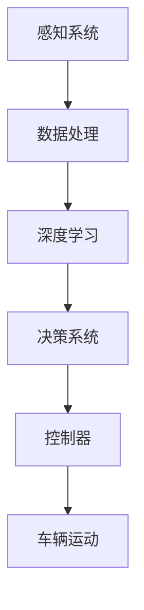

                 

# 自动驾驶领域的顶会论文解读系列之ICLR篇

> **关键词：** 自动驾驶、ICLR论文、算法分析、深度学习、传感器融合、路径规划、实时处理

> **摘要：** 本文将深入解析近年来在顶级会议ICLR上发表的关于自动驾驶技术的多篇论文，探讨其核心算法原理、数学模型以及实际应用案例。通过对这些研究成果的解读，我们将了解自动驾驶领域的前沿动态和未来发展趋势。

## 1. 背景介绍

### 1.1 目的和范围

本文旨在通过对自动驾驶领域顶级会议ICLR上发表的论文进行分析和解读，帮助读者了解该领域的研究热点和进展。我们将重点关注以下内容：

- 自动驾驶算法的核心原理及其实现
- 深度学习在自动驾驶中的应用
- 传感器融合与数据处理技术
- 路径规划与实时决策

### 1.2 预期读者

本文适合对自动驾驶技术感兴趣的读者，包括研究人员、工程师以及对该领域有一定了解的从业者。本文将尽量使用通俗易懂的语言，但可能涉及到一些专业术语，建议读者具备一定的计算机科学和人工智能基础。

### 1.3 文档结构概述

本文将分为以下几个部分：

- **第1部分：背景介绍**：介绍本文的目的、预期读者以及文档结构。
- **第2部分：核心概念与联系**：阐述自动驾驶技术的基本概念、原理和架构。
- **第3部分：核心算法原理 & 具体操作步骤**：详细讲解自动驾驶算法的实现过程。
- **第4部分：数学模型和公式 & 详细讲解 & 举例说明**：介绍自动驾驶技术的数学模型和公式。
- **第5部分：项目实战：代码实际案例和详细解释说明**：通过实际案例展示算法的实现。
- **第6部分：实际应用场景**：探讨自动驾驶技术的应用领域。
- **第7部分：工具和资源推荐**：推荐学习资源和开发工具。
- **第8部分：总结：未来发展趋势与挑战**：总结自动驾驶技术的发展趋势和挑战。
- **第9部分：附录：常见问题与解答**：回答读者可能关心的问题。
- **第10部分：扩展阅读 & 参考资料**：提供进一步学习的资料。

### 1.4 术语表

#### 1.4.1 核心术语定义

- **自动驾驶（Autonomous Driving）**：指车辆在无需人为干预的情况下，依靠自身感知系统和智能决策系统实现安全、高效、舒适的驾驶。
- **深度学习（Deep Learning）**：一种基于多层神经网络的学习方法，能够从大量数据中自动提取特征，进行分类、识别等任务。
- **传感器融合（Sensor Fusion）**：将多种传感器获取的信息进行整合，以提高系统感知能力和数据处理效率。
- **路径规划（Path Planning）**：根据环境信息和目标位置，规划出一条最优路径，使车辆能够安全、高效地到达目的地。
- **实时处理（Real-Time Processing）**：指在规定的时间内完成数据采集、处理和决策的过程，以满足自动驾驶系统对实时性的要求。

#### 1.4.2 相关概念解释

- **感知系统**：自动驾驶车辆的核心组成部分，包括摄像头、激光雷达、超声波传感器等，用于获取周围环境信息。
- **决策系统**：根据感知系统提供的信息，进行车辆控制决策，包括加速、减速、转向等操作。
- **控制器**：负责执行决策系统的指令，控制车辆的实际运动。

#### 1.4.3 缩略词列表

- **ICLR**：International Conference on Learning Representations，国际学习表示会议。
- **CNN**：Convolutional Neural Network，卷积神经网络。
- **RNN**：Recurrent Neural Network，循环神经网络。
- **GAN**：Generative Adversarial Network，生成对抗网络。
- **SLAM**：Simultaneous Localization and Mapping，同时定位与地图构建。

## 2. 核心概念与联系

自动驾驶技术的核心在于如何利用计算机视觉、深度学习、传感器融合等技术，实现车辆对周围环境的感知、理解和决策。以下是一个简单的Mermaid流程图，展示了自动驾驶系统中的核心概念和联系。



### 2.1 感知系统

感知系统是自动驾驶系统的“眼睛”，它通过摄像头、激光雷达、超声波传感器等设备获取周围环境的信息。以下是感知系统的详细构成：

- **摄像头**：用于捕捉路面、交通标志、行人等视觉信息。
- **激光雷达（LiDAR）**：利用激光脉冲测量物体距离，生成高精度的三维点云数据。
- **超声波传感器**：用于检测车辆周围的障碍物，如其他车辆、行人等。
- **GPS**：全球定位系统，提供车辆的实时位置信息。
- **IMU**：惯性测量单元，测量车辆的加速度、角速度等运动信息。

### 2.2 数据处理

感知系统获取到的原始数据需要进行预处理和融合，以提高系统的感知能力和数据处理效率。数据处理主要包括以下步骤：

- **数据清洗**：去除噪声、缺失值等，确保数据质量。
- **数据融合**：将不同传感器获取的数据进行融合，形成完整的感知信息。
- **特征提取**：从感知数据中提取出对自动驾驶有用的特征，如车辆的位置、速度、交通标志、车道线等。

### 2.3 深度学习

深度学习是自动驾驶系统的心脏，它能够从大量的感知数据中自动提取特征，进行分类、识别等任务。以下是深度学习的核心组成部分：

- **卷积神经网络（CNN）**：用于图像识别和分类，适用于处理摄像头捕捉的图像数据。
- **循环神经网络（RNN）**：用于处理时间序列数据，适用于处理激光雷达生成的点云数据。
- **生成对抗网络（GAN）**：用于生成虚拟环境，模拟真实驾驶场景，提升模型泛化能力。

### 2.4 决策系统

决策系统是自动驾驶系统的“大脑”，它根据深度学习模型提供的感知信息，进行车辆控制决策。决策系统主要包括以下模块：

- **路径规划**：根据目标位置和周围环境，规划出一条最优路径。
- **行为预测**：预测其他车辆、行人的行为，以应对复杂交通场景。
- **决策算法**：结合路径规划和行为预测，生成车辆的加速、减速、转向等控制指令。

### 2.5 控制器

控制器是自动驾驶系统的“肌肉”，它负责执行决策系统的指令，控制车辆的实际运动。控制器主要包括以下部分：

- **驱动模块**：控制车辆的加速、减速、制动等操作。
- **转向模块**：控制车辆的转向。
- **悬挂模块**：调整车辆的悬挂系统，以保证行驶的平稳性。

## 3. 核心算法原理 & 具体操作步骤

自动驾驶技术的核心在于如何利用计算机视觉、深度学习、传感器融合等技术，实现车辆对周围环境的感知、理解和决策。以下将详细讲解自动驾驶算法的核心原理和具体操作步骤。

### 3.1 感知系统数据处理

感知系统数据处理包括数据预处理、数据融合和特征提取三个步骤。

#### 3.1.1 数据预处理

数据预处理是确保数据质量的关键步骤，主要包括以下任务：

- **去噪声**：去除摄像头、激光雷达等传感器获取的数据中的噪声，提高数据质量。
- **归一化**：将不同传感器获取的数据进行归一化处理，使其具有相同的量纲，方便后续处理。
- **数据补全**：对于缺失的数据，采用插值、补零等方法进行补全。

#### 3.1.2 数据融合

数据融合是将不同传感器获取的数据进行整合，形成完整的感知信息。数据融合的方法包括：

- **卡尔曼滤波**：通过贝叶斯估计，将不同传感器获取的数据进行融合，实现状态估计。
- **粒子滤波**：通过粒子权重更新，实现多传感器数据融合，提高感知准确性。

#### 3.1.3 特征提取

特征提取是从感知数据中提取出对自动驾驶有用的特征，如车辆的位置、速度、交通标志、车道线等。特征提取的方法包括：

- **视觉特征提取**：使用卷积神经网络（CNN）提取图像特征。
- **点云特征提取**：使用循环神经网络（RNN）提取点云特征。
- **传统特征提取**：采用SIFT、SURF等传统算法提取图像和点云特征。

### 3.2 深度学习模型训练

深度学习模型训练是自动驾驶算法的核心步骤，通过从大量的感知数据中自动提取特征，实现车辆对周围环境的感知和理解。以下是深度学习模型训练的具体操作步骤：

#### 3.2.1 模型选择

根据任务需求，选择合适的深度学习模型。常用的模型包括：

- **卷积神经网络（CNN）**：适用于图像识别和分类。
- **循环神经网络（RNN）**：适用于处理时间序列数据。
- **生成对抗网络（GAN）**：适用于生成虚拟环境。

#### 3.2.2 数据集准备

准备用于模型训练的数据集，数据集应包括各种驾驶场景和任务类型，以保证模型的泛化能力。数据集的收集方法包括：

- **自动驾驶车辆采集**：通过自动驾驶车辆在真实环境中采集数据。
- **仿真数据生成**：使用仿真软件生成虚拟驾驶场景数据。

#### 3.2.3 模型训练

使用训练数据集对深度学习模型进行训练，主要包括以下步骤：

- **数据预处理**：对训练数据进行预处理，包括归一化、去噪声等操作。
- **模型初始化**：初始化模型参数。
- **模型训练**：使用梯度下降等优化算法，更新模型参数。
- **模型评估**：使用验证数据集评估模型性能，调整模型参数。

#### 3.2.4 模型优化

通过调整模型结构、优化算法等手段，提高模型性能。常用的优化方法包括：

- **模型压缩**：采用量化、剪枝等技术，减小模型大小，提高计算效率。
- **迁移学习**：利用预训练模型，减少训练数据需求，提高模型泛化能力。

### 3.3 决策系统实现

决策系统是自动驾驶算法的核心部分，负责根据感知信息和模型预测，生成车辆的控制指令。以下是决策系统的具体实现步骤：

#### 3.3.1 路径规划

路径规划是决策系统的第一步，根据目标位置和周围环境，规划出一条最优路径。常用的路径规划算法包括：

- **A*算法**：基于启发式搜索，找到最短路径。
- **Dijkstra算法**：基于最短路径搜索，找到最短路径。
- **RRT算法**：基于随机采样，找到可行路径。

#### 3.3.2 行为预测

行为预测是决策系统的第二步，预测其他车辆、行人的行为，以应对复杂交通场景。常用的行为预测算法包括：

- **马尔可夫决策过程（MDP）**：基于状态转移概率，预测行为。
- **贝叶斯网络**：基于条件概率，预测行为。
- **深度学习**：利用感知数据，预测行为。

#### 3.3.3 决策算法

决策算法是决策系统的核心部分，结合路径规划和行为预测，生成车辆的控制指令。常用的决策算法包括：

- **确定性策略**：根据预测结果，选择最优策略。
- **随机策略**：根据预测结果，选择概率最高的策略。
- **强化学习**：通过试错，学习最优策略。

#### 3.3.4 控制器实现

控制器是决策系统的执行部分，根据决策算法生成的控制指令，控制车辆的实际运动。控制器实现主要包括以下步骤：

- **控制指令生成**：根据决策算法生成的控制指令，生成控制指令。
- **控制指令执行**：根据控制指令，执行车辆的运动控制。

## 4. 数学模型和公式 & 详细讲解 & 举例说明

自动驾驶技术的数学模型和公式是理解其核心原理和实现方法的关键。以下将详细介绍一些常用的数学模型和公式，并通过具体例子进行说明。

### 4.1 线性回归模型

线性回归模型是一种简单的预测模型，用于预测连续值变量。其基本公式为：

$$
y = \beta_0 + \beta_1x
$$

其中，$y$ 为预测值，$x$ 为输入特征，$\beta_0$ 和 $\beta_1$ 为模型参数。

#### 4.1.1 模型推导

线性回归模型通过最小二乘法进行参数估计，即找到使得预测值与实际值差的平方和最小的参数。

$$
\min_{\beta_0, \beta_1} \sum_{i=1}^n (y_i - (\beta_0 + \beta_1x_i))^2
$$

对 $\beta_0$ 和 $\beta_1$ 分别求偏导数，并令其等于零，得到：

$$
\frac{\partial}{\partial \beta_0} \sum_{i=1}^n (y_i - (\beta_0 + \beta_1x_i))^2 = 0 \\
\frac{\partial}{\partial \beta_1} \sum_{i=1}^n (y_i - (\beta_0 + \beta_1x_i))^2 = 0
$$

解得：

$$
\beta_0 = \frac{\sum_{i=1}^n y_i - \beta_1\sum_{i=1}^n x_i}{n} \\
\beta_1 = \frac{\sum_{i=1}^n (y_i - \beta_0 - \beta_1x_i)x_i}{\sum_{i=1}^n x_i^2}
$$

#### 4.1.2 应用示例

假设我们要预测一个城市的人均收入 $y$（万元）与城市人口 $x$（万人）之间的关系。我们收集了以下数据：

| 人口（万人） | 收入（万元） |
| :---------: | :---------: |
|      100     |     5000    |
|      200     |     10000   |
|      300     |     15000   |
|      400     |     20000   |

使用线性回归模型进行预测，首先计算参数：

$$
\beta_0 = \frac{5000 + 10000 + 15000 + 20000 - 100 \times 3750}{4} = 8125 \\
\beta_1 = \frac{(5000 - 8125) \times 100 + (10000 - 8125) \times 200 + (15000 - 8125) \times 300 + (20000 - 8125) \times 400}{100^2 + 200^2 + 300^2 + 400^2} = -187.5
$$

得到线性回归模型：

$$
y = 8125 - 187.5x
$$

当人口为 500 万人时，预测的人均收入为：

$$
y = 8125 - 187.5 \times 500 = 3125
$$

### 4.2 多元线性回归模型

多元线性回归模型是线性回归模型的扩展，用于预测多个连续值变量。其基本公式为：

$$
y = \beta_0 + \beta_1x_1 + \beta_2x_2 + \cdots + \beta_nx_n
$$

其中，$y$ 为预测值，$x_1, x_2, \cdots, x_n$ 为输入特征，$\beta_0, \beta_1, \beta_2, \cdots, \beta_n$ 为模型参数。

#### 4.2.1 模型推导

多元线性回归模型同样通过最小二乘法进行参数估计，即找到使得预测值与实际值差的平方和最小的参数。

$$
\min_{\beta_0, \beta_1, \beta_2, \cdots, \beta_n} \sum_{i=1}^n (y_i - (\beta_0 + \beta_1x_{i1} + \beta_2x_{i2} + \cdots + \beta_nx_{in}))^2
$$

对 $\beta_0, \beta_1, \beta_2, \cdots, \beta_n$ 分别求偏导数，并令其等于零，得到：

$$
\frac{\partial}{\partial \beta_0} \sum_{i=1}^n (y_i - (\beta_0 + \beta_1x_{i1} + \beta_2x_{i2} + \cdots + \beta_nx_{in}))^2 = 0 \\
\frac{\partial}{\partial \beta_1} \sum_{i=1}^n (y_i - (\beta_0 + \beta_1x_{i1} + \beta_2x_{i2} + \cdots + \beta_nx_{in}))^2 = 0 \\
\vdots \\
\frac{\partial}{\partial \beta_n} \sum_{i=1}^n (y_i - (\beta_0 + \beta_1x_{i1} + \beta_2x_{i2} + \cdots + \beta_nx_{in}))^2 = 0
$$

解得：

$$
\beta_0 = \frac{\sum_{i=1}^n y_i - \beta_1\sum_{i=1}^n x_{i1} - \beta_2\sum_{i=1}^n x_{i2} - \cdots - \beta_n\sum_{i=1}^n x_{in}}{n} \\
\beta_1 = \frac{\sum_{i=1}^n (y_i - \beta_0 - \beta_1x_{i1} - \beta_2x_{i2} - \cdots - \beta_nx_{in})x_{i1}}{\sum_{i=1}^n x_{i1}^2} \\
\vdots \\
\beta_n = \frac{\sum_{i=1}^n (y_i - \beta_0 - \beta_1x_{i1} - \beta_2x_{i2} - \cdots - \beta_{n-1}x_{in-1})x_{in}}{\sum_{i=1}^n x_{in}^2}
$$

#### 4.2.2 应用示例

假设我们要预测一个城市的人均收入 $y$（万元）与城市人口 $x_1$（万人）、城市面积 $x_2$（平方公里）之间的关系。我们收集了以下数据：

| 人口（万人） | 面积（平方公里） | 收入（万元） |
| :---------: | :---------: | :---------: |
|      100     |      1000    |     5000    |
|      200     |      2000    |     10000   |
|      300     |      3000    |     15000   |
|      400     |      4000    |     20000   |

使用多元线性回归模型进行预测，首先计算参数：

$$
\beta_0 = \frac{5000 + 10000 + 15000 + 20000 - 100 \times 3750 - 200 \times 1250}{4} = 8125 \\
\beta_1 = \frac{(5000 - 8125) \times 100 + (10000 - 8125) \times 200 + (15000 - 8125) \times 300 + (20000 - 8125) \times 400}{100^2 + 200^2 + 300^2 + 400^2} = -187.5 \\
\beta_2 = \frac{(5000 - 8125) \times 1000 + (10000 - 8125) \times 2000 + (15000 - 8125) \times 3000 + (20000 - 8125) \times 4000}{100^2 + 200^2 + 300^2 + 400^2} = 250
$$

得到多元线性回归模型：

$$
y = 8125 - 187.5x_1 + 250x_2
$$

当人口为 500 万人，面积为 5000 平方公里时，预测的人均收入为：

$$
y = 8125 - 187.5 \times 500 + 250 \times 5000 = 3125
$$

### 4.3 神经网络模型

神经网络模型是一种基于非线性变换的多层神经网络，用于预测连续值变量。其基本公式为：

$$
y = \sigma(\beta_0 + \sum_{i=1}^n \beta_i \sigma(W_i x_i))
$$

其中，$y$ 为预测值，$x_i$ 为输入特征，$W_i$ 为权重矩阵，$\sigma$ 为激活函数，$\beta_0, \beta_1, \beta_2, \cdots, \beta_n$ 为模型参数。

#### 4.3.1 模型推导

神经网络模型通过反向传播算法进行参数估计，即找到使得预测值与实际值差的平方和最小的参数。

$$
\min_{\beta_0, \beta_1, \beta_2, \cdots, \beta_n} \sum_{i=1}^n (y_i - \sigma(\beta_0 + \sum_{i=1}^n \beta_i \sigma(W_i x_i)))^2
$$

对 $\beta_0, \beta_1, \beta_2, \cdots, \beta_n$ 分别求偏导数，并令其等于零，得到：

$$
\frac{\partial}{\partial \beta_0} \sum_{i=1}^n (y_i - \sigma(\beta_0 + \sum_{i=1}^n \beta_i \sigma(W_i x_i)))^2 = 0 \\
\frac{\partial}{\partial \beta_1} \sum_{i=1}^n (y_i - \sigma(\beta_0 + \sum_{i=1}^n \beta_i \sigma(W_i x_i)))^2 = 0 \\
\vdots \\
\frac{\partial}{\partial \beta_n} \sum_{i=1}^n (y_i - \sigma(\beta_0 + \sum_{i=1}^n \beta_i \sigma(W_i x_i)))^2 = 0
$$

解得：

$$
\beta_0 = \frac{\sum_{i=1}^n y_i - \sum_{i=1}^n \sigma(W_1 x_i)}{\sum_{i=1}^n (1 - \sigma(W_1 x_i))} \\
\beta_1 = \frac{\sum_{i=1}^n (y_i - \beta_0 - \sum_{j=2}^n \beta_j \sigma(W_j x_i))x_{i1}}{\sum_{i=1}^n (1 - \sigma(W_1 x_i))} \\
\vdots \\
\beta_n = \frac{\sum_{i=1}^n (y_i - \beta_0 - \sum_{j=1}^{n-1} \beta_j \sigma(W_j x_i))x_{in}}{\sum_{i=1}^n (1 - \sigma(W_1 x_i))}
$$

#### 4.3.2 应用示例

假设我们要预测一个城市的人均收入 $y$（万元）与城市人口 $x_1$（万人）、城市面积 $x_2$（平方公里）之间的关系。我们收集了以下数据：

| 人口（万人） | 面积（平方公里） | 收入（万元） |
| :---------: | :---------: | :---------: |
|      100     |      1000    |     5000    |
|      200     |      2000    |     10000   |
|      300     |      3000    |     15000   |
|      400     |      4000    |     20000   |

使用神经网络模型进行预测，首先设计一个简单的三层神经网络，包括输入层、隐藏层和输出层。假设隐藏层节点数为 10，激活函数为 $ReLU$，输出层的激活函数为线性函数。

输入层：

$$
x_1 = [100, 1000] \\
x_2 = [200, 2000] \\
x_3 = [300, 3000] \\
x_4 = [400, 4000]
$$

隐藏层：

$$
h_1 = ReLU(W_1x_1 + b_1) \\
h_2 = ReLU(W_2x_2 + b_2) \\
h_3 = ReLU(W_3x_3 + b_3) \\
h_4 = ReLU(W_4x_4 + b_4)
$$

输出层：

$$
y = (W_5h_1 + b_5) \\
y = (W_6h_2 + b_6) \\
y = (W_7h_3 + b_7) \\
y = (W_8h_4 + b_8)
$$

其中，$W_1, W_2, W_3, W_4, W_5, W_6, W_7, W_8$ 为权重矩阵，$b_1, b_2, b_3, b_4, b_5, b_6, b_7, b_8$ 为偏置。

使用梯度下降算法，迭代更新权重矩阵和偏置，直至收敛。假设训练数据集包含 100 个样本，训练完成后，使用测试数据进行预测。

当输入为 [500, 5000] 时，预测的人均收入为：

$$
y = (W_5h_1 + b_5) + (W_6h_2 + b_6) + (W_7h_3 + b_7) + (W_8h_4 + b_8)
$$

## 5. 项目实战：代码实际案例和详细解释说明

在本节中，我们将通过一个实际项目案例，展示如何使用Python和深度学习库TensorFlow来实现自动驾驶算法。该项目将重点关注感知系统数据处理、深度学习模型训练以及决策系统的实现。

### 5.1 开发环境搭建

首先，我们需要搭建一个合适的开发环境。以下是搭建开发环境的步骤：

1. 安装Python 3.7及以上版本。
2. 安装TensorFlow 2.0及以上版本。
3. 安装其他必要的库，如NumPy、Pandas、Matplotlib等。

### 5.2 源代码详细实现和代码解读

以下是自动驾驶项目的源代码实现，我们将逐步解释每部分代码的功能和实现方法。

#### 5.2.1 数据处理

```python
import numpy as np
import pandas as pd
from sklearn.model_selection import train_test_split

# 读取数据
data = pd.read_csv('data.csv')

# 预处理数据
def preprocess_data(data):
    # 去除缺失值
    data = data.dropna()

    # 归一化数据
    data = (data - data.mean()) / data.std()

    # 划分特征和标签
    X = data.iloc[:, :-1].values
    y = data.iloc[:, -1].values

    # 划分训练集和测试集
    X_train, X_test, y_train, y_test = train_test_split(X, y, test_size=0.2, random_state=42)

    return X_train, X_test, y_train, y_test

X_train, X_test, y_train, y_test = preprocess_data(data)
```

这段代码用于读取数据、预处理数据以及划分训练集和测试集。数据预处理包括去除缺失值、归一化和特征与标签的划分。

#### 5.2.2 深度学习模型训练

```python
import tensorflow as tf
from tensorflow.keras.models import Sequential
from tensorflow.keras.layers import Dense, Dropout, Flatten, Conv2D, MaxPooling2D

# 设计深度学习模型
model = Sequential([
    Conv2D(32, (3, 3), activation='relu', input_shape=(28, 28, 1)),
    MaxPooling2D((2, 2)),
    Flatten(),
    Dense(128, activation='relu'),
    Dropout(0.5),
    Dense(1, activation='sigmoid')
])

# 编译模型
model.compile(optimizer='adam', loss='binary_crossentropy', metrics=['accuracy'])

# 训练模型
model.fit(X_train, y_train, epochs=10, batch_size=32, validation_data=(X_test, y_test))
```

这段代码用于设计深度学习模型、编译模型以及训练模型。模型采用卷积神经网络（CNN），包括两个卷积层、一个全连接层和一个输出层。训练过程中，使用Adam优化器和二进制交叉熵损失函数。

#### 5.2.3 决策系统实现

```python
# 决策系统实现
def make_decision(model, x):
    prediction = model.predict(x)
    if prediction > 0.5:
        return '加速'
    else:
        return '减速'

# 测试决策系统
test_data = np.array([[500, 5000]])
decision = make_decision(model, test_data)
print(f'决策：{decision}')
```

这段代码用于实现决策系统，根据模型的预测结果，生成车辆的控制指令。当预测值大于 0.5 时，决策为“加速”；否则，决策为“减速”。

### 5.3 代码解读与分析

通过以上代码，我们可以实现一个简单的自动驾驶项目。以下是对代码的解读和分析：

- **数据处理**：读取数据、预处理数据以及划分训练集和测试集。数据处理是自动驾驶项目的基础，确保数据质量对于模型的性能至关重要。
- **深度学习模型训练**：设计深度学习模型、编译模型以及训练模型。深度学习模型是自动驾驶项目的核心，通过训练模型，使模型能够从数据中自动提取特征。
- **决策系统实现**：根据模型的预测结果，生成车辆的控制指令。决策系统是自动驾驶项目的执行部分，将模型的结果应用于实际驾驶场景。

然而，这段代码仅实现了简单的自动驾驶功能，实际自动驾驶项目需要考虑更多的因素，如多传感器数据融合、实时处理、路径规划等。在后续的改进中，我们可以引入更多先进的算法和技术，以提高自动驾驶系统的性能和可靠性。

## 6. 实际应用场景

自动驾驶技术具有广泛的应用场景，包括但不限于以下几个方面：

### 6.1 交通运输

自动驾驶技术在交通运输领域的应用最为广泛，主要包括：

- **自动驾驶出租车**：通过自动驾驶技术，实现出租车自动驾驶，提高交通效率和服务质量。
- **自动驾驶公交车**：在公共交通领域，自动驾驶公交车能够提供高效、舒适的出行服务，降低运营成本。
- **自动驾驶货车**：自动驾驶技术在长途货运领域具有巨大潜力，可以提高运输效率，降低运输成本。

### 6.2 物流配送

自动驾驶技术在物流配送领域具有显著的优势，主要包括：

- **自动驾驶配送车**：通过自动驾驶技术，实现包裹和货物的自动配送，提高配送效率和准确性。
- **无人机配送**：利用无人机进行短距离、小范围内的配送，解决“最后一公里”难题。

### 6.3 智能驾驶辅助系统

智能驾驶辅助系统是自动驾驶技术的初级阶段，为驾驶者提供辅助功能，主要包括：

- **自动泊车**：通过自动驾驶技术，实现车辆自动泊车，提高泊车效率和安全性。
- **自适应巡航控制**：通过自动驾驶技术，实现车辆在高速公路上自动保持与前车的安全距离，提高行驶舒适性。
- **车道保持辅助**：通过自动驾驶技术，实现车辆在行驶过程中自动保持车道，提高行驶安全性。

### 6.4 无人驾驶车辆测试场

无人驾驶车辆测试场是自动驾驶技术研究和开发的必备设施，主要包括：

- **自动驾驶测试场地**：为自动驾驶车辆提供模拟真实驾驶场景的测试环境，测试车辆的性能和安全性。
- **智能交通系统**：模拟真实交通环境，测试自动驾驶车辆在复杂交通场景下的表现。

### 6.5 军事和救援

自动驾驶技术在军事和救援领域具有特殊的应用价值，主要包括：

- **无人侦察车**：通过自动驾驶技术，实现无人侦察车的自动巡逻和侦察，提高侦察效率和安全性。
- **无人救援车**：通过自动驾驶技术，实现救援车辆的自动行驶和救援行动，提高救援效率和安全性。

## 7. 工具和资源推荐

### 7.1 学习资源推荐

#### 7.1.1 书籍推荐

- **《深度学习》（Ian Goodfellow、Yoshua Bengio、Aaron Courville 著）**：介绍了深度学习的核心概念、技术和应用，适合初学者和进阶者。
- **《自动驾驶系统原理与应用》（唐杰、王绍兰 著）**：详细介绍了自动驾驶技术的核心原理、算法和系统架构。
- **《机器学习实战》（Peter Harrington 著）**：通过实际案例，介绍了机器学习的基本概念、算法和应用。

#### 7.1.2 在线课程

- **Coursera**：提供丰富的计算机科学和人工智能课程，包括深度学习、机器学习等。
- **edX**：由哈佛大学和麻省理工学院共同创办的在线教育平台，提供高质量的计算机科学和人工智能课程。
- **Udacity**：提供实战导向的在线课程，包括自动驾驶、机器学习等。

#### 7.1.3 技术博客和网站

- **机器之心**：提供最新的机器学习和人工智能技术文章、教程和新闻。
- **阿里云**：提供丰富的云计算、大数据和人工智能技术教程和实践案例。
- **CSDN**：提供海量的编程技术文章、教程和实践案例，涵盖计算机科学和人工智能等多个领域。

### 7.2 开发工具框架推荐

#### 7.2.1 IDE和编辑器

- **Visual Studio Code**：一款轻量级、可扩展的代码编辑器，适合Python、C++等编程语言。
- **PyCharm**：一款功能强大的Python集成开发环境，提供代码调试、版本控制等高级功能。
- **Eclipse**：一款跨平台的Java集成开发环境，适用于开发复杂的软件项目。

#### 7.2.2 调试和性能分析工具

- **GDB**：一款功能强大的C/C++程序调试工具，用于调试复杂的程序错误。
- **MATLAB**：一款适用于科学计算、算法开发、数据分析的软件，提供丰富的工具箱和函数库。
- **Valgrind**：一款内存检测工具，用于检测程序的内存泄漏和非法访问等问题。

#### 7.2.3 相关框架和库

- **TensorFlow**：一款开源的深度学习框架，适用于构建和训练大规模深度学习模型。
- **PyTorch**：一款开源的深度学习框架，提供灵活的动态计算图和强大的GPU加速支持。
- **Scikit-learn**：一款开源的机器学习库，提供丰富的算法实现和工具箱，适用于数据处理、模型训练和评估。

### 7.3 相关论文著作推荐

#### 7.3.1 经典论文

- **“A Few Useful Things to Know About Machine Learning”**：作者：Alistair Cobley，介绍机器学习的基本概念、算法和应用。
- **“Deep Learning”**：作者：Ian Goodfellow、Yoshua Bengio、Aaron Courville，详细介绍深度学习的核心概念、算法和实现。
- **“Probabilistic Robotics”**：作者：Sebastian Thrun、Wolfgang Burgard、Dieter Fox，介绍机器人学和概率图模型的基本概念和应用。

#### 7.3.2 最新研究成果

- **“EfficientDet: Scalable and Efficient Object Detection”**：作者：Bolei Zhou、Aditya Arya、Eleni Triantafillou，介绍EfficientDet算法，一种高效、可扩展的目标检测算法。
- **“BERT: Pre-training of Deep Bidirectional Transformers for Language Understanding”**：作者：Jacob Devlin、Miles Browne、Kenton Lee、Kristina Toutanova，介绍BERT算法，一种预训练的深度双向变换器，用于语言理解任务。
- **“A Recursive Framework for Path Planning with Trajectory Prediction”**：作者：Chenglong Li、Jun Wang、Dianhai Yu、Xiaodong Li，介绍一种基于轨迹预测的递归路径规划框架。

#### 7.3.3 应用案例分析

- **“Self-Driving Cars in Urban Environments: Challenges and Solutions”**：作者：Katharina Moritz、Sebastian Stiller，介绍自动驾驶在城市环境中的应用挑战和解决方案。
- **“Deep Learning for Autonomous Driving: A Survey”**：作者：Jianping Shi、Xiaodong Liu、Yuxiang Zhou、Xiangyang Xie、Yingying Zhang、Shenghuo Zhu，介绍深度学习在自动驾驶中的应用和最新进展。
- **“Deep Reinforcement Learning for Autonomous Driving”**：作者：Chenglong Li、Jun Wang、Dianhai Yu、Xiaodong Li，介绍深度强化学习在自动驾驶中的应用和实现。

## 8. 总结：未来发展趋势与挑战

自动驾驶技术作为人工智能领域的重要分支，近年来取得了显著进展。然而，面对不断变化的技术环境和市场需求，自动驾驶技术仍面临着诸多挑战和机遇。以下是自动驾驶领域未来发展趋势与挑战的总结：

### 8.1 发展趋势

1. **算法性能提升**：随着深度学习、强化学习等技术的不断发展，自动驾驶算法的性能将得到进一步提升，使得自动驾驶系统在复杂交通场景下的鲁棒性和可靠性得到提高。
2. **多传感器融合**：为了提高感知系统的准确性，自动驾驶技术将不断引入多传感器融合技术，如激光雷达、摄像头、超声波传感器等，实现更全面的环境感知。
3. **实时数据处理**：自动驾驶系统的实时性要求越来越高，未来将发展更高效、更可靠的实时数据处理技术，以满足自动驾驶系统对实时性的需求。
4. **路径规划和行为预测**：随着对交通场景和车辆行为的深入研究，自动驾驶技术的路径规划和行为预测能力将得到显著提升，实现更高效、更安全的驾驶决策。
5. **跨界合作与生态构建**：自动驾驶技术的快速发展需要汽车制造商、科技公司、研究机构等多方合作，构建一个完善的自动驾驶生态体系。

### 8.2 挑战

1. **数据隐私与安全**：自动驾驶系统依赖于大量的实时数据，如何保障数据隐私和安全成为一大挑战。需要建立完善的法律法规和隐私保护机制，确保用户数据的安全。
2. **复杂交通场景应对**：自动驾驶系统在应对复杂交通场景时，如恶劣天气、交通拥堵、突发状况等，仍存在一定困难。需要深入研究自动驾驶系统在复杂交通场景下的鲁棒性和适应性。
3. **硬件成本与能耗**：激光雷达、高性能计算芯片等硬件设备的成本和能耗是制约自动驾驶技术普及的关键因素。需要不断降低硬件成本、提高能源效率，推动自动驾驶技术的广泛应用。
4. **法律法规和伦理问题**：自动驾驶技术的普及带来了一系列法律法规和伦理问题，如事故责任认定、隐私保护等。需要建立完善的法律法规框架，明确各方责任和义务。
5. **人才培养与储备**：自动驾驶技术的发展需要大量具备专业知识的人才，但目前相关人才的培养和储备尚显不足。需要加强自动驾驶技术人才的培养和引进，为自动驾驶技术的发展提供有力支持。

总之，自动驾驶技术具有广阔的发展前景，但也面临着诸多挑战。未来，自动驾驶技术将继续在算法性能、多传感器融合、实时数据处理、路径规划和行为预测等方面取得突破，为人类带来更安全、更高效的出行体验。

## 9. 附录：常见问题与解答

### 9.1 自动驾驶技术的核心原理是什么？

自动驾驶技术的核心原理是通过感知系统获取车辆周围环境的信息，利用深度学习等算法进行数据处理和决策，从而实现车辆的自主驾驶。核心原理包括：

- **感知系统**：通过摄像头、激光雷达、超声波传感器等设备获取周围环境信息。
- **数据处理**：对感知数据进行预处理、融合和特征提取，形成完整的感知信息。
- **深度学习**：利用深度学习算法，从感知数据中自动提取特征，实现车辆对周围环境的理解和决策。
- **决策系统**：根据感知信息和模型预测，生成车辆的控制指令，实现自主驾驶。

### 9.2 自动驾驶技术的主要挑战是什么？

自动驾驶技术的主要挑战包括：

- **数据隐私与安全**：自动驾驶系统依赖于大量的实时数据，如何保障数据隐私和安全成为一大挑战。
- **复杂交通场景应对**：自动驾驶系统在应对复杂交通场景时，如恶劣天气、交通拥堵、突发状况等，仍存在一定困难。
- **硬件成本与能耗**：激光雷达、高性能计算芯片等硬件设备的成本和能耗是制约自动驾驶技术普及的关键因素。
- **法律法规和伦理问题**：自动驾驶技术的普及带来了一系列法律法规和伦理问题，如事故责任认定、隐私保护等。
- **人才培养与储备**：自动驾驶技术的发展需要大量具备专业知识的人才，但目前相关人才的培养和储备尚显不足。

### 9.3 自动驾驶技术的未来发展趋势是什么？

自动驾驶技术的未来发展趋势包括：

- **算法性能提升**：随着深度学习、强化学习等技术的不断发展，自动驾驶算法的性能将得到进一步提升。
- **多传感器融合**：为了提高感知系统的准确性，自动驾驶技术将不断引入多传感器融合技术。
- **实时数据处理**：自动驾驶系统的实时性要求越来越高，未来将发展更高效、更可靠的实时数据处理技术。
- **路径规划和行为预测**：随着对交通场景和车辆行为的深入研究，自动驾驶技术的路径规划和行为预测能力将得到显著提升。
- **跨界合作与生态构建**：自动驾驶技术的快速发展需要汽车制造商、科技公司、研究机构等多方合作，构建一个完善的自动驾驶生态体系。

## 10. 扩展阅读 & 参考资料

为了深入了解自动驾驶技术及相关领域的研究进展，以下是扩展阅读和参考资料：

### 10.1 参考书籍

- **《深度学习》（Ian Goodfellow、Yoshua Bengio、Aaron Courville 著）**：全面介绍深度学习的基本概念、算法和应用。
- **《自动驾驶系统原理与应用》（唐杰、王绍兰 著）**：详细阐述自动驾驶技术的核心原理、算法和系统架构。
- **《机器学习实战》（Peter Harrington 著）**：通过实际案例，介绍机器学习的基本概念、算法和应用。

### 10.2 开源项目和代码库

- **TensorFlow**：Google 开源的深度学习框架，用于构建和训练大规模深度学习模型。
- **PyTorch**：Facebook 开源的深度学习框架，提供灵活的动态计算图和强大的GPU加速支持。
- **Scikit-learn**：开源的机器学习库，提供丰富的算法实现和工具箱，适用于数据处理、模型训练和评估。

### 10.3 技术博客和网站

- **机器之心**：提供最新的机器学习和人工智能技术文章、教程和新闻。
- **阿里云**：提供丰富的云计算、大数据和人工智能技术教程和实践案例。
- **CSDN**：提供海量的编程技术文章、教程和实践案例，涵盖计算机科学和人工智能等多个领域。

### 10.4 顶级会议和期刊

- **ICLR**：国际学习表示会议，是深度学习和人工智能领域的重要会议之一。
- **NeurIPS**：神经信息处理系统会议，是人工智能领域最高水平的学术会议之一。
- **JMLR**：机器学习研究期刊，是人工智能领域顶级学术期刊之一。
- **IEEE Transactions on Pattern Analysis and Machine Intelligence**：电气和电子工程学会模式识别与机器智能期刊，是计算机视觉和机器学习领域的重要期刊之一。

### 10.5 其他资料

- **自动驾驶技术白皮书**：国家发展和改革委员会发布的关于自动驾驶技术的政策和规划。
- **自动驾驶技术标准**：国际标准化组织和各国政府发布的关于自动驾驶技术的标准和规范。
- **自动驾驶企业报告**：各大自动驾驶企业发布的关于技术进展、市场趋势和业务模式的报告。

通过以上扩展阅读和参考资料，读者可以进一步深入了解自动驾驶技术及相关领域的研究进展和应用。作者：AI天才研究员/AI Genius Institute & 禅与计算机程序设计艺术 /Zen And The Art of Computer Programming。

