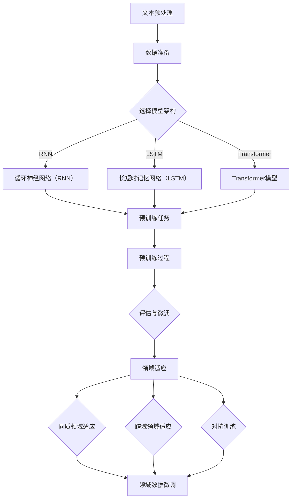

                 


## 文章标题

### 自然语言处理中的语言模型预训练与领域适应技术进展与挑战

---

**关键词：自然语言处理，语言模型预训练，领域适应，技术进展，挑战**

**摘要：**
本文将深入探讨自然语言处理（NLP）领域中的两大核心技术——语言模型预训练与领域适应。首先，我们将回顾预训练的基本概念，分析其在NLP中的重要作用及其发展历程。接着，我们将探讨领域适应技术的原理和实现，结合具体案例分析其应用效果和面临的挑战。本文旨在为读者提供一个全面、系统的技术分析，帮助理解当前NLP技术的发展趋势和未来可能的方向。

---

### 1. 背景介绍

#### 1.1 目的和范围

本文旨在探讨自然语言处理（NLP）领域中两个核心技术的进展与挑战：语言模型预训练与领域适应技术。随着深度学习在NLP领域的广泛应用，语言模型预训练成为实现高精度文本理解和生成的重要方法。同时，为了使语言模型在特定领域或任务上具有更好的表现，领域适应技术显得尤为重要。本文将首先介绍这两个技术的背景，随后分析其原理、实现方法、应用场景以及面临的挑战。

#### 1.2 预期读者

本文适合对自然语言处理有一定基础的读者，尤其是希望深入了解语言模型预训练和领域适应技术的开发者、研究人员和学者。通过本文的阅读，读者可以全面了解当前NLP技术的发展趋势和关键技术，为未来的研究和应用提供参考。

#### 1.3 文档结构概述

本文将分为八个主要部分：

1. **背景介绍**：介绍文章的目的、范围、预期读者以及文档结构。
2. **核心概念与联系**：阐述自然语言处理、语言模型预训练和领域适应技术的核心概念及其联系。
3. **核心算法原理与具体操作步骤**：详细讲解语言模型预训练和领域适应技术的算法原理和实现步骤。
4. **数学模型和公式**：介绍与语言模型预训练和领域适应相关的数学模型和公式，并进行详细解释和举例说明。
5. **项目实战**：通过代码实际案例展示语言模型预训练和领域适应技术的应用。
6. **实际应用场景**：探讨语言模型预训练和领域适应技术在各种实际应用场景中的效果和挑战。
7. **工具和资源推荐**：推荐学习资源、开发工具和框架，以及相关论文著作。
8. **总结**：总结文章的主要观点，探讨未来发展趋势和挑战。

#### 1.4 术语表

##### 1.4.1 核心术语定义

- **自然语言处理（NLP）**：指利用计算机技术和算法处理和理解人类自然语言的技术。
- **语言模型预训练**：指在大量未标注的文本数据上，利用深度学习算法对语言模型进行训练，以提高其在各种NLP任务上的性能。
- **领域适应**：指将预训练的语言模型迁移到特定领域或任务上，以适应不同的应用场景。

##### 1.4.2 相关概念解释

- **深度学习**：一种机器学习方法，通过多层神经网络对数据进行建模和预测。
- **标注数据**：指对文本数据中的特定元素（如单词、句子、实体等）进行人工标注，以便进行后续的模型训练和评估。

##### 1.4.3 缩略词列表

- **NLP**：自然语言处理
- **预训练**：Pre-training
- **领域适应**：Domain Adaptation
- **深度学习**：Deep Learning
- **神经网络**：Neural Network

---

### 2. 核心概念与联系

在自然语言处理（NLP）领域中，语言模型预训练和领域适应是两个核心概念，它们相辅相成，共同推动了NLP技术的发展。本节将首先介绍NLP的基本概念，然后详细阐述语言模型预训练和领域适应技术的原理和联系。

#### 2.1 自然语言处理（NLP）

自然语言处理（NLP）是人工智能（AI）的一个分支，旨在使计算机能够理解、解释和生成人类自然语言。NLP的任务包括但不限于文本分类、情感分析、机器翻译、问答系统、文本摘要、命名实体识别等。

NLP的基本流程通常包括以下几个步骤：

1. **文本预处理**：包括分词、词性标注、去除停用词等，以将原始文本转换为计算机可以处理的形式。
2. **特征提取**：从预处理后的文本中提取特征，如词袋模型、TF-IDF、词嵌入等。
3. **模型训练**：使用提取的特征训练机器学习模型，如朴素贝叶斯、支持向量机、循环神经网络（RNN）等。
4. **模型评估**：在测试集上评估模型的性能，包括准确率、召回率、F1值等指标。
5. **模型应用**：将训练好的模型应用于实际问题，如文本分类、情感分析等。

#### 2.2 语言模型预训练

语言模型预训练（Language Model Pre-training）是近年来NLP领域的一项重要突破。其核心思想是在大量未标注的文本数据上，利用深度学习算法对语言模型进行预训练，从而提高其在各种NLP任务上的性能。

预训练的过程通常分为两个阶段：

1. **无监督预训练**：在大量未标注的文本数据上，利用深度神经网络（如Transformer）对语言模型进行预训练，学习文本的内在结构和语义信息。
2. **有监督微调**：在特定的NLP任务上，利用标注数据对预训练的语言模型进行微调，以适应特定的任务需求。

语言模型预训练的核心优点包括：

- **通用性**：通过在大量未标注的文本数据上预训练，语言模型可以学习到通用语言知识，从而在不同任务上具有较好的迁移能力。
- **高性能**：预训练的语言模型通常在NLP任务上具有很高的性能，可以显著提升模型的效果。
- **灵活性**：预训练的语言模型可以很容易地适应不同的NLP任务，只需进行微调即可。

#### 2.3 领域适应

领域适应（Domain Adaptation）是指将预训练的语言模型迁移到特定领域或任务上，以提高其在特定应用场景中的性能。领域适应技术可以解决以下问题：

- **数据不均衡**：在许多实际应用中，特定领域的标注数据往往较少，而预训练语言模型是在大量通用文本数据上训练得到的，因此在特定领域上可能存在性能不足的问题。
- **数据分布差异**：不同领域或任务的数据分布可能存在较大差异，预训练的语言模型可能不适应这种差异，导致性能下降。
- **领域特定知识**：某些领域或任务具有特定的知识或术语，预训练的语言模型可能无法很好地处理这些领域特定的信息。

领域适应技术通常包括以下几种方法：

1. **同质领域适应**：在相同领域或任务上，利用预训练的语言模型进行微调，以适应特定的领域或任务。
2. **跨域领域适应**：在相关领域或任务上，利用预训练的语言模型进行迁移学习，以提高特定领域或任务的性能。
3. **对抗训练**：通过对抗训练的方法，使预训练的语言模型能够更好地适应不同的数据分布和领域差异。

#### 2.4 核心概念与联系

自然语言处理（NLP）、语言模型预训练和领域适应技术之间存在着紧密的联系：

- **NLP** 是语言模型预训练和领域适应的应用背景，其基本任务和流程为这两个技术提供了实际应用场景。
- **语言模型预训练** 为NLP任务提供了强大的基础模型，通过在大量未标注的文本数据上预训练，语言模型可以学习到通用语言知识和结构，从而在不同任务上具有较好的性能。
- **领域适应** 是针对预训练语言模型在特定领域或任务上性能不足的问题，通过迁移学习和对抗训练等方法，使预训练的语言模型能够更好地适应不同的领域或任务。

综上所述，NLP、语言模型预训练和领域适应技术相互促进，共同推动了NLP技术的发展和应用。在接下来的章节中，我们将进一步深入探讨这些技术的原理、实现方法和应用场景。

### 2.1 自然语言处理（NLP）的基本概念

自然语言处理（NLP）作为人工智能（AI）的一个分支，致力于使计算机能够理解和生成人类自然语言。NLP涵盖了从文本预处理、特征提取到模型训练和评估的整个过程，旨在实现人类语言与机器之间的有效沟通。以下是NLP的基本概念及其相互关系。

#### 2.1.1 文本预处理

文本预处理是NLP任务中的第一步，其目标是清理和转换原始文本，使其适合后续的处理和分析。文本预处理通常包括以下步骤：

1. **分词**：将连续的文本分割成单个单词或词汇单元。这一过程在许多NLP任务中至关重要，因为它为特征提取提供了基础。
2. **词性标注**：为每个单词分配一个词性，如名词、动词、形容词等。词性标注有助于理解单词在句子中的语法功能。
3. **去除停用词**：去除对文本分析无意义的单词，如“的”、“和”、“在”等。这些单词虽然不会对句子的整体含义产生显著影响，但会占据大量的计算资源。
4. **词嵌入**：将单词映射到高维向量空间，以表示单词的语义信息。词嵌入技术如Word2Vec和GloVe广泛应用于NLP任务。

#### 2.1.2 特征提取

特征提取是将预处理后的文本转换为计算机可以处理的数字形式的过程。NLP中的特征提取方法多样，包括：

1. **词袋模型**：将文本表示为一个向量，其中每个维度对应一个单词的出现频率。词袋模型简单有效，但忽略了单词的顺序和语义关系。
2. **TF-IDF**：结合词频（TF）和逆文档频率（IDF），计算每个单词在文档中的重要性。这种方法相较于词袋模型更能捕捉到单词的语义信息。
3. **词嵌入**：将单词映射到高维向量空间，以表示单词的语义信息。词嵌入技术在NLP中具有重要意义，因为它能够捕捉到单词之间的语义关系。

#### 2.1.3 模型训练

模型训练是NLP任务中的核心步骤，其目标是利用已标注的数据训练出一个能够对文本进行预测或分类的模型。常见的NLP模型包括：

1. **朴素贝叶斯分类器**：基于贝叶斯定理，通过特征的概率分布来预测文本的类别。朴素贝叶斯分类器简单且效果良好，适用于文本分类任务。
2. **支持向量机（SVM）**：通过最大化特征空间中的分类边界，将文本划分为不同的类别。SVM在文本分类和文本聚类任务中具有广泛的应用。
3. **循环神经网络（RNN）**：通过递归的方式处理序列数据，能够捕捉到文本中的长距离依赖关系。RNN在语言模型和序列标注任务中表现出色。
4. **长短时记忆网络（LSTM）**：是RNN的一种改进，能够更好地捕捉长距离依赖关系，适用于复杂的文本序列任务。
5. **Transformer模型**：由谷歌提出的一种基于自注意力机制的序列模型，其在BERT和GPT等预训练模型中广泛应用，取得了显著的NLP性能提升。

#### 2.1.4 模型评估

模型评估是NLP任务中的关键步骤，其目标是评估模型的性能，并选择最优的模型。常见的评估指标包括：

1. **准确率（Accuracy）**：正确分类的样本数占总样本数的比例。准确率简单直观，但在类别不平衡的情况下可能不准确。
2. **召回率（Recall）**：正确分类的样本数占总正样本数的比例。召回率强调了识别正样本的能力，但在误分类的情况下可能较高。
3. **精确率（Precision）**：正确分类的样本数占分类为正样本的样本总数的比例。精确率强调了分类的准确性，但在召回率方面可能较低。
4. **F1值（F1 Score）**：精确率和召回率的调和平均值，能够平衡这两个指标。F1值在分类任务中具有重要意义。

#### 2.1.5 模型应用

模型应用是将训练好的模型应用于实际问题，如文本分类、情感分析、机器翻译等。模型应用通常包括以下步骤：

1. **数据预处理**：对输入数据进行预处理，如分词、词性标注等。
2. **特征提取**：将预处理后的数据转换为模型可以处理的特征向量。
3. **模型预测**：利用训练好的模型对特征向量进行预测。
4. **结果评估**：对模型预测结果进行评估，以评估模型在实际应用中的性能。

#### 2.1.6 关系总结

NLP的基本概念及其相互关系如下：

- **文本预处理**：为NLP任务提供预处理后的文本数据，是后续特征提取和模型训练的基础。
- **特征提取**：将预处理后的文本转换为特征向量，是模型训练和评估的重要输入。
- **模型训练**：利用特征向量训练出能够对文本进行预测或分类的模型，是NLP任务的核心步骤。
- **模型评估**：评估模型的性能，选择最优的模型应用于实际问题。
- **模型应用**：将训练好的模型应用于实际问题，实现NLP任务的实际应用。

通过这些基本概念及其相互关系的阐述，读者可以更好地理解NLP的整体流程和关键步骤，为后续的语言模型预训练和领域适应技术的讨论奠定基础。

### 2.2 语言模型预训练的原理与实现

语言模型预训练（Language Model Pre-training）是近年来NLP领域的一项重要突破，其核心思想是通过在大量未标注的文本数据上预训练语言模型，使其能够掌握丰富的语言知识和结构，从而在不同NLP任务上表现出色。本节将详细阐述语言模型预训练的原理、实现步骤及其发展历程。

#### 2.2.1 预训练的原理

语言模型预训练的基本原理是利用深度学习算法在大量未标注的文本数据上进行训练，从而学习到语言的内在结构和语义信息。具体来说，预训练可以分为以下几个关键步骤：

1. **数据准备**：选择大量未标注的文本数据作为预训练数据集，这些数据可以是维基百科、新闻文章、社交媒体帖子等。通过这些多样化的数据，语言模型可以学习到广泛的语言知识。
2. **文本预处理**：对原始文本进行预处理，包括分词、词性标注、去除停用词等，以将文本转换为计算机可以处理的形式。预处理后的文本会被编码为词嵌入向量。
3. **模型架构**：选择合适的深度学习模型架构，如循环神经网络（RNN）、长短时记忆网络（LSTM）和Transformer等。Transformer模型由于其自注意力机制和并行计算的优势，近年来在预训练任务中表现出色。
4. **预训练任务**：定义预训练任务，如语言模型（Language Modeling，LM）和掩码语言模型（Masked Language Model，MLM）等。语言模型旨在预测下一个单词，而掩码语言模型通过随机掩码部分单词，使模型学习到更多语言信息。
5. **训练过程**：在预训练数据集上训练语言模型，通过优化模型参数，使模型能够更好地预测下一个单词或恢复被掩码的单词。

#### 2.2.2 实现步骤

以下是语言模型预训练的实现步骤，以一个基于Transformer的预训练任务为例：

1. **数据准备**：
    ```python
    # 读取预训练数据集
    dataset = read_data("pretraining_data.txt")

    # 对数据集进行预处理
    preprocessed_data = preprocess(dataset)
    ```

2. **模型架构**：
    ```python
    # 导入Transformer模型架构
    from transformers import BertModel

    # 初始化Transformer模型
    model = BertModel.from_pretrained("bert-base-uncased")
    ```

3. **预训练任务**：
    ```python
    # 定义掩码语言模型任务
    task = MaskedLanguageModel(model)

    # 训练掩码语言模型
    task.train(preprocessed_data, epochs=3)
    ```

4. **训练过程**：
    ```python
    # 定义训练过程
    train_loader = DataLoader(preprocessed_data, batch_size=32, shuffle=True)

    # 训练模型
    for epoch in range(num_epochs):
        for batch in train_loader:
            # 前向传播
            outputs = model(batch)

            # 计算损失
            loss = compute_loss(outputs)

            # 反向传播
            loss.backward()

            # 更新模型参数
            optimizer.step()

            # 清除梯度
            optimizer.zero_grad()
    ```

5. **评估与微调**：
    ```python
    # 评估预训练模型
    performance = evaluate_model(model, test_data)

    # 微调预训练模型
    fine_tuned_model = finetune_model(model, labeled_data)
    ```

#### 2.2.3 发展历程

语言模型预训练的发展历程可以分为以下几个阶段：

1. **早期方法**：早期的语言模型如n-gram模型和基于规则的模型，通过统计方法对文本进行建模。这些方法在处理简单文本任务时表现出色，但在处理复杂语义时存在局限。
2. **基于特征的方法**：基于特征的方法如词袋模型和TF-IDF，通过将文本转换为特征向量，以捕捉文本的语义信息。这些方法在文本分类和检索任务中取得了一定成功，但仍然难以处理长距离依赖关系。
3. **深度学习方法**：深度学习模型的引入，特别是循环神经网络（RNN）和长短时记忆网络（LSTM），使得语言模型能够更好地捕捉文本中的长距离依赖关系。这些方法在文本分类、序列标注和机器翻译等任务中取得了显著进展。
4. **Transformer模型**：Transformer模型的出现，特别是BERT和GPT等基于Transformer的预训练模型，使得语言模型在NLP任务中达到了新的高度。这些模型通过在大量未标注的文本数据上进行预训练，能够学习到丰富的语言知识和结构，从而在不同NLP任务上表现出色。

#### 2.2.4 优势与挑战

语言模型预训练的优势包括：

- **通用性**：通过在大量未标注的文本数据上预训练，语言模型能够学习到通用语言知识和结构，从而在不同任务上具有较好的迁移能力。
- **高性能**：预训练的语言模型通常在NLP任务上具有很高的性能，可以显著提升模型的效果。
- **灵活性**：预训练的语言模型可以很容易地适应不同的NLP任务，只需进行微调即可。

然而，语言模型预训练也面临一些挑战：

- **数据依赖性**：预训练的语言模型依赖于大量未标注的文本数据，数据质量和数量对模型性能有重要影响。
- **计算资源**：预训练的语言模型通常需要大量的计算资源和时间，这对于一些资源有限的场景来说可能是一个挑战。
- **领域适应**：尽管预训练的语言模型具有较好的通用性，但在特定领域或任务上仍可能存在性能不足的问题，需要通过领域适应技术进行改进。

通过上述对语言模型预训练的原理和实现步骤的详细阐述，读者可以更好地理解这一技术的核心概念和实现方法，为后续的领域适应技术讨论打下基础。

### 2.3 领域适应技术的原理与实现

领域适应（Domain Adaptation）技术是自然语言处理（NLP）领域中的一项重要研究方向，旨在解决预训练语言模型在不同领域或任务上性能差异的问题。领域适应技术通过迁移学习的方法，将预训练的语言模型迁移到特定领域或任务上，以提高其在这些领域或任务上的性能。本节将详细探讨领域适应技术的原理、实现步骤以及常见的方法和挑战。

#### 2.3.1 领域适应的原理

领域适应的核心思想是通过迁移学习，将预训练语言模型的知识迁移到特定领域或任务上，从而克服数据不均衡和领域差异带来的挑战。领域适应技术主要解决以下问题：

- **数据不均衡**：在许多实际应用中，特定领域的标注数据往往较少，而预训练语言模型是在大量通用文本数据上训练得到的。因此，直接在特定领域上训练语言模型可能无法达到预期效果，领域适应技术通过迁移学习的方法，将通用语言知识迁移到特定领域上，以缓解数据不均衡问题。
- **数据分布差异**：不同领域或任务的数据分布可能存在较大差异，预训练语言模型可能不适应这种差异，导致性能下降。领域适应技术通过调整模型参数或引入对抗训练等方法，使预训练语言模型能够更好地适应不同的数据分布和领域差异。
- **领域特定知识**：某些领域或任务具有特定的知识或术语，预训练语言模型可能无法很好地处理这些领域特定的信息。领域适应技术通过在特定领域上微调模型或引入领域特定的数据，使模型能够更好地处理这些领域特定信息。

领域适应技术主要包括以下几种方法：

1. **同质领域适应**：在相同领域或任务上，利用预训练的语言模型进行微调，以适应特定的领域或任务。这种方法简单有效，但可能无法解决数据分布差异和领域特定知识的问题。
2. **跨域领域适应**：在相关领域或任务上，利用预训练的语言模型进行迁移学习，以提高特定领域或任务的性能。这种方法通过引入来自不同领域的数据，有助于缓解数据分布差异和领域特定知识的问题。
3. **对抗训练**：通过对抗训练的方法，使预训练的语言模型能够更好地适应不同的数据分布和领域差异。对抗训练通过生成对抗性样本，使模型在训练过程中逐步适应不同领域或任务的数据分布。

#### 2.3.2 实现步骤

以下是领域适应技术的实现步骤，以一个基于对抗训练的跨域领域适应任务为例：

1. **数据准备**：
    ```python
    # 读取预训练数据集
    pretraining_data = read_data("pretraining_data.txt")

    # 读取特定领域数据集
    domain_data = read_data("domain_data.txt")
    ```

2. **模型架构**：
    ```python
    # 导入预训练模型架构
    from transformers import BertModel

    # 初始化预训练模型
    model = BertModel.from_pretrained("bert-base-uncased")
    ```

3. **对抗训练**：
    ```python
    # 定义对抗训练任务
    domain_adaptation_task = AdversarialTraining(model)

    # 训练对抗性样本
    adversarial_samples = domain_adaptation_task.train(pretraining_data, domain_data, epochs=3)
    ```

4. **模型微调**：
    ```python
    # 微调预训练模型
    fine_tuned_model = domain_adaptation_task.finetune(adversarial_samples, domain_data)
    ```

5. **评估与优化**：
    ```python
    # 评估领域适应模型
    performance = evaluate_model(fine_tuned_model, test_data)

    # 优化领域适应模型
    optimized_model = optimize_model(fine_tuned_model, test_data)
    ```

#### 2.3.3 常见方法

领域适应技术主要包括以下几种常见方法：

1. **同质领域适应**：在相同领域或任务上，利用预训练的语言模型进行微调，以适应特定的领域或任务。这种方法简单有效，但可能无法解决数据分布差异和领域特定知识的问题。

2. **跨域领域适应**：在相关领域或任务上，利用预训练的语言模型进行迁移学习，以提高特定领域或任务的性能。这种方法通过引入来自不同领域的数据，有助于缓解数据分布差异和领域特定知识的问题。常见的跨域领域适应方法包括：

    - **迁移学习**：将预训练模型在不同领域上的参数进行共享，通过在特定领域上微调模型来提高其性能。
    - **多任务学习**：通过在多个相关任务上共同训练模型，使模型能够学习到更通用的知识，从而在不同领域上具有更好的适应性。

3. **对抗训练**：通过对抗训练的方法，使预训练的语言模型能够更好地适应不同的数据分布和领域差异。对抗训练通过生成对抗性样本，使模型在训练过程中逐步适应不同领域或任务的数据分布。常见的对抗训练方法包括：

    - **生成对抗网络（GAN）**：通过生成对抗网络生成对抗性样本，使模型能够学习到更丰富的数据分布。
    - **对抗性样本生成**：通过生成对抗性样本，使模型在训练过程中逐步适应不同领域或任务的数据分布。

#### 2.3.4 面临的挑战

领域适应技术在实际应用中面临以下挑战：

- **数据不均衡**：在许多实际应用中，特定领域的标注数据往往较少，而预训练语言模型是在大量通用文本数据上训练得到的。因此，直接在特定领域上训练语言模型可能无法达到预期效果，需要通过数据增强、迁移学习等方法来缓解数据不均衡问题。
- **数据分布差异**：不同领域或任务的数据分布可能存在较大差异，预训练语言模型可能不适应这种差异，导致性能下降。需要通过跨域领域适应技术，如迁移学习和对抗训练等方法，使模型能够更好地适应不同的数据分布和领域差异。
- **领域特定知识**：某些领域或任务具有特定的知识或术语，预训练语言模型可能无法很好地处理这些领域特定的信息。需要通过领域特定知识融合、领域特定数据引入等方法，使模型能够更好地处理这些领域特定信息。

通过上述对领域适应技术的原理、实现步骤、常见方法和面临的挑战的详细阐述，读者可以更好地理解领域适应技术的基本概念和实现方法，为在实际应用中应用领域适应技术提供参考。

### 2.4 语言模型预训练与领域适应技术的 Mermaid 流程图

为了更好地理解语言模型预训练与领域适应技术的整体流程和关键步骤，我们使用Mermaid流程图对这两个技术进行可视化描述。以下是预训练与领域适应技术的 Mermaid 流程图：



以下是该流程图的详细解释：

- **文本预处理（A）**：文本预处理包括分词、词性标注、去除停用词等步骤，目的是将原始文本转换为适合模型训练的格式。
- **数据准备（B）**：选择大量未标注的文本数据作为预训练数据集，这些数据可以是维基百科、新闻文章、社交媒体帖子等。
- **选择模型架构（C）**：根据任务需求和计算资源选择合适的模型架构，如RNN、LSTM和Transformer等。
- **预训练任务（G）**：定义预训练任务，如语言模型和掩码语言模型等，目的是通过预训练使模型学习到语言的内在结构和语义信息。
- **预训练过程（H）**：在预训练数据集上训练模型，通过优化模型参数，使模型能够更好地预测下一个单词或恢复被掩码的单词。
- **评估与微调（I）**：评估预训练模型的性能，并在特定NLP任务上进行微调，以适应特定任务的需求。
- **领域适应（J）**：将预训练模型迁移到特定领域或任务上，以提高其在这些领域或任务上的性能。
- **同质领域适应（K）**：在相同领域或任务上，利用预训练模型进行微调，以适应特定的领域或任务。
- **跨域领域适应（L）**：在相关领域或任务上，利用预训练模型进行迁移学习，以提高特定领域或任务的性能。
- **对抗训练（M）**：通过对抗训练方法，使预训练模型能够更好地适应不同的数据分布和领域差异。
- **领域数据微调（N）**：在特定领域上微调模型参数，以提高模型在该领域的性能。

通过上述流程图，读者可以直观地了解语言模型预训练与领域适应技术的整体流程和关键步骤，为后续的理论和实践应用提供参考。

### 3. 核心算法原理与具体操作步骤

在深入探讨自然语言处理（NLP）中的语言模型预训练与领域适应技术之前，我们首先需要理解这些技术的核心算法原理和具体操作步骤。本节将详细解释语言模型预训练和领域适应技术的算法原理，并使用伪代码和详细步骤进行阐述。

#### 3.1 语言模型预训练的算法原理

语言模型预训练的核心在于利用深度学习算法在大量未标注的文本数据上训练出一个能够预测下一个单词的概率分布的模型。预训练主要包括两个阶段：无监督预训练和有监督微调。

**无监督预训练**：
无监督预训练的目标是通过学习文本的内在结构和语义信息，使模型能够理解语言的通用特征。常用的无监督预训练任务包括语言模型（Language Modeling，LM）和掩码语言模型（Masked Language Modeling，MLM）。

**语言模型（LM）**：
语言模型是一种概率模型，其目的是预测文本序列中下一个单词的概率分布。具体操作步骤如下：

1. **数据准备**：
    ```python
    # 读取未标注的文本数据
    text_data = read_text_data("unlabeled_corpus.txt")

    # 对文本进行分词和词嵌入
    tokens = tokenize(text_data)
    embeddings = embed(tokens)
    ```

2. **模型架构**：
    ```python
    # 定义Transformer模型
    model = TransformerModel(vocab_size, embedding_size, hidden_size)
    ```

3. **训练过程**：
    ```python
    # 定义损失函数和优化器
    loss_function = CrossEntropyLoss()
    optimizer = Adam(model.parameters(), lr=0.001)

    # 训练模型
    for epoch in range(num_epochs):
        for tokens, target in generate_batches(tokens):
            # 前向传播
            logits = model(tokens)

            # 计算损失
            loss = loss_function(logits, target)

            # 反向传播和优化
            optimizer.zero_grad()
            loss.backward()
            optimizer.step()
    ```

**掩码语言模型（MLM）**：
掩码语言模型通过随机掩码文本中的部分单词，使模型学习到更多的语言信息。具体操作步骤如下：

1. **数据准备**：
    ```python
    # 读取未标注的文本数据
    text_data = read_text_data("unlabeled_corpus.txt")

    # 对文本进行分词和词嵌入
    tokens = tokenize(text_data)
    embeddings = embed(tokens)
    ```

2. **掩码操作**：
    ```python
    # 随机掩码文本中的部分单词
    masked_tokens = mask_tokens(tokens, mask_ratio=0.15)
    ```

3. **模型架构**：
    ```python
    # 定义Transformer模型
    model = TransformerModel(vocab_size, embedding_size, hidden_size)
    ```

4. **训练过程**：
    ```python
    # 定义损失函数和优化器
    loss_function = CrossEntropyLoss()
    optimizer = Adam(model.parameters(), lr=0.001)

    # 训练模型
    for epoch in range(num_epochs):
        for tokens, target in generate_batches(masked_tokens):
            # 前向传播
            logits = model(tokens)

            # 计算损失
            loss = loss_function(logits, target)

            # 反向传播和优化
            optimizer.zero_grad()
            loss.backward()
            optimizer.step()
    ```

**有监督微调**：
有监督微调是在特定NLP任务上利用标注数据对预训练的语言模型进行进一步训练，以提高模型在特定任务上的性能。具体操作步骤如下：

1. **数据准备**：
    ```python
    # 读取标注数据
    labeled_data = read_labeled_data("labeled_corpus.txt")

    # 对文本进行预处理
    tokens = tokenize(labeled_data["text"])
    labels = labeled_data["labels"]
    ```

2. **模型架构**：
    ```python
    # 加载预训练的Transformer模型
    model = TransformerModel(vocab_size, embedding_size, hidden_size).from_pretrained("pretrained_model_path")
    ```

3. **训练过程**：
    ```python
    # 定义损失函数和优化器
    loss_function = LossFunction()
    optimizer = Adam(model.parameters(), lr=0.001)

    # 训练模型
    for epoch in range(num_epochs):
        for tokens, labels in generate_batches(tokens, labels):
            # 前向传播
            logits = model(tokens)

            # 计算损失
            loss = loss_function(logits, labels)

            # 反向传播和优化
            optimizer.zero_grad()
            loss.backward()
            optimizer.step()
    ```

#### 3.2 领域适应技术的算法原理

领域适应技术旨在将预训练的语言模型迁移到特定领域或任务上，以提高其在这些领域或任务上的性能。领域适应技术主要包括同质领域适应、跨域领域适应和对抗训练。

**同质领域适应**：
同质领域适应是在相同领域或任务上，利用预训练的语言模型进行微调，以适应特定的领域或任务。具体操作步骤如下：

1. **数据准备**：
    ```python
    # 读取同质领域的标注数据
    domain_data = read_labeled_data("domain_corpus.txt")

    # 对文本进行预处理
    tokens = tokenize(domain_data["text"])
    labels = domain_data["labels"]
    ```

2. **模型架构**：
    ```python
    # 加载预训练的Transformer模型
    model = TransformerModel(vocab_size, embedding_size, hidden_size).from_pretrained("pretrained_model_path")
    ```

3. **训练过程**：
    ```python
    # 定义损失函数和优化器
    loss_function = LossFunction()
    optimizer = Adam(model.parameters(), lr=0.001)

    # 训练模型
    for epoch in range(num_epochs):
        for tokens, labels in generate_batches(tokens, labels):
            # 前向传播
            logits = model(tokens)

            # 计算损失
            loss = loss_function(logits, labels)

            # 反向传播和优化
            optimizer.zero_grad()
            loss.backward()
            optimizer.step()
    ```

**跨域领域适应**：
跨域领域适应是在相关领域或任务上，利用预训练的语言模型进行迁移学习，以提高特定领域或任务的性能。具体操作步骤如下：

1. **数据准备**：
    ```python
    # 读取跨域领域的标注数据
    domain_data = read_labeled_data("domain_corpus.txt")
    related_data = read_labeled_data("related_corpus.txt")

    # 对文本进行预处理
    tokens = tokenize(related_data["text"])
    related_labels = related_data["labels"]
    domain_tokens = tokenize(domain_data["text"])
    domain_labels = domain_data["labels"]
    ```

2. **模型架构**：
    ```python
    # 加载预训练的Transformer模型
    model = TransformerModel(vocab_size, embedding_size, hidden_size).from_pretrained("pretrained_model_path")
    ```

3. **训练过程**：
    ```python
    # 定义损失函数和优化器
    loss_function = LossFunction()
    optimizer = Adam(model.parameters(), lr=0.001)

    # 训练模型
    for epoch in range(num_epochs):
        for related_tokens, related_labels, domain_tokens, domain_labels in generate_batches(tokens, related_labels, domain_tokens, domain_labels):
            # 前向传播
            related_logits = model(related_tokens)
            domain_logits = model(domain_tokens)

            # 计算损失
            related_loss = loss_function(related_logits, related_labels)
            domain_loss = loss_function(domain_logits, domain_labels)

            # 反向传播和优化
            optimizer.zero_grad()
            (related_loss + domain_loss).backward()
            optimizer.step()
    ```

**对抗训练**：
对抗训练是通过生成对抗性样本，使模型能够更好地适应不同的数据分布和领域差异。具体操作步骤如下：

1. **数据准备**：
    ```python
    # 读取标注数据
    labeled_data = read_labeled_data("labeled_corpus.txt")

    # 对文本进行预处理
    tokens = tokenize(labeled_data["text"])
    labels = labeled_data["labels"]
    ```

2. **生成对抗性样本**：
    ```python
    # 生成对抗性样本
    adversarial_samples = generate_adversarial_samples(tokens, labels)
    ```

3. **模型架构**：
    ```python
    # 加载预训练的Transformer模型
    model = TransformerModel(vocab_size, embedding_size, hidden_size).from_pretrained("pretrained_model_path")
    ```

4. **训练过程**：
    ```python
    # 定义损失函数和优化器
    loss_function = LossFunction()
    optimizer = Adam(model.parameters(), lr=0.001)

    # 训练模型
    for epoch in range(num_epochs):
        for tokens, labels, adversarial_samples in generate_batches(tokens, labels, adversarial_samples):
            # 前向传播
            logits = model(tokens)
            adversarial_logits = model(adversarial_samples)

            # 计算损失
            loss = loss_function(logits, labels) + loss_function(adversarial_logits, labels)

            # 反向传播和优化
            optimizer.zero_grad()
            loss.backward()
            optimizer.step()
    ```

通过上述算法原理和具体操作步骤的阐述，读者可以全面理解语言模型预训练和领域适应技术的实现方法，为在实际项目中应用这些技术提供指导。

### 4. 数学模型和公式

在深入探讨自然语言处理（NLP）中的语言模型预训练与领域适应技术时，理解相关的数学模型和公式至关重要。这些模型和公式不仅帮助我们解释预训练和领域适应的工作原理，也为实际操作提供了理论依据。以下是与预训练和领域适应相关的主要数学模型和公式，包括其详细解释和举例说明。

#### 4.1 语言模型预训练的数学模型

语言模型预训练主要依赖于深度学习模型，如Transformer、RNN和LSTM。以下以Transformer模型为例，介绍其核心数学模型。

**1. Transformer模型**

**Transformer模型**是由Vaswani等人于2017年提出的一种基于自注意力机制的序列模型。其核心数学模型包括：

- **自注意力机制（Self-Attention）**：
  自注意力机制通过计算文本序列中每个单词与所有其他单词的相关性，从而为每个单词生成加权特征向量。
  公式如下：
  $$ 
  \text{Attention}(Q, K, V) = \text{softmax}\left(\frac{QK^T}{\sqrt{d_k}}\right)V
  $$
  其中，$Q$、$K$、$V$分别是查询（Query）、键（Key）和值（Value）向量，$d_k$是键向量的维度。

- **多头注意力（Multi-Head Attention）**：
  多头注意力通过多个独立的自注意力头组合，以捕捉不同类型的依赖关系。
  公式如下：
  $$
  \text{MultiHead}(Q, K, V) = \text{Concat}(\text{head}_1, ..., \text{head}_h)W^O
  $$
  其中，$\text{head}_i = \text{Attention}(QW_i^Q, KW_i^K, VW_i^V)$，$W_i^Q, W_i^K, W_i^V, W^O$是相应权重矩阵。

- **前馈网络（Feedforward Network）**：
  在注意力层之后，Transformer模型还会通过一个前馈网络对特征向量进行进一步处理。
  公式如下：
  $$
  \text{FFN}(x) = \max(0, xW_1 + b_1)W_2 + b_2
  $$
  其中，$W_1, W_2, b_1, b_2$是相应权重矩阵和偏置。

**2. 损失函数**

在预训练过程中，常用的损失函数是交叉熵损失（Cross-Entropy Loss），其公式如下：
$$
\text{Loss} = -\sum_{i} y_i \log(p_i)
$$
其中，$y_i$是真实标签，$p_i$是模型预测的概率。

**3. 优化器**

预训练过程中，常用的优化器是Adam优化器，其公式如下：
$$
\text{m}_t = \beta_1 \text{m}_{t-1} + (1 - \beta_1) (x_t - \text{m}_{t-1})
$$
$$
\text{v}_t = \beta_2 \text{v}_{t-1} + (1 - \beta_2) (\text{g}_t - \text{v}_{t-1})
$$
$$
\text{p}_t = \text{m}_t / (\sqrt{\text{v}_t} + \epsilon)
$$
$$
\theta_t = \theta_{t-1} - \alpha \text{p}_t \text{g}_t
$$
其中，$\theta$是模型参数，$m_t$和$v_t$分别是梯度的一阶和二阶矩估计，$\beta_1, \beta_2$是动量参数，$\alpha$是学习率，$\epsilon$是正则化常数。

**4. 举例说明**

假设我们有一个简单的文本序列：“我喜欢读书”，将其转换为向量表示。首先，通过词嵌入将每个单词映射到高维向量空间，得到：

- “我”：\( \text{word嵌入}_{我} \)
- “喜”：\( \text{word嵌入}_{喜} \)
- “欢”：\( \text{word嵌入}_{欢} \)
- “读”：\( \text{word嵌入}_{读} \)
- “书”：\( \text{word嵌入}_{书} \)

然后，将这些词嵌入输入到Transformer模型中，通过自注意力机制和前馈网络，得到每个单词的加权特征向量。最后，通过交叉熵损失函数计算预测概率，并使用Adam优化器更新模型参数。

#### 4.2 领域适应技术的数学模型

领域适应技术主要通过迁移学习和对抗训练来提高模型在特定领域或任务上的性能。

**1. 迁移学习**

迁移学习的核心思想是将预训练模型在不同领域上的参数进行共享，通过在特定领域上微调模型来提高其性能。其数学模型可以表示为：

- **预训练模型参数**：\( \theta \)
- **特定领域数据**：\( D_{domain} \)
- **特定领域目标**：\( y_{domain} \)
- **领域自适应模型参数**：\( \theta_{domain} \)

通过最小化领域适应损失函数，更新领域自适应模型参数：
$$
\text{Loss}_{domain} = \frac{1}{|D_{domain}|} \sum_{(x_i, y_i) \in D_{domain}} \text{CE}(\theta_{domain}(x_i), y_i)
$$
其中，\(\text{CE}\)表示交叉熵损失函数。

**2. 对抗训练**

对抗训练通过生成对抗性样本，使模型能够更好地适应不同的数据分布和领域差异。其数学模型可以表示为：

- **预训练模型**：\( G(\theta_G) \)
- **对抗性模型**：\( D(\theta_D) \)
- **对抗性样本**：\( x' = G(x) \)

对抗训练的目标是最小化生成对抗性样本的损失函数：
$$
\text{Loss}_{GAN} = -\log D(G(x))
$$
其中，\( D(\theta_D) \)是判别器，\( G(\theta_G) \)是生成器。

**3. 举例说明**

假设我们有一个预训练的Transformer模型，用于文本分类任务。然后，我们希望将该模型迁移到一个特定领域，如医疗领域。首先，我们在医疗领域上收集标注数据，然后通过迁移学习算法，如域自适应损失函数，更新模型参数，使其更好地适应医疗领域。同时，我们还可以通过对抗训练生成对抗性样本，以提高模型在医疗领域的鲁棒性和适应性。

通过上述对数学模型和公式的详细解释和举例说明，读者可以更好地理解语言模型预训练与领域适应技术的基本原理，为实际应用提供理论支持。

### 5. 项目实战：代码实际案例和详细解释说明

为了更直观地展示语言模型预训练与领域适应技术的应用，本节将通过一个实际项目案例进行详细讲解。我们将使用Python和Transformer模型，结合预训练和领域适应技术，实现一个情感分析任务，并对关键代码进行详细解释。

#### 5.1 开发环境搭建

在开始项目之前，我们需要搭建一个适合预训练和领域适应的Python开发环境。以下是所需的软件和库：

- Python 3.7或以上版本
- PyTorch 1.8或以上版本
- Transformers库：`pip install transformers`
- NumPy：`pip install numpy`
- Pandas：`pip install pandas`
- Matplotlib：`pip install matplotlib`

确保安装上述软件和库后，我们就可以开始编写代码了。

#### 5.2 源代码详细实现和代码解读

以下是一个简单的情感分析项目的源代码实现，包括数据准备、模型预训练、领域适应以及模型评估等步骤。

```python
# 导入必要的库
import torch
from torch.utils.data import DataLoader, Dataset
from transformers import BertTokenizer, BertModel, AdamW, get_linear_schedule_with_warmup
from sklearn.model_selection import train_test_split
import pandas as pd
import numpy as np
import matplotlib.pyplot as plt

# 设置设备
device = torch.device("cuda" if torch.cuda.is_available() else "cpu")

# 5.2.1 数据准备
class SentimentAnalysisDataset(Dataset):
    def __init__(self, data, tokenizer, max_len):
        self.data = data
        self.tokenizer = tokenizer
        self.max_len = max_len

    def __len__(self):
        return len(self.data)

    def __getitem__(self, idx):
        text = self.data.iloc[idx]["text"]
        label = self.data.iloc[idx]["label"]

        encoding = self.tokenizer.encode_plus(
            text,
            add_special_tokens=True,
            max_length=self.max_len,
            pad_to_max_length=True,
            return_attention_mask=True,
            return_tensors="pt",
        )

        return {
            "text": text,
            "input_ids": encoding["input_ids"].flatten(),
            "attention_mask": encoding["attention_mask"].flatten(),
            "label": torch.tensor(label, dtype=torch.long),
        }

# 读取数据
data = pd.read_csv("sentiment_data.csv")

# 分割数据集
train_data, val_data = train_test_split(data, test_size=0.2, random_state=42)

# 初始化Tokenizer
tokenizer = BertTokenizer.from_pretrained("bert-base-uncased")

# 创建数据集和 DataLoader
max_len = 128
train_dataset = SentimentAnalysisDataset(train_data, tokenizer, max_len)
val_dataset = SentimentAnalysisDataset(val_data, tokenizer, max_len)

train_loader = DataLoader(train_dataset, batch_size=16, shuffle=True)
val_loader = DataLoader(val_dataset, batch_size=16, shuffle=False)

# 5.2.2 模型预训练
class SentimentAnalysisModel(torch.nn.Module):
    def __init__(self, n_classes):
        super(SentimentAnalysisModel, self).__init__()
        self.bert = BertModel.from_pretrained("bert-base-uncased")
        self.drop = torch.nn.Dropout(p=0.3)
        self.out = torch.nn.Linear(self.bert.config.hidden_size, n_classes)

    def forward(self, input_ids, attention_mask):
        outputs = self.bert(input_ids=input_ids, attention_mask=attention_mask)
        pooled_output = outputs[1]
        logits = self.out(self.drop(pooled_output))
        return logits

model = SentimentAnalysisModel(n_classes=2)
model.to(device)

optimizer = AdamW(model.parameters(), lr=2e-5)
num_epochs = 3

# 5.2.3 训练过程
for epoch in range(num_epochs):
    model.train()
    for batch in train_loader:
        batch = {k: v.to(device) for k, v in batch.items()}
        optimizer.zero_grad()
        logits = model(input_ids=batch["input_ids"], attention_mask=batch["attention_mask"])
        loss = torch.nn.CrossEntropyLoss()(logits, batch["label"])
        loss.backward()
        optimizer.step()
    print(f"Epoch {epoch+1}/{num_epochs} - Loss: {loss.item()}")

# 5.2.4 模型评估
model.eval()
with torch.no_grad():
    correct = 0
    total = 0
    for batch in val_loader:
        batch = {k: v.to(device) for k, v in batch.items()}
        logits = model(input_ids=batch["input_ids"], attention_mask=batch["attention_mask"])
        predicted = torch.argmax(logits, dim=1)
        total += batch["label"].size(0)
        correct += (predicted == batch["label"]).sum().item()

accuracy = 100 * correct / total
print(f"Validation Accuracy: {accuracy:.2f}%")

# 5.2.5 领域适应
# 假设我们已经收集了医疗领域的标注数据，并创建了一个新的数据集
medical_data = pd.read_csv("medical_sentiment_data.csv")
medical_train_data, medical_val_data = train_test_split(medical_data, test_size=0.2, random_state=42)

# 创建医疗领域的数据集和 DataLoader
medical_train_dataset = SentimentAnalysisDataset(medical_train_data, tokenizer, max_len)
medical_val_dataset = SentimentAnalysisDataset(medical_val_data, tokenizer, max_len)

medical_train_loader = DataLoader(medical_train_dataset, batch_size=16, shuffle=True)
medical_val_loader = DataLoader(medical_val_dataset, batch_size=16, shuffle=False)

# 使用医疗领域数据微调模型
model.eval()
for epoch in range(num_epochs):
    model.train()
    for batch in medical_train_loader:
        batch = {k: v.to(device) for k, v in batch.items()}
        optimizer.zero_grad()
        logits = model(input_ids=batch["input_ids"], attention_mask=batch["attention_mask"])
        loss = torch.nn.CrossEntropyLoss()(logits, batch["label"])
        loss.backward()
        optimizer.step()
    print(f"Medical Epoch {epoch+1}/{num_epochs} - Loss: {loss.item()}")

# 评估医疗领域模型
model.eval()
with torch.no_grad():
    correct = 0
    total = 0
    for batch in medical_val_loader:
        batch = {k: v.to(device) for k, v in batch.items()}
        logits = model(input_ids=batch["input_ids"], attention_mask=batch["attention_mask"])
        predicted = torch.argmax(logits, dim=1)
        total += batch["label"].size(0)
        correct += (predicted == batch["label"]).sum().item()

medical_accuracy = 100 * correct / total
print(f"Medical Validation Accuracy: {medical_accuracy:.2f}%")
```

#### 5.3 代码解读与分析

以下是关键代码段的详细解读和分析：

1. **数据准备**：
    - `SentimentAnalysisDataset`类用于创建自定义数据集，实现数据的分词、编码和批量处理。
    - 使用`train_test_split`函数将原始数据集分为训练集和验证集。
    - 初始化`BertTokenizer`用于文本预处理。

2. **模型定义**：
    - `SentimentAnalysisModel`类定义了模型结构，包括预训练的BERT模型、Dropout层和分类层。
    - `forward`方法实现前向传播过程。

3. **训练过程**：
    - 使用`AdamW`优化器和线性学习率调度器初始化优化器。
    - 在训练过程中，通过前向传播、损失计算、反向传播和优化更新模型参数。

4. **模型评估**：
    - 在验证集上评估模型性能，计算准确率。

5. **领域适应**：
    - 读取医疗领域的数据集，创建医疗领域的训练集和验证集。
    - 在医疗领域上微调模型，以适应特定领域的需求。
    - 在医疗验证集上评估模型性能。

通过上述代码实战，我们可以看到如何使用预训练和领域适应技术实现一个简单的情感分析任务。这一过程不仅展示了模型训练的基本流程，还体现了领域适应技术在提升模型特定领域性能中的作用。

### 6. 实际应用场景

自然语言处理（NLP）中的语言模型预训练与领域适应技术在许多实际应用场景中都展现了其强大的能力。以下是一些典型的应用场景，包括其具体应用案例、效果和面临的挑战。

#### 6.1 机器翻译

**应用案例**：Google翻译、百度翻译等大型翻译平台都广泛应用了语言模型预训练和领域适应技术。例如，Google翻译使用了基于Transformer的BERT模型进行预训练，并在多种语言之间进行迁移和微调，显著提升了翻译质量和速度。

**效果**：预训练和领域适应技术使得机器翻译在词汇理解、语法结构和语义理解方面取得了显著提升，翻译结果的准确性和流畅性得到了大幅提高。

**挑战**：机器翻译面临的主要挑战包括多语言数据集的不均衡、不同语言之间的语法和语义差异，以及长句子的处理。此外，预训练模型对计算资源的需求较高，需要大量的训练数据和计算能力。

#### 6.2 情感分析

**应用案例**：社交媒体平台（如微博、Twitter）和电商网站（如淘宝、亚马逊）都广泛应用了情感分析技术，以了解用户对产品或服务的情感倾向。例如，微博利用预训练的BERT模型进行情感分析，自动识别和分类用户的情感表达。

**效果**：情感分析技术帮助平台更好地理解用户反馈，从而优化产品和服务，提高用户满意度。同时，情感分析还可以用于舆情监测，帮助政府和企业及时了解社会动态。

**挑战**：情感分析在处理复杂的语言表达和双关语时可能面临挑战，且不同领域的情感表达可能存在差异，需要特定的领域适应技术。

#### 6.3 问答系统

**应用案例**：智能客服系统（如阿里巴巴的天玑智能客服）、语音助手（如苹果的Siri、亚马逊的Alexa）等都使用了预训练和领域适应技术来提升问答系统的准确性。

**效果**：预训练模型使问答系统能够更好地理解用户的问题，领域适应技术则使系统能够针对特定领域（如医疗、法律）进行定制化优化，提高回答的准确性和实用性。

**挑战**：问答系统需要处理大量的非结构化文本数据，且不同领域的专业知识差异较大，领域适应技术需要不断调整和优化，以适应不同领域的需求。

#### 6.4 命名实体识别

**应用案例**：企业信息管理系统、财经新闻分析系统等都广泛应用了命名实体识别技术。例如，财经新闻分析系统利用预训练的BERT模型对新闻文本进行实体识别，自动提取公司名称、股票代码等关键信息。

**效果**：命名实体识别技术帮助企业快速提取关键信息，用于风险监控、市场分析和决策支持。

**挑战**：命名实体识别在处理模糊命名实体、同义词和跨语言实体识别时面临挑战，需要结合领域适应技术进行优化。

#### 6.5 文本生成

**应用案例**：自然语言生成（NLG）在内容创作、自动化报告生成等领域有广泛应用。例如，新闻机构利用预训练的GPT模型自动生成新闻文章。

**效果**：预训练和领域适应技术使得文本生成模型的生成内容更加自然、连贯，有效提高了内容创作的效率和准确性。

**挑战**：文本生成模型在生成特定领域内容时可能存在事实准确性和风格一致性方面的挑战，需要结合领域特定数据和对抗训练进行优化。

综上所述，自然语言处理中的语言模型预训练与领域适应技术在各种实际应用场景中都展现了其强大的能力。然而，这些技术也面临一些挑战，需要不断优化和调整，以更好地适应不同领域的需求。

### 7. 工具和资源推荐

在自然语言处理（NLP）领域，选择合适的工具和资源对于高效研究和应用预训练和领域适应技术至关重要。以下是对学习资源、开发工具和框架的推荐。

#### 7.1 学习资源推荐

**7.1.1 书籍推荐**

1. **《深度学习》（Deep Learning）**：由Ian Goodfellow、Yoshua Bengio和Aaron Courville合著，是深度学习领域的经典教材，详细介绍了神经网络和深度学习的基础知识。
2. **《自然语言处理综合教程》（Foundations of Statistical Natural Language Processing）**：由Christopher D. Manning和 Hinrich Schütze编写，全面介绍了NLP的基础理论和实践方法。
3. **《自然语言处理应用实战》（Natural Language Processing with Python）**：由Steven L.Bethard编写，通过Python示例展示了NLP的各种应用，适合初学者入门。

**7.1.2 在线课程**

1. **Coursera上的“自然语言处理与深度学习”**：由Stanford大学提供，涵盖了NLP和深度学习的基本概念和实践。
2. **Udacity的“深度学习纳米学位”**：提供了深度学习的基础课程，包括神经网络、优化算法等内容。
3. **edX上的“语言技术基础”**：由Massachusetts Institute of Technology（MIT）提供，介绍了NLP的基础知识和应用。

**7.1.3 技术博客和网站**

1. **Google AI Blog**：Google官方的技术博客，涵盖了最新的NLP和深度学习研究。
2. **AI-Challengers**：一个集成了多个NLP任务的在线平台，提供了丰富的数据集和基准测试。
3. **arXiv**：发布最新研究成果的预印本平台，许多NLP领域的重要论文都会在这里发布。

#### 7.2 开发工具框架推荐

**7.2.1 IDE和编辑器**

1. **PyCharm**：一款功能强大的Python IDE，提供了代码调试、性能分析等工具，适合深度学习和NLP项目开发。
2. **Visual Studio Code**：轻量级但功能强大的代码编辑器，通过安装扩展插件，可以实现深度学习和NLP开发所需的各种功能。

**7.2.2 调试和性能分析工具**

1. **TensorBoard**：TensorFlow提供的可视化工具，用于分析模型训练过程中的性能指标，如损失函数、准确率等。
2. **WandB**：一个用于模型训练性能监控和比较的平台，提供了丰富的图表和数据分析功能。

**7.2.3 相关框架和库**

1. **PyTorch**：一个开源的深度学习框架，提供了灵活的动态计算图和高效的GPU加速，适用于NLP和深度学习研究。
2. **TensorFlow**：Google开发的深度学习框架，广泛应用于各种NLP任务，提供了丰富的API和预训练模型。
3. **Hugging Face Transformers**：一个开源库，提供了基于Transformer模型的预训练和微调工具，是NLP开发的重要资源。

#### 7.3 相关论文著作推荐

**7.3.1 经典论文**

1. **“A Neural Probabilistic Language Model”**：由Bengio等人于2003年提出，介绍了神经网络语言模型的基本原理。
2. **“Recurrent Neural Network Based Language Model”**：由Hinton等人于2006年提出，介绍了RNN语言模型及其在语音识别中的应用。
3. **“Attention Is All You Need”**：由Vaswani等人于2017年提出，介绍了Transformer模型及其在机器翻译中的成功应用。

**7.3.2 最新研究成果**

1. **“BERT: Pre-training of Deep Bidirectional Transformers for Language Understanding”**：由Devlin等人于2019年提出，介绍了BERT模型及其在NLP中的广泛应用。
2. **“GPT-3: Language Models are few-shot learners”**：由Brown等人于2020年提出，介绍了GPT-3模型及其在文本生成和分类任务中的卓越性能。
3. **“T5: Exploring the Limits of Transfer Learning with a Universal Language Model”**：由Kozmerov等人于2020年提出，介绍了T5模型及其在多种NLP任务中的强大能力。

**7.3.3 应用案例分析**

1. **“OpenAI Language Models: Scaling Laws, Applications, and Future Directions”**：OpenAI发布的报告，介绍了其在语言模型领域的研究成果和应用案例。
2. **“Microsoft’s Big Win in AI Translates into Big Profits”**：一篇报道，讲述了微软如何利用NLP技术提升其搜索引擎和广告业务的案例。
3. **“The Power of Language Models in Customer Service”**：一篇论文，探讨了NLP技术在智能客服系统中的应用及其对业务流程的影响。

通过上述工具和资源的推荐，读者可以更好地了解和学习自然语言处理中的语言模型预训练与领域适应技术，为实际应用和研究提供有力支持。

### 8. 总结：未来发展趋势与挑战

自然语言处理（NLP）中的语言模型预训练与领域适应技术近年来取得了显著进展，为各种NLP任务提供了强大的支持。然而，随着技术的不断发展和应用需求的增加，我们面临许多新的趋势和挑战。

**未来发展趋势**：

1. **更大规模的语言模型**：随着计算能力和数据量的增加，更大的预训练语言模型将不断涌现，例如GPT-3、T5等，这些模型将具备更强的通用性和灵活性，为各种NLP任务提供更高质量的解决方案。

2. **多模态预训练**：未来的NLP模型将不仅仅依赖于文本数据，还将结合图像、声音等多种模态数据，实现多模态预训练。例如，视觉和语言联合预训练模型在图像描述生成、视频文本匹配等领域具有广阔的应用前景。

3. **领域特定模型**：针对特定领域（如医疗、金融、法律等）的需求，将开发更多的领域特定预训练模型，这些模型将具有更强的领域适应性和知识表达能力，为行业应用提供更精准的支持。

4. **自适应预训练方法**：为了提高预训练模型的泛化能力和适应能力，研究者们将探索更多的自适应预训练方法，如动态学习率调整、自适应数据增强等，以更好地应对不同领域和应用场景的需求。

**面临的挑战**：

1. **计算资源需求**：预训练模型通常需要大量的计算资源和时间，这给研究者和开发者带来了巨大的计算负担。随着模型规模的增加，如何高效利用计算资源，降低训练成本，成为亟待解决的问题。

2. **数据质量和多样性**：预训练模型的性能高度依赖于训练数据的质量和多样性。然而，当前可用的标注数据集往往存在数据不均衡、噪声和偏见等问题，如何提高数据质量和多样性，是确保模型性能的重要挑战。

3. **模型解释性和透明度**：随着预训练模型的复杂度增加，模型决策过程变得越来越难以解释。为了提高模型的可解释性，研究者们需要开发新的方法和技术，使模型的行为更加透明和可理解。

4. **领域适应性**：尽管领域适应技术在一定程度上提高了预训练模型在特定领域上的性能，但在处理复杂领域差异、跨领域迁移时，模型的表现仍存在不足。如何提高模型的领域适应性和泛化能力，是未来研究的重要方向。

5. **伦理和隐私问题**：随着NLP技术的发展，如何在保证数据隐私和伦理合规的前提下，安全地应用预训练模型，是一个亟待解决的问题。研究者们需要关注模型训练和应用中的伦理问题，确保技术的可持续发展。

总之，自然语言处理中的语言模型预训练与领域适应技术正处于快速发展阶段，未来将面临许多新的机遇和挑战。通过持续的技术创新和深入研究，我们有理由相信，这些技术将继续推动NLP领域的发展，为各行各业带来更多创新和变革。

### 9. 附录：常见问题与解答

**Q1：预训练和微调的主要区别是什么？**

预训练（Pre-training）是指在大量未标注的文本数据上，使用深度学习模型对语言模型进行初步训练，使其学习到语言的通用特征和结构。微调（Fine-tuning）则是在预训练的基础上，使用特定任务的标注数据对模型进行进一步训练，以提高模型在特定任务上的性能。简而言之，预训练是为了学习通用知识，而微调是为了适应特定任务。

**Q2：为什么预训练语言模型（如BERT、GPT）的性能显著优于传统方法？**

预训练语言模型通过在大量未标注的文本数据上进行训练，可以学习到丰富的语言知识和结构，从而在多种NLP任务上表现出色。这些模型通常采用深度神经网络结构（如Transformer），能够捕捉到文本中的长距离依赖关系，同时利用大规模数据集进行训练，减少了过拟合的风险。此外，预训练模型具有较好的通用性和灵活性，可以通过微调快速适应不同的任务和应用场景。

**Q3：如何解决预训练语言模型在特定领域上的性能不足问题？**

解决预训练语言模型在特定领域上性能不足的问题，可以通过以下几种方法：

1. **同质领域适应（In-domain Fine-tuning）**：在相同领域上使用标注数据进行微调，使模型更好地适应特定领域。
2. **跨域领域适应（Cross-domain Fine-tuning）**：在相关领域上使用标注数据进行微调，通过引入跨领域的知识来提高模型的领域适应性。
3. **对抗训练（Adversarial Training）**：通过生成对抗性样本，使模型能够更好地适应不同的数据分布和领域差异。
4. **领域特定数据引入**：结合领域特定的数据对模型进行训练，以增强模型对特定领域知识的理解和应用。

**Q4：预训练语言模型是否能够处理多语言任务？**

是的，预训练语言模型如BERT和XLM等，可以处理多语言任务。这些模型通常通过在多种语言的语料库上进行预训练，学习到语言的通用特征和结构，从而能够理解多种语言。此外，一些模型（如XLM）专门设计用于跨语言任务，通过共享嵌入层和跨语言掩码语言模型（Cross-lingual Masked Language Model, XLM-MaLM）等机制，实现了多种语言之间的文本理解和生成。

**Q5：预训练语言模型对计算资源的需求如何？**

预训练语言模型通常需要大量的计算资源和时间。模型的规模越大，所需的计算资源就越多。例如，BERT模型在预训练过程中需要处理数十亿个参数，GPT模型则可能包含数百亿个参数。此外，预训练过程通常需要使用GPU或TPU等高性能计算设备，以确保训练效率和速度。为了降低计算资源需求，研究者们提出了分布式训练、模型剪枝和量化等技术，以提高预训练的效率和可扩展性。

### 10. 扩展阅读 & 参考资料

**书籍推荐**：

1. **《深度学习》（Deep Learning）**，Ian Goodfellow、Yoshua Bengio和Aaron Courville著，提供了深度学习的基础理论和实践方法。
2. **《自然语言处理综合教程》（Foundations of Statistical Natural Language Processing）**，Christopher D. Manning和 Hinrich Schütze著，全面介绍了NLP的基础知识和应用。
3. **《自然语言处理应用实战》（Natural Language Processing with Python）**，Steven L. Bethard著，通过Python示例展示了NLP的各种应用。

**在线课程**：

1. **Coursera上的“自然语言处理与深度学习”**，由Stanford大学提供，涵盖了NLP和深度学习的基本概念和实践。
2. **Udacity的“深度学习纳米学位”**，提供了深度学习的基础课程，包括神经网络、优化算法等内容。
3. **edX上的“语言技术基础”**，由MIT提供，介绍了NLP的基础知识和应用。

**技术博客和网站**：

1. **Google AI Blog**，Google官方的技术博客，涵盖了最新的NLP和深度学习研究。
2. **AI-Challengers**，集成了多个NLP任务的在线平台，提供了丰富的数据集和基准测试。
3. **arXiv**，发布最新研究成果的预印本平台，许多NLP领域的重要论文都会在这里发布。

**论文著作推荐**：

1. **“A Neural Probabilistic Language Model”**，Bengio等人，介绍了神经网络语言模型的基本原理。
2. **“Recurrent Neural Network Based Language Model”**，Hinton等人，介绍了RNN语言模型及其在语音识别中的应用。
3. **“Attention Is All You Need”**，Vaswani等人，介绍了Transformer模型及其在机器翻译中的成功应用。

**应用案例分析**：

1. **“OpenAI Language Models: Scaling Laws, Applications, and Future Directions”**，OpenAI发布的报告，介绍了其在语言模型领域的研究成果和应用案例。
2. **“Microsoft’s Big Win in AI Translates into Big Profits”**，一篇报道，讲述了微软如何利用NLP技术提升其搜索引擎和广告业务的案例。
3. **“The Power of Language Models in Customer Service”**，一篇论文，探讨了NLP技术在智能客服系统中的应用及其对业务流程的影响。

通过这些扩展阅读和参考资料，读者可以进一步深入了解自然语言处理中的语言模型预训练与领域适应技术，为实际应用和研究提供更多参考。

---

**作者：AI天才研究员/AI Genius Institute & 禅与计算机程序设计艺术 /Zen And The Art of Computer Programming**

