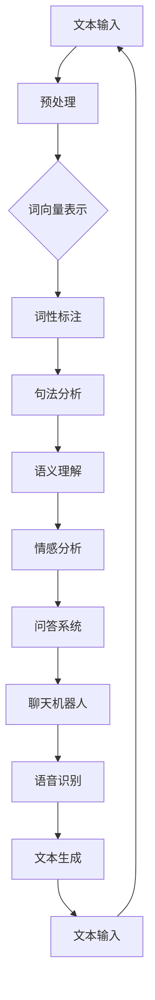
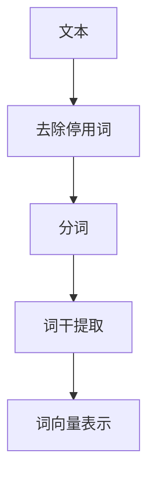
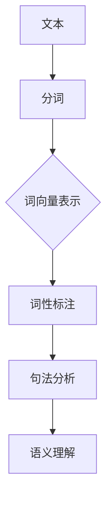
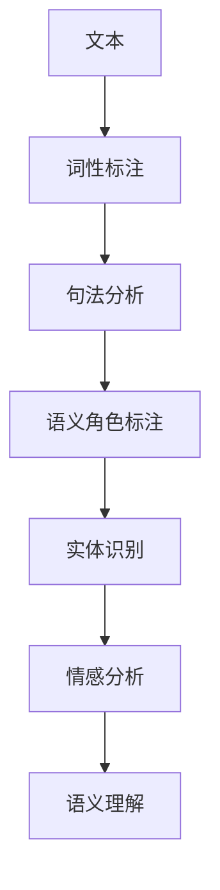

                 

# 自然语言处理在创业产品中的应用场景

> **关键词：** 自然语言处理，创业产品，文本分析，情感分析，问答系统，语音识别，聊天机器人

> **摘要：** 本文旨在探讨自然语言处理（NLP）技术在创业产品中的多种应用场景。通过详细介绍NLP的核心概念、算法原理、数学模型以及实战案例，帮助读者理解如何将NLP技术与创业产品相结合，提升用户体验和市场竞争力。

## 1. 背景介绍

### 1.1 目的和范围

本文旨在为创业公司提供有关自然语言处理技术（NLP）在实际产品中的应用指南。我们将深入分析NLP的核心概念，介绍其在文本分析、情感分析、问答系统、语音识别和聊天机器人等领域的应用。通过实际案例和详细解释，帮助创业团队理解如何利用NLP技术提升产品功能和用户体验。

### 1.2 预期读者

本文适合具有计算机科学或相关领域背景的创业者、产品经理、软件开发人员以及对自然语言处理技术感兴趣的读者。文章内容结构清晰，从基础知识到实际应用，适合各个层次的读者逐步了解和掌握。

### 1.3 文档结构概述

本文结构如下：

1. **背景介绍**：介绍文章的目的和范围，预期读者以及文档结构。
2. **核心概念与联系**：定义NLP的核心概念，展示其原理和架构。
3. **核心算法原理 & 具体操作步骤**：详细阐述NLP的关键算法和操作步骤。
4. **数学模型和公式 & 详细讲解 & 举例说明**：讲解NLP相关的数学模型和公式。
5. **项目实战：代码实际案例和详细解释说明**：通过实战案例展示NLP的实际应用。
6. **实际应用场景**：探讨NLP在不同创业产品中的应用。
7. **工具和资源推荐**：推荐学习资源和开发工具。
8. **总结：未来发展趋势与挑战**：总结NLP技术的发展趋势和面临的挑战。
9. **附录：常见问题与解答**：回答常见问题。
10. **扩展阅读 & 参考资料**：提供进一步学习和研究的资源。

### 1.4 术语表

#### 1.4.1 核心术语定义

- 自然语言处理（NLP）：模拟人类语言理解和生成的人工智能技术。
- 文本分析：从文本中提取有用信息的过程。
- 情感分析：识别文本中的情感倾向。
- 问答系统：自动回答用户问题的系统。
- 语音识别：将语音转换为文本。
- 聊天机器人：与用户进行自然语言交互的系统。

#### 1.4.2 相关概念解释

- 机器学习：一种通过数据学习模式并做出预测的技术。
- 深度学习：一种机器学习技术，使用多层神经网络模拟人脑的学习过程。
- 词汇表：用于表示文本的词集合。
- 语义角色标注：识别文本中词语的语义角色。

#### 1.4.3 缩略词列表

- NLP：自然语言处理
- ML：机器学习
- DL：深度学习
- API：应用程序编程接口

## 2. 核心概念与联系

自然语言处理（NLP）是计算机科学、人工智能和语言学领域的交叉学科。其核心目标是使计算机能够理解、解释和生成人类语言。以下是一个简化的NLP工作流程及其相关概念：



### 2.1 文本预处理

文本预处理是NLP的基础步骤，包括去除停用词、分词、词干提取等。以下是一个简化的预处理流程：



### 2.2 词向量表示

词向量是将文本转换为机器可处理的数值表示的方法。常见的词向量模型有Word2Vec和GloVe。以下是一个简化的Word2Vec模型流程：



### 2.3 语义理解

语义理解是NLP的高级阶段，涉及从文本中提取意义。以下是一个简化的语义理解流程：



## 3. 核心算法原理 & 具体操作步骤

NLP中使用的核心算法包括词向量表示、词性标注、句法分析、语义理解和情感分析。以下分别介绍这些算法的原理和具体操作步骤。

### 3.1 词向量表示

词向量表示是将文本中的词语转换为固定大小的向量。Word2Vec是一种基于神经网络的词向量表示方法，其核心算法包括连续词袋（CBOW）和Skip-Gram。

#### 3.1.1 CBOW算法

CBOW（Continuous Bag of Words）算法通过一个词语的上下文词向量来预测该词语。以下是一个CBOW算法的简化伪代码：

```python
function CBOW(context_words, target_word, word_vectors, window_size):
    context_vector = sum(word_vectors[word] for word in context_words)
    target_word_vector = word_vectors[target_word]
    prediction = softmax(context_vector dot target_word_vector)
    return prediction
```

#### 3.1.2 Skip-Gram算法

Skip-Gram算法与CBOW类似，但目标词语的上下文词向量是预测目标。以下是一个Skip-Gram算法的简化伪代码：

```python
function SkipGram(target_word, context_words, word_vectors, window_size):
    target_word_vector = word_vectors[target_word]
    context_vector = sum(word_vectors[word] for word in context_words)
    prediction = softmax(target_word_vector dot context_vector)
    return prediction
```

### 3.2 词性标注

词性标注是将文本中的词语标注为其对应的词性。常用的词性标注算法包括基于规则的算法和基于统计的算法。

#### 3.2.1 基于规则的算法

基于规则的算法使用一组预定义的规则来标注词性。以下是一个简化规则的词性标注算法：

```python
function RuleBasedPOS Tagging(text, rules):
    for word in text:
        for rule in rules:
            if rule matches word:
                word_tag = rule's tag
                break
        else:
            word_tag = unknown
    return tagged_text
```

#### 3.2.2 基于统计的算法

基于统计的算法使用训练数据中的统计信息来标注词性。以下是一个简化统计的词性标注算法：

```python
function StatisticalPOS Tagging(text, training_data):
    for word in text:
        word_context = extract_context(word, text)
        word_tag = predict_tag(word_context, training_data)
    return tagged_text
```

### 3.3 句法分析

句法分析是将文本中的词语组成结构转化为语法树。常用的句法分析方法包括基于规则的算法和基于统计的算法。

#### 3.3.1 基于规则的算法

基于规则的算法使用预定义的语法规则来分析句子结构。以下是一个简化规则句法分析的算法：

```python
function RuleBasedSyntax Parsing(sentence, rules):
    for rule in rules:
        if rule applies to sentence:
            parse_tree = rule's structure
            break
    return parse_tree
```

#### 3.3.2 基于统计的算法

基于统计的算法使用训练数据中的句法信息来分析句子结构。以下是一个简化统计句法分析的算法：

```python
function StatisticalSyntax Parsing(sentence, training_data):
    for structure in possible_structures:
        structure_score = score_structure(sentence, structure, training_data)
    structure_with_highest_score = select_best_structure(structure_scores)
    return parse_tree_with_best_score
```

### 3.4 语义理解

语义理解是从文本中提取意义的过程。常用的语义理解方法包括实体识别、关系抽取和事件抽取。

#### 3.4.1 实体识别

实体识别是将文本中的实体（如人名、地名、组织名等）标注出来。以下是一个简化实体识别的算法：

```python
function Entity Recognition(text, training_data):
    for entity in entities_in_training_data:
        entity_pattern = create_pattern_for_entity(entity)
        entities_in_text = find_matching_entities(text, entity_pattern)
    return annotated_entities
```

#### 3.4.2 关系抽取

关系抽取是从文本中提取实体之间的关系的任务。以下是一个简化关系抽取的算法：

```python
function Relationship Extraction(text, training_data):
    for relation in relationships_in_training_data:
        relation_pattern = create_pattern_for_relation(relation)
        relations_in_text = find_matching_relations(text, relation_pattern)
    return annotated_relations
```

#### 3.4.3 事件抽取

事件抽取是从文本中提取事件信息的过程。以下是一个简化事件抽取的算法：

```python
function Event Extraction(text, training_data):
    for event in events_in_training_data:
        event_pattern = create_pattern_for_event(event)
        events_in_text = find_matching_events(text, event_pattern)
    return annotated_events
```

### 3.5 情感分析

情感分析是识别文本中的情感倾向。常用的情感分析方法包括基于规则的方法和基于机器学习的方法。

#### 3.5.1 基于规则的方法

基于规则的方法使用预定义的规则来识别情感。以下是一个简化规则情感分析的算法：

```python
function RuleBasedSentiment Analysis(text, rules):
    for rule in rules:
        if rule matches text:
            sentiment = rule's sentiment
            break
    else:
        sentiment = neutral
    return sentiment
```

#### 3.5.2 基于机器学习的方法

基于机器学习的方法使用训练数据中的情感信息来识别情感。以下是一个简化机器学习情感分析的算法：

```python
function MachineLearningSentiment Analysis(text, training_data):
    features = extract_features(text)
    sentiment = predict_sentiment(features, training_data)
    return sentiment
```

## 4. 数学模型和公式 & 详细讲解 & 举例说明

自然语言处理中的数学模型和公式主要用于描述文本的特征表示、概率分布和预测。以下介绍几个关键的数学模型和公式，并给出详细的讲解和示例。

### 4.1 词向量表示

词向量是将文本中的词语转换为固定大小的向量。常用的词向量模型包括Word2Vec和GloVe。

#### 4.1.1 Word2Vec模型

Word2Vec模型使用神经网络来学习词向量。以下是一个简化的Word2Vec模型公式：

$$
\text{softmax}(z) = \frac{e^z}{\sum e^z}
$$

其中，$z$是神经网络的输出，$\text{softmax}$函数用于将输出转换为概率分布。

#### 4.1.2 GloVe模型

GloVe模型通过矩阵分解来学习词向量。以下是一个简化的GloVe模型公式：

$$
\text{word\_vector} = \text{context\_vector} \circ \text{weight\_vector}
$$

其中，$\text{word\_vector}$和$\text{context\_vector}$是词向量和上下文向量，$\text{weight\_vector}$是权重向量，$\circ$表示Hadamard积。

### 4.2 语义角色标注

语义角色标注是识别文本中词语的语义角色。以下是一个简化的语义角色标注模型公式：

$$
\text{semrole} = \text{argmax}_{r \in \text{semroles}} \text{P}(r | \text{word}, \text{context})
$$

其中，$\text{semrole}$是语义角色，$\text{P}(r | \text{word}, \text{context})$是给定词语和上下文的语义角色概率。

### 4.3 情感分析

情感分析是识别文本中的情感倾向。以下是一个简化的情感分析模型公式：

$$
\text{sentiment} = \text{argmax}_{s \in \text{senti

