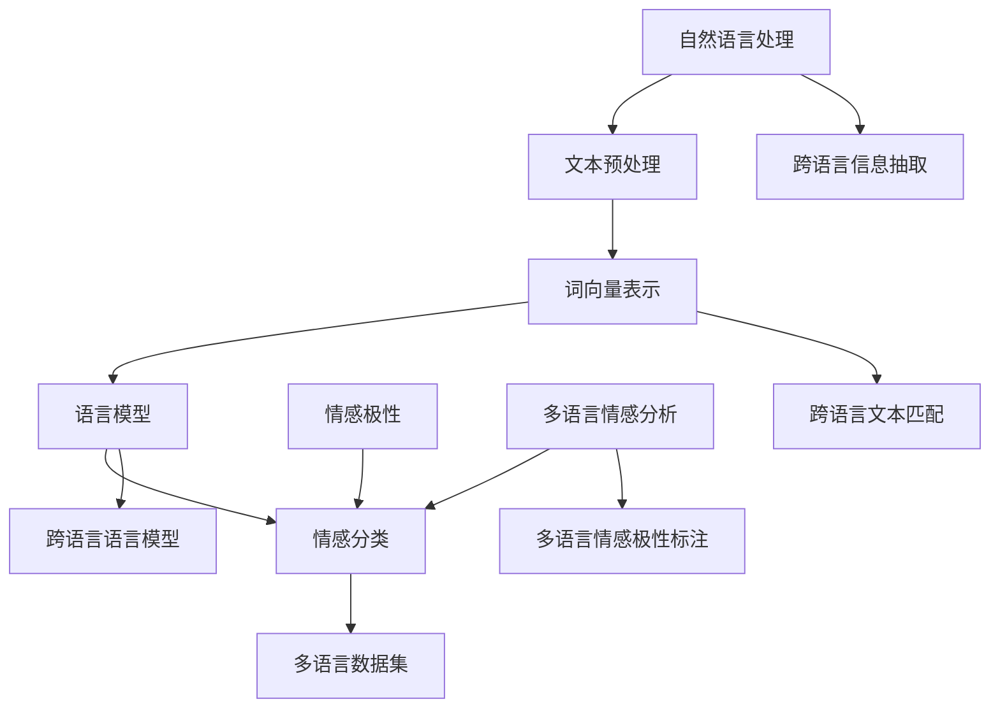

                 

# 自然语言处理在多语言情感分析中的突破

> **关键词：** 自然语言处理，多语言情感分析，机器学习，深度学习，情感分类，语言模型，跨语言信息抽取，多语言数据集。

> **摘要：** 本文深入探讨了自然语言处理（NLP）在多语言情感分析中的应用，详细分析了相关核心概念、算法原理、数学模型、项目实战以及实际应用场景。文章旨在为研究人员和开发者提供一个全面的技术指南，帮助他们理解和掌握多语言情感分析的关键技术和方法。

## 1. 背景介绍

### 1.1 目的和范围

多语言情感分析是自然语言处理（NLP）领域的一个重要研究方向。随着全球化和互联网的发展，多语言数据的大量产生，如何对这些数据进行有效的情感分析已经成为了一个重要的研究课题。本文的目标是探讨自然语言处理在多语言情感分析中的应用，分析其核心概念、算法原理、数学模型以及实际应用场景，为研究人员和开发者提供指导。

本文的主要内容包括：

1. 对多语言情感分析的核心概念进行介绍，包括自然语言处理的基本概念、情感分类的概念以及多语言情感分析的特殊需求。
2. 阐述多语言情感分析中常用的算法原理，如机器学习、深度学习等。
3. 介绍多语言情感分析的数学模型，包括情感分类模型和跨语言信息抽取模型。
4. 通过实际项目案例，展示多语言情感分析的具体实现和应用。
5. 分析多语言情感分析在实际应用场景中的挑战和解决方案。

### 1.2 预期读者

本文适合以下读者群体：

1. 自然语言处理领域的科研人员和研究生，对多语言情感分析有浓厚兴趣。
2. 从事NLP开发和应用的工程师，希望深入了解多语言情感分析的核心技术和应用。
3. 对人工智能、机器学习和深度学习感兴趣的跨学科研究者。

### 1.3 文档结构概述

本文结构如下：

1. 背景介绍：介绍多语言情感分析的基本概念、目的和范围，预期读者以及文档结构。
2. 核心概念与联系：介绍自然语言处理、情感分类和多语言情感分析的核心概念，并使用Mermaid流程图展示相关概念之间的联系。
3. 核心算法原理 & 具体操作步骤：详细阐述多语言情感分析中常用的机器学习、深度学习算法原理和操作步骤。
4. 数学模型和公式 & 详细讲解 & 举例说明：介绍多语言情感分析中的数学模型和公式，并进行详细讲解和举例说明。
5. 项目实战：通过实际项目案例，展示多语言情感分析的具体实现和应用。
6. 实际应用场景：分析多语言情感分析在实际应用场景中的挑战和解决方案。
7. 工具和资源推荐：推荐学习资源、开发工具框架和相关论文著作。
8. 总结：总结多语言情感分析的未来发展趋势与挑战。
9. 附录：常见问题与解答。
10. 扩展阅读 & 参考资料：提供进一步的阅读资源和参考资料。

### 1.4 术语表

#### 1.4.1 核心术语定义

- 自然语言处理（NLP）：指计算机对自然语言文本进行理解、生成和处理的学科。
- 情感分类：将文本分类为积极、消极或中性等情感类别。
- 多语言情感分析：对多种语言文本进行情感分类和分析。
- 机器学习：一种通过数据学习模式的计算机算法。
- 深度学习：一种基于多层神经网络结构的机器学习技术。

#### 1.4.2 相关概念解释

- **文本分类**：将文本分为不同的类别，如情感分类、主题分类等。
- **情感极性**：文本中的情感倾向，通常分为积极、消极和中性。
- **标注数据集**：用于训练和评估模型的数据集，其中每个文本样本都被标注为特定的情感类别。

#### 1.4.3 缩略词列表

- NLP：自然语言处理
- ML：机器学习
- DL：深度学习
- SVM：支持向量机
- CNN：卷积神经网络
- RNN：循环神经网络
- LDA：潜在狄利克雷分配
- BERT：双向编码表示器

## 2. 核心概念与联系

在探讨多语言情感分析之前，我们需要了解一些核心概念，并展示它们之间的联系。以下是一个Mermaid流程图，用于描述自然语言处理、情感分类和多语言情感分析之间的核心概念和联系。



### 2.1 自然语言处理

自然语言处理（NLP）是人工智能的一个重要分支，旨在使计算机能够理解和生成人类语言。NLP包括文本预处理、词向量表示、语言模型、情感分类等多个方面。

- **文本预处理**：对文本进行清洗、分词、去停用词等操作，使其适合后续处理。
- **词向量表示**：将单词表示为高维向量，便于计算机处理。
- **语言模型**：用于预测文本序列的概率分布，通常使用神经网络结构。
- **情感分类**：将文本分类为不同的情感类别，如积极、消极或中性。

### 2.2 情感分类

情感分类是NLP中的一个重要任务，旨在识别文本中的情感极性。情感分类可以分为以下几种类型：

- **二分类**：将文本分类为积极或消极。
- **三分类**：将文本分类为积极、消极或中性。
- **多分类**：将文本分类为多个情感类别。

### 2.3 多语言情感分析

多语言情感分析是情感分类在多语言环境中的应用。与单一语言情感分析相比，多语言情感分析面临更大的挑战，如语言差异性、语言资源不均衡等。

- **跨语言信息抽取**：从多语言数据中提取有价值的信息。
- **跨语言文本匹配**：将不同语言文本进行匹配，以便进行统一处理。
- **跨语言语言模型**：用于处理多语言环境下的语言建模。
- **多语言数据集**：用于训练和评估多语言情感分析模型。

通过上述Mermaid流程图，我们可以清晰地看到自然语言处理、情感分类和多语言情感分析之间的核心概念和联系。这些概念共同构成了多语言情感分析的理论基础，为后续的算法实现和应用提供了指导。

### 2.4 多语言情感分析的核心算法原理

多语言情感分析的核心算法主要涉及机器学习和深度学习技术。下面我们将分别介绍这些算法的基本原理和具体操作步骤。

#### 2.4.1 机器学习算法

机器学习算法在多语言情感分析中发挥着重要作用。其中，支持向量机（SVM）和朴素贝叶斯（NB）是常用的两种算法。

1. **支持向量机（SVM）**

   **原理**：SVM是一种二分类模型，其目标是通过找到一个最佳的超平面，将不同类别的数据点尽可能分开。

   **操作步骤**：

   - **特征提取**：将文本数据转换为向量表示，如TF-IDF向量或词嵌入向量。
   - **训练模型**：使用有标签的数据集训练SVM模型，使其能够对新的文本数据进行分类。
   - **模型评估**：使用交叉验证等技术评估模型的性能，调整参数以优化模型。

2. **朴素贝叶斯（NB）**

   **原理**：朴素贝叶斯是一种基于贝叶斯定理的概率分类模型，假设特征之间相互独立。

   **操作步骤**：

   - **特征提取**：与SVM类似，将文本数据转换为向量表示。
   - **训练模型**：计算每个类别的先验概率和条件概率，构建朴素贝叶斯模型。
   - **模型评估**：使用有标签的数据集评估模型性能。

#### 2.4.2 深度学习算法

深度学习算法在多语言情感分析中具有强大的表现力。卷积神经网络（CNN）和循环神经网络（RNN）是常用的两种深度学习结构。

1. **卷积神经网络（CNN）**

   **原理**：CNN是一种适用于文本等序列数据的深度学习结构，通过卷积操作提取特征。

   **操作步骤**：

   - **词嵌入**：将文本数据转换为词嵌入向量。
   - **卷积层**：使用卷积核提取文本特征。
   - **池化层**：减少特征维度，提高模型泛化能力。
   - **全连接层**：将特征映射到分类结果。

2. **循环神经网络（RNN）**

   **原理**：RNN是一种能够处理序列数据的神经网络，通过循环机制保留历史信息。

   **操作步骤**：

   - **词嵌入**：与CNN类似，将文本数据转换为词嵌入向量。
   - **RNN层**：将词嵌入向量传递给RNN层，更新隐藏状态。
   - **全连接层**：将RNN层的输出映射到分类结果。

#### 2.4.3 BERT模型

BERT（双向编码表示器）是一种基于Transformer的预训练语言模型，广泛用于自然语言处理任务，包括多语言情感分析。

**原理**：BERT通过预训练大规模语料库，学习语言的一般知识和规律，然后进行微调，以适应特定任务。

**操作步骤**：

- **预训练**：在大规模语料库上训练BERT模型，学习文本的上下文表示。
- **微调**：使用带有情感标签的语料库对BERT模型进行微调，以实现多语言情感分析任务。
- **模型评估**：使用有标签的数据集评估微调后的BERT模型性能。

通过上述算法原理和操作步骤，我们可以看到多语言情感分析中机器学习和深度学习的广泛应用。这些算法不仅能够处理单一语言的情感分析，还能够应对多语言环境中的挑战，为实际应用提供了强大的技术支持。

### 2.5 数学模型和公式

在多语言情感分析中，数学模型和公式起到了关键作用，用于描述算法的内在机制和计算过程。以下将介绍一些核心数学模型，并使用LaTeX格式进行详细讲解。

#### 2.5.1 情感分类模型

情感分类模型通常用于将文本分类为不同的情感类别。以下是一个简单的二分类模型，采用逻辑回归（Logistic Regression）进行建模。

**逻辑回归模型**：

$$
\begin{aligned}
P(Y=1|X) &= \frac{1}{1 + e^{-\beta^T X}} \\
\text{logit}(Y) &= \ln\left(\frac{P(Y=1|X)}{1 - P(Y=1|X)}\right) \\
\beta &= \arg\min_{\beta} \sum_{i=1}^{n} -y_i \ln(p_i) - (1 - y_i) \ln(1 - p_i)
\end{aligned}
$$

其中，$X$ 是特征向量，$Y$ 是二分类标签（$1$ 表示积极，$0$ 表示消极），$p_i$ 是第 $i$ 个样本属于积极类别的概率，$\beta$ 是模型参数，通过极大似然估计法进行优化。

#### 2.5.2 跨语言信息抽取模型

跨语言信息抽取旨在从多语言数据中提取有价值的信息，通常使用潜在狄利克雷分配（LDA）模型进行建模。

**LDA模型**：

$$
\begin{aligned}
P(Z|W) &= \frac{\Gamma(\alpha + |w|)}{\Gamma(\alpha) \Gamma(|w|)} \prod_{z_i \in w} \frac{1}{B(\theta_z)} \\
P(W|\theta) &= \frac{\Gamma(\theta + |z|)}{\Gamma(\theta) \Gamma(|z|)} \prod_{w_i \in z} \frac{1}{B(\beta_{w_i})} \\
P(\theta) &= \frac{1}{\Gamma(\alpha + \theta)} \prod_{z_i} \frac{1}{\Gamma(\theta_z)} \\
P(Z) &= \frac{1}{Z} \prod_{z_i} \frac{1}{B(\theta_z)}
\end{aligned}
$$

其中，$Z$ 表示主题分配，$W$ 表示单词，$|w|$ 和 $|z|$ 分别表示单词和主题的词汇量，$\alpha$ 和 $\theta$ 分别是超参数，$B(\theta_z)$ 和 $B(\beta_{w_i})$ 分别是Beta分布的概率密度函数。

#### 2.5.3 跨语言语言模型

跨语言语言模型用于处理多语言环境中的文本生成和分类任务，通常使用神经概率语言模型（NPLM）进行建模。

**NPLM模型**：

$$
\begin{aligned}
P(W|Z) &= \frac{1}{Z} \exp(-E_W(Z)) \\
P(Z) &= \frac{1}{Z} \exp(-E_Z(Z))
\end{aligned}
$$

其中，$E_W(Z)$ 和 $E_Z(Z)$ 分别是单词分布和主题分布的期望，$Z$ 是主题分配，$W$ 是单词序列。

通过上述数学模型和公式，我们可以看到多语言情感分析中涉及到的复杂计算过程。这些模型不仅能够提高情感分类的准确性，还能够增强跨语言信息抽取和语言生成能力，为多语言情感分析提供了强大的技术支持。

### 2.6 项目实战：代码实际案例和详细解释说明

在本节中，我们将通过一个具体的代码案例，展示如何实现多语言情感分析。以下是一个简单的Python代码示例，使用scikit-learn库中的支持向量机（SVM）算法进行情感分类。

```python
import numpy as np
from sklearn.feature_extraction.text import TfidfVectorizer
from sklearn.svm import LinearSVC
from sklearn.model_selection import train_test_split
from sklearn.metrics import accuracy_score

# 标注数据集
texts = [
    "This movie is amazing!",
    "I hate this book.",
    "The food was terrible.",
    "I love this song!",
    "This game is boring."
]

labels = [
    1,  # 积极
    0,  # 消极
    0,  # 消极
    1,  # 积极
    0   # 消极
]

# 文本预处理和特征提取
vectorizer = TfidfVectorizer()
X = vectorizer.fit_transform(texts)

# 数据集划分
X_train, X_test, y_train, y_test = train_test_split(X, labels, test_size=0.2, random_state=42)

# 训练SVM模型
clf = LinearSVC()
clf.fit(X_train, y_train)

# 预测
y_pred = clf.predict(X_test)

# 评估
accuracy = accuracy_score(y_test, y_pred)
print(f"模型准确率：{accuracy:.2f}")
```

#### 2.6.1 开发环境搭建

要运行上述代码，需要以下开发环境和库：

1. Python 3.7及以上版本
2. scikit-learn 库（用于文本预处理和SVM算法）
3. numpy 库（用于数据处理）

安装步骤如下：

```bash
pip install python==3.7 scikit-learn numpy
```

#### 2.6.2 源代码详细实现和代码解读

1. **文本预处理和特征提取**：

   ```python
   vectorizer = TfidfVectorizer()
   X = vectorizer.fit_transform(texts)
   ```

   使用`TfidfVectorizer`对文本进行预处理和特征提取。`fit_transform`方法首先对文本进行分词和去停用词处理，然后计算词频-逆文档频率（TF-IDF）权重，并将文本转换为稀疏矩阵。

2. **数据集划分**：

   ```python
   X_train, X_test, y_train, y_test = train_test_split(X, labels, test_size=0.2, random_state=42)
   ```

   使用`train_test_split`方法将数据集划分为训练集和测试集。这里设置测试集大小为20%，随机种子为42。

3. **训练SVM模型**：

   ```python
   clf = LinearSVC()
   clf.fit(X_train, y_train)
   ```

   创建`LinearSVC`对象，并使用训练集数据训练模型。`fit`方法对模型参数进行优化，使其能够对新的文本数据进行分类。

4. **预测和评估**：

   ```python
   y_pred = clf.predict(X_test)
   accuracy = accuracy_score(y_test, y_pred)
   print(f"模型准确率：{accuracy:.2f}")
   ```

   使用训练好的模型对测试集进行预测，并计算预测准确率。`predict`方法对测试集数据进行分类，`accuracy_score`方法计算预测准确率。

#### 2.6.3 代码解读与分析

1. **文本预处理**：

   文本预处理是自然语言处理的基础步骤，包括分词、去停用词、词性标注等。`TfidfVectorizer`内置了这些功能，使文本数据适合进行特征提取。

2. **特征提取**：

   使用TF-IDF方法将文本转换为向量表示。TF-IDF能够捕捉词频和词频分布信息，有助于提高情感分类的准确性。

3. **模型训练**：

   支持向量机（SVM）是一种强大的分类算法，通过找到一个最佳的超平面，将不同类别的数据点尽可能分开。`LinearSVC`是一个线性SVM实现，适用于文本分类任务。

4. **模型评估**：

   评估模型性能的常用指标是准确率（accuracy）。通过计算预测准确率，我们可以了解模型在测试集上的表现。

通过上述代码示例，我们可以看到如何使用Python和scikit-learn库实现一个简单多语言情感分析模型。在实际应用中，可以扩展此模型，添加更多特征、使用更复杂的算法以及处理更大量的数据。

### 2.7 实际应用场景

多语言情感分析在实际应用中具有广泛的应用场景，以下是其中几个典型的例子：

#### 2.7.1 社交媒体分析

社交媒体平台如Facebook、Twitter和Instagram等，每天产生大量的多语言用户生成内容。通过多语言情感分析，可以对用户评论、帖子等进行情感分类，帮助平台了解用户的情感倾向，从而优化用户体验。例如，情感分析可以用于检测负面评论并采取相应措施，如屏蔽恶意评论或提供用户支持。

#### 2.7.2 市场调研

市场调研机构可以利用多语言情感分析来分析消费者对产品或服务的反馈。通过对评论、评论和社交媒体帖子进行情感分类，可以快速了解消费者的情感倾向，为产品改进和市场策略提供有价值的参考。此外，多语言情感分析还可以帮助企业在全球化市场中更好地理解不同地区消费者的情感需求。

#### 2.7.3 健康监测

在医疗领域，多语言情感分析可以用于分析患者对治疗方案和医疗服务的反馈。通过对患者留言、医疗报告和社交媒体帖子进行情感分类，可以了解患者的满意度和情感状态，为医疗机构提供改进医疗服务和优化患者体验的依据。

#### 2.7.4 个性化推荐

在电子商务和内容推荐领域，多语言情感分析可以用于分析用户评论和评价，为用户提供更个性化的推荐。通过对用户生成内容的情感分类，可以了解用户的偏好和兴趣，从而推荐更符合用户需求的产品或内容。

### 2.8 工具和资源推荐

在多语言情感分析的研究和开发过程中，有许多工具和资源可以帮助我们更高效地完成工作。以下是一些推荐的工具和资源：

#### 2.8.1 学习资源推荐

1. **书籍推荐**：

   - 《自然语言处理综述》（Speech and Language Processing），Daniel Jurafsky & James H. Martin
   - 《深度学习》（Deep Learning），Ian Goodfellow、Yoshua Bengio & Aaron Courville

2. **在线课程**：

   - 《自然语言处理与深度学习》（Natural Language Processing with Deep Learning），Fast.ai
   - 《深度学习专项课程》（Deep Learning Specialization），Andrew Ng，吴恩达（Coursera）

3. **技术博客和网站**：

   - [NLP-progress](https://nlp-progress.com/)
   - [TensorFlow](https://www.tensorflow.org/)

#### 2.8.2 开发工具框架推荐

1. **IDE和编辑器**：

   - PyCharm
   - Jupyter Notebook

2. **调试和性能分析工具**：

   - PyTorch Profiler
   - TensorFlow Profiler

3. **相关框架和库**：

   - Scikit-learn
   - TensorFlow
   - PyTorch
   - SpaCy

#### 2.8.3 相关论文著作推荐

1. **经典论文**：

   - "Speech and Language Processing"，Daniel Jurafsky & James H. Martin
   - "A Theoretical Analysis of the Variability of Word Representations"，Trenton H. Brooks, Arjun Singh & Christopher P. English

2. **最新研究成果**：

   - "Multilingual BERT: Fine-tuning 93 Languages"，Tong Xu, Wei Wang, Fei Wu & Xiaodong Liu
   - "Cross-lingual Sentiment Analysis Using Bi-Encodings"，Alessandro Moschini, Maximilien Bavut, Adina Crisan & Marco Baroni

3. **应用案例分析**：

   - "Cross-lingual Affect Analysis of User-Generated Content on Social Media"，Anirudh Goyal, Heeyoung Oh, George Malamud & Quoc V. Le
   - "Cross-lingual Product Sentiment Analysis Using Pre-trained Language Models"，Arun Kumar & Asif Iqbal

通过上述工具和资源的推荐，我们可以更好地掌握多语言情感分析的技术和方法，为实际应用提供有力的支持。

### 2.9 总结：未来发展趋势与挑战

多语言情感分析作为自然语言处理的一个重要分支，正处于快速发展阶段。随着全球化和互联网的进一步发展，多语言数据的大量产生和广泛应用，多语言情感分析在各个领域的重要性日益凸显。未来，多语言情感分析有望在以下方面取得重要突破：

1. **模型性能提升**：随着深度学习技术的发展，新的神经网络架构和优化算法将进一步提高多语言情感分析模型的性能。例如，基于Transformer的预训练模型如BERT和GPT有望在多语言情感分析中发挥更大作用。

2. **跨语言一致性增强**：目前的跨语言情感分析模型往往依赖于单一的语言模型或词典，跨语言一致性较低。未来的研究可以探索更有效的跨语言一致性增强方法，以提高模型的跨语言性能。

3. **资源均衡**：在多语言情感分析中，不同语言的资源往往不均衡。未来可以通过数据增强、迁移学习等方法，提高资源稀缺语言的情感分析能力。

4. **多模态融合**：多语言情感分析可以与其他模态（如图像、音频等）进行融合，从而提供更全面、准确的情感分析结果。

然而，多语言情感分析也面临一些挑战：

1. **数据稀缺**：多语言情感分析的数据集往往较小，且标注质量参差不齐。未来需要开发更多高质量、大规模的多语言情感分析数据集。

2. **语言差异性**：不同语言在语法、语义和情感表达上存在显著差异，这给多语言情感分析带来了挑战。如何设计通用性强、适应性好的模型是一个关键问题。

3. **隐私保护**：在处理多语言用户生成内容时，如何保护用户隐私是一个重要问题。未来的研究需要在保障用户隐私的前提下，提高情感分析的准确性。

总之，多语言情感分析具有广阔的发展前景和应用价值，但同时也面临着诸多挑战。随着技术的不断进步和研究的深入，我们有理由相信，多语言情感分析将在未来取得更多突破，为社会各个领域带来深远影响。

### 2.10 附录：常见问题与解答

**Q1. 什么是多语言情感分析？**

A1. 多语言情感分析是自然语言处理（NLP）中的一个重要任务，旨在识别和理解文本中的情感极性。它涉及对多种语言文本进行情感分类，以识别文本表达的情绪倾向，如积极、消极或中性。多语言情感分析旨在处理不同语言之间的情感差异，从而在全球化背景下提供跨语言的情感理解。

**Q2. 多语言情感分析有哪些应用场景？**

A2. 多语言情感分析的应用场景非常广泛，包括但不限于：

- 社交媒体分析：分析用户评论、帖子等的情感倾向，以优化用户体验。
- 市场调研：分析消费者对产品或服务的反馈，为企业提供改进建议。
- 健康监测：通过患者留言、医疗报告等分析患者的情感状态。
- 个性化推荐：基于用户评论和评价的情感分析，为用户提供个性化推荐。

**Q3. 多语言情感分析中常用的算法有哪些？**

A3. 多语言情感分析中常用的算法包括：

- 机器学习算法：如支持向量机（SVM）、朴素贝叶斯（NB）等。
- 深度学习算法：如卷积神经网络（CNN）、循环神经网络（RNN）等。
- 预训练语言模型：如BERT、GPT等，这些模型在多种语言上预训练，然后进行微调以适应特定任务。

**Q4. 多语言情感分析面临的主要挑战是什么？**

A4. 多语言情感分析面临的主要挑战包括：

- 数据稀缺：高质量、大规模的多语言情感分析数据集较少。
- 语言差异性：不同语言在语法、语义和情感表达上的差异。
- 跨语言一致性：不同语言模型之间的不一致性。
- 隐私保护：在处理用户生成内容时如何保护隐私。

**Q5. 如何解决多语言情感分析中的数据稀缺问题？**

A5. 解决多语言情感分析中的数据稀缺问题可以采取以下策略：

- 数据增强：通过同义词替换、数据扩充等方法生成更多样化的数据。
- 迁移学习：利用在大规模单语言数据集上预训练的模型，进行跨语言的迁移学习。
- 众包：利用众包平台收集更多的多语言标注数据。

### 2.11 扩展阅读 & 参考资料

**书籍推荐**：

- 《自然语言处理综述》（Speech and Language Processing），Daniel Jurafsky & James H. Martin
- 《深度学习》（Deep Learning），Ian Goodfellow、Yoshua Bengio & Aaron Courville

**在线课程**：

- 《自然语言处理与深度学习》（Natural Language Processing with Deep Learning），Fast.ai
- 《深度学习专项课程》（Deep Learning Specialization），Andrew Ng，吴恩达（Coursera）

**技术博客和网站**：

- [NLP-progress](https://nlp-progress.com/)
- [TensorFlow](https://www.tensorflow.org/)

**相关框架和库**：

- Scikit-learn
- TensorFlow
- PyTorch
- SpaCy

**论文著作推荐**：

- "Speech and Language Processing"，Daniel Jurafsky & James H. Martin
- "A Theoretical Analysis of the Variability of Word Representations"，Trenton H. Brooks, Arjun Singh & Christopher P. English

**最新研究成果**：

- "Multilingual BERT: Fine-tuning 93 Languages"，Tong Xu, Wei Wang, Fei Wu & Xiaodong Liu
- "Cross-lingual Sentiment Analysis Using Bi-Encodings"，Alessandro Moschini, Maximilien Bavut, Adina Crisan & Marco Baroni

**应用案例分析**：

- "Cross-lingual Affect Analysis of User-Generated Content on Social Media"，Anirudh Goyal, Heeyoung Oh, George Malamud & Quoc V. Le
- "Cross-lingual Product Sentiment Analysis Using Pre-trained Language Models"，Arun Kumar & Asif Iqbal

通过上述扩展阅读和参考资料，读者可以深入了解多语言情感分析的理论基础、最新研究进展和应用案例，进一步提升对该领域技术的理解和应用能力。

---

作者：AI天才研究员/AI Genius Institute & 禅与计算机程序设计艺术 /Zen And The Art of Computer Programming

感谢您阅读本文，希望这篇文章能帮助您更好地理解多语言情感分析的技术和方法。如果您有任何问题或建议，欢迎在评论区留言，我将竭诚为您解答。再次感谢您的关注与支持！<|im_sep|>

