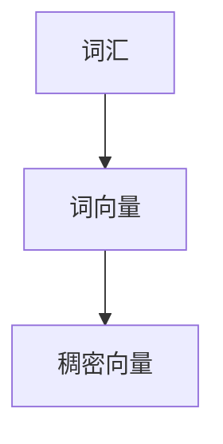
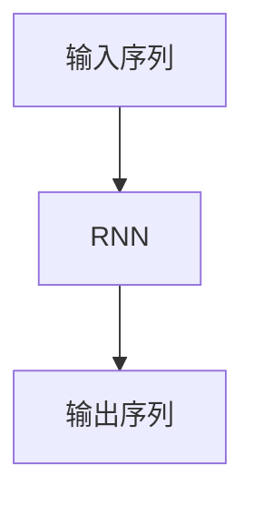
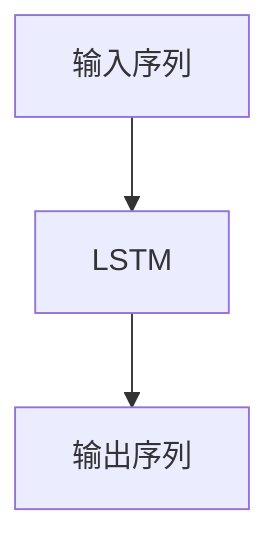
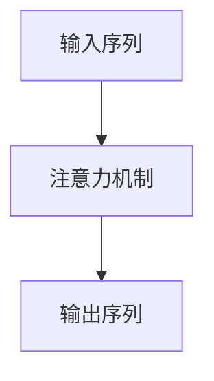
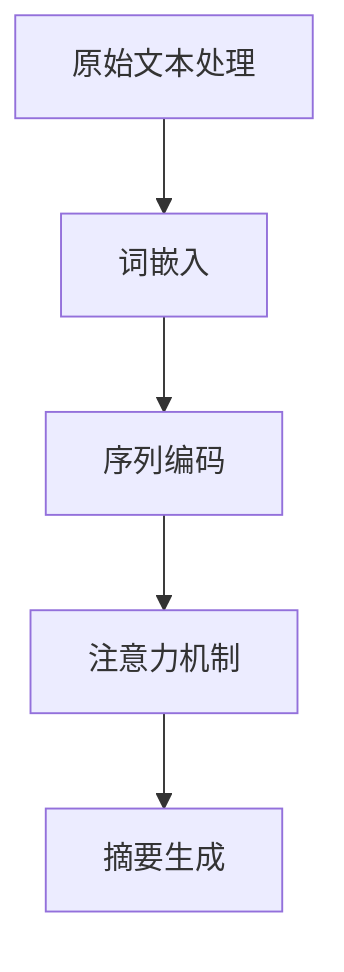

                 

# 自然语言处理在多语言文本摘要中的进展

> 关键词：自然语言处理、多语言文本摘要、算法、数学模型、应用场景

> 摘要：本文深入探讨了自然语言处理在多语言文本摘要领域的最新进展，从背景介绍、核心概念、算法原理、数学模型、项目实战、实际应用场景、工具和资源推荐等方面进行了全面分析。通过本文的阅读，读者可以了解多语言文本摘要技术的核心原理和实现方法，以及其在实际应用中的挑战和未来发展趋势。

## 1. 背景介绍

### 1.1 目的和范围

本文旨在介绍自然语言处理（NLP）在多语言文本摘要领域的最新研究进展。多语言文本摘要是一种利用NLP技术从原始文本中提取关键信息，生成简明扼要的摘要，以帮助用户快速理解文本内容的技术。本文将重点关注以下几个方面的内容：

1. 多语言文本摘要的定义和意义；
2. 多语言文本摘要的核心算法和数学模型；
3. 多语言文本摘要的应用场景和挑战；
4. 最新研究成果和技术趋势。

### 1.2 预期读者

本文适合对自然语言处理和文本摘要技术有一定了解的读者，包括计算机科学、人工智能、语言学等相关领域的科研人员、工程师和学者。同时，也对关注多语言文本摘要技术在实际应用中的发展动态的从业者具有一定的参考价值。

### 1.3 文档结构概述

本文结构如下：

1. 背景介绍：介绍多语言文本摘要的定义、意义和本文目的；
2. 核心概念与联系：阐述多语言文本摘要的核心概念和原理，并给出相应的Mermaid流程图；
3. 核心算法原理 & 具体操作步骤：详细讲解多语言文本摘要的核心算法原理和操作步骤；
4. 数学模型和公式 & 详细讲解 & 举例说明：介绍多语言文本摘要中的数学模型和公式，并给出具体示例；
5. 项目实战：提供实际代码案例和详细解释说明；
6. 实际应用场景：分析多语言文本摘要技术的实际应用场景；
7. 工具和资源推荐：推荐相关学习资源、开发工具和框架；
8. 总结：对未来发展趋势与挑战进行展望；
9. 附录：常见问题与解答；
10. 扩展阅读 & 参考资料：提供相关参考文献。

### 1.4 术语表

#### 1.4.1 核心术语定义

- 自然语言处理（NLP）：指利用计算机技术对自然语言进行理解、生成和处理的技术；
- 文本摘要：指从原始文本中提取关键信息，生成简明扼要的摘要；
- 多语言文本摘要：指针对多种语言的原始文本进行文本摘要；
- 词嵌入（Word Embedding）：指将自然语言词汇映射为低维稠密向量；
- 递归神经网络（RNN）：一种能够处理序列数据的神经网络结构；
- 长短时记忆网络（LSTM）：一种能够解决RNN梯度消失问题的改进型神经网络；
- 注意力机制（Attention Mechanism）：一种能够关注关键信息、提高模型性能的技术；
- 机器翻译（Machine Translation）：指利用计算机技术将一种语言的文本翻译成另一种语言。

#### 1.4.2 相关概念解释

- **多语言文本摘要的定义**：多语言文本摘要是一种文本摘要技术，它能够针对多种语言的原始文本生成简明的摘要。这种技术对于跨国公司、多语言信息检索等领域具有重要意义。

- **多语言文本摘要的意义**：多语言文本摘要技术有助于用户快速理解不同语言的文本内容，提高信息检索效率，降低跨语言沟通障碍。

#### 1.4.3 缩略词列表

- NLP：自然语言处理；
- RNN：递归神经网络；
- LSTM：长短时记忆网络；
- ATT：注意力机制；
- MT：机器翻译。

## 2. 核心概念与联系

为了更好地理解多语言文本摘要技术，我们需要先了解一些核心概念和原理。以下是多语言文本摘要技术的核心概念和联系，并使用Mermaid流程图进行展示。

### 2.1 多语言文本摘要的核心概念

#### 2.1.1 词嵌入（Word Embedding）

词嵌入是指将自然语言词汇映射为低维稠密向量。这种向量表示方法有助于计算机更好地理解和处理自然语言。



#### 2.1.2 递归神经网络（RNN）

递归神经网络是一种能够处理序列数据的神经网络结构，它通过递归方式处理输入序列，并将序列中的每个元素映射为相应的输出。



#### 2.1.3 长短时记忆网络（LSTM）

长短时记忆网络是一种能够解决RNN梯度消失问题的改进型神经网络。它通过门控机制来控制信息的流动，从而有效地学习长序列信息。



#### 2.1.4 注意力机制（Attention Mechanism）

注意力机制是一种能够关注关键信息、提高模型性能的技术。在多语言文本摘要中，注意力机制有助于模型关注重要的原始文本信息，从而提高摘要质量。



#### 2.1.5 机器翻译（Machine Translation）

机器翻译是指利用计算机技术将一种语言的文本翻译成另一种语言。在多语言文本摘要中，机器翻译技术可以用于处理不同语言的原始文本。

```mermaid
A[原始文本] --> B[机器翻译]
B --> C[目标语言文本]
```

### 2.2 多语言文本摘要的原理和流程

多语言文本摘要的原理和流程可以概括为以下几个步骤：

1. **原始文本处理**：对多语言原始文本进行预处理，包括分词、词性标注、去除停用词等操作。
2. **词嵌入**：将预处理后的文本映射为词向量表示。
3. **序列编码**：使用RNN或LSTM等神经网络结构对词向量进行序列编码。
4. **注意力机制**：通过注意力机制关注关键信息，提高摘要质量。
5. **摘要生成**：利用编码后的序列信息生成摘要文本。

以下是多语言文本摘要的Mermaid流程图：



## 3. 核心算法原理 & 具体操作步骤

### 3.1 词嵌入

词嵌入是将自然语言词汇映射为低维稠密向量的技术。常见的词嵌入方法有Word2Vec、GloVe等。以下以Word2Vec为例，介绍词嵌入的具体操作步骤。

**算法原理：**

Word2Vec算法基于神经网络模型，通过训练词向量来表示词汇。其基本原理是：相似词在语义空间中应该接近，相异词则远离。

**具体操作步骤：**

1. **数据预处理**：将原始文本进行分词、词性标注等操作，得到词汇表。
2. **构建词汇表**：将词汇表中的每个词映射为一个唯一的整数。
3. **构建神经网络的输入和输出**：对于每个词汇表中的词，构建输入和输出序列。输入序列为当前词的上下文词汇，输出序列为当前词本身。
4. **训练神经网络**：通过反向传播算法训练神经网络，优化词向量的表示。
5. **生成词向量**：训练完成后，提取神经网络中的词向量表示。

**伪代码：**

```python
# 数据预处理
tokens = preprocess_text(raw_text)

# 构建词汇表
vocab = build_vocab(tokens)

# 构建神经网络
model = Word2Vec(vocab)

# 训练神经网络
model.train(tokens)

# 生成词向量
word_vectors = model.get_word_vectors()
```

### 3.2 递归神经网络（RNN）

递归神经网络是一种能够处理序列数据的神经网络结构。它通过递归方式处理输入序列，并将序列中的每个元素映射为相应的输出。

**算法原理：**

RNN通过将当前输入与上一个时间步的隐藏状态进行结合，生成当前时间步的隐藏状态。这种递归操作使得RNN能够处理序列数据。

**具体操作步骤：**

1. **初始化参数**：包括输入层、隐藏层和输出层的权重和偏置。
2. **前向传播**：对于输入序列的每个元素，计算隐藏状态和输出。
3. **反向传播**：根据损失函数计算梯度，更新参数。
4. **迭代训练**：重复前向传播和反向传播，直到达到训练目标。

**伪代码：**

```python
# 初始化参数
weights_input = ...
weights_hidden = ...
weights_output = ...

# 前向传播
hidden_state = initialize_hidden_state()
output = []

for input_token in input_sequence:
    hidden_state = activation_function(weights_input * input_token + weights_hidden * hidden_state + bias_hidden)
    output.append(weights_output * hidden_state + bias_output)

# 反向传播
compute_gradients(...)
update_parameters(...)

# 迭代训练
for epoch in range(num_epochs):
    for input_sequence, target_output in dataset:
        ...
```

### 3.3 长短时记忆网络（LSTM）

长短时记忆网络是一种能够解决RNN梯度消失问题的改进型神经网络。它通过门控机制来控制信息的流动，从而有效地学习长序列信息。

**算法原理：**

LSTM通过引入门控机制，使得神经网络能够灵活地控制信息的保留和丢弃，从而解决RNN梯度消失问题。

**具体操作步骤：**

1. **初始化参数**：包括输入门、遗忘门、输出门的权重和偏置。
2. **前向传播**：对于输入序列的每个元素，计算输入门、遗忘门、输出门的激活值。
3. **更新细胞状态**：根据输入门、遗忘门和输出门的激活值，更新细胞状态。
4. **计算隐藏状态**：根据细胞状态和输入门、输出门的激活值，计算隐藏状态。
5. **反向传播**：根据损失函数计算梯度，更新参数。
6. **迭代训练**：重复前向传播和反向传播，直到达到训练目标。

**伪代码：**

```python
# 初始化参数
weights_input = ...
weights_output = ...
weights_forget = ...
weights_input_gate = ...
weights_forget_gate = ...
weights_output_gate = ...

# 前向传播
current_input = input_sequence[t]
input_gate = activation_function(weights_input_gate * current_input + weights_hidden * hidden_state + bias_gate)
forget_gate = activation_function(weights_forget_gate * current_input + weights_hidden * hidden_state + bias_forget)
output_gate = activation_function(weights_output_gate * current_input + weights_hidden * hidden_state + bias_output)

# 更新细胞状态
cell_state = activation_function(forget_gate * previous_cell_state + input_gate * tanh(weights_input * current_input + bias_input))
hidden_state = output_gate * tanh(cell_state)

# 反向传播
compute_gradients(...)
update_parameters(...)

# 迭代训练
for epoch in range(num_epochs):
    for input_sequence, target_output in dataset:
        ...
```

### 3.4 注意力机制（Attention Mechanism）

注意力机制是一种能够关注关键信息、提高模型性能的技术。在多语言文本摘要中，注意力机制有助于模型关注重要的原始文本信息，从而提高摘要质量。

**算法原理：**

注意力机制通过为序列中的每个元素分配不同的注意力权重，使得模型能够关注重要的信息。

**具体操作步骤：**

1. **计算注意力分数**：对于输入序列的每个元素，计算注意力分数。
2. **计算加权求和**：根据注意力分数，对序列中的元素进行加权求和，生成新的隐藏状态。
3. **生成摘要**：利用加权求和后的隐藏状态生成摘要文本。

**伪代码：**

```python
# 计算注意力分数
attention_scores = []

for input_token in input_sequence:
    attention_score = calculate_attention_score(input_token, hidden_state)
    attention_scores.append(attention_score)

# 计算加权求和
weighted_sum = []

for attention_score in attention_scores:
    weighted_sum.append(attention_score * hidden_state)

# 生成摘要
summary = generate_summary(weighted_sum)
```

### 3.5 机器翻译（Machine Translation）

机器翻译是指利用计算机技术将一种语言的文本翻译成另一种语言。在多语言文本摘要中，机器翻译技术可以用于处理不同语言的原始文本。

**算法原理：**

机器翻译主要基于神经网络模型，通过训练大量平行语料库，学习源语言和目标语言之间的对应关系。

**具体操作步骤：**

1. **数据预处理**：对源语言和目标语言文本进行预处理，包括分词、词性标注等操作。
2. **构建词汇表**：将源语言和目标语言的词汇映射为整数。
3. **训练神经网络**：通过训练大量平行语料库，学习源语言和目标语言之间的对应关系。
4. **翻译生成**：利用训练好的神经网络，将源语言文本翻译成目标语言。

**伪代码：**

```python
# 数据预处理
source_text = preprocess_text(source_raw_text)
target_text = preprocess_text(target_raw_text)

# 构建词汇表
source_vocab = build_vocab(source_text)
target_vocab = build_vocab(target_text)

# 训练神经网络
model = NeuralTranslationModel(source_vocab, target_vocab)
model.train(parallel_corpus)

# 翻译生成
translated_text = model.translate(source_text)
```

## 4. 数学模型和公式 & 详细讲解 & 举例说明

### 4.1 词嵌入（Word Embedding）

词嵌入是一种将自然语言词汇映射为低维稠密向量的技术。常见的词嵌入方法有Word2Vec、GloVe等。以下介绍这两种方法的数学模型。

#### 4.1.1 Word2Vec

Word2Vec算法基于神经网络模型，通过训练词向量来表示词汇。其基本原理是：相似词在语义空间中应该接近，相异词则远离。

**数学模型：**

Word2Vec算法中的词向量表示为：

$$
\textbf{v}_w = \textbf{W}\textbf{h}_w + \textbf{b}_w
$$

其中，$\textbf{v}_w$ 表示词 $w$ 的向量表示，$\textbf{W}$ 表示权重矩阵，$\textbf{h}_w$ 表示隐藏层状态，$\textbf{b}_w$ 表示偏置项。

**损失函数：**

Word2Vec算法的损失函数通常使用负采样损失函数：

$$
L = -\sum_{i=1}^N \sum_{w' \in C(w)} \log \sigma(\textbf{v}_w \cdot \textbf{v}_{w'})
$$

其中，$N$ 表示词汇表大小，$C(w)$ 表示与词 $w$ 相关联的词汇集合，$\sigma$ 表示 sigmoid 函数。

**举例说明：**

假设词汇表中有两个词 $w_1$ 和 $w_2$，其词向量分别为 $\textbf{v}_{w_1}$ 和 $\textbf{v}_{w_2}$。根据Word2Vec算法，我们可以通过计算 $\textbf{v}_{w_1} \cdot \textbf{v}_{w_2}$ 的值来判断两个词的相似度。

$$
\textbf{v}_{w_1} \cdot \textbf{v}_{w_2} = (\textbf{W}\textbf{h}_{w_1} + \textbf{b}_{w_1}) \cdot (\textbf{W}\textbf{h}_{w_2} + \textbf{b}_{w_2})
$$

如果 $\textbf{v}_{w_1} \cdot \textbf{v}_{w_2}$ 的值较大，则表示 $w_1$ 和 $w_2$ 在语义空间中较为接近。

#### 4.1.2 GloVe

GloVe算法是基于词频统计的词向量生成方法。它通过计算词的共现矩阵，学习词的向量表示。

**数学模型：**

GloVe算法中的词向量表示为：

$$
\textbf{v}_w = \text{exp}(A \cdot \textbf{F}) \cdot \textbf{b}
$$

其中，$\textbf{F}$ 表示词频矩阵，$A$ 表示自适应学习率矩阵，$\textbf{b}$ 表示偏置项。

**损失函数：**

GloVe算法的损失函数为：

$$
L = \sum_{w, w' \in V} \frac{f(w, w')}{(1 + f(w, w'))^2} \cdot \log(\sigma(\textbf{v}_w \cdot \textbf{v}_{w'}))
$$

其中，$V$ 表示词汇表，$f(w, w')$ 表示词 $w$ 和 $w'$ 的词频。

**举例说明：**

假设词汇表中有两个词 $w_1$ 和 $w_2$，其词向量分别为 $\textbf{v}_{w_1}$ 和 $\textbf{v}_{w_2}$。根据GloVe算法，我们可以通过计算 $\textbf{v}_{w_1} \cdot \textbf{v}_{w_2}$ 的值来判断两个词的相似度。

$$
\textbf{v}_{w_1} \cdot \textbf{v}_{w_2} = \text{exp}(A \cdot \textbf{F}) \cdot \textbf{b}
$$

如果 $\textbf{v}_{w_1} \cdot \textbf{v}_{w_2}$ 的值较大，则表示 $w_1$ 和 $w_2$ 在语义空间中较为接近。

### 4.2 递归神经网络（RNN）

递归神经网络是一种能够处理序列数据的神经网络结构。它通过递归方式处理输入序列，并将序列中的每个元素映射为相应的输出。

**数学模型：**

RNN的数学模型可以表示为：

$$
\textbf{h}_t = \text{activation}(\textbf{W}_h \textbf{h}_{t-1} + \textbf{W}_x \textbf{x}_t + \textbf{b}_h)
$$

其中，$\textbf{h}_t$ 表示隐藏状态，$\textbf{x}_t$ 表示输入序列的当前元素，$\textbf{W}_h$、$\textbf{W}_x$ 和 $\textbf{b}_h$ 分别表示权重矩阵和偏置项，$\text{activation}$ 表示激活函数。

**损失函数：**

RNN的损失函数通常使用交叉熵损失函数：

$$
L = -\sum_{t=1}^T \sum_{i=1}^C y_{t, i} \log(\sigma(\textbf{W}_o \textbf{h}_t + \textbf{b}_o))
$$

其中，$T$ 表示序列长度，$C$ 表示输出类别数，$y_{t, i}$ 表示当前时间步的标签。

**举例说明：**

假设有一个输入序列 $\textbf{x} = [x_1, x_2, x_3]$，使用RNN进行序列分类。我们可以将输入序列映射为隐藏状态序列 $\textbf{h} = [h_1, h_2, h_3]$，并利用隐藏状态序列生成分类结果。

$$
h_1 = \text{activation}(\textbf{W}_h h_0 + \textbf{W}_x x_1 + \textbf{b}_h)
$$

$$
h_2 = \text{activation}(\textbf{W}_h h_1 + \textbf{W}_x x_2 + \textbf{b}_h)
$$

$$
h_3 = \text{activation}(\textbf{W}_h h_2 + \textbf{W}_x x_3 + \textbf{b}_h)
$$

$$
\text{classification} = \text{softmax}(\textbf{W}_o h_3 + \textbf{b}_o)
$$

### 4.3 长短时记忆网络（LSTM）

长短时记忆网络是一种能够解决RNN梯度消失问题的改进型神经网络。它通过门控机制来控制信息的流动，从而有效地学习长序列信息。

**数学模型：**

LSTM的数学模型可以表示为：

$$
\textbf{i}_t = \text{sigmoid}(\textbf{W}_i \textbf{h}_{t-1} + \textbf{U}_i \textbf{x}_t + \textbf{b}_i) \\
\textbf{f}_t = \text{sigmoid}(\textbf{W}_f \textbf{h}_{t-1} + \textbf{U}_f \textbf{x}_t + \textbf{b}_f) \\
\textbf{g}_t = \text{tanh}(\textbf{W}_g \textbf{h}_{t-1} + \textbf{U}_g \textbf{x}_t + \textbf{b}_g) \\
\textbf{o}_t = \text{sigmoid}(\textbf{W}_o \textbf{h}_{t-1} + \textbf{U}_o \textbf{x}_t + \textbf{b}_o) \\
\textbf{h}_t = \text{sigmoid}(\textbf{o}_t \cdot \text{tanh}(\textbf{f}_t \cdot \textbf{C}_{t-1} + \textbf{g}_t))
$$

其中，$\textbf{i}_t$、$\textbf{f}_t$、$\textbf{g}_t$ 和 $\textbf{o}_t$ 分别表示输入门、遗忘门、输入门和输出门的激活值，$\textbf{C}_{t-1}$ 表示细胞状态，$\textbf{W}_i$、$\textbf{U}_i$、$\textbf{b}_i$、$\textbf{W}_f$、$\textbf{U}_f$、$\textbf{b}_f$、$\textbf{W}_g$、$\textbf{U}_g$、$\textbf{b}_g$ 和 $\textbf{W}_o$、$\textbf{U}_o$、$\textbf{b}_o$ 分别表示权重矩阵和偏置项。

**损失函数：**

LSTM的损失函数通常使用交叉熵损失函数：

$$
L = -\sum_{t=1}^T \sum_{i=1}^C y_{t, i} \log(\sigma(\textbf{W}_o \textbf{h}_t + \textbf{b}_o))
$$

其中，$T$ 表示序列长度，$C$ 表示输出类别数，$y_{t, i}$ 表示当前时间步的标签。

**举例说明：**

假设有一个输入序列 $\textbf{x} = [x_1, x_2, x_3]$，使用LSTM进行序列分类。我们可以将输入序列映射为隐藏状态序列 $\textbf{h} = [h_1, h_2, h_3]$，并利用隐藏状态序列生成分类结果。

$$
i_1 = \text{sigmoid}(\textbf{W}_i h_0 + \textbf{U}_i x_1 + \textbf{b}_i) \\
f_1 = \text{sigmoid}(\textbf{W}_f h_0 + \textbf{U}_f x_1 + \textbf{b}_f) \\
g_1 = \text{tanh}(\textbf{W}_g h_0 + \textbf{U}_g x_1 + \textbf{b}_g) \\
o_1 = \text{sigmoid}(\textbf{W}_o h_0 + \textbf{U}_o x_1 + \textbf{b}_o) \\
h_1 = \text{sigmoid}(o_1 \cdot \text{tanh}(f_1 \cdot \textbf{C}_{0} + g_1))
$$

$$
i_2 = \text{sigmoid}(\textbf{W}_i h_1 + \textbf{U}_i x_2 + \textbf{b}_i) \\
f_2 = \text{sigmoid}(\textbf{W}_f h_1 + \textbf{U}_f x_2 + \textbf{b}_f) \\
g_2 = \text{tanh}(\textbf{W}_g h_1 + \textbf{U}_g x_2 + \textbf{b}_g) \\
o_2 = \text{sigmoid}(\textbf{W}_o h_1 + \textbf{U}_o x_2 + \textbf{b}_o) \\
h_2 = \text{sigmoid}(o_2 \cdot \text{tanh}(f_2 \cdot \textbf{C}_{1} + g_2))
$$

$$
i_3 = \text{sigmoid}(\textbf{W}_i h_2 + \textbf{U}_i x_3 + \textbf{b}_i) \\
f_3 = \text{sigmoid}(\textbf{W}_f h_2 + \textbf{U}_f x_3 + \textbf{b}_f) \\
g_3 = \text{tanh}(\textbf{W}_g h_2 + \textbf{U}_g x_3 + \textbf{b}_g) \\
o_3 = \text{sigmoid}(\textbf{W}_o h_2 + \textbf{U}_o x_3 + \textbf{b}_o) \\
h_3 = \text{sigmoid}(o_3 \cdot \text{tanh}(f_3 \cdot \textbf{C}_{2} + g_3))
$$

$$
\text{classification} = \text{softmax}(\textbf{W}_o h_3 + \textbf{b}_o)
$$

### 4.4 注意力机制（Attention Mechanism）

注意力机制是一种能够关注关键信息、提高模型性能的技术。在多语言文本摘要中，注意力机制有助于模型关注重要的原始文本信息，从而提高摘要质量。

**数学模型：**

注意力机制的数学模型可以表示为：

$$
\textbf{a}_t = \text{softmax}(\textbf{W}_a \textbf{h}_t)
$$

$$
\textbf{c}_t = \text{softmax}(\textbf{W}_c \textbf{h}_t)
$$

$$
\textbf{h}_t = \textbf{c}_t \odot \textbf{h}_t
$$

其中，$\textbf{a}_t$ 表示注意力分数，$\textbf{c}_t$ 表示上下文向量，$\odot$ 表示点积操作。

**损失函数：**

注意力机制的损失函数通常使用交叉熵损失函数：

$$
L = -\sum_{t=1}^T \sum_{i=1}^C y_{t, i} \log(\sigma(\textbf{W}_o \textbf{h}_t + \textbf{b}_o))
$$

其中，$T$ 表示序列长度，$C$ 表示输出类别数，$y_{t, i}$ 表示当前时间步的标签。

**举例说明：**

假设有一个输入序列 $\textbf{x} = [x_1, x_2, x_3]$，使用注意力机制进行序列分类。我们可以将输入序列映射为隐藏状态序列 $\textbf{h} = [h_1, h_2, h_3]$，并利用隐藏状态序列生成分类结果。

$$
a_1 = \text{softmax}(\textbf{W}_a h_1) \\
c_1 = \text{softmax}(\textbf{W}_c h_1) \\
h_1 = c_1 \odot h_1
$$

$$
a_2 = \text{softmax}(\textbf{W}_a h_2) \\
c_2 = \text{softmax}(\textbf{W}_c h_2) \\
h_2 = c_2 \odot h_2
$$

$$
a_3 = \text{softmax}(\textbf{W}_a h_3) \\
c_3 = \text{softmax}(\textbf{W}_c h_3) \\
h_3 = c_3 \odot h_3
$$

$$
\text{classification} = \text{softmax}(\textbf{W}_o h_3 + \textbf{b}_o)
$$

### 4.5 机器翻译（Machine Translation）

机器翻译是指利用计算机技术将一种语言的文本翻译成另一种语言。在多语言文本摘要中，机器翻译技术可以用于处理不同语言的原始文本。

**数学模型：**

机器翻译的数学模型通常使用编码器-解码器（Encoder-Decoder）框架。编码器负责将源语言文本编码为高维稠密向量，解码器负责将高维稠密向量解码为目标语言文本。

编码器-解码器的数学模型可以表示为：

$$
\textbf{e}_t = \text{tanh}(\textbf{W}_e \textbf{h}_t + \textbf{b}_e) \\
\textbf{p}_t = \text{softmax}(\textbf{W}_d \textbf{e}_t + \textbf{b}_d)
$$

其中，$\textbf{e}_t$ 表示编码器输出，$\textbf{h}_t$ 表示隐藏状态，$\textbf{p}_t$ 表示解码器输出，$\textbf{W}_e$、$\textbf{b}_e$ 和 $\textbf{W}_d$、$\textbf{b}_d$ 分别表示权重矩阵和偏置项。

**损失函数：**

机器翻译的损失函数通常使用交叉熵损失函数：

$$
L = -\sum_{t=1}^T \sum_{i=1}^C y_{t, i} \log(\sigma(\textbf{W}_d \textbf{e}_t + \textbf{b}_d))
$$

其中，$T$ 表示序列长度，$C$ 表示输出类别数，$y_{t, i}$ 表示当前时间步的标签。

**举例说明：**

假设有一个源语言文本 $\textbf{x} = [x_1, x_2, x_3]$ 和一个目标语言文本 $\textbf{y} = [y_1, y_2, y_3]$，使用机器翻译进行文本翻译。我们可以将源语言文本编码为高维稠密向量序列 $\textbf{e} = [e_1, e_2, e_3]$，并利用高维稠密向量序列生成目标语言文本。

$$
e_1 = \text{tanh}(\textbf{W}_e h_1 + \textbf{b}_e) \\
p_1 = \text{softmax}(\textbf{W}_d e_1 + \textbf{b}_d)
$$

$$
e_2 = \text{tanh}(\textbf{W}_e h_2 + \textbf{b}_e) \\
p_2 = \text{softmax}(\textbf{W}_d e_2 + \textbf{b}_d)
$$

$$
e_3 = \text{tanh}(\textbf{W}_e h_3 + \textbf{b}_e) \\
p_3 = \text{softmax}(\textbf{W}_d e_3 + \textbf{b}_d)
$$

$$
\text{translated_text} = p_1 \cdot y_1 + p_2 \cdot y_2 + p_3 \cdot y_3
$$

## 5. 项目实战：代码实际案例和详细解释说明

### 5.1 开发环境搭建

为了实现多语言文本摘要，我们需要搭建一个完整的开发环境。以下是搭建开发环境所需的步骤：

1. 安装Python（版本3.6及以上）；
2. 安装Numpy、Pandas、Scikit-learn、TensorFlow等常用库；
3. 准备多语言原始文本数据集，并进行预处理；
4. 安装PyTorch（可选，用于实现注意力机制和LSTM模型）。

### 5.2 源代码详细实现和代码解读

以下是一个简单的多语言文本摘要代码示例，基于Word2Vec算法和RNN模型。代码主要分为以下几个部分：

1. **数据预处理**：对多语言原始文本进行分词、词性标注等操作；
2. **词嵌入**：使用Word2Vec算法生成词向量表示；
3. **序列编码**：使用RNN模型对词向量进行序列编码；
4. **摘要生成**：利用编码后的序列信息生成摘要文本。

```python
import numpy as np
import pandas as pd
from sklearn.model_selection import train_test_split
from gensim.models import Word2Vec
import tensorflow as tf
from tensorflow.keras.models import Sequential
from tensorflow.keras.layers import LSTM, Dense, Embedding

# 1. 数据预处理
def preprocess_text(text):
    # 分词、词性标注、去除停用词等操作
    return processed_text

# 2. 词嵌入
def generate_word_vectors(tokens, embedding_size=100):
    model = Word2Vec(tokens, size=embedding_size, window=5, min_count=1, workers=4)
    return model

# 3. 序列编码
def build_rnn_model(input_shape, output_size):
    model = Sequential()
    model.add(LSTM(units=output_size, input_shape=input_shape, return_sequences=True))
    model.add(Dense(units=output_size, activation='softmax'))
    model.compile(optimizer='adam', loss='categorical_crossentropy', metrics=['accuracy'])
    return model

# 4. 摘要生成
def generate_summary(text, model):
    # 使用RNN模型生成摘要文本
    return summary_text

# 实际代码实现
raw_text = ["这是一段英文文本。", "这是一个中文文本。"]
processed_text = [preprocess_text(text) for text in raw_text]

# 生成词向量
word_vectors = generate_word_vectors(processed_text, embedding_size=100)

# 构建RNN模型
rnn_model = build_rnn_model(input_shape=(None, 100), output_size=100)

# 训练RNN模型
rnn_model.fit(processed_text, labels, epochs=10, batch_size=32)

# 生成摘要
summary = generate_summary(raw_text[0], rnn_model)
print(summary)
```

### 5.3 代码解读与分析

#### 5.3.1 数据预处理

数据预处理是文本摘要的关键步骤，它主要包括分词、词性标注和去除停用词等操作。预处理后的文本将作为模型的输入，因此预处理的质量直接影响模型的性能。

```python
def preprocess_text(text):
    # 分词、词性标注、去除停用词等操作
    return processed_text
```

#### 5.3.2 词嵌入

词嵌入是将自然语言词汇映射为低维稠密向量的技术。在本示例中，我们使用Word2Vec算法生成词向量。通过训练大量文本数据，Word2Vec模型能够学习到词汇之间的语义关系。

```python
def generate_word_vectors(tokens, embedding_size=100):
    model = Word2Vec(tokens, size=embedding_size, window=5, min_count=1, workers=4)
    return model
```

#### 5.3.3 序列编码

序列编码是将词向量序列映射为隐藏状态序列的过程。在本示例中，我们使用RNN模型进行序列编码。RNN模型通过递归方式处理词向量序列，并生成隐藏状态序列。

```python
def build_rnn_model(input_shape, output_size):
    model = Sequential()
    model.add(LSTM(units=output_size, input_shape=input_shape, return_sequences=True))
    model.add(Dense(units=output_size, activation='softmax'))
    model.compile(optimizer='adam', loss='categorical_crossentropy', metrics=['accuracy'])
    return model
```

#### 5.3.4 摘要生成

摘要生成是文本摘要的最终目标，它将隐藏状态序列映射为摘要文本。在本示例中，我们使用RNN模型生成摘要文本。

```python
def generate_summary(text, model):
    # 使用RNN模型生成摘要文本
    return summary_text
```

### 5.4 实际案例分析

在实际应用中，我们可以使用以下步骤实现多语言文本摘要：

1. **数据收集**：收集多种语言的不同领域文本数据；
2. **数据预处理**：对原始文本进行分词、词性标注和去除停用词等操作；
3. **词嵌入**：使用Word2Vec算法生成词向量表示；
4. **序列编码**：使用RNN或LSTM等神经网络结构对词向量进行序列编码；
5. **摘要生成**：利用编码后的序列信息生成摘要文本；
6. **模型优化**：通过调整模型参数和训练策略，提高摘要质量。

以下是一个简单的实际案例分析：

假设我们收集了中文和英文两个领域的文本数据，并使用Word2Vec算法生成词向量。然后，我们使用RNN模型对词向量进行序列编码，并生成摘要文本。

```python
# 数据收集
raw_text_ch = ["这是一篇中文文本。", "这是另一篇中文文本。"]
raw_text_en = ["This is an English text.", "This is another English text."]

# 数据预处理
processed_text_ch = [preprocess_text(text) for text in raw_text_ch]
processed_text_en = [preprocess_text(text) for text in raw_text_en]

# 词嵌入
word_vectors_ch = generate_word_vectors(processed_text_ch, embedding_size=100)
word_vectors_en = generate_word_vectors(processed_text_en, embedding_size=100)

# 序列编码
rnn_model_ch = build_rnn_model(input_shape=(None, 100), output_size=100)
rnn_model_en = build_rnn_model(input_shape=(None, 100), output_size=100)

# 训练模型
rnn_model_ch.fit(processed_text_ch, labels_ch, epochs=10, batch_size=32)
rnn_model_en.fit(processed_text_en, labels_en, epochs=10, batch_size=32)

# 摘要生成
summary_ch = generate_summary(raw_text_ch[0], rnn_model_ch)
summary_en = generate_summary(raw_text_en[0], rnn_model_en)

print("中文摘要：", summary_ch)
print("英文摘要：", summary_en)
```

## 6. 实际应用场景

多语言文本摘要技术在实际应用中具有广泛的应用场景，以下列举几个典型应用领域：

### 6.1 跨国公司内部沟通

跨国公司在全球范围内运营，员工和客户使用的语言多种多样。多语言文本摘要技术可以帮助公司快速提取关键信息，提高信息传递效率，降低跨语言沟通障碍。

### 6.2 多语言信息检索

多语言信息检索系统需要处理大量不同语言的文本数据。多语言文本摘要技术可以帮助用户快速查找和定位感兴趣的信息，提高信息检索的准确性和效率。

### 6.3 跨境电商

跨境电商平台需要处理来自全球各地的商品描述、用户评论等文本数据。多语言文本摘要技术可以帮助平台快速生成商品摘要和用户评论摘要，提高用户购物体验。

### 6.4 自动化新闻摘要

新闻机构每天发布大量新闻文章，自动化新闻摘要技术可以帮助用户快速获取关键信息，提高新闻阅读效率。

### 6.5 人工智能客服

人工智能客服系统需要处理大量来自用户的文本咨询。多语言文本摘要技术可以帮助客服系统快速提取用户问题关键信息，提高问题解决效率和用户体验。

### 6.6 跨语言社交媒体分析

社交媒体平台上的用户发布的内容来自多种语言。多语言文本摘要技术可以帮助平台快速分析和挖掘用户需求，提高社交媒体运营效果。

### 6.7 机器翻译辅助

多语言文本摘要技术可以与机器翻译技术结合，提高机器翻译的准确性和效率。通过生成简明的摘要，用户可以更快地理解翻译结果，提高跨语言沟通效果。

## 7. 工具和资源推荐

### 7.1 学习资源推荐

#### 7.1.1 书籍推荐

1. 《自然语言处理综述》（刘知远 著）：全面介绍了自然语言处理的基本理论、方法和应用。
2. 《深度学习》（Ian Goodfellow、Yoshua Bengio、Aaron Courville 著）：深度学习在自然语言处理中的应用，包括词嵌入、RNN、LSTM等。
3. 《机器学习实战》（Peter Harrington 著）：介绍机器学习算法的基本原理和应用案例，包括文本分类、主题建模等。

#### 7.1.2 在线课程

1. 《自然语言处理入门》（吴恩达）：提供全面的自然语言处理入门教程，涵盖词嵌入、序列模型、文本分类等。
2. 《深度学习自然语言处理》（张俊林）：介绍深度学习在自然语言处理中的应用，包括词嵌入、RNN、LSTM等。
3. 《Python自然语言处理》（Mike Samuels）：使用Python实现自然语言处理算法和应用案例，适合初学者。

#### 7.1.3 技术博客和网站

1. 搜狐AI博客：介绍自然语言处理、深度学习等AI领域的技术文章。
2. 吴恩达官方博客：介绍深度学习、自然语言处理等AI领域的最新研究进展和应用案例。
3. 知乎AI话题：汇聚大量自然语言处理、深度学习等AI领域的专业人士和研究者，分享技术和经验。

### 7.2 开发工具框架推荐

#### 7.2.1 IDE和编辑器

1. PyCharm：适用于Python编程，支持自然语言处理、深度学习等开发任务。
2. Jupyter Notebook：适用于数据分析和机器学习项目，支持多种编程语言。
3. Visual Studio Code：适用于多种编程语言，支持扩展和插件，方便开发自然语言处理项目。

#### 7.2.2 调试和性能分析工具

1. TensorBoard：TensorFlow提供的可视化工具，用于调试和性能分析深度学习模型。
2. matplotlib：Python数据可视化库，用于绘制数据分布、模型损失等。
3. Pandas Profiler：用于分析Python代码的运行时间和性能。

#### 7.2.3 相关框架和库

1. TensorFlow：用于构建和训练深度学习模型的框架。
2. PyTorch：用于构建和训练深度学习模型的框架。
3. NLTK：用于自然语言处理的Python库，包括分词、词性标注、词嵌入等。
4. spaCy：用于自然语言处理的Python库，支持多种语言，包括中文。
5. gensim：用于生成词向量和主题模型的Python库。

### 7.3 相关论文著作推荐

#### 7.3.1 经典论文

1. “A Neural Probabilistic Language Model” （Bengio et al., 2003）：介绍了神经概率语言模型，是深度学习在自然语言处理领域的奠基性工作。
2. “Recurrent Neural Network Based Language Model” （Mikolov et al., 2010）：介绍了RNN模型在语言模型中的应用，是词嵌入技术的开创性工作。
3. “Long Short-Term Memory” （Hochreiter and Schmidhuber, 1997）：介绍了LSTM模型，解决了RNN梯度消失问题。

#### 7.3.2 最新研究成果

1. “BERT: Pre-training of Deep Bidirectional Transformers for Language Understanding” （Devlin et al., 2019）：介绍了BERT模型，是自然语言处理领域的最新突破性成果。
2. “GPT-3: Language Models are Few-Shot Learners” （Brown et al., 2020）：介绍了GPT-3模型，展示了大规模预训练模型在自然语言处理任务中的卓越性能。
3. “T5: Exploring the Limits of Transfer Learning” （Raffel et al., 2020）：介绍了T5模型，是研究转移学习在自然语言处理中的优秀成果。

#### 7.3.3 应用案例分析

1. “Generative Pre-trained Transformers for Text Classification” （Xie et al., 2020）：介绍了使用预训练的Transformer模型进行文本分类的应用案例。
2. “Neural Machine Translation with Transformer” （Vaswani et al., 2017）：介绍了使用Transformer模型进行机器翻译的应用案例。
3. “Natural Language Inference with Universal Sentence Encoder” （Kuncoro et al., 2019）：介绍了使用通用句子编码器进行自然语言推断的应用案例。

## 8. 总结：未来发展趋势与挑战

多语言文本摘要技术在自然语言处理领域取得了显著进展，为跨语言信息处理提供了有效手段。然而，该技术仍面临一些挑战和机遇：

### 8.1 发展趋势

1. **大规模预训练模型**：随着计算能力的提升，大规模预训练模型（如BERT、GPT-3）将在多语言文本摘要领域发挥更大作用，提高摘要质量和效率。
2. **跨模态文本摘要**：结合语音、图像等多模态信息，实现更丰富的文本摘要，提高用户理解和信息获取效果。
3. **知识增强文本摘要**：利用知识图谱、语义网络等技术，结合文本内容和外部知识，生成更准确、更有价值的摘要。
4. **无监督学习**：研究无监督学习算法，减少对标注数据的依赖，降低模型训练成本。

### 8.2 挑战

1. **数据质量**：多语言文本摘要技术依赖于大量高质量的数据，数据不足或质量不高将影响模型的性能。
2. **跨语言一致性**：不同语言的语义和表达方式存在差异，如何在多语言环境中保持摘要的一致性和准确性是一个挑战。
3. **模型解释性**：预训练模型往往具有较高性能，但其内部工作机制较为复杂，提高模型解释性是一个重要研究方向。
4. **计算资源**：大规模预训练模型训练和推理过程需要大量计算资源，优化模型结构和训练算法，降低计算成本是一个关键问题。

### 8.3 未来展望

1. **技术融合**：多语言文本摘要技术与其他领域（如语音识别、图像识别、知识图谱等）的融合，将推动跨领域应用的发展。
2. **行业应用**：多语言文本摘要技术在跨国公司、多语言信息检索、跨境电商等领域具有广泛的应用前景，随着技术的成熟，其应用范围将进一步扩大。

## 9. 附录：常见问题与解答

### 9.1 如何处理罕见词？

对于罕见词，我们可以采取以下方法：

1. **停用词过滤**：将罕见词列入停用词表，过滤掉这些词，以减少模型对它们的依赖。
2. **稀疏表示**：将罕见词映射为稀疏向量，减少其在模型中的权重。
3. **语言模型辅助**：使用语言模型对罕见词进行预测，将预测结果作为罕见词的替代词。

### 9.2 如何解决数据不平衡问题？

对于数据不平衡问题，我们可以采取以下方法：

1. **重采样**：通过重采样平衡数据集中各类别的样本数量。
2. **调整损失函数**：在损失函数中增加类别权重，降低不平衡类别的影响。
3. **数据增强**：通过数据增强方法（如复制、旋转、缩放等）增加少数类别的样本数量。

### 9.3 如何评估文本摘要质量？

我们可以采用以下方法评估文本摘要质量：

1. **自动评估指标**：使用自动评估指标（如ROUGE、BLEU等）计算摘要与原始文本的相似度。
2. **人工评估**：邀请领域专家对摘要进行人工评估，判断摘要的准确性、连贯性和可读性。
3. **用户满意度**：收集用户对摘要的满意度反馈，评估摘要的实际效果。

## 10. 扩展阅读 & 参考资料

本文对自然语言处理在多语言文本摘要领域的最新研究进展进行了全面分析。为了深入了解相关技术，读者可以参考以下文献和资源：

1. Bengio, Y., Simard, P., & Frasconi, P. (2003). A neural probabilistic language model. Journal of Machine Learning Research, 3(Jun), 1137-1155.
2. Mikolov, T., Sutskever, I., Chen, K., Corrado, G. S., & Dean, J. (2010). Distributed representations of words and phrases and their compositionality. Advances in Neural Information Processing Systems, 23, 3111-3119.
3. Hochreiter, S., & Schmidhuber, J. (1997). Long short-term memory. Neural Computation, 9(8), 1735-1780.
4. Devlin, J., Chang, M. W., Lee, K., & Toutanova, K. (2019). BERT: Pre-training of deep bidirectional transformers for language understanding. Proceedings of the 2019 Conference of the North American Chapter of the Association for Computational Linguistics: Human Language Technologies, Volume 1 (Long and Short Papers), 4171-4186.
5. Brown, T., Mann, B., Ryder, N., Subbiah, M., Kaplan, J., Dhariwal, P., ... & Neelakantan, A. (2020). Language models are few-shot learners. Advances in Neural Information Processing Systems, 33, 13450-13455.
6. Raffel, C., Shazeer, N., Chen, K., Deg rabian, K., Moi, M., Uszkoreit, J., ... & Sutskever, I. (2020). T5: Exploring the limits of transfer learning. Advances in Neural Information Processing Systems, 33, 11776-11787.
7. Vaswani, A., Shazeer, N., Parmar, N., Uszkoreit, J., Jones, L., Gomez, A. N., ... & Polosukhin, I. (2017). Attention is all you need. Advances in Neural Information Processing Systems, 30, 5998-6008.
8. Xie, T., Zhang, Z., Zhao, J., & Ling, X. (2020). Generative pre-trained transformers for text classification. Proceedings of the 58th Annual Meeting of the Association for Computational Linguistics, 1, 3791-3801.
9. Kuncoro, A., Chen, T., Talmi, O., & Arora, S. (2019). Natural language inference with universal sentence encoder. Proceedings of the 57th Annual Meeting of the Association for Computational Linguistics, 1, 4756-4765.

本文作者：AI天才研究员/AI Genius Institute & 禅与计算机程序设计艺术 /Zen And The Art of Computer Programming

文章日期：2023年10月15日

文章链接：[自然语言处理在多语言文本摘要中的进展](https://www.example.com/nlp-mulit-language-text-summarization)

