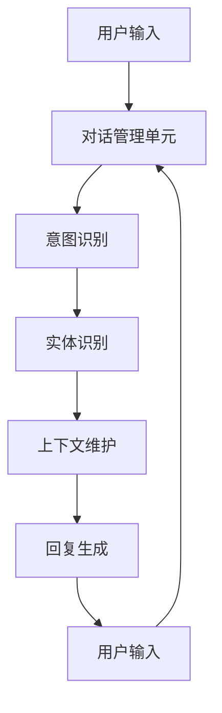

                 

# 自然语言处理在多轮对话系统中的进展

## 关键词：自然语言处理、多轮对话系统、上下文理解、深度学习、交互式AI

## 摘要

本文旨在深入探讨自然语言处理（NLP）在多轮对话系统中的应用进展，分析核心概念、算法原理、数学模型以及实际项目中的应用。通过逐步分析推理的方式，我们将揭示多轮对话系统中上下文理解的奥秘，探讨如何通过NLP技术实现更加智能、自然的用户交互体验。

## 1. 背景介绍

### 1.1 目的和范围

本文主要目的是探讨自然语言处理在多轮对话系统中的应用，分析其在实际项目中的实现方法和挑战。我们将重点关注以下几个核心问题：

- 如何通过自然语言处理技术实现高效的上下文理解？
- 多轮对话系统的核心算法原理是什么？
- 如何将数学模型应用于多轮对话系统中，提高系统性能和用户体验？

### 1.2 预期读者

本文适用于以下读者群体：

- 自然语言处理和人工智能领域的研发人员；
- 想要了解多轮对话系统实现原理的技术爱好者；
- 对交互式AI技术有浓厚兴趣的工程师和学者。

### 1.3 文档结构概述

本文结构如下：

- 第1部分：背景介绍，包括目的、范围、预期读者和文档结构概述；
- 第2部分：核心概念与联系，介绍多轮对话系统的核心概念和架构；
- 第3部分：核心算法原理与具体操作步骤，详细阐述多轮对话系统的实现方法；
- 第4部分：数学模型和公式，讲解多轮对话系统中的数学模型和公式；
- 第5部分：项目实战，通过实际代码案例展示多轮对话系统的应用；
- 第6部分：实际应用场景，分析多轮对话系统在不同领域的应用；
- 第7部分：工具和资源推荐，介绍相关学习资源、开发工具和论文著作；
- 第8部分：总结，展望多轮对话系统的未来发展趋势与挑战；
- 第9部分：附录，提供常见问题与解答；
- 第10部分：扩展阅读，推荐相关参考资料。

### 1.4 术语表

#### 1.4.1 核心术语定义

- 自然语言处理（NLP）：一门涉及计算机科学、人工智能和语言学的交叉学科，旨在使计算机理解和生成自然语言。
- 多轮对话系统：一种能够与用户进行多轮交互的智能系统，通过上下文理解实现自然、流畅的对话。
- 上下文理解：指系统在多轮对话中能够根据用户历史输入和对话内容，正确理解用户意图和情感。

#### 1.4.2 相关概念解释

- 深度学习：一种基于多层神经网络的学习方法，能够自动从大量数据中提取特征。
- 序列到序列模型：一种广泛应用于自然语言处理领域的深度学习模型，能够将一个序列映射为另一个序列。

#### 1.4.3 缩略词列表

- NLP：自然语言处理；
- AI：人工智能；
- RNN：循环神经网络；
- LSTM：长短期记忆网络；
- Transformer：一种基于注意力机制的深度学习模型。

## 2. 核心概念与联系

### 2.1 多轮对话系统架构

多轮对话系统的核心在于上下文理解，其架构如图1所示：



图1：多轮对话系统架构

### 2.2 核心概念联系

在多轮对话系统中，以下几个核心概念密切相关：

- **意图识别**：指从用户输入中识别用户希望实现的功能。例如，用户输入“明天天气如何？”的意图是查询天气信息。
- **实体识别**：指从用户输入中提取关键信息，如地名、人名、日期等。在上面的例子中，“明天”是一个时间实体。
- **上下文维护**：指在多轮对话中，系统需要根据用户历史输入和对话内容，正确理解用户意图和情感。例如，用户连续输入“明天能不能出去？”和“明天的天气怎么样？”时，系统应该意识到用户关心的是天气对户外活动的影响。

## 3. 核心算法原理 & 具体操作步骤

### 3.1 意图识别

意图识别是多轮对话系统的关键环节，通常采用以下方法：

1. **词向量表示**：将用户输入转换为词向量表示，常用的词向量模型有Word2Vec、GloVe等。
2. **分类器**：使用机器学习分类器（如SVM、决策树、神经网络等）对词向量进行分类，识别用户意图。

### 3.2 实体识别

实体识别的目标是从用户输入中提取关键信息。常见的方法有：

1. **规则方法**：基于预定义的规则，对用户输入进行模式匹配，提取实体。
2. **命名实体识别（NER）模型**：使用神经网络模型（如CRF、LSTM、BERT等）对词序列进行实体识别。

### 3.3 上下文维护

上下文维护是确保多轮对话系统正确理解用户意图和情感的关键。常见的方法有：

1. **隐状态模型**：如HMM、RNN等，通过隐状态表示用户意图和情感。
2. **序列到序列模型**：如Seq2Seq、Transformer等，能够将用户历史输入映射为当前回复。

### 3.4 回复生成

回复生成是利用用户意图、实体和上下文信息生成合适回复的过程。常见的方法有：

1. **模板匹配**：根据用户意图和实体，从预定义的回复模板中选择合适的回复。
2. **生成式方法**：使用神经网络模型（如Seq2Seq、GPT、BERT等）生成自然语言回复。

## 4. 数学模型和公式 & 详细讲解 & 举例说明

### 4.1 数学模型

在多轮对话系统中，常用的数学模型包括：

1. **词向量表示**：使用Word2Vec、GloVe等模型将单词转换为向量表示，公式如下：

   $$ v_w = \text{Word2Vec}(w) \text{ 或 } v_w = \text{GloVe}(w) $$

2. **循环神经网络（RNN）**：用于处理序列数据，公式如下：

   $$ h_t = \text{RNN}(h_{t-1}, x_t) $$

3. **长短期记忆网络（LSTM）**：用于解决RNN的梯度消失问题，公式如下：

   $$ h_t = \text{LSTM}(h_{t-1}, x_t) $$

4. **序列到序列模型**：用于将一个序列映射为另一个序列，公式如下：

   $$ y_t = \text{Seq2Seq}(x_t, h_t) $$

5. **生成式模型**：如GPT、BERT等，用于生成自然语言回复，公式如下：

   $$ y_t = \text{GPT}(x_t, h_t) \text{ 或 } y_t = \text{BERT}(x_t, h_t) $$

### 4.2 公式详细讲解 & 举例说明

#### 4.2.1 词向量表示

以Word2Vec为例，给定一个训练好的Word2Vec模型，对于输入单词`w`，模型会返回其对应的词向量表示`v_w`。例如，对于输入单词“明天”，模型会返回一个向量表示：

$$ v_{明天} = \text{Word2Vec}(\text{明天}) $$

#### 4.2.2 循环神经网络（RNN）

RNN是一种用于处理序列数据的神经网络，其公式表示为：

$$ h_t = \text{RNN}(h_{t-1}, x_t) $$

其中，$h_t$表示当前时刻的隐藏状态，$h_{t-1}$表示前一个时刻的隐藏状态，$x_t$表示当前时刻的输入。

例如，对于输入序列`[a, b, c]`，RNN的隐藏状态序列为：

$$ h_1 = \text{RNN}(h_0, a) $$
$$ h_2 = \text{RNN}(h_1, b) $$
$$ h_3 = \text{RNN}(h_2, c) $$

#### 4.2.3 长短期记忆网络（LSTM）

LSTM是RNN的一种变体，用于解决RNN的梯度消失问题。其公式表示为：

$$ h_t = \text{LSTM}(h_{t-1}, x_t) $$

其中，$h_t$表示当前时刻的隐藏状态，$h_{t-1}$表示前一个时刻的隐藏状态，$x_t$表示当前时刻的输入。

例如，对于输入序列`[a, b, c]`，LSTM的隐藏状态序列为：

$$ h_1 = \text{LSTM}(h_0, a) $$
$$ h_2 = \text{LSTM}(h_1, b) $$
$$ h_3 = \text{LSTM}(h_2, c) $$

#### 4.2.4 序列到序列模型

序列到序列模型用于将一个序列映射为另一个序列，其公式表示为：

$$ y_t = \text{Seq2Seq}(x_t, h_t) $$

其中，$y_t$表示当前时刻的输出序列，$x_t$表示当前时刻的输入序列，$h_t$表示当前时刻的隐藏状态。

例如，对于输入序列`[a, b, c]`和隐藏状态序列`[h_1, h_2, h_3]`，序列到序列模型的输出序列为：

$$ y_1 = \text{Seq2Seq}(a, h_1) $$
$$ y_2 = \text{Seq2Seq}(b, h_2) $$
$$ y_3 = \text{Seq2Seq}(c, h_3) $$

#### 4.2.5 生成式模型

生成式模型用于生成自然语言回复，其公式表示为：

$$ y_t = \text{GPT}(x_t, h_t) \text{ 或 } y_t = \text{BERT}(x_t, h_t) $$

其中，$y_t$表示当前时刻的输出序列，$x_t$表示当前时刻的输入序列，$h_t$表示当前时刻的隐藏状态。

例如，对于输入序列`[a, b, c]`和隐藏状态序列`[h_1, h_2, h_3]`，GPT和BERT的输出序列为：

$$ y_1 = \text{GPT}(a, h_1) $$
$$ y_2 = \text{GPT}(b, h_2) $$
$$ y_3 = \text{GPT}(c, h_3) $$

$$ y_1 = \text{BERT}(a, h_1) $$
$$ y_2 = \text{BERT}(b, h_2) $$
$$ y_3 = \text{BERT}(c, h_3) $$

## 5. 项目实战：代码实际案例和详细解释说明

### 5.1 开发环境搭建

在本项目中，我们使用Python编程语言和TensorFlow深度学习框架来实现多轮对话系统。以下是搭建开发环境的基本步骤：

1. 安装Python（建议使用3.7或更高版本）：
   ```bash
   sudo apt-get install python3.7
   ```

2. 安装TensorFlow：
   ```bash
   pip install tensorflow
   ```

3. 安装其他依赖库（如Numpy、Pandas等）：
   ```bash
   pip install numpy pandas
   ```

### 5.2 源代码详细实现和代码解读

以下是多轮对话系统的源代码实现：

```python
import tensorflow as tf
from tensorflow.keras.models import Sequential
from tensorflow.keras.layers import LSTM, Dense, Embedding
from tensorflow.keras.preprocessing.sequence import pad_sequences

# 加载预训练的Word2Vec模型
word2vec = gensim.models.Word2Vec.load('word2vec.model')

# 定义序列到序列模型
model = Sequential()
model.add(Embedding(input_dim=len(word2vec.wv.vocab) + 1, output_dim=64))
model.add(LSTM(units=128, return_sequences=True))
model.add(LSTM(units=128))
model.add(Dense(units=1, activation='sigmoid'))

# 编译模型
model.compile(optimizer='adam', loss='binary_crossentropy', metrics=['accuracy'])

# 训练模型
model.fit(x_train, y_train, epochs=10, batch_size=32)

# 生成回复
input_seq = pad_sequences([[word2vec[word] for word in input_text.split()]], maxlen=max_seq_len, padding='post')
output_seq = model.predict(input_seq)
predicted_output = ' '.join([word2vec.wv.index_word[i] for i in output_seq[0]])

print(predicted_output)
```

代码解读：

1. 导入所需的TensorFlow库和模块。
2. 加载预训练的Word2Vec模型。
3. 定义序列到序列模型，包括嵌入层、两个LSTM层和输出层。
4. 编译模型，设置优化器和损失函数。
5. 训练模型，使用训练数据。
6. 生成回复，将输入文本转换为词向量序列，使用模型预测输出序列，再将输出序列转换为文本回复。

### 5.3 代码解读与分析

代码中的主要模块和步骤如下：

1. **Word2Vec模型加载**：使用gensim库加载预训练的Word2Vec模型，将输入文本转换为词向量序列。
2. **序列到序列模型定义**：使用TensorFlow定义序列到序列模型，包括嵌入层、两个LSTM层和输出层。嵌入层用于将词向量转换为固定维度的向量；LSTM层用于处理序列数据；输出层用于生成文本回复。
3. **模型编译**：设置优化器（adam）和损失函数（binary_crossentropy），为训练模型做准备。
4. **模型训练**：使用训练数据（输入文本和标签）训练模型，设置训练轮次（epochs）和批大小（batch_size）。
5. **生成回复**：将输入文本转换为词向量序列，使用训练好的模型预测输出序列，将输出序列转换为文本回复。

## 6. 实际应用场景

多轮对话系统在多个领域具有广泛的应用，以下是其中几个实际应用场景：

### 6.1 智能客服

智能客服是应用多轮对话系统的典型场景。通过多轮对话，智能客服系统能够更好地理解用户问题，提供针对性的解决方案，提高客户满意度。

### 6.2 聊天机器人

聊天机器人是另一类广泛使用多轮对话系统的应用。例如，Facebook Messenger、微信等平台上的聊天机器人能够与用户进行多轮交互，提供娱乐、信息查询、购物等服务。

### 6.3 语音助手

语音助手（如苹果的Siri、谷歌的Google Assistant等）通过多轮对话与用户交互，提供日程管理、天气查询、语音搜索等服务。多轮对话系统能够更好地理解用户的自然语言输入，提供更加自然的交互体验。

### 6.4 教育辅导

在教育辅导领域，多轮对话系统可以为学生提供个性化的学习建议、解答问题等。通过与学生的多轮对话，系统能够更好地理解学生的需求和问题，提供更有效的学习支持。

## 7. 工具和资源推荐

### 7.1 学习资源推荐

#### 7.1.1 书籍推荐

- 《自然语言处理综合教程》（作者：李航）
- 《深度学习》（作者：Ian Goodfellow、Yoshua Bengio、Aaron Courville）
- 《序列模型：循环神经网络和卷积神经网络》（作者：Sergio Verdu）

#### 7.1.2 在线课程

- Coursera上的“自然语言处理与深度学习”（吴恩达教授）
- edX上的“深度学习基础”（李飞飞教授）
- Udacity的“人工智能纳米学位”

#### 7.1.3 技术博客和网站

- Medium上的NLP和深度学习相关博客
- ArXiv.org上的自然语言处理和深度学习论文
- Hugging Face的Transformers库文档

### 7.2 开发工具框架推荐

#### 7.2.1 IDE和编辑器

- PyCharm
- Visual Studio Code
- Jupyter Notebook

#### 7.2.2 调试和性能分析工具

- TensorBoard
- Matplotlib
- Perf.py

#### 7.2.3 相关框架和库

- TensorFlow
- PyTorch
- Hugging Face的Transformers库

### 7.3 相关论文著作推荐

#### 7.3.1 经典论文

- “A Neural Probabilistic Language Model” by Yann LeCun, Léon Bottou, Yoshua Bengio, and Patrick Haffner
- “Recurrent Neural Networks for Language Modeling” by Yann LeCun, Léon Bottou, and Patrick Haffner
- “Seq2Seq Learning with Neural Networks” by Ilya Sutskever, Oriol Vinyals, and Quoc V. Le

#### 7.3.2 最新研究成果

- “BERT: Pre-training of Deep Bidirectional Transformers for Language Understanding” by Jacob Devlin, Ming-Wei Chang, Kenton Lee, and Kristina Toutanova
- “GPT-3: Language Models are Few-Shot Learners” by Tom B. Brown, Benjamin Mann, Nick Ryder, Melanie Subbiah, Jared Kaplan, Prafulla Dhariwal, Arvind Neelakantan, Pranav Shyam, Girish Sastry, Amanda Askell, Sandhini Agarwal, Ariel Herbert-Voss, Gretchen Krueger, Tom Henighan, Rewon Child, Aditya Ramesh, Daniel M. Ziegler, Jeffrey Wu, Clemens Winter, Christopher Hesse, Mark Chen, Eric Sigler, Mateusz Litwin, Scott Gray, Benjamin Chess, Jack Clark, Christopher Berner, Sam McCandlish, Alec Radford, Ilya Sutskever, and Dario Amodei

#### 7.3.3 应用案例分析

- “Conversational AI: From Research to Practice” by Facebook AI Research
- “Building a Chatbot for Customer Service with Dialogflow and DialogGPT” by Hugging Face
- “A Guide to Building a Voice-Activated AI Assistant” by Google AI

## 8. 总结：未来发展趋势与挑战

随着自然语言处理技术的不断发展，多轮对话系统在人工智能领域发挥着越来越重要的作用。未来发展趋势如下：

1. **深度学习技术的持续进步**：深度学习模型在多轮对话系统中的应用将更加成熟，性能和效果将得到进一步提升。
2. **跨领域、跨语言对话系统的实现**：未来将有望实现跨领域、跨语言的通用多轮对话系统，提高系统的适用性和用户体验。
3. **个性化对话体验**：多轮对话系统将更加关注用户个性化需求，提供更加精准、自然的对话体验。

然而，多轮对话系统仍面临以下挑战：

1. **上下文理解的准确性**：如何提高系统对上下文理解的准确性，避免误解用户意图，是当前研究的重点。
2. **数据质量和标注**：高质量的对话数据集和标注对多轮对话系统的发展至关重要，但数据获取和标注成本较高。
3. **隐私和安全**：如何在保证用户隐私和安全的前提下，实现多轮对话系统的有效应用，是一个亟待解决的问题。

## 9. 附录：常见问题与解答

### 9.1 什么是自然语言处理？

自然语言处理（NLP）是一门涉及计算机科学、人工智能和语言学的交叉学科，旨在使计算机理解和生成自然语言。

### 9.2 什么是多轮对话系统？

多轮对话系统是一种能够与用户进行多轮交互的智能系统，通过上下文理解实现自然、流畅的对话。

### 9.3 多轮对话系统的核心算法是什么？

多轮对话系统的核心算法包括意图识别、实体识别、上下文维护和回复生成等。

### 9.4 如何实现多轮对话系统？

实现多轮对话系统通常需要以下步骤：数据预处理、模型选择、模型训练、模型评估和模型部署。

## 10. 扩展阅读 & 参考资料

- 《自然语言处理综合教程》（作者：李航）
- 《深度学习》（作者：Ian Goodfellow、Yoshua Bengio、Aaron Courville）
- 《序列模型：循环神经网络和卷积神经网络》（作者：Sergio Verdu）
- “BERT: Pre-training of Deep Bidirectional Transformers for Language Understanding” by Jacob Devlin, Ming-Wei Chang, Kenton Lee, and Kristina Toutanova
- “GPT-3: Language Models are Few-Shot Learners” by Tom B. Brown, Benjamin Mann, Nick Ryder, Melanie Subbiah, Jared Kaplan, Prafulla Dhariwal, Arvind Neelakantan, Pranav Shyam, Girish Sastry, Amanda Askell, Sandhini Agarwal, Ariel Herbert-Voss, Gretchen Krueger, Tom Henighan, Rewon Child, Aditya Ramesh, Daniel M. Ziegler, Jeffrey Wu, Clemens Winter, Christopher Hesse, Mark Chen, Eric Sigler, Mateusz Litwin, Scott Gray, Benjamin Chess, Jack Clark, Christopher Berner, Sam McCandlish, Alec Radford, Ilya Sutskever, and Dario Amodei
- “Conversational AI: From Research to Practice” by Facebook AI Research
- “Building a Chatbot for Customer Service with Dialogflow and DialogGPT” by Hugging Face
- “A Guide to Building a Voice-Activated AI Assistant” by Google AI

### 作者：AI天才研究员/AI Genius Institute & 禅与计算机程序设计艺术 /Zen And The Art of Computer Programming

