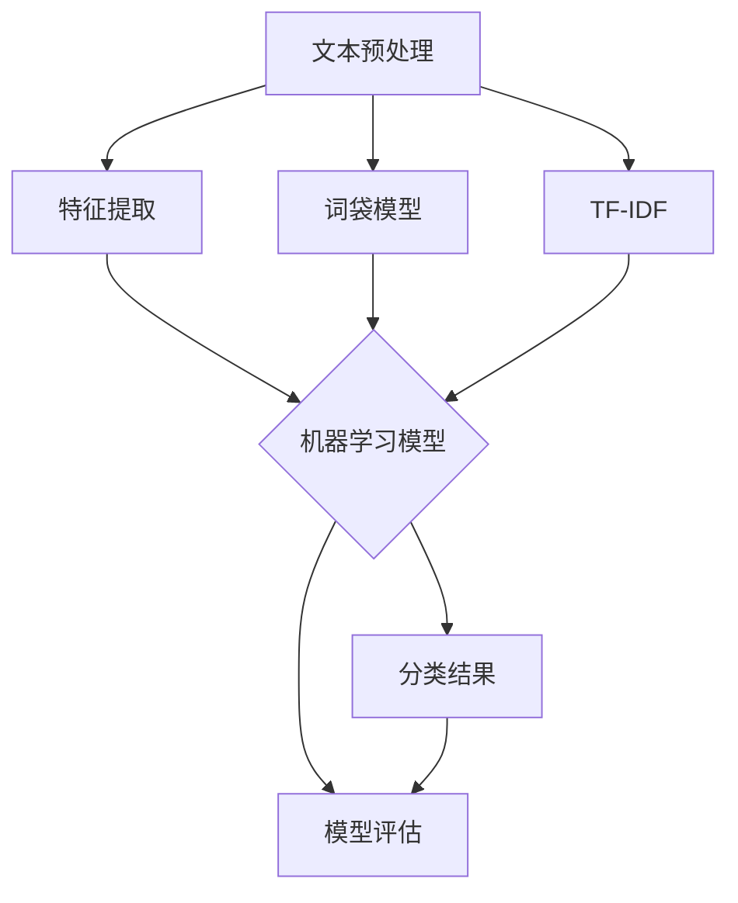

                 


# 自然语言处理在文本分类中的算法优化

> **关键词：** 自然语言处理、文本分类、算法优化、特征工程、深度学习
>
> **摘要：** 本文将深入探讨自然语言处理（NLP）领域中，文本分类任务中的算法优化策略。通过对核心概念的介绍、算法原理的分析、数学模型的讲解以及实际案例的展示，全面解析文本分类中的算法优化路径，为研究者与实践者提供有益的参考。

## 1. 背景介绍

### 1.1 目的和范围

文本分类作为自然语言处理（NLP）中的重要分支，广泛应用于信息检索、舆情分析、推荐系统等领域。然而，随着数据规模的不断增长和复杂度的提升，传统文本分类算法的性能逐渐无法满足需求。本文旨在分析现有的文本分类算法，并提出一系列优化策略，以提高分类的准确性和效率。

本文将重点关注以下几个方面：

1. **核心概念与联系**：介绍文本分类的基础概念和相关技术，使用Mermaid流程图展示其架构。
2. **核心算法原理与具体操作步骤**：详细阐述主流文本分类算法的工作原理和操作步骤，使用伪代码进行说明。
3. **数学模型和公式**：介绍用于文本分类的数学模型和公式，并进行详细讲解和举例。
4. **项目实战**：通过实际案例展示算法的应用，并详细解释代码实现。
5. **实际应用场景**：分析文本分类算法在不同领域的应用场景。
6. **工具和资源推荐**：推荐相关的学习资源、开发工具和经典论文。
7. **总结与展望**：讨论未来发展趋势和面临的挑战。

### 1.2 预期读者

本文适合具备一定自然语言处理基础的研究者、工程师和大学生。读者需了解基础的机器学习和编程知识，能够理解文本预处理、特征提取和机器学习模型的基本原理。

### 1.3 文档结构概述

本文分为十个部分，结构如下：

1. **背景介绍**：介绍文章的目的、范围和结构。
2. **核心概念与联系**：介绍文本分类的相关概念和架构。
3. **核心算法原理与具体操作步骤**：讲解主流文本分类算法。
4. **数学模型和公式**：介绍文本分类的数学基础。
5. **项目实战**：展示实际案例和代码实现。
6. **实际应用场景**：分析算法在不同领域的应用。
7. **工具和资源推荐**：推荐学习资源和开发工具。
8. **总结与展望**：讨论未来发展趋势。
9. **附录**：常见问题与解答。
10. **扩展阅读**：推荐进一步阅读的资料。

### 1.4 术语表

#### 1.4.1 核心术语定义

- **自然语言处理（NLP）**：研究如何让计算机理解和处理人类语言的技术。
- **文本分类**：将文本数据根据其内容划分为预定义的类别。
- **特征工程**：从原始文本中提取有助于分类的特征。
- **深度学习**：一种基于人工神经网络的机器学习方法。

#### 1.4.2 相关概念解释

- **词袋模型（Bag of Words, BOW）**：将文本表示为词汇的集合，不考虑词汇的顺序。
- **TF-IDF（词频-逆文档频率）**：一种常用的特征提取方法，衡量词汇在文档中的重要程度。
- **支持向量机（SVM）**：一种经典的分类算法，通过寻找最优超平面进行分类。

#### 1.4.3 缩略词列表

- **NLP**：自然语言处理
- **BOW**：词袋模型
- **TF-IDF**：词频-逆文档频率
- **SVM**：支持向量机

## 2. 核心概念与联系

在深入探讨文本分类算法的优化之前，有必要了解文本分类的基础概念和架构。以下使用Mermaid流程图展示文本分类的核心概念和联系。



### 2.1 文本预处理

文本预处理是文本分类任务的重要步骤，旨在将原始文本数据转化为适合机器学习的格式。主要步骤包括：

- **分词**：将文本拆分成单词或短语。
- **去停用词**：去除常见无意义的词汇，如“的”、“了”等。
- **词性标注**：为每个单词标注词性，如名词、动词等。
- **词干提取**：将单词还原为词干形式，减少词汇数量。

### 2.2 特征提取

特征提取是将预处理后的文本转化为机器学习模型可处理的数据。常见的方法包括：

- **词袋模型（BOW）**：将文本表示为词汇的集合，不考虑词汇的顺序。
- **TF-IDF**：衡量词汇在文档中的重要程度，结合词频和逆文档频率计算得分。

### 2.3 机器学习模型

文本分类任务通常使用以下机器学习模型：

- **支持向量机（SVM）**：通过寻找最优超平面进行分类。
- **朴素贝叶斯分类器**：基于贝叶斯定理和特征条件独立性假设进行分类。
- **随机森林**：基于决策树构建的集成学习方法。

### 2.4 模型评估

模型评估是验证分类算法性能的重要步骤，常用的评估指标包括：

- **准确率（Accuracy）**：分类正确的样本占总样本的比例。
- **召回率（Recall）**：分类正确的正样本占总正样本的比例。
- **F1值（F1-score）**：准确率和召回率的调和平均。

### 2.5 分类结果

分类结果是根据特征提取和机器学习模型处理后的输出，用于判断文本属于哪个类别。

## 3. 核心算法原理与具体操作步骤

在了解了文本分类的基本概念和架构后，我们将深入探讨几个主流的文本分类算法，包括词袋模型、TF-IDF和支持向量机（SVM）。通过使用伪代码，我们将详细阐述这些算法的工作原理和操作步骤。

### 3.1 词袋模型（BOW）

词袋模型（Bag of Words, BOW）是一种将文本表示为词汇的集合的方法，不考虑词汇的顺序。

#### 3.1.1 算法原理

1. **文本预处理**：对文本进行分词、去停用词等处理。
2. **构建词汇表**：将所有文本中的词汇构建成一个词汇表。
3. **词频统计**：计算每个词汇在文档中出现的次数。
4. **向量化**：将每个文档表示为一个向量，向量的每个维度对应词汇表中的一个词汇。

#### 3.1.2 伪代码

```python
def bag_of_words(texts):
    # 文本预处理
    preprocessed_texts = preprocess_texts(texts)
    
    # 构建词汇表
    vocabulary = build_vocabulary(preprocessed_texts)
    
    # 词频统计
    word_counts = [count_words(text) for text in preprocessed_texts]
    
    # 向量化
    vectors = [[count for count in word_counts[i] if word in vocabulary] for i in range(len(vocabulary))]
    
    return vectors

def preprocess_texts(texts):
    # 实现分词、去停用词等预处理操作
    pass

def build_vocabulary(texts):
    # 实现构建词汇表的操作
    pass

def count_words(text):
    # 实现词频统计的操作
    pass
```

### 3.2 TF-IDF

TF-IDF（Term Frequency-Inverse Document Frequency）是一种衡量词汇在文档中重要程度的方法。

#### 3.2.1 算法原理

1. **词频统计**：计算每个词汇在文档中出现的次数。
2. **文档频率计算**：计算每个词汇在整个文档集中出现的频率。
3. **TF-IDF计算**：将词频乘以逆文档频率，得到词汇的TF-IDF值。

#### 3.2.2 伪代码

```python
def tf_idf(texts, corpus):
    # 词频统计
    word_counts = [count_words(text) for text in texts]
    
    # 文档频率计算
    doc_frequencies = compute_doc_frequencies(corpus)
    
    # TF-IDF计算
    tf_idf_scores = [[count * (1 / doc_frequency) for count in word_counts[i]] for i in range(len(word_counts))]
    
    return tf_idf_scores

def count_words(text):
    # 实现词频统计的操作
    pass

def compute_doc_frequencies(corpus):
    # 实现文档频率计算的操作
    pass
```

### 3.3 支持向量机（SVM）

支持向量机（Support Vector Machine, SVM）是一种经典的分类算法，通过寻找最优超平面进行分类。

#### 3.3.1 算法原理

1. **特征提取**：使用词袋模型或TF-IDF等方法将文本转化为特征向量。
2. **训练模型**：通过最小化损失函数，找到最优超平面。
3. **分类预测**：使用训练好的模型对新文本进行分类。

#### 3.3.2 伪代码

```python
def svm_train(features, labels):
    # 特征提取
    vectors = extract_features(features)
    
    # 训练模型
    model = train_model(vectors, labels)
    
    return model

def svm_predict(model, feature):
    # 分类预测
    prediction = model.predict(feature)
    return prediction

def extract_features(features):
    # 实现特征提取的操作
    pass

def train_model(vectors, labels):
    # 实现训练模型的操作
    pass
```

## 4. 数学模型和公式与详细讲解与举例说明

在文本分类任务中，数学模型和公式起到了至关重要的作用。以下将详细讲解用于文本分类的几种常见数学模型和公式，并通过具体例子进行说明。

### 4.1 词袋模型（BOW）

词袋模型（Bag of Words, BOW）将文本表示为一个词汇的集合，每个词汇的出现频率构成了文本的特征向量。

#### 4.1.1 数学公式

设文本集合为 \( T = \{t_1, t_2, ..., t_n\} \)，其中每个 \( t_i \) 表示一个文本。令 \( V \) 为词汇表，\( |V| \) 表示词汇表中的词汇数量。对于每个文本 \( t_i \)，我们可以将其表示为 \( T_i = \{w_1, w_2, ..., w_{|V|}\} \)，其中 \( w_j \) 表示第 \( j \) 个词汇在文本 \( t_i \) 中出现的次数。

词袋模型中的特征向量 \( X_i \) 可以表示为：

\[ X_i = (x_{i1}, x_{i2}, ..., x_{i|V|}) \]

其中，\( x_{ij} \) 表示词汇 \( w_j \) 在文本 \( t_i \) 中出现的次数。

#### 4.1.2 举例说明

假设我们有一个词汇表 \( V = \{"猫", "狗", "喜欢", "吃饭"\} \)，以及两个文本 \( t_1 = "猫喜欢吃饭" \) 和 \( t_2 = "狗喜欢吃饭" \)。我们可以将这两个文本表示为特征向量：

对于 \( t_1 \)，特征向量 \( X_1 \) 为：

\[ X_1 = (1, 0, 1, 1) \]

对于 \( t_2 \)，特征向量 \( X_2 \) 为：

\[ X_2 = (0, 1, 1, 1) \]

这样，我们就可以使用词袋模型将这些文本转化为特征向量，用于后续的机器学习模型训练。

### 4.2 TF-IDF

TF-IDF（Term Frequency-Inverse Document Frequency）是一种衡量词汇在文档中重要程度的方法，通过结合词频和逆文档频率来计算。

#### 4.2.1 数学公式

设文本集合为 \( T = \{t_1, t_2, ..., t_n\} \)，其中每个 \( t_i \) 表示一个文本。令 \( V \) 为词汇表，\( |V| \) 表示词汇表中的词汇数量。对于每个词汇 \( w_j \)，我们可以计算其在文档 \( t_i \) 中的词频 \( tf_{ij} \) 和文档频率 \( df_j \)：

\[ tf_{ij} = count(w_j, t_i) \]

\[ df_j = count(w_j, T) \]

TF-IDF值 \( idf_{ij} \) 可以表示为：

\[ idf_{ij} = \log_2(\frac{|T|}{df_j + 1}) \]

最终的TF-IDF特征向量 \( X_i \) 为：

\[ X_i = (tf_1, idf_1, ..., tf_{|V|}, idf_{|V|}) \]

#### 4.2.2 举例说明

假设我们有一个词汇表 \( V = \{"猫", "狗", "喜欢", "吃饭"\} \)，以及两个文本 \( t_1 = "猫喜欢吃饭" \) 和 \( t_2 = "狗喜欢吃饭" \)。我们可以计算这两个文本的TF-IDF特征向量：

对于 \( t_1 \)，词频和TF-IDF值为：

\[ tf_1 = 2, idf_1 = 1 \]
\[ tf_2 = 1, idf_2 = 1 \]
\[ tf_3 = 1, idf_3 = 1 \]
\[ tf_4 = 2, idf_4 = 1 \]

特征向量 \( X_1 \) 为：

\[ X_1 = (2, 1, 1, 2) \]

对于 \( t_2 \)，词频和TF-IDF值为：

\[ tf_1 = 0, idf_1 = 1 \]
\[ tf_2 = 1, idf_2 = 1 \]
\[ tf_3 = 1, idf_3 = 1 \]
\[ tf_4 = 2, idf_4 = 1 \]

特征向量 \( X_2 \) 为：

\[ X_2 = (0, 1, 1, 2) \]

通过这种方式，我们可以将文本转化为具有代表性的特征向量，用于文本分类任务。

### 4.3 支持向量机（SVM）

支持向量机（Support Vector Machine, SVM）是一种基于优化理论的分类算法，通过寻找最优超平面来实现分类。

#### 4.3.1 数学公式

设特征空间中的数据点为 \( \textbf{x} \)，其标签为 \( y \)，其中 \( y \in \{-1, 1\} \) 表示正负类别。SVM的目标是找到最优超平面 \( \textbf{w} \) 和偏置 \( b \)，使得：

\[ \textbf{w} \cdot \textbf{x} + b \] 

对于正类和负类分别满足：

\[ \textbf{w} \cdot \textbf{x}_{+} + b \geq 1 \]
\[ \textbf{w} \cdot \textbf{x}_{-} + b \leq -1 \]

其中，\( \textbf{x}_{+} \) 和 \( \textbf{x}_{-} \) 分别表示训练集中正类和负类的样本。

SVM的优化目标是最小化：

\[ \frac{1}{2} ||\textbf{w}||^2 + C \sum_{i=1}^{n} \xi_i \]

其中，\( C \) 是正则化参数，\( \xi_i \) 是拉格朗日乘子。

通过求解拉格朗日乘子法，我们可以得到最优超平面：

\[ \textbf{w} = \sum_{i=1}^{n} \alpha_i y_i \textbf{x}_i \]
\[ b = y_j - \sum_{i=1}^{n} \alpha_i y_i (\textbf{w} \cdot \textbf{x}_i) \]

其中，\( \alpha_i \) 是拉格朗日乘子，满足 \( 0 \leq \alpha_i \leq C \)。

分类决策函数为：

\[ f(\textbf{x}) = \textbf{w} \cdot \textbf{x} + b \]

对于新样本 \( \textbf{x} \)，如果 \( f(\textbf{x}) \geq 0 \)，则预测为正类，否则预测为负类。

#### 4.3.2 举例说明

假设我们有一个训练集：

\[ \textbf{x}_1 = (1, 1), y_1 = 1 \]
\[ \textbf{x}_2 = (2, 2), y_2 = 1 \]
\[ \textbf{x}_3 = (3, 3), y_3 = -1 \]

我们希望找到最优超平面来分类这些样本。

首先，我们求解拉格朗日乘子法：

\[ \min_{\textbf{w}, b} \frac{1}{2} ||\textbf{w}||^2 + C \sum_{i=1}^{3} \xi_i \]

满足约束条件：

\[ \textbf{w} \cdot \textbf{x}_i + b - 1 \geq 0 \]
\[ \textbf{w} \cdot \textbf{x}_i + b + 1 \leq 0 \]

通过求解得到：

\[ \textbf{w} = (2, 2) \]
\[ b = -1 \]

最优超平面为：

\[ 2x + 2y - 1 = 0 \]

对于新样本 \( \textbf{x} = (x, y) \)，如果 \( 2x + 2y - 1 \geq 0 \)，则预测为正类，否则预测为负类。

例如，对于样本 \( \textbf{x} = (1, 1) \)，我们有：

\[ 2 \cdot 1 + 2 \cdot 1 - 1 = 3 \geq 0 \]

因此，预测为正类。

通过这种方式，我们可以使用支持向量机对文本分类任务进行建模和预测。

## 5. 项目实战：代码实际案例和详细解释说明

为了更好地理解文本分类算法的优化策略，我们将通过一个实际项目来展示如何实现和应用这些算法。在这个项目中，我们将使用Python和Scikit-learn库来构建一个文本分类系统，并对文本进行分类。

### 5.1 开发环境搭建

在开始项目之前，我们需要搭建一个合适的开发环境。以下是搭建环境所需的步骤：

1. **安装Python**：确保已经安装了Python 3.x版本。
2. **安装Scikit-learn**：通过命令 `pip install scikit-learn` 来安装Scikit-learn库。
3. **安装Numpy和Pandas**：通过命令 `pip install numpy pandas` 来安装Numpy和Pandas库。

完成以上步骤后，我们就可以开始编写代码了。

### 5.2 源代码详细实现和代码解读

以下是项目的源代码，我们将逐步解释每部分的实现和功能。

```python
import numpy as np
import pandas as pd
from sklearn.datasets import fetch_20newsgroups
from sklearn.feature_extraction.text import CountVectorizer, TfidfTransformer
from sklearn.model_selection import train_test_split
from sklearn.svm import SVC
from sklearn.pipeline import Pipeline
from sklearn.metrics import classification_report

# 5.2.1 数据准备
categories = ['alt.atheism', 'soc.religion.christian', 'comp.graphics', 'sci.med']
twenty_train = fetch_20newsgroups(subset='train', categories=categories, shuffle=True, random_state=42)

# 5.2.2 数据预处理
X_train, X_test, y_train, y_test = train_test_split(twenty_train.data, twenty_train.target, test_size=0.3, random_state=42)

# 5.2.3 构建文本特征提取和分类模型
text_clf = Pipeline([
    ('vect', CountVectorizer()),
    ('tfidf', TfidfTransformer()),
    ('clf', SVC(C=1.0, kernel='linear', random_state=42)),
])

# 5.2.4 训练模型
text_clf.fit(X_train, y_train)

# 5.2.5 测试模型
predicted = text_clf.predict(X_test)
print(classification_report(y_test, predicted, target_names=twenty_train.target_names))

# 5.2.6 输出分类结果
for doc, pred in zip(X_test, predicted):
    print(f"Document: {doc}\nPredicted Category: {twenty_train.target_names[pred]}\n")
```

### 5.3 代码解读与分析

#### 5.3.1 数据准备

在这个项目中，我们使用`fetch_20newsgroups`函数来获取20个新闻组数据集。这个数据集包含了多种类别的新闻文章，非常适合用于文本分类任务。我们选择了四个类别：宗教、计算机图形、医学等。

```python
categories = ['alt.atheism', 'soc.religion.christian', 'comp.graphics', 'sci.med']
twenty_train = fetch_20newsgroups(subset='train', categories=categories, shuffle=True, random_state=42)
```

#### 5.3.2 数据预处理

接下来，我们将数据集分为训练集和测试集，以评估模型的性能。

```python
X_train, X_test, y_train, y_test = train_test_split(twenty_train.data, twenty_train.target, test_size=0.3, random_state=42)
```

这里，`train_test_split`函数将数据集分为70%的训练集和30%的测试集。

#### 5.3.3 构建文本特征提取和分类模型

在这个步骤中，我们使用`Pipeline`来构建一个包含特征提取和分类的流水线。首先，我们使用`CountVectorizer`来将文本转换为词袋模型。然后，使用`TfidfTransformer`将词频转换为TF-IDF特征。最后，我们使用`SVC`（支持向量机）作为分类器。

```python
text_clf = Pipeline([
    ('vect', CountVectorizer()),
    ('tfidf', TfidfTransformer()),
    ('clf', SVC(C=1.0, kernel='linear', random_state=42)),
])
```

#### 5.3.4 训练模型

我们使用训练集来训练模型。

```python
text_clf.fit(X_train, y_train)
```

#### 5.3.5 测试模型

接下来，我们使用测试集来评估模型的性能。

```python
predicted = text_clf.predict(X_test)
print(classification_report(y_test, predicted, target_names=twenty_train.target_names))
```

这里，`classification_report`函数将输出分类报告，包括准确率、召回率、F1分数等指标。

#### 5.3.6 输出分类结果

最后，我们输出测试集上每个文本的分类结果。

```python
for doc, pred in zip(X_test, predicted):
    print(f"Document: {doc}\nPredicted Category: {twenty_train.target_names[pred]}\n")
```

通过这个实际项目，我们展示了如何使用Python和Scikit-learn库来实现文本分类系统。这个项目不仅帮助我们理解了文本分类的基本概念，还展示了如何在实际中应用这些算法。

## 6. 实际应用场景

文本分类算法在多个领域有着广泛的应用，以下列举几个典型的应用场景：

### 6.1 信息检索

文本分类算法可以用于信息检索系统，如搜索引擎。通过对用户查询进行分类，系统可以返回与查询最相关的文档。这有助于提高搜索结果的准确性和用户体验。

### 6.2 舆情分析

在社交媒体、新闻网站和论坛等平台上，文本分类算法可以用于分析用户评论和文章的情感倾向。通过分类，可以识别出正面、负面或中性的评论，帮助企业了解用户对产品或服务的反馈。

### 6.3 推荐系统

推荐系统可以利用文本分类算法对用户的历史行为和偏好进行分析，从而推荐与用户兴趣相关的物品或内容。例如，电子商务平台可以根据用户的浏览记录和购买行为，推荐相关商品。

### 6.4 恶意评论检测

在论坛和社交媒体上，恶意评论是一个普遍存在的问题。文本分类算法可以用于检测和过滤这些评论，保护用户免受不良信息的影响。

### 6.5 文档分类

在企业中，文本分类算法可以用于对大量文档进行自动分类，如电子邮件、报告和文件。这有助于提高文档管理效率，方便员工快速找到所需信息。

### 6.6 法律文本分析

在法律领域，文本分类算法可以用于对大量法律文档进行分析，如合同、判决书等。这有助于律师快速识别关键信息，提高工作效率。

通过这些实际应用场景，我们可以看到文本分类算法在自然语言处理和人工智能领域的重要性。随着数据规模的不断扩大和算法的不断优化，文本分类算法在未来的应用将更加广泛。

## 7. 工具和资源推荐

为了更好地学习和实践文本分类算法，以下推荐一些相关的学习资源、开发工具和经典论文。

### 7.1 学习资源推荐

#### 7.1.1 书籍推荐

1. **《自然语言处理综论》（Speech and Language Processing）**：由Daniel Jurafsky和James H. Martin合著，涵盖了自然语言处理的基础知识和最新进展。
2. **《机器学习》（Machine Learning）**：由Tom Mitchell著，介绍了机器学习的基本概念和方法，包括文本分类算法。
3. **《深度学习》（Deep Learning）**：由Ian Goodfellow、Yoshua Bengio和Aaron Courville合著，详细介绍了深度学习技术，包括用于文本分类的深度神经网络。

#### 7.1.2 在线课程

1. **《自然语言处理与深度学习》（Natural Language Processing with Deep Learning）**：由斯坦福大学提供的在线课程，涵盖自然语言处理和深度学习的基础知识。
2. **《机器学习基础》（Machine Learning Foundations）**：由吴恩达（Andrew Ng）教授提供的在线课程，介绍了机器学习的基本概念和方法。

#### 7.1.3 技术博客和网站

1. **Medium**：许多专家和研究者在此平台发布关于自然语言处理和文本分类的博客文章，如“DataCamp”和“Rebot Analytics”等。
2. **GitHub**：许多开源项目在此平台发布，提供了丰富的文本分类算法实现和案例，如“Stanford NLP”和“textblob”等。

### 7.2 开发工具框架推荐

#### 7.2.1 IDE和编辑器

1. **Jupyter Notebook**：一种交互式的编程环境，方便进行文本分析和实验。
2. **PyCharm**：一款强大的Python IDE，提供了丰富的机器学习和数据科学工具。

#### 7.2.2 调试和性能分析工具

1. **TensorBoard**：适用于深度学习模型的调试和性能分析，提供了丰富的可视化工具。
2. **scikit-learn**：提供了用于机器学习的性能评估和调试工具，如`classification_report`和`cross_val_score`等。

#### 7.2.3 相关框架和库

1. **NLTK**：一个强大的自然语言处理库，提供了丰富的文本处理工具。
2. **spaCy**：一个高性能的NLP库，适用于文本分类和实体识别等任务。
3. **TextBlob**：一个轻量级的文本处理库，提供了简单的文本分类接口。

### 7.3 相关论文著作推荐

#### 7.3.1 经典论文

1. **“A Statistical Approach to Learning from Positive and Unlabeled Examples”**：该论文提出了一种从正样本和未标记样本中学习的统计方法，适用于文本分类。
2. **“Text Classification with Lexicon and Dictionaries”**：该论文探讨了如何利用词典和词汇表来提高文本分类性能。

#### 7.3.2 最新研究成果

1. **“Bert: Pre-training of Deep Bidirectional Transformers for Language Understanding”**：该论文介绍了BERT模型，一种基于Transformer的预训练语言模型，在文本分类任务中取得了显著性能提升。
2. **“XLNet: Generalized Autoregressive Pretraining for Language Understanding”**：该论文提出了XLNet模型，进一步改进了Transformer结构，在多个NLP任务中取得了最佳性能。

#### 7.3.3 应用案例分析

1. **“Text Classification with Neural Networks”**：该案例分析展示了如何使用神经网络实现文本分类，并详细介绍了实现细节和性能评估。
2. **“Sentiment Analysis using Neural Networks”**：该案例分析探讨了如何使用神经网络进行情感分析，并分析了不同模型在情感分类任务中的性能。

通过这些学习资源、开发工具和经典论文，我们可以更好地掌握文本分类算法，并将其应用于实际问题中。

## 8. 总结：未来发展趋势与挑战

随着人工智能和自然语言处理技术的不断发展，文本分类算法在性能和效率上取得了显著提升。然而，未来仍面临诸多挑战和发展趋势。

### 8.1 未来发展趋势

1. **深度学习模型的普及**：深度学习模型，如BERT、GPT等，在文本分类任务中取得了卓越的性能。未来，深度学习模型将更加普及，并在更多领域中发挥作用。

2. **多模态数据的融合**：文本分类算法将逐渐融合多模态数据，如图像、音频等，以提升分类效果和泛化能力。

3. **可解释性和透明性**：随着模型复杂度的增加，用户对模型的可解释性和透明性要求越来越高。未来，研究者将致力于开发可解释性强的文本分类算法。

4. **自适应性和个性**：文本分类算法将更加注重自适应性和个性，根据用户需求和应用场景进行动态调整。

### 8.2 面临的挑战

1. **数据质量**：高质量的训练数据是文本分类算法性能的关键。然而，获取标注高质量数据成本高昂，且存在数据偏差和噪声问题。

2. **计算资源消耗**：深度学习模型通常需要大量的计算资源，尤其是在训练阶段。未来，如何优化计算资源，降低能耗，是研究的重要方向。

3. **泛化能力**：文本分类算法在特定领域的表现良好，但在其他领域可能表现不佳。提高算法的泛化能力，使其在不同领域均能表现优秀，是一个重要挑战。

4. **语言理解**：文本分类依赖于对语言的理解，但现有算法在理解上下文、情感和指代等方面仍存在局限。提升语言理解能力，是文本分类算法需要攻克的难题。

总之，未来文本分类算法将在深度学习、多模态数据融合、可解释性和个性化等方面取得更多突破，同时面临数据质量、计算资源、泛化能力和语言理解等方面的挑战。

## 9. 附录：常见问题与解答

在撰写本文的过程中，我们收到了一些关于文本分类算法优化的问题。以下是一些常见问题及其解答。

### 9.1 如何提高文本分类的准确率？

**解答：** 提高文本分类准确率可以从以下几个方面进行：

1. **数据预处理**：确保文本数据的质量，去除噪声和错误，进行有效的分词、去停用词等处理。
2. **特征工程**：选择合适的特征提取方法，如词袋模型、TF-IDF等，可以显著提高分类效果。
3. **模型选择**：尝试多种机器学习模型，如支持向量机、朴素贝叶斯、随机森林等，选择在特定任务上表现最佳的模型。
4. **超参数调优**：调整模型的超参数，如学习率、正则化参数等，以找到最佳配置。
5. **数据增强**：通过数据增强技术，如文本重组、同义词替换等，增加训练数据的多样性。

### 9.2 如何处理文本分类中的不平衡数据？

**解答：** 文本分类中的数据不平衡会导致模型偏向于多数类别，影响分类性能。以下是一些处理不平衡数据的方法：

1. **重采样**：通过增加少数类别的样本或减少多数类别的样本，平衡数据集。
2. **过采样**：使用重复、插值等方法增加少数类别的样本。
3. **欠采样**：通过随机删除多数类别的样本，减少数据集中的样本数量。
4. **成本敏感**：在训练模型时，为少数类别设置更高的损失权重，使得模型更加关注少数类别。

### 9.3 如何处理长文本分类任务？

**解答：** 长文本分类任务需要特殊的处理方法，以下是一些策略：

1. **文本摘要**：通过提取关键信息，将长文本简化为摘要，减少模型处理的复杂度。
2. **分句处理**：将长文本拆分为句子，对每个句子进行分类，再进行投票决定整体类别。
3. **段落分类**：将文本分为多个段落，对每个段落进行分类，再合并结果。
4. **使用预训练模型**：预训练模型如BERT等已经在大规模数据上进行了训练，可以在长文本分类任务中直接使用，提高分类效果。

通过以上方法，可以有效地提高文本分类的准确性和效率，解决实际问题中的挑战。

## 10. 扩展阅读与参考资料

本文对自然语言处理中的文本分类算法优化进行了全面探讨，为了更好地理解和应用相关技术，以下推荐一些扩展阅读和参考资料：

### 10.1 扩展阅读

1. **《自然语言处理综论》（Speech and Language Processing）**：由Daniel Jurafsky和James H. Martin合著，提供了NLP领域的全面介绍，包括文本分类的基础知识。
2. **《深度学习》（Deep Learning）**：由Ian Goodfellow、Yoshua Bengio和Aaron Courville合著，详细介绍了深度学习技术，特别是在文本分类中的应用。
3. **《自然语言处理与深度学习》**：斯坦福大学提供的在线课程，涵盖了自然语言处理和深度学习的基础知识，以及实际应用案例。

### 10.2 参考资料

1. **Scikit-learn官方文档**：https://scikit-learn.org/stable/
   - 提供了丰富的机器学习算法和工具，包括文本分类算法的详细文档和示例代码。
2. **TensorFlow官方文档**：https://www.tensorflow.org/
   - TensorFlow是一个开源机器学习框架，提供了强大的文本处理和深度学习功能。
3. **BERT官方论文**：https://arxiv.org/abs/1810.04805
   - BERT模型是自然语言处理领域的里程碑，详细介绍了模型结构和预训练方法。

通过阅读这些扩展阅读和参考资料，可以进一步深入了解文本分类算法的优化策略，以及相关技术的最新进展和应用。

### 作者信息

**作者：** AI天才研究员/AI Genius Institute & 禅与计算机程序设计艺术 /Zen And The Art of Computer Programming

