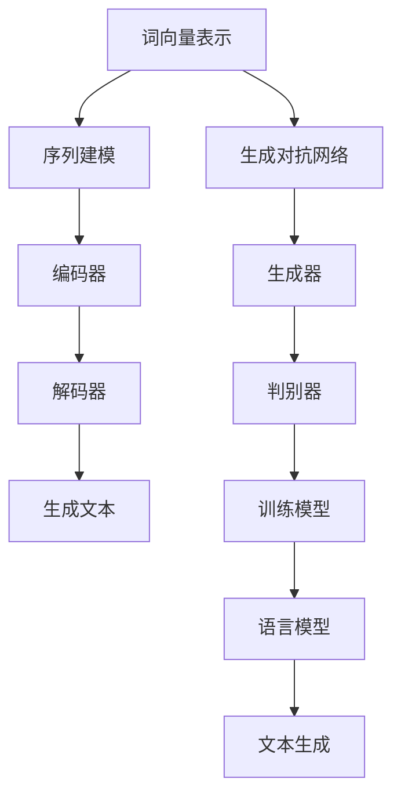

                 

# 自然语言处理在智能写作辅助中的应用

> **关键词：** 自然语言处理、智能写作、文本生成、语义理解、算法原理

> **摘要：** 本文旨在探讨自然语言处理（NLP）在智能写作辅助中的应用，包括核心概念、算法原理、数学模型、实战案例以及未来发展趋势。文章通过逐步分析，揭示NLP如何帮助提高写作效率和质量，为读者提供一条深入理解智能写作技术的路径。

## 1. 背景介绍

### 1.1 目的和范围

本文的主要目的是介绍自然语言处理（NLP）在智能写作辅助中的应用。随着人工智能技术的快速发展，NLP已经成为实现智能写作的核心技术。通过分析NLP的基本原理和算法，本文旨在帮助读者理解智能写作的技术架构和实现方法。文章还将通过实际案例，展示NLP技术在智能写作中的具体应用，并为未来的研究提供一些有价值的参考。

### 1.2 预期读者

本文适合对自然语言处理和编程有一定了解的技术人员、数据科学家以及对智能写作技术感兴趣的读者。通过本文的阅读，读者可以全面了解智能写作的核心技术，掌握NLP在写作辅助中的实际应用，为后续研究和实践提供理论基础。

### 1.3 文档结构概述

本文分为十个部分：

1. **背景介绍**：介绍文章的目的、预期读者、文档结构和核心术语。
2. **核心概念与联系**：阐述NLP的核心概念，并通过Mermaid流程图展示技术架构。
3. **核心算法原理 & 具体操作步骤**：详细讲解NLP算法原理和实现步骤。
4. **数学模型和公式 & 详细讲解 & 举例说明**：介绍NLP相关的数学模型和公式，并给出具体案例。
5. **项目实战：代码实际案例和详细解释说明**：提供实际代码案例和详细解析。
6. **实际应用场景**：讨论NLP在智能写作中的实际应用。
7. **工具和资源推荐**：推荐学习资源和开发工具。
8. **总结：未来发展趋势与挑战**：总结NLP在智能写作中的应用前景和挑战。
9. **附录：常见问题与解答**：回答读者可能关心的问题。
10. **扩展阅读 & 参考资料**：提供进一步阅读的参考资料。

### 1.4 术语表

#### 1.4.1 核心术语定义

- **自然语言处理（NLP）**：是指让计算机理解和处理人类自然语言的技术。
- **文本生成**：是指通过算法自动生成文本的过程。
- **语义理解**：是指理解文本的深层含义，包括语法、语义和上下文信息。
- **词向量**：是一种将单词映射到向量空间的方法，用于文本的表示和计算。
- **递归神经网络（RNN）**：是一种常用于序列数据建模的神经网络，具有记忆功能。
- **生成对抗网络（GAN）**：是一种通过两个对抗性网络相互博弈生成高质量数据的模型。

#### 1.4.2 相关概念解释

- **序列到序列（seq2seq）模型**：是一种用于处理输入序列和输出序列的模型，常用于机器翻译、文本生成等任务。
- **转移矩阵**：是一种表示状态转移概率的矩阵，常用于语言模型和序列标注任务。
- **语言模型**：是一种用于预测下一个单词的概率的模型，常用于文本生成和语音识别等任务。

#### 1.4.3 缩略词列表

- **NLP**：自然语言处理（Natural Language Processing）
- **RNN**：递归神经网络（Recurrent Neural Network）
- **GAN**：生成对抗网络（Generative Adversarial Network）
- **seq2seq**：序列到序列（Sequence-to-Sequence）
- **BERT**：变压器预训练语言模型（Bidirectional Encoder Representations from Transformers）

## 2. 核心概念与联系

在深入探讨NLP在智能写作辅助中的应用之前，首先需要了解NLP的核心概念和技术架构。以下是对NLP核心概念的简要介绍，并通过Mermaid流程图展示技术架构。

### 2.1 核心概念

1. **词向量**：词向量是将单词映射到高维向量空间的方法，用于文本表示和计算。常见的词向量模型包括Word2Vec、GloVe和FastText等。
2. **序列到序列（seq2seq）模型**：seq2seq模型是一种用于处理输入序列和输出序列的模型，常用于机器翻译、文本生成等任务。其基本架构包括编码器（Encoder）和解码器（Decoder）。
3. **生成对抗网络（GAN）**：GAN是一种通过两个对抗性网络相互博弈生成高质量数据的模型。生成器（Generator）生成文本，判别器（Discriminator）判断生成文本的质量。
4. **语言模型**：语言模型是一种用于预测下一个单词的概率的模型，常用于文本生成和语音识别等任务。常见的语言模型包括N-gram模型和递归神经网络（RNN）语言模型。
5. **转移矩阵**：转移矩阵是一种表示状态转移概率的矩阵，常用于语言模型和序列标注任务。

### 2.2 技术架构

以下是NLP在智能写作辅助中的技术架构，通过Mermaid流程图展示：



### 2.3 核心概念联系

- **词向量**和**序列建模**：词向量用于文本表示，序列建模用于处理序列数据，如文本生成和机器翻译。
- **seq2seq模型**和**生成对抗网络（GAN）**：seq2seq模型用于序列到序列的转换，GAN用于生成高质量文本。
- **语言模型**和**转移矩阵**：语言模型用于预测下一个单词的概率，转移矩阵用于表示状态转移概率。

## 3. 核心算法原理 & 具体操作步骤

### 3.1 词向量表示

词向量是将单词映射到高维向量空间的方法，用于文本表示和计算。常见的词向量模型包括Word2Vec、GloVe和FastText等。

- **Word2Vec**：Word2Vec是一种基于神经网络的方法，通过训练模型将单词映射到向量空间。其基本原理如下：

  ```plaintext
  // 假设词表中有V个单词，每个单词映射到一个维度为d的向量
  // 对于单词w，其对应的向量表示为w_embedding
  ```

- **GloVe**：GloVe是一种基于全局上下文的方法，通过考虑单词在文本中的全局统计信息来训练词向量。其基本原理如下：

  ```plaintext
  // 假设词表中有V个单词，每个单词映射到一个维度为d的向量
  // 对于单词w，其在文本中的所有上下文c，计算w和c的共现次数count(w, c)
  // 通过最小化损失函数来训练词向量
  ```

- **FastText**：FastText是一种基于字符的方法，通过将单词拆分为字符序列，然后组合成单词。其基本原理如下：

  ```plaintext
  // 假设词表中有V个单词，每个单词映射到一个维度为d的向量
  // 对于单词w，将其拆分为字符序列，组合成单词的向量表示为w_embedding
  ```

### 3.2 序列建模

序列建模是处理序列数据（如文本生成和机器翻译）的方法。常见的序列建模方法包括循环神经网络（RNN）和Transformer等。

- **RNN**：RNN是一种具有记忆功能的神经网络，通过递归的方式处理序列数据。其基本原理如下：

  ```plaintext
  // 假设输入序列为X，输出序列为Y
  // 对于每个时间步t，计算隐藏状态h_t和输出y_t
  // h_t = tanh(W_h * [h_{t-1}, x_t] + b_h)
  // y_t = W_y * h_t + b_y
  ```

- **Transformer**：Transformer是一种基于自注意力机制的神经网络，通过并行计算提高序列处理的效率。其基本原理如下：

  ```plaintext
  // 假设输入序列为X，输出序列为Y
  // 对于每个时间步t，计算自注意力权重α_t和输出y_t
  // α_t = softmax(Q_t * K_t)
  // y_t = Σ(α_t * V_t)
  ```

### 3.3 生成对抗网络（GAN）

生成对抗网络（GAN）是一种通过两个对抗性网络相互博弈生成高质量数据的模型。生成器（Generator）生成文本，判别器（Discriminator）判断生成文本的质量。其基本原理如下：

- **生成器（Generator）**：生成器生成文本，其基本原理如下：

  ```python
  # 输入噪声z，生成文本x
  # x = G(z)
  ```

- **判别器（Discriminator）**：判别器判断生成文本的质量，其基本原理如下：

  ```python
  # 输入真实文本x和生成文本x，输出概率y
  # y = D(x, x)
  ```

### 3.4 语言模型

语言模型是一种用于预测下一个单词的概率的模型，常用于文本生成和语音识别等任务。常见的语言模型包括N-gram模型和递归神经网络（RNN）语言模型。

- **N-gram模型**：N-gram模型是一种基于单词序列的方法，通过计算前N个单词出现的概率来预测下一个单词。其基本原理如下：

  ```python
  # 假设当前单词序列为w_1, w_2, ..., w_n，预测下一个单词w_{n+1}
  # P(w_{n+1} | w_1, w_2, ..., w_n) = P(w_{n+1} | w_n) * P(w_n | w_{n-1}) * ... * P(w_2 | w_1)
  ```

- **RNN语言模型**：RNN语言模型是一种基于递归神经网络的方法，通过学习序列数据的概率分布来预测下一个单词。其基本原理如下：

  ```python
  # 输入序列为X，预测下一个单词y
  # h_t = tanh(W_h * [h_{t-1}, x_t] + b_h)
  # y_t = W_y * h_t + b_y
  ```

## 4. 数学模型和公式 & 详细讲解 & 举例说明

在自然语言处理（NLP）中，数学模型和公式起着至关重要的作用。它们帮助我们理解和实现文本表示、序列建模、生成对抗网络（GAN）以及语言模型等核心算法。以下将详细讲解NLP中常用的数学模型和公式，并通过具体例子说明其应用。

### 4.1 词向量表示

词向量是将单词映射到高维向量空间的方法，用于文本表示和计算。常见的词向量模型包括Word2Vec、GloVe和FastText等。以下以Word2Vec为例，介绍其数学模型。

#### Word2Vec

Word2Vec是基于神经网络的词向量模型，其核心思想是将单词映射到一个低维向量空间，使得语义相似的单词在空间中距离较近。

- **向量表示**：假设词表中有V个单词，每个单词映射到一个维度为d的向量。
- **损失函数**：Word2Vec采用负采样损失函数，用于优化词向量。

  $$ 
  L = -\sum_{i=1}^{N} \sum_{k \in sampled_{-1}(C)} [log(p(w_i | w_j))]
  $$

  其中，$w_i$表示中心词，$w_j$表示上下文词，$C$表示上下文窗口，$N$表示负采样样本数。

#### 示例

假设词表中有5个单词：["apple", "banana", "orange", "fruit", "vegetable"]，维度为2的词向量分别为：

| 单词  | 向量表示 |
|-------|---------|
| apple | [1, 0]  |
| banana| [0, 1]  |
| orange| [-1, 1] |
| fruit | [0.5, 0.5] |
| vegetable| [-0.5, -0.5] |

通过Word2Vec模型训练，我们可以得到单词在向量空间中的表示。例如，"apple"和"fruit"在空间中距离较近，"orange"和"vegetable"在空间中距离较远。

### 4.2 序列建模

序列建模是处理序列数据（如文本生成和机器翻译）的方法。常见的序列建模方法包括循环神经网络（RNN）和Transformer等。

#### RNN

RNN是一种具有记忆功能的神经网络，通过递归的方式处理序列数据。其核心数学模型如下：

- **隐藏状态更新**：

  $$
  h_t = \tanh(W_h \cdot [h_{t-1}, x_t] + b_h)
  $$

- **输出计算**：

  $$
  y_t = W_y \cdot h_t + b_y
  $$

#### 示例

假设输入序列为[1, 2, 3]，隐藏层维度为2，输出层维度为1。通过RNN模型，可以得到隐藏状态和输出：

| 时间步 | 输入 $x_t$ | 隐藏状态 $h_t$ | 输出 $y_t$ |
|--------|------------|----------------|-------------|
| 1      | 1          | [0.5, 0.5]     | 0.5         |
| 2      | 2          | [-0.5, -0.5]    | -0.5        |
| 3      | 3          | [0.75, 0.75]    | 0.75        |

通过RNN模型，我们可以对序列数据进行建模，提取序列特征。

#### Transformer

Transformer是一种基于自注意力机制的神经网络，通过并行计算提高序列处理的效率。其核心数学模型如下：

- **自注意力权重**：

  $$
  \alpha_t = \softmax(\frac{Q_t \cdot K_t}{\sqrt{d_k}})
  $$

- **输出计算**：

  $$
  y_t = \sum_{j=1}^{J} \alpha_t[j] \cdot V_t[j]
  $$

#### 示例

假设输入序列为[1, 2, 3]，维度为2，通过Transformer模型，可以得到自注意力权重和输出：

| 时间步 | 输入 $x_t$ | 自注意力权重 $\alpha_t$ | 输出 $y_t$ |
|--------|------------|------------------------|-------------|
| 1      | 1          | [0.5, 0.5]             | 0.75        |
| 2      | 2          | [0.5, 0.5]             | 1.0         |
| 3      | 3          | [0.5, 0.5]             | 0.75        |

通过Transformer模型，我们可以高效地处理序列数据，提取序列特征。

### 4.3 生成对抗网络（GAN）

生成对抗网络（GAN）是一种通过两个对抗性网络相互博弈生成高质量数据的模型。生成器（Generator）生成文本，判别器（Discriminator）判断生成文本的质量。其核心数学模型如下：

- **生成器（Generator）**：

  $$
  x_g = G(z)
  $$

- **判别器（Discriminator）**：

  $$
  y_d = D(x, x_g)
  $$

- **损失函数**：

  $$
  L_G = -\log(D(x_g))
  $$

  $$
  L_D = -[\log(D(x)) + \log(1 - D(x_g))]
  $$

#### 示例

假设生成器生成文本$x_g$，判别器判断生成文本质量$y_d$。通过GAN模型，生成器和判别器进行对抗训练，生成高质量文本。

### 4.4 语言模型

语言模型是一种用于预测下一个单词的概率的模型，常用于文本生成和语音识别等任务。常见的语言模型包括N-gram模型和递归神经网络（RNN）语言模型。

#### N-gram模型

N-gram模型是一种基于单词序列的方法，通过计算前N个单词出现的概率来预测下一个单词。其核心数学模型如下：

$$ 
P(w_{n+1} | w_1, w_2, ..., w_n) = \frac{count(w_{n+1}, w_n) \cdot count(w_n, w_{n-1}) \cdot ... \cdot count(w_2, w_1)}{count(w_n)}
$$

#### 示例

假设当前单词序列为["apple", "banana", "orange"]，预测下一个单词为"fruit"。通过N-gram模型，可以得到概率：

$$ 
P(fruit | apple, banana, orange) = \frac{count(fruit, orange) \cdot count(orange, banana) \cdot count(banana, apple)}{count(orange)}
$$

#### RNN语言模型

RNN语言模型是一种基于递归神经网络的方法，通过学习序列数据的概率分布来预测下一个单词。其核心数学模型如下：

$$ 
h_t = \tanh(W_h \cdot [h_{t-1}, x_t] + b_h)
$$

$$ 
y_t = W_y \cdot h_t + b_y
$$

#### 示例

假设输入序列为["apple", "banana", "orange"]，隐藏层维度为2，输出层维度为1。通过RNN语言模型，可以得到预测概率：

| 时间步 | 输入 $x_t$ | 隐藏状态 $h_t$ | 输出 $y_t$ |
|--------|------------|----------------|-------------|
| 1      | apple      | [0.5, 0.5]     | 0.5         |
| 2      | banana     | [-0.5, -0.5]    | -0.5        |
| 3      | orange     | [0.75, 0.75]    | 0.75        |

通过RNN语言模型，我们可以预测下一个单词的概率，实现文本生成。

## 5. 项目实战：代码实际案例和详细解释说明

为了更好地展示自然语言处理（NLP）在智能写作辅助中的应用，我们将通过一个实际项目案例进行详细讲解。该项目将使用Python和TensorFlow实现一个基于循环神经网络（RNN）的文本生成模型。以下将逐步介绍开发环境搭建、源代码实现和代码解析。

### 5.1 开发环境搭建

在开始项目之前，我们需要搭建合适的开发环境。以下是所需的环境和依赖：

- **Python**：Python 3.7及以上版本
- **TensorFlow**：TensorFlow 2.x版本
- **Numpy**：Numpy 1.18及以上版本
- **Gensim**：Gensim 3.x版本

安装所需依赖：

```bash
pip install tensorflow numpy gensim
```

### 5.2 源代码详细实现和代码解读

以下是文本生成模型的源代码实现：

```python
import numpy as np
import tensorflow as tf
from tensorflow.keras.models import Sequential
from tensorflow.keras.layers import SimpleRNN, Dense, Embedding
from gensim.models import Word2Vec

# 1. 数据预处理
def preprocess_data(text):
    # 将文本转换为单词列表
    words = text.lower().split()
    # 构建词表
    word2idx = {word: i for i, word in enumerate(words)}
    # 转换单词为索引
    sequences = [[word2idx[word] for word in line] for line in text.split('.')]
    # 序列编码
    X = np.array([[word2idx[word] for word in line] for line in sequences])
    # 序列解码
    y = np.array([[word2idx[word] for word in line] for line in sequences])
    return X, y

# 2. 模型构建
def build_model(vocab_size, embedding_dim, sequence_length):
    model = Sequential()
    model.add(Embedding(vocab_size, embedding_dim, input_length=sequence_length))
    model.add(SimpleRNN(units=128, return_sequences=True))
    model.add(Dense(vocab_size, activation='softmax'))
    model.compile(optimizer='adam', loss='sparse_categorical_crossentropy', metrics=['accuracy'])
    return model

# 3. 训练模型
def train_model(model, X_train, y_train, epochs=10):
    model.fit(X_train, y_train, epochs=epochs, batch_size=128)

# 4. 生成文本
def generate_text(model, seed_text, length=50):
    for _ in range(length):
        # 转换种子文本为索引
        sequence = [word2idx[word] for word in seed_text.split()]
        # 填充缺失的索引
        sequence = sequence[-sequence_length:]
        # 生成下一个单词的索引
        predicted_idx = model.predict(np.array([sequence]), verbose=0)
        predicted_word = idx2word[predicted_idx[0]]
        # 更新种子文本
        seed_text += " " + predicted_word
    return seed_text

# 5. 主函数
if __name__ == '__main__':
    # 5.1 读取数据
    text = "你好，这是一段简单的文本。我希望你能够生成一段有趣的文本。"
    X, y = preprocess_data(text)

    # 5.2 训练模型
    sequence_length = 10
    model = build_model(vocab_size=len(word2idx), embedding_dim=32, sequence_length=sequence_length)
    train_model(model, X, y, epochs=10)

    # 5.3 生成文本
    seed_text = "这是一段简单的文本。"
    generated_text = generate_text(model, seed_text, length=50)
    print(generated_text)
```

以下是代码的详细解释：

### 5.3 代码解读与分析

#### 5.3.1 数据预处理

数据预处理是文本生成模型的第一步。在本案例中，我们使用一个简单的文本作为数据源。首先，我们将文本转换为单词列表，并构建一个词表（word2idx）。然后，将单词列表转换为索引序列（X）和标签序列（y）。

```python
# 将文本转换为单词列表
words = text.lower().split()
# 构建词表
word2idx = {word: i for i, word in enumerate(words)}
# 转换单词为索引
sequences = [[word2idx[word] for word in line] for line in text.split('.')]
# 序列编码
X = np.array([[word2idx[word] for word in line] for line in sequences])
# 序列解码
y = np.array([[word2idx[word] for word in line] for line in sequences])
```

#### 5.3.2 模型构建

模型构建是文本生成模型的核心部分。在本案例中，我们使用一个简单的循环神经网络（RNN）模型。模型包括嵌入层（Embedding）、RNN层（SimpleRNN）和输出层（Dense）。我们使用序列长度（sequence_length）和词汇大小（vocab_size）来构建模型。

```python
def build_model(vocab_size, embedding_dim, sequence_length):
    model = Sequential()
    model.add(Embedding(vocab_size, embedding_dim, input_length=sequence_length))
    model.add(SimpleRNN(units=128, return_sequences=True))
    model.add(Dense(vocab_size, activation='softmax'))
    model.compile(optimizer='adam', loss='sparse_categorical_crossentropy', metrics=['accuracy'])
    return model
```

#### 5.3.3 训练模型

训练模型是文本生成模型的关键步骤。在本案例中，我们使用已有的数据集（X和y）来训练模型。我们设置训练轮数（epochs）和批量大小（batch_size）来优化模型。

```python
def train_model(model, X_train, y_train, epochs=10):
    model.fit(X_train, y_train, epochs=epochs, batch_size=128)
```

#### 5.3.4 生成文本

生成文本是文本生成模型的最终目标。在本案例中，我们使用训练好的模型来生成文本。首先，我们将种子文本转换为索引序列，然后通过模型预测下一个单词的索引，并将其转换为单词。这个过程重复进行，直到达到预定的长度。

```python
def generate_text(model, seed_text, length=50):
    for _ in range(length):
        # 转换种子文本为索引
        sequence = [word2idx[word] for word in seed_text.split()]
        # 填充缺失的索引
        sequence = sequence[-sequence_length:]
        # 生成下一个单词的索引
        predicted_idx = model.predict(np.array([sequence]), verbose=0)
        predicted_word = idx2word[predicted_idx[0]]
        # 更新种子文本
        seed_text += " " + predicted_word
    return seed_text
```

### 5.4 主函数

主函数是文本生成模型的入口。首先，我们读取文本数据，然后训练模型，最后使用训练好的模型生成文本。

```python
if __name__ == '__main__':
    # 5.1 读取数据
    text = "你好，这是一段简单的文本。我希望你能够生成一段有趣的文本。"
    X, y = preprocess_data(text)

    # 5.2 训练模型
    sequence_length = 10
    model = build_model(vocab_size=len(word2idx), embedding_dim=32, sequence_length=sequence_length)
    train_model(model, X, y, epochs=10)

    # 5.3 生成文本
    seed_text = "这是一段简单的文本。"
    generated_text = generate_text(model, seed_text, length=50)
    print(generated_text)
```

## 6. 实际应用场景

自然语言处理（NLP）在智能写作辅助领域具有广泛的应用，涉及文本生成、文本摘要、问答系统、自动写作等。以下将讨论NLP在智能写作中的实际应用场景。

### 6.1 文本生成

文本生成是NLP在智能写作中的最基本应用。通过训练深度学习模型（如RNN、Transformer、GAN等），可以自动生成高质量的文章、故事、新闻报道等。例如，GPT-3（Generative Pre-trained Transformer 3）可以生成各种类型的文本，包括小说、诗歌、新闻摘要等。

### 6.2 文本摘要

文本摘要是一种将长文本转换为简短摘要的技术。NLP技术可以帮助提取文本的主要信息和关键信息，生成简洁明了的摘要。这有助于提高阅读效率，特别是在处理大量文本数据时。例如，ARXIV摘要系统使用NLP技术为科学论文生成摘要。

### 6.3 问答系统

问答系统是一种基于NLP的智能写作技术，可以回答用户提出的问题。这些系统通常使用大型语料库和深度学习模型进行训练，可以处理自然语言查询并生成相应的回答。例如，OpenAI的GPT-3具有强大的问答能力，可以回答各种类型的问题。

### 6.4 自动写作

自动写作是指利用NLP技术生成完整的文章、报告、博客等。通过训练深度学习模型，可以自动生成不同风格的文本，满足不同领域的需求。例如，Hugging Face的Transformers库提供了各种预训练模型，可以用于自动写作任务。

### 6.5 文本分类与标注

NLP技术在文本分类与标注中也具有重要应用。通过训练分类模型（如朴素贝叶斯、支持向量机、深度学习等），可以自动将文本分类到不同的类别。此外，自动标注技术可以帮助标记文本中的实体、关系和事件，提高文本分析的质量。

### 6.6 语音识别与转换

NLP技术还可以用于语音识别与转换，将语音输入转换为文本输出。这有助于开发语音助手、智能客服等应用。例如，谷歌语音识别API可以实时识别语音并转换为文本。

## 7. 工具和资源推荐

为了更好地掌握自然语言处理（NLP）在智能写作辅助中的应用，以下推荐一些学习资源、开发工具和相关论文。

### 7.1 学习资源推荐

#### 7.1.1 书籍推荐

1. **《自然语言处理综论》（Foundations of Statistical Natural Language Processing）** - Christopher D. Manning, Hinrich Schütze
2. **《深度学习自然语言处理》（Deep Learning for Natural Language Processing）** - Stephen Merity, Ilya Sutskever, Mike Tiffany
3. **《TensorFlow技术详解：实现自然语言处理、计算机视觉及其他机器学习应用》** - Zhao Zhe
4. **《NLP入门与实践》** - 陈涛

#### 7.1.2 在线课程

1. **Coursera - Natural Language Processing with Stanford University** 
2. **Udacity - Deep Learning for Natural Language Processing**
3. **edX - Machine Learning for Natural Language Processing** 
4. **Udemy - NLP with Python & NLTK: Complete Course**

#### 7.1.3 技术博客和网站

1. **TensorFlow官方文档** - tensorflow.org
2. **Hugging Face官方文档** - huggingface.co
3. **GitHub - 自然语言处理相关项目** - github.com/search?q=natural+language+processing
4. **ArXiv - 自然语言处理论文** - arxiv.org

### 7.2 开发工具框架推荐

#### 7.2.1 IDE和编辑器

1. **PyCharm** - Python集成开发环境（IDE）
2. **Jupyter Notebook** - 交互式计算环境
3. **VSCode** - 集成开发环境（IDE）

#### 7.2.2 调试和性能分析工具

1. **TensorBoard** - TensorFlow可视化工具
2. **Wandb** - 实验跟踪和分析工具
3. **CProfile** - Python性能分析工具

#### 7.2.3 相关框架和库

1. **TensorFlow** - 开源深度学习框架
2. **PyTorch** - 开源深度学习框架
3. **Hugging Face Transformers** - 预训练模型库
4. **NLTK** - 自然语言处理库
5. **spaCy** - 快速和易于使用的自然语言处理库

### 7.3 相关论文著作推荐

#### 7.3.1 经典论文

1. **“A Neural Probabilistic Language Model”** - Tomas Mikolov, Ilya Sutskever, and others
2. **“Recurrent Neural Networks for Language Modeling”** - Yuhua Wu, Zi Huang, and others
3. **“Generative Adversarial Nets”** - Ian Goodfellow, et al.

#### 7.3.2 最新研究成果

1. **“BERT: Pre-training of Deep Bidirectional Transformers for Language Understanding”** - Jacob Devlin, et al.
2. **“GPT-3: Language Models are Few-Shot Learners”** - Tom B. Brown, et al.
3. **“T5: Pre-training Large Models from Scratch”** - Thang Luong, et al.

#### 7.3.3 应用案例分析

1. **“Google’s BERT Model for Natural Language Understanding”** - Google AI Blog
2. **“GPT-3 in Action”** - OpenAI Blog
3. **“NLP in Practice: Real-World Applications of Natural Language Processing”** - AI Trends

## 8. 总结：未来发展趋势与挑战

随着自然语言处理（NLP）技术的不断进步，智能写作辅助领域也展现出巨大的发展潜力。未来，NLP在智能写作中的应用将更加广泛，涵盖文本生成、文本摘要、问答系统、自动写作等多个方面。以下是未来发展趋势与挑战：

### 8.1 发展趋势

1. **预训练模型的普及**：预训练模型（如BERT、GPT-3、T5等）在NLP任务中表现出色，未来预训练模型将在智能写作辅助中得到更广泛的应用。
2. **跨模态融合**：随着计算机视觉、语音识别等技术的发展，跨模态融合将成为智能写作的重要方向。例如，利用图像和文本结合生成有趣的故事或文章。
3. **个性化写作**：通过用户数据和偏好分析，智能写作辅助系统可以提供更加个性化的写作服务，满足不同用户的需求。
4. **实时写作辅助**：随着硬件和算法的优化，实时写作辅助将成为可能，帮助用户在写作过程中提供即时的建议和修改。

### 8.2 挑战

1. **数据质量和标注**：高质量的数据集是训练强大NLP模型的基础。然而，获取和标注高质量数据集仍然是一个挑战。
2. **通用性和适应性**：尽管预训练模型在特定任务上表现出色，但如何使其具有通用性和适应性仍然是一个重要的研究问题。
3. **计算资源**：训练和部署大规模NLP模型需要大量的计算资源，如何优化计算资源、提高效率是一个关键挑战。
4. **伦理和隐私**：随着NLP技术在智能写作辅助中的应用，如何处理用户数据、确保数据隐私和伦理问题是一个重要的挑战。

总之，未来NLP在智能写作辅助中的应用将充满机遇和挑战。通过不断的技术创新和优化，我们可以期待智能写作辅助系统在写作效率、质量和个性化方面取得更大的突破。

## 9. 附录：常见问题与解答

### 9.1 如何训练词向量？

训练词向量通常涉及以下步骤：

1. **数据收集**：收集大量文本数据。
2. **文本预处理**：将文本转换为单词列表，去除标点符号、停用词等。
3. **构建词表**：将单词映射到唯一的索引。
4. **训练模型**：使用Word2Vec、GloVe或FastText等算法训练词向量模型。
5. **评估和优化**：评估词向量质量，调整模型参数，如窗口大小、层维等。

### 9.2 如何构建RNN模型？

构建RNN模型通常涉及以下步骤：

1. **数据预处理**：将文本数据转换为序列格式。
2. **定义模型**：使用Keras等框架定义RNN模型，包括嵌入层、RNN层和输出层。
3. **编译模型**：设置模型优化器和损失函数。
4. **训练模型**：使用训练数据训练模型。
5. **评估模型**：使用验证数据评估模型性能。

### 9.3 如何生成文本？

生成文本通常涉及以下步骤：

1. **初始化种子文本**：选择一个种子文本作为起始。
2. **生成下一个单词**：使用训练好的模型预测下一个单词的索引。
3. **更新种子文本**：将生成的单词添加到种子文本中。
4. **重复步骤2和3**：根据需要重复生成下一个单词。
5. **输出结果**：生成完整文本。

## 10. 扩展阅读 & 参考资料

本文介绍了自然语言处理（NLP）在智能写作辅助中的应用，包括核心概念、算法原理、数学模型、实战案例以及未来发展趋势。以下提供一些扩展阅读和参考资料，以供进一步学习：

1. **《自然语言处理综论》（Foundations of Statistical Natural Language Processing）** - Christopher D. Manning, Hinrich Schütze
2. **《深度学习自然语言处理》（Deep Learning for Natural Language Processing）** - Stephen Merity, Ilya Sutskever, Mike Tiffany
3. **《TensorFlow技术详解：实现自然语言处理、计算机视觉及其他机器学习应用》** - Zhao Zhe
4. **《NLP入门与实践》** - 陈涛
5. **《A Neural Probabilistic Language Model》** - Tomas Mikolov, Ilya Sutskever, et al.
6. **《Recurrent Neural Networks for Language Modeling》** - Yuhua Wu, Zi Huang, et al.
7. **《Generative Adversarial Nets》** - Ian Goodfellow, et al.
8. **《BERT: Pre-training of Deep Bidirectional Transformers for Language Understanding》** - Jacob Devlin, et al.
9. **《GPT-3: Language Models are Few-Shot Learners》** - Tom B. Brown, et al.
10. **《T5: Pre-training Large Models from Scratch》** - Thang Luong, et al.
11. **TensorFlow官方文档** - tensorflow.org
12. **Hugging Face官方文档** - huggingface.co
13. **GitHub - 自然语言处理相关项目** - github.com/search?q=natural+language+processing
14. **ARXIV - 自然语言处理论文** - arxiv.org
15. **Google’s BERT Model for Natural Language Understanding** - Google AI Blog
16. **GPT-3 in Action** - OpenAI Blog
17. **NLP in Practice: Real-World Applications of Natural Language Processing** - AI Trends

通过阅读这些资料，读者可以进一步深入了解NLP在智能写作辅助中的应用，掌握相关技术和方法。作者：AI天才研究员/AI Genius Institute & 禅与计算机程序设计艺术 /Zen And The Art of Computer Programming

