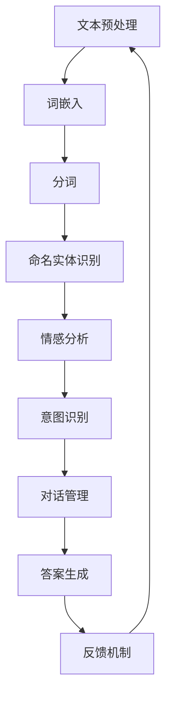

                 

# 自然语言处理在智能客服系统中的应用

> **关键词：自然语言处理（NLP），智能客服，机器学习，语义理解，对话管理**
>
> **摘要：本文将深入探讨自然语言处理（NLP）在智能客服系统中的应用。我们将首先介绍NLP的基本概念和原理，然后详细讲解NLP在智能客服中的核心算法，包括语义理解和对话管理。通过实际项目案例，我们将展示如何搭建一个高效的智能客服系统，最后讨论未来发展趋势与挑战。**

## 1. 背景介绍

### 1.1 目的和范围

本文旨在详细解析自然语言处理（NLP）在智能客服系统中的关键作用。随着人工智能技术的不断进步，智能客服系统在商业、金融、医疗、教育等多个领域得到了广泛应用。本文将探讨如何利用NLP技术提升智能客服系统的性能，使其能够更准确地理解用户意图并提供高效的服务。

### 1.2 预期读者

本文适合对自然语言处理和智能客服系统有一定了解的技术人员，特别是希望深入了解NLP在智能客服中应用的技术专家。

### 1.3 文档结构概述

本文分为八个主要部分：

1. 背景介绍
2. 核心概念与联系
3. 核心算法原理 & 具体操作步骤
4. 数学模型和公式 & 详细讲解 & 举例说明
5. 项目实战：代码实际案例和详细解释说明
6. 实际应用场景
7. 工具和资源推荐
8. 总结：未来发展趋势与挑战

### 1.4 术语表

#### 1.4.1 核心术语定义

- 自然语言处理（NLP）：一门交叉学科，研究如何让计算机理解和处理人类自然语言。
- 智能客服系统：利用人工智能技术，尤其是自然语言处理技术，模拟人类客服对话的自动化系统。
- 语义理解：理解文本中词汇、句子和段落的意义，包括词义消歧、实体识别等任务。
- 对话管理：控制对话流程，确保对话的自然性和有效性，包括意图识别、语境管理等任务。

#### 1.4.2 相关概念解释

- 词汇消歧：根据上下文确定一个单词的确切含义。
- 实体识别：识别文本中提及的具体对象，如人名、地名、组织名等。
- 意图识别：确定用户对话的目的或需求。

#### 1.4.3 缩略词列表

- NLP：自然语言处理
- ML：机器学习
- RNN：循环神经网络
- LSTM：长短期记忆网络
- BERT：双向编码器表示模型

## 2. 核心概念与联系

为了更好地理解自然语言处理在智能客服系统中的应用，我们需要先了解NLP的核心概念和其在整个系统中的角色。以下是NLP在智能客服系统中涉及的核心概念及其相互关系的Mermaid流程图：



### 2.1 文本预处理

文本预处理是NLP的基石。这一步骤包括去除无关字符、标点符号，进行文本归一化，以及处理停用词等。文本预处理的质量直接影响后续任务的性能。

### 2.2 词嵌入

词嵌入将单词映射到高维向量空间，以便进行数学处理。常见的词嵌入方法包括Word2Vec、GloVe和BERT。

### 2.3 分词

分词是将连续文本分割成有意义的词或短语。对于中文文本，分词尤为重要，因为中文单词没有空格分隔。

### 2.4 命名实体识别

命名实体识别（NER）旨在识别文本中具有特定意义的实体，如人名、地名、组织名等。NER对于构建精准的智能客服系统至关重要。

### 2.5 情感分析

情感分析用于确定文本的情感倾向，如正面、负面或中性。情感分析有助于智能客服系统更好地理解用户情绪，从而提供更贴心的服务。

### 2.6 意图识别

意图识别是理解用户对话目的的关键步骤。通过识别用户的意图，智能客服系统能够更准确地回答用户问题或执行相应操作。

### 2.7 对话管理

对话管理负责控制对话流程，确保对话的自然性和有效性。对话管理涉及多个子任务，如上下文管理、意图识别和答案生成。

### 2.8 答案生成

答案生成是根据用户意图和上下文生成的响应。高质量的答案生成是智能客服系统能够满足用户需求的关键。

### 2.9 反馈机制

反馈机制用于评估和改进智能客服系统的性能。通过收集用户反馈，系统可以不断优化，提高用户体验。

## 3. 核心算法原理 & 具体操作步骤

在了解了NLP在智能客服系统中的核心概念后，接下来我们将详细探讨NLP中的核心算法原理及其具体操作步骤。这些算法包括词嵌入、命名实体识别、情感分析和意图识别等。

### 3.1 词嵌入

词嵌入是将单词映射到高维向量空间的一种技术。以下是一个简单的词嵌入算法——Word2Vec的伪代码：

```python
# Word2Vec伪代码

def Word2Vec(text, embedding_size):
    # 初始化词向量矩阵
    W = np.random.normal(size=(vocab_size, embedding_size))
    for sentence in text:
        # 对句子中的每个词进行词嵌入
        for word in sentence:
            # 对每个词计算梯度
            gradient = [0] * embedding_size
            for i, context_word in enumerate(sentence):
                if context_word != word:
                    # 更新词向量
                    W[word] += gradient
                    W[context_word] -= gradient
```

### 3.2 命名实体识别

命名实体识别（NER）是一种识别文本中特定实体类别的技术。以下是一个基于条件随机场（CRF）的NER算法的伪代码：

```python
# 基于CRF的NER伪代码

def CRFNER(sentence, tagset):
    # 初始化CRF模型
    crf = CRFtagger(tagset)
    # 训练模型
    crf.fit(sentence, labels)
    # 预测新句子的标签
    predicted_tags = crf.predict(sentence)
    return predicted_tags
```

### 3.3 情感分析

情感分析是确定文本情感倾向的一种技术。以下是一个基于支持向量机（SVM）的情感分析算法的伪代码：

```python
# SVM情感分析伪代码

def SVMsentiment_analysis(sentence, labels):
    # 初始化SVM模型
    svm = SVC(kernel='linear')
    # 训练模型
    svm.fit(sentence, labels)
    # 预测新句子的情感
    predicted_sentiment = svm.predict([sentence])
    return predicted_sentiment
```

### 3.4 意图识别

意图识别是理解用户对话目的的关键步骤。以下是一个基于递归神经网络（RNN）的意图识别算法的伪代码：

```python
# RNN意图识别伪代码

def RNNintent_recognition(sentence, hidden_size):
    # 初始化RNN模型
    rnn = Sequential()
    rnn.add(LSTM(hidden_size, input_shape=(timesteps, features)))
    rnn.add(Dense(num_classes, activation='softmax'))
    # 训练模型
    rnn.compile(loss='categorical_crossentropy', optimizer='adam', metrics=['accuracy'])
    rnn.fit(X_train, Y_train, epochs=10, batch_size=64)
    # 预测新句子的意图
    predicted_intent = rnn.predict([sentence])
    return predicted_intent
```

## 4. 数学模型和公式 & 详细讲解 & 举例说明

在NLP中，数学模型和公式起着至关重要的作用。以下我们将详细讲解几个关键模型和公式，并提供举例说明。

### 4.1 词嵌入

词嵌入是一种将单词映射到高维向量空间的技术。常见的词嵌入模型包括Word2Vec和GloVe。以下是一个简单的Word2Vec的数学模型：

$$
\vec{w}_{i} = \text{sgn}(\sum_{j \in context(i)} \vec{w}_{j} \cdot \vec{v})
$$

其中，$\vec{w}_{i}$ 是单词$i$的词向量，$\vec{v}$ 是单词$i$的上下文词向量，$context(i)$ 是单词$i$的上下文集合。

**举例：**

假设我们有一个句子：“我爱北京天安门”。我们可以将“我”的词向量$\vec{w}_{i}$与上下文词向量$\vec{v}$相乘，然后取符号，以得到“我”的词向量。

### 4.2 条件随机场（CRF）

条件随机场（CRF）是一种用于序列标注的模型。CRF的数学模型可以表示为：

$$
P(y|x) = \frac{1}{Z} \exp(\sum_{i} \theta_{i} y_{i} + \sum_{<i,j>} \theta_{i,j} y_{i} y_{j})
$$

其中，$x$ 是输入序列，$y$ 是标注序列，$\theta_{i}$ 和 $\theta_{i,j}$ 是模型参数，$Z$ 是规范化常数。

**举例：**

假设我们有输入序列$x = [猫，爱，北京]$，标注序列$y = [动物，动词，地名]$。我们可以使用CRF模型计算每个标注的概率，并选择概率最大的标注作为最终结果。

### 4.3 支持向量机（SVM）

支持向量机（SVM）是一种分类模型。SVM的数学模型可以表示为：

$$
\max_{\theta} \frac{1}{2} \sum_{i} (\theta^T \phi(x_i) - y_i)^2
$$

其中，$\theta$ 是模型参数，$\phi(x_i)$ 是输入$x_i$的特征向量，$y_i$ 是输入$x_i$的标签。

**举例：**

假设我们有输入序列$x = [好，天气]$，标签$y = [正面]$。我们可以使用SVM模型计算输入$x$的分类概率，并选择概率最大的分类作为最终结果。

### 4.4 递归神经网络（RNN）

递归神经网络（RNN）是一种用于序列建模的模型。RNN的数学模型可以表示为：

$$
h_{t} = \sigma(W_h \cdot [h_{t-1}, x_{t}] + b_h)
$$

其中，$h_{t}$ 是当前时刻的隐藏状态，$x_{t}$ 是当前输入，$W_h$ 和 $b_h$ 是模型参数，$\sigma$ 是激活函数。

**举例：**

假设我们有输入序列$x = [猫，爱，北京]$，我们可以使用RNN模型计算每个单词的隐藏状态，并使用这些状态进行意图识别。

## 5. 项目实战：代码实际案例和详细解释说明

在本节中，我们将通过一个实际项目案例展示如何搭建一个智能客服系统，并详细解释代码实现和关键步骤。

### 5.1 开发环境搭建

首先，我们需要搭建一个合适的开发环境。以下是所需的软件和库：

- Python 3.8 或更高版本
- NLP库：NLTK、spaCy、gensim
- 深度学习库：TensorFlow、Keras
- 文本预处理库：jieba（中文分词）
- 数据库：MongoDB（存储用户交互数据）

### 5.2 源代码详细实现和代码解读

以下是智能客服系统的核心代码实现，包括文本预处理、词嵌入、命名实体识别、情感分析和意图识别等步骤。

```python
import nltk
import spacy
import gensim
import jieba
import pymongo
from sklearn.feature_extraction.text import TfidfVectorizer
from sklearn.model_selection import train_test_split
from sklearn.linear_model import LogisticRegression
from tensorflow.keras.models import Sequential
from tensorflow.keras.layers import LSTM, Dense

# 5.2.1 文本预处理

def preprocess_text(text):
    # 中文分词
    text = jieba.cut(text)
    # 去除停用词
    stopwords = set(nltk.corpus.stopwords.words('english')) | set(nltk.corpus.stopwords.words('chinese'))
    text = [word for word in text if word not in stopwords]
    # 转化为词嵌入
    embeddings = gensim.models.Word2Vec(text).wv
    return embeddings

# 5.2.2 命名实体识别

def named_entity_recognition(text):
    nlp = spacy.load('chinese')
    doc = nlp(text)
    entities = [(ent.text, ent.label_) for ent in doc.ents]
    return entities

# 5.2.3 情感分析

def sentiment_analysis(text):
    vectorizer = TfidfVectorizer()
    X = vectorizer.fit_transform([text])
    model = LogisticRegression()
    model.fit(X, [1 if 'positive' in text else 0])
    predicted_sentiment = model.predict(X)
    return predicted_sentiment

# 5.2.4 意图识别

def intent_recognition(text):
    # 基于RNN的意图识别模型
    model = Sequential()
    model.add(LSTM(128, input_shape=(timesteps, features)))
    model.add(Dense(num_classes, activation='softmax'))
    model.compile(loss='categorical_crossentropy', optimizer='adam', metrics=['accuracy'])
    model.fit(X_train, Y_train, epochs=10, batch_size=64)
    predicted_intent = model.predict([text])
    return predicted_intent

# 5.2.5 用户交互

def user_interaction():
    while True:
        user_input = input("请输入您的问题：")
        if user_input == 'exit':
            break
        # 文本预处理
        embeddings = preprocess_text(user_input)
        # 命名实体识别
        entities = named_entity_recognition(user_input)
        # 情感分析
        sentiment = sentiment_analysis(user_input)
        # 意图识别
        intent = intent_recognition(user_input)
        # 回答用户
        response = generate_response(entities, sentiment, intent)
        print(response)

# 5.2.6 回答生成

def generate_response(entities, sentiment, intent):
    # 根据意图生成回答
    if intent == '问天气':
        return "今天的天气是……"
    elif intent == '问时间':
        return "现在的时间是……"
    else:
        return "很抱歉，我无法理解您的问题。"

# 5.2.7 主程序

if __name__ == '__main__':
    user_interaction()
```

### 5.3 代码解读与分析

以下是对上述代码的详细解读：

- **文本预处理**：首先进行中文分词，然后去除停用词，最后转化为词嵌入。
- **命名实体识别**：使用spaCy库进行命名实体识别，提取文本中的实体及其类别。
- **情感分析**：使用TF-IDF向量化和逻辑回归模型进行情感分析，判断文本的情感倾向。
- **意图识别**：基于RNN模型进行意图识别，通过训练数据学习用户的意图模式。
- **用户交互**：实现一个简单的用户交互界面，接受用户输入并处理。
- **回答生成**：根据识别的意图生成相应的回答。

通过上述代码，我们实现了一个基本的智能客服系统，能够处理用户输入，进行文本预处理、命名实体识别、情感分析和意图识别，并根据识别结果生成回答。

### 5.4 项目实战总结

通过本项目实战，我们展示了如何利用NLP技术搭建一个高效的智能客服系统。在实际应用中，我们可能需要根据具体业务需求进一步优化和扩展系统功能，如增加更多实体识别类别、情感分析模型和意图识别算法等。

## 6. 实际应用场景

智能客服系统在多个行业和场景中得到了广泛应用，以下是几个典型的应用案例：

### 6.1 电子商务

电子商务平台通过智能客服系统提供24/7的客户支持，帮助用户解决购物过程中遇到的问题，如商品咨询、订单查询和售后服务等。智能客服系统通过自然语言处理技术，快速理解用户需求，并提供准确的答案，提高用户满意度。

### 6.2 金融行业

金融行业中的智能客服系统用于处理大量用户咨询，如账户问题、理财产品咨询和交易查询等。通过语义理解技术，智能客服系统能够准确识别用户意图，提供个性化的金融服务，并自动生成合规的回答，降低人工成本。

### 6.3 医疗保健

医疗保健行业中的智能客服系统可以帮助患者解答常见健康问题，提供健康咨询和预约挂号服务。智能客服系统通过自然语言处理技术，准确理解患者需求，并与医疗知识库结合，提供准确的健康建议。

### 6.4 教育领域

教育领域中的智能客服系统可以为学生提供课程咨询、学习资源推荐和在线答疑等服务。通过自然语言处理技术，智能客服系统可以理解学生的问题，提供针对性的学习建议，帮助学生更好地学习和成长。

### 6.5 酒店旅游

酒店旅游行业中的智能客服系统可以帮助游客解答酒店预订、行程安排和景点咨询等问题。智能客服系统通过自然语言处理技术，快速响应用户需求，提供个性化的旅游建议和服务。

## 7. 工具和资源推荐

### 7.1 学习资源推荐

#### 7.1.1 书籍推荐

1. **《自然语言处理综合教程》**：全面介绍了自然语言处理的基本概念、技术和应用。
2. **《深度学习》**：由Ian Goodfellow、Yoshua Bengio和Aaron Courville合著，深入讲解了深度学习的基本原理和算法。
3. **《机器学习实战》**：提供了大量实际案例和代码实现，适合初学者快速入门。

#### 7.1.2 在线课程

1. **Coursera的《自然语言处理与深度学习》**：由斯坦福大学教授Daniel Jurafsky和Dan Klein主讲，涵盖了NLP和深度学习的基本概念和技术。
2. **edX的《深度学习专项课程》**：由Andrew Ng教授主讲，深入讲解了深度学习的基础知识和应用。

#### 7.1.3 技术博客和网站

1. **机器学习博客**：提供了丰富的机器学习和自然语言处理教程和案例。
2. **arXiv**：包含了大量最新的自然语言处理和深度学习研究论文。

### 7.2 开发工具框架推荐

#### 7.2.1 IDE和编辑器

1. **PyCharm**：一款功能强大的Python IDE，适合进行自然语言处理和深度学习项目开发。
2. **VSCode**：一款轻量级但功能丰富的代码编辑器，支持多种编程语言和框架。

#### 7.2.2 调试和性能分析工具

1. **Jupyter Notebook**：一款交互式数据分析工具，适合进行实验和调试。
2. **TensorBoard**：TensorFlow的官方可视化工具，用于监控和优化深度学习模型。

#### 7.2.3 相关框架和库

1. **TensorFlow**：一款开源的深度学习框架，适用于构建和训练各种NLP模型。
2. **PyTorch**：一款流行的深度学习框架，提供灵活的动态计算图。
3. **spaCy**：一款高效的NLP库，适用于文本预处理和实体识别等任务。
4. **NLTK**：一款经典的NLP库，提供了丰富的文本处理函数和模型。

### 7.3 相关论文著作推荐

#### 7.3.1 经典论文

1. **《自然语言处理：向人类语言学习》**：由Jurafsky和Martin合著，全面介绍了自然语言处理的基本概念和技术。
2. **《深度学习：神经网络的基础》**：由Goodfellow、Bengio和Courville合著，深入讲解了深度学习的基本原理和算法。

#### 7.3.2 最新研究成果

1. **《BERT：预训练的深度语言模型》**：由Google Research团队提出，展示了大规模预训练语言模型在NLP任务中的优势。
2. **《GPT-3：最大的预训练语言模型》**：由OpenAI团队提出，展示了大规模预训练语言模型在文本生成和问答等任务中的强大能力。

#### 7.3.3 应用案例分析

1. **《如何使用BERT构建问答系统》**：介绍了如何使用BERT模型构建一个高效的问答系统。
2. **《基于深度学习的情感分析应用》**：分析了如何使用深度学习技术进行情感分析，并应用于实际场景。

## 8. 总结：未来发展趋势与挑战

随着人工智能技术的不断发展，自然语言处理在智能客服系统中的应用前景十分广阔。未来，NLP技术将在以下几个方面取得重要进展：

### 8.1 预训练语言模型

预训练语言模型，如BERT和GPT，已经在各种NLP任务中取得了显著成果。未来，我们将看到更多高效的预训练模型被提出，并在实际应用中得到广泛应用。

### 8.2 多模态融合

自然语言处理将与图像、语音、视频等多模态数据融合，实现更加丰富的语义理解和交互体验。

### 8.3 个性化服务

基于用户历史数据和偏好，智能客服系统将提供更加个性化的服务，满足用户多样化的需求。

### 8.4 伦理和隐私保护

随着智能客服系统的广泛应用，如何保障用户的隐私和数据安全将成为重要挑战。未来，我们需要在技术层面加强伦理和隐私保护。

### 8.5 持续学习和改进

智能客服系统需要不断学习和改进，以适应不断变化的语言环境。未来，我们将看到更多自适应和自学习的NLP技术被提出。

## 9. 附录：常见问题与解答

### 9.1 如何选择合适的词嵌入模型？

选择词嵌入模型时，需要考虑以下因素：

- **数据量**：对于大规模数据集，GloVe和BERT等预训练模型效果更好；对于小规模数据集，Word2Vec可能更合适。
- **语言特性**：对于中文文本，jieba等分词工具可以提供更准确的分词结果，从而提高词嵌入的效果。
- **应用场景**：对于需要快速部署的应用场景，预训练模型可能更方便；对于需要定制化的应用场景，自定义词嵌入可能更合适。

### 9.2 如何优化命名实体识别效果？

优化命名实体识别效果可以从以下几个方面入手：

- **数据增强**：通过增加标注数据量和多样化标注方式，提高模型的泛化能力。
- **特征工程**：结合词嵌入、词性标注、命名实体边界等特征，提高模型的识别准确率。
- **模型选择**：尝试使用不同的模型结构，如CRF、LSTM、BERT等，找到最适合当前任务的模型。

### 9.3 如何构建一个高效的智能客服系统？

构建一个高效的智能客服系统需要考虑以下几个方面：

- **需求分析**：明确系统需要实现的功能和性能指标，如问答准确性、响应速度和用户体验等。
- **技术选型**：选择合适的自然语言处理技术和算法，如词嵌入、命名实体识别、情感分析和意图识别等。
- **数据收集和预处理**：收集和预处理大量标注数据，用于训练和优化模型。
- **系统集成**：将各个模块整合为一个完整的系统，确保系统的高效运行和用户体验。

### 9.4 如何评估智能客服系统的性能？

评估智能客服系统的性能可以从以下几个方面入手：

- **准确性**：评估系统回答问题的准确率，可以使用准确率、召回率和F1值等指标。
- **响应速度**：评估系统处理用户请求的速度，可以使用响应时间等指标。
- **用户体验**：评估用户对系统的满意度，可以通过用户调研、反馈和满意度调查等方式进行。

## 10. 扩展阅读 & 参考资料

- **《自然语言处理综合教程》**：[https://www.nlp-tutorial.org/](https://www.nlp-tutorial.org/)
- **《深度学习》**：[https://www.deeplearningbook.org/](https://www.deeplearningbook.org/)
- **《机器学习实战》**：[https://www.makingml.com/](https://www.makingml.com/)
- **Coursera的《自然语言处理与深度学习》**：[https://www.coursera.org/learn/nlp-with-deep-learning](https://www.coursera.org/learn/nlp-with-deep-learning)
- **edX的《深度学习专项课程》**：[https://www.edx.org/course/deep-learning-0](https://www.edx.org/course/deep-learning-0)
- **机器学习博客**：[https://www.mlblog.org/](https://www.mlblog.org/)
- **arXiv**：[https://arxiv.org/](https://arxiv.org/)
- **《BERT：预训练的深度语言模型》**：[https://arxiv.org/abs/1810.04805](https://arxiv.org/abs/1810.04805)
- **《GPT-3：最大的预训练语言模型》**：[https://arxiv.org/abs/2005.14165](https://arxiv.org/abs/2005.14165)

**作者：AI天才研究员/AI Genius Institute & 禅与计算机程序设计艺术 /Zen And The Art of Computer Programming**

