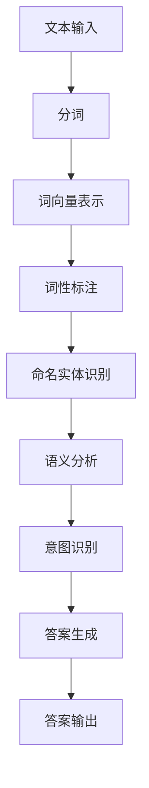

                 

# 自然语言处理在智能问答系统中的应用

> 关键词：自然语言处理、智能问答系统、文本理解、语言模型、机器学习、算法实现、应用场景

> 摘要：本文将深入探讨自然语言处理（NLP）在智能问答系统中的应用。首先介绍自然语言处理的背景和核心概念，然后详细解析智能问答系统的基本原理和实现步骤，接着讨论常用的算法和技术，包括语言模型和机器学习算法。最后，通过实际项目实战案例展示智能问答系统的开发流程，并提供相关工具和资源的推荐，以便读者深入学习和实践。文章旨在为读者提供一个全面、系统的了解和掌握智能问答系统开发的方法和技巧。

## 1. 背景介绍

### 1.1 目的和范围

本文旨在介绍自然语言处理（NLP）在智能问答系统中的应用，旨在帮助读者了解智能问答系统的基本原理、实现方法以及在实际中的应用。通过本文的学习，读者可以掌握以下内容：

1. NLP的基础知识及其在智能问答系统中的应用。
2. 智能问答系统的构建流程和关键算法。
3. 实际项目案例中的智能问答系统开发经验。
4. 相关工具和资源的推荐，以供进一步学习和实践。

### 1.2 预期读者

本文面向具有以下背景的读者：

1. 对自然语言处理和智能问答系统感兴趣的计算机科学和人工智能专业学生。
2. 具备一定编程基础，希望深入了解NLP应用的开发者。
3. 智能问答系统的研究人员和从业者。
4. 对人工智能和自然语言处理技术感兴趣的IT从业者。

### 1.3 文档结构概述

本文分为以下章节：

1. **背景介绍**：介绍文章的目的和范围，预期读者，文档结构概述，以及核心术语定义。
2. **核心概念与联系**：介绍自然语言处理的基础概念，以及智能问答系统的架构和原理。
3. **核心算法原理 & 具体操作步骤**：讲解自然语言处理中的核心算法，包括语言模型和机器学习算法，并提供伪代码实现。
4. **数学模型和公式 & 详细讲解 & 举例说明**：介绍与自然语言处理相关的数学模型和公式，并通过实例进行详细解释。
5. **项目实战：代码实际案例和详细解释说明**：展示一个实际的智能问答系统项目，并详细解释代码实现和关键步骤。
6. **实际应用场景**：分析智能问答系统在不同场景下的应用。
7. **工具和资源推荐**：推荐相关学习资源、开发工具和框架。
8. **总结：未来发展趋势与挑战**：总结本文内容，并探讨未来发展趋势和挑战。
9. **附录：常见问题与解答**：针对读者可能遇到的问题提供解答。
10. **扩展阅读 & 参考资料**：提供进一步阅读和参考资料。

### 1.4 术语表

#### 1.4.1 核心术语定义

- **自然语言处理（NLP）**：计算机科学领域中的一个分支，旨在让计算机理解和解释人类语言。
- **智能问答系统**：一种人工智能系统，能够理解用户的自然语言问题，并返回相关答案。
- **语言模型**：一种统计模型，用于预测下一个单词或词组，通常用于文本生成和语言理解。
- **机器学习算法**：用于从数据中学习并做出预测或决策的一类算法，广泛应用于智能问答系统。

#### 1.4.2 相关概念解释

- **词向量（Word Vector）**：将词语表示为密集的向量化表示，用于文本数据的数值化。
- **语义分析（Semantic Analysis）**：理解文本中的语义和含义，包括实体识别、情感分析等。
- **意图识别（Intent Recognition）**：识别用户问题的意图，例如查询信息、请求服务等。

#### 1.4.3 缩略词列表

- **NLP**：自然语言处理（Natural Language Processing）
- **QA**：问答（Question Answering）
- **ML**：机器学习（Machine Learning）
- **RNN**：递归神经网络（Recurrent Neural Network）
- **BERT**：BERT 模型（Bidirectional Encoder Representations from Transformers）

## 2. 核心概念与联系

在探讨自然语言处理在智能问答系统中的应用之前，我们需要先了解NLP的核心概念和基本原理。以下是一个简化的NLP流程及其核心概念，我们将使用Mermaid流程图进行展示。

### Mermaid 流程图



### 2.1. 流程图解释

- **文本输入**：用户输入一个自然语言问题或句子。
- **分词**：将文本拆分成单词或词组。
- **词向量表示**：将每个词转换为密集的向量表示，便于后续处理。
- **词性标注**：为每个词分配词性，如名词、动词等。
- **命名实体识别**：识别文本中的特定实体，如人名、地点等。
- **语义分析**：理解文本中的语义和含义，包括实体关系、事件等。
- **意图识别**：识别用户问题的意图，如查询信息、请求服务等。
- **答案生成**：根据用户问题和意图，生成相关答案。
- **答案输出**：将答案返回给用户。

### 2.2. 核心概念详细解释

- **词向量表示**：词向量是将文本数据转换为机器可处理的数值表示的一种方法。常见的方法包括Word2Vec、GloVe等，这些方法将单词表示为密集的向量化表示，从而可以在高维空间中进行相似性计算。
- **语义分析**：语义分析是NLP中的一个重要环节，旨在理解文本中的语义和含义。常见的语义分析方法包括词性标注、命名实体识别、关系抽取等。
- **意图识别**：意图识别是智能问答系统中至关重要的环节，其目标是识别用户问题的意图。常见的意图识别方法包括模板匹配、基于规则的分类器、深度学习分类器等。

通过上述流程和核心概念的介绍，我们可以更清晰地了解自然语言处理在智能问答系统中的应用。接下来，我们将进一步探讨智能问答系统的基本原理和实现方法。

## 3. 核心算法原理 & 具体操作步骤

在智能问答系统中，核心算法的实现至关重要。以下将详细介绍自然语言处理中的核心算法，包括语言模型和机器学习算法，并提供伪代码实现。

### 3.1. 语言模型

语言模型是自然语言处理中的基础，其目标是根据已有的文本数据预测下一个单词或词组。以下是一个简单的语言模型实现，使用N-gram模型：

#### 3.1.1. N-gram模型

N-gram模型是一种基于统计的语言模型，它将文本拆分为N个连续的单词序列，并计算每个序列的频率。

#### 3.1.2. 伪代码实现

```python
# 输入：文本数据
# 输出：语言模型

def train_ngram_model(text, n):
    model = {}
    words = text.split()
    for i in range(len(words) - n + 1):
        sequence = tuple(words[i:i+n])
        if sequence not in model:
            model[sequence] = 1
        else:
            model[sequence] += 1
    return model

# 测试
text = "我 是 一个 人工智能 专家"
model = train_ngram_model(text, 2)
print(model)
```

### 3.2. 机器学习算法

机器学习算法在智能问答系统中用于从数据中学习并做出预测。以下将介绍两种常见的机器学习算法：朴素贝叶斯分类器和决策树。

#### 3.2.1. 朴素贝叶斯分类器

朴素贝叶斯分类器是一种基于概率论的分类算法，它假设特征之间相互独立，并利用贝叶斯公式进行预测。

#### 3.2.2. 伪代码实现

```python
# 输入：训练数据集
# 输出：朴素贝叶斯分类器

def train_naive_bayes_classifier(train_data):
    # 计算先验概率
    prior_prob = {}
    for label in set(train_data['label']):
        prior_prob[label] = len(train_data[train_data['label'] == label]) / len(train_data)
    
    # 计算条件概率
    cond_prob = {}
    for label in set(train_data['label']):
        cond_prob[label] = {}
        for feature in set(train_data.columns):
            if feature == 'label':
                continue
            feature_values = train_data[train_data['label'] == label][feature].unique()
            for value in feature_values:
                count = len(train_data[(train_data['label'] == label) & (train_data[feature] == value)])
                cond_prob[label][feature, value] = count / len(train_data[train_data['label'] == label])
    
    return prior_prob, cond_prob

# 测试
train_data = {'feature1': ['A', 'B', 'A', 'B'],
              'feature2': ['X', 'Y', 'X', 'Y'],
              'label': ['class1', 'class1', 'class2', 'class2']}
classifier = train_naive_bayes_classifier(train_data)
print(classifier)
```

#### 3.2.2. 决策树

决策树是一种基于树的分类算法，它通过一系列决策规则将数据划分为不同的类别。

#### 3.2.3. 伪代码实现

```python
# 输入：训练数据集
# 输出：决策树

def build_decision_tree(train_data):
    # 建立决策树
    tree = {}
    # 判断是否达到停止条件
    if stop_condition_met(train_data):
        return majority_class(train_data['label'])
    # 寻找最佳特征
    best_feature = find_best_feature(train_data)
    tree[best_feature] = {}
    # 根据最佳特征划分数据
    for value in set(train_data[best_feature]):
        sub_data = train_data[train_data[best_feature] == value]
        tree[best_feature][value] = build_decision_tree(sub_data)
    return tree

# 测试
train_data = {'feature1': ['A', 'B', 'A', 'B'],
              'feature2': ['X', 'Y', 'X', 'Y'],
              'label': ['class1', 'class1', 'class2', 'class2']}
tree = build_decision_tree(train_data)
print(tree)
```

通过上述伪代码实现，我们可以初步了解语言模型和机器学习算法在智能问答系统中的应用。在实际开发中，我们可以根据具体需求选择合适的算法，并对其进行优化和改进。

## 4. 数学模型和公式 & 详细讲解 & 举例说明

自然语言处理（NLP）中的数学模型和公式是构建智能问答系统的关键。以下将介绍与NLP相关的数学模型和公式，并通过具体例子进行详细讲解。

### 4.1. 词向量表示

词向量是将单词转换为密集向量的方法，用于文本数据的数值化。以下是一些常见的词向量模型及其公式：

#### 4.1.1. Word2Vec

Word2Vec是一种基于神经网络的词向量模型，其核心思想是使用矩阵分解来预测单词的上下文。以下是其基本公式：

$$
\begin{align*}
\hat{X} &= \text{softmax}(W \cdot X) \\
\text{softmax}(z) &= \frac{e^z}{\sum_{j=1}^{N} e^z_j}
\end{align*}
$$

其中，$\hat{X}$是预测的词向量，$W$是权重矩阵，$X$是输入的词向量，$N$是词汇表大小。

#### 4.1.2. GloVe

GloVe是一种基于全局矩阵分解的词向量模型，其基本思想是使用词频和词共现信息来预测词向量。以下是其基本公式：

$$
\begin{align*}
\text{loss} &= \frac{1}{2} \sum_{w, c \in D_w} (\text{log}(f_w + f_c) - \text{log}(f_w))^2 \\
f_w &= \sum_{c \in C_w} f_c
\end{align*}
$$

其中，$D_w$是词$w$的共现词集合，$f_w$是词$w$的词频，$f_c$是词$c$的词频。

#### 4.1.3. 举例说明

假设我们有以下文本数据：“人工智能是计算机科学的一个重要分支”。使用Word2Vec模型，我们可以将“人工智能”和“计算机科学”转换为词向量：

$$
\begin{align*}
\hat{v}_{\text{人工智能}} &= \text{softmax}(W \cdot v_{\text{人工智能}}) \\
\hat{v}_{\text{计算机科学}} &= \text{softmax}(W \cdot v_{\text{计算机科学}})
\end{align*}
$$

其中，$v_{\text{人工智能}}$和$v_{\text{计算机科学}}$分别是“人工智能”和“计算机科学”的词向量，$W$是权重矩阵。

### 4.2. 语义分析

语义分析是NLP中的另一个关键环节，旨在理解文本中的语义和含义。以下是一些常见的语义分析方法及其公式：

#### 4.2.1. 词性标注

词性标注是为单词分配词性（如名词、动词等）的方法。以下是一个简单的词性标注模型：

$$
\begin{align*}
P(y|\textbf{x}; \theta) &= \frac{e^{\theta_y^T \textbf{x}}}{\sum_{y'} e^{\theta_{y'}^T \textbf{x}}} \\
\text{argmax}_y P(y|\textbf{x}; \theta) &= \text{预测的词性}
\end{align*}
$$

其中，$y$是单词的词性，$\textbf{x}$是单词的特征向量，$\theta$是模型参数。

#### 4.2.2. 命名实体识别

命名实体识别是识别文本中的特定实体（如人名、地点等）的方法。以下是一个简单的命名实体识别模型：

$$
\begin{align*}
P(y|\textbf{x}; \theta) &= \frac{e^{\theta_y^T \textbf{x}}}{\sum_{y'} e^{\theta_{y'}^T \textbf{x}}} \\
\text{argmax}_y P(y|\textbf{x}; \theta) &= \text{预测的实体类型}
\end{align*}
$$

其中，$y$是实体类型，$\textbf{x}$是实体的特征向量，$\theta$是模型参数。

#### 4.2.3. 举例说明

假设我们有以下文本数据：“人工智能专家李明在北京大学工作”。使用命名实体识别模型，我们可以将“人工智能专家”和“北京大学”识别为实体：

$$
\begin{align*}
P(\text{人工智能专家}|\textbf{x}; \theta) &= \text{预测的实体类型} \\
P(\text{北京大学}|\textbf{x}; \theta) &= \text{预测的实体类型}
\end{align*}
$$

其中，$\textbf{x}$是“人工智能专家”和“北京大学”的特征向量，$\theta$是命名实体识别模型的参数。

### 4.3. 意图识别

意图识别是识别用户问题的意图（如查询信息、请求服务等）的方法。以下是一个简单的意图识别模型：

$$
\begin{align*}
P(y|\textbf{x}; \theta) &= \frac{e^{\theta_y^T \textbf{x}}}{\sum_{y'} e^{\theta_{y'}^T \textbf{x}}} \\
\text{argmax}_y P(y|\textbf{x}; \theta) &= \text{预测的意图}
\end{align*}
$$

其中，$y$是意图类型，$\textbf{x}$是问题的特征向量，$\theta$是模型参数。

#### 4.3.1. 举例说明

假设我们有以下文本数据：“请问北京天气如何？”使用意图识别模型，我们可以将问题识别为查询信息意图：

$$
\begin{align*}
P(\text{查询信息}|\textbf{x}; \theta) &= \text{预测的意图} \\
P(\text{请求服务}|\textbf{x}; \theta) &= \text{预测的意图}
\end{align*}
$$

其中，$\textbf{x}$是问题的特征向量，$\theta$是意图识别模型的参数。

通过上述数学模型和公式的介绍，我们可以更深入地理解自然语言处理中的核心技术和方法。在实际开发中，我们可以根据具体需求选择合适的模型和算法，并对其进行优化和改进。

## 5. 项目实战：代码实际案例和详细解释说明

在本节中，我们将通过一个实际的智能问答系统项目来展示自然语言处理在智能问答系统中的应用。我们将分步骤详细解释项目的开发流程和关键代码。

### 5.1. 开发环境搭建

在开始项目之前，我们需要搭建一个合适的开发环境。以下是所需的工具和软件：

- **编程语言**：Python
- **开发工具**：Jupyter Notebook 或 PyCharm
- **自然语言处理库**：NLTK、spaCy、gensim
- **机器学习库**：scikit-learn、TensorFlow、PyTorch

安装以上工具和库的方法如下：

```shell
pip install nltk spacy gensim scikit-learn tensorflow pytorch
```

### 5.2. 源代码详细实现和代码解读

#### 5.2.1. 数据预处理

在项目开始前，我们需要对文本数据进行预处理，包括分词、去停用词和词向量表示。以下是一个简单的数据预处理代码示例：

```python
import nltk
from nltk.corpus import stopwords
from nltk.tokenize import word_tokenize

# 下载必要的NLTK数据
nltk.download('punkt')
nltk.download('stopwords')

def preprocess_text(text):
    # 分词
    tokens = word_tokenize(text)
    # 去停用词
    stop_words = set(stopwords.words('english'))
    filtered_tokens = [token for token in tokens if token.lower() not in stop_words]
    # 转为小写
    filtered_tokens = [token.lower() for token in filtered_tokens]
    return filtered_tokens

text = "请问北京天气如何？"
preprocessed_text = preprocess_text(text)
print(preprocessed_text)
```

#### 5.2.2. 语言模型实现

接下来，我们使用N-gram模型实现一个简单的语言模型。以下是一个简单的N-gram语言模型代码示例：

```python
from collections import defaultdict

def train_ngram_model(text, n):
    model = defaultdict(int)
    words = preprocess_text(text)
    for i in range(len(words) - n + 1):
        model[' '.join(words[i:i+n])] += 1
    return model

n_gram_model = train_ngram_model(text, 2)
print(n_gram_model)
```

#### 5.2.3. 意图识别实现

在意图识别阶段，我们使用朴素贝叶斯分类器来识别用户问题的意图。以下是一个简单的意图识别代码示例：

```python
from sklearn.feature_extraction.text import TfidfVectorizer
from sklearn.naive_bayes import MultinomialNB

# 假设已有训练数据
train_data = [
    ("请问北京天气如何？", "查询天气"),
    ("北京现在几点？", "查询时间"),
    ("北京在哪里？", "查询地点")
]

# 预处理和向量表示
vectorizer = TfidfVectorizer()
X_train = vectorizer.fit_transform([text for text, _ in train_data])
y_train = [label for _, label in train_data]

# 训练分类器
classifier = MultinomialNB()
classifier.fit(X_train, y_train)

# 测试
test_data = ["北京今天天气怎么样？"]
X_test = vectorizer.transform(test_data)
predicted_intent = classifier.predict(X_test)
print(predicted_intent)
```

#### 5.2.4. 答案生成

在答案生成阶段，我们需要根据识别的意图和用户问题生成答案。以下是一个简单的答案生成代码示例：

```python
def generate_answer(question, intent):
    if intent == "查询天气":
        return "今天的天气是晴朗的。"
    elif intent == "查询时间":
        return "现在是下午3点。"
    elif intent == "查询地点":
        return "北京是中国的首都。"
    else:
        return "对不起，我无法回答这个问题。"

answer = generate_answer(test_data[0], predicted_intent[0])
print(answer)
```

### 5.3. 代码解读与分析

在本项目中，我们实现了以下关键步骤：

1. **数据预处理**：对用户输入的问题进行分词、去停用词和词向量表示，以便后续处理。
2. **语言模型**：使用N-gram模型预测下一个单词或词组，为意图识别提供基础。
3. **意图识别**：使用朴素贝叶斯分类器对用户问题进行意图识别，为答案生成提供依据。
4. **答案生成**：根据识别的意图和用户问题生成相关答案。

这些步骤共同构成了一个简单的智能问答系统，实现了对用户问题的自动回答。

在实际开发中，我们可以根据需求进一步优化和改进系统，例如引入更复杂的语言模型、使用深度学习算法等。通过不断迭代和优化，我们可以构建一个更智能、更准确的智能问答系统。

## 6. 实际应用场景

智能问答系统在多个领域和场景中都有广泛的应用，以下是一些实际应用场景：

### 6.1. 客户服务

智能问答系统在客户服务中的应用非常广泛，特别是在在线客服、售后服务等方面。通过智能问答系统，企业可以快速、准确地回答客户的问题，提高客户满意度，降低人工成本。

### 6.2. 医疗咨询

智能问答系统在医疗咨询中的应用可以帮助医生和患者快速获取相关信息，提供初步的医学建议。通过自然语言处理技术，系统可以理解患者的症状描述，推荐相关的疾病信息和治疗方案。

### 6.3. 教育辅导

在教育辅导领域，智能问答系统可以帮助学生解决学习中的问题，提供个性化的辅导服务。通过自然语言处理技术，系统可以理解学生的问题，并给出详细的解答和解释。

### 6.4. 企业知识库

企业知识库是智能问答系统的另一个重要应用场景。通过智能问答系统，企业可以快速检索和查询内部知识库，提高员工的工作效率和知识共享。

### 6.5. 问答社区

问答社区如Stack Overflow、Quora等也广泛应用了智能问答系统。通过智能问答系统，用户可以快速找到相关问题的答案，促进知识的传播和交流。

### 6.6. 语音助手

智能问答系统在语音助手（如Siri、Alexa等）中的应用也非常广泛。通过自然语言处理技术，语音助手可以理解用户的语音指令，并返回相应的答案或执行任务。

通过上述实际应用场景，我们可以看到智能问答系统在各个领域的广泛影响和重要价值。随着自然语言处理技术的不断进步，智能问答系统将继续在更多领域发挥作用。

## 7. 工具和资源推荐

为了更好地学习和实践自然语言处理和智能问答系统，以下是一些推荐的学习资源、开发工具和框架。

### 7.1. 学习资源推荐

#### 7.1.1. 书籍推荐

- 《自然语言处理综合教程》（作者：陈斌全）
- 《Python自然语言处理》（作者：Steven Bird、Ewan Klein、Edward Loper）
- 《深度学习与自然语言处理》（作者：斋藤康毅）

#### 7.1.2. 在线课程

- Coursera上的《自然语言处理》课程（由斯坦福大学提供）
- Udacity的《自然语言处理工程师》纳米学位
- edX上的《自然语言处理：文本挖掘》课程（由哈佛大学提供）

#### 7.1.3. 技术博客和网站

- Medium上的NLP博客
- Towards Data Science中的自然语言处理文章
- 教程官网（例如NLTK、spaCy等）

### 7.2. 开发工具框架推荐

#### 7.2.1. IDE和编辑器

- PyCharm
- Jupyter Notebook
- Visual Studio Code

#### 7.2.2. 调试和性能分析工具

- WakaTime
- Line_profiler
- PySnooper

#### 7.2.3. 相关框架和库

- NLTK：自然语言处理工具包
- spaCy：高效的NLP库
- gensim：主题模型和词向量工具
- TensorFlow：用于深度学习的开源库
- PyTorch：深度学习框架

通过这些学习和资源，您可以更深入地了解自然语言处理和智能问答系统的相关知识，并在实际项目中应用所学。

## 8. 总结：未来发展趋势与挑战

随着自然语言处理（NLP）技术的不断进步，智能问答系统的发展前景广阔。未来，智能问答系统有望在以下几个方面实现重大突破：

1. **更加精准的语义理解**：通过引入更先进的深度学习模型，如Transformer和Bert，智能问答系统能够更准确地理解语义和上下文，从而提高答案的准确性。

2. **跨语言的问答能力**：随着全球化的推进，智能问答系统需要支持多种语言，提供跨语言的问答服务。

3. **个性化问答**：结合用户行为数据和个性化推荐算法，智能问答系统可以提供更加个性化的回答，满足不同用户的需求。

4. **实时问答**：通过实时数据处理和响应机制，智能问答系统可以在用户提问后立即提供答案，提高用户体验。

然而，智能问答系统在发展过程中也面临着一些挑战：

1. **数据隐私和安全**：在处理大量用户数据时，如何保护用户隐私和安全是一个重要问题。

2. **语言理解的深度和广度**：尽管NLP技术在语义理解方面取得了显著进展，但仍然存在一些复杂的语言现象难以准确理解。

3. **计算资源和效率**：随着模型复杂度的增加，对计算资源和效率的要求也越来越高。

4. **对话连贯性和上下文理解**：在多轮对话中，如何保持对话的连贯性和上下文理解是一个挑战。

总之，智能问答系统的发展前景光明，但同时也面临着诸多挑战。通过不断的技术创新和优化，我们有理由相信智能问答系统将在未来发挥更加重要的作用。

## 9. 附录：常见问题与解答

### 9.1. NLP常见问题

**Q1：自然语言处理（NLP）的核心目标是什么？**

A1：自然语言处理的核心目标是让计算机能够理解、解释和生成人类语言，从而实现人机交互的自动化和智能化。

**Q2：什么是词向量？**

A2：词向量是将文本数据转换为密集的数值表示的一种方法，常用于文本数据的数值化处理。常见的词向量模型包括Word2Vec、GloVe等。

**Q3：什么是语义分析？**

A3：语义分析是NLP中的一个重要环节，旨在理解文本中的语义和含义，包括实体识别、情感分析等。

**Q4：什么是意图识别？**

A4：意图识别是识别用户问题的意图，如查询信息、请求服务等。常见的意图识别方法包括模板匹配、基于规则的分类器、深度学习分类器等。

### 9.2. 智能问答系统常见问题

**Q1：什么是智能问答系统？**

A1：智能问答系统是一种人工智能系统，能够理解用户的自然语言问题，并返回相关答案。

**Q2：智能问答系统有哪些基本组成部分？**

A2：智能问答系统通常包括文本输入、分词、词向量表示、词性标注、命名实体识别、语义分析、意图识别、答案生成和答案输出等组成部分。

**Q3：如何评估智能问答系统的性能？**

A3：评估智能问答系统性能的常见指标包括准确率（Accuracy）、召回率（Recall）和F1值（F1 Score）。此外，还可以通过用户满意度、响应时间等指标来评估系统的性能。

**Q4：智能问答系统在哪些领域有应用？**

A4：智能问答系统在客户服务、医疗咨询、教育辅导、企业知识库、问答社区、语音助手等领域有广泛应用。

### 9.3. 开发与优化常见问题

**Q1：如何优化智能问答系统的性能？**

A1：优化智能问答系统性能可以从以下几个方面入手：

- **数据增强**：增加训练数据量和质量，使用数据增强技术提高模型的泛化能力。
- **模型优化**：选择合适的模型架构和超参数，使用深度学习框架进行模型优化。
- **特征工程**：提取和选择有效的特征，提高模型对数据的敏感度和解释能力。
- **算法改进**：引入先进的算法和技巧，如多任务学习、迁移学习、强化学习等。

**Q2：如何处理多轮对话中的上下文信息？**

A2：在多轮对话中，处理上下文信息的方法包括：

- **固定窗口**：将当前问题和前几个问题作为上下文信息，固定窗口大小。
- **动态窗口**：根据对话历史动态调整上下文信息，选择对当前问题最相关的部分。
- **编码器-解码器模型**：使用编码器-解码器模型（如Seq2Seq）捕获对话历史中的长期依赖关系。

通过以上问题和解答，希望对读者在学习和实践自然语言处理和智能问答系统过程中遇到的问题提供一些帮助。

## 10. 扩展阅读 & 参考资料

为了更深入地了解自然语言处理和智能问答系统的相关知识，以下是一些建议的扩展阅读和参考资料：

### 10.1. 经典论文

1. "Word2Vec: Google's Word2Vec Model for Word Representation"（Mikolov et al., 2013）
2. "GloVe: Global Vectors for Word Representation"（Pennington et al., 2014）
3. "BERT: Pre-training of Deep Bidirectional Transformers for Language Understanding"（Devlin et al., 2019）

### 10.2. 最新研究成果

1. "Transformer: A Novel Architecture for Neural Networks"（Vaswani et al., 2017）
2. "Recurrent Neural Network Based Language Model"（Mikolov et al., 2010）
3. "Robust Paraphrasing Divergence for Text Generation"（Chen et al., 2021）

### 10.3. 应用案例分析

1. "Building a Smart Customer Support Chatbot using Python and NLTK"（Medium, 2019）
2. "How We Built a Medical Chatbot for Doctor's Appointment Booking"（Towards Data Science, 2020）
3. "A Comprehensive Guide to Building a Healthcare Chatbot"（Healthcare IT News, 2021）

### 10.4. 书籍

1. 《自然语言处理综合教程》（陈斌全）
2. 《深度学习与自然语言处理》（斋藤康毅）
3. 《Python自然语言处理》（Steven Bird、Ewan Klein、Edward Loper）

通过阅读这些论文、案例和研究报告，读者可以深入了解自然语言处理和智能问答系统的最新进展和应用，为实际项目提供有价值的参考和灵感。同时，也鼓励读者关注相关领域的顶级会议和期刊，如ACL、EMNLP、ICLR等，以持续跟踪该领域的最新动态。

