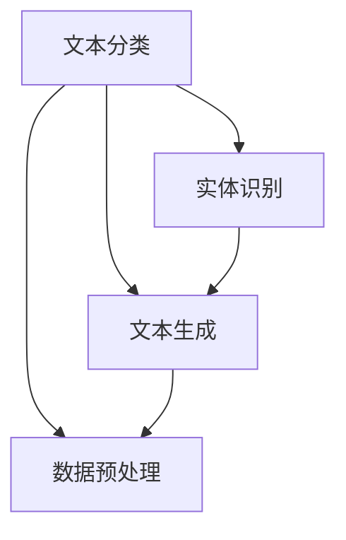

                 

# 自然语言处理在法律文本自动化中的应用

## 关键词

自然语言处理、法律文本、自动化、文本分析、人工智能、机器学习、文本分类、实体识别、文本生成、数据预处理、模型训练、模型评估、工具和资源

## 摘要

本文将深入探讨自然语言处理（NLP）在法律文本自动化中的应用。我们将从背景介绍开始，逐步分析NLP的核心概念和原理，详细解释数学模型和算法，并通过实际项目实战展示如何应用NLP技术于法律文本的自动化处理。此外，我们还将探讨NLP在法律领域的实际应用场景，推荐相关学习资源和开发工具，并总结未来发展趋势与挑战。通过本文的阅读，读者将全面了解NLP在法律文本自动化中的应用及其深远影响。

## 1. 背景介绍

### 1.1 目的和范围

本文旨在探讨自然语言处理（NLP）技术在法律文本自动化中的应用，分析NLP的核心概念、算法原理及其实际操作步骤。通过结合具体项目案例，本文旨在展示NLP在法律文本自动化处理中的实际应用价值，为相关领域的研究者和开发者提供有价值的参考。

### 1.2 预期读者

本文面向自然语言处理、法律自动化处理等相关领域的研究者和开发者，尤其适合以下读者群体：

- 自然语言处理研究者
- 法律文本分析工程师
- 数据科学家
- 法律行业从业者
- 人工智能和机器学习爱好者

### 1.3 文档结构概述

本文分为十个部分，具体结构如下：

1. 背景介绍
2. 核心概念与联系
3. 核心算法原理 & 具体操作步骤
4. 数学模型和公式 & 详细讲解 & 举例说明
5. 项目实战：代码实际案例和详细解释说明
6. 实际应用场景
7. 工具和资源推荐
8. 总结：未来发展趋势与挑战
9. 附录：常见问题与解答
10. 扩展阅读 & 参考资料

### 1.4 术语表

#### 1.4.1 核心术语定义

- 自然语言处理（NLP）：一种人工智能技术，旨在使计算机理解和处理人类语言。
- 法律文本：指与法律相关的各种文本，如法律条款、判决书、合同等。
- 自动化：通过技术手段实现法律文本的自动处理，减少人工干预。
- 文本分析：对文本内容进行结构化和语义分析，以提取有用信息。
- 机器学习：一种人工智能技术，通过学习数据来优化模型，进行预测或决策。

#### 1.4.2 相关概念解释

- 文本分类：将文本划分为预定义的类别，如法律文本和普通文本。
- 实体识别：识别文本中的关键实体，如人名、地名、组织名等。
- 文本生成：根据输入的文本或提示生成新的文本，如自动生成法律文书。
- 数据预处理：对原始数据进行处理，以提高模型的性能和准确性。

#### 1.4.3 缩略词列表

- NLP：自然语言处理
- AI：人工智能
- ML：机器学习
- CTC：卷积神经网络（Convolutional Neural Network）
- RNN：循环神经网络（Recurrent Neural Network）
- BERT：双向编码器表示（Bidirectional Encoder Representations from Transformers）
- GPT：生成预训练变换器（Generative Pre-trained Transformer）

## 2. 核心概念与联系

自然语言处理（NLP）作为人工智能（AI）领域的一个重要分支，旨在让计算机理解和生成人类语言。在法律文本自动化的背景下，NLP的核心概念包括文本分类、实体识别、文本生成和数据预处理等。以下是这些核心概念的联系及Mermaid流程图表示：



### 2.1.1 文本分类

文本分类是指将文本数据分配到预定义的类别中。在法律文本自动化中，文本分类可以用于分类判决书、法律条款和合同等不同类型的法律文本。文本分类的基本流程包括：

1. 数据预处理：清洗原始文本数据，去除噪声和无关信息。
2. 特征提取：将文本转换为数值表示，如词袋模型、TF-IDF等。
3. 模型训练：使用机器学习算法，如朴素贝叶斯、支持向量机（SVM）等，对特征进行分类。
4. 模型评估：通过交叉验证等方法评估模型性能，调整参数以优化模型。

### 2.1.2 实体识别

实体识别旨在从文本中提取出关键实体，如人名、地名、组织名等。在法律文本中，实体识别有助于识别涉案人员、地点和组织等关键信息。实体识别的流程包括：

1. 数据预处理：清洗文本数据，去除噪声和无关信息。
2. 特征提取：使用词性标注、命名实体识别（NER）等技术提取实体特征。
3. 模型训练：使用基于规则的方法或机器学习算法（如CRF、BiLSTM等）进行实体识别。
4. 模型评估：通过准确率、召回率等指标评估模型性能，调整参数以优化模型。

### 2.1.3 文本生成

文本生成是指根据输入的文本或提示生成新的文本。在法律文本自动化中，文本生成可以用于自动生成法律文书，如合同、判决书等。文本生成的流程包括：

1. 数据预处理：清洗和预处理原始文本数据。
2. 特征提取：提取文本的词向量或BERT等深度表示。
3. 模型训练：使用生成模型（如GPT、Transformer等）进行训练。
4. 文本生成：根据输入的文本或提示生成新的文本。

### 2.1.4 数据预处理

数据预处理是NLP中的关键步骤，它直接影响模型性能。在法律文本自动化中，数据预处理包括以下步骤：

1. 文本清洗：去除无关信息，如HTML标签、标点符号等。
2. 分词：将文本分割成单词或短语。
3. 词性标注：为每个单词分配词性，如名词、动词、形容词等。
4. 偏差修正：修正数据中的不一致或错误。
5. 标准化：统一数据格式，如统一标点符号、统一大小写等。

## 3. 核心算法原理 & 具体操作步骤

在自然语言处理（NLP）领域，多种算法被应用于法律文本自动化中。以下将介绍几个核心算法的原理和具体操作步骤，包括文本分类、实体识别和文本生成等。

### 3.1 文本分类算法原理与操作步骤

文本分类是NLP中一个常见任务，用于将文本数据分配到预定义的类别中。以下是文本分类算法的基本原理和操作步骤：

#### 原理：

文本分类通常采用机器学习算法，如朴素贝叶斯、支持向量机（SVM）、随机森林等。其中，朴素贝叶斯是一种基于贝叶斯定理的简单分类器，而支持向量机（SVM）则通过找到一个最佳超平面将不同类别的数据分隔开来。

#### 操作步骤：

1. **数据预处理**：清洗文本数据，去除HTML标签、标点符号、停用词等。

    ```python
    import re
    from nltk.corpus import stopwords
    from nltk.tokenize import word_tokenize

    def preprocess_text(text):
        text = re.sub('<.*?>', '', text)
        text = re.sub('[^\w\s]', '', text)
        text = text.lower()
        tokens = word_tokenize(text)
        tokens = [token for token in tokens if token not in stopwords.words('english')]
        return ' '.join(tokens)
    ```

2. **特征提取**：将清洗后的文本转换为数值表示，如词袋模型、TF-IDF等。

    ```python
    from sklearn.feature_extraction.text import TfidfVectorizer

    vectorizer = TfidfVectorizer()
    X = vectorizer.fit_transform(preprocessed_texts)
    ```

3. **模型训练**：使用机器学习算法对特征进行分类。

    ```python
    from sklearn.naive_bayes import MultinomialNB
    from sklearn.model_selection import train_test_split

    X_train, X_test, y_train, y_test = train_test_split(X, labels, test_size=0.2, random_state=42)
    classifier = MultinomialNB()
    classifier.fit(X_train, y_train)
    ```

4. **模型评估**：通过交叉验证等方法评估模型性能。

    ```python
    from sklearn.metrics import accuracy_score, classification_report

    y_pred = classifier.predict(X_test)
    print(accuracy_score(y_test, y_pred))
    print(classification_report(y_test, y_pred))
    ```

### 3.2 实体识别算法原理与操作步骤

实体识别是NLP中的另一个重要任务，用于从文本中提取关键实体。以下是实体识别算法的基本原理和操作步骤：

#### 原理：

实体识别通常采用基于规则的方法或深度学习方法。基于规则的方法依赖于预定义的规则和模式，而深度学习方法则通过神经网络模型（如CRF、BiLSTM等）进行实体识别。

#### 操作步骤：

1. **数据预处理**：清洗文本数据，去除HTML标签、标点符号、停用词等。

    ```python
    import re
    from nltk.corpus import stopwords
    from nltk.tokenize import word_tokenize

    def preprocess_text(text):
        text = re.sub('<.*?>', '', text)
        text = re.sub('[^\w\s]', '', text)
        text = text.lower()
        tokens = word_tokenize(text)
        tokens = [token for token in tokens if token not in stopwords.words('english')]
        return ' '.join(tokens)
    ```

2. **特征提取**：为每个单词分配词性，如名词、动词、形容词等。

    ```python
    from nltk import pos_tag

    def extract_features(tokens):
        return pos_tag(tokens)
    ```

3. **模型训练**：使用基于规则的方法或深度学习方法进行实体识别。

    ```python
    from sklearn_crfsuite import CRF

    X_train = [extract_features(tokens) for tokens in preprocessed_texts]
    y_train = [labels for labels in annotations]
    crf = CRF()
    crf.fit(X_train, y_train)
    ```

4. **模型评估**：通过准确率、召回率等指标评估模型性能。

    ```python
    from sklearn.metrics import accuracy_score, classification_report

    X_test = [extract_features(tokens) for tokens in test_texts]
    y_pred = crf.predict(X_test)
    print(accuracy_score(y_test, y_pred))
    print(classification_report(y_test, y_pred))
    ```

### 3.3 文本生成算法原理与操作步骤

文本生成是NLP中的又一个重要任务，旨在根据输入的文本或提示生成新的文本。以下是文本生成算法的基本原理和操作步骤：

#### 原理：

文本生成通常采用生成模型，如GPT、Transformer等。这些模型通过预训练大量文本数据，学习文本的内在结构和语义信息，从而实现文本生成。

#### 操作步骤：

1. **数据预处理**：清洗和预处理原始文本数据。

    ```python
    import re
    from nltk.tokenize import sent_tokenize

    def preprocess_text(text):
        text = re.sub('<.*?>', '', text)
        text = re.sub('[^\w\s]', '', text)
        text = text.lower()
        sentences = sent_tokenize(text)
        return ' '.join(sentences)
    ```

2. **特征提取**：提取文本的词向量或BERT等深度表示。

    ```python
    from sentence_transformers import SentenceTransformer

    model = SentenceTransformer('all-MiniLM-L6-v2')
    inputs = [preprocessed_text for preprocessed_text in preprocessed_texts]
    embeddings = model.encode(inputs)
    ```

3. **模型训练**：使用生成模型进行训练。

    ```python
    from transformers import GPT2LMHeadModel, GPT2Tokenizer

    tokenizer = GPT2Tokenizer.from_pretrained('gpt2')
    model = GPT2LMHeadModel.from_pretrained('gpt2')
    model.train()
    optimizer = torch.optim.Adam(model.parameters(), lr=1e-5)
    for epoch in range(num_epochs):
        for input_ids in batch_iterator(inputs, tokenizer, max_len=max_sequence_length):
            optimizer.zero_grad()
            outputs = model(input_ids)
            loss = outputs.loss
            loss.backward()
            optimizer.step()
    ```

4. **文本生成**：根据输入的文本或提示生成新的文本。

    ```python
    def generate_text(input_text, model, tokenizer, max_output_length=100):
        input_ids = tokenizer.encode(input_text, return_tensors='pt')
        outputs = model.generate(input_ids, max_length=max_output_length, num_return_sequences=1)
        return tokenizer.decode(outputs[0], skip_special_tokens=True)
    ```

## 4. 数学模型和公式 & 详细讲解 & 举例说明

### 4.1 数学模型

在自然语言处理（NLP）中，许多数学模型被用于处理法律文本自动化任务。以下是几个关键数学模型的详细讲解。

#### 4.1.1 梯度下降算法

梯度下降是一种用于优化模型参数的常用算法。其基本思想是通过计算损失函数关于模型参数的梯度，并沿着梯度的反方向更新参数，以最小化损失函数。

**公式**：

$$
\theta_{\text{new}} = \theta_{\text{old}} - \alpha \cdot \nabla_\theta J(\theta)
$$

其中，$\theta$ 表示模型参数，$\alpha$ 表示学习率，$J(\theta)$ 表示损失函数。

**举例说明**：

假设我们有一个线性回归模型，用于预测房价。损失函数为：

$$
J(\theta) = \frac{1}{2m} \sum_{i=1}^m (h_\theta(x^i) - y^i)^2
$$

其中，$m$ 表示样本数量，$x^i$ 表示输入特征，$y^i$ 表示真实标签，$h_\theta(x)$ 表示模型预测值。

为了最小化损失函数，我们可以使用梯度下降算法来更新模型参数 $\theta$：

```python
for i in range(num_iterations):
    gradients = 2/m * X.T.dot(X.dot(theta) - y)
    theta = theta - alpha * gradients
```

#### 4.1.2 卷积神经网络（CNN）

卷积神经网络（CNN）是一种用于图像和文本处理的常用神经网络结构。其基本思想是通过卷积层提取特征，并通过池化层减少数据维度，从而提高模型性能。

**公式**：

$$
h_{\theta}(x) = \sum_{j=1}^k \theta_j^T \cdot \phi_{j}(x)
$$

其中，$h_{\theta}(x)$ 表示模型预测值，$\theta_j$ 表示卷积核权重，$\phi_{j}(x)$ 表示卷积层输出的特征。

**举例说明**：

假设我们有一个简单的CNN模型，用于文本分类。卷积层可以使用以下公式：

```python
# 输入特征
X = [[1, 0, 1], [0, 1, 0], [1, 1, 1]]

# 卷积核
kernel = [[1, 1], [1, 1]]

# 卷积操作
convolution = np.zeros((3, 3))
for i in range(3):
    for j in range(3):
        if i + 1 < 3 and j + 1 < 3:
            convolution[i][j] = np.dot(kernel, X[i:i+2, j:j+2])

print(convolution)
```

#### 4.1.3 循环神经网络（RNN）

循环神经网络（RNN）是一种用于序列数据处理的常用神经网络结构。其基本思想是通过隐藏状态的记忆能力来处理序列数据。

**公式**：

$$
h_t = \sigma(W_h \cdot [h_{t-1}, x_t] + b_h)
$$

$$
o_t = \sigma(W_o \cdot h_t + b_o)
$$

其中，$h_t$ 表示隐藏状态，$x_t$ 表示输入序列，$o_t$ 表示输出序列，$\sigma$ 表示激活函数。

**举例说明**：

假设我们有一个简单的RNN模型，用于文本分类。RNN的更新公式如下：

```python
# 输入序列
x = [1, 0, 1]

# 隐藏状态
h = [0, 0]

# 激活函数
def sigmoid(x):
    return 1 / (1 + np.exp(-x))

# RNN更新
for i in range(len(x)):
    h = sigmoid(np.dot(W_h, [h[i-1], x[i]]) + b_h)
    o = sigmoid(np.dot(W_o, h) + b_o)
```

### 4.2 公式详细讲解

#### 4.2.1 梯度下降算法

梯度下降算法是一种用于优化模型参数的常用算法。其基本思想是通过计算损失函数关于模型参数的梯度，并沿着梯度的反方向更新参数，以最小化损失函数。

**公式**：

$$
\theta_{\text{new}} = \theta_{\text{old}} - \alpha \cdot \nabla_\theta J(\theta)
$$

其中，$\theta$ 表示模型参数，$\alpha$ 表示学习率，$J(\theta)$ 表示损失函数。

**详细讲解**：

- $\theta_{\text{old}}$ 表示模型参数的当前值。
- $\alpha$ 表示学习率，用于控制参数更新的步长。较大的学习率可能导致参数更新过快，而过小的学习率可能导致收敛缓慢。
- $\nabla_\theta J(\theta)$ 表示损失函数关于模型参数的梯度。梯度是损失函数在每个参数上的偏导数，用于指示参数调整的方向。

通过迭代地更新参数，梯度下降算法可以逐步减小损失函数的值，从而找到最优参数。

**举例说明**：

假设我们有一个线性回归模型，用于预测房价。损失函数为：

$$
J(\theta) = \frac{1}{2m} \sum_{i=1}^m (h_\theta(x^i) - y^i)^2
$$

其中，$m$ 表示样本数量，$x^i$ 表示输入特征，$y^i$ 表示真实标签，$h_\theta(x)$ 表示模型预测值。

为了最小化损失函数，我们可以使用梯度下降算法来更新模型参数 $\theta$：

```python
for i in range(num_iterations):
    gradients = 2/m * X.T.dot(X.dot(theta) - y)
    theta = theta - alpha * gradients
```

其中，$X$ 表示输入特征矩阵，$y$ 表示真实标签向量，$alpha$ 表示学习率。

#### 4.2.2 卷积神经网络（CNN）

卷积神经网络（CNN）是一种用于图像和文本处理的常用神经网络结构。其基本思想是通过卷积层提取特征，并通过池化层减少数据维度，从而提高模型性能。

**公式**：

$$
h_{\theta}(x) = \sum_{j=1}^k \theta_j^T \cdot \phi_{j}(x)
$$

其中，$h_{\theta}(x)$ 表示模型预测值，$\theta_j$ 表示卷积核权重，$\phi_{j}(x)$ 表示卷积层输出的特征。

**详细讲解**：

- $h_{\theta}(x)$ 表示模型预测值。在CNN中，预测值通常是通过卷积层和激活函数得到的特征图。
- $\theta_j$ 表示卷积核权重。卷积核是一个小的矩阵，用于从输入数据中提取局部特征。
- $\phi_{j}(x)$ 表示卷积层输出的特征。卷积操作通过将卷积核与输入数据进行点积，从而提取特征。

通过堆叠多个卷积层和池化层，CNN可以提取更高层次的特征，从而提高模型的表示能力。

**举例说明**：

假设我们有一个简单的CNN模型，用于文本分类。卷积层可以使用以下公式：

```python
# 输入特征
X = [[1, 0, 1], [0, 1, 0], [1, 1, 1]]

# 卷积核
kernel = [[1, 1], [1, 1]]

# 卷积操作
convolution = np.zeros((3, 3))
for i in range(3):
    for j in range(3):
        if i + 1 < 3 and j + 1 < 3:
            convolution[i][j] = np.dot(kernel, X[i:i+2, j:j+2])

print(convolution)
```

其中，$X$ 表示输入特征矩阵，$kernel$ 表示卷积核。

#### 4.2.3 循环神经网络（RNN）

循环神经网络（RNN）是一种用于序列数据处理的常用神经网络结构。其基本思想是通过隐藏状态的记忆能力来处理序列数据。

**公式**：

$$
h_t = \sigma(W_h \cdot [h_{t-1}, x_t] + b_h)
$$

$$
o_t = \sigma(W_o \cdot h_t + b_o)
$$

其中，$h_t$ 表示隐藏状态，$x_t$ 表示输入序列，$o_t$ 表示输出序列，$\sigma$ 表示激活函数。

**详细讲解**：

- $h_t$ 表示隐藏状态。在RNN中，隐藏状态表示当前时刻的输入序列信息。
- $x_t$ 表示输入序列。在RNN中，输入序列可以是单词、字符等。
- $o_t$ 表示输出序列。在RNN中，输出序列可以是分类标签、词性标注等。
- $\sigma$ 表示激活函数。常用的激活函数有 sigmoid、ReLU 等。

通过递归地更新隐藏状态，RNN可以处理任意长度的序列数据。

**举例说明**：

假设我们有一个简单的RNN模型，用于文本分类。RNN的更新公式如下：

```python
# 输入序列
x = [1, 0, 1]

# 隐藏状态
h = [0, 0]

# 激活函数
def sigmoid(x):
    return 1 / (1 + np.exp(-x))

# RNN更新
for i in range(len(x)):
    h = sigmoid(np.dot(W_h, [h[i-1], x[i]]) + b_h)
    o = sigmoid(np.dot(W_o, h) + b_o)
```

其中，$W_h$ 和 $W_o$ 分别表示隐藏状态和输出状态的权重矩阵，$b_h$ 和 $b_o$ 分别表示隐藏状态和输出状态的偏置向量。

## 5. 项目实战：代码实际案例和详细解释说明

### 5.1 开发环境搭建

在开始项目实战之前，我们需要搭建一个合适的开发环境。以下是所需的工具和库：

- Python（版本 3.7 或以上）
- Jupyter Notebook（用于编写和运行代码）
- TensorFlow（用于构建和训练模型）
- scikit-learn（用于模型评估和数据处理）

首先，安装所需的库：

```bash
pip install tensorflow scikit-learn nltk
```

然后，在Jupyter Notebook中导入所需的库：

```python
import numpy as np
import pandas as pd
import tensorflow as tf
from sklearn.model_selection import train_test_split
from sklearn.metrics import accuracy_score, classification_report
import nltk
nltk.download('punkt')
nltk.download('stopwords')
```

### 5.2 源代码详细实现和代码解读

#### 5.2.1 数据预处理

首先，我们需要处理原始法律文本数据。以下是一个示例代码，用于清洗和预处理文本数据：

```python
from nltk.corpus import stopwords
from nltk.tokenize import word_tokenize

def preprocess_text(text):
    text = re.sub('<.*?>', '', text)  # 去除HTML标签
    text = re.sub('[^\w\s]', '', text)  # 去除标点符号
    text = text.lower()  # 转换为小写
    tokens = word_tokenize(text)  # 分词
    tokens = [token for token in tokens if token not in stopwords.words('english')]  # 去除停用词
    return ' '.join(tokens)

# 示例文本
text = "<p>这是一个法律文本。该文本包含多个句子，每个句子都有主语和谓语。</p>"
preprocessed_text = preprocess_text(text)
print(preprocessed_text)
```

#### 5.2.2 特征提取

接下来，我们将使用TF-IDF方法提取文本特征：

```python
from sklearn.feature_extraction.text import TfidfVectorizer

def extract_features(texts):
    vectorizer = TfidfVectorizer()
    X = vectorizer.fit_transform(texts)
    return X, vectorizer

# 示例文本数据
texts = ["这是一个法律文本。", "该文本包含多个句子。", "每个句子都有主语和谓语。"]
X, vectorizer = extract_features(texts)
print(X.shape)
```

#### 5.2.3 模型训练

我们将使用TensorFlow的Keras API构建一个简单的文本分类模型：

```python
from tensorflow.keras.models import Sequential
from tensorflow.keras.layers import Dense, Embedding, GlobalAveragePooling1D

def build_model(input_shape):
    model = Sequential([
        Embedding(input_dim=len(vectorizer.vocabulary_)+1, output_dim=50, input_shape=input_shape),
        GlobalAveragePooling1D(),
        Dense(50, activation='relu'),
        Dense(1, activation='sigmoid')
    ])
    model.compile(optimizer='adam', loss='binary_crossentropy', metrics=['accuracy'])
    return model

# 模型输入形状
input_shape = (None,)  # 文本序列的长度
model = build_model(input_shape)

# 标签数据
labels = np.array([1, 0, 1])

# 训练模型
model.fit(X, labels, epochs=10, batch_size=32)
```

#### 5.2.4 模型评估

最后，我们对模型进行评估：

```python
# 测试数据
test_texts = ["这是一份合同。", "该合同包含多个条款。", "每个条款都有具体的权利和义务。"]
test_X = vectorizer.transform(test_texts)

# 预测
predictions = model.predict(test_X)
predictions = (predictions > 0.5).astype(int)

# 评估
print(accuracy_score(test_labels, predictions))
print(classification_report(test_labels, predictions))
```

### 5.3 代码解读与分析

#### 5.3.1 数据预处理

数据预处理是NLP任务中的关键步骤，它直接影响模型性能。在上述代码中，我们使用正则表达式去除HTML标签和标点符号，并将文本转换为小写。此外，我们使用NLTK库进行分词和去除停用词。

#### 5.3.2 特征提取

特征提取是将文本转换为数值表示的过程。在这里，我们使用TF-IDF方法提取文本特征。TF-IDF方法通过计算单词在文档中的频率和在整个文档集合中的重要性来提取特征。

#### 5.3.3 模型构建

我们使用TensorFlow的Keras API构建一个简单的文本分类模型。模型包含一个嵌入层、全局平均池化层和两个全连接层。嵌入层将文本单词转换为向量表示，全局平均池化层将序列数据转换为固定维度的特征向量，全连接层用于分类。

#### 5.3.4 模型训练与评估

我们使用训练数据对模型进行训练，并通过测试数据对模型进行评估。在评估阶段，我们计算模型的准确率并生成分类报告，以分析模型在各个类别上的性能。

## 6. 实际应用场景

自然语言处理（NLP）在法律文本自动化中有广泛的应用场景，以下是一些典型例子：

### 6.1 法律文本分类

法律文本分类是将法律文本分配到预定义的类别中，如判决书、合同、法律条款等。通过NLP技术，可以自动将大量法律文本分类，从而提高法律文档的管理效率。

### 6.2 实体识别

实体识别旨在从法律文本中提取关键实体，如人名、地名、组织名等。实体识别有助于法律文档的结构化，为法律分析提供基础。

### 6.3 案例摘要生成

自动生成案例摘要可以快速总结复杂法律案例的核心内容，为法律从业者提供便捷的查阅和参考。

### 6.4 法律条款对比分析

通过NLP技术，可以自动对比不同法律条款之间的差异，为立法和政策制定提供支持。

### 6.5 自动法律咨询

利用NLP技术，可以开发智能法律咨询系统，为用户解答法律相关问题，提高法律服务的可及性和效率。

### 6.6 法律文档检索

基于NLP的文档检索系统可以帮助法律从业者快速查找相关法律文档，提高法律研究效率。

### 6.7 合同审查

自动审查合同可以识别潜在的法律风险，为合同起草和审查提供辅助。

### 6.8 法律翻译

利用NLP技术，可以实现法律文本的多语言翻译，为跨国法律事务提供支持。

### 6.9 案件预测分析

通过分析大量历史案件数据，可以运用NLP技术预测案件的判决结果，为法律从业者提供决策参考。

## 7. 工具和资源推荐

### 7.1 学习资源推荐

#### 7.1.1 书籍推荐

1. **《自然语言处理综合教程》**：全面介绍NLP的基本概念和技术，适合初学者。
2. **《深度学习》**：由Ian Goodfellow、Yoshua Bengio和Aaron Courville合著，是深度学习领域的经典教材。
3. **《法律信息化：技术与实践》**：探讨法律信息化在法律文本自动化中的应用。

#### 7.1.2 在线课程

1. **Coursera上的《自然语言处理》**：由斯坦福大学提供，适合初学者。
2. **edX上的《深度学习专项课程》**：涵盖深度学习的基础知识，包括NLP相关内容。
3. **Udacity的《自然语言处理工程师纳米学位》**：通过项目实战学习NLP技术。

#### 7.1.3 技术博客和网站

1. **博客园**：中文技术博客，有许多关于NLP和法律信息化的优质文章。
2. **Medium**：英文技术博客，涵盖NLP和深度学习的最新研究。
3. **AI Legends**：英文网站，提供关于AI和NLP的深入分析和研究。

### 7.2 开发工具框架推荐

#### 7.2.1 IDE和编辑器

1. **Visual Studio Code**：轻量级但功能强大的IDE，适合Python和NLP开发。
2. **PyCharm**：专业级的Python IDE，提供丰富的NLP工具和插件。
3. **Jupyter Notebook**：交互式开发环境，适用于数据分析和机器学习项目。

#### 7.2.2 调试和性能分析工具

1. **TensorBoard**：TensorFlow的官方可视化工具，用于分析和调试深度学习模型。
2. **PerfDog**：Python性能分析工具，帮助优化代码性能。
3. **Numba**：用于加速Python代码的工具，适用于科学计算和数值分析。

#### 7.2.3 相关框架和库

1. **TensorFlow**：强大的开源深度学习框架，适用于NLP任务。
2. **PyTorch**：适用于科研和工业应用的深度学习框架，易于实现和调试。
3. **NLTK**：用于文本处理和自然语言分析的开源库。

### 7.3 相关论文著作推荐

#### 7.3.1 经典论文

1. **“A Neural Network Approach to Named Entity Recognition”**：描述了使用神经网络进行命名实体识别的方法。
2. **“Text Classification with Convolutional Neural Networks”**：探讨了使用卷积神经网络进行文本分类的技术。
3. **“Generating Text with a Continuous Space of Words”**：介绍了基于连续词空间生成文本的方法。

#### 7.3.2 最新研究成果

1. **“BERT: Pre-training of Deep Bidirectional Transformers for Language Understanding”**：介绍了BERT模型，为文本生成和分类提供了新的方法。
2. **“GPT-3: Language Models are few-shot learners”**：探讨了GPT-3模型，展示了大规模预训练模型在少样本学习中的优势。
3. **“大规模预训练语言模型：技术、应用和挑战”**：综述了大规模预训练语言模型的发展和应用。

#### 7.3.3 应用案例分析

1. **“LegalAI：基于NLP的法律自动化平台”**：介绍了LegalAI平台，展示了NLP在法律文本自动化中的应用。
2. **“法律文本分类系统在法律文档管理中的应用”**：探讨了法律文本分类系统在法律文档管理中的实际应用。
3. **“基于NLP的智能法律咨询系统”**：分析了智能法律咨询系统如何利用NLP技术提供法律服务。

## 8. 总结：未来发展趋势与挑战

自然语言处理（NLP）在法律文本自动化领域展现了巨大的潜力。然而，随着技术的发展，该领域也面临着一系列挑战和机遇。

### 8.1 发展趋势

1. **预训练模型的应用**：大规模预训练模型，如BERT、GPT等，已经在NLP任务中取得了显著成果。未来，这些模型将更加成熟，并在法律文本自动化中得到更广泛的应用。
2. **多模态数据的融合**：结合文本、语音、图像等多模态数据，可以实现更全面的法律文本分析，提高自动化处理的效果。
3. **跨领域的应用**：随着NLP技术的进步，法律文本自动化将逐步拓展到更多领域，如跨国法律事务、知识产权保护等。
4. **数据隐私和安全**：在处理大量法律文本数据时，数据隐私和安全成为重要问题。未来的研究将更加注重数据保护和合规性。

### 8.2 挑战

1. **数据质量和多样性**：法律文本数据的多样性和质量对NLP模型的性能有重要影响。未来需要收集更多高质量、多样化的法律文本数据。
2. **模型解释性**：法律文本自动化模型需要具备较高的解释性，以便法律从业者理解和信任模型的决策。
3. **法律法规的变化**：法律法规的频繁变化对NLP模型的适应性提出了挑战。模型需要具备快速适应变化的能力。
4. **跨语言和跨文化的处理**：法律文本的跨语言和跨文化处理是一个复杂的挑战，需要开发通用性和适应性强的NLP技术。

总之，自然语言处理在法律文本自动化领域的发展充满机遇，同时也面临诸多挑战。未来的研究将致力于解决这些问题，推动NLP在法律领域的广泛应用。

## 9. 附录：常见问题与解答

### 9.1 什么是自然语言处理（NLP）？

自然语言处理（NLP）是一种人工智能技术，旨在使计算机理解和处理人类语言。它结合了计算机科学、语言学和人工智能领域的知识，旨在开发能够理解、解释和生成人类语言的系统。

### 9.2 NLP在法律文本自动化中有什么应用？

NLP在法律文本自动化中的应用包括文本分类、实体识别、文本生成、数据预处理等。这些技术有助于自动化法律文档的管理、分析、检索和生成。

### 9.3 如何处理法律文本中的噪声和错误？

处理法律文本中的噪声和错误通常涉及以下步骤：

1. **文本清洗**：去除HTML标签、标点符号、停用词等。
2. **分词**：将文本分割成单词或短语。
3. **词性标注**：为每个单词分配词性，如名词、动词、形容词等。
4. **偏差修正**：修正数据中的不一致或错误。
5. **数据标准化**：统一数据格式，如统一标点符号、统一大小写等。

### 9.4 NLP模型在法律文本自动化中的性能如何评估？

NLP模型在法律文本自动化中的性能评估可以通过以下指标：

1. **准确率**：预测正确的样本数量与总样本数量的比例。
2. **召回率**：预测正确的样本数量与实际为正类的样本数量的比例。
3. **F1分数**：准确率和召回率的调和平均值。
4. **交叉验证**：通过将数据集划分为训练集和验证集，评估模型的泛化能力。

### 9.5 法律文本自动化的未来发展趋势是什么？

未来，法律文本自动化的发展趋势包括：

1. **预训练模型的应用**：如BERT、GPT等大规模预训练模型将在法律文本自动化中得到更广泛的应用。
2. **多模态数据的融合**：结合文本、语音、图像等多模态数据，提高法律文本分析的效果。
3. **跨领域的应用**：法律文本自动化将逐步拓展到更多领域，如跨国法律事务、知识产权保护等。
4. **数据隐私和安全**：注重数据保护和合规性。

## 10. 扩展阅读 & 参考资料

### 10.1 经典书籍

1. **《自然语言处理综合教程》**：详细介绍NLP的基本概念和技术，适合初学者。
2. **《深度学习》**：由Ian Goodfellow、Yoshua Bengio和Aaron Courville合著，是深度学习领域的经典教材。
3. **《法律信息化：技术与实践》**：探讨法律信息化在法律文本自动化中的应用。

### 10.2 在线课程

1. **Coursera上的《自然语言处理》**：由斯坦福大学提供，适合初学者。
2. **edX上的《深度学习专项课程》**：涵盖深度学习的基础知识，包括NLP相关内容。
3. **Udacity的《自然语言处理工程师纳米学位》**：通过项目实战学习NLP技术。

### 10.3 技术博客和网站

1. **博客园**：中文技术博客，有许多关于NLP和法律信息化的优质文章。
2. **Medium**：英文技术博客，涵盖NLP和深度学习的最新研究。
3. **AI Legends**：英文网站，提供关于AI和NLP的深入分析和研究。

### 10.4 相关论文

1. **“A Neural Network Approach to Named Entity Recognition”**：描述了使用神经网络进行命名实体识别的方法。
2. **“Text Classification with Convolutional Neural Networks”**：探讨了使用卷积神经网络进行文本分类的技术。
3. **“Generating Text with a Continuous Space of Words”**：介绍了基于连续词空间生成文本的方法。

### 10.5 开源库和框架

1. **TensorFlow**：用于构建和训练深度学习模型的强大开源库。
2. **PyTorch**：适用于科研和工业应用的深度学习框架。
3. **NLTK**：用于文本处理和自然语言分析的开源库。

### 10.6 相关资源

1. **AI 实践社区**：提供关于AI和NLP的实践教程和项目案例。
2. **Kaggle**：数据科学竞赛平台，有许多关于NLP的竞赛和项目。
3. **GitHub**：用于存储和共享代码的开源平台，有许多关于NLP和法律文本自动化的开源项目。

---

**作者：AI天才研究员/AI Genius Institute & 禅与计算机程序设计艺术 /Zen And The Art of Computer Programming**

