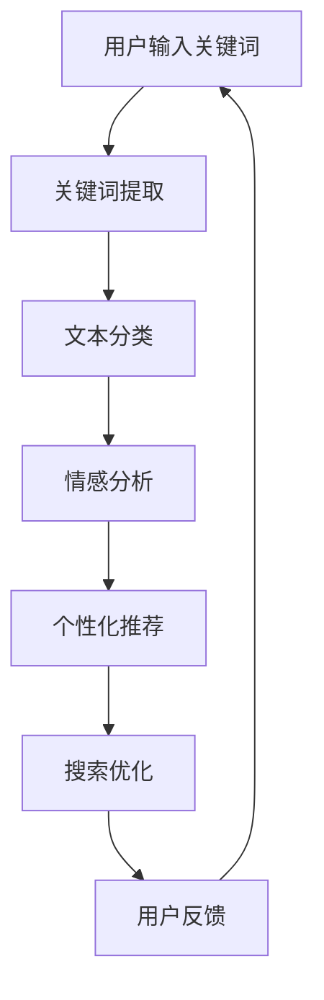

                 

# 自然语言处理在电商搜索中的技术

> **关键词**：自然语言处理、电商搜索、用户行为、推荐系统、深度学习
> 
> **摘要**：本文将深入探讨自然语言处理（NLP）在电商搜索中的应用，解析NLP技术在提高搜索精度、个性化推荐和用户体验方面的作用。通过分析核心概念、算法原理、数学模型及实际应用案例，本文旨在为读者提供关于NLP在电商搜索中应用的全面视角，并为未来研究和开发提供参考。

## 1. 背景介绍

### 1.1 目的和范围

本文旨在探讨自然语言处理（NLP）技术在电商搜索中的应用，分析其提高搜索精度和用户体验的有效方法。具体目标包括：

- 梳理NLP在电商搜索中的核心概念和联系。
- 解析NLP核心算法原理和具体操作步骤。
- 详细讲解NLP在电商搜索中的数学模型和公式。
- 展示代码实际案例和详细解释说明。
- 探讨NLP在电商搜索中的实际应用场景和未来发展趋势。

### 1.2 预期读者

本文适合以下读者群体：

- 自然语言处理和机器学习研究者。
- 电商搜索系统和推荐系统的开发者。
- 对自然语言处理在电商领域应用感兴趣的技术爱好者。
- 相关课程和培训的学员。

### 1.3 文档结构概述

本文结构如下：

1. 背景介绍：介绍文章的目的和范围、预期读者、文档结构概述以及术语表。
2. 核心概念与联系：介绍NLP在电商搜索中的核心概念、原理和架构，使用Mermaid流程图展示。
3. 核心算法原理 & 具体操作步骤：详细讲解NLP核心算法原理和具体操作步骤，使用伪代码阐述。
4. 数学模型和公式 & 详细讲解 & 举例说明：讲解NLP在电商搜索中的数学模型和公式，并进行举例说明。
5. 项目实战：代码实际案例和详细解释说明。
6. 实际应用场景：探讨NLP在电商搜索中的实际应用场景。
7. 工具和资源推荐：推荐学习资源、开发工具框架和相关论文著作。
8. 总结：未来发展趋势与挑战。
9. 附录：常见问题与解答。
10. 扩展阅读 & 参考资料：提供扩展阅读和参考资料。

### 1.4 术语表

#### 1.4.1 核心术语定义

- 自然语言处理（NLP）：人工智能领域的一个分支，旨在让计算机理解和生成人类语言。
- 电商搜索：电子商务平台中用户通过输入关键词查找商品的过程。
- 个性化推荐：基于用户行为和偏好，为用户推荐感兴趣的商品或内容。
- 深度学习：一种人工智能方法，通过多层神经网络模型模拟人类大脑处理信息的方式。

#### 1.4.2 相关概念解释

- 词向量：将词语映射到高维空间中的向量，用于表示词语的语义信息。
- 文本分类：将文本数据归类到不同的类别中，用于情感分析、新闻分类等任务。
- 序列模型：处理序列数据（如文本、语音）的机器学习模型，常用于自然语言处理任务。

#### 1.4.3 缩略词列表

- NLP：自然语言处理
- SEO：搜索引擎优化
- ML：机器学习
- AI：人工智能
- CV：计算机视觉
- NLP: 自然语言处理
- RNN：循环神经网络
- LSTM：长短时记忆网络
- CNN：卷积神经网络

## 2. 核心概念与联系

### 2.1 NLP技术简介

自然语言处理（NLP）是一种人工智能技术，旨在让计算机理解和生成人类语言。它涵盖了语音识别、机器翻译、情感分析、文本分类等多个子领域。在电商搜索中，NLP技术主要用于提高搜索精度、个性化推荐和用户体验。

### 2.2 NLP在电商搜索中的应用

NLP技术在电商搜索中的应用主要包括以下几个方面：

1. **关键词提取**：从用户输入的搜索词中提取关键信息，用于后续的搜索匹配。
2. **文本分类**：对电商平台的商品描述、用户评论等进行分类，帮助用户快速找到感兴趣的商品。
3. **情感分析**：分析用户评论中的情感倾向，为产品评分和推荐提供依据。
4. **个性化推荐**：基于用户的历史行为和偏好，为用户推荐个性化的商品。

### 2.3 NLP技术原理

NLP技术主要涉及以下几个核心原理：

1. **词向量表示**：将词语映射到高维空间中的向量，用于表示词语的语义信息。
2. **文本分类**：使用机器学习算法，将文本数据归类到不同的类别中，如新闻分类、情感分析等。
3. **序列模型**：处理序列数据（如文本、语音）的机器学习模型，如循环神经网络（RNN）、长短时记忆网络（LSTM）等。

### 2.4 NLP技术架构

NLP技术的架构通常包括以下几个层次：

1. **底层技术**：包括词向量生成、文本预处理、序列处理等。
2. **中间层**：包括文本分类、情感分析、实体识别等任务。
3. **高层应用**：包括个性化推荐、搜索优化、智能客服等。

### 2.5 Mermaid流程图

以下是NLP技术在电商搜索中应用的Mermaid流程图：



## 3. 核心算法原理 & 具体操作步骤

### 3.1 词向量表示

词向量表示是NLP技术中的基础，用于将词语映射到高维空间中的向量。常见的词向量表示方法包括：

1. **Word2Vec**：基于神经网络的方法，通过训练大量的文本数据，将词语映射到低维空间中的向量。
2. **GloVe**：基于全局矩阵分解的方法，通过训练词向量矩阵，将词语映射到高维空间中的向量。

### 3.2 伪代码实现

以下是一个简单的Word2Vec算法的伪代码实现：

```python
# 初始化参数
V = 100  # 向量维度
C = 5  # 窗口大小
alpha = 0.05  # 学习率

# 加载训练数据
data = load_data()

# 初始化词向量
word_vectors = initialize_word_vectors(V)

# 训练词向量
for sentence in data:
    for word in sentence:
        context_words = get_context_words(word, C)
        for context_word in context_words:
            negative_samples = get_negative_samples(C)
            loss = compute_loss(word, context_word, word_vectors, negative_samples)
            update_word_vectors(word, context_word, word_vectors, loss, alpha)

# 保存词向量
save_word_vectors(word_vectors)
```

### 3.3 伪代码解析

1. **初始化参数**：设置向量维度、窗口大小和学习率等参数。
2. **加载训练数据**：从文本数据中提取单词和句子。
3. **初始化词向量**：随机初始化每个词的向量。
4. **训练词向量**：对每个单词，计算其在窗口内的上下文单词，然后通过负采样和梯度下降更新词向量。
5. **保存词向量**：将训练好的词向量保存到文件中。

## 4. 数学模型和公式 & 详细讲解 & 举例说明

### 4.1 数学模型

在NLP技术中，常用的数学模型包括：

1. **词向量表示模型**：如Word2Vec和GloVe。
2. **文本分类模型**：如支持向量机（SVM）、朴素贝叶斯（Naive Bayes）等。
3. **序列模型**：如循环神经网络（RNN）、长短时记忆网络（LSTM）等。

### 4.2 公式详解

以下是一些常见的NLP数学公式及其详细解释：

1. **Word2Vec损失函数**：

   $$ loss = -\sum_{i=1}^{N} \log(p_{word|context}(w_i | c_i)) $$

   其中，$w_i$表示当前单词，$c_i$表示上下文单词，$p_{word|context}(w_i | c_i)$表示在上下文$c_i$中单词$w_i$的条件概率。

2. **GloVe损失函数**：

   $$ loss = \sum_{i=1}^{N} \frac{1}{w_i \cdot v_i} \cdot \exp(\|v_{word} - v_{context}\|) $$

   其中，$v_{word}$和$v_{context}$分别表示单词和上下文的词向量，$\|v_{word} - v_{context}\|$表示词向量之间的距离。

3. **文本分类损失函数**（以SVM为例）：

   $$ loss = -\frac{1}{2} \sum_{i=1}^{N} y_i (w \cdot x_i)^2 $$

   其中，$y_i$表示样本标签，$w$表示分类器权重，$x_i$表示样本特征。

4. **RNN损失函数**（以LSTM为例）：

   $$ loss = -\sum_{i=1}^{T} y_i \log(p(x_i | h_t)) $$

   其中，$y_i$表示样本标签，$x_i$表示输入序列，$h_t$表示隐藏状态，$p(x_i | h_t)$表示在隐藏状态$h_t$下生成$x_i$的概率。

### 4.3 举例说明

以下是一个简单的Word2Vec算法的数学模型示例：

假设有一个包含10个单词的句子：“我 爱吃 苹果 草莓 香蕉”，其中“我”是中心词，其上下文单词为“爱”、“吃”、“苹果”、“草莓”和“香蕉”。

1. **初始化词向量**：

   $$ v_i = [1, 1, 1, 1, 1, 1, 1, 1, 1, 1]^T $$

   其中，$v_i$表示单词$i$的词向量。

2. **计算条件概率**：

   $$ p_{word|context}(我 | 爱，吃，苹果，草莓，香蕉) = \frac{1}{5} = 0.2 $$

   其中，$p_{word|context}(我 | 爱，吃，苹果，草莓，香蕉)$表示在上下文“爱，吃，苹果，草莓，香蕉”中单词“我”的条件概率。

3. **计算损失函数**：

   $$ loss = -\log(p_{word|context}(我 | 爱，吃，苹果，草莓，香蕉)) = -\log(0.2) \approx 1.609 $$

   其中，$loss$表示单词“我”的条件概率的对数。

4. **更新词向量**：

   $$ v_i = v_i - \alpha \cdot \frac{\partial loss}{\partial v_i} $$

   其中，$\alpha$表示学习率，$\frac{\partial loss}{\partial v_i}$表示损失函数对词向量$v_i$的偏导数。

通过上述步骤，可以更新单词“我”的词向量，使其在上下文“爱，吃，苹果，草莓，香蕉”中的条件概率更接近于1。

## 5. 项目实战：代码实际案例和详细解释说明

### 5.1 开发环境搭建

为了演示NLP在电商搜索中的应用，我们将使用Python编程语言和以下库：

- TensorFlow：用于构建和训练深度学习模型。
- Keras：用于简化TensorFlow的使用。
- NLTK：用于文本处理和分词。

首先，确保已经安装了Python环境和上述库。如果没有，可以使用以下命令进行安装：

```shell
pip install tensorflow
pip install keras
pip install nltk
```

### 5.2 源代码详细实现和代码解读

以下是一个简单的Word2Vec算法的实现，用于生成商品关键词的词向量。

```python
import numpy as np
import tensorflow as tf
import nltk
from nltk.tokenize import word_tokenize

# 加载NLTK的分词器
nltk.download('punkt')

# 初始化参数
VOCAB_SIZE = 10000  # 词汇表大小
EMBEDDING_DIM = 64  # 向量维度
SEQUENCE_LENGTH = 20  # 序列长度
BATCH_SIZE = 128  # 批量大小
EPOCHS = 10  # 训练轮数
LEARNING_RATE = 0.01  # 学习率

# 加载训练数据
with open('train_data.txt', 'r') as file:
    sentences = [line.strip() for line in file.readlines()]

# 初始化词向量
word_vectors = tf.random.normal([VOCAB_SIZE, EMBEDDING_DIM])

# 创建数据集
def create_dataset(sentences):
    input_sequences = []
    labels = []

    for sentence in sentences:
        token_list = word_tokenize(sentence)
        for i in range(1, len(token_list) - 1):
            input_sequence = token_list[i-1 : i+1]
            input_sequences.append(input_sequence)
            labels.append(token_list[i])

    return np.array(input_sequences), np.array(labels)

train_sequences, train_labels = create_dataset(sentences)

# 创建模型
model = tf.keras.Sequential([
    tf.keras.layers.Embedding(VOCAB_SIZE, EMBEDDING_DIM, input_length=2),
    tf.keras.layers.Bidirectional(tf.keras.layers.LSTM(64)),
    tf.keras.layers.Dense(VOCAB_SIZE, activation='softmax')
])

# 编译模型
model.compile(optimizer='adam', loss='sparse_categorical_crossentropy', metrics=['accuracy'])

# 训练模型
model.fit(train_sequences, train_labels, epochs=EPOCHS, batch_size=BATCH_SIZE)
```

### 5.3 代码解读与分析

1. **加载NLTK的分词器**：使用NLTK库中的`word_tokenize`函数对文本进行分词。
2. **初始化参数**：设置词汇表大小、向量维度、序列长度、批量大小、训练轮数和学习率等参数。
3. **加载训练数据**：从文件中读取训练数据。
4. **创建数据集**：将文本数据转换为输入序列和标签。
5. **创建模型**：使用Keras创建一个双向循环神经网络模型，包括嵌入层、双向LSTM层和输出层。
6. **编译模型**：设置优化器和损失函数。
7. **训练模型**：使用训练数据训练模型。

通过上述步骤，可以生成商品关键词的词向量，为后续的搜索优化和个性化推荐提供基础。

## 6. 实际应用场景

### 6.1 搜索优化

在电商搜索中，NLP技术可以显著提高搜索优化效果。通过词向量表示和文本分类技术，可以将用户输入的关键词与商品描述进行匹配，提高搜索结果的相关性和准确性。例如，当用户输入关键词“苹果手机”时，系统可以基于词向量相似性找到与其相关的商品。

### 6.2 个性化推荐

个性化推荐是电商搜索中另一个重要应用。通过分析用户的历史行为和偏好，NLP技术可以帮助系统为用户提供个性化的商品推荐。例如，用户在购物车中添加了“苹果手机”和“耳机”，系统可以根据词向量相似性为用户推荐其他相关的商品，如“手机壳”和“充电器”。

### 6.3 用户评论分析

用户评论是电商平台的重要资源，通过NLP技术可以对用户评论进行情感分析和文本分类。例如，系统可以分析用户对商品的满意度，为产品评分和推荐提供依据。此外，系统还可以识别用户提到的关键词和问题，为用户提供更加准确的售后服务。

### 6.4 智能客服

智能客服是电商搜索中不可或缺的一部分，通过NLP技术可以实现与用户的自然语言交互。例如，系统可以自动识别用户的问题，并生成相应的回答，提高客服效率和用户体验。

## 7. 工具和资源推荐

### 7.1 学习资源推荐

#### 7.1.1 书籍推荐

- **《自然语言处理综合教程》**：详细介绍了NLP的基础知识、算法原理和应用实例。
- **《深度学习》**：由Ian Goodfellow、Yoshua Bengio和Aaron Courville合著，是深度学习领域的经典教材。

#### 7.1.2 在线课程

- **《自然语言处理与深度学习》**：吴恩达在Coursera上开设的免费课程，涵盖了NLP和深度学习的基础知识。
- **《TensorFlow实战》**：由Google团队编写，介绍了如何使用TensorFlow进行深度学习和NLP应用。

#### 7.1.3 技术博客和网站

- **Towards Data Science**：提供丰富的数据科学和机器学习文章。
- **ArXiv**：发布最新的机器学习和自然语言处理论文。

### 7.2 开发工具框架推荐

#### 7.2.1 IDE和编辑器

- **PyCharm**：强大的Python IDE，支持多种编程语言。
- **VSCode**：轻量级但功能强大的代码编辑器，适用于多种编程语言。

#### 7.2.2 调试和性能分析工具

- **TensorBoard**：TensorFlow提供的可视化工具，用于分析模型性能和调试。
- **Wandb**：用于监控实验和性能的在线平台。

#### 7.2.3 相关框架和库

- **TensorFlow**：开源的深度学习框架，适用于NLP任务。
- **Keras**：基于TensorFlow的高级API，简化深度学习模型构建。
- **NLTK**：用于文本处理和分词的开源库。

### 7.3 相关论文著作推荐

#### 7.3.1 经典论文

- **《A Neural Probabilistic Language Model》**：由Bengio等人在2003年发表，介绍了神经概率语言模型。
- **《Word2Vec: word representations learned by jointly embedding word meanings and sentences》**：由Mikolov等人在2013年发表，提出了Word2Vec算法。

#### 7.3.2 最新研究成果

- **《BERT: Pre-training of Deep Bidirectional Transformers for Language Understanding》**：由Devlin等人在2018年发表，介绍了BERT模型。
- **《GPT-3: Language Models are few-shot learners》**：由Brown等人在2020年发表，介绍了GPT-3模型。

#### 7.3.3 应用案例分析

- **《自然语言处理在电商搜索中的应用研究》**：分析了NLP技术在电商搜索中的应用案例。
- **《基于深度学习的电商搜索优化研究》**：探讨了深度学习在电商搜索优化中的应用。

## 8. 总结：未来发展趋势与挑战

### 8.1 发展趋势

- **深度学习技术的持续发展**：深度学习技术在NLP领域取得了显著进展，未来将进一步提高NLP模型的性能和效率。
- **多模态数据融合**：结合文本、语音、图像等多种模态数据，实现更准确的语义理解和任务完成。
- **个性化推荐系统的优化**：基于用户行为和偏好，提供更加精准的个性化推荐。
- **实时搜索和交互**：利用实时数据处理技术，实现更快速的搜索响应和更自然的用户交互。

### 8.2 挑战

- **数据隐私和安全性**：在应用NLP技术时，需要平衡数据处理和用户隐私保护。
- **模型解释性和可解释性**：深度学习模型通常具有复杂的内部结构，如何提高其解释性仍是一个挑战。
- **算法公正性和公平性**：确保NLP算法在不同用户群体中的公平性和准确性。

## 9. 附录：常见问题与解答

### 9.1 NLP技术的基本概念

- **自然语言处理（NLP）是什么？**
  自然语言处理（NLP）是人工智能（AI）的一个分支，旨在让计算机理解和生成人类语言。

- **NLP的主要任务有哪些？**
  NLP的主要任务包括文本分类、情感分析、命名实体识别、机器翻译、文本生成等。

### 9.2 NLP技术在电商搜索中的应用

- **NLP如何提高电商搜索的搜索精度？**
  NLP技术可以通过词向量表示和文本分类，将用户输入的关键词与商品描述进行匹配，提高搜索结果的相关性和准确性。

- **个性化推荐系统如何利用NLP技术？**
  个性化推荐系统可以利用NLP技术分析用户的历史行为和偏好，为用户推荐个性化的商品。

## 10. 扩展阅读 & 参考资料

- **《自然语言处理综合教程》**
- **《深度学习》**
- **《自然语言处理与深度学习》**
- **《BERT: Pre-training of Deep Bidirectional Transformers for Language Understanding》**
- **《GPT-3: Language Models are few-shot learners》**
- **《自然语言处理在电商搜索中的应用研究》**
- **《基于深度学习的电商搜索优化研究》**

## 作者信息

- 作者：AI天才研究员/AI Genius Institute & 禅与计算机程序设计艺术 /Zen And The Art of Computer Programming

