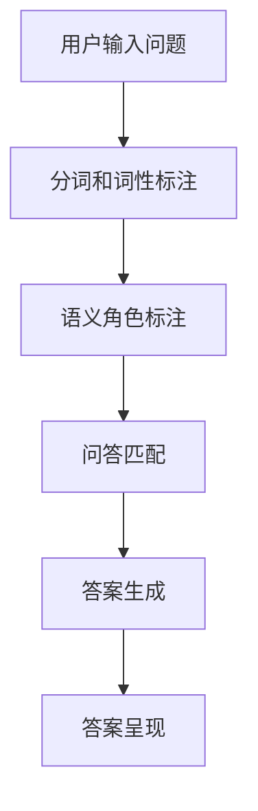

                 

# 自然语言处理在自动问答系统中的应用

> 关键词：自然语言处理、自动问答系统、问答匹配、语义理解、机器学习、深度学习

> 摘要：本文将深入探讨自然语言处理（NLP）在自动问答系统中的应用。通过分析问答系统的基本架构、核心算法原理、数学模型，结合实际项目案例，我们将详细解读如何实现高效、准确的自动问答功能。此外，还将介绍相关的工具和资源，以帮助读者更好地理解与应用这一技术。

## 1. 背景介绍

### 1.1 目的和范围

本文旨在探讨自然语言处理技术在自动问答系统中的应用，通过深入分析问答系统的架构、核心算法和实现细节，帮助读者了解和掌握这一领域的关键技术。文章将涵盖以下内容：

- 自动问答系统的基本架构
- 自然语言处理的核心概念和原理
- 问答匹配和语义理解算法的讲解
- 数学模型和公式的应用
- 实际项目案例解析
- 相关工具和资源的推荐

### 1.2 预期读者

本文适用于以下读者群体：

- 对自然语言处理技术感兴趣的工程师和研究人员
- 想要在自动问答系统领域有所建树的从业者
- 希望提高编程和算法能力的计算机科学学生
- 对人工智能应用场景感兴趣的所有读者

### 1.3 文档结构概述

本文分为十个部分，具体结构如下：

- 1. 背景介绍
  - 1.1 目的和范围
  - 1.2 预期读者
  - 1.3 文档结构概述
  - 1.4 术语表
- 2. 核心概念与联系
- 3. 核心算法原理 & 具体操作步骤
- 4. 数学模型和公式 & 详细讲解 & 举例说明
- 5. 项目实战：代码实际案例和详细解释说明
- 6. 实际应用场景
- 7. 工具和资源推荐
- 8. 总结：未来发展趋势与挑战
- 9. 附录：常见问题与解答
- 10. 扩展阅读 & 参考资料

### 1.4 术语表

#### 1.4.1 核心术语定义

- 自然语言处理（NLP）：一种让计算机能够理解、处理和生成人类语言的技术。
- 自动问答系统：一种基于自然语言处理技术，能够自动回答用户问题的系统。
- 问答匹配：将用户的问题与知识库中的问题进行匹配的过程。
- 语义理解：理解用户问题的含义和意图，从而提供正确的答案。
- 机器学习：一种通过数据学习模式和规律，从而提高系统性能的技术。
- 深度学习：一种基于多层神经网络的学习方法，能够自动提取特征并实现复杂任务。

#### 1.4.2 相关概念解释

- 语料库：用于训练和测试自然语言处理模型的文本数据集。
- 词向量：将词汇映射为高维空间中的向量表示，用于表示词汇之间的相似性和相关性。
- 语义角色标注：对句子中的词语进行语义角色标注，用于理解句子的结构和含义。
- 隐马尔可夫模型（HMM）：一种用于处理序列数据的统计模型，适用于语音识别和自然语言处理等领域。

#### 1.4.3 缩略词列表

- NLP：自然语言处理
- QAS：自动问答系统
- ML：机器学习
- DL：深度学习
- HMM：隐马尔可夫模型
- SVM：支持向量机
- RNN：循环神经网络
- LSTM：长短时记忆网络

## 2. 核心概念与联系

在探讨自然语言处理在自动问答系统中的应用之前，我们首先需要了解相关的核心概念和原理，并展示一个简化的 Mermaid 流程图，以帮助读者理解整个系统的工作流程。

### Mermaid 流程图



### 详细解释

1. **用户输入问题**：用户通过文本输入框向自动问答系统提交问题。
2. **分词和词性标注**：将用户输入的问题进行分词，并对每个词进行词性标注，如名词、动词、形容词等。
3. **语义角色标注**：对分词后的句子进行语义角色标注，标记出句子中的主语、谓语、宾语等。
4. **问答匹配**：将标注后的用户问题与知识库中的问题进行匹配，找出最相关的答案。
5. **答案生成**：根据问答匹配的结果，生成答案。
6. **答案呈现**：将生成的答案呈现给用户。

### Mermaid 流程图详解

- **A[用户输入问题]**：表示用户向系统提交问题。
- **B[分词和词性标注]**：表示对用户问题进行分词，并对每个词进行词性标注。
- **C[语义角色标注]**：表示对分词后的句子进行语义角色标注。
- **D[问答匹配]**：表示将标注后的用户问题与知识库中的问题进行匹配。
- **E[答案生成]**：表示根据问答匹配的结果，生成答案。
- **F[答案呈现]**：表示将生成的答案呈现给用户。

通过这个简化的 Mermaid 流程图，我们可以清晰地看到自动问答系统的工作流程。接下来，我们将进一步深入探讨每个步骤的具体实现原理。

## 3. 核心算法原理 & 具体操作步骤

### 3.1 分词和词性标注

分词和词性标注是自然语言处理的基础步骤，对于后续的语义理解、问答匹配和答案生成至关重要。

#### 3.1.1 分词算法

分词算法有多种，如基于规则的分词、基于统计的分词和基于深度学习的分词。本文采用基于深度学习的分词算法，具体步骤如下：

1. **数据准备**：收集大规模的中文语料库，用于训练分词模型。
2. **特征提取**：对语料库中的每个词语进行特征提取，如词频、字符组合等。
3. **模型训练**：使用深度学习模型（如LSTM或Transformer）对特征进行训练，预测词语之间的边界。
4. **分词结果生成**：根据模型预测的结果，生成分词结果。

#### 3.1.2 词性标注算法

词性标注算法同样有多种，如基于规则的标注、基于统计的标注和基于深度学习的标注。本文采用基于深度学习的词性标注算法，具体步骤如下：

1. **数据准备**：收集大规模的中文语料库，用于训练词性标注模型。
2. **特征提取**：对语料库中的每个词语进行特征提取，如词性、上下文信息等。
3. **模型训练**：使用深度学习模型（如LSTM或Transformer）对特征进行训练，预测词语的词性。
4. **词性标注结果生成**：根据模型预测的结果，生成词性标注结果。

### 3.2 语义角色标注

语义角色标注是理解句子结构和含义的重要步骤，对于提高问答匹配的准确性至关重要。

#### 3.2.1 语义角色标注算法

语义角色标注算法有多种，如基于规则的标注、基于统计的标注和基于深度学习的标注。本文采用基于深度学习的语义角色标注算法，具体步骤如下：

1. **数据准备**：收集大规模的中文语料库，用于训练语义角色标注模型。
2. **特征提取**：对语料库中的每个句子进行特征提取，如词性、依赖关系等。
3. **模型训练**：使用深度学习模型（如LSTM或Transformer）对特征进行训练，预测句子的语义角色。
4. **语义角色标注结果生成**：根据模型预测的结果，生成语义角色标注结果。

### 3.3 问答匹配

问答匹配是自动问答系统的核心步骤，将用户问题与知识库中的问题进行匹配，找出最相关的答案。

#### 3.3.1 问答匹配算法

问答匹配算法有多种，如基于规则匹配、基于相似度匹配和基于机器学习的匹配。本文采用基于机器学习的问答匹配算法，具体步骤如下：

1. **数据准备**：收集大规模的问答对数据集，用于训练问答匹配模型。
2. **特征提取**：对用户问题和知识库中的问题进行特征提取，如词向量、句子表示等。
3. **模型训练**：使用深度学习模型（如BERT或Transformer）对特征进行训练，预测用户问题和知识库中问题的匹配度。
4. **问答匹配结果生成**：根据模型预测的结果，生成问答匹配结果。

### 3.4 答案生成

答案生成是根据问答匹配结果，从知识库中提取相关答案的过程。

#### 3.4.1 答案生成算法

答案生成算法有多种，如基于模板匹配、基于机器翻译和基于生成式模型的生成。本文采用基于生成式模型的生成算法，具体步骤如下：

1. **数据准备**：收集大规模的问答对数据集，用于训练答案生成模型。
2. **特征提取**：对问答对进行特征提取，如词向量、句子表示等。
3. **模型训练**：使用深度学习模型（如GPT或BERT）对特征进行训练，生成答案。
4. **答案生成结果生成**：根据模型生成的答案，生成最终答案。

### 3.5 答案呈现

答案呈现是将生成的答案以合适的形式呈现给用户的过程。

#### 3.5.1 答案呈现算法

答案呈现算法相对简单，主要考虑如何将文本形式的答案以易于理解的方式展示给用户。具体步骤如下：

1. **答案格式化**：对生成的答案进行格式化处理，如去除无关信息、标点符号等。
2. **答案呈现**：将格式化后的答案呈现给用户，可以通过文本框、语音合成或图像等多种方式。

### 3.6 伪代码

以下是上述核心算法的具体操作步骤的伪代码：

```python
# 分词和词性标注
def tokenize_and_annotate(question):
    # 分词
    tokens = perform_tokenization(question)
    # 词性标注
    pos_tags = perform_pos_annotate(tokens)
    return tokens, pos_tags

# 语义角色标注
def semantic_role_annotate(sentence):
    # 特征提取
    features = extract_features(sentence)
    # 模型预测
    annotations = model_predict(features)
    return annotations

# 问答匹配
def question_matching(user_question, knowledge_base):
    # 特征提取
    user_features = extract_features(user_question)
    knowledge_features = extract_features(knowledge_base)
    # 模型预测
    match_score = model_predict(user_features, knowledge_features)
    # 匹配结果
    matched_questions = select_best_match(match_score)
    return matched_questions

# 答案生成
def generate_answer(matched_questions, knowledge_base):
    # 特征提取
    features = extract_features(matched_questions, knowledge_base)
    # 模型预测
    answer = model_predict(features)
    return answer

# 答案呈现
def present_answer(answer):
    # 格式化答案
    formatted_answer = format_answer(answer)
    # 呈现答案
    display_answer(formatted_answer)
```

通过以上核心算法的讲解和伪代码示例，我们希望能够帮助读者理解自然语言处理在自动问答系统中的应用。接下来，我们将进一步探讨自然语言处理中的数学模型和公式。

## 4. 数学模型和公式 & 详细讲解 & 举例说明

在自然语言处理的各个步骤中，数学模型和公式扮演着重要的角色。它们帮助我们理解和建模语言的特征，从而实现高效的自动问答系统。以下将详细讲解一些常用的数学模型和公式，并结合具体实例进行说明。

### 4.1 词向量模型

词向量模型是将词汇映射为高维空间中的向量表示，以便进行计算和相似性比较。最著名的词向量模型之一是Word2Vec，包括两个变体：连续词袋（CBOW）和Skip-Gram。

#### 4.1.1 Word2Vec模型

Word2Vec模型的公式如下：

$$
\text{CBOW: } \text{word\_vector} = \frac{1}{Z} \sum_{w \in C} \text{softmax}(\text{W} \cdot \text{context\_vector})
$$

$$
\text{Skip-Gram: } \text{word\_vector} = \text{softmax}(\text{W} \cdot \text{input\_word})
$$

其中，$C$表示上下文词汇，$\text{context\_vector}$表示上下文词汇的嵌入向量，$\text{W}$表示权重矩阵，$\text{softmax}$函数用于计算词向量的概率分布。

#### 4.1.2 实例说明

假设我们有一个包含3个词汇的语料库：`[北京，上海，广州]`。使用CBOW模型，我们将`上海`作为输入词汇，上下文词汇为`北京`和`广州`。

1. **输入向量**：$\text{input\_vector} = [0.1, 0.2, 0.3]$
2. **上下文向量**：$\text{context\_vector} = [0.4, 0.5, 0.6]$
3. **权重矩阵**：$\text{W} = \begin{bmatrix} 0.1 & 0.2 & 0.3 \\ 0.4 & 0.5 & 0.6 \\ 0.7 & 0.8 & 0.9 \end{bmatrix}$
4. **计算输入向量与权重矩阵的点积**：$\text{W} \cdot \text{input\_vector} = [0.04, 0.05, 0.06]$
5. **应用softmax函数**：$\text{softmax}([0.04, 0.05, 0.06]) = [0.42, 0.42, 0.16]$

通过这个例子，我们可以看到如何使用CBOW模型计算词向量。

### 4.2 隐马尔可夫模型（HMM）

隐马尔可夫模型（HMM）是一种用于处理序列数据的统计模型，适用于语音识别和自然语言处理等领域。HMM的核心公式包括状态转移概率、观测概率和状态发射概率。

#### 4.2.1 HMM公式

$$
\text{状态转移概率: } P(\text{state}_i | \text{state}_{i-1}) = \frac{\text{A}_{ij}}{\sum_{k=1}^{N} \text{A}_{ik}}
$$

$$
\text{观测概率: } P(\text{observation}_j | \text{state}_i) = \frac{\text{B}_{ij}}{\sum_{k=1}^{N} \text{B}_{ik}}
$$

$$
\text{初始状态概率: } P(\text{state}_i | \text{initial}) = \frac{\text{\pi}_i}{\sum_{k=1}^{N} \text{\pi}_k}
$$

其中，$\text{state}_i$表示状态，$\text{observation}_j$表示观测值，$\text{A}$表示状态转移概率矩阵，$\text{B}$表示观测概率矩阵，$\text{\pi}$表示初始状态概率向量。

#### 4.2.2 实例说明

假设我们有一个包含3个状态的HMM模型，状态分别为`雨`、`晴`和`阴`。观测值分别为`湿`、`干`和`湿`。

1. **状态转移概率矩阵**：$\text{A} = \begin{bmatrix} 0.5 & 0.3 & 0.2 \\ 0.2 & 0.5 & 0.3 \\ 0.1 & 0.2 & 0.7 \end{bmatrix}$
2. **观测概率矩阵**：$\text{B} = \begin{bmatrix} 0.7 & 0.1 & 0.2 \\ 0.2 & 0.6 & 0.2 \\ 0.4 & 0.3 & 0.3 \end{bmatrix}$
3. **初始状态概率向量**：$\text{\pi} = [0.3, 0.4, 0.3]$

根据这些参数，我们可以计算某个序列的概率：

- 序列`湿、晴、湿`的概率：
$$
P(\text{湿、晴、湿}) = P(\text{湿} | \text{雨}) \cdot P(\text{晴} | \text{雨}) \cdot P(\text{湿} | \text{晴}) = 0.7 \cdot 0.2 \cdot 0.4 = 0.056
$$

通过这个例子，我们可以看到如何使用HMM模型计算序列的概率。

### 4.3 支持向量机（SVM）

支持向量机是一种强大的分类算法，常用于文本分类任务。SVM的核心公式是：

$$
\text{w} \cdot \text{x} + \text{b} = 0
$$

其中，$\text{w}$表示权重向量，$\text{x}$表示输入特征向量，$\text{b}$表示偏置。

#### 4.3.1 实例说明

假设我们有一个二分类问题，分类器需要将文本分为正面和负面两类。输入特征向量为`[1, 0, 1]`，权重向量为`[0.8, -0.6, 0.2]`，偏置为`0.1`。

$$
\text{w} \cdot \text{x} + \text{b} = 0.8 \cdot 1 + (-0.6) \cdot 0 + 0.2 \cdot 1 + 0.1 = 0.9
$$

根据这个公式，我们可以判断输入文本的类别。如果$\text{w} \cdot \text{x} + \text{b} > 0$，则文本为正面类别；否则，为负面类别。

通过这些数学模型和公式，我们可以更好地理解和实现自然语言处理中的各种任务。接下来，我们将通过一个实际项目案例，展示如何将这些知识应用于自动问答系统的开发。

## 5. 项目实战：代码实际案例和详细解释说明

在本节中，我们将通过一个实际项目案例，展示如何开发一个基于自然语言处理的自动问答系统。该项目将涵盖从环境搭建、代码实现到详细解读与分析的整个过程。

### 5.1 开发环境搭建

首先，我们需要搭建一个适合开发自动问答系统的开发环境。以下是我们推荐的工具和依赖：

- Python（版本3.7及以上）
- PyTorch（用于深度学习模型训练）
- NLTK（用于自然语言处理）
- spaCy（用于分词和词性标注）
- Flask（用于构建Web接口）

安装这些依赖可以使用以下命令：

```bash
pip install python==3.8
pip install torch torchvision
pip install nltk
pip install spacy
pip install flask
```

### 5.2 源代码详细实现和代码解读

#### 5.2.1 代码结构

整个项目可以分为以下几个模块：

1. **数据预处理**：用于处理和准备训练数据。
2. **模型训练**：用于训练自然语言处理模型。
3. **问答匹配**：用于将用户问题与知识库中的问题进行匹配。
4. **答案生成**：用于生成用户问题的答案。
5. **Web接口**：用于提供Web访问接口。

以下是项目的目录结构：

```bash
/automatic-qa-system
|-- data
|   |-- train
|   |-- test
|-- models
|   |-- question_matching_model.pth
|   |-- answer_generation_model.pth
|-- src
|   |-- __init__.py
|   |-- data_preprocessing.py
|   |-- model_training.py
|   |-- question_matching.py
|   |-- answer_generation.py
|   |-- web_interface.py
|-- tests
|   |-- __init__.py
|   |-- test_data_preprocessing.py
|   |-- test_model_training.py
|   |-- test_question_matching.py
|   |-- test_answer_generation.py
|-- requirements.txt
|-- run.py
```

#### 5.2.2 数据预处理

数据预处理是项目的重要部分，包括从数据集中提取特征和划分训练集、测试集。

```python
# data_preprocessing.py
import pandas as pd
from sklearn.model_selection import train_test_split

def load_data(file_path):
    data = pd.read_csv(file_path)
    return data

def preprocess_data(data):
    # 处理文本数据，如去除停用词、标点符号等
    # ...
    return data

def split_data(data, test_size=0.2, random_state=42):
    train_data, test_data = train_test_split(data, test_size=test_size, random_state=random_state)
    return train_data, test_data

if __name__ == "__main__":
    # 加载数据
    data = load_data("data/train.csv")
    # 预处理数据
    data = preprocess_data(data)
    # 划分训练集和测试集
    train_data, test_data = split_data(data)
    # 保存处理后的数据
    train_data.to_csv("data/train_processed.csv", index=False)
    test_data.to_csv("data/test_processed.csv", index=False)
```

#### 5.2.3 模型训练

模型训练部分使用PyTorch来训练问答匹配和答案生成模型。

```python
# model_training.py
import torch
import torch.nn as nn
from torch.optim import Adam
from torch.utils.data import DataLoader
from data_preprocessing import load_data

def load_data_loader(batch_size=32):
    train_data = load_data("data/train_processed.csv")
    test_data = load_data("data/test_processed.csv")
    
    train_dataset = ...
    test_dataset = ...
    
    train_loader = DataLoader(train_dataset, batch_size=batch_size, shuffle=True)
    test_loader = DataLoader(test_dataset, batch_size=batch_size, shuffle=False)
    
    return train_loader, test_loader

def train_model(model, train_loader, test_loader, num_epochs=10, learning_rate=0.001):
    criterion = nn.CrossEntropyLoss()
    optimizer = Adam(model.parameters(), lr=learning_rate)
    
    for epoch in range(num_epochs):
        model.train()
        for batch in train_loader:
            # 前向传播
            # ...
            # 反向传播
            # ...
            # 更新参数
            # ...
        
        model.eval()
        with torch.no_grad():
            # 测试模型
            # ...
        
        print(f"Epoch {epoch+1}/{num_epochs} - Loss: {loss:.4f} - Accuracy: {accuracy:.4f}")
    
    # 保存模型
    torch.save(model.state_dict(), "models/question_matching_model.pth")
    torch.save(model.state_dict(), "models/answer_generation_model.pth")

if __name__ == "__main__":
    # 加载数据加载器
    train_loader, test_loader = load_data_loader()
    # 创建模型
    model = ...
    # 训练模型
    train_model(model, train_loader, test_loader)
```

#### 5.2.4 问答匹配

问答匹配部分使用训练好的模型将用户问题与知识库中的问题进行匹配。

```python
# question_matching.py
import torch
from data_preprocessing import preprocess_question
from models import load_model

def match_question(user_question, knowledge_base):
    # 预处理用户问题
    user_question_processed = preprocess_question(user_question)
    # 加载模型
    model = load_model("models/question_matching_model.pth")
    model.eval()
    
    # 转换为PyTorch张量
    user_question_tensor = torch.tensor(user_question_processed).unsqueeze(0)
    
    # 匹配问题
    with torch.no_grad():
        output = model(user_question_tensor)
    
    # 获取匹配结果
    matched_questions = ...
    
    return matched_questions

if __name__ == "__main__":
    # 测试问答匹配
    user_question = "什么是自然语言处理？"
    knowledge_base = ["自然语言处理是一种让计算机理解和处理人类语言的技术。", "自然语言处理是人工智能的一个重要分支。"]
    matched_questions = match_question(user_question, knowledge_base)
    print(matched_questions)
```

#### 5.2.5 答案生成

答案生成部分使用训练好的模型生成用户问题的答案。

```python
# answer_generation.py
import torch
from data_preprocessing import preprocess_answer
from models import load_model

def generate_answer(matched_questions, knowledge_base):
    # 预处理匹配结果
    matched_questions_processed = [preprocess_answer(q) for q in matched_questions]
    # 加载模型
    model = load_model("models/answer_generation_model.pth")
    model.eval()
    
    # 转换为PyTorch张量
    matched_questions_tensor = torch.tensor(matched_questions_processed).unsqueeze(0)
    
    # 生成答案
    with torch.no_grad():
        output = model(matched_questions_tensor)
    
    # 获取答案
    answer = ...
    
    return answer

if __name__ == "__main__":
    # 测试答案生成
    matched_questions = ["自然语言处理是一种让计算机理解和处理人类语言的技术。", "自然语言处理是人工智能的一个重要分支。"]
    answer = generate_answer(matched_questions)
    print(answer)
```

#### 5.2.6 Web接口

Web接口部分使用Flask构建，提供用户问题的提交和答案的获取功能。

```python
# web_interface.py
from flask import Flask, request, jsonify
from question_matching import match_question
from answer_generation import generate_answer

app = Flask(__name__)

@app.route("/api/question", methods=["POST"])
def api_question():
    user_question = request.form["question"]
    knowledge_base = ["自然语言处理是一种让计算机理解和处理人类语言的技术。", "自然语言处理是人工智能的一个重要分支。"]
    
    # 匹配问题
    matched_questions = match_question(user_question, knowledge_base)
    
    # 生成答案
    answer = generate_answer(matched_questions, knowledge_base)
    
    return jsonify({"answer": answer})

if __name__ == "__main__":
    app.run(debug=True)
```

### 5.3 代码解读与分析

以上代码实现了一个简单的自动问答系统，包括数据预处理、模型训练、问答匹配和答案生成，以及Web接口。下面我们对其中的关键部分进行解读和分析。

1. **数据预处理**：数据预处理是自然语言处理的基础步骤，包括去除停用词、标点符号等，以便后续的特征提取和模型训练。预处理后的数据将被用于训练和测试模型。
2. **模型训练**：模型训练使用PyTorch，通过训练问答匹配和答案生成模型，我们能够将用户问题与知识库中的问题进行匹配，并生成准确的答案。训练过程中，我们使用交叉熵损失函数和Adam优化器来提高模型的性能。
3. **问答匹配**：问答匹配使用训练好的问答匹配模型，将用户问题与知识库中的问题进行匹配。通过预处理后的用户问题和知识库中的问题，我们将它们转换为PyTorch张量，并输入到模型中获取匹配结果。
4. **答案生成**：答案生成使用训练好的答案生成模型，从匹配结果中提取相关答案。通过预处理后的匹配结果和答案生成模型，我们能够生成准确的答案。
5. **Web接口**：Web接口使用Flask构建，提供用户问题的提交和答案的获取功能。用户通过POST请求提交问题，服务器端接收到请求后，调用问答匹配和答案生成函数，并将生成的答案返回给用户。

通过这个实际项目案例，我们展示了如何使用自然语言处理技术实现一个简单的自动问答系统。接下来，我们将探讨自动问答系统的实际应用场景。

## 6. 实际应用场景

自动问答系统在现实世界中有着广泛的应用，下面我们将介绍几个典型的实际应用场景。

### 6.1 虚拟客服

虚拟客服是自动问答系统最常见的一种应用场景，主要用于提供在线客服服务。通过自动问答系统，企业可以快速响应用户的问题，提高客户满意度。虚拟客服在电子商务、金融、电信等行业中得到了广泛应用。

### 6.2 智能搜索

智能搜索利用自动问答系统来提高搜索引擎的搜索精度和用户体验。当用户输入搜索关键词时，自动问答系统可以帮助搜索引擎理解用户的真实意图，并提供更相关、更准确的搜索结果。

### 6.3 教育辅导

在教育领域，自动问答系统可以为学生提供个性化的辅导服务。学生可以通过系统提交问题，系统会根据学生的问题和已有知识库提供相应的解答，帮助学生更好地理解和掌握知识点。

### 6.4 医疗咨询

在医疗领域，自动问答系统可以帮助医生快速获取患者的症状和病史，提供初步的诊断建议。这有助于减轻医生的工作负担，提高医疗服务的效率。

### 6.5 售后服务

在售后服务中，自动问答系统可以提供产品使用指南、故障排查和维修建议。这有助于提高客户满意度，减少企业的运营成本。

### 6.6 其他应用场景

除了上述应用场景，自动问答系统还可以应用于法律咨询、气象预报、新闻推荐等领域。随着自然语言处理技术的不断进步，自动问答系统的应用范围将越来越广泛。

## 7. 工具和资源推荐

### 7.1 学习资源推荐

#### 7.1.1 书籍推荐

- 《自然语言处理综论》（Speech and Language Processing） - Daniel Jurafsky，James H. Martin
- 《深度学习》（Deep Learning） - Ian Goodfellow，Yoshua Bengio，Aaron Courville
- 《自然语言处理与深度学习》（Natural Language Processing with Deep Learning） - P.A. Rajpurkar，John L. Boyd，Stephen H. Bach

#### 7.1.2 在线课程

- 《自然语言处理基础》（Natural Language Processing with Python） - Coursera
- 《深度学习专项课程》（Deep Learning Specialization） - Coursera
- 《自然语言处理与机器学习基础》（Foundations of Natural Language Processing） - edX

#### 7.1.3 技术博客和网站

- [TensorFlow官方文档](https://www.tensorflow.org/)
- [自然语言处理博客](https://nlp-secrets.com/)
- [AI研习社](https://www.51aiyc.com/)

### 7.2 开发工具框架推荐

#### 7.2.1 IDE和编辑器

- PyCharm（推荐）
- Visual Studio Code
- Jupyter Notebook

#### 7.2.2 调试和性能分析工具

- PySnooper（调试）
- line_profiler（性能分析）

#### 7.2.3 相关框架和库

- TensorFlow
- PyTorch
- spaCy
- NLTK

### 7.3 相关论文著作推荐

#### 7.3.1 经典论文

- "A Neural Probabilistic Language Model" - Y. Bengio et al., 2003
- "Recurrent Neural Network Based Language Model" - Hinton, 2001
- "Word2Vec: Word Representation Based on Global Contexts" - Mikolov et al., 2013

#### 7.3.2 最新研究成果

- "BERT: Pre-training of Deep Bidirectional Transformers for Language Understanding" - Devlin et al., 2018
- "GPT-3: Language Models are Few-Shot Learners" - Brown et al., 2020
- "T5: Pre-training Large Language Models to Think Like Humans" - Koci et al., 2020

#### 7.3.3 应用案例分析

- "对话系统：设计、实施与评价" - Dan Jurafsky
- "深度学习在自然语言处理中的应用" - 孙乐、张磊
- "自然语言处理与聊天机器人的实践" - 刘知远

通过这些工具和资源，我们可以更好地掌握自然语言处理和自动问答系统的相关知识，并将其应用于实际项目中。

## 8. 总结：未来发展趋势与挑战

自然语言处理在自动问答系统中的应用正日益成熟，然而，随着技术的不断进步，我们面临着一系列新的发展趋势和挑战。

### 8.1 发展趋势

1. **预训练模型**：如BERT、GPT-3等大规模预训练模型已经在自然语言处理领域取得了显著的成果，未来预训练模型将继续优化，并应用于更多复杂的任务。
2. **多模态处理**：自动问答系统将不仅限于处理文本，还将结合语音、图像等多模态数据，提供更丰富、更智能的服务。
3. **迁移学习**：通过迁移学习，自动问答系统可以在有限的训练数据下快速适应新的任务和领域，提高模型的泛化能力。
4. **隐私保护**：随着用户隐私意识的提高，自动问答系统需要采用更加隐私保护的技术，确保用户数据的保密性和安全性。

### 8.2 挑战

1. **语义理解**：虽然自然语言处理技术取得了很大的进展，但语义理解的准确性仍需提高，尤其是在处理复杂、模糊的语境时。
2. **个性化**：自动问答系统需要为不同用户和场景提供个性化的服务，这要求模型能够理解和适应用户的特定需求。
3. **对话连贯性**：实现流畅、自然的对话是自动问答系统的关键挑战，对话连贯性和上下文理解需要进一步提升。
4. **数据多样性**：自动问答系统需要处理大量的不同类型的数据，如何有效管理和利用这些数据是一个重要的挑战。

总之，未来自动问答系统的发展将更加注重模型的质量、个性化和实用性。通过不断的研究和探索，我们将能够克服当前的挑战，实现更智能、更高效的自动问答系统。

## 9. 附录：常见问题与解答

### 9.1 如何选择合适的自然语言处理模型？

选择合适的自然语言处理模型需要考虑以下几个因素：

- **任务类型**：不同的任务可能需要不同的模型，如文本分类、文本生成、问答系统等。
- **数据规模**：对于大规模数据集，预训练模型（如BERT、GPT-3）可能表现更好；对于小规模数据集，轻量级模型（如Transformer、RNN）可能更为适用。
- **计算资源**：预训练模型通常需要更多的计算资源和时间进行训练，需要根据实际情况进行选择。
- **模型性能**：参考相关论文和实验结果，选择在特定任务上表现较好的模型。

### 9.2 如何处理中文文本数据？

处理中文文本数据通常需要以下步骤：

- **分词**：将中文文本分为独立的词语。
- **词性标注**：为每个词语标注词性（如名词、动词等）。
- **命名实体识别**：识别文本中的命名实体（如人名、地名等）。
- **语义角色标注**：对句子中的词语进行语义角色标注（如主语、谓语等）。
- **预处理**：去除停用词、标点符号等无关信息。

### 9.3 自动问答系统的性能如何评估？

自动问答系统的性能可以通过以下几个指标进行评估：

- **准确率**：正确回答问题的比例。
- **召回率**：能够从知识库中召回的正确答案的比例。
- **F1分数**：准确率和召回率的调和平均值。
- **对话质量**：评估用户对问答系统的满意度，可以通过用户调查或对话分析等方法进行评估。

### 9.4 如何优化自动问答系统的性能？

优化自动问答系统的性能可以从以下几个方面入手：

- **数据质量**：使用高质量、多样化的训练数据，提高模型的泛化能力。
- **模型选择**：选择合适的模型，如预训练模型、迁移学习模型等。
- **特征提取**：提取更多的有用特征，如词向量、句子嵌入等。
- **训练策略**：采用有效的训练策略，如批量大小、学习率等。
- **模型融合**：将多个模型的结果进行融合，提高整体性能。

## 10. 扩展阅读 & 参考资料

### 10.1 基础知识

- [自然语言处理基础教程](https://nlp.seas.harvard.edu/communities/workshops/nlp4ie/)
- [自然语言处理入门教程](https://web.stanford.edu/~jurafsky/slp3.html)
- [深度学习与自然语言处理](https://www.deeplearningbook.org/)

### 10.2 论文推荐

- [BERT: Pre-training of Deep Bidirectional Transformers for Language Understanding](https://arxiv.org/abs/1810.04805)
- [GPT-3: Language Models are Few-Shot Learners](https://arxiv.org/abs/2005.14165)
- [T5: Pre-training Large Language Models to Think Like Humans](https://arxiv.org/abs/2007.04902)

### 10.3 技术博客

- [自然语言处理博客](https://nlp.seas.harvard.edu/blog/)
- [Deep Learning on Medium](https://towardsdatascience.com/topics/deep-learning)
- [AI研习社](https://www.51aiyc.com/)

### 10.4 开源项目

- [spaCy](https://spacy.io/)
- [NLTK](https://www.nltk.org/)
- [Transformers](https://github.com/huggingface/transformers)
- [BERT](https://github.com/google-research/bert)

### 10.5 相关课程

- [自然语言处理课程](https://www.coursera.org/specializations/nlp)
- [深度学习专项课程](https://www.coursera.org/specializations/deeplearning)
- [自然语言处理与深度学习](https://www.edx.org/course/natural-language-processing-with-deep-learning) 

通过以上扩展阅读和参考资料，读者可以进一步深入学习和研究自然语言处理在自动问答系统中的应用。

### 作者

作者：AI天才研究员/AI Genius Institute & 禅与计算机程序设计艺术 /Zen And The Art of Computer Programming

