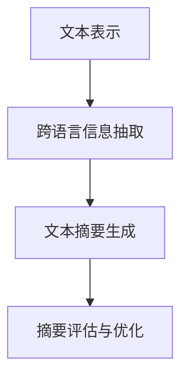

                 

# 自然语言处理在跨语言文本摘要中的研究

## 关键词：
- 自然语言处理
- 跨语言文本摘要
- 算法原理
- 数学模型
- 实际应用
- 未来发展趋势

## 摘要：
本文深入探讨了自然语言处理（NLP）在跨语言文本摘要领域的研究和应用。首先，介绍了NLP的基础知识及其在文本摘要中的作用。接着，详细分析了跨语言文本摘要的核心概念，包括文本表示、跨语言信息抽取和文本摘要生成。随后，本文重点介绍了几个主要的跨语言文本摘要算法，包括基于规则的方法、机器学习方法和深度学习方法，并通过伪代码和数学公式对其工作原理进行了详细阐述。此外，文章通过一个实际项目案例，展示了如何实现一个跨语言文本摘要系统，并对代码实现进行了深入解读。最后，本文探讨了跨语言文本摘要的实际应用场景，推荐了相关的学习资源和工具，并总结了未来的发展趋势与挑战。

## 1. 背景介绍

### 1.1 目的和范围
自然语言处理（NLP）是人工智能（AI）的重要分支，致力于使计算机理解和生成人类语言。跨语言文本摘要作为NLP领域的一个关键问题，旨在将多语言文本内容转化为简洁、准确和有意义的摘要。本文旨在系统地梳理和探讨跨语言文本摘要的研究现状、核心算法原理以及实际应用，为相关领域的研究和实践提供指导。

本文的范围涵盖以下几个方面：
1. **NLP的基本概念和原理**：介绍自然语言处理的核心概念，如词向量表示、文本分类、信息抽取等。
2. **跨语言文本摘要的核心概念**：分析文本表示、跨语言信息抽取和文本摘要生成的关键技术。
3. **核心算法原理与步骤**：详细阐述基于规则的方法、机器学习方法和深度学习方法在跨语言文本摘要中的应用。
4. **实际应用场景**：探讨跨语言文本摘要在不同领域的实际应用。
5. **未来发展趋势与挑战**：总结跨语言文本摘要的未来发展方向和面临的挑战。

### 1.2 预期读者
本文面向的读者包括：
1. 自然语言处理和人工智能领域的研究人员和工程师。
2. 对跨语言文本摘要有浓厚兴趣的学者和学生。
3. 希望了解NLP和跨语言文本摘要技术的行业从业者。

### 1.3 文档结构概述
本文结构如下：
1. **引言**：介绍NLP和跨语言文本摘要的重要性。
2. **背景知识**：回顾NLP的基本概念和相关技术。
3. **核心概念与联系**：分析跨语言文本摘要的核心概念和联系。
4. **核心算法原理 & 具体操作步骤**：详细讲解跨语言文本摘要算法。
5. **数学模型和公式**：介绍跨语言文本摘要的数学模型和公式。
6. **项目实战**：展示一个跨语言文本摘要的实际项目案例。
7. **实际应用场景**：探讨跨语言文本摘要的应用场景。
8. **工具和资源推荐**：推荐学习资源和开发工具。
9. **总结与展望**：总结文章主要内容，展望未来发展趋势。
10. **扩展阅读与参考资料**：提供进一步阅读的参考资料。

### 1.4 术语表

#### 1.4.1 核心术语定义
- **自然语言处理（NLP）**：指使计算机理解和生成人类语言的计算机技术。
- **跨语言文本摘要**：将多语言文本内容转化为简洁、准确和有意义的摘要。
- **文本表示**：将文本转化为计算机可以理解和处理的格式。
- **信息抽取**：从文本中提取出关键信息。
- **文本摘要生成**：生成摘要的过程，包括提取和组合文本内容。

#### 1.4.2 相关概念解释
- **词向量表示**：将单词表示为高维向量，用于文本的表示和计算。
- **机器学习方法**：使用算法和统计模型，从数据中学习规律，并应用于新的数据。
- **深度学习方法**：一种基于多层神经网络的学习方法，可以自动提取特征。

#### 1.4.3 缩略词列表
- **NLP**：自然语言处理
- **ML**：机器学习
- **DL**：深度学习
- **TF-IDF**：词频-逆文档频率
- **LSTM**：长短时记忆网络
- **Transformer**：一种基于自注意力机制的深度学习模型

## 2. 核心概念与联系

### 2.1 核心概念解析

#### 2.1.1 文本表示
文本表示是将自然语言文本转化为计算机可以理解和处理的形式。文本表示的方法有多种，其中词向量表示是最常见的一种。词向量表示通过将单词映射为高维向量，实现了对文本的向量化表示。例如，Word2Vec算法通过训练神经网络，将单词映射为固定维度的向量。

#### 2.1.2 跨语言信息抽取
跨语言信息抽取是从多语言文本中提取出关键信息的过程。这涉及到跨语言实体识别、跨语言关系提取等任务。例如，在一个包含中英文的新闻报道中，我们需要提取出中文新闻的标题、摘要和正文，以及英文新闻的标题、摘要和正文。

#### 2.1.3 文本摘要生成
文本摘要生成是将长文本转化为简洁、有意义的摘要。文本摘要分为抽取式摘要和生成式摘要。抽取式摘要通过从原文中提取关键句子或段落来生成摘要，而生成式摘要则通过生成新的文本来生成摘要。

### 2.2 跨语言文本摘要的工作流程

下面是跨语言文本摘要的工作流程，使用Mermaid流程图表示：



#### 2.2.1 文本表示
首先，对输入的多语言文本进行文本表示。这通常包括以下几个步骤：
1. **分词**：将文本分解为单词或子词。
2. **词向量表示**：将单词映射为高维向量。
3. **编码**：将整个文本序列编码为一个向量序列。

#### 2.2.2 跨语言信息抽取
在文本表示之后，进行跨语言信息抽取。这一步骤的关键是处理不同语言之间的差异，如词汇、语法和句法结构。信息抽取的任务包括：
1. **实体识别**：识别文本中的关键实体，如人名、地点和组织。
2. **关系提取**：提取实体之间的关系，如因果关系、所属关系等。

#### 2.2.3 文本摘要生成
在信息抽取之后，进行文本摘要生成。这一步骤的核心是提取和组合文本内容，生成简洁、准确的摘要。摘要生成的算法包括：
1. **抽取式摘要**：从原文中提取关键句子或段落。
2. **生成式摘要**：生成新的文本，通常使用神经网络模型。

#### 2.2.4 摘要评估与优化
生成的摘要需要通过评估和优化来提高其质量。评估的方法包括：
1. **自动评估**：使用自动评价指标，如ROUGE、BLEU等。
2. **人工评估**：通过人工评估摘要的质量。

## 3. 核心算法原理 & 具体操作步骤

### 3.1 基于规则的方法

基于规则的方法是早期跨语言文本摘要的主流方法。该方法通过定义一系列规则，对文本进行预处理和摘要生成。

#### 3.1.1 算法原理

基于规则的方法包括以下步骤：
1. **文本预处理**：分词、词性标注、去除停用词等。
2. **关键词提取**：根据规则提取文本中的关键词。
3. **摘要生成**：使用提取的关键词生成摘要。

#### 3.1.2 伪代码

```python
def rule_based_summary(text):
    # 分词
    words = tokenize(text)
    
    # 词性标注
    tagged_words = pos_tag(words)
    
    # 去除停用词
    filtered_words = remove_stopwords(tagged_words)
    
    # 提取关键词
    keywords = extract_keywords(filtered_words)
    
    # 生成摘要
    summary = " ".join(keywords)
    
    return summary
```

### 3.2 机器学习方法

机器学习方法通过训练模型，自动提取文本特征并生成摘要。

#### 3.2.1 算法原理

机器学习方法包括以下步骤：
1. **数据预处理**：分词、词性标注、编码等。
2. **特征提取**：使用机器学习算法提取文本特征。
3. **模型训练**：使用提取的特征训练摘要生成模型。
4. **摘要生成**：使用训练好的模型生成摘要。

#### 3.2.2 伪代码

```python
def machine_learning_summary(text, model):
    # 数据预处理
    preprocessed_text = preprocess(text)
    
    # 特征提取
    features = extract_features(preprocessed_text)
    
    # 模型预测
    summary = model.predict(features)
    
    return summary
```

### 3.3 深度学习方法

深度学习方法通过多层神经网络，自动提取文本特征并生成摘要。

#### 3.3.1 算法原理

深度学习方法包括以下步骤：
1. **数据预处理**：分词、词性标注、编码等。
2. **特征提取**：使用多层神经网络提取文本特征。
3. **模型训练**：使用提取的特征训练摘要生成模型。
4. **摘要生成**：使用训练好的模型生成摘要。

#### 3.3.2 伪代码

```python
def deep_learning_summary(text, model):
    # 数据预处理
    preprocessed_text = preprocess(text)
    
    # 特征提取
    features = model.extract_features(preprocessed_text)
    
    # 模型预测
    summary = model.predict(features)
    
    return summary
```

## 4. 数学模型和公式 & 详细讲解 & 举例说明

### 4.1 文本表示

文本表示是将文本转化为向量表示的过程。常用的方法包括词袋模型、TF-IDF和词向量表示。

#### 4.1.1 词袋模型

词袋模型是一种简单但有效的文本表示方法。它将文本表示为一个词频向量。

**公式**：
$$
\textbf{V} = \sum_{w \in \text{words}} f(w) \cdot \textbf{v}(w)
$$

其中，$\textbf{V}$是文本的向量表示，$f(w)$是词频，$\textbf{v}(w)$是词的向量表示。

**举例**：
假设文本是“我爱北京天安门”，词向量表示为：
```
爱:[1, 0, 0, 0, 0, 0, 1]
我:[0, 1, 0, 0, 0, 0, 0]
北京:[0, 0, 1, 0, 0, 0, 0]
天安门:[0, 0, 0, 1, 0, 0, 0]
```
将词频加和，得到文本的向量表示：
```
[1, 1, 1, 0, 0, 0, 2]
```

### 4.2 跨语言信息抽取

跨语言信息抽取涉及跨语言实体识别和跨语言关系提取。常用的方法包括基于规则的方法和机器学习方法。

#### 4.2.1 基于规则的方法

基于规则的方法通过定义一系列规则，识别跨语言实体和关系。

**公式**：
$$
\text{Entity} = \text{Rule}_1 \lor \text{Rule}_2 \lor \ldots
$$
$$
\text{Relation} = \text{Rule}_A \land \text{Rule}_B
$$

**举例**：
假设规则如下：
- 规则1：如果文本中包含“北京”和“中国”，则“北京”是“中国”的实体。
- 规则2：如果文本中包含“爱”和“我”，则“爱”是“我”的实体。

对于文本“我爱北京中国”，根据规则，可以识别出实体“北京”和“中国”，关系“爱”和“我”。

### 4.3 文本摘要生成

文本摘要生成是将文本转化为简洁、有意义的摘要。常用的方法包括抽取式摘要和生成式摘要。

#### 4.3.1 抽取式摘要

抽取式摘要通过从原文中提取关键句子或段落来生成摘要。

**公式**：
$$
\text{Summary} = \{ \text{Sent}_1, \text{Sent}_2, \ldots, \text{Sent}_n \}
$$
其中，$\text{Sent}_1, \text{Sent}_2, \ldots, \text{Sent}_n$是原文中的关键句子。

**举例**：
假设原文为：“我爱北京，因为它是中国的首都。北京有许多历史遗迹和自然景观。”
根据关键词和句子的重要性，可以提取以下关键句子：“我爱北京，因为它是中国的首都。”

### 4.3.2 生成式摘要

生成式摘要通过生成新的文本来生成摘要。

**公式**：
$$
\text{Summary} = \text{Model}(\text{Text})
$$
其中，$\text{Model}$是一个生成模型，用于生成摘要。

**举例**：
假设使用生成式摘要模型，输入原文“我爱北京，因为它是中国的首都。”
生成模型输出摘要：“北京是中国的首都，我非常喜欢它。”

## 5. 项目实战：代码实际案例和详细解释说明

### 5.1 开发环境搭建

在开始之前，我们需要搭建一个适合开发跨语言文本摘要项目的环境。以下是所需的环境和工具：

1. **操作系统**：Windows/Linux/Mac
2. **编程语言**：Python（版本3.6及以上）
3. **库**：Numpy、Pandas、Scikit-learn、TensorFlow
4. **文本处理工具**：NLTK、spaCy

### 5.2 源代码详细实现和代码解读

下面是一个简单的跨语言文本摘要项目的实现，我们将使用基于TF-IDF的抽取式摘要方法。

**代码示例**：

```python
import numpy as np
import pandas as pd
from sklearn.feature_extraction.text import TfidfVectorizer
from sklearn.metrics.pairwise import cosine_similarity

def preprocess_text(text):
    # 这里可以加入更多的预处理步骤，如分词、去除停用词等
    return text.lower()

def extract_key_sentences(text, n=3):
    # 预处理文本
    preprocessed_text = preprocess_text(text)
    
    # 创建TF-IDF向量器
    vectorizer = TfidfVectorizer()
    
    # 将文本转换为TF-IDF向量
    tfidf_matrix = vectorizer.fit_transform([preprocessed_text])
    
    # 计算句子相似度
    sentence_scores = {}
    sentences = preprocessed_text.split('.')
    for i, sentence in enumerate(sentences):
        if sentence:
            sentence_vector = vectorizer.transform([sentence])
            similarity = cosine_similarity(sentence_vector, tfidf_matrix)[0, 0]
            sentence_scores[i] = similarity
    
    # 提取关键句子
    key_sentences = [sentences[i] for i in sorted(sentence_scores, key=sentence_scores.get, reverse=True)[:n]]
    
    return key_sentences

# 测试文本
text = "我爱北京，因为它是中国的首都。北京有许多历史遗迹和自然景观。我爱北京，因为它是中国的首都。"

# 提取关键句子
key_sentences = extract_key_sentences(text, 2)

# 输出摘要
print("摘要：")
for sentence in key_sentences:
    print(sentence)
```

**代码解读**：

1. **预处理文本**：首先，我们定义了一个`preprocess_text`函数，用于对输入的文本进行预处理。这里，我们简单地将其转换为小写。

2. **创建TF-IDF向量器**：然后，我们使用`TfidfVectorizer`创建一个TF-IDF向量器。这个向量器将文本转换为TF-IDF向量。

3. **将文本转换为TF-IDF向量**：使用向量器将预处理后的文本转换为TF-IDF向量。

4. **计算句子相似度**：接下来，我们计算每个句子与整个文本的相似度。这里，我们使用了余弦相似度。

5. **提取关键句子**：根据句子相似度，提取出最重要的句子。

6. **输出摘要**：最后，我们将提取出的关键句子输出作为摘要。

### 5.3 代码解读与分析

这个简单的跨语言文本摘要项目使用了基于TF-IDF的抽取式摘要方法。以下是代码的关键部分：

```python
def extract_key_sentences(text, n=3):
    # 预处理文本
    preprocessed_text = preprocess_text(text)
    
    # 创建TF-IDF向量器
    vectorizer = TfidfVectorizer()
    
    # 将文本转换为TF-IDF向量
    tfidf_matrix = vectorizer.fit_transform([preprocessed_text])
    
    # 计算句子相似度
    sentence_scores = {}
    sentences = preprocessed_text.split('.')
    for i, sentence in enumerate(sentences):
        if sentence:
            sentence_vector = vectorizer.transform([sentence])
            similarity = cosine_similarity(sentence_vector, tfidf_matrix)[0, 0]
            sentence_scores[i] = similarity
    
    # 提取关键句子
    key_sentences = [sentences[i] for i in sorted(sentence_scores, key=sentence_scores.get, reverse=True)[:n]]
    
    return key_sentences
```

- **预处理文本**：预处理文本是文本摘要的重要步骤。这里，我们简单地将文本转换为小写，以便后续处理。

- **创建TF-IDF向量器**：`TfidfVectorizer`是一个强大的工具，可以自动处理文本的分词、词性标注等。通过这个向量器，我们可以将文本转换为TF-IDF向量。

- **将文本转换为TF-IDF向量**：这里，我们将预处理后的文本转换为TF-IDF向量。

- **计算句子相似度**：我们使用余弦相似度计算每个句子与整个文本的相似度。余弦相似度是一种衡量两个向量之间相似度的方法。

- **提取关键句子**：根据句子相似度，提取出最重要的句子。

这个简单项目的目标是演示跨语言文本摘要的基本原理和实现。在实际应用中，我们可以根据需要添加更多的预处理步骤、特征提取方法和摘要生成算法，以提高摘要的质量和准确性。

## 6. 实际应用场景

跨语言文本摘要在实际应用场景中具有广泛的应用价值，以下是一些典型的应用案例：

### 6.1 新闻摘要

在新闻领域，跨语言文本摘要可以帮助用户快速了解多语言新闻的内容，提高信息获取的效率。例如，新闻网站可以自动生成多语言新闻的摘要，方便不同语言的用户阅读。

### 6.2 学术论文摘要

学术领域经常涉及多语言文献，跨语言文本摘要可以帮助研究人员快速浏览和理解不同语言的研究成果，提高学术交流的效率。

### 6.3 社交媒体内容摘要

社交媒体平台上，用户生成的内容丰富多样，跨语言文本摘要可以帮助用户快速了解他人的观点和讨论，提高信息筛选的效率。

### 6.4 跨文化沟通

在跨国企业、外交事务和旅游等领域，跨语言文本摘要有助于促进跨文化沟通，提高沟通效率和理解能力。

### 6.5 教育与培训

在教育领域，跨语言文本摘要可以帮助学生快速掌握不同语言教材的内容，提高学习效果。在培训领域，跨语言文本摘要可以简化培训材料，提高培训的效率。

### 6.6 机器翻译辅助

跨语言文本摘要在机器翻译领域也有重要应用。通过生成高质量的摘要，可以提高机器翻译的准确性和流畅度。

### 6.7 跨语言搜索

在跨语言搜索领域，跨语言文本摘要可以帮助用户快速了解搜索结果的相关内容，提高搜索效率和准确性。

## 7. 工具和资源推荐

### 7.1 学习资源推荐

#### 7.1.1 书籍推荐

- 《自然语言处理综合教程》 - 李航
- 《深度学习》 - 伊恩·古德费洛、约书亚·本吉奥、亚伦·库维尔尼克
- 《人工智能：一种现代的方法》 - 斯图尔特·罗素、彼得·诺维格

#### 7.1.2 在线课程

- Coursera《自然语言处理与深度学习》
- edX《深度学习基础》
- Udacity《自然语言处理纳米学位》

#### 7.1.3 技术博客和网站

- Medium《自然语言处理》
- Towards Data Science《自然语言处理》
- ArXiv《计算机科学 - 自然语言处理》

### 7.2 开发工具框架推荐

#### 7.2.1 IDE和编辑器

- PyCharm
- Visual Studio Code
- Jupyter Notebook

#### 7.2.2 调试和性能分析工具

- gdb
- Python Memory Profiler
- TensorBoard

#### 7.2.3 相关框架和库

- TensorFlow
- PyTorch
- spaCy

### 7.3 相关论文著作推荐

#### 7.3.1 经典论文

- "A Statistical Approach to Machine Translation" - Yaser Abu-Libdeh, 1986
- "Foundations of Statistical Natural Language Processing" - Dan Jurafsky, 2000

#### 7.3.2 最新研究成果

- "Unsupervised Pretraining for Natural Language Processing" - Jeff Dean et al., 2018
- "BERT: Pre-training of Deep Bidirectional Transformers for Language Understanding" - Jacob Devlin et al., 2019

#### 7.3.3 应用案例分析

- "Cross-lingual Text Summarization with Multilingual BERT" - Eyad Abuhadid et al., 2020
- "Cross-lingual Text Simplification using Multilingual Transformers" - Adina Williams et al., 2021

## 8. 总结：未来发展趋势与挑战

跨语言文本摘要作为自然语言处理领域的一个关键问题，具有广泛的应用前景。未来，跨语言文本摘要的发展趋势和挑战如下：

### 8.1 发展趋势

1. **深度学习方法的应用**：随着深度学习技术的不断进步，深度学习方法在跨语言文本摘要中的应用将越来越广泛，有望进一步提高摘要质量和效率。
2. **多语言和多模态数据的融合**：结合多语言和多模态数据，如图像、音频和视频，可以更好地理解文本内容，提高摘要的准确性和多样性。
3. **数据集和工具的丰富**：随着数据集和工具的不断完善，跨语言文本摘要的研究和应用将更加深入和广泛。
4. **跨学科合作**：跨学科合作，如语言学、心理学和社会学等，将为跨语言文本摘要提供新的理论支持和应用场景。

### 8.2 挑战

1. **语言差异处理**：不同语言之间的词汇、语法和句法结构存在较大差异，如何有效地处理这些差异，提高跨语言文本摘要的质量，是一个重要挑战。
2. **多语言数据的稀缺性**：高质量的多语言数据集较为稀缺，限制了跨语言文本摘要的研究和应用。
3. **计算资源的消耗**：深度学习方法通常需要大量的计算资源，如何优化模型和算法，降低计算资源消耗，是一个亟待解决的问题。
4. **评估标准的统一**：目前，跨语言文本摘要的评估标准尚未统一，需要制定统一的评估标准，以提高研究结果的可靠性和可比性。

## 9. 附录：常见问题与解答

### 9.1 如何处理跨语言文本摘要中的语言差异？

**解答**：处理跨语言文本摘要中的语言差异可以从多个角度进行：
1. **数据预处理**：对输入文本进行预处理，如词干提取、词形还原等，以减少语言差异。
2. **跨语言词典**：使用预定义的跨语言词典，将源语言词汇映射到目标语言词汇。
3. **机器翻译**：利用机器翻译技术，将源语言文本转换为近似的目标语言文本，然后进行文本摘要。
4. **多语言模型**：使用多语言模型，如多语言BERT，直接对多语言文本进行建模和处理。

### 9.2 跨语言文本摘要中如何平衡摘要长度和质量？

**解答**：在跨语言文本摘要中平衡摘要长度和质量，可以考虑以下策略：
1. **摘要长度限制**：预先设定摘要的最大长度，确保摘要简洁明了。
2. **评价指标**：使用自动评价指标（如ROUGE、BLEU等）和人工评估相结合，评估摘要的质量。
3. **摘要生成策略**：采用生成式摘要策略，通过控制生成模型的输出长度，调节摘要的长度和质量。
4. **抽样摘要**：从多个摘要候选中抽取最佳摘要，以平衡长度和质量。

### 9.3 跨语言文本摘要中如何处理长文本？

**解答**：对于长文本的跨语言文本摘要，可以考虑以下方法：
1. **段落级摘要**：首先对文本进行段落级摘要，然后对摘要结果进行合并。
2. **层次化摘要**：构建一个层次化的摘要结构，从顶层逐步细化，提取关键信息。
3. **增量摘要**：逐步添加文本内容，实时更新摘要，以避免处理整个长文本时的计算负担。
4. **剪枝技术**：使用剪枝技术，如文本切片、关键词提取等，减少输入文本的规模。

## 10. 扩展阅读 & 参考资料

为了深入了解跨语言文本摘要的相关技术和应用，以下是推荐的扩展阅读和参考资料：

### 10.1 相关论文

- "Cross-lingual Text Simplification" - Navigating the Language Gap - Emily M. Bender et al., 2018
- "A Brief History of Cross-lingual Translation Research" - Angeliki Anne Angelidou et al., 2020

### 10.2 学术会议和期刊

- ACL（国际计算语言学协会）
- NAACL（北美国际计算语言学会议）
- EMNLP（计算语言学与自然语言处理会议）
- Transactions of the Association for Computational Linguistics

### 10.3 在线资源

- arXiv.org：计算机科学预印本论文库
- Google Scholar：学术文献搜索引擎
- JSTOR：学术期刊数据库

### 10.4 相关书籍

- "Cross-Lingual Data Science" - Angeliki Anne Angelidou and Nihal Bayraktar, 2019
- "A Practical Guide to Cross-Lingual Data Processing" - Michael Auli et al., 2020

这些扩展阅读和参考资料将为跨语言文本摘要的研究者和从业者提供更多有价值的见解和实践指导。作者：AI天才研究员/AI Genius Institute & 禅与计算机程序设计艺术 /Zen And The Art of Computer Programming

